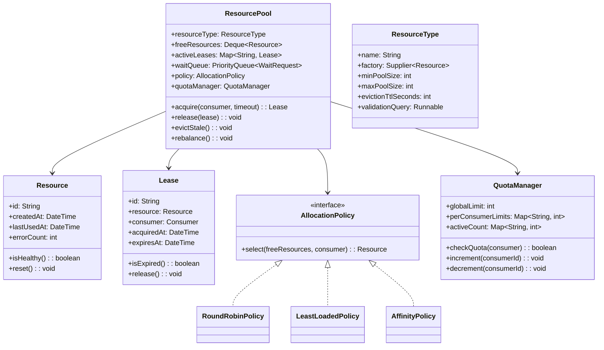

# Design a Resource Management System (OOD)

**Difficulty**: 🔴 Advanced
**Codemania**: #126
**Interview Frequency**: Medium

---

## Problem Statement

Design a generic resource pool (think database connection pool, thread pool, or GPU buffer pool) that manages expensive-to-create resources — acquire, use, release, and evict stale resources. The OOD challenge: acquisition policies vary (round-robin vs least-loaded vs consumer-affinity); the lifecycle (create → validate → acquire → use → release → evict) is a fixed protocol with variable steps; quota enforcement and exhaustion alerting must not pollute the core pool logic.

---

## Functional Requirements

- Consumers acquire a resource; pool allocates or waits if none available
- Resources released back to pool after use (cannot be permanently held)
- Pool enforces per-consumer and global quotas
- Idle resources evicted after configurable timeout
- Pool auto-scales between min and max size
- Alert when pool is exhausted or error rate exceeds threshold

---

## Core Entities

| Class | Responsibility |
|-------|---------------|
| `ResourcePool` | Root: manages free list, wait queue, lifecycle, scaling |
| `Resource` | Managed object (DB connection, thread, buffer); created by factory |
| `Consumer` | Caller acquiring resources; has ID for affinity/quota |
| `AllocationPolicy` | Interface: picks which free resource to give to a consumer |
| `QuotaManager` | Enforces per-consumer and global limits |
| `ResourceType` | Descriptor: factory function, min/max pool size, eviction TTL |
| `Lease` | Handle given to consumer; bounds the acquire/release contract |
| `PoolObserver` | Reacts to pool exhaustion, high error rate, eviction |

---

## Class Diagram



---

## Design Patterns Used

### 1. Object Pool Pattern

**Why it fits**: Creating a database connection takes ~50-200 ms; creating a thread requires kernel context. Pooling pre-created resources reduces acquisition to microseconds. The pool recycles resources rather than destroying and recreating them on each use — the core pattern here.

```
class ResourcePool:
  acquire(consumer: Consumer, timeout: Duration): Lease
    // 1. Quota check
    if not quotaManager.checkQuota(consumer):
      throw QuotaExceededException(consumer)

    // 2. Try to get a free resource immediately
    resource = tryAcquireImmediate(consumer)
    if resource != null:
      return createLease(resource, consumer)

    // 3. Pool exhausted — can we grow?
    if totalSize() < resourceType.maxPoolSize:
      resource = createNewResource()
      return createLease(resource, consumer)

    // 4. Wait in queue
    waitRequest = new WaitRequest(consumer, timeout)
    waitQueue.enqueue(waitRequest)
    resource = waitRequest.awaitResource(timeout)
    if resource == null:
      waitQueue.remove(waitRequest)
      throw AcquisitionTimeoutException(timeout)

    return createLease(resource, consumer)

  tryAcquireImmediate(consumer): Resource
    if freeResources.isEmpty(): return null
    resource = policy.select(freeResources, consumer)
    freeResources.remove(resource)
    quotaManager.increment(consumer.id)
    return resource
```

### 2. Strategy — Allocation Policy

**Why it fits**: A database pool uses round-robin to distribute load evenly; a session-affinity scenario prefers returning the same resource to the same consumer (warm cache); a network pool picks least-connected. The allocation decision is injectable.

```
interface AllocationPolicy:
  select(freeResources: Deque<Resource>, consumer: Consumer): Resource

RoundRobinPolicy:
  index: int

  select(freeResources, consumer):
    list = freeResources.toList()
    chosen = list[index % list.size()]
    index++
    return chosen

LeastLoadedPolicy:
  select(freeResources, consumer):
    return freeResources.min(r -> r.errorCount)

AffinityPolicy:
  lastUsed: Map<String, String>  // consumerId -> resourceId

  select(freeResources, consumer):
    preferred = lastUsed[consumer.id]
    if preferred != null:
      r = freeResources.find(r -> r.id == preferred)
      if r != null: return r
    return freeResources.first()  // fallback
```

### 3. Template Method — Resource Lifecycle

**Why it fits**: Every resource type follows: create → validate → use → reset → validate-before-return → release. Only the `create()` and `validate()` steps differ by resource type. Template Method pins the lifecycle in the base pool; subclasses override the two variable steps.

```
abstract class ResourceLifecycleManager:
  createAndValidate(): Resource
    resource = create()            // hook: type-specific factory
    if not validate(resource):
      resource.close()
      throw ResourceCreationFailedException()
    return resource

  releaseBack(resource: Resource): void
    resource.reset()               // hook: type-specific cleanup
    if validate(resource):         // hook: health check
      freeResources.addLast(resource)
      resource.lastUsedAt = now()
    else:
      resource.close()
      replaceAsync()               // replace dead resource

  abstract create(): Resource
  abstract validate(resource: Resource): boolean
  abstract reset(resource: Resource): void

class DBConnectionPoolManager extends ResourceLifecycleManager:
  create(): Resource
    conn = DriverManager.getConnection(jdbcUrl, user, password)
    return new DBConnectionResource(conn)

  validate(resource: Resource): boolean
    return resource.asConnection().isValid(timeout = 1)

  reset(resource: Resource): void
    resource.asConnection().setAutoCommit(true)
    resource.asConnection().clearWarnings()
```

### 4. Observer — Pool Exhaustion and Error Alerts

**Why it fits**: When the pool is fully allocated with waiters queued, operations teams must be alerted. When error rate on resources spikes, SRE needs a page. Observer decouples the pool from monitoring systems — new alerting channels subscribe without changing pool logic.

```
class ResourcePool:
  observers: List<PoolObserver>

  acquire(consumer, timeout): Lease
    // ... see above ...
    if waitQueue.size() > ALERT_THRESHOLD:
      publish(PoolExhaustionEvent(this, waitQueue.size()))
    return lease

  release(lease: Lease): void
    lease.resource.lastUsedAt = now()
    if lease.isExpired() or not lease.resource.isHealthy():
      publish(ResourceErrorEvent(lease.resource))
      lease.resource.close()
      replaceAsync()
    else:
      releaseBack(lease.resource)
    quotaManager.decrement(lease.consumer.id)
    drainWaitQueue()

  publish(event): void
    for obs in observers: obs.onEvent(event)
```

---

## Key Method: `evictStale()`

```
ResourcePool:
  evictStale(): void
    evictionCutoff = now().minus(resourceType.evictionTtlSeconds)
    toEvict = freeResources.filter(r -> r.lastUsedAt < evictionCutoff)

    for resource in toEvict:
      freeResources.remove(resource)
      resource.close()
      totalSize--
      publish(EvictionEvent(resource))

    // Maintain minimum pool size — replace evicted resources
    while totalSize() < resourceType.minPoolSize:
      resource = createAndValidate()
      freeResources.addLast(resource)
      totalSize++
```

---

## Design Decisions & Trade-offs

| Decision | Option A | Option B | Choice |
|----------|----------|----------|--------|
| Pool sizing | Fixed size | Elastic (min/max) | Elastic — adapt to load; prevents both waste and exhaustion |
| Waiter queue | FIFO | Priority by consumer tier | FIFO default; priority lane for high-SLA consumers optional |
| Validation timing | On acquire | On return | On return (with async on-acquire re-check) — catches broken connections before next use |
| Eviction trigger | TTL timer | LRU counter | TTL — simpler; LRU for memory-sensitive resources |
| Lease expiry | Enforced (return forced) | Advisory (consumer warned) | Enforced with grace period — prevents zombie leases |

---

## Top Interview Questions

| Question | What It Tests |
|----------|--------------|
| A consumer acquires a resource and crashes without releasing it — how does the pool recover? | Lease expiry, health check eviction |
| How do you prevent pool exhaustion when 1000 requests arrive simultaneously? | Waiter queue, quota manager, backpressure |
| How would you add a priority lane so premium consumers always get resources first? | Priority queue, consumer tier in AllocationPolicy |

---

## Related Concepts

- [Entity-Component-System OOD for dense array pool storage](./entity-component-system)
- [Warehouse Management OOD for similar allocation-and-release pattern](./warehouse-management)

---

## 📚 Resources & References

| Resource | Type | What You'll Learn |
|----------|------|------------------|
| [NeetCode OOD Playlist](https://www.youtube.com/@NeetCode) | 📺 YouTube | Object Pool and Strategy walkthroughs |
| [Game Programming Patterns — Object Pool](https://gameprogrammingpatterns.com/object-pool.html) | 📖 Blog | Object Pool pattern rationale and implementation |
| [ByteByteGo System Design](https://www.youtube.com/@ByteByteGo) | 📺 YouTube | Connection pool and resource management |
| [Head First Design Patterns](https://www.oreilly.com/library/view/head-first-design/0596007124/) | 📚 Book | Template Method and Observer chapters |
| [GoF Design Patterns](https://www.amazon.com/Design-Patterns-Elements-Reusable-Object-Oriented/dp/0201633612) | 📚 Book | Flyweight (similar to pool), Strategy reference |
