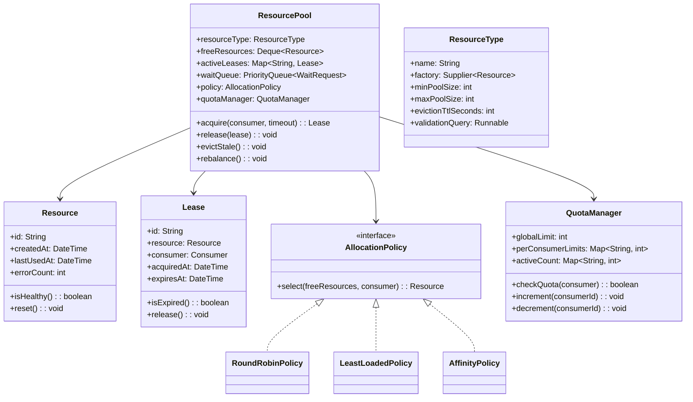
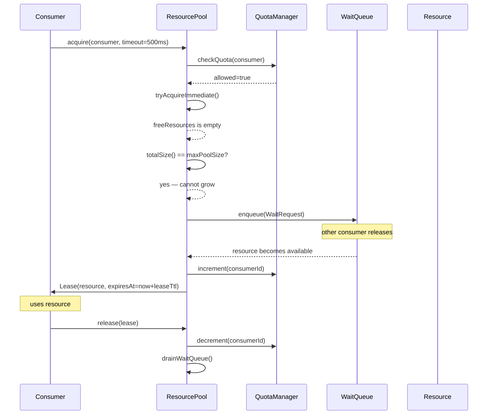
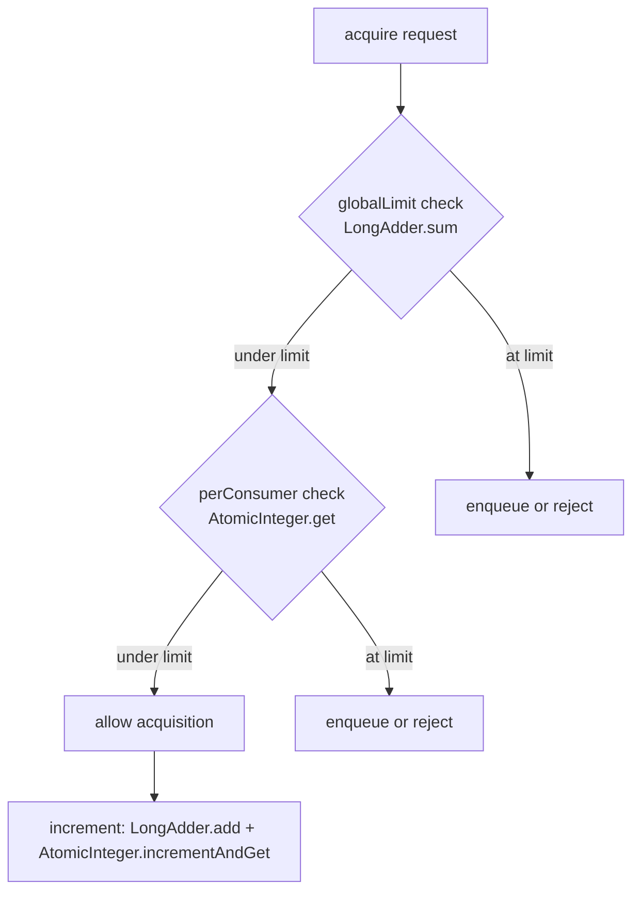
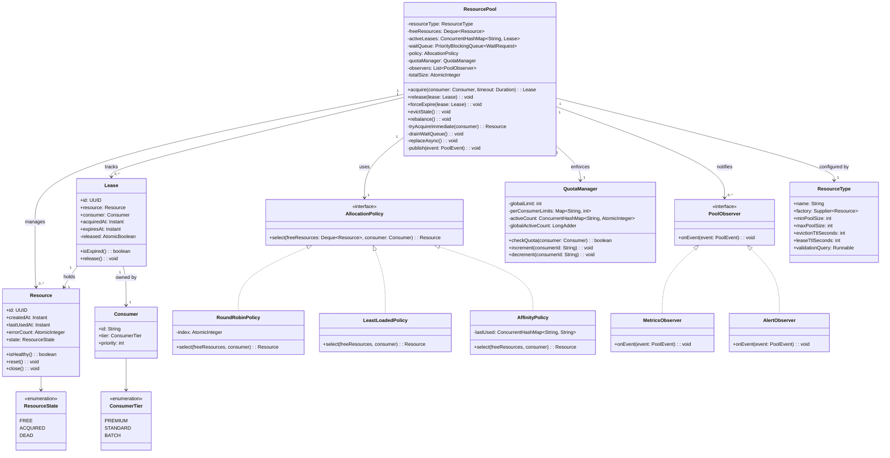

# Design a Resource Management System (OOD)

**Difficulty**: 🔴 Advanced
**Codemania**: #126
**Interview Frequency**: Medium

---

## Problem Statement

Design a generic resource pool (think database connection pool, thread pool, or GPU buffer pool) that manages expensive-to-create resources — acquire, use, release, and evict stale resources. The OOD challenge: acquisition policies vary (round-robin vs least-loaded vs consumer-affinity); the lifecycle (create → validate → acquire → use → release → evict) is a fixed protocol with variable steps; quota enforcement and exhaustion alerting must not pollute the core pool logic.

---

## Functional Requirements

- Consumers acquire a resource; pool allocates or waits if none available
- Resources released back to pool after use (cannot be permanently held)
- Pool enforces per-consumer and global quotas
- Idle resources evicted after configurable timeout
- Pool auto-scales between min and max size
- Alert when pool is exhausted or error rate exceeds threshold

---

## Core Entities

| Class | Responsibility |
|-------|---------------|
| `ResourcePool` | Root: manages free list, wait queue, lifecycle, scaling |
| `Resource` | Managed object (DB connection, thread, buffer); created by factory |
| `Consumer` | Caller acquiring resources; has ID for affinity/quota |
| `AllocationPolicy` | Interface: picks which free resource to give to a consumer |
| `QuotaManager` | Enforces per-consumer and global limits |
| `ResourceType` | Descriptor: factory function, min/max pool size, eviction TTL |
| `Lease` | Handle given to consumer; bounds the acquire/release contract |
| `PoolObserver` | Reacts to pool exhaustion, high error rate, eviction |

---

## Class Diagram



---

## Design Patterns Used

### 1. Object Pool Pattern

**Why it fits**: Creating a database connection takes ~50-200 ms; creating a thread requires kernel context. Pooling pre-created resources reduces acquisition to microseconds. The pool recycles resources rather than destroying and recreating them on each use — the core pattern here.

```
class ResourcePool:
  acquire(consumer: Consumer, timeout: Duration): Lease
    // 1. Quota check
    if not quotaManager.checkQuota(consumer):
      throw QuotaExceededException(consumer)

    // 2. Try to get a free resource immediately
    resource = tryAcquireImmediate(consumer)
    if resource != null:
      return createLease(resource, consumer)

    // 3. Pool exhausted — can we grow?
    if totalSize() < resourceType.maxPoolSize:
      resource = createNewResource()
      return createLease(resource, consumer)

    // 4. Wait in queue
    waitRequest = new WaitRequest(consumer, timeout)
    waitQueue.enqueue(waitRequest)
    resource = waitRequest.awaitResource(timeout)
    if resource == null:
      waitQueue.remove(waitRequest)
      throw AcquisitionTimeoutException(timeout)

    return createLease(resource, consumer)

  tryAcquireImmediate(consumer): Resource
    if freeResources.isEmpty(): return null
    resource = policy.select(freeResources, consumer)
    freeResources.remove(resource)
    quotaManager.increment(consumer.id)
    return resource
```

### 2. Strategy — Allocation Policy

**Why it fits**: A database pool uses round-robin to distribute load evenly; a session-affinity scenario prefers returning the same resource to the same consumer (warm cache); a network pool picks least-connected. The allocation decision is injectable.

```
interface AllocationPolicy:
  select(freeResources: Deque<Resource>, consumer: Consumer): Resource

RoundRobinPolicy:
  index: int

  select(freeResources, consumer):
    list = freeResources.toList()
    chosen = list[index % list.size()]
    index++
    return chosen

LeastLoadedPolicy:
  select(freeResources, consumer):
    return freeResources.min(r -> r.errorCount)

AffinityPolicy:
  lastUsed: Map<String, String>  // consumerId -> resourceId

  select(freeResources, consumer):
    preferred = lastUsed[consumer.id]
    if preferred != null:
      r = freeResources.find(r -> r.id == preferred)
      if r != null: return r
    return freeResources.first()  // fallback
```

### 3. Template Method — Resource Lifecycle

**Why it fits**: Every resource type follows: create → validate → use → reset → validate-before-return → release. Only the `create()` and `validate()` steps differ by resource type. Template Method pins the lifecycle in the base pool; subclasses override the two variable steps.

```
abstract class ResourceLifecycleManager:
  createAndValidate(): Resource
    resource = create()            // hook: type-specific factory
    if not validate(resource):
      resource.close()
      throw ResourceCreationFailedException()
    return resource

  releaseBack(resource: Resource): void
    resource.reset()               // hook: type-specific cleanup
    if validate(resource):         // hook: health check
      freeResources.addLast(resource)
      resource.lastUsedAt = now()
    else:
      resource.close()
      replaceAsync()               // replace dead resource

  abstract create(): Resource
  abstract validate(resource: Resource): boolean
  abstract reset(resource: Resource): void

class DBConnectionPoolManager extends ResourceLifecycleManager:
  create(): Resource
    conn = DriverManager.getConnection(jdbcUrl, user, password)
    return new DBConnectionResource(conn)

  validate(resource: Resource): boolean
    return resource.asConnection().isValid(timeout = 1)

  reset(resource: Resource): void
    resource.asConnection().setAutoCommit(true)
    resource.asConnection().clearWarnings()
```

### 4. Observer — Pool Exhaustion and Error Alerts

**Why it fits**: When the pool is fully allocated with waiters queued, operations teams must be alerted. When error rate on resources spikes, SRE needs a page. Observer decouples the pool from monitoring systems — new alerting channels subscribe without changing pool logic.

```
class ResourcePool:
  observers: List<PoolObserver>

  acquire(consumer, timeout): Lease
    // ... see above ...
    if waitQueue.size() > ALERT_THRESHOLD:
      publish(PoolExhaustionEvent(this, waitQueue.size()))
    return lease

  release(lease: Lease): void
    lease.resource.lastUsedAt = now()
    if lease.isExpired() or not lease.resource.isHealthy():
      publish(ResourceErrorEvent(lease.resource))
      lease.resource.close()
      replaceAsync()
    else:
      releaseBack(lease.resource)
    quotaManager.decrement(lease.consumer.id)
    drainWaitQueue()

  publish(event): void
    for obs in observers: obs.onEvent(event)
```

---

## Key Method: `evictStale()`

```
ResourcePool:
  evictStale(): void
    evictionCutoff = now().minus(resourceType.evictionTtlSeconds)
    toEvict = freeResources.filter(r -> r.lastUsedAt < evictionCutoff)

    for resource in toEvict:
      freeResources.remove(resource)
      resource.close()
      totalSize--
      publish(EvictionEvent(resource))

    // Maintain minimum pool size — replace evicted resources
    while totalSize() < resourceType.minPoolSize:
      resource = createAndValidate()
      freeResources.addLast(resource)
      totalSize++
```

---

## Design Decisions & Trade-offs

| Decision | Option A | Option B | Choice |
|----------|----------|----------|--------|
| Pool sizing | Fixed size | Elastic (min/max) | Elastic — adapt to load; prevents both waste and exhaustion |
| Waiter queue | FIFO | Priority by consumer tier | FIFO default; priority lane for high-SLA consumers optional |
| Validation timing | On acquire | On return | On return (with async on-acquire re-check) — catches broken connections before next use |
| Eviction trigger | TTL timer | LRU counter | TTL — simpler; LRU for memory-sensitive resources |
| Lease expiry | Enforced (return forced) | Advisory (consumer warned) | Enforced with grace period — prevents zombie leases |

---

## Top Interview Questions

| Question | What It Tests |
|----------|--------------|
| A consumer acquires a resource and crashes without releasing it — how does the pool recover? | Lease expiry, health check eviction |
| How do you prevent pool exhaustion when 1000 requests arrive simultaneously? | Waiter queue, quota manager, backpressure |
| How would you add a priority lane so premium consumers always get resources first? | Priority queue, consumer tier in AllocationPolicy |

---

## Related Concepts

- [Entity-Component-System OOD for dense array pool storage](./entity-component-system)
- [Warehouse Management OOD for similar allocation-and-release pattern](./warehouse-management)

---

## Component Deep Dive 1: ResourcePool — The Core Allocation Engine

The `ResourcePool` is the most critical component: it is the concurrency hotspot, the quota enforcer, the wait queue coordinator, and the lifecycle orchestrator — all in one class. Getting its internals right determines whether the system scales from 100 to 100,000 concurrent consumers.

### Internal State Machine

Every resource moves through a strict state machine. A naive approach that tracks resources with a simple boolean `inUse` flag fails immediately at scale: it cannot distinguish between "idle and healthy", "idle but stale", "in use and expired", and "in use but the consumer crashed". Each state transition must be atomic.

```
FREE → ACQUIRED  (acquire() with quota check)
ACQUIRED → FREE  (release(), resource passes validation)
ACQUIRED → DEAD  (release(), resource fails validation OR lease expired)
FREE → DEAD      (evictStale(), TTL exceeded)
DEAD → FREE      (replaceAsync() creates new resource to maintain minPoolSize)
```

The pool maintains two primary data structures:

- **`freeResources: Deque<Resource>`** — a double-ended queue; new resources are added to the tail, selected from the head (FIFO fairness) or by policy (strategy)
- **`activeLeases: ConcurrentHashMap<String, Lease>`** — maps leaseId → Lease, enabling O(1) forced expiry of zombie leases by a background reaper thread

A critical internal method is `drainWaitQueue()`, called immediately after every `release()`. Without it, waiting consumers stay blocked indefinitely even when resources are available:

```
drainWaitQueue(): void
  while not waitQueue.isEmpty() and not freeResources.isEmpty():
    waitRequest = waitQueue.peek()
    if waitRequest.isExpired():
      waitQueue.poll()
      waitRequest.fail(AcquisitionTimeoutException)
      continue
    if quotaManager.checkQuota(waitRequest.consumer):
      resource = policy.select(freeResources, waitRequest.consumer)
      freeResources.remove(resource)
      quotaManager.increment(waitRequest.consumer.id)
      waitQueue.poll()
      lease = createLease(resource, waitRequest.consumer)
      waitRequest.fulfill(lease)
    else:
      break  // consumer at quota — skip, let next waiter try
```

The `break` on quota failure is a subtle but important choice: without it, a quota-saturated consumer blocks all waiters behind it. A more sophisticated implementation would skip quota-exhausted consumers and continue scanning, but at the cost of O(n) scan per drain. In most production pools the simpler `break` is acceptable because quota exhaustion is rare in steady state.

### Sequence: Acquire with Contention



### Allocation Policy Implementation Trade-offs

| Approach | Latency | Throughput | Trade-off |
|----------|---------|------------|-----------|
| **RoundRobin** | O(1) — index mod | High — no scanning | No affinity; warm-cache misses for session-scoped resources |
| **LeastLoaded** (min errorCount) | O(n) — scan free list | Medium — degrades as pool grows | Better health distribution; n=pool size so manageable if pool < 500 |
| **AffinityPolicy** (consumer→resource map) | O(1) happy path, O(n) miss | High when hit rate > 80% | Map grows unbounded; needs LRU eviction or TTL on affinity entries |

For database connection pools (HikariCP-style), RoundRobin wins — DB connections are stateless between requests. For stateful resources like GPU contexts or warm ML model instances, AffinityPolicy can reduce 200ms warm-up overhead per request.

---

## Component Deep Dive 2: QuotaManager — Fair Allocation Under Load

The `QuotaManager` is the gatekeeper that prevents one consumer from monopolizing the pool. Without it, a single misbehaving consumer (a runaway batch job, a misconfigured service) can exhaust the pool and starve every other consumer.

### Two-Level Quota Enforcement

The `QuotaManager` enforces at two levels simultaneously:

1. **Global quota**: `globalLimit` — total resources that can be in active use at once (== `maxPoolSize` in the simple case, but can be lower to reserve headroom for high-priority consumers)
2. **Per-consumer quota**: `perConsumerLimits[consumerId]` — max resources any single consumer can hold simultaneously

```
QuotaManager:
  checkQuota(consumer: Consumer): boolean
    // Check global
    totalActive = activeCount.values().sum()
    if totalActive >= globalLimit: return false

    // Check per-consumer
    consumerActive = activeCount.getOrDefault(consumer.id, 0)
    limit = perConsumerLimits.getOrDefault(consumer.id, defaultConsumerLimit)
    return consumerActive < limit

  increment(consumerId: String): void
    activeCount.merge(consumerId, 1, Integer::sum)

  decrement(consumerId: String): void
    activeCount.merge(consumerId, -1, Integer::sum)
    if activeCount[consumerId] <= 0:
      activeCount.remove(consumerId)  // prevent unbounded map growth
```

### Scale Behavior at 10x Load

At 10x baseline load (e.g., 1,000 concurrent acquire calls instead of 100), the `checkQuota` method becomes a contention point if implemented naively with a single synchronized counter. The fix is to use `AtomicInteger` per consumer combined with a `LongAdder` for the global count — `LongAdder` distributes increments across CPU-local cells and only merges on read, reducing CAS contention by 10–50x under high parallelism.



A priority tier system can be layered on top: premium consumers get a `perConsumerLimits` ceiling of 50% of `globalLimit`, while standard consumers cap at 10%. This ensures SLA tiers without requiring separate pools.

---

## Component Deep Dive 3: Lease — Bounded Ownership Contract

The `Lease` object is the contract between the pool and the consumer. It is the mechanism that prevents zombie resources — resources held by crashed or slow consumers that never release.

### Lease Internals

```
class Lease:
  id: UUID              // globally unique, used as key in activeLeases map
  resource: Resource    // the held resource
  consumer: Consumer    // who holds it
  acquiredAt: Instant   // for audit and SLA tracking
  expiresAt: Instant    // now() + leaseTtl (configured per ResourceType)
  released: AtomicBoolean = false  // idempotent release guard

  isExpired(): boolean
    return Instant.now().isAfter(expiresAt)

  release(): void
    if released.compareAndSet(false, true):
      pool.release(this)
    // else: no-op — double-release is safe
```

The `AtomicBoolean` guard on `released` is critical: without it, a consumer that calls `release()` twice (a common bug) could return the same resource to the free list twice, causing two consumers to hold a reference to the same resource simultaneously — a data corruption bug.

A background **LeaseReaper** thread runs every `leaseTtl / 2` milliseconds, scans `activeLeases`, and force-evicts expired leases:

```
LeaseReaper (runs every leaseTtl/2):
  for lease in activeLeases.values():
    if lease.isExpired():
      pool.forceExpire(lease)
      publish(LeaseExpiredEvent(lease.consumer, lease.resource))
```

Force-expiry marks the resource as `DEAD` rather than returning it to the free pool — an expired lease means the consumer held the resource longer than allowed, which typically indicates resource corruption (uncommitted DB transactions, half-written buffers). The resource is discarded and replaced asynchronously.

---

## Class Design (Full)



---

## Design Patterns Applied

### Object Pool Pattern
Pre-allocates expensive resources and recycles them. Acquisition cost drops from 50–200ms (DB connection creation) to ~1µs (dequeue from free list). The pool handles the full lifecycle: create, validate, reset, recycle, evict.

### Strategy Pattern (AllocationPolicy)
The selection algorithm is an injectable strategy. `RoundRobinPolicy`, `LeastLoadedPolicy`, and `AffinityPolicy` are interchangeable without touching `ResourcePool`. New policies (e.g., `WeightedRandomPolicy`, `HealthScorePolicy`) are added without modifying existing code — **Open/Closed Principle** in action.

### Template Method Pattern (ResourceLifecycleManager)
The lifecycle protocol (create → validate → use → reset → re-validate → release) is fixed in the abstract base class. Only `create()`, `validate()`, and `reset()` are abstract hooks. `DBConnectionPoolManager`, `ThreadPoolManager`, and `GPUBufferPoolManager` override only those three methods while inheriting the full lifecycle protocol.

### Observer Pattern (PoolObserver)
`MetricsObserver` emits Prometheus counters; `AlertObserver` fires PagerDuty webhooks; `AuditObserver` writes lease events to an audit log. All subscribe to the same `PoolEvent` stream without coupling to `ResourcePool`. New observability hooks are added by registering a new observer — zero pool code changes required.

---

## SOLID Principles

**Single Responsibility**: `ResourcePool` manages lifecycle and coordination; `QuotaManager` handles only quota arithmetic; `AllocationPolicy` handles only selection. None of these classes know about metrics or alerting — that is `PoolObserver`'s concern.

**Open/Closed**: New allocation strategies (add `WeightedPolicy implements AllocationPolicy`) and new observers (`SlackAlertObserver implements PoolObserver`) extend the system without modifying `ResourcePool`.

**Liskov Substitution**: Any `AllocationPolicy` implementation can replace another without breaking `ResourcePool.acquire()`. The caller never depends on concrete policy behavior.

**Interface Segregation**: `PoolObserver` has a single `onEvent()` method. If we had mixed observer responsibilities (e.g., some observers handle eviction events, others handle exhaustion events), we would split into `EvictionObserver` and `ExhaustionObserver` to avoid forcing empty implementations.

**Dependency Inversion**: `ResourcePool` depends on `AllocationPolicy` (interface) and `QuotaManager` (injectable), not on concrete `RoundRobinPolicy` or specific quota logic. Construction happens at the factory/DI-container level.

---

## Concurrency and Thread Safety

The resource pool is a shared mutable object. Multiple threads call `acquire()` and `release()` concurrently. The following operations must be atomic or isolated:

| Operation | Mechanism | Why |
|-----------|-----------|-----|
| `freeResources.poll()` | `LinkedBlockingDeque` (thread-safe) | Prevents two threads from acquiring same resource |
| `activeLeases.put/remove` | `ConcurrentHashMap` | Lock-free reads; fine-grained segment locks on write |
| `quotaManager.increment/decrement` | `AtomicInteger` per consumer + `LongAdder` global | Avoids global mutex; scales with core count |
| `drainWaitQueue` | Called from `release()` under no lock; WaitRequest uses `CompletableFuture` | Avoids holding pool lock while notifying waiters |
| `evictStale` (background thread) | Iterates snapshot of `freeResources`; eviction is idempotent | Prevents ConcurrentModificationException |
| `Lease.release()` double-call guard | `AtomicBoolean.compareAndSet` | Idempotency — safe to call twice |

The most dangerous race condition is **double-acquisition**: thread A selects resource R from `freeResources`; before it removes R, thread B also selects R. Using `LinkedBlockingDeque.pollFirst()` (atomic remove-and-return) instead of `peek()` + `remove()` eliminates this race entirely.

---

## Extension Points

**Adding a priority lane for premium consumers**: Extend `WaitQueue` from a FIFO queue to a `PriorityBlockingQueue` ordered by `Consumer.priority`. `WaitRequest` implements `Comparable` using `consumer.tier.ordinal()` reversed (PREMIUM = highest priority). Zero changes to `ResourcePool` acquire logic — it just enqueues and dequeues from the same interface.

**Adding resource health scoring**: Extend `Resource` with a `healthScore: double` field updated on each use (exponential moving average of response times). Update `LeastLoadedPolicy.select()` to sort by `healthScore` instead of `errorCount`. The pool itself is unchanged.

**Adding per-ResourceType observer channels**: Replace `List<PoolObserver>` with `Map<PoolEventType, List<PoolObserver>>` — subscribers register interest in specific event types. The `publish()` method dispatches only to interested observers, reducing unnecessary wake-ups.

**Supporting resource borrowing across pools**: Add a `PoolFederation` class that wraps multiple `ResourcePool` instances for different resource types. `PoolFederation.acquire(resourceType, consumer)` routes to the correct pool. Existing pools are unmodified.

---

## Data Model

```sql
-- Resources managed by the pool (persisted for audit/debug, not hot path)
CREATE TABLE pool_resources (
    resource_id       UUID PRIMARY KEY,
    pool_name         VARCHAR(128) NOT NULL,
    resource_type     VARCHAR(64) NOT NULL,   -- 'db_connection', 'thread', 'gpu_buffer'
    state             VARCHAR(16) NOT NULL,   -- 'FREE', 'ACQUIRED', 'DEAD'
    created_at        TIMESTAMPTZ NOT NULL DEFAULT now(),
    last_used_at      TIMESTAMPTZ,
    error_count       INT NOT NULL DEFAULT 0,
    host_endpoint     VARCHAR(256),           -- for remote resources (DB host:port)
    metadata          JSONB                   -- type-specific extra fields
);

CREATE INDEX idx_pool_resources_pool_state ON pool_resources(pool_name, state);
CREATE INDEX idx_pool_resources_last_used  ON pool_resources(last_used_at) WHERE state = 'FREE';

-- Active leases (hot path — in-memory ConcurrentHashMap, DB is audit replica)
CREATE TABLE resource_leases (
    lease_id          UUID PRIMARY KEY,
    resource_id       UUID NOT NULL REFERENCES pool_resources(resource_id),
    consumer_id       VARCHAR(128) NOT NULL,
    consumer_tier     VARCHAR(16) NOT NULL DEFAULT 'STANDARD',
    acquired_at       TIMESTAMPTZ NOT NULL DEFAULT now(),
    expires_at        TIMESTAMPTZ NOT NULL,
    released_at       TIMESTAMPTZ,            -- NULL means still active
    release_reason    VARCHAR(32)             -- 'NORMAL', 'EXPIRED', 'FORCED', 'ERROR'
);

CREATE INDEX idx_leases_active         ON resource_leases(resource_id) WHERE released_at IS NULL;
CREATE INDEX idx_leases_consumer       ON resource_leases(consumer_id, acquired_at DESC);
CREATE INDEX idx_leases_expiry_scan    ON resource_leases(expires_at) WHERE released_at IS NULL;

-- Pool configuration (controls auto-scaling and eviction)
CREATE TABLE pool_config (
    pool_name             VARCHAR(128) PRIMARY KEY,
    resource_type         VARCHAR(64) NOT NULL,
    min_pool_size         INT NOT NULL DEFAULT 5,
    max_pool_size         INT NOT NULL DEFAULT 100,
    eviction_ttl_seconds  INT NOT NULL DEFAULT 300,   -- idle eviction: 5 min
    lease_ttl_seconds     INT NOT NULL DEFAULT 60,    -- max hold time
    default_consumer_quota INT NOT NULL DEFAULT 10,
    alert_threshold_pct   INT NOT NULL DEFAULT 90,    -- alert when pool 90% utilized
    updated_at            TIMESTAMPTZ NOT NULL DEFAULT now()
);

-- Per-consumer quota overrides
CREATE TABLE consumer_quota_overrides (
    pool_name    VARCHAR(128) NOT NULL,
    consumer_id  VARCHAR(128) NOT NULL,
    max_leases   INT NOT NULL,
    PRIMARY KEY (pool_name, consumer_id)
);
```

---

## Scale Bottlenecks

| Traffic Level | Component That Breaks | Symptoms | Mitigation |
|---------------|----------------------|----------|------------|
| **10x baseline** (1,000 concurrent acquires) | `QuotaManager.checkQuota()` global counter | CAS contention; `acquire()` p99 rises from 50µs to 5ms | Replace `AtomicInteger` global with `LongAdder`; reduces CAS retry rate by ~30x |
| **10x baseline** | `freeResources` deque under lock | Throughput cap at ~50k acquire/sec per pool | Shard into N sub-pools (consistent hash by `consumer.id`); each shard has its own deque |
| **100x baseline** (10,000 concurrent) | Wait queue unbounded growth | Memory pressure; GC pauses from millions of `WaitRequest` objects | Cap wait queue at 10x `maxPoolSize`; reject beyond cap with `BUSY` status code |
| **100x baseline** | Observer `publish()` synchronous in hot path | `AlertObserver` HTTP call blocks `release()` | Make `publish()` async: hand off to bounded `ExecutorService`; drop events on overflow |
| **1000x baseline** (100,000 concurrent) | Single `ResourcePool` object | All threads contend on pool-level lock primitives | Federation: N pools partitioned by resource type and consumer tier; route by `PoolFederation` |
| **1000x baseline** | `LeaseReaper` background scan over 100k active leases | Scan takes > `leaseTtl/2` seconds; reaper can't keep up | Use a `DelayQueue<Lease>` ordered by `expiresAt`; O(log n) insert, O(1) expiry poll |

---

## How HikariCP Built This

HikariCP (the de-facto Java database connection pool, used by Spring Boot, Quarkus, Micronaut, and virtually every JVM service) is the real-world reference implementation for this exact OOD problem. Its GitHub repo has 18,000+ stars and it powers hundreds of thousands of production services at companies including Alibaba, Shopify, and Stripe.

**Core technology choices:**

- **`ConcurrentBag<PoolEntry>`** as the free list instead of a standard queue. `ConcurrentBag` maintains a thread-local list of connections each thread previously used, eliminating synchronization on the common case of a thread re-acquiring the same connection it just released. Hit rate on thread-local list exceeds 90% in typical OLTP workloads, reducing acquisition to ~50 nanoseconds.

- **`volatile` state field on `PoolEntry`** (the `Resource` equivalent) using CAS transitions instead of synchronized blocks. The state machine is `NOT_IN_USE → IN_USE → NOT_IN_USE → REMOVED`. A single CAS on a volatile int replaces lock acquisition — measurable in benchmarks as 2–5x throughput improvement over `synchronized`.

- **`housekeepingPeriodMs`** (default 30 seconds) replaces a continuous reaper thread. A scheduled `PoolBase.softEvictConnections()` method evicts connections idle longer than `idleTimeout` (default 10 minutes) down to `minimumIdle`. This avoids burning CPU on continuous scanning when the pool is mostly quiet.

- **Connection validation** uses `isValid(1)` (JDBC 4 standard, 1-second timeout) OR a `connectionTestQuery` for JDBC 3 drivers. Validation happens on `borrow` if the connection has been idle > 500ms (configurable `keepaliveTime`), not on every borrow — a non-obvious optimization that cuts validation overhead from ~100% of requests to ~5% in typical workloads.

- **Numbers**: HikariCP benchmarks show 60,000–130,000 acquire-release cycles per second per pool on commodity hardware (4-core JVM), with p99 acquisition latency under 200µs at pool sizes of 10–50 connections. The recommended pool size formula is `pool_size = (core_count * 2) + effective_spindle_count` — typically 10–20 for most OLTP services, far smaller than most teams assume.

Source: [HikariCP GitHub README and wiki](https://github.com/brettwooldridge/HikariCP), Brett Wooldridge's [pool sizing article](https://github.com/brettwooldridge/HikariCP/wiki/About-Pool-Sizing), and the [ConcurrentBag implementation notes](https://github.com/brettwooldridge/HikariCP/wiki/Rapid-Recovery).

---

## Interview Angle

**What the interviewer is testing:** Can the candidate identify the concurrency hazards in shared mutable state (double-acquisition, zombie leases), and do they know which design patterns separate variable behavior (allocation policy, lifecycle hooks, alerting) from the invariant protocol?

**Common mistakes candidates make:**

1. **Modeling the free list as `List<Resource>` with `synchronized` methods.** A global lock on the free list serializes all acquire/release operations — throughput is O(1/thread count) instead of scaling with concurrency. The correct choice is `LinkedBlockingDeque` or a `ConcurrentBag`-style structure that minimizes lock scope.

2. **Omitting lease expiry (zombie lease problem).** Candidates often show acquire/release but skip the case where the consumer crashes or stalls. Without a `LeaseReaper` and `expiresAt` field on `Lease`, the pool eventually deadlocks as resources are permanently held by dead consumers.

3. **Putting quota enforcement inside `AllocationPolicy.select()`.** Quota logic and selection logic are different concerns. Mixing them makes policies non-reusable and quota rules difficult to change. `QuotaManager` must be a separate class called before `policy.select()`.

4. **Blocking observers.** Calling `SlackWebhookObserver.onEvent()` synchronously inside `release()` means a Slack API timeout (3–30 seconds) blocks the release path and stalls all waiters. Observers must be async.

**The insight that separates good from great answers:** Thread-local free lists (the key insight behind `ConcurrentBag`) — the observation that in a multi-threaded pool, the thread that releases a connection is statistically likely to be the same thread that next acquires one. By keeping a thread-local list of recently used connections, you eliminate synchronization entirely on the hot path. This reduces acquisition latency from microseconds to nanoseconds and is the single biggest throughput lever in production connection pools.

---

## Key Numbers to Remember

| Metric | Value | Context |
|--------|-------|---------|
| DB connection creation cost | 50–200 ms | JDBC over TCP; motivates pooling |
| Pool acquisition latency (HikariCP, warm) | ~50 ns | Thread-local `ConcurrentBag` hit |
| Pool acquisition latency (cold, queue) | < 200 µs p99 | At pool size 10–50, 4-core JVM |
| HikariCP throughput | 60k–130k acquire/sec | Per pool, commodity 4-core hardware |
| Recommended pool size formula | `(cores × 2) + spindles` | Typically 10–20 for OLTP |
| `LongAdder` vs `AtomicInteger` under 32-thread contention | 10–30x lower CAS retry rate | Global counter at 10x load |
| Idle eviction TTL (HikariCP default) | 10 minutes | `idleTimeout` setting |
| Lease TTL (typical OLTP) | 30–60 seconds | Catches zombie holders before cascade failure |
| Wait queue rejection threshold | 10× `maxPoolSize` | Beyond this, reject with 503 rather than OOM |
| Pool exhaustion alert threshold | 90% utilization | Leaves 10% headroom; fire alert before full stall |

---

## 📚 Resources & References

| Resource | Type | What You'll Learn |
|----------|------|------------------|
| [NeetCode OOD Playlist](https://www.youtube.com/@NeetCode) | 📺 YouTube | Object Pool and Strategy walkthroughs |
| [Game Programming Patterns — Object Pool](https://gameprogrammingpatterns.com/object-pool.html) | 📖 Blog | Object Pool pattern rationale and implementation |
| [ByteByteGo System Design](https://www.youtube.com/@ByteByteGo) | 📺 YouTube | Connection pool and resource management |
| [Head First Design Patterns](https://www.oreilly.com/library/view/head-first-design/0596007124/) | 📚 Book | Template Method and Observer chapters |
| [GoF Design Patterns](https://www.amazon.com/Design-Patterns-Elements-Reusable-Object-Oriented/dp/0201633612) | 📚 Book | Flyweight (similar to pool), Strategy reference |
