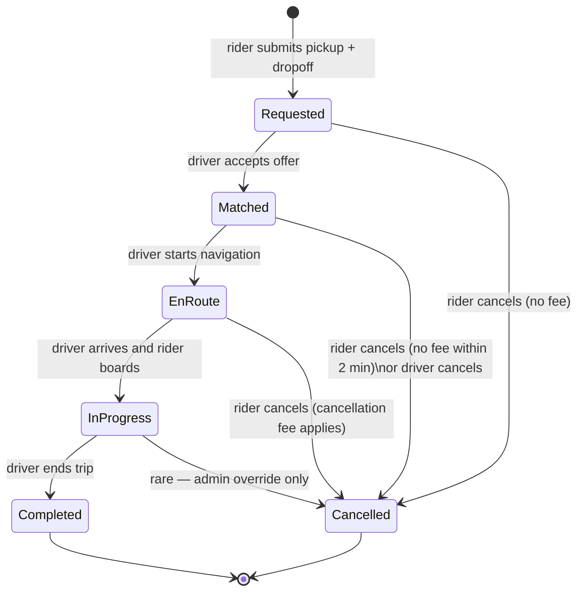
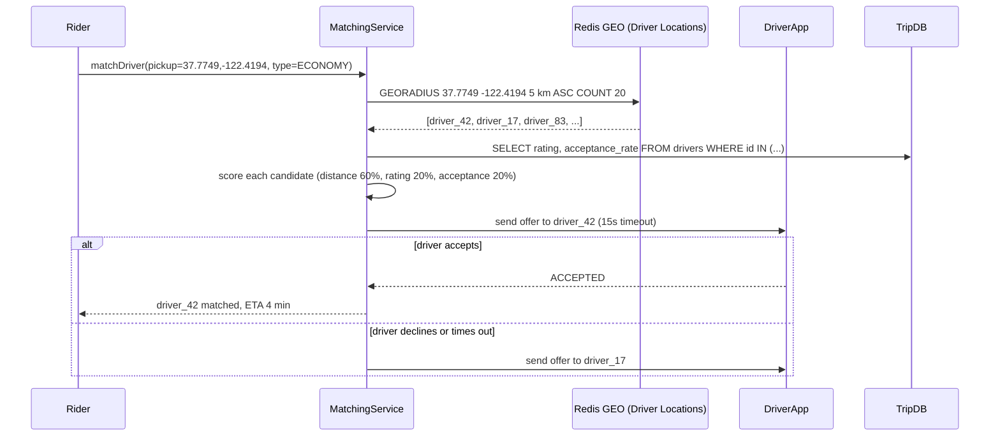

# Design a Ride-Sharing Service (OOD)

**Difficulty**: 🟡 Intermediate
**Codemania**: #140
**Interview Frequency**: High

---

## Problem Statement

Model an Uber-like ride-sharing service covering trip lifecycle, driver matching, dynamic fare calculation, and rating. The OOD challenge: a `Trip` transitions through well-defined states (requested → matched → en-route → in-progress → completed/cancelled) and fare calculation varies by vehicle type and surge pricing. State pattern keeps transition logic clean; Strategy pattern keeps fare algorithms extensible.

---

## Functional Requirements

- Rider requests a trip: pickup + dropoff location, vehicle preference
- System matches available driver based on proximity
- Trip progresses through lifecycle states with timestamps
- Fare calculated based on: base fare + distance + duration + surge multiplier
- Both rider and driver can cancel with applicable fees
- Post-trip rating for driver and rider

---

## Core Entities

| Class | Responsibility |
|-------|---------------|
| `Trip` | Core domain object: rider, driver, route, state, fare |
| `Driver` | Account with vehicle, availability status, location |
| `Rider` | Account with payment method, trip history |
| `Vehicle` | Car details: type (economy/premium/XL), capacity, plate |
| `Location` | Lat/lng coordinates with timestamp |
| `MatchRequest` | Rider's request: pickup, dropoff, vehicle preference |
| `Fare` | Calculated cost: breakdown of base + distance + surge |
| `Rating` | Score (1-5) given by rider or driver after trip |
| `Surge` | Multiplier applied in high-demand areas |
| `TripState` | Interface for each lifecycle phase |

---

## Class Diagram


---

## Design Patterns Used

### 1. State — Trip Lifecycle

**Why it fits**: Each phase has different allowed actions — you can cancel a "Requested" trip for free but cancelling "InProgress" may charge a fee. Without State pattern, `Trip.cancel()` becomes a giant `if/else` block on the current status. Each state class encapsulates what's valid in that phase.

```
interface TripState:
  matchDriver(trip): void
  startTrip(trip): void
  completeTrip(trip): void
  cancel(trip, by: Actor): void

class RequestedState implements TripState:
  matchDriver(trip):
    driver = matchingService.findNearest(trip.pickup, trip.vehicleType)
    if driver == null: throw NoDriverAvailableException()
    driver.isAvailable = false
    trip.driver = driver
    trip.transitionTo(new MatchedState())
    notificationService.notify(trip.rider, "Driver matched: " + driver.name)

  cancel(trip, by):
    trip.transitionTo(new CancelledState())
    // No cancellation fee in Requested state

class InProgressState implements TripState:
  cancel(trip, by):
    if by == Actor.RIDER:
      fare = fareService.calculateEarlyCancelFee(trip)
      trip.fare = fare
    trip.transitionTo(new CancelledState())

  completeTrip(trip):
    trip.fare = fareService.calculate(trip, surgeService.getSurge(trip.pickup))
    trip.transitionTo(new CompletedState())
```

### 2. Strategy — Fare Calculation

**Why it fits**: Economy, Premium, and XL rides have different per-km and per-minute rates. Injecting a `FareStrategy` based on vehicle type means the `Trip` and `FareService` don't need to know the details of each pricing tier. Adding a new vehicle type (e.g., Moto) is one new strategy class.

```
interface FareStrategy:
  calculate(distanceKm: float, durationMin: float, surge: Surge): Fare

EconomyFareStrategy:
  BASE = 1.50
  PER_KM = 0.90
  PER_MIN = 0.15

  calculate(dist, dur, surge):
    raw = BASE + (dist * PER_KM) + (dur * PER_MIN)
    return Fare(BASE, dist * PER_KM, dur * PER_MIN, surge.multiplier)

PremiumFareStrategy:
  BASE = 3.00
  PER_KM = 1.80
  PER_MIN = 0.30
  calculate(dist, dur, surge):
    // same formula, higher rates
```

### 3. Observer — Real-Time Notifications

**Why it fits**: The rider's app, the driver's app, and the operations dashboard all need to react to trip state changes. Publishing `TripStateChangedEvent` through an observer allows all consumers to react without `Trip` knowing who's listening.

```
class Trip:
  observers: List<TripObserver>

  transitionTo(newState: TripState): void
    oldState = state
    state = newState
    state.onEnter(this)
    publish(TripStateChangedEvent(this, oldState, newState))

class RiderPushNotifier implements TripObserver:
  onEvent(TripStateChangedEvent e):
    switch e.newState:
      case MatchedState:
        push(e.trip.rider, "Your driver is " + e.trip.driver.name + " — arriving in 5 min")
      case InProgressState:
        push(e.trip.rider, "Trip started!")
      case CompletedState:
        push(e.trip.rider, "Arrived! Fare: $" + e.trip.fare.total())
```

### 4. Factory — Fare Strategy Selection

**Why it fits**: When a trip is completed, the correct `FareStrategy` must be chosen based on `trip.driver.vehicle.type`. A factory centralises this selection, preventing vehicle-type `if/else` chains from spreading throughout the codebase.

```
class FareStrategyFactory:
  create(vehicleType: VehicleType): FareStrategy
    switch vehicleType:
      case ECONOMY:  return new EconomyFareStrategy()
      case PREMIUM:  return new PremiumFareStrategy()
      case XL:       return new XLFareStrategy()
      default:       throw UnknownVehicleTypeException(vehicleType)
```

---

## Key Method: `matchDriver(request)`

```
MatchingService:
  matchDriver(request: MatchRequest): Driver
    // 1. Geo-filter: drivers within 5 km of pickup
    nearby = driverRepo.findAvailable(
      center = request.pickup,
      radiusKm = 5,
      vehicleType = request.vehicleType
    )

    if nearby.isEmpty():
      throw NoDriverAvailableException(request.pickup)

    // 2. Score each candidate
    scored = nearby.map(driver -> {
      distScore = 1.0 / haversine(driver.location, request.pickup)
      ratingScore = driver.rating / 5.0
      acceptanceScore = driver.acceptanceRate
      score = distScore * 0.6 + ratingScore * 0.2 + acceptanceScore * 0.2
      return (driver, score)
    })

    // 3. Pick highest score
    best = scored.maxBy(s -> s.score).driver

    // 4. Send offer to driver (driver has 15s to accept)
    offer = new DriverOffer(best, request, expiresAt = now().plus(15s))
    offerService.send(offer)
    response = offerService.waitForResponse(offer)

    if response == DECLINED or TIMEOUT:
      return matchDriver(request.withExclude(best))  // retry next best

    return best
```

---

## Design Decisions & Trade-offs

| Decision | Option A | Option B | Choice |
|----------|----------|----------|--------|
| Trip state storage | In-memory (fast) | DB-persisted state | DB-persisted — trips must survive server restarts |
| Fare calculation timing | Upfront estimate | Post-trip actual | Post-trip actual for fare; upfront estimate shown to rider |
| Driver matching | Nearest only | Score-based (distance + rating) | Score-based — pure nearest ignores driver quality |
| Cancellation fee | Always charged | Waived first time | Waived first time per month — business decision, configurable |

---

## Top Interview Questions

| Question | What It Tests |
|----------|--------------|
| How do you handle both the rider and driver cancelling at the same time? | Concurrent state transitions, idempotency |
| How would you add a "scheduled ride" (book 2 hours in advance) feature? | New state (Scheduled), deferred matching |
| How does surge pricing change in your design — where does the multiplier come in? | Strategy injection, Surge as a value object |

---

## Related Concepts

- [Calendar System OOD for time-slot availability matching](./calendar-system)
- [Food Delivery OOD for similar order state machine](./food-delivery-ood)

---

## Component Deep Dive 1: Trip State Machine

The `Trip` state machine is the most critical component in this design. It enforces which operations are valid at each phase of the ride, prevents illegal transitions, and carries the full audit trail of what happened and when.

### How It Works Internally

Each state is a class implementing `TripState`. The `Trip` object holds a reference to its current state object and delegates all lifecycle calls to it. When a transition occurs, `Trip.transitionTo(newState)` swaps the reference and calls `newState.onEnter(trip)`, which stamps the entry timestamp, fires the `TripStateChangedEvent`, and does any setup specific to that phase (e.g., `MatchedState.onEnter` starts the driver ETA timer).

The full state graph is linear with two terminal branches:



### Why Naive Approaches Fail at Scale

A naive `Trip` class would use an enum field and giant `if/else` blocks:

```
// Anti-pattern — explodes with new states/actions
if (trip.status == REQUESTED && action == CANCEL) { ... }
else if (trip.status == MATCHED && action == CANCEL) { ... }
else if (trip.status == IN_PROGRESS && action == CANCEL) { ... }
```

This breaks down because:
1. **Illegal transition silently succeeds** — nothing prevents calling `trip.completeTrip()` from `RequestedState` unless every branch checks the current status explicitly.
2. **Adding a new state ("Scheduled") requires touching every action method** — violates Open/Closed Principle.
3. **No single place owns transition logic** — fee calculation, notification, and driver release are scattered.

With the State pattern, `RequestedState.completeTrip()` simply throws `IllegalStateTransitionException("Cannot complete a trip that has not started")`. Each state class is the authoritative document for what actions are valid in that phase.

### Trade-off Table: State Storage Options

| Approach | Latency | Throughput | Trade-off |
|----------|---------|------------|-----------|
| In-memory state object only | ~0ms | Unlimited | Lost on server crash — state not durable |
| DB-persisted `trip_status` column, state loaded on read | ~5ms read | ~10k writes/sec per shard | Durable, auditable; requires DB roundtrip on every transition |
| Event-sourced (append `TripEvent` rows, reconstruct state on read) | ~20ms (replay) | ~50k inserts/sec | Full audit trail, time-travel debugging; complex to query current state |

**Production choice**: DB-persisted status column + optimistic locking (version counter). State transitions do `UPDATE trips SET status='matched', version=3 WHERE id=X AND version=2` — if `rowsAffected == 0`, another server already transitioned the trip (concurrent cancellation scenario). This catches race conditions without distributed locks.

---

## Component Deep Dive 2: Driver Matching Service

The `MatchingService` is the second most critical component. It must select the best available driver in under 3 seconds end-to-end (the rider's app shows a loading spinner; beyond 3s the UX degrades sharply).

### How It Works Internally

The naive implementation — scan all `drivers WHERE available = true AND vehicle_type = X` then sort by distance — is a full table scan. At 500,000 active drivers globally it degrades to seconds.

The production approach uses a geospatial index. Drivers continuously push their GPS coordinates to a location service (typically 4–5 second heartbeat intervals). The location service stores coordinates in a Redis `GEO` set (or a PostGIS spatial index in Postgres), enabling `GEORADIUS` queries that return the N nearest drivers to a point in O(log n + M) time where M is the result count.



### Scale Behavior at 10x Load

At baseline (say, 50,000 simultaneous trip requests), a single matching service pod handles ~500 req/sec. At 10x (500,000 concurrent requests):
- Redis GEO lookup is O(log n) — scales horizontally with Redis Cluster; not the bottleneck.
- The bottleneck is the DB fan-out to fetch ratings/acceptance rates for the top 20 nearby candidates. At 500k requests/sec, that is 10M secondary reads/sec — must be cached (driver profile cache with 30s TTL is sufficient since ratings change slowly).
- Driver offer round-trips (15s timeout) mean the matching service holds 10M open connections simultaneously at 10x load. Use async offer queues (per-driver message channels) rather than blocking HTTP calls.

---

## Component Deep Dive 3: Fare Calculation and Surge Pricing

The `FareService` combines a `FareStrategy` (vehicle type) with a `Surge` value object (demand multiplier) to produce a `Fare` breakdown. This is a read-heavy component — riders see an upfront fare estimate before confirming, and the final fare is calculated at trip completion.

### Technical Design

`Surge` is computed by a background job that periodically scans demand density per geohash cell. The job computes `activeRequests / onlineDrivers` per cell; if the ratio exceeds 2.0, surge = 1.5x; exceeds 4.0, surge = 2.0x; cap is typically 3.0x for regulatory compliance. The surge multiplier for a given cell has a 60-second TTL in the cache.

Key design decision: **surge is snapshotted at trip request time**, not at trip completion. The rider's confirmed upfront estimate uses the surge at request time. If the trip takes 20 minutes and surge drops to 1.0x by completion, the rider still pays the originally committed price. This is a deliberate UX choice (no surprise fare spikes) that Uber introduced in 2016.

```
FareService:
  estimateFare(request: MatchRequest): FareEstimate
    strategy = FareStrategyFactory.create(request.vehicleType)
    surge = surgeCache.getSurge(request.pickup)         // snapshot at request time
    distEstimate = mapsService.estimateDistance(request.pickup, request.dropoff)
    durEstimate = mapsService.estimateTime(request.pickup, request.dropoff)
    fare = strategy.calculate(distEstimate, durEstimate, surge)
    return FareEstimate(fare, confidence = 0.85)        // ±15% actual vs estimate

  calculateFinalFare(trip: Trip): Fare
    strategy = FareStrategyFactory.create(trip.driver.vehicle.type)
    surge = trip.snapshotSurge                          // use committed surge from request time
    actualDist = trip.route.totalDistanceKm()
    actualDur = Duration.between(trip.startedAt, trip.completedAt).toMinutes()
    return strategy.calculate(actualDist, actualDur, surge)
```

---

## Class Design (Full Expanded)

The diagram below extends the stub to show all supporting classes, their relationships, and the key methods on each:

```mermaid
classDiagram
    class Trip {
        +id: UUID
        +rider: Rider
        +driver: Driver
        +pickup: Location
        +dropoff: Location
        +vehicleType: VehicleType
        +state: TripState
        +fare: Fare
        +snapshotSurge: Surge
        +requestedAt: DateTime
        +matchedAt: DateTime
        +startedAt: DateTime
        +completedAt: DateTime
        +version: int
        +transitionTo(state: TripState): void
        +cancel(by: Actor): void
        +complete(): void
        +addObserver(o: TripObserver): void
        +publish(event: TripEvent): void
    }

    class TripState {
        <<interface>>
        +onEnter(trip: Trip): void
        +matchDriver(trip: Trip): void
        +driverArrived(trip: Trip): void
        +riderBoarded(trip: Trip): void
        +completeTrip(trip: Trip): void
        +cancel(trip: Trip, by: Actor): void
    }

    class RequestedState {
        +matchDriver(trip): void
        +cancel(trip, by): void
    }
    class MatchedState {
        +driverArrived(trip): void
        +cancel(trip, by): void
    }
    class EnRouteState {
        +riderBoarded(trip): void
        +cancel(trip, by): void
    }
    class InProgressState {
        +completeTrip(trip): void
        +cancel(trip, by): void
    }
    class CompletedState {
        +onEnter(trip): void
    }
    class CancelledState {
        +onEnter(trip): void
    }

    class FareStrategy {
        <<interface>>
        +calculate(distKm: float, durMin: float, surge: Surge): Fare
    }
    class EconomyFareStrategy {
        -BASE: float = 1.50
        -PER_KM: float = 0.90
        -PER_MIN: float = 0.15
        +calculate(dist, dur, surge): Fare
    }
    class PremiumFareStrategy {
        -BASE: float = 3.00
        -PER_KM: float = 1.80
        -PER_MIN: float = 0.30
        +calculate(dist, dur, surge): Fare
    }
    class XLFareStrategy {
        -BASE: float = 2.00
        -PER_KM: float = 1.20
        -PER_MIN: float = 0.20
        +calculate(dist, dur, surge): Fare
    }

    class FareStrategyFactory {
        +create(vehicleType: VehicleType): FareStrategy
    }

    class Driver {
        +id: UUID
        +name: String
        +vehicle: Vehicle
        +location: Location
        +isAvailable: boolean
        +rating: float
        +acceptanceRate: float
        +updateLocation(loc: Location): void
        +goOnline(): void
        +goOffline(): void
    }

    class Rider {
        +id: UUID
        +name: String
        +email: String
        +paymentMethod: PaymentMethod
        +rating: float
        +tripHistory(): List~Trip~
    }

    class Vehicle {
        +id: UUID
        +licensePlate: String
        +make: String
        +model: String
        +year: int
        +type: VehicleType
        +capacity: int
    }

    class Location {
        +lat: float
        +lng: float
        +timestamp: DateTime
        +distanceTo(other: Location): float
    }

    class Fare {
        +baseFare: float
        +distanceFare: float
        +timeFare: float
        +surgeMultiplier: float
        +total(): float
        +breakdown(): Map~String,float~
    }

    class Surge {
        +multiplier: float
        +geohash: String
        +capturedAt: DateTime
        +isActive(): boolean
    }

    class Rating {
        +id: UUID
        +trip: Trip
        +givenBy: Actor
        +score: int
        +comment: String
        +createdAt: DateTime
    }

    class MatchingService {
        -locationCache: GeoStore
        +matchDriver(request: MatchRequest): Driver
        -scoreCandidate(driver: Driver, pickup: Location): float
    }

    class FareService {
        -factory: FareStrategyFactory
        -surgeCache: SurgeCache
        +estimateFare(request: MatchRequest): FareEstimate
        +calculateFinalFare(trip: Trip): Fare
    }

    Trip --> TripState
    Trip --> Fare
    Trip --> Driver
    Trip --> Rider
    Trip --> Surge
    Driver --> Vehicle
    Driver --> Location
    TripState <|.. RequestedState
    TripState <|.. MatchedState
    TripState <|.. EnRouteState
    TripState <|.. InProgressState
    TripState <|.. CompletedState
    TripState <|.. CancelledState
    FareStrategy <|.. EconomyFareStrategy
    FareStrategy <|.. PremiumFareStrategy
    FareStrategy <|.. XLFareStrategy
    FareStrategyFactory ..> FareStrategy
    FareService --> FareStrategyFactory
    Rating --> Trip
    MatchingService --> Location
```



---

## Design Patterns Applied (Full Analysis)

### 1. State Pattern — Trip Lifecycle

**What it is**: Encapsulate state-specific behaviour in separate classes; the context object (`Trip`) delegates to its current state object.

**How it's used**: Each of `RequestedState`, `MatchedState`, `EnRouteState`, `InProgressState`, `CompletedState`, `CancelledState` implements `TripState`. Calling `trip.cancel(by=RIDER)` routes to the current state's `cancel()` — which has different fee logic at each phase.

**Why it fits**: Six phases × five actions = 30 combinations. Without State pattern all 30 live in one class. With it, each combination lives in its natural home and new phases (e.g., `ScheduledState`) are self-contained.

### 2. Strategy Pattern — Fare Calculation

**What it is**: Define a family of algorithms, encapsulate each, and make them interchangeable.

**How it's used**: `EconomyFareStrategy`, `PremiumFareStrategy`, `XLFareStrategy` each hold different rate constants. `FareService` is injected with the correct strategy via `FareStrategyFactory`. Adding a new tier (e.g., `MotoStrategy`) requires zero changes to `FareService`.

**Why it fits**: Fare algorithms are independent of trip lifecycle. Swapping them at runtime (based on vehicle type resolved at trip completion) is exactly the Strategy use case.

### 3. Observer Pattern — Event Notifications

**What it is**: Subject maintains a list of observers; broadcasts events without knowing observers' identities.

**How it's used**: `Trip.transitionTo()` publishes `TripStateChangedEvent`. Observers include `RiderPushNotifier`, `DriverPushNotifier`, `AnalyticsSink`, and `OperationsDashboard`. None of them are referenced by `Trip` directly.

**Why it fits**: A trip state change has multiple downstream consumers. Coupling `Trip` to each consumer would violate Single Responsibility and make adding new consumers (e.g., surge recalculation on trip completion) a core-class change.

### 4. Factory Pattern — Strategy Selection

**What it is**: Centralize object creation; callers request objects by type without knowing the concrete class.

**How it's used**: `FareStrategyFactory.create(VehicleType)` returns the correct strategy. All `switch (vehicleType)` logic lives in one class.

**Why it fits**: Without the factory, every service that needs a `FareStrategy` would duplicate the `switch` block. Changing a vehicle type's strategy class means updating one file.

---

## SOLID Principles Demonstrated

| Principle | Where Applied |
|-----------|--------------|
| **Single Responsibility** | `Trip` manages lifecycle; `FareService` calculates fare; `MatchingService` finds drivers. No class does more than one thing. |
| **Open/Closed** | Adding a new vehicle type (Moto) requires only a new `MotoFareStrategy` class — no changes to `FareService` or `Trip`. Adding a new state (Scheduled) requires a new `ScheduledState` class. |
| **Liskov Substitution** | `InProgressState` can replace `MatchedState` anywhere a `TripState` is expected; `FareService` works identically regardless of which concrete strategy is passed. |
| **Interface Segregation** | `TripState` exposes only lifecycle methods. If `CompletedState` doesn't need `matchDriver()`, it throws `UnsupportedOperationException` — or better, `TripState` is split into `MatchableState` and `CancellableState` sub-interfaces. |
| **Dependency Inversion** | `FareService` depends on `FareStrategy` (interface), not `EconomyFareStrategy` (concrete). `Trip` depends on `TripState` (interface). High-level modules do not depend on low-level modules. |

---

## Concurrency and Thread Safety

Three concurrent scenarios require explicit handling:

### Scenario 1: Dual Cancellation (Rider and Driver cancel simultaneously)

Both apps send cancel requests to different API pods at the same moment. Both try to execute `trip.cancel()`.

**Fix**: Optimistic locking on the `trips` table:
```sql
UPDATE trips
SET status = 'cancelled', cancelled_by = ?, cancelled_at = NOW(), version = version + 1
WHERE id = ? AND version = ? AND status NOT IN ('completed', 'cancelled')
```
If `rowsAffected == 0`, the trip was already cancelled — the second request returns HTTP 409 with `"Trip already cancelled"`. The client handles this gracefully.

### Scenario 2: Driver Location Update During Matching

The matching service reads a driver's location from the GEO cache to compute distance score. Simultaneously, the driver's app pushes a new GPS coordinate. If the driver moved away from the rider between the GEO query and the offer send, the ETA shown to the rider will be stale.

**Acceptable tolerance**: GPS cache TTL is 5 seconds. Driver speed ~40 km/h = ~55 m per second. In 5s, drift is ~275 m. ETA accuracy within ±1 minute is acceptable. This is not treated as a consistency problem — it is treated as a display tolerance.

### Scenario 3: Fare Calculation Race on Trip Completion

`InProgressState.completeTrip()` reads `trip.startedAt` and `trip.route` to calculate the fare and then writes `trip.fare`. If two completion events arrive (e.g., driver taps "End Trip" twice due to connectivity retry), a naive implementation calculates and charges the fare twice.

**Fix**: The `UPDATE trips SET status='completed' WHERE id=? AND status='in_progress'` guard (same optimistic locking pattern) ensures only the first completion write succeeds. The second retry reads `rowsAffected == 0` and short-circuits.

---

## Extension Points

### Adding "Scheduled Ride" (book 2 hours ahead)

1. Add `ScheduledState` implementing `TripState`. It holds `scheduledFor: DateTime`.
2. `RequestedState` transitions to `ScheduledState` when `request.scheduledFor` is set.
3. A background scheduler job runs every minute: `SELECT * FROM trips WHERE status='scheduled' AND scheduled_for <= NOW() + 15 minutes`. For each result, it triggers `trip.transitionTo(RequestedState)` to kick off normal matching flow.
4. **No changes to `MatchingService`, `FareService`, or any existing state class.** Open/Closed Principle holds.

### Adding "Carpool / Shared Ride"

1. `Trip` gains a `maxRiders: int` field and a `riders: List<Rider>`.
2. A new `CarpoolFareStrategy` splits the fare among confirmed riders.
3. `MatchedState` waits until `riders.size() >= minRiders` before transitioning to `EnRouteState`.
4. No changes to Driver, Vehicle, or the Location model.

### Adding a New Vehicle Type (e.g., Moto / Bike)

1. Add `MOTO` to `VehicleType` enum.
2. Implement `MotoFareStrategy` with its rate constants.
3. Add `case MOTO: return new MotoFareStrategy()` to `FareStrategyFactory`.
4. Done. Zero other changes.

---

## Data Model

```sql
-- Core entities

CREATE TABLE riders (
    id              UUID PRIMARY KEY DEFAULT gen_random_uuid(),
    name            VARCHAR(100) NOT NULL,
    email           VARCHAR(255) UNIQUE NOT NULL,
    phone           VARCHAR(20) NOT NULL,
    payment_method  JSONB,              -- {type: "card", last4: "4242", token: "..."}
    rating          NUMERIC(3,2) DEFAULT 5.00,
    rating_count    INT DEFAULT 0,
    created_at      TIMESTAMPTZ DEFAULT NOW()
);

CREATE TABLE vehicles (
    id              UUID PRIMARY KEY DEFAULT gen_random_uuid(),
    license_plate   VARCHAR(20) UNIQUE NOT NULL,
    make            VARCHAR(50),
    model           VARCHAR(50),
    year            SMALLINT,
    type            VARCHAR(20) CHECK (type IN ('economy','premium','xl','moto')),
    capacity        SMALLINT DEFAULT 4
);

CREATE TABLE drivers (
    id              UUID PRIMARY KEY DEFAULT gen_random_uuid(),
    name            VARCHAR(100) NOT NULL,
    email           VARCHAR(255) UNIQUE NOT NULL,
    phone           VARCHAR(20) NOT NULL,
    vehicle_id      UUID REFERENCES vehicles(id),
    is_available    BOOLEAN DEFAULT FALSE,
    current_lat     NUMERIC(10,7),
    current_lng     NUMERIC(10,7),
    location_updated_at TIMESTAMPTZ,
    rating          NUMERIC(3,2) DEFAULT 5.00,
    rating_count    INT DEFAULT 0,
    acceptance_rate NUMERIC(4,3) DEFAULT 1.000,
    created_at      TIMESTAMPTZ DEFAULT NOW()
);

CREATE TABLE trips (
    id              UUID PRIMARY KEY DEFAULT gen_random_uuid(),
    rider_id        UUID NOT NULL REFERENCES riders(id),
    driver_id       UUID REFERENCES drivers(id),
    vehicle_type    VARCHAR(20) NOT NULL,
    pickup_lat      NUMERIC(10,7) NOT NULL,
    pickup_lng      NUMERIC(10,7) NOT NULL,
    pickup_address  VARCHAR(255),
    dropoff_lat     NUMERIC(10,7) NOT NULL,
    dropoff_lng     NUMERIC(10,7) NOT NULL,
    dropoff_address VARCHAR(255),
    status          VARCHAR(20) NOT NULL DEFAULT 'requested'
                    CHECK (status IN ('requested','matched','en_route','in_progress','completed','cancelled')),
    surge_multiplier NUMERIC(4,2) DEFAULT 1.00,     -- snapshot at request time
    base_fare       NUMERIC(8,2),
    distance_fare   NUMERIC(8,2),
    time_fare       NUMERIC(8,2),
    total_fare      NUMERIC(8,2),
    distance_km     NUMERIC(7,2),
    duration_min    INT,
    cancelled_by    VARCHAR(10) CHECK (cancelled_by IN ('rider','driver','admin')),
    cancel_reason   VARCHAR(255),
    requested_at    TIMESTAMPTZ DEFAULT NOW(),
    matched_at      TIMESTAMPTZ,
    enroute_at      TIMESTAMPTZ,
    started_at      TIMESTAMPTZ,
    completed_at    TIMESTAMPTZ,
    cancelled_at    TIMESTAMPTZ,
    version         INT DEFAULT 0       -- optimistic lock counter
);

CREATE TABLE ratings (
    id              UUID PRIMARY KEY DEFAULT gen_random_uuid(),
    trip_id         UUID NOT NULL REFERENCES trips(id),
    given_by        VARCHAR(10) NOT NULL CHECK (given_by IN ('rider','driver')),
    score           SMALLINT NOT NULL CHECK (score BETWEEN 1 AND 5),
    comment         VARCHAR(500),
    created_at      TIMESTAMPTZ DEFAULT NOW(),
    UNIQUE (trip_id, given_by)          -- one rating per role per trip
);

-- Indexes for hot query paths
CREATE INDEX idx_trips_rider    ON trips(rider_id, status);
CREATE INDEX idx_trips_driver   ON trips(driver_id, status);
CREATE INDEX idx_trips_status   ON trips(status, requested_at DESC);
CREATE INDEX idx_drivers_avail  ON drivers(is_available) WHERE is_available = TRUE;

-- Driver locations stored separately in Redis GEO for sub-millisecond GEORADIUS queries
-- Redis key pattern: "drivers:geo:{vehicleType}" → GEOADD with driver_id as member
-- TTL per member reset on each GPS heartbeat (5s interval from driver app)
```

---

## Scale Bottlenecks

| Traffic Level | Component That Breaks | Symptoms | Mitigation |
|---------------|----------------------|----------|------------|
| 10x baseline (500k active trips) | Driver location DB writes | `location_updated_at` update rate saturates Postgres write IOPS | Move live GPS to Redis GEO only; persist to DB in batches every 30s |
| 10x baseline | `trips` table write contention | High lock wait times on status transitions with optimistic locking | Shard `trips` by `rider_id % N`; trips for a given rider always go to the same shard |
| 100x baseline (5M active trips) | Matching service fan-out reads | Driver profile reads for top-20 candidates = 100M reads/sec | Cache driver profiles (rating, acceptance rate) in Redis with 60s TTL |
| 100x baseline | Surge calculation job latency | Surge map staleness > 60s in high-demand cells | Shard surge computation by geohash prefix; run 10 parallel workers |
| 1000x baseline (50M active trips) | Notification delivery throughput | Push notification service overloaded; rider misses "driver matched" alert | Fan out via Kafka topic; multiple push-notification consumer groups (iOS, Android, Web) |
| 1000x baseline | `ratings` table insert spikes at trip-end | Burst write at top-of-hour when many trips complete simultaneously | Use Kafka → async consumer for rating writes; decouple from synchronous trip-complete path |

---

## How Uber Built This

Uber's engineering team has published extensively about their architecture, particularly in blog posts from 2016–2022 covering their migration from a monolith to microservices.

**Technology Stack (c. 2018–2022):**
- **Trip state** persisted in Schemaless (their custom MySQL-backed sharded document store), not raw Postgres. Schemaless provides cell-level consistency and operates at ~1M writes/sec across shards.
- **Driver locations** maintained in a purpose-built service called "Supply Positioning," which uses geohash-partitioned in-memory grids updated via a dedicated UDP stream from driver apps. At peak, Uber processes 15 million GPS updates per minute globally (250,000/second).
- **Matching** runs in a service called "Dispatch," which historically operated on 1-second scheduling cycles. A 2017 blog post described Dispatch handling 1 million dispatch decisions per second globally across all cities.
- **Surge pricing** runs in the "Surge Service," a real-time streaming computation over trip request and driver supply events using Apache Flink. Surge cells are hexagonal H3 grids (Uber open-sourced H3 in 2018); multipliers are recomputed every 60 seconds.
- **Fare calculation** runs post-trip. Uber's pricing engine ingests the raw GPS polyline from the driver app, snaps it to their map, and calculates the actual driven distance rather than straight-line distance. This adds ~200ms of processing time after `completeTrip` is called.

**Non-obvious architectural decision**: Uber separates the "driver offer" from the "match confirmation." The dispatch cycle sends offers to multiple nearby drivers simultaneously (not sequentially), picks the first acceptance, and sends decline signals to the others. This reduces rider wait time from ~7s (sequential) to ~2s (parallel). The trade-off is that driver-side offer UX flickers — drivers occasionally see a match offer disappear because another driver accepted first.

**Source**: Uber Engineering Blog — "The Architecture of Uber's API Gateway" (2018), "How Uber Manages a Million Writes Per Second Using Mesos and Cassandra" (2016), and the open-source H3 library documentation at [https://h3geo.org](https://h3geo.org).

---

## Interview Angle

**What the interviewer is testing:** Can the candidate translate a real-world workflow (ride lifecycle) into a clean class hierarchy, identify the correct design patterns without prompting, and reason about concurrency edge cases in a multi-actor system?

**Common mistakes candidates make:**

1. **Using a status string/enum with if/else instead of the State pattern.** This is the most common anti-pattern. A candidate who builds `Trip.cancel() { if (status == IN_PROGRESS) { ... } else if (status == MATCHED) { ... } }` has identified the problem (lifecycle phases) but missed the OOD solution (State pattern). The interviewer will prompt with "what happens when you add a 6th state?" — and the candidate's spaghetti becomes obvious.

2. **Hard-coding fare rates inside `Trip` or `FareService` instead of using Strategy.** Candidates often write `if (vehicleType == ECONOMY) { rate = 0.90; }` inside `FareService.calculate()`. This means adding a new vehicle type requires modifying a core service class — a direct Open/Closed violation. The fix is one line: inject a `FareStrategy` resolved by factory.

3. **Forgetting concurrent cancellation.** Most candidates design the happy path fluently but freeze when asked "what if the rider and driver both press cancel at the same millisecond?" The answer requires either optimistic locking (update with version check) or a distributed lock — and candidates who haven't thought about this look like they've never shipped production code.

**The insight that separates good from great answers:** Snapshotting the `surge_multiplier` on the `Trip` record at request time, not at completion time. A great candidate proactively explains that surge can drop between when a rider confirms a trip and when they arrive at their destination — and that committing to the surge at confirmation time is a deliberate UX contract, not an oversight. This shows they understand that OOD decisions are driven by product requirements, not just technical correctness.

---

## Key Numbers to Remember

| Metric | Value | Context |
|--------|-------|---------|
| GPS heartbeat interval | 4–5 seconds | Driver app to location service; balance battery vs location freshness |
| Driver offer timeout | 15 seconds | Rider UX degrades beyond 3s wait; 15s per driver, up to 5 retries = 75s max |
| Max match radius | 5 km initial | Expanded to 10 km if no drivers found within 5 km (2 retry rounds) |
| Surge recalculation interval | 60 seconds | H3 hex cell granularity; finer = more compute, coarser = stale surge |
| Surge cap | 3.0× | Most jurisdictions have regulatory caps; Uber and Lyft enforce 2.5–3.0× in practice |
| Uber GPS updates at peak | 250,000/second | 15M driver GPS pushes per minute globally (Uber Engineering Blog, 2016) |
| Uber Dispatch decisions | 1,000,000/second | Across all cities globally; Dispatch runs on 1-second scheduling cycles |
| Optimistic lock version increment | +1 per transition | Detects concurrent state changes; `version = 0` on insert; checked on every UPDATE |
| Driver profile cache TTL | 60 seconds | Rating and acceptance rate change slowly; stale by 1 minute is acceptable for scoring |

---

## 📚 Resources & References

| Resource | Type | What You'll Learn |
|----------|------|------------------|
| [NeetCode OOD Playlist](https://www.youtube.com/@NeetCode) | 📺 YouTube | State machine and ride-sharing OOD walkthroughs |
| [ByteByteGo System Design](https://www.youtube.com/@ByteByteGo) | 📺 YouTube | Uber system design |
| [Head First Design Patterns](https://www.oreilly.com/library/view/head-first-design/0596007124/) | 📖 Blog | State and Strategy pattern chapters |
| [Clean Code — Robert Martin](https://www.amazon.com/Clean-Code-Handbook-Software-Craftsmanship/dp/0132350882) | 📚 Book | Avoiding giant switch statements with polymorphism |
| [GoF Design Patterns](https://www.amazon.com/Design-Patterns-Elements-Reusable-Object-Oriented/dp/0201633612) | 📚 Book | State, Strategy, and Observer reference |
