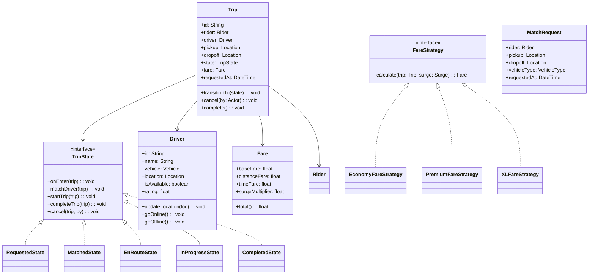

# Design a Ride-Sharing Service (OOD)

**Difficulty**: 🟡 Intermediate
**Codemania**: #140
**Interview Frequency**: High

---

## Problem Statement

Model an Uber-like ride-sharing service covering trip lifecycle, driver matching, dynamic fare calculation, and rating. The OOD challenge: a `Trip` transitions through well-defined states (requested → matched → en-route → in-progress → completed/cancelled) and fare calculation varies by vehicle type and surge pricing. State pattern keeps transition logic clean; Strategy pattern keeps fare algorithms extensible.

---

## Functional Requirements

- Rider requests a trip: pickup + dropoff location, vehicle preference
- System matches available driver based on proximity
- Trip progresses through lifecycle states with timestamps
- Fare calculated based on: base fare + distance + duration + surge multiplier
- Both rider and driver can cancel with applicable fees
- Post-trip rating for driver and rider

---

## Core Entities

| Class | Responsibility |
|-------|---------------|
| `Trip` | Core domain object: rider, driver, route, state, fare |
| `Driver` | Account with vehicle, availability status, location |
| `Rider` | Account with payment method, trip history |
| `Vehicle` | Car details: type (economy/premium/XL), capacity, plate |
| `Location` | Lat/lng coordinates with timestamp |
| `MatchRequest` | Rider's request: pickup, dropoff, vehicle preference |
| `Fare` | Calculated cost: breakdown of base + distance + surge |
| `Rating` | Score (1-5) given by rider or driver after trip |
| `Surge` | Multiplier applied in high-demand areas |
| `TripState` | Interface for each lifecycle phase |

---

## Class Diagram



---

## Design Patterns Used

### 1. State — Trip Lifecycle

**Why it fits**: Each phase has different allowed actions — you can cancel a "Requested" trip for free but cancelling "InProgress" may charge a fee. Without State pattern, `Trip.cancel()` becomes a giant `if/else` block on the current status. Each state class encapsulates what's valid in that phase.

```
interface TripState:
  matchDriver(trip): void
  startTrip(trip): void
  completeTrip(trip): void
  cancel(trip, by: Actor): void

class RequestedState implements TripState:
  matchDriver(trip):
    driver = matchingService.findNearest(trip.pickup, trip.vehicleType)
    if driver == null: throw NoDriverAvailableException()
    driver.isAvailable = false
    trip.driver = driver
    trip.transitionTo(new MatchedState())
    notificationService.notify(trip.rider, "Driver matched: " + driver.name)

  cancel(trip, by):
    trip.transitionTo(new CancelledState())
    // No cancellation fee in Requested state

class InProgressState implements TripState:
  cancel(trip, by):
    if by == Actor.RIDER:
      fare = fareService.calculateEarlyCancelFee(trip)
      trip.fare = fare
    trip.transitionTo(new CancelledState())

  completeTrip(trip):
    trip.fare = fareService.calculate(trip, surgeService.getSurge(trip.pickup))
    trip.transitionTo(new CompletedState())
```

### 2. Strategy — Fare Calculation

**Why it fits**: Economy, Premium, and XL rides have different per-km and per-minute rates. Injecting a `FareStrategy` based on vehicle type means the `Trip` and `FareService` don't need to know the details of each pricing tier. Adding a new vehicle type (e.g., Moto) is one new strategy class.

```
interface FareStrategy:
  calculate(distanceKm: float, durationMin: float, surge: Surge): Fare

EconomyFareStrategy:
  BASE = 1.50
  PER_KM = 0.90
  PER_MIN = 0.15

  calculate(dist, dur, surge):
    raw = BASE + (dist * PER_KM) + (dur * PER_MIN)
    return Fare(BASE, dist * PER_KM, dur * PER_MIN, surge.multiplier)

PremiumFareStrategy:
  BASE = 3.00
  PER_KM = 1.80
  PER_MIN = 0.30
  calculate(dist, dur, surge):
    // same formula, higher rates
```

### 3. Observer — Real-Time Notifications

**Why it fits**: The rider's app, the driver's app, and the operations dashboard all need to react to trip state changes. Publishing `TripStateChangedEvent` through an observer allows all consumers to react without `Trip` knowing who's listening.

```
class Trip:
  observers: List<TripObserver>

  transitionTo(newState: TripState): void
    oldState = state
    state = newState
    state.onEnter(this)
    publish(TripStateChangedEvent(this, oldState, newState))

class RiderPushNotifier implements TripObserver:
  onEvent(TripStateChangedEvent e):
    switch e.newState:
      case MatchedState:
        push(e.trip.rider, "Your driver is " + e.trip.driver.name + " — arriving in 5 min")
      case InProgressState:
        push(e.trip.rider, "Trip started!")
      case CompletedState:
        push(e.trip.rider, "Arrived! Fare: $" + e.trip.fare.total())
```

### 4. Factory — Fare Strategy Selection

**Why it fits**: When a trip is completed, the correct `FareStrategy` must be chosen based on `trip.driver.vehicle.type`. A factory centralises this selection, preventing vehicle-type `if/else` chains from spreading throughout the codebase.

```
class FareStrategyFactory:
  create(vehicleType: VehicleType): FareStrategy
    switch vehicleType:
      case ECONOMY:  return new EconomyFareStrategy()
      case PREMIUM:  return new PremiumFareStrategy()
      case XL:       return new XLFareStrategy()
      default:       throw UnknownVehicleTypeException(vehicleType)
```

---

## Key Method: `matchDriver(request)`

```
MatchingService:
  matchDriver(request: MatchRequest): Driver
    // 1. Geo-filter: drivers within 5 km of pickup
    nearby = driverRepo.findAvailable(
      center = request.pickup,
      radiusKm = 5,
      vehicleType = request.vehicleType
    )

    if nearby.isEmpty():
      throw NoDriverAvailableException(request.pickup)

    // 2. Score each candidate
    scored = nearby.map(driver -> {
      distScore = 1.0 / haversine(driver.location, request.pickup)
      ratingScore = driver.rating / 5.0
      acceptanceScore = driver.acceptanceRate
      score = distScore * 0.6 + ratingScore * 0.2 + acceptanceScore * 0.2
      return (driver, score)
    })

    // 3. Pick highest score
    best = scored.maxBy(s -> s.score).driver

    // 4. Send offer to driver (driver has 15s to accept)
    offer = new DriverOffer(best, request, expiresAt = now().plus(15s))
    offerService.send(offer)
    response = offerService.waitForResponse(offer)

    if response == DECLINED or TIMEOUT:
      return matchDriver(request.withExclude(best))  // retry next best

    return best
```

---

## Design Decisions & Trade-offs

| Decision | Option A | Option B | Choice |
|----------|----------|----------|--------|
| Trip state storage | In-memory (fast) | DB-persisted state | DB-persisted — trips must survive server restarts |
| Fare calculation timing | Upfront estimate | Post-trip actual | Post-trip actual for fare; upfront estimate shown to rider |
| Driver matching | Nearest only | Score-based (distance + rating) | Score-based — pure nearest ignores driver quality |
| Cancellation fee | Always charged | Waived first time | Waived first time per month — business decision, configurable |

---

## Top Interview Questions

| Question | What It Tests |
|----------|--------------|
| How do you handle both the rider and driver cancelling at the same time? | Concurrent state transitions, idempotency |
| How would you add a "scheduled ride" (book 2 hours in advance) feature? | New state (Scheduled), deferred matching |
| How does surge pricing change in your design — where does the multiplier come in? | Strategy injection, Surge as a value object |

---

## Related Concepts

- [Calendar System OOD for time-slot availability matching](./calendar-system)
- [Food Delivery OOD for similar order state machine](./food-delivery-ood)

---

## 📚 Resources & References

| Resource | Type | What You'll Learn |
|----------|------|------------------|
| [NeetCode OOD Playlist](https://www.youtube.com/@NeetCode) | 📺 YouTube | State machine and ride-sharing OOD walkthroughs |
| [ByteByteGo System Design](https://www.youtube.com/@ByteByteGo) | 📺 YouTube | Uber system design |
| [Head First Design Patterns](https://www.oreilly.com/library/view/head-first-design/0596007124/) | 📖 Blog | State and Strategy pattern chapters |
| [Clean Code — Robert Martin](https://www.amazon.com/Clean-Code-Handbook-Software-Craftsmanship/dp/0132350882) | 📚 Book | Avoiding giant switch statements with polymorphism |
| [GoF Design Patterns](https://www.amazon.com/Design-Patterns-Elements-Reusable-Object-Oriented/dp/0201633612) | 📚 Book | State, Strategy, and Observer reference |
