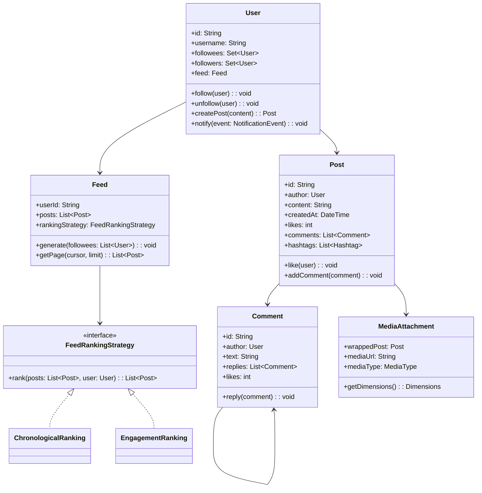

# Design a Social Media Platform (OOD)

**Difficulty**: 🟡 Intermediate
**Codemania**: #132
**Interview Frequency**: High

---

## Problem Statement

Model a social media platform supporting posts, comments, likes, follows, and a personalised feed. The OOD challenge: a post can have media attachments, a poll, and multiple comments each with their own nested replies — Composite and Decorator handle content richness. Feed generation strategy must be swappable (chronological vs engagement-ranked) without touching the `User` class.

---

## Functional Requirements

- Users create posts (text, image, video, poll)
- Users follow/unfollow other users
- Comments thread to two levels (post → comment → reply)
- Likes recorded on posts and comments
- Feed shows posts from followed users in ranked order
- Hashtags index posts for discovery
- Stories expire after 24 hours

---

## Core Entities

| Class | Responsibility |
|-------|---------------|
| `User` | Profile, follow graph, notification preferences |
| `Post` | Core content unit: author, text, created time, like count |
| `Comment` | Attached to a Post or another Comment (thread) |
| `Like` | Records one user's like on a Post or Comment |
| `Follow` | Directed edge: follower → followee |
| `Feed` | Ordered list of posts for a user; refreshed on demand |
| `Notification` | Event delivered to user: new follower, like, mention |
| `MediaAttachment` | Wraps a Post with image/video metadata (Decorator) |
| `Hashtag` | Index: tag text → List of Posts |
| `Story` | 24-hour-expiry post; subtype of Post |

---

## Class Diagram



---

## Design Patterns Used

### 1. Observer — Follow Fan-Out

**Why it fits**: When user A follows user B and B creates a new post, A's feed and A's notification inbox must both update. The `User` (as publisher) should not hardcode calls to `FeedService` and `NotificationService`. Observer decouples them — both subscribe to `PostCreatedEvent`.

```
class User:
  observers: List<UserEventObserver>

  createPost(content: String): Post
    post = new Post(this, content, now())
    postRepo.save(post)
    publish(PostCreatedEvent(this, post))
    return post

  publish(event): void
    for obs in observers:
      obs.onEvent(event)

class FeedFanoutObserver implements UserEventObserver:
  onEvent(PostCreatedEvent event):
    followers = followRepo.getFollowers(event.author.id)
    for follower in followers:
      follower.feed.addPost(event.post)

class NotificationObserver implements UserEventObserver:
  onEvent(PostCreatedEvent event):
    // Notify mentioned users and followers who enabled post notifications
    mentions = extractMentions(event.post.content)
    for user in mentions:
      notificationService.send(user, MentionNotification(event.post))
```

### 2. Composite — Threaded Comments

**Why it fits**: A `Comment` can have replies, and each reply is itself a `Comment` that can have further replies. Treating both as the same `Comment` type (with a `replies` list) allows uniform recursion — `like()`, `report()`, and `getReplyCount()` work the same at any depth.

```
class Comment:
  id: String
  author: User
  text: String
  replies: List<Comment>   // same type — Composite

  addReply(comment: Comment): void
    replies.add(comment)

  getTotalReplyCount(): int
    count = replies.size()
    for reply in replies:
      count += reply.getTotalReplyCount()  // recursive
    return count

  like(user: User): void
    likes++
    publish(LikeEvent(this, user))
```

### 3. Strategy — Feed Ranking

**Why it fits**: Product teams A/B test chronological vs engagement-ranked feeds. Swapping algorithms per user cohort requires the algorithm to be injected, not hardcoded. The `Feed` delegates ordering to its `FeedRankingStrategy` without knowing the implementation.

```
interface FeedRankingStrategy:
  rank(posts: List<Post>, user: User): List<Post>

ChronologicalRanking:
  rank(posts, user):
    return posts.sortedByDescending(p -> p.createdAt)

EngagementRanking:
  rank(posts, user):
    return posts.sortedByDescending(p ->
      p.likes * 1.0 + p.comments.size() * 1.5 +
      recencyBoost(p.createdAt))
```

### 4. Decorator — Rich Post Content

**Why it fits**: A post can be plain text, text + image, text + video, text + poll, or any combination. Inheritance for every combination (TextImagePost, TextVideoPost, TextImagePollPost…) explodes. Decorator wraps a plain `Post` to add media or poll metadata without changing the post interface.

```
class PostDecorator extends Post:
  wrappedPost: Post

  getContent(): String
    return wrappedPost.getContent()

class ImagePostDecorator extends PostDecorator:
  imageUrl: String
  dimensions: Dimensions

  getContent(): String
    return wrappedPost.getContent() + " [image: " + imageUrl + "]"

class PollDecorator extends PostDecorator:
  options: List<PollOption>
  expiresAt: DateTime

  vote(user, option): void
    option.voteCount++
    publish(VoteEvent(this, user, option))
```

---

## Key Method: `generateFeed(user)`

Feed generation is the central operation — it must be fast (user is waiting) and fresh (shows recent posts).

```
FeedService:
  generateFeed(user: User, limit: int): List<Post>
    // 1. Get all followees (cached — follow graph changes rarely)
    followees = followCache.getFollowees(user.id)

    // 2. Pull recent posts from each followee (last 48 hours)
    candidates = []
    cutoff = now().minusHours(48)
    for followee in followees:
      posts = postRepo.getPostsSince(followee.id, cutoff)
      candidates.addAll(posts)

    // 3. De-duplicate (user may follow multiple accounts that repost)
    candidates = candidates.unique(p -> p.id)

    // 4. Rank using injected strategy
    ranked = user.feed.rankingStrategy.rank(candidates, user)

    // 5. Apply content filters (blocked users, hidden hashtags)
    filtered = ranked.filter(p -> not user.hasBlocked(p.author))

    // 6. Return paginated slice
    return filtered.take(limit)
```

**Trade-off**: Pulling 48 hours of posts for users with 5,000 followees fetches many candidates. In production this is pre-computed (fan-out on write), but for OOD interviews, fan-out on read with caching is sufficient.

---

## Design Decisions & Trade-offs

| Decision | Option A | Option B | Choice |
|----------|----------|----------|--------|
| Feed generation | Fan-out on write (pre-fill feeds) | Fan-out on read (compute on request) | Fan-out on read for OOD scope; on write for celebrities with 10M+ followers |
| Like count storage | Row-per-like + aggregate query | Cached counter on Post | Cached counter — aggregate queries at scale are expensive |
| Post delete | Hard delete (remove row) | Soft delete (deleted_at flag) | Soft delete — preserves comment threads, enables undelete |
| Comment depth | Unlimited nesting | Max 2 levels | Max 2 (post → comment → reply) — deeper nesting harms UX |

---

## Top Interview Questions

| Question | What It Tests |
|----------|--------------|
| A celebrity has 50M followers — how do you handle feed fan-out when they post? | Fan-out strategies, hybrid push/pull |
| How would you add a "close friends" feature where posts are visible only to selected followers? | Access control on Post, filtered Observer |
| How do you prevent the same user from liking a post twice? | Idempotency, unique constraint on (userId, postId) |

---

## Related Concepts

- [Learning Management OOD for Observer pattern in enrollment](./learning-management)
- [IOT Smart Home OOD for event-bus fan-out](./iot-smart-home)

---

## 📚 Resources & References

| Resource | Type | What You'll Learn |
|----------|------|------------------|
| [NeetCode OOD Playlist](https://www.youtube.com/@NeetCode) | 📺 YouTube | Observer and feed design walkthroughs |
| [ByteByteGo System Design](https://www.youtube.com/@ByteByteGo) | 📺 YouTube | Instagram/Twitter feed architecture |
| [Head First Design Patterns](https://www.oreilly.com/library/view/head-first-design/0596007124/) | 📖 Blog | Observer and Decorator pattern chapters |
| [Clean Code — Robert Martin](https://www.amazon.com/Clean-Code-Handbook-Software-Craftsmanship/dp/0132350882) | 📚 Book | Single responsibility in social feature classes |
| [GoF Design Patterns](https://www.amazon.com/Design-Patterns-Elements-Reusable-Object-Oriented/dp/0201633612) | 📚 Book | Composite and Strategy reference |
