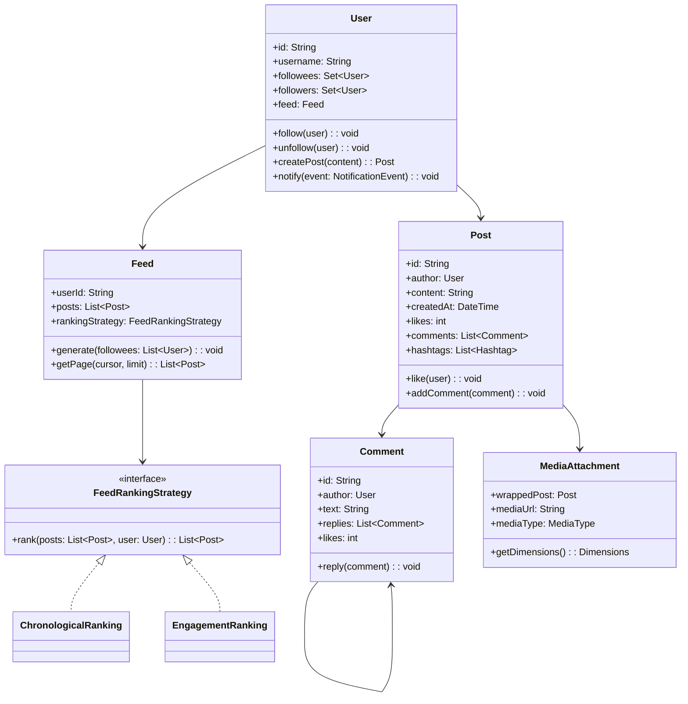
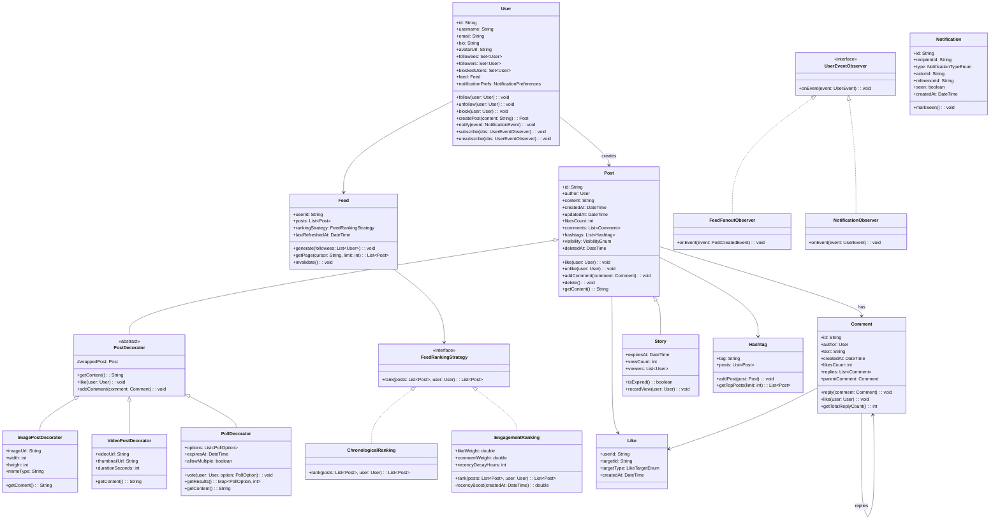

# Design a Social Media Platform (OOD)

**Difficulty**: 🟡 Intermediate
**Codemania**: #132
**Interview Frequency**: High

---

## Problem Statement

Model a social media platform supporting posts, comments, likes, follows, and a personalised feed. The OOD challenge: a post can have media attachments, a poll, and multiple comments each with their own nested replies — Composite and Decorator handle content richness. Feed generation strategy must be swappable (chronological vs engagement-ranked) without touching the `User` class.

---

## Functional Requirements

- Users create posts (text, image, video, poll)
- Users follow/unfollow other users
- Comments thread to two levels (post → comment → reply)
- Likes recorded on posts and comments
- Feed shows posts from followed users in ranked order
- Hashtags index posts for discovery
- Stories expire after 24 hours

---

## Core Entities

| Class | Responsibility |
|-------|---------------|
| `User` | Profile, follow graph, notification preferences |
| `Post` | Core content unit: author, text, created time, like count |
| `Comment` | Attached to a Post or another Comment (thread) |
| `Like` | Records one user's like on a Post or Comment |
| `Follow` | Directed edge: follower → followee |
| `Feed` | Ordered list of posts for a user; refreshed on demand |
| `Notification` | Event delivered to user: new follower, like, mention |
| `MediaAttachment` | Wraps a Post with image/video metadata (Decorator) |
| `Hashtag` | Index: tag text → List of Posts |
| `Story` | 24-hour-expiry post; subtype of Post |

---

## Class Diagram



---

## Design Patterns Used

### 1. Observer — Follow Fan-Out

**Why it fits**: When user A follows user B and B creates a new post, A's feed and A's notification inbox must both update. The `User` (as publisher) should not hardcode calls to `FeedService` and `NotificationService`. Observer decouples them — both subscribe to `PostCreatedEvent`.

```
class User:
  observers: List<UserEventObserver>

  createPost(content: String): Post
    post = new Post(this, content, now())
    postRepo.save(post)
    publish(PostCreatedEvent(this, post))
    return post

  publish(event): void
    for obs in observers:
      obs.onEvent(event)

class FeedFanoutObserver implements UserEventObserver:
  onEvent(PostCreatedEvent event):
    followers = followRepo.getFollowers(event.author.id)
    for follower in followers:
      follower.feed.addPost(event.post)

class NotificationObserver implements UserEventObserver:
  onEvent(PostCreatedEvent event):
    // Notify mentioned users and followers who enabled post notifications
    mentions = extractMentions(event.post.content)
    for user in mentions:
      notificationService.send(user, MentionNotification(event.post))
```

### 2. Composite — Threaded Comments

**Why it fits**: A `Comment` can have replies, and each reply is itself a `Comment` that can have further replies. Treating both as the same `Comment` type (with a `replies` list) allows uniform recursion — `like()`, `report()`, and `getReplyCount()` work the same at any depth.

```
class Comment:
  id: String
  author: User
  text: String
  replies: List<Comment>   // same type — Composite

  addReply(comment: Comment): void
    replies.add(comment)

  getTotalReplyCount(): int
    count = replies.size()
    for reply in replies:
      count += reply.getTotalReplyCount()  // recursive
    return count

  like(user: User): void
    likes++
    publish(LikeEvent(this, user))
```

### 3. Strategy — Feed Ranking

**Why it fits**: Product teams A/B test chronological vs engagement-ranked feeds. Swapping algorithms per user cohort requires the algorithm to be injected, not hardcoded. The `Feed` delegates ordering to its `FeedRankingStrategy` without knowing the implementation.

```
interface FeedRankingStrategy:
  rank(posts: List<Post>, user: User): List<Post>

ChronologicalRanking:
  rank(posts, user):
    return posts.sortedByDescending(p -> p.createdAt)

EngagementRanking:
  rank(posts, user):
    return posts.sortedByDescending(p ->
      p.likes * 1.0 + p.comments.size() * 1.5 +
      recencyBoost(p.createdAt))
```

### 4. Decorator — Rich Post Content

**Why it fits**: A post can be plain text, text + image, text + video, text + poll, or any combination. Inheritance for every combination (TextImagePost, TextVideoPost, TextImagePollPost…) explodes. Decorator wraps a plain `Post` to add media or poll metadata without changing the post interface.

```
class PostDecorator extends Post:
  wrappedPost: Post

  getContent(): String
    return wrappedPost.getContent()

class ImagePostDecorator extends PostDecorator:
  imageUrl: String
  dimensions: Dimensions

  getContent(): String
    return wrappedPost.getContent() + " [image: " + imageUrl + "]"

class PollDecorator extends PostDecorator:
  options: List<PollOption>
  expiresAt: DateTime

  vote(user, option): void
    option.voteCount++
    publish(VoteEvent(this, user, option))
```

---

## Key Method: `generateFeed(user)`

Feed generation is the central operation — it must be fast (user is waiting) and fresh (shows recent posts).

```
FeedService:
  generateFeed(user: User, limit: int): List<Post>
    // 1. Get all followees (cached — follow graph changes rarely)
    followees = followCache.getFollowees(user.id)

    // 2. Pull recent posts from each followee (last 48 hours)
    candidates = []
    cutoff = now().minusHours(48)
    for followee in followees:
      posts = postRepo.getPostsSince(followee.id, cutoff)
      candidates.addAll(posts)

    // 3. De-duplicate (user may follow multiple accounts that repost)
    candidates = candidates.unique(p -> p.id)

    // 4. Rank using injected strategy
    ranked = user.feed.rankingStrategy.rank(candidates, user)

    // 5. Apply content filters (blocked users, hidden hashtags)
    filtered = ranked.filter(p -> not user.hasBlocked(p.author))

    // 6. Return paginated slice
    return filtered.take(limit)
```

**Trade-off**: Pulling 48 hours of posts for users with 5,000 followees fetches many candidates. In production this is pre-computed (fan-out on write), but for OOD interviews, fan-out on read with caching is sufficient.

---

## Design Decisions & Trade-offs

| Decision | Option A | Option B | Choice |
|----------|----------|----------|--------|
| Feed generation | Fan-out on write (pre-fill feeds) | Fan-out on read (compute on request) | Fan-out on read for OOD scope; on write for celebrities with 10M+ followers |
| Like count storage | Row-per-like + aggregate query | Cached counter on Post | Cached counter — aggregate queries at scale are expensive |
| Post delete | Hard delete (remove row) | Soft delete (deleted_at flag) | Soft delete — preserves comment threads, enables undelete |
| Comment depth | Unlimited nesting | Max 2 levels | Max 2 (post → comment → reply) — deeper nesting harms UX |

---

## Top Interview Questions

| Question | What It Tests |
|----------|--------------|
| A celebrity has 50M followers — how do you handle feed fan-out when they post? | Fan-out strategies, hybrid push/pull |
| How would you add a "close friends" feature where posts are visible only to selected followers? | Access control on Post, filtered Observer |
| How do you prevent the same user from liking a post twice? | Idempotency, unique constraint on (userId, postId) |

---

## Related Concepts

- [Learning Management OOD for Observer pattern in enrollment](./learning-management)
- [IOT Smart Home OOD for event-bus fan-out](./iot-smart-home)

---

## Class Design

The following expanded class diagram captures the full inheritance hierarchy, interfaces, and method signatures that make this design extensible and testable:



---

## Design Patterns Applied

### 1. Observer — Decoupled Fan-Out on Post Creation

**Pattern:** Observer (Publish-Subscribe variant)

**How it's used here:** `User` maintains a list of `UserEventObserver` subscribers. When `createPost()` fires, it publishes a `PostCreatedEvent`. Two independent observers react: `FeedFanoutObserver` pushes the new post into each follower's `Feed`, and `NotificationObserver` dispatches mention and follower notifications. Neither observer knows about the other.

**Why it fits:** Without Observer, `User.createPost()` would need explicit calls to `FeedService.fanout()`, `NotificationService.notify()`, and any future subscriber (analytics, moderation). That violates the Open/Closed Principle — adding a new reaction requires modifying `User`. Observer lets new side-effects attach without touching `User`.

**Scale note:** At interview scope, observers run synchronously. In production (e.g., Meta's infrastructure), the `publish()` call enqueues a message to a Kafka topic; consumers (feed worker, notification worker) process it asynchronously.

---

### 2. Composite — Recursive Comment Threads

**Pattern:** Composite

**How it's used here:** `Comment` holds a `replies: List<Comment>` field. A leaf comment has an empty list; a branch comment has one or more nested replies. Methods like `getTotalReplyCount()`, `like()`, and `report()` operate uniformly on the composite tree — callers don't check whether they're at a leaf or a branch.

**Why it fits:** A naive inheritance hierarchy (e.g., `TopLevelComment extends Comment`, `Reply extends Comment`) would require type-checking at every traversal point. Composite collapses that into a single type — the recursive structure is the hierarchy.

**Constraint:** The design caps depth at two levels (post → comment → reply) as a UX rule, not an OOD rule. Removing that cap requires only removing the guard in `Comment.reply()`.

---

### 3. Strategy — Swappable Feed Ranking

**Pattern:** Strategy

**How it's used here:** `Feed` holds a `rankingStrategy: FeedRankingStrategy` reference. `FeedService` injects the strategy per user cohort — group A gets `ChronologicalRanking`, group B gets `EngagementRanking`. A third strategy (`MLRanking`) can be added by implementing the interface, with zero changes to `Feed` or `FeedService`.

**Why it fits:** Feed ranking is the most A/B-tested surface in any social product. Strategy externalises the algorithm so product changes (shipping a new ranking model) become a configuration change, not a code change. This also makes unit tests trivial — swap in a `FixedOrderRanking` stub.

---

### 4. Decorator — Composable Post Content

**Pattern:** Decorator

**How it's used here:** `PostDecorator` wraps a `Post` and delegates all calls to `wrappedPost`. `ImagePostDecorator` adds image fields; `VideoPostDecorator` adds video fields; `PollDecorator` adds polling. To create a video post with a poll, chain: `new PollDecorator(new VideoPostDecorator(new Post(...)))`. Each decorator overrides only what it needs.

**Why it fits:** The alternative — a subclass per combination — produces a combinatorial explosion (TextPost, ImagePost, VideoPost, TextImagePost, TextImagePollPost, etc.). Decorator keeps a single `Post` class and layers feature-specific metadata without altering the base type.

---

## SOLID Principles

### S — Single Responsibility

Each class owns exactly one concern. `User` manages identity and the follow graph. `Feed` owns post collection and pagination. `FeedRankingStrategy` implementations own the ordering algorithm. `NotificationObserver` owns delivery logic. No class crosses domain boundaries — adding email delivery templates doesn't change `User`.

### O — Open/Closed

`Feed` is open for extension (new `FeedRankingStrategy` implementations) but closed for modification. Adding `MLRanking` requires no edits to `Feed` or any existing class. Similarly, the Decorator chain is open — adding `AudioPostDecorator` requires no changes to `Post`, `ImagePostDecorator`, or `VideoPostDecorator`.

### L — Liskov Substitution

Every `FeedRankingStrategy` implementation can replace any other without breaking `Feed`. `Story` is a subtype of `Post` and can appear anywhere a `Post` is expected, with the additional invariant that `isExpired()` gates visibility. `PostDecorator` preserves the `Post` interface so decorated posts pass to any service expecting `Post`.

### I — Interface Segregation

`FeedRankingStrategy` exposes one method (`rank`). `UserEventObserver` exposes one method (`onEvent`). Observers that only care about `PostCreatedEvent` don't implement polling or story handlers — they implement a focused interface and ignore unrelated events.

### D — Dependency Inversion

`Feed` depends on the `FeedRankingStrategy` abstraction, not `ChronologicalRanking` or `EngagementRanking`. `User` depends on the `UserEventObserver` abstraction, not `FeedFanoutObserver`. Concrete implementations are injected at construction time, enabling substitution in tests with stubs.

---

## Concurrency and Thread Safety

### Concurrent Operations

- **Simultaneous likes**: Two users liking the same post at the same instant creates a read-modify-write race on `Post.likesCount`. If both read `5`, increment, and write `6`, one like is lost.
- **Feed invalidation + read**: A feed refresh races with a concurrent read — the reader may see a half-populated list.
- **Follow/unfollow during fan-out**: User A unfollows user B while B's fan-out observer is iterating the follower list. A `ConcurrentModificationException` or missed removal results.

### Mitigations

| Operation | Problem | Fix |
|-----------|---------|-----|
| `Post.like()` | Lost update on `likesCount` | Atomic counter (`AtomicInteger` in JVM; Redis `INCR` in production) |
| `Feed.generate()` vs `Feed.getPage()` | Half-populated list visible during refresh | Immutable snapshot — build new list, then swap reference atomically |
| `User.follow()/unfollow()` | ConcurrentModificationException | `CopyOnWriteArraySet` for `followees`; or read-write lock around follow graph mutations |
| `Comment.reply()` + `getTotalReplyCount()` | Count stale while reply is added | Optimistic locking on the comment tree version; or eventual consistency for counts |

### Thread Model for OOD Interviews

At interview scope, state synchronisation lives in service-layer locks or atomic fields. In production, the `User` object is stateless (loaded per request from a datastore); all mutations go through a service with a distributed lock (e.g., Redis `SETNX`) for critical sections like double-like prevention.

---

## Extension Points

### Adding "Close Friends" / Restricted Audience Posts

The `Post.visibility` field is a `VisibilityEnum` (`PUBLIC`, `FOLLOWERS_ONLY`, `CLOSE_FRIENDS`, `PRIVATE`). To add close-friends support:
1. Add `closeFriends: Set<User>` to `User` with `addCloseFriend()` / `removeCloseFriend()`.
2. In `FeedFanoutObserver.onEvent()`, filter: if `post.visibility == CLOSE_FRIENDS`, only fan out to users in `post.author.closeFriends`.
3. In `FeedService.generateFeed()` read path, apply the same filter.

No changes to `Post`, `Feed`, `FeedRankingStrategy`, or `User.createPost()`. The feature is additive.

### Adding Reactions (Beyond Likes)

Replace `Like` with a `Reaction` that carries a `ReactionType` enum (`LIKE`, `LOVE`, `LAUGH`, `ANGRY`). `Post.likesCount` becomes `Post.reactionCounts: Map<ReactionType, int>`. The `like(user)` method becomes `react(user, type)`. All existing analytics and notification code continues to work — they observe `ReactionEvent` which extends `UserEvent`.

### Adding Direct Messaging

`DirectMessage` is a new top-level entity — not a `Comment` subtype. It references `senderId`, `recipientId`, `threadId`, and `content`. A new `MessageObserver` subscribes to `MessageSentEvent`. The existing Observer infrastructure (`UserEventObserver`) handles delivery without modifying `User`.

### Adding Story Expiry Cleanup

`Story.isExpired()` already computes `now() > expiresAt`. A scheduled `StoryCleanupJob` runs every 5 minutes, queries `storyRepo.findExpired()`, and calls `story.delete()` (soft delete). No changes to any other class. The job is open/closed — adding a "notify creator on expiry" step means adding a new observer, not editing the job.

---

## Data Model

```sql
-- Users
CREATE TABLE users (
    id           UUID PRIMARY KEY DEFAULT gen_random_uuid(),
    username     VARCHAR(30) UNIQUE NOT NULL,
    email        VARCHAR(255) UNIQUE NOT NULL,
    display_name VARCHAR(100),
    bio          TEXT,
    avatar_url   TEXT,
    created_at   TIMESTAMPTZ NOT NULL DEFAULT now(),
    deleted_at   TIMESTAMPTZ          -- soft delete
);
CREATE INDEX idx_users_username ON users(username);

-- Follow graph (directed edge)
CREATE TABLE follows (
    follower_id  UUID NOT NULL REFERENCES users(id),
    followee_id  UUID NOT NULL REFERENCES users(id),
    created_at   TIMESTAMPTZ NOT NULL DEFAULT now(),
    PRIMARY KEY (follower_id, followee_id)
);
CREATE INDEX idx_follows_followee ON follows(followee_id);  -- "get all followers of X"

-- Posts
CREATE TABLE posts (
    id           UUID PRIMARY KEY DEFAULT gen_random_uuid(),
    author_id    UUID NOT NULL REFERENCES users(id),
    content      TEXT NOT NULL,
    visibility   VARCHAR(20) NOT NULL DEFAULT 'PUBLIC',  -- PUBLIC|FOLLOWERS|CLOSE_FRIENDS
    post_type    VARCHAR(20) NOT NULL DEFAULT 'TEXT',    -- TEXT|STORY
    expires_at   TIMESTAMPTZ,          -- non-null for Stories
    likes_count  INT NOT NULL DEFAULT 0,
    comments_count INT NOT NULL DEFAULT 0,
    created_at   TIMESTAMPTZ NOT NULL DEFAULT now(),
    deleted_at   TIMESTAMPTZ
);
CREATE INDEX idx_posts_author_created ON posts(author_id, created_at DESC);
CREATE INDEX idx_posts_expires ON posts(expires_at) WHERE expires_at IS NOT NULL;

-- Media attachments (Decorator layer in the DB)
CREATE TABLE media_attachments (
    id           UUID PRIMARY KEY DEFAULT gen_random_uuid(),
    post_id      UUID NOT NULL REFERENCES posts(id),
    media_type   VARCHAR(10) NOT NULL,  -- IMAGE|VIDEO|AUDIO
    url          TEXT NOT NULL,
    width        INT,
    height       INT,
    duration_sec INT,            -- for video/audio
    mime_type    VARCHAR(50),
    sort_order   SMALLINT NOT NULL DEFAULT 0,
    created_at   TIMESTAMPTZ NOT NULL DEFAULT now()
);
CREATE INDEX idx_media_post ON media_attachments(post_id);

-- Poll options (PollDecorator → DB)
CREATE TABLE poll_options (
    id           UUID PRIMARY KEY DEFAULT gen_random_uuid(),
    post_id      UUID NOT NULL REFERENCES posts(id),
    option_text  VARCHAR(200) NOT NULL,
    votes_count  INT NOT NULL DEFAULT 0,
    sort_order   SMALLINT NOT NULL DEFAULT 0
);

CREATE TABLE poll_votes (
    user_id      UUID NOT NULL REFERENCES users(id),
    option_id    UUID NOT NULL REFERENCES poll_options(id),
    voted_at     TIMESTAMPTZ NOT NULL DEFAULT now(),
    PRIMARY KEY (user_id, option_id)
);

-- Comments (self-referential Composite)
CREATE TABLE comments (
    id              UUID PRIMARY KEY DEFAULT gen_random_uuid(),
    post_id         UUID NOT NULL REFERENCES posts(id),
    parent_comment_id UUID REFERENCES comments(id),  -- NULL for top-level
    author_id       UUID NOT NULL REFERENCES users(id),
    text            TEXT NOT NULL,
    likes_count     INT NOT NULL DEFAULT 0,
    depth           SMALLINT NOT NULL DEFAULT 0,   -- 0=top-level, 1=reply
    created_at      TIMESTAMPTZ NOT NULL DEFAULT now(),
    deleted_at      TIMESTAMPTZ
);
CREATE INDEX idx_comments_post_parent ON comments(post_id, parent_comment_id, created_at);

-- Likes (deduplication via PK)
CREATE TABLE likes (
    user_id      UUID NOT NULL REFERENCES users(id),
    target_id    UUID NOT NULL,           -- post_id or comment_id
    target_type  VARCHAR(10) NOT NULL,    -- POST|COMMENT
    created_at   TIMESTAMPTZ NOT NULL DEFAULT now(),
    PRIMARY KEY (user_id, target_id, target_type)
);

-- Hashtags
CREATE TABLE hashtags (
    id       UUID PRIMARY KEY DEFAULT gen_random_uuid(),
    tag      VARCHAR(100) UNIQUE NOT NULL
);
CREATE TABLE post_hashtags (
    post_id  UUID NOT NULL REFERENCES posts(id),
    tag_id   UUID NOT NULL REFERENCES hashtags(id),
    PRIMARY KEY (post_id, tag_id)
);
CREATE INDEX idx_post_hashtags_tag ON post_hashtags(tag_id);

-- Notifications
CREATE TABLE notifications (
    id            UUID PRIMARY KEY DEFAULT gen_random_uuid(),
    recipient_id  UUID NOT NULL REFERENCES users(id),
    actor_id      UUID REFERENCES users(id),
    type          VARCHAR(30) NOT NULL,   -- LIKE|COMMENT|MENTION|FOLLOW|STORY_VIEW
    reference_id  UUID,                  -- post_id, comment_id, etc.
    reference_type VARCHAR(20),
    seen          BOOLEAN NOT NULL DEFAULT false,
    created_at    TIMESTAMPTZ NOT NULL DEFAULT now()
);
CREATE INDEX idx_notifications_recipient_seen ON notifications(recipient_id, seen, created_at DESC);
```

---

## Scale Bottlenecks

| Traffic Level | Component That Breaks | Symptoms | Mitigation |
|---------------|----------------------|----------|------------|
| 10x baseline (1M DAU) | `generateFeed()` fan-out on read | Feed latency spikes to 2–5s; `posts` table hot on `author_id` index scans | Cache followee list in Redis; pre-warm feed on first request with short TTL (5 min) |
| 100x baseline (10M DAU) | `likes` table write throughput | `INSERT INTO likes` contention; `UPDATE posts SET likes_count` row-lock conflicts | Redis `INCR` for hot counters; batch-flush to Postgres every 30s; `likes` table write to Kafka for async persistence |
| 100x baseline (10M DAU) | Celebrity fan-out (user with 10M+ followers) | `FeedFanoutObserver` iterates 10M rows per post; fan-out takes minutes | Hybrid push/pull: push to active followers only (online in last 24h); pull for the rest at read time |
| 1000x baseline (100M DAU) | Postgres `posts` table | Single-shard write throughput saturates at ~5k writes/sec | Shard `posts` by `author_id` hash (16–64 shards); route reads via consistent hashing; cross-shard feed assembly in a scatter-gather layer |
| 1000x baseline (100M DAU) | Hashtag index queries | `post_hashtags JOIN hashtags` full table scan on trending tags | Elasticsearch or Cassandra for hashtag → post lookups; materialized trending list updated every 60s |

---

## How Instagram Built This

Instagram's engineering team has published extensively on the evolution of their feed and social graph infrastructure, making it the canonical real-world reference for this OOD problem.

**Technology choices:** Instagram's Python/Django monolith ran on PostgreSQL with a sharded `media` table (`user_id % N` sharding scheme) and a separate `friendships` table for the follow graph. Feed generation originally used fan-out on read — on each feed request, they queried the `media` table for the 300 most recent posts from each followee, then ranked them in Python. By 2012 with 30M users, this worked; by 2014 with 200M users it required a shift.

**The non-obvious decision:** Instagram did not move wholesale to fan-out on write (as Twitter did). Instead, they built a hybrid: push new posts to a pre-computed feed cache (Redis sorted sets, scored by timestamp) for users with fewer than ~1,000 followees, but skip the push for celebrity accounts with millions of followers. When a user loads their feed, the service reads their pre-built cache and — if they follow any celebrities — merges celebrity posts in real time via a pull step. This avoids the thundering-herd problem of fanning out a single Beyoncé post to 30M feeds simultaneously.

**Specific numbers (2013 public data):** 1 billion likes/day (11,600 likes/sec), 55 million photos/day (637 uploads/sec), 150 million MAU. Feed reads ran at approximately 100k req/sec. They used 3 PostgreSQL replicas per shard for read scalability and a Redis cluster with 6 shards for the feed cache.

**Architectural lesson for OOD interviews:** The `FeedRankingStrategy` interface maps directly to Instagram's A/B tested ranking experiments. They ran chronological feeds until 2016, then switched to engagement-ranked. The Strategy pattern is not just academic — it reflects the actual deployment model where ranking algorithms are swapped per user cohort via feature flags.

Source: Instagram Engineering Blog — "What Powers Instagram: Hundreds of Instances, Dozens of Technologies" (2011) and "Sharding & IDs at Instagram" (2012).

---

## Interview Angle

**What the interviewer is testing:** Whether you can identify which design patterns actually reduce coupling in a social product (Observer for fan-out, Strategy for ranking), and whether you understand the tension between OOD purity and production scale constraints.

**Common mistakes candidates make:**

1. **Overusing inheritance for post types.** Candidates define `TextPost extends Post`, `ImagePost extends Post`, `VideoPost extends Post`, then get stuck when the interviewer asks "how do you represent a post with both an image and a poll?" Decorator solves this cleanly; inheritance creates a combinatorial explosion of 8+ subclasses.

2. **Hardcoding feed generation in User.** Candidates write `user.getFeed()` with an inline ranking loop. This violates SRP (User shouldn't know about ranking algorithms) and OCP (adding a new ranking algorithm requires editing User). Feed generation belongs in `FeedService` with a `FeedRankingStrategy` injected at call time.

3. **Ignoring the double-like problem.** Most candidates add a `likesCount++` call in `Post.like()` and move on. The interviewer expects acknowledgment of the idempotency requirement: the `likes` table primary key is `(user_id, target_id)` — a duplicate insert fails fast. The in-memory counter must be guarded by an `AtomicInteger` or equivalent.

**The insight that separates good from great answers:** Recognising that `PostCreatedEvent` fan-out is fundamentally an asynchronous operation that should be decoupled from the HTTP response cycle. A great candidate says: "In OOD scope, the Observer runs synchronously. In production, `user.publish(event)` enqueues to a message broker — Kafka or SQS — and the feed and notification workers consume it independently. The Observer interface doesn't change; only the transport layer does." This shows the candidate understands how OOD patterns translate to distributed systems.

---

## Key Numbers to Remember

| Metric | Value | Context |
|--------|-------|---------|
| Instagram likes peak | 11,600 likes/sec | 1 billion likes/day at 2013 scale |
| Instagram uploads | 637 uploads/sec | 55 million photos/day |
| Redis sorted set `ZRANGEBYSCORE` | ~0.3ms P99 | Pre-built feed cache; 1,000-item feed slice |
| PostgreSQL `INSERT INTO likes` with unique PK | ~1ms P99 | Double-like prevention via DB constraint |
| Celebrity fan-out threshold | ~1,000 followers | Below: push to feed cache; above: pull at read time |
| Feed cache TTL (Redis) | 5–10 minutes | Balance staleness vs. cache memory at 100M DAU |
| Comment depth cap | 2 levels | Post → comment → reply; enforced in `Comment.reply()` |
| Soft-delete retention | 30 days | `deleted_at` flag; permanent erasure on schedule |

---

## 📚 Resources & References

| Resource | Type | What You'll Learn |
|----------|------|------------------|
| [NeetCode OOD Playlist](https://www.youtube.com/@NeetCode) | 📺 YouTube | Observer and feed design walkthroughs |
| [ByteByteGo System Design](https://www.youtube.com/@ByteByteGo) | 📺 YouTube | Instagram/Twitter feed architecture |
| [Head First Design Patterns](https://www.oreilly.com/library/view/head-first-design/0596007124/) | 📖 Blog | Observer and Decorator pattern chapters |
| [Clean Code — Robert Martin](https://www.amazon.com/Clean-Code-Handbook-Software-Craftsmanship/dp/0132350882) | 📚 Book | Single responsibility in social feature classes |
| [GoF Design Patterns](https://www.amazon.com/Design-Patterns-Elements-Reusable-Object-Oriented/dp/0201633612) | 📚 Book | Composite and Strategy reference |
