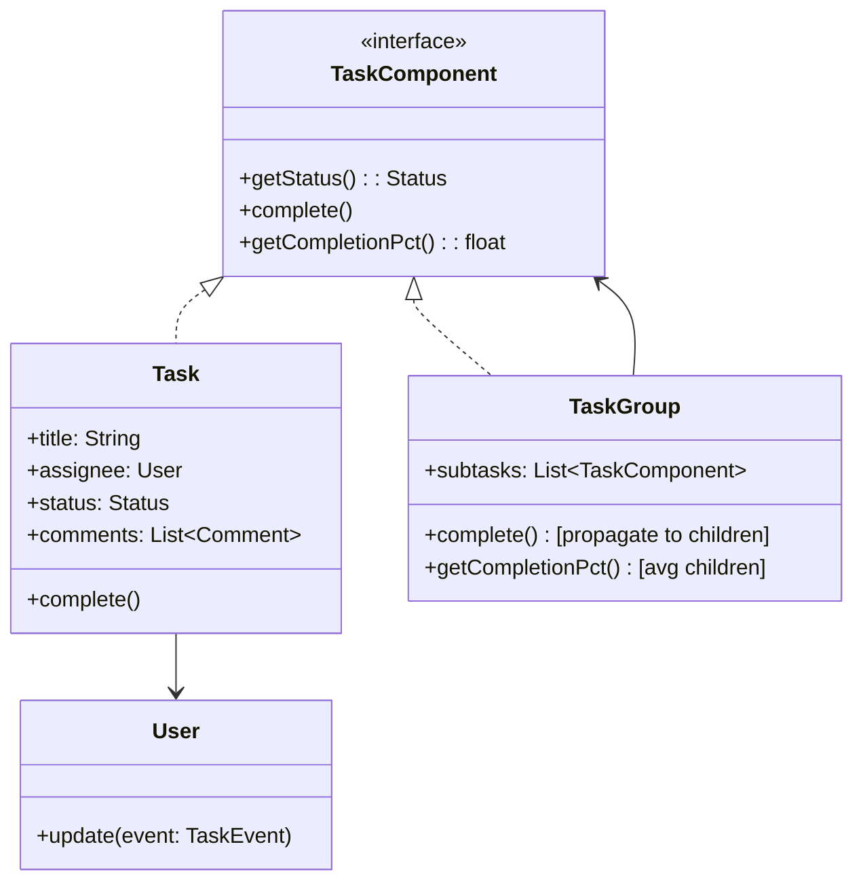

# Design a Task Management App (OOD)

**Difficulty**: 🟢 Beginner
**Reading Time**: Coming Soon
**Interview Frequency**: Medium

---

> 🚧 **Full article coming soon.** This stub gives you the essentials to start thinking about this problem.

---

## The Core Problem

Modeling tasks, subtasks, assignments, and status transitions in an OOP design — the key challenge is the hierarchical nature (a task can contain subtasks, which contain sub-subtasks) without duplicating code for completion logic. The Composite pattern treats individual tasks and task groups uniformly, while Observer broadcasts status changes to assignees and parent tasks.

## Functional Requirements

- Create tasks with title, description, due date, priority
- Assign tasks to users
- Break tasks into subtasks (unlimited nesting)
- Track status: Todo → In Progress → Review → Done
- Notify assignees on assignment/status change

## Non-Functional Requirements

| Requirement | Target |
|-------------|--------|
| Extensibility | New task types (recurring, milestone) without existing changes |
| Consistency | Parent task status reflects subtask statuses |
| Notification | All observers notified within 1 second of status change |

## Back-of-Envelope Estimates

- **Classes needed**: ~8-10 classes (Task, Subtask, User, Comment, Label, TaskStatus, Notification, Project)
- **Composite depth**: Typically 3-4 levels deep in practice; model must support arbitrary depth
- **Observer recipients**: Task has 1-5 observers typically; notifications are cheap operations

## Key Design Decisions

1. **Composite Pattern for Task Hierarchy** — `TaskComponent` interface with `getStatus()`, `complete()`, `getCompletionPercentage()`; `Task` is a leaf, `TaskGroup`/`Epic` is a composite containing `TaskComponent` list; `complete()` on parent propagates to all children; tree traversal handles any depth.
2. **Observer Pattern for Notifications** — `Task` extends `Observable`; `User` implements `Observer`; when status changes, task calls `notifyObservers(event)`; users receive push notifications; loose coupling — task doesn't know concrete notification channel.
3. **Builder Pattern for Task Creation** — `TaskBuilder.title("Fix bug").priority(HIGH).assignee(user).dueDate(tomorrow).label("backend").build()`; enforces required fields (title must be set), provides readable construction, prevents partially constructed task objects.

## High-Level Architecture

## Top Interview Questions for This Problem

| Question | Tests |
|----------|-------|
| How do you compute completion percentage when a task has 3 subtasks (2 done, 1 not)? | Composite pattern recursion |
| How would you handle recurring tasks that reset every Monday? | New task type, factory, Template Method |
| How do you avoid circular dependencies in task/subtask relationships? | Validation, cycle detection |

## Related Concepts

- [Fitness tracker OOD for similar Observer pattern usage](./fitness-tracker)
- [Chess game OOD for Command pattern comparison](./chess-game)

---

*📚 Full deep-dive with multiple approaches, trade-off tables, and pseudocode coming soon.*

## 📚 Resources & References

| Resource | Type | What You'll Learn |
|----------|------|------------------|
| [ByteByteGo — Design a Task Management System](https://www.youtube.com/@ByteByteGo) | 📺 YouTube | Search "task management design" — CRUD operations, assignments, notifications |
| [Jira Architecture: Issue Tracking at Scale](https://developer.atlassian.com/cloud/jira/platform/rest/v3/intro/) | 📚 Docs | Jira's data model for projects, issues, workflows, and permissions |
| [Linear Engineering: Modern Issue Tracking](https://linear.app/blog/how-we-built-linear-a-better-way-to-track-issues) | 📖 Blog | How Linear built a fast, real-time task management app |
| [Observer Pattern for Task Notifications](https://refactoring.guru/design-patterns/observer) | 📚 Docs | Event-driven notifications when task status changes |
| [Command Pattern for Undo/Redo](https://refactoring.guru/design-patterns/command) | 📚 Docs | Implementing undo/redo for task edits using the Command pattern |
