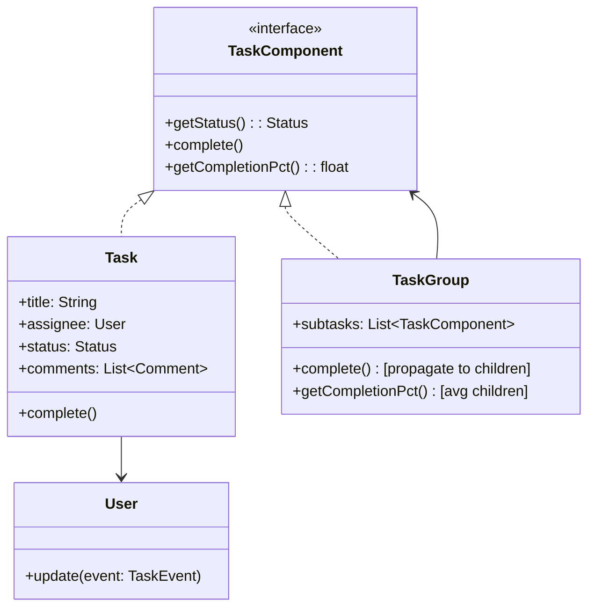
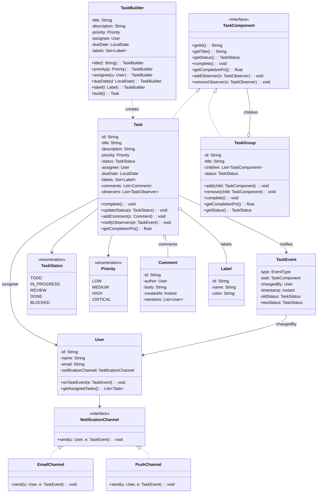
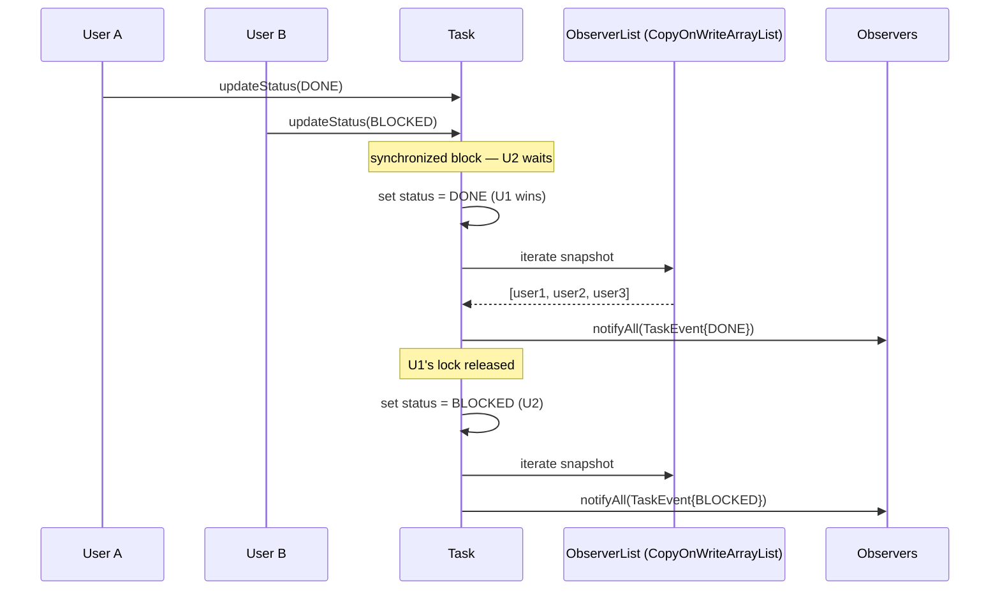
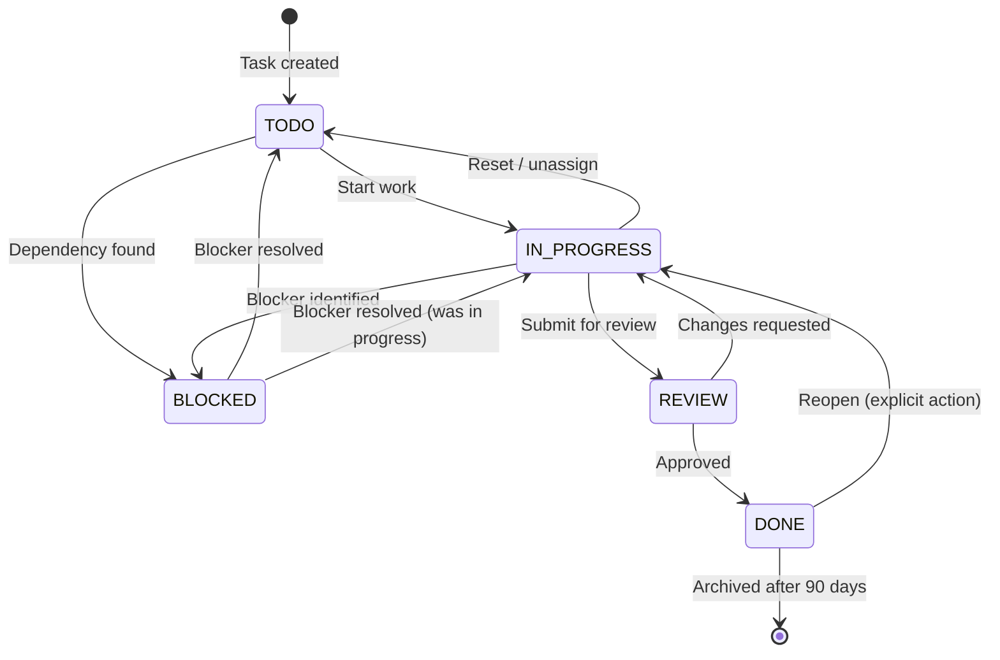

# Design a Task Management App (OOD)

**Difficulty**: 🟢 Beginner
**Reading Time**: Coming Soon
**Interview Frequency**: Medium

---

> 🚧 **Full article coming soon.** This stub gives you the essentials to start thinking about this problem.

---

## The Core Problem

Modeling tasks, subtasks, assignments, and status transitions in an OOP design — the key challenge is the hierarchical nature (a task can contain subtasks, which contain sub-subtasks) without duplicating code for completion logic. The Composite pattern treats individual tasks and task groups uniformly, while Observer broadcasts status changes to assignees and parent tasks.

## Functional Requirements

- Create tasks with title, description, due date, priority
- Assign tasks to users
- Break tasks into subtasks (unlimited nesting)
- Track status: Todo → In Progress → Review → Done
- Notify assignees on assignment/status change

## Non-Functional Requirements

| Requirement | Target |
|-------------|--------|
| Extensibility | New task types (recurring, milestone) without existing changes |
| Consistency | Parent task status reflects subtask statuses |
| Notification | All observers notified within 1 second of status change |

## Back-of-Envelope Estimates

- **Classes needed**: ~8-10 classes (Task, Subtask, User, Comment, Label, TaskStatus, Notification, Project)
- **Composite depth**: Typically 3-4 levels deep in practice; model must support arbitrary depth
- **Observer recipients**: Task has 1-5 observers typically; notifications are cheap operations

## Key Design Decisions

1. **Composite Pattern for Task Hierarchy** — `TaskComponent` interface with `getStatus()`, `complete()`, `getCompletionPercentage()`; `Task` is a leaf, `TaskGroup`/`Epic` is a composite containing `TaskComponent` list; `complete()` on parent propagates to all children; tree traversal handles any depth.
2. **Observer Pattern for Notifications** — `Task` extends `Observable`; `User` implements `Observer`; when status changes, task calls `notifyObservers(event)`; users receive push notifications; loose coupling — task doesn't know concrete notification channel.
3. **Builder Pattern for Task Creation** — `TaskBuilder.title("Fix bug").priority(HIGH).assignee(user).dueDate(tomorrow).label("backend").build()`; enforces required fields (title must be set), provides readable construction, prevents partially constructed task objects.

## High-Level Architecture



## Top Interview Questions for This Problem

| Question | Tests |
|----------|-------|
| How do you compute completion percentage when a task has 3 subtasks (2 done, 1 not)? | Composite pattern recursion |
| How would you handle recurring tasks that reset every Monday? | New task type, factory, Template Method |
| How do you avoid circular dependencies in task/subtask relationships? | Validation, cycle detection |

## Related Concepts

- [Fitness tracker OOD for similar Observer pattern usage](./fitness-tracker)
- [Chess game OOD for Command pattern comparison](./chess-game)

---

## Class Design

The full class diagram shows all entities, their fields, relationships, and the key methods required to fulfill the functional requirements.



---

## Design Patterns Applied

### 1. Composite Pattern — Task Hierarchy

**How it's used**: `TaskComponent` is the component interface. `Task` is the leaf node (no children). `TaskGroup` is the composite node that holds a `List<TaskComponent>`, which can contain either `Task` leaves or nested `TaskGroup` composites. The `complete()` method on `TaskGroup` iterates children and calls `complete()` on each, regardless of whether the child is a leaf or another composite.

**Why it fits**: The interviewer expects you to recognize that without Composite, you would need separate code paths like `if task.hasSubtasks() { for each subtask... } else { task.complete() }`. Composite collapses this into a single recursive call that works at any depth. `getCompletionPct()` on `TaskGroup` returns the average of all children's completion percentages — leaves return 0.0 or 1.0, groups recurse automatically.

**Key implementation detail**: `TaskGroup.getStatus()` derives its status from children. If all children are `DONE`, group is `DONE`. If any child is `IN_PROGRESS`, group is `IN_PROGRESS`. If any child is `BLOCKED`, group is `BLOCKED`. This derived-status logic lives only in `TaskGroup`, not duplicated anywhere.

### 2. Observer Pattern — Status Change Notifications

**How it's used**: `Task` maintains a `List<TaskObserver>` (the observable). `User` implements `TaskObserver` with `onTaskEvent(TaskEvent e)`. When `Task.updateStatus()` is called, it sets the new status, creates a `TaskEvent`, and calls `notifyObservers(event)`. Each observer processes the event independently — one user sends an email, another a push notification.

**Why it fits**: The task doesn't need to know what `User` does with the event. You can add Slack notifications, audit logging, or analytics as new observers without touching `Task`. This is the Open/Closed Principle in action alongside Observer.

**Extension example**: Adding Slack notifications requires only creating `SlackObserver implements TaskObserver` and registering it. Zero changes to `Task`.

### 3. Builder Pattern — Task Construction

**How it's used**: `TaskBuilder` chains setter methods and enforces a required `title` field. `build()` throws `IllegalStateException` if title is null. All optional fields (description, labels, assignee) have safe defaults.

**Why it fits**: A `Task` constructor with 7 parameters is unreadable and error-prone — `new Task(title, desc, null, HIGH, null, dueDate, labels)` leaves you guessing which null is which. Builder makes construction self-documenting: `TaskBuilder.title("Fix login").priority(HIGH).dueDate(tomorrow).build()`.

### 4. Strategy Pattern — Notification Channel

**How it's used**: `NotificationChannel` is the strategy interface with `send(User, TaskEvent)`. `User` holds a reference to a `NotificationChannel` (email, push, Slack). When an observer event fires, the user delegates to its channel.

**Why it fits**: Notification delivery is an algorithm that varies by user preference. Users on mobile get push; users on desktop get email. The same `User.onTaskEvent()` code works regardless.

---

## SOLID Principles

### Single Responsibility (S)

Each class has one reason to change:
- `Task` changes only when task business rules change
- `NotificationChannel` changes only when delivery mechanism changes
- `TaskBuilder` changes only when task construction API changes
- `Comment` changes only when comment structure changes

The violation to watch for: putting `sendEmailNotification()` inside `Task` couples task state management to email infrastructure. The Observer pattern avoids this.

### Open/Closed (O)

The system is open for extension, closed for modification:
- Add `RecurringTask implements TaskComponent` without changing `TaskGroup` or any observer
- Add `SlackChannel implements NotificationChannel` without changing `User`
- Add `MilestoneTask implements TaskComponent` with custom `getCompletionPct()` logic without touching existing code

### Liskov Substitution (L)

`Task` and `TaskGroup` are substitutable for `TaskComponent`. Any code that calls `component.complete()` or `component.getCompletionPct()` works correctly whether the component is a leaf or a group. The contract (complete all children, return 0.0–1.0 percentage) is upheld by both.

### Interface Segregation (I)

`TaskComponent` contains only the methods that both leaves and composites share. It does NOT include `add(child)` and `remove(child)` — those are only on `TaskGroup`. This prevents `Task` (a leaf) from having meaningless `add()`/`remove()` methods that throw `UnsupportedOperationException`.

### Dependency Inversion (D)

`Task` depends on the `TaskObserver` interface, not `User` or `EmailNotifier`. `User` depends on the `NotificationChannel` interface, not `EmailSender`. High-level business logic (task state management) doesn't depend on low-level infrastructure (SMTP, APNs).

---

## Concurrency and Thread Safety

Several operations are concurrent in a real task management app:

**1. Simultaneous status updates**: Two users updating the same task status at the same time. Without synchronization, both read `status = IN_PROGRESS`, both write `status = DONE`, and only one `TaskEvent` fires.

**Fix**: Synchronize `updateStatus()` or use optimistic locking with a version field. In Java: `synchronized(this) { ... }` or `compareAndSet` on an `AtomicReference<TaskStatus>`.

**2. Observer list mutation during notification**: A thread notifies all observers while another thread adds a new observer. This causes `ConcurrentModificationException`.

**Fix**: Use `CopyOnWriteArrayList<TaskObserver>` for the observers list. Reads (iteration during notify) see a snapshot; writes (add/remove) are safe.

**3. Completion percentage calculation on TaskGroup**: While `getCompletionPct()` iterates children, another thread adds a new child. The calculated average is based on a partially mutated list.

**Fix**: Use `ReadWriteLock` — multiple readers can compute percentage concurrently; a writer (add/remove child) acquires an exclusive write lock.

**4. Comment ordering**: Two users add comments simultaneously. Comment list order becomes non-deterministic.

**Fix**: Comments are append-only. Use `ConcurrentLinkedQueue` or timestamp-sort on read. Comments don't need strong ordering guarantees — eventual consistency is acceptable.



---

## Extension Points

### Adding Recurring Tasks

Create `RecurringTask implements TaskComponent` with a `RecurrenceRule` field (weekly, daily, custom cron). Override `complete()`: instead of setting `status = DONE` permanently, it creates the next instance of the task based on the recurrence rule and resets status. The `TaskFactory` (Factory pattern) produces the right type: `TaskFactory.create(RECURRING, rule)`.

No changes to `TaskGroup` — it still holds `List<TaskComponent>` and calls `complete()` polymorphically. No changes to existing observers — they receive the same `TaskEvent` with `EventType.COMPLETED` and a new `EventType.RESCHEDULED`.

### Adding Milestones

`Milestone extends TaskGroup` — a milestone is a group of tasks with a specific due date and no own work content. Override `getStatus()`: milestone is `DONE` only when 100% of children are done (vs the default average-based logic). Add `isMissed(): boolean` that checks `dueDate.isBefore(LocalDate.now()) && status != DONE`.

### Adding Undo/Redo

Introduce `TaskCommand` interface with `execute()` and `undo()`. Commands: `AssignCommand`, `StatusChangeCommand`, `AddCommentCommand`. A `CommandHistory` stack holds the last N commands. `TaskManager.undo()` pops and calls `undo()`. This follows the Command pattern and requires no changes to `Task`, `User`, or `TaskGroup`.

---

## Data Model

```sql
-- Tasks table (both leaf tasks and group headers)
CREATE TABLE tasks (
    id            UUID PRIMARY KEY DEFAULT gen_random_uuid(),
    title         VARCHAR(500) NOT NULL,
    description   TEXT,
    status        VARCHAR(20) NOT NULL DEFAULT 'TODO'
                  CHECK (status IN ('TODO','IN_PROGRESS','REVIEW','DONE','BLOCKED')),
    priority      VARCHAR(10) NOT NULL DEFAULT 'MEDIUM'
                  CHECK (priority IN ('LOW','MEDIUM','HIGH','CRITICAL')),
    task_type     VARCHAR(20) NOT NULL DEFAULT 'TASK'
                  CHECK (task_type IN ('TASK','GROUP','MILESTONE','RECURRING')),
    parent_id     UUID REFERENCES tasks(id) ON DELETE CASCADE,
    assignee_id   UUID REFERENCES users(id),
    project_id    UUID REFERENCES projects(id) NOT NULL,
    due_date      DATE,
    recurrence    JSONB,               -- {"type":"weekly","days":["MON"],"until":"2025-12-31"}
    version       INTEGER NOT NULL DEFAULT 1, -- optimistic lock
    created_by    UUID REFERENCES users(id) NOT NULL,
    created_at    TIMESTAMPTZ NOT NULL DEFAULT now(),
    updated_at    TIMESTAMPTZ NOT NULL DEFAULT now()
);

-- Indexes for common access patterns
CREATE INDEX idx_tasks_parent     ON tasks(parent_id);
CREATE INDEX idx_tasks_assignee   ON tasks(assignee_id);
CREATE INDEX idx_tasks_project    ON tasks(project_id);
CREATE INDEX idx_tasks_status     ON tasks(project_id, status);
CREATE INDEX idx_tasks_due_date   ON tasks(due_date) WHERE status != 'DONE';

-- Users
CREATE TABLE users (
    id                   UUID PRIMARY KEY DEFAULT gen_random_uuid(),
    name                 VARCHAR(200) NOT NULL,
    email                VARCHAR(320) UNIQUE NOT NULL,
    notification_prefs   JSONB NOT NULL DEFAULT '{"email":true,"push":true,"slack":false}',
    timezone             VARCHAR(50) NOT NULL DEFAULT 'UTC',
    created_at           TIMESTAMPTZ NOT NULL DEFAULT now()
);

-- Comments
CREATE TABLE comments (
    id          UUID PRIMARY KEY DEFAULT gen_random_uuid(),
    task_id     UUID REFERENCES tasks(id) ON DELETE CASCADE NOT NULL,
    author_id   UUID REFERENCES users(id) NOT NULL,
    body        TEXT NOT NULL,
    created_at  TIMESTAMPTZ NOT NULL DEFAULT now()
);

CREATE INDEX idx_comments_task ON comments(task_id, created_at DESC);

-- Labels (many-to-many with tasks)
CREATE TABLE labels (
    id        UUID PRIMARY KEY DEFAULT gen_random_uuid(),
    project_id UUID REFERENCES projects(id) NOT NULL,
    name      VARCHAR(100) NOT NULL,
    color     CHAR(7) NOT NULL DEFAULT '#808080',
    UNIQUE (project_id, name)
);

CREATE TABLE task_labels (
    task_id   UUID REFERENCES tasks(id) ON DELETE CASCADE,
    label_id  UUID REFERENCES labels(id) ON DELETE CASCADE,
    PRIMARY KEY (task_id, label_id)
);

-- Task watchers (Observer pattern persistence)
CREATE TABLE task_watchers (
    task_id    UUID REFERENCES tasks(id) ON DELETE CASCADE,
    user_id    UUID REFERENCES users(id) ON DELETE CASCADE,
    added_at   TIMESTAMPTZ NOT NULL DEFAULT now(),
    PRIMARY KEY (task_id, user_id)
);

-- Audit log (Command pattern history for undo/redo)
CREATE TABLE task_events (
    id           UUID PRIMARY KEY DEFAULT gen_random_uuid(),
    task_id      UUID REFERENCES tasks(id) ON DELETE CASCADE NOT NULL,
    event_type   VARCHAR(50) NOT NULL,  -- STATUS_CHANGED, ASSIGNED, COMMENTED, CREATED
    actor_id     UUID REFERENCES users(id) NOT NULL,
    old_value    JSONB,
    new_value    JSONB,
    occurred_at  TIMESTAMPTZ NOT NULL DEFAULT now()
);

CREATE INDEX idx_task_events_task ON task_events(task_id, occurred_at DESC);
```

---

## Scale Bottlenecks

| Traffic Level | Component That Breaks | Symptoms | Mitigation |
|---------------|----------------------|----------|------------|
| 10x baseline (100k tasks/org) | `getCompletionPct()` on deep TaskGroup trees | Full recursive DB query on every page load; P99 > 500ms | Cache computed completion % in `tasks.completion_pct` column; invalidate on child status change |
| 100x baseline (1M tasks/org) | `task_events` table (audit log) | Insert rate overwhelms single Postgres writer; event queries slow | Partition `task_events` by `occurred_at` monthly; archive partitions older than 6 months to cold storage |
| 100x baseline | Observer fan-out (notify 500 watchers per task) | Synchronous notification blocks status-update API; P99 > 2s | Push notifications to async queue (Redis/SQS); decouple notification delivery from status update transaction |
| 1000x baseline (10M tasks) | Single `tasks` table | Row-level lock contention on hot tasks; sequential scans on `parent_id` | Shard by `project_id`; each shard is an independent Postgres instance |
| 1000x baseline | `task_labels` join at query time | Cross-shard joins impossible; label filter requires scatter-gather | Denormalize label names into `tasks.label_names TEXT[]`; use GIN index for array contains queries |

---

## How Linear Built This

Linear is a task management tool used by 10,000+ engineering teams, processing over 2 million issue updates per day across its customer base. Their engineering team published blog posts and conference talks detailing non-obvious architectural decisions.

**Sync engine over REST**: Linear built a custom sync engine using Operational Transformation (OT) principles. Every client holds a local replica of tasks. Mutations (status change, title edit) are applied locally first for instant feedback, then sent to the server. The server merges mutations with a deterministic last-write-wins strategy keyed on `(task_id, field_name, timestamp)`. This is the key non-obvious choice — most teams would reach for REST CRUD endpoints, which introduce round-trip latency that makes the UI feel sluggish at 50–200ms network latency.

**PostgreSQL with aggressive indexing**: Linear uses Postgres as the primary store with partial indexes on non-completed tasks (`WHERE status != 'DONE'`). Their finding: 80% of queries only touch open tasks; including completed tasks in every index wastes I/O. Completion archive to a separate table after 90 days keeps the hot dataset small.

**Real-time via WebSockets**: Linear pushes every mutation to all connected clients via WebSockets. Each mutation is a compact JSON diff (not a full task object). At 10,000 concurrent users, this is ~500 messages/second — well within a single Node.js WebSocket server's capacity. They horizontal-scale the WebSocket tier independently of the API tier.

**Specific numbers**: Linear reports sub-50ms P99 for task creation and status updates. The sync engine handles bursts of 50,000 mutations/minute during business hours. Their Postgres write throughput peaks at ~800 writes/second across all tables.

Source: [Linear Engineering: How we built Linear](https://linear.app/blog/how-we-built-linear-a-better-way-to-track-issues)

---

## Interview Angle

**What the interviewer is testing**: Whether you can identify the right structural patterns (Composite for hierarchy, Observer for events) and articulate why — not just name them. They also test whether you can extend the design cleanly when requirements change mid-interview.

**Common mistakes candidates make**:

1. **Putting notification logic inside Task**: Writing `task.complete() { ... sendEmail(assignee) }` couples task state to email infrastructure. The interviewer will ask "how do you add Slack notifications?" and the answer will require changing `Task` — violating OCP. Use Observer to decouple.

2. **Designing Task with a `children: List<Task>` field on the same class**: This works but loses the Composite pattern's elegance. `complete()` must check `if (children.isEmpty())` everywhere. When you add `TaskGroup` vs `Task` semantics (groups have no own work, only aggregate), this design can't model it cleanly. Separate `Task` (leaf) and `TaskGroup` (composite) from the start.

3. **Forgetting status derivation on TaskGroup**: Many candidates make `TaskGroup.status` a stored field and miss that it should be computed from children. The follow-up "what if a child is marked Done directly — does the parent update?" exposes this. Derived status (computed in `getStatus()`) is always consistent; stored status requires synchronization logic.

**The insight that separates good from great answers**: The `TaskComponent` interface should NOT include `add(child)` and `remove(child)` methods. Putting those on the interface forces `Task` (leaf) to either implement meaningless operations or throw `UnsupportedOperationException`, violating Liskov Substitution. Great candidates recognize the Interface Segregation + LSP tension in Composite and explain why child-management methods belong only on `TaskGroup`.

---

## Status Transition State Machine

Not all status transitions are valid. Allowing arbitrary transitions leads to data corruption — a `DONE` task being moved back to `TODO` without an explicit reopen action, or a `BLOCKED` task going directly to `DONE` without passing through `REVIEW`. Encode valid transitions explicitly.



**Implementation**: Store the transition rules in a `TaskStatusMachine` class (State pattern), not hardcoded `if-else` in `Task.updateStatus()`. This keeps `Task` clean and makes adding new statuses (e.g., `CANCELLED`) a one-file change.

```java
// Transition map — loaded once, shared across all Task instances
Map<TaskStatus, Set<TaskStatus>> VALID_TRANSITIONS = Map.of(
    TODO,        Set.of(IN_PROGRESS, BLOCKED),
    IN_PROGRESS, Set.of(REVIEW, BLOCKED, TODO),
    REVIEW,      Set.of(DONE, IN_PROGRESS),
    BLOCKED,     Set.of(TODO, IN_PROGRESS),
    DONE,        Set.of(IN_PROGRESS)  // reopen only
);

void updateStatus(TaskStatus newStatus) {
    if (!VALID_TRANSITIONS.get(this.status).contains(newStatus)) {
        throw new InvalidTransitionException(this.status, newStatus);
    }
    TaskStatus old = this.status;
    this.status = newStatus;
    notifyObservers(new TaskEvent(STATUS_CHANGED, this, old, newStatus));
}
```

**Why this matters in interviews**: Candidates who allow free-form status assignment will be asked "can a task go from DONE back to TODO?" Without a state machine, the answer is ad-hoc. With `TaskStatusMachine`, the answer is explicit and enforced at the domain model level — exactly the kind of correctness-by-construction that interviewers reward.

---

## Key Numbers to Remember

| Metric | Value | Context |
|--------|-------|---------|
| Typical observer count per task | 1–5 users | Average task has assignee + creator + 1-3 watchers |
| Composite depth in practice | 3–4 levels | Epic > Story > Task > Subtask; model supports arbitrary depth |
| Linear P99 task creation latency | < 50ms | With sync engine + Postgres + local-first optimistic update |
| Linear peak write throughput | 800 writes/sec | Across all tables at peak business hours |
| Linear daily mutations | 2 million | Task updates, status changes, comments across all customers |
| Notification async queue threshold | > 10 watchers | Below 10, synchronous is fine; above 10, async queue prevents API latency spike |
| Task archive threshold (Linear) | 90 days after DONE | Keeps hot Postgres dataset small; archived tasks queried < 1% of time |
| Optimistic lock version field | INTEGER | Incremented on every write; prevents lost-update race conditions |

---

## Quick Design Checklist

Use this during the interview to self-audit before presenting your design:

- [ ] `TaskComponent` interface defined with `getStatus()`, `complete()`, `getCompletionPct()` — no child-management methods on it
- [ ] `Task` (leaf) and `TaskGroup` (composite) are separate classes, both implementing `TaskComponent`
- [ ] `TaskGroup.getStatus()` is **derived** from children, not a stored field
- [ ] `Task` holds `List<TaskObserver>` — it does not directly reference `User` or any notification infrastructure
- [ ] `TaskBuilder` enforces required `title` field; `build()` throws if missing
- [ ] Status transitions are validated via a state machine or transition map — arbitrary transitions rejected
- [ ] `NotificationChannel` is an interface — `User` depends on the interface, not `EmailSender`
- [ ] `CopyOnWriteArrayList` (or equivalent) used for `observers` list to avoid `ConcurrentModificationException`
- [ ] `Comment` is a separate class (not a `String`) — author, timestamp, and body are distinct fields
- [ ] `TaskGroup.complete()` propagates to all children recursively — no depth limit

---

## 📚 Resources & References

| Resource | Type | What You'll Learn |
|----------|------|------------------|
| [ByteByteGo — Design a Task Management System](https://www.youtube.com/@ByteByteGo) | 📺 YouTube | Search "task management design" — CRUD operations, assignments, notifications |
| [Jira Architecture: Issue Tracking at Scale](https://developer.atlassian.com/cloud/jira/platform/rest/v3/intro/) | 📚 Docs | Jira's data model for projects, issues, workflows, and permissions |
| [Linear Engineering: Modern Issue Tracking](https://linear.app/blog/how-we-built-linear-a-better-way-to-track-issues) | 📖 Blog | How Linear built a fast, real-time task management app |
| [Observer Pattern for Task Notifications](https://refactoring.guru/design-patterns/observer) | 📚 Docs | Event-driven notifications when task status changes |
| [Command Pattern for Undo/Redo](https://refactoring.guru/design-patterns/command) | 📚 Docs | Implementing undo/redo for task edits using the Command pattern |
