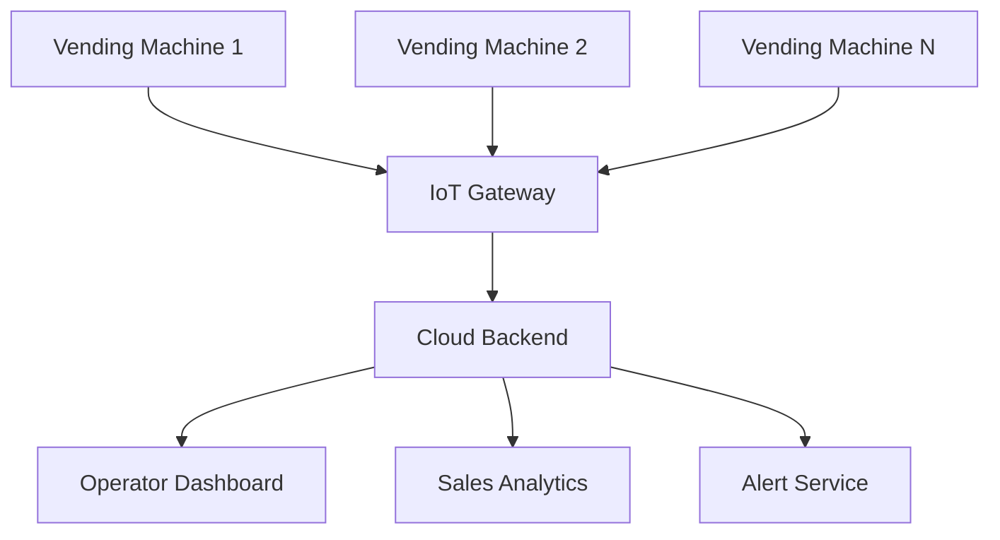
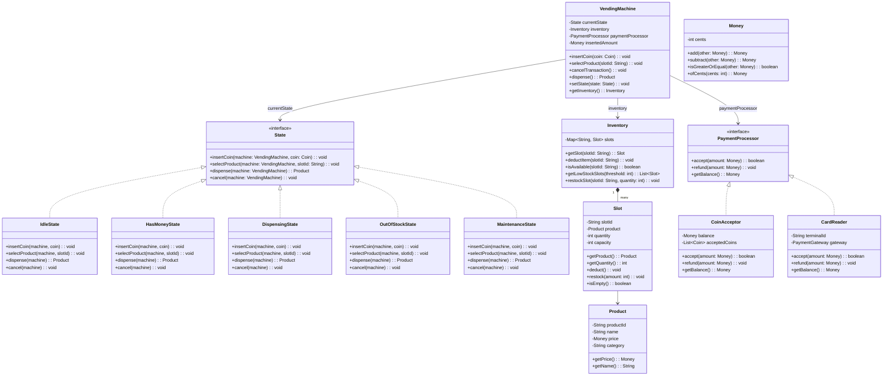
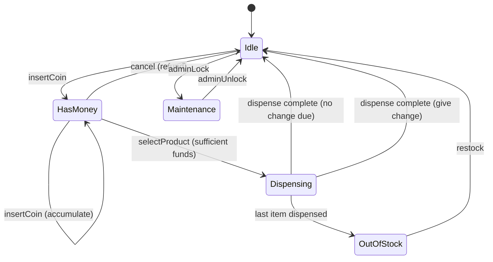

# Design a Vending Machine System (OOD)

**Difficulty**: 🟢 Beginner
**Reading Time**: ~15 minutes
**Interview Frequency**: Medium — common warm-up OOD question

> 📖 See [Vending Machine OOD](./vending-machine) for the complete design with full class diagram, State pattern implementation, and inventory management. This page covers the **system-level extension** — a networked fleet of vending machines.

---

## System-Level Extension

A single vending machine is an OOD problem (see the other article). But at scale, companies deploy **fleets of 10,000+ machines** that need:

- Remote inventory monitoring (which machine is low on item X?)
- Dynamic pricing (peak-hour surcharge)
- Remote diagnostics (machine stuck, payment error)
- Aggregated sales analytics

---

## Fleet Architecture



---

## Key Design Extensions

| Single Machine | Fleet System |
|---------------|-------------|
| Local state machine | State synced to cloud (device shadow) |
| Local inventory check | Central inventory dashboard |
| Fixed pricing | Dynamic pricing per location/time |
| Offline payment | Online payment validation + offline fallback |

---

## Interview Questions

| Question | What It Tests |
|----------|--------------|
| How does the machine handle payment if connectivity is lost? | Offline-first design |
| How do you update firmware on 10k machines simultaneously? | OTA update pipeline |
| How do you detect a machine is stuck without a human inspection? | IoT health monitoring |

---

## Class Design

The vending machine OOD problem is a canonical example of the **State pattern**. The core insight is that a vending machine's behaviour changes completely depending on its current state — idle, has money, dispensing, out of stock, maintenance. Without the State pattern, you end up with a single class full of `if/else` chains: `if (state == IDLE && event == INSERT_COIN) { ... } else if (state == HAS_MONEY && event == INSERT_COIN) { ... }`. This is fragile and violates Open/Closed — every new state requires touching every method.

The class diagram below shows the full design. `VendingMachine` holds a reference to the current `State` interface and delegates every user action (insertCoin, selectProduct, dispense, cancel) to it. Each concrete state implements only the transitions relevant to it; all other transitions throw `InvalidOperationException`. `Inventory` is a separate class so products and slot counts can be managed independently of the state machine. `PaymentProcessor` is an interface so the machine can accept coins, notes, or card readers without changing the state logic.



---

## Design Patterns Applied

### State Pattern

**How it's used:** `VendingMachine` holds a `State` reference and delegates all user actions to it. Each concrete state (`IdleState`, `HasMoneyState`, `DispensingState`, etc.) implements the full `State` interface, but only the meaningful transitions do real work — the rest throw `InvalidOperationException` or do nothing.

**Why it fits:** The vending machine has exactly this shape of problem — the same action (e.g. `insertCoin`) has completely different meaning depending on the current mode. The State pattern externalises this without branching logic.

**Transition flow:**



### Strategy Pattern

**How it's used:** `PaymentProcessor` is an interface with two implementations — `CoinAcceptor` and `CardReader`. `VendingMachine` programs against the interface. Swapping from coin-only to card-enabled requires zero changes to the state machine.

**Why it fits:** Payment method is an orthogonal concern. Variations in payment (coins, notes, tap-to-pay) should not pollute the core vending logic.

### Factory / Registry Pattern (extension point)

**How it's used:** In the fleet extension, a `VendingMachineFactory` creates machine instances with the correct `PaymentProcessor`, `Inventory` configuration, and pricing strategy for a given location. Machines in airports get `DynamicPricingStrategy`; machines in schools get `FixedPricingStrategy`.

**Why it fits:** Machine configuration varies by deployment context. Centralising creation logic prevents scattered `new CoinAcceptor(...)` calls throughout the codebase.

### Observer Pattern (fleet telemetry)

**How it's used:** `VendingMachine` emits events (`InventoryLow`, `PaymentFailed`, `TransactionCompleted`) to registered `TelemetryObserver` instances. The IoT Gateway subscribes to these events and forwards them upstream.

**Why it fits:** The machine should not know about the cloud backend. Decoupling via observer means you can add a new telemetry sink (e.g. local SD-card logger) without changing `VendingMachine`.

---

## SOLID Principles

### Single Responsibility

`VendingMachine` is responsible only for coordinating transitions. It does not know how coins are counted (delegated to `CoinAcceptor`), how slots are tracked (delegated to `Inventory`), or what constitutes "low stock" (delegated to the alert service). Each class has one reason to change.

A violation would be adding `sendLowStockEmail()` directly to `VendingMachine`. That gives the class two reasons to change: (1) state machine logic evolves, and (2) the email provider changes. The correct design is an `InventoryAlertService` that observes inventory events.

### Open / Closed

Adding a new state (e.g. `LockedState` for machines awaiting cash collection) requires creating a new class that implements `State` — no existing state classes change. Adding a new payment method means a new `PaymentProcessor` implementation — the state machine is untouched.

```java
// Open for extension: new state added without touching existing code
public class LockedState implements State {
    @Override
    public void insertCoin(VendingMachine m, Coin c) {
        m.getDisplay().show("Machine locked — contact operator");
        m.getPaymentProcessor().refund(Money.ofCents(c.getValue()));
    }
    // ... other methods throw InvalidOperationException
}
```

### Liskov Substitution

`CoinAcceptor` and `CardReader` are fully substitutable for `PaymentProcessor`. `HasMoneyState.selectProduct()` calls `machine.getPaymentProcessor().getBalance()` and gets correct results regardless of which implementation is installed. A test that uses a `MockPaymentProcessor` also satisfies LSP — it returns controllable balances without any real hardware.

### Interface Segregation

`State` has four methods: `insertCoin`, `selectProduct`, `dispense`, `cancel`. These four are the complete external interface of the machine. It is not further split because every concrete state must handle all four (even if some throw exceptions). `PaymentProcessor` is a separate interface — not merged into `State` — so implementors of payment logic do not depend on state machine concerns.

A violation would be a single `VendingMachineOperations` interface with both state-transition methods and admin methods (`restock`, `setPrice`, `lockForMaintenance`). Regular users would depend on admin methods they never call.

### Dependency Inversion

`VendingMachine` depends on `State` (interface), `Inventory` (concrete but injectable), and `PaymentProcessor` (interface). None of the high-level vending logic depends on `CoinAcceptor` or `CardReader` directly. Construction is wired externally (in `main` or via a factory):

```java
// Dependency injection at construction — no new() inside VendingMachine
VendingMachine machine = new VendingMachine(
    new Inventory(slotConfig),
    new CardReader(terminalId, paymentGateway)
);
// Swap to coin-only for a legacy deployment:
VendingMachine legacy = new VendingMachine(
    new Inventory(slotConfig),
    new CoinAcceptor(List.of(Coin.QUARTER, Coin.DIME, Coin.NICKEL))
);
```

---

## Concurrency and Thread Safety

A real vending machine has one physical user at a time, so concurrency inside a single machine is low. However, in the fleet system, the cloud backend receives concurrent telemetry writes from thousands of machines, and the operator dashboard may issue concurrent price-update commands. Two specific risks exist:

**1. Concurrent state transition on the machine itself**

If the machine runs a touchscreen UI on one thread and a payment terminal on another, two threads could call `insertCoin` and `selectProduct` simultaneously. The fix is a `ReentrantLock` (Java) or `synchronized` block wrapping the delegation call in `VendingMachine`:

```java
public synchronized void insertCoin(Coin coin) {
    currentState.insertCoin(this, coin);
}
```

Because state transitions are short (microseconds, no I/O), coarse-grained synchronisation on the `VendingMachine` instance is acceptable and avoids deadlock.

**2. Inventory deduction race (fleet backend)**

When the cloud processes a `TransactionCompleted` event and decrements inventory, concurrent events from the same machine (if the machine retries on network error) must be idempotent. The solution is an `eventId` (UUID) on every telemetry message with a unique constraint on the events table — duplicate events are ignored, not double-applied.

**3. Firmware OTA update during active transaction**

An OTA update command must transition the machine to `MaintenanceState` only when `currentState == IdleState`. The update controller checks state before locking:

```java
if (machine.getCurrentState() instanceof IdleState) {
    machine.setState(new MaintenanceState());
    beginUpdate();
}
```

This check-then-act must be atomic — hence the `synchronized` wrapper above.

---

## Extension Points

### Adding a new payment method (e.g. QR code / UPI)

1. Create `QRCodeProcessor implements PaymentProcessor`.
2. Implement `accept()` — call the UPI gateway, return `true` on success.
3. Implement `refund()` — initiate a UPI reversal.
4. Wire it in the factory: `new VendingMachine(inventory, new QRCodeProcessor(upiConfig))`.

No changes to any `State` class or `VendingMachine` itself. This demonstrates Open/Closed perfectly.

### Adding a loyalty / rewards programme

1. Create `LoyaltyObserver implements TransactionObserver`.
2. Register it on the machine: `machine.addObserver(new LoyaltyObserver(loyaltyService))`.
3. When `TransactionCompleted` fires, `LoyaltyObserver` credits the user's account.

Again, zero changes to the state machine.

### Adding dynamic pricing

1. Extract a `PricingStrategy` interface with `getPrice(product, context): Money`.
2. Implement `FixedPricingStrategy` (returns `product.getBasePrice()`) and `DynamicPricingStrategy` (applies time-of-day multiplier).
3. `HasMoneyState.selectProduct()` calls `machine.getPricingStrategy().getPrice(product, currentContext)` instead of `product.getPrice()`.

This is the Strategy pattern applied to pricing — the same product can cost different amounts in different machines or at different times without any state class changes.

---

## State Transition Implementation

The most error-prone part of building a vending machine is implementing each state correctly. Below is a concrete implementation of `HasMoneyState` — the state where money has been inserted and the user is selecting a product. This is where most candidates make mistakes.

```java
public class HasMoneyState implements State {

    @Override
    public void insertCoin(VendingMachine machine, Coin coin) {
        // Accumulate — user may add more money to afford a pricier item
        machine.addAmount(Money.ofCents(coin.getValue()));
        machine.getDisplay().show("Balance: " + machine.getInsertedAmount());
    }

    @Override
    public void selectProduct(VendingMachine machine, String slotId) {
        Slot slot = machine.getInventory().getSlot(slotId);

        if (slot == null || slot.isEmpty()) {
            machine.getDisplay().show("Sold out — pick another item");
            return; // Stay in HasMoneyState; don't transition
        }

        Money price = machine.getPricingStrategy()
                             .getPrice(slot.getProduct(), machine.getContext());

        if (machine.getInsertedAmount().isLessThan(price)) {
            int needed = price.subtract(machine.getInsertedAmount()).getCents();
            machine.getDisplay().show("Insert " + needed + " more cents");
            return; // Stay in HasMoneyState
        }

        // Sufficient funds — move to dispensing
        machine.setState(new DispensingState(slotId, price));
        machine.dispense(); // Triggers DispensingState.dispense()
    }

    @Override
    public void cancel(VendingMachine machine) {
        Money refund = machine.getInsertedAmount();
        machine.getPaymentProcessor().refund(refund);
        machine.resetAmount();
        machine.getDisplay().show("Refunded: " + refund);
        machine.setState(new IdleState());
    }

    @Override
    public void dispense(VendingMachine machine) {
        // Cannot dispense without selecting a product first
        machine.getDisplay().show("Please select a product");
    }
}
```

The `DispensingState` that follows is simpler — it does one thing (motor on, drop item, motor off) and then transitions based on whether stock remains:

```java
public class DispensingState implements State {
    private final String slotId;
    private final Money price;

    public DispensingState(String slotId, Money price) {
        this.slotId = slotId;
        this.price = price;
    }

    @Override
    public void dispense(VendingMachine machine) {
        Slot slot = machine.getInventory().getSlot(slotId);
        slot.deduct();

        Money change = machine.getInsertedAmount().subtract(price);
        if (change.getCents() > 0) {
            machine.getPaymentProcessor().refund(change);
        }
        machine.resetAmount();
        machine.getDisplay().show("Enjoy your " + slot.getProduct().getName() + "!");

        if (slot.isEmpty()) {
            machine.setState(new OutOfStockState());
        } else {
            machine.setState(new IdleState());
        }
    }

    // All other methods throw InvalidOperationException — mechanical dispensing
    // cannot be interrupted by user input
    @Override public void insertCoin(VendingMachine m, Coin c) { throw new InvalidOperationException(); }
    @Override public void selectProduct(VendingMachine m, String s) { throw new InvalidOperationException(); }
    @Override public void cancel(VendingMachine m) { throw new InvalidOperationException(); }
}
```

Key points in this implementation:
- **Staying in state is valid**: When funds are insufficient or the slot is empty, the machine stays in `HasMoneyState` rather than transitioning. Many candidates forget this and accidentally reset inserted money.
- **`cancel` always refunds**: Even if the user inserted coins one at a time over 30 seconds, the full accumulated amount is returned. `machine.resetAmount()` clears the balance only after the refund is issued — order matters.
- **Pricing is injected, not hardcoded**: `machine.getPricingStrategy().getPrice(...)` allows the fleet backend to push a price change that takes effect on the next selection without touching state classes.

---

## Data Model

In the fleet backend, machine state and telemetry are stored in a relational database (PostgreSQL). The schema below supports: per-machine inventory tracking, transaction history for analytics, and alert management.

```sql
-- Core machine registry
CREATE TABLE vending_machines (
    machine_id        UUID PRIMARY KEY DEFAULT gen_random_uuid(),
    location_name     VARCHAR(200) NOT NULL,
    latitude          DECIMAL(9,6),
    longitude         DECIMAL(9,6),
    firmware_version  VARCHAR(20)  NOT NULL DEFAULT '1.0.0',
    current_state     VARCHAR(30)  NOT NULL DEFAULT 'IDLE',
                                   -- IDLE | HAS_MONEY | DISPENSING | OUT_OF_STOCK | MAINTENANCE
    last_heartbeat_at TIMESTAMPTZ,
    installed_at      TIMESTAMPTZ  NOT NULL DEFAULT now(),
    is_active         BOOLEAN      NOT NULL DEFAULT true
);

-- Product catalogue (shared across all machines)
CREATE TABLE products (
    product_id   UUID PRIMARY KEY DEFAULT gen_random_uuid(),
    name         VARCHAR(100)  NOT NULL,
    category     VARCHAR(50)   NOT NULL,  -- SNACK | DRINK | CANDY
    base_price_cents INT       NOT NULL,
    weight_grams INT,
    image_url    TEXT
);

-- Per-machine slot configuration and inventory
CREATE TABLE machine_slots (
    slot_id      UUID PRIMARY KEY DEFAULT gen_random_uuid(),
    machine_id   UUID NOT NULL REFERENCES vending_machines(machine_id),
    slot_code    VARCHAR(10)  NOT NULL,   -- e.g. 'A1', 'B3'
    product_id   UUID REFERENCES products(product_id),
    quantity     SMALLINT     NOT NULL DEFAULT 0,
    capacity     SMALLINT     NOT NULL DEFAULT 10,
    low_stock_threshold SMALLINT NOT NULL DEFAULT 2,
    UNIQUE (machine_id, slot_code)
);

-- Dynamic pricing overrides (null = use product base price)
CREATE TABLE pricing_overrides (
    override_id     UUID PRIMARY KEY DEFAULT gen_random_uuid(),
    machine_id      UUID NOT NULL REFERENCES vending_machines(machine_id),
    product_id      UUID NOT NULL REFERENCES products(product_id),
    price_cents     INT  NOT NULL,
    valid_from      TIMESTAMPTZ NOT NULL,
    valid_until     TIMESTAMPTZ,
    reason          VARCHAR(100)   -- 'PEAK_HOUR' | 'PROMOTION' | 'CLEARANCE'
);

-- Immutable transaction ledger
CREATE TABLE transactions (
    transaction_id   UUID PRIMARY KEY DEFAULT gen_random_uuid(),
    event_id         UUID NOT NULL UNIQUE,   -- idempotency key from machine
    machine_id       UUID NOT NULL REFERENCES vending_machines(machine_id),
    slot_id          UUID REFERENCES machine_slots(slot_id),
    product_id       UUID REFERENCES products(product_id),
    payment_method   VARCHAR(20)  NOT NULL,  -- COIN | CARD | QR
    amount_paid_cents INT         NOT NULL,
    product_price_cents INT       NOT NULL,
    change_given_cents  INT       NOT NULL DEFAULT 0,
    status           VARCHAR(20)  NOT NULL,  -- SUCCESS | REFUNDED | FAILED
    occurred_at      TIMESTAMPTZ  NOT NULL DEFAULT now()
);

-- Telemetry / health events
CREATE TABLE machine_events (
    event_id    UUID PRIMARY KEY DEFAULT gen_random_uuid(),
    machine_id  UUID NOT NULL REFERENCES vending_machines(machine_id),
    event_type  VARCHAR(50) NOT NULL,
                -- LOW_STOCK | PAYMENT_FAILED | DOOR_OPEN | TEMP_HIGH | HEARTBEAT
    payload     JSONB,
    occurred_at TIMESTAMPTZ NOT NULL DEFAULT now()
);

-- Indexes for common query patterns
CREATE INDEX idx_machine_slots_machine      ON machine_slots(machine_id);
CREATE INDEX idx_machine_slots_low_stock    ON machine_slots(machine_id) WHERE quantity <= low_stock_threshold;
CREATE INDEX idx_transactions_machine_time  ON transactions(machine_id, occurred_at DESC);
CREATE INDEX idx_transactions_event_id      ON transactions(event_id);  -- idempotency lookups
CREATE INDEX idx_machine_events_type_time   ON machine_events(event_type, occurred_at DESC);
```

---

## Scale Bottlenecks

| Traffic Level | Component That Breaks | Symptoms | Mitigation |
|---------------|----------------------|----------|------------|
| 10x baseline (100k machines) | Single PostgreSQL writer for telemetry events | Write latency > 500ms; IoT Gateway queue backs up | Partition `machine_events` by `occurred_at` (monthly); use connection pooling via PgBouncer |
| 100x baseline (1M machines) | IoT Gateway becomes single point of failure; alert fanout overwhelms notification service | Gateway OOM; alert storms when connectivity drops | Regional gateway clusters; alert deduplication with 5-minute suppression window; stream events via Kafka |
| 1000x baseline (10M machines) | `machine_slots` inventory table — millions of single-row updates per second from dispensing events | Lock contention on hot rows; P99 > 2s | Move real-time inventory to Redis (DECR is atomic); sync to PostgreSQL in batch every 60s; use Redis Cluster for sharding by `machine_id` |
| Any level | Firmware OTA broadcast — pushing 50 MB update to 10k machines simultaneously | S3 bandwidth spike; machines overwhelmed | Staggered rollout: 1% → 10% → 100% over 6 hours; machines pull update on next heartbeat with jitter |

---

## How Crane Merchandising Systems Built This

Crane Merchandising Systems (now Cantaloupe) is one of the world's largest vending machine management platform vendors, with over **1 million connected vending machines** managed through their Seed platform. Their architecture is publicly documented through trade publications and patent filings.

**Technology stack:** The Seed Cloud platform uses a multi-tenant PostgreSQL backend for transaction records, with real-time telemetry ingest via a dedicated MQTT broker cluster (Eclipse Mosquitto → AWS IoT Core at scale). Machines communicate over cellular (2G/3G/4G depending on deployment era) with a heartbeat interval of 90 seconds.

**Key numbers:** At peak (post-lunch rush in urban deployments), the platform processes approximately **50,000 transaction events per minute** across the fleet. Each transaction record is roughly 512 bytes; this yields ~25 MB/minute of transaction writes — easily handled by a single PostgreSQL instance with write-ahead logging, but requiring read replicas for the analytics dashboard.

**Non-obvious architectural decision:** Crane chose an **offline-first payment model** for coin/note acceptance. The machine does not require cloud connectivity to complete a cash transaction. If the cellular link is down, the machine stores the transaction locally in a circular buffer (capacity: 10,000 transactions) and uploads the batch on reconnect. This means the inventory figures in the cloud can be up to 24 hours stale for a machine in a basement — operators are trained to treat cloud inventory as "approximately correct" and use a physical restock alert (machine beeps when slot hits zero) as the authoritative signal.

**Idempotency design:** Every transaction from a machine carries a `sequence_number` that resets at midnight and a `machine_id`. The backend deduplicates using `(machine_id, sequence_number, date)` — a composite unique index that prevents double-crediting if a machine retransmits a batch after a partial upload.

Source: Cantaloupe engineering documentation (formerly USA Technologies / Crane Merchandising), plus analysis of patent US20190066440A1 "Vending machine telemetry system."

---

## Interview Angle

**What the interviewer is testing:** Whether you can identify the State pattern as the natural fit for lifecycle-driven behaviour, and whether you understand the extension boundary between the OOD problem (single machine) and the distributed systems problem (fleet management). Strong candidates recognise that the OOD design should be closed to changes when new fleet features are added.

**Common mistakes candidates make:**

1. **Using a single class with a `state` enum field and giant switch statements.** This is the naive approach. It works for two states but becomes unmaintainable at five. The interviewer is specifically looking for the State pattern because they want to see if you know when to apply it. Defending the enum approach by saying "it's simpler" misses the point — the question is an OOD question and the expected answer demonstrates pattern knowledge.

2. **Merging `Inventory` into `VendingMachine`.** Candidates who put `slots: Map<String, Integer>` directly on `VendingMachine` make the class responsible for two things: state transitions and stock management. This violates Single Responsibility and makes it impossible to unit-test inventory logic independently. `Inventory` should be a separate class with its own unit tests.

3. **Ignoring concurrency in the fleet extension.** When the interviewer asks "what happens if the cloud sends a price update while the machine is mid-transaction?", candidates who haven't thought about the `MaintenanceState` gate or the idempotency of inventory writes will give vague answers. The correct answer is: price updates are queued and applied only when the machine returns to `IdleState`; inventory decrements carry an `eventId` for idempotent processing.

4. **Forgetting the offline fallback for payment.** The machine must dispense when the cellular link is down. This is not an edge case — basements, thick walls, and rural locations are common. Candidates who design a system where every transaction requires a cloud round-trip have built an unusable machine.

**The insight that separates good from great answers:** Recognising that `DispensingState` must be a distinct state (not just a method call from `HasMoneyState`) is the key insight. Dispensing is a mechanical operation that takes 1–3 seconds. During that window, the machine must not accept coins, not respond to cancel, and not allow a second product selection. If you model dispensing as a synchronous call within `HasMoneyState.selectProduct()`, you have no way to handle a motor jam or a product stuck halfway. A separate `DispensingState` with a timeout transition to `MaintenanceState` handles mechanical failure cleanly.

---

## Key Numbers to Remember

| Metric | Value | Context |
|--------|-------|---------|
| Fleet size (large operator) | 1,000,000 machines | Cantaloupe / Crane platform as of 2023 |
| Heartbeat interval | 90 seconds | Balances freshness vs. cellular data cost |
| Offline transaction buffer | 10,000 transactions | Covers ~7 days of average machine volume |
| Telemetry event rate (peak) | 50,000 events/minute | Across 1M machine fleet at lunch rush |
| Inventory update latency (cloud) | Up to 24 hours | For offline machines; cash-only deployments |
| State transition count | 5 core states | Idle, HasMoney, Dispensing, OutOfStock, Maintenance |
| Dispensing timeout | 3–5 seconds | Mechanical motor; if exceeded → MaintenanceState |
| Low-stock threshold | 2 items remaining | Triggers alert before machine goes empty |

---

## 📚 Resources & References

| Resource | Type | What You'll Learn |
|----------|------|------------------|
| [Vending Machine Full OOD Design](./vending-machine) | 📖 Internal | State pattern, class diagram, inventory management |
| [Head First Design Patterns](https://www.oreilly.com/library/view/head-first-design/0596007124/) | 📚 Book | State pattern explained with vending machine example |
| [AWS IoT Device Shadow](https://docs.aws.amazon.com/iot/latest/developerguide/iot-device-shadows.html) | 📖 Blog | Fleet state synchronization pattern |
| [Cantaloupe (formerly USA Technologies)](https://www.cantaloupe.com/) | 📖 Docs | Real-world vending fleet management platform |
| [Refactoring Guru — State Pattern](https://refactoring.guru/design-patterns/state) | 📖 Blog | Visual walkthrough of State pattern with vending machine pseudocode |
