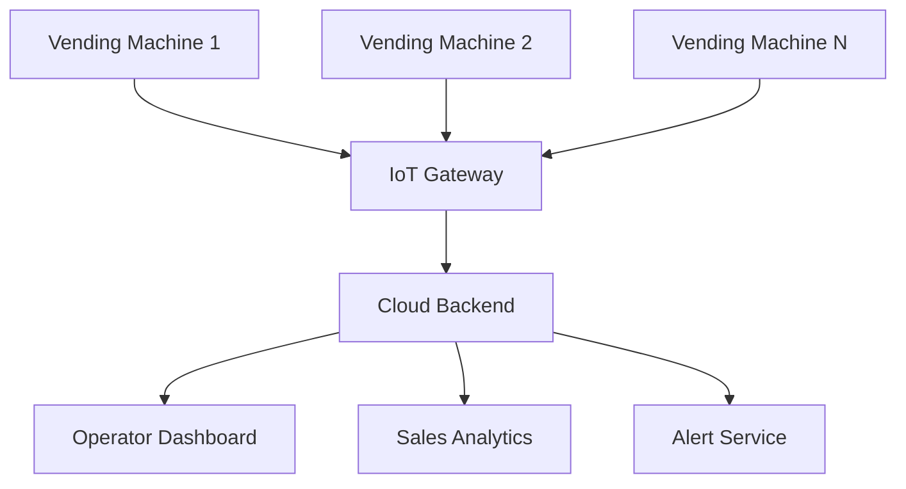

# Design a Vending Machine System (OOD)

**Difficulty**: 🟢 Beginner
**Reading Time**: ~15 minutes
**Interview Frequency**: Medium — common warm-up OOD question

> 📖 See [Vending Machine OOD](./vending-machine) for the complete design with full class diagram, State pattern implementation, and inventory management. This page covers the **system-level extension** — a networked fleet of vending machines.

---

## System-Level Extension

A single vending machine is an OOD problem (see the other article). But at scale, companies deploy **fleets of 10,000+ machines** that need:

- Remote inventory monitoring (which machine is low on item X?)
- Dynamic pricing (peak-hour surcharge)
- Remote diagnostics (machine stuck, payment error)
- Aggregated sales analytics

---

## Fleet Architecture

---

## Key Design Extensions

| Single Machine | Fleet System |
|---------------|-------------|
| Local state machine | State synced to cloud (device shadow) |
| Local inventory check | Central inventory dashboard |
| Fixed pricing | Dynamic pricing per location/time |
| Offline payment | Online payment validation + offline fallback |

---

## Interview Questions

| Question | What It Tests |
|----------|--------------|
| How does the machine handle payment if connectivity is lost? | Offline-first design |
| How do you update firmware on 10k machines simultaneously? | OTA update pipeline |
| How do you detect a machine is stuck without a human inspection? | IoT health monitoring |

---

## 📚 Resources & References

| Resource | Type | What You'll Learn |
|----------|------|------------------|
| [Vending Machine Full OOD Design](./vending-machine) | 📖 Internal | State pattern, class diagram, inventory management |
| [Head First Design Patterns](https://www.oreilly.com/library/view/head-first-design/0596007124/) | 📚 Book | State pattern explained with vending machine example |
| [AWS IoT Device Shadow](https://docs.aws.amazon.com/iot/latest/developerguide/iot-device-shadows.html) | 📖 Blog | Fleet state synchronization pattern |
