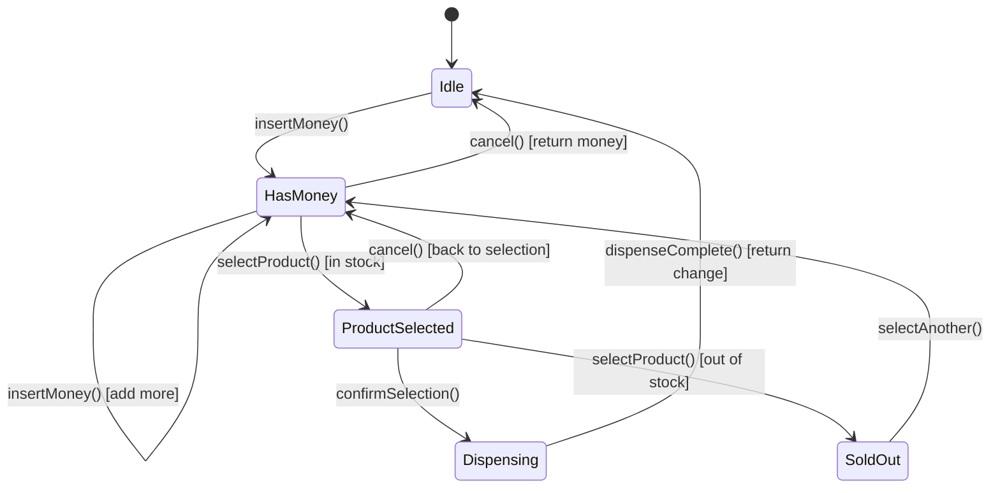

# Design a Vending Machine (OOD)

**Difficulty**: 🟢 Beginner
**Reading Time**: Coming Soon
**Interview Frequency**: High

---

> 🚧 **Full article coming soon.** This stub gives you the essentials to start thinking about this problem.

---

## The Core Problem

Modeling a vending machine's state transitions — idle → has_money → product_selected → dispensing → change_returned — without a giant if-else chain. The State design pattern encapsulates each state's behavior in its own class, making state transitions explicit and extensible. Adding a new state (e.g., "maintenance mode") requires only a new class, not modifying existing ones.

## Functional Requirements

- Accept coins and bills; display running total
- Allow product selection from available inventory
- Dispense selected product and return change
- Handle: insufficient funds, sold-out products, invalid selections
- Return inserted money if user cancels

## Non-Functional Requirements

| Requirement | Target |
|-------------|--------|
| Correctness | Money never lost (either dispensed or returned) |
| Extensibility | New payment method adds 1 class, no existing changes |
| State safety | Invalid transitions impossible (can't dispense without money) |

## Back-of-Envelope Estimates

- **States needed**: 4-5 states (Idle, HasMoney, ProductSelected, Dispensing, Sold-Out)
- **Core classes**: ~6-8 classes total for clean implementation
- **Inventory model**: Map<ProductCode, (Product, quantity)> — simple

## Key Design Decisions

1. **State Pattern for Transitions** — `VendingMachineState` interface with methods: `insertMoney()`, `selectProduct()`, `dispense()`, `cancel()`; each state implements only valid transitions (throws exception for invalid ones); machine holds current state reference and delegates.
2. **Immutable Product Class** — `Product` is a value object (price, name, code) — immutable, equality by product code; inventory manages quantities separately from product descriptions.
3. **Command Pattern for Transactions** — each user interaction (insert coin, select product) becomes a Command object; supports undo (cancel before dispense) by reversing executed commands; also useful for logging all user interactions.

## High-Level Architecture

## Top Interview Questions for This Problem

| Question | Tests |
|----------|-------|
| How do you prevent the machine from dispensing a product if money hasn't been inserted? | State machine, invalid transition handling |
| How do you handle exact change only — machine can't make change? | Inventory, partial payment edge case |
| How would you add credit card payment without changing the existing coin logic? | Open/Closed Principle, Strategy pattern |

## Related Concepts

- [ATM system for similar cash-handling state machine](./atm-system)
- [Parking lot for similar polymorphism and extensibility patterns](./parking-lot)

---

*📚 Full deep-dive with multiple approaches, trade-off tables, and pseudocode coming soon.*
