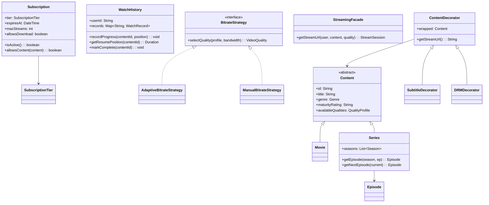
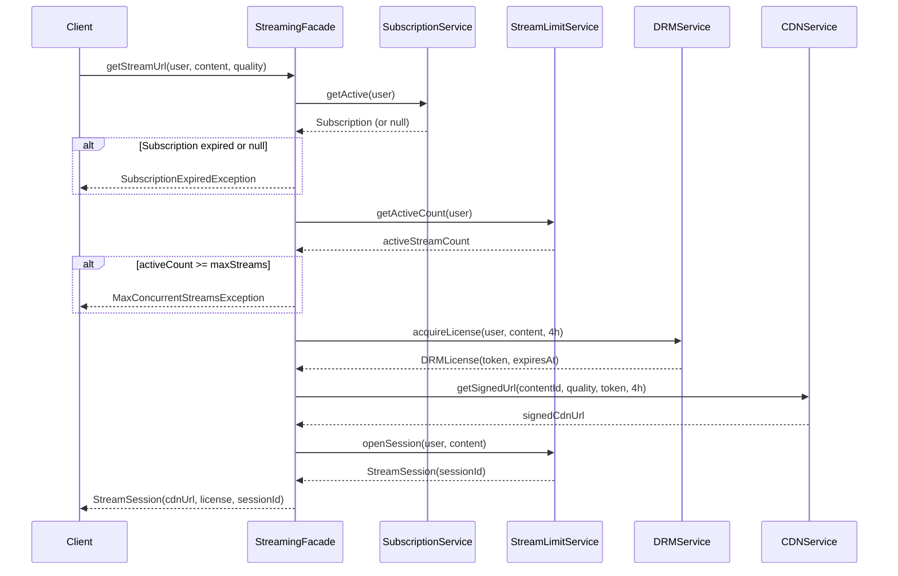
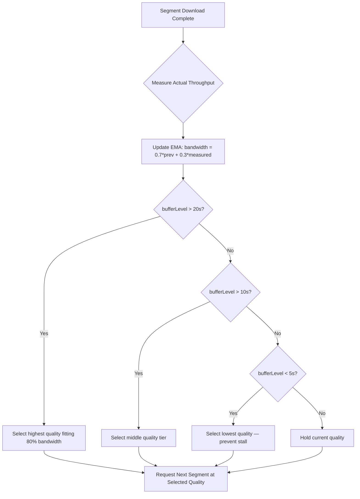
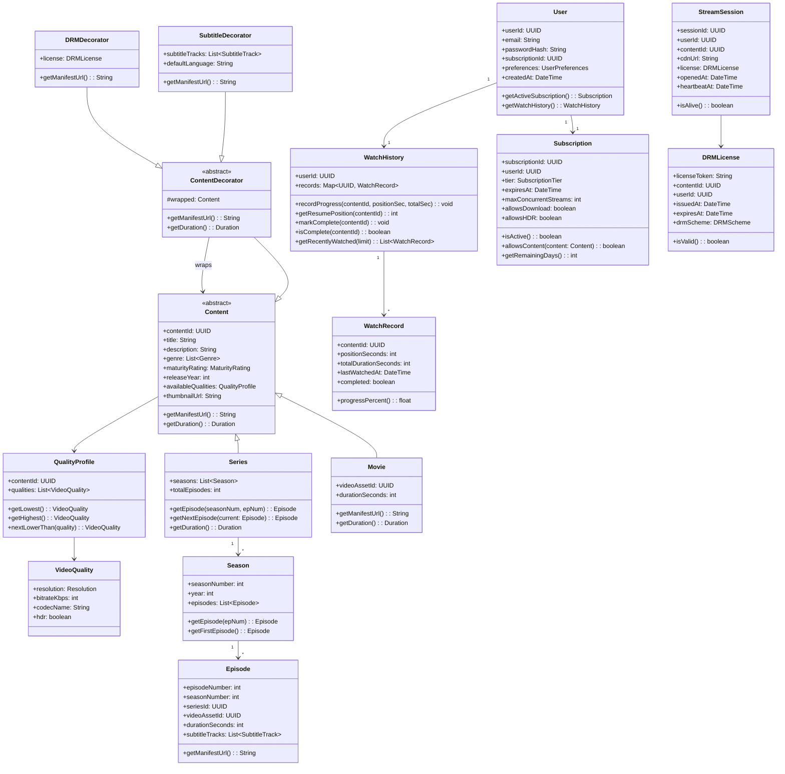

# Design a Video Streaming Platform (OOD)

**Difficulty**: 🔴 Advanced
**Codemania**: #143
**Interview Frequency**: High

---

## Problem Statement

Model the OOD layer of a Netflix-like streaming platform: content catalog (movies, series, episodes), subscription gate, DRM license acquisition, adaptive bitrate selection, watch history, and recommendations. The OOD challenge: `getStreamUrl()` involves 3 subsystems (subscription check, DRM, CDN URL generation) that should be hidden behind a Facade. Bitrate selection is a swappable Strategy. Content wrapped with subtitles and DRM is a Decorator chain.

---

## Functional Requirements

- Users browse catalog: movies, series with seasons and episodes
- Subscription check before streaming; redirect to paywall if expired
- Adaptive bitrate: auto-select quality based on bandwidth; user can override
- DRM: fetch time-limited license before playback starts
- Watch history: record position so resume is seamless
- Recommendations: suggest next episode or similar content after completion

---

## Core Entities

| Class | Responsibility |
|-------|---------------|
| `User` | Account, subscription tier, watch history, preferences |
| `Content` | Abstract: movie or series; title, genre, ratings |
| `Movie` | Single-file content; one video asset |
| `Series` | Container: seasons → episodes |
| `Episode` | Single episode: runtime, video asset, subtitles |
| `Subscription` | Tier (Basic/Standard/Premium), expiry date |
| `WatchHistory` | Per-user progress records; resume position |
| `VideoPlayer` | Client-side player: bitrate selector, progress reporter |
| `QualityProfile` | Available resolutions and bitrates for a content asset |
| `DRMLicense` | Time-limited decryption key returned by license server |

---

## Class Diagram



---

## Design Patterns Used

### 1. Facade — getStreamUrl()

**Why it fits**: Starting a stream requires: check subscription → check concurrent stream limit → request DRM license → pick CDN region → generate signed URL. The client shouldn't orchestrate all this. `StreamingFacade.getStreamUrl()` hides all subsystems behind one call.

```
class StreamingFacade:
  subscriptionService: SubscriptionService
  drmService: DRMService
  cdnService: CDNService
  streamLimitService: StreamLimitService

  getStreamUrl(user: User, content: Content, quality: VideoQuality): StreamSession
    // 1. Subscription gate
    sub = subscriptionService.getActive(user)
    if sub == null or not sub.isActive():
      throw SubscriptionExpiredException(user)
    if not sub.allowsContent(content):
      throw ContentNotInTierException(content, sub.tier)

    // 2. Concurrent stream limit
    active = streamLimitService.getActiveCount(user)
    if active >= sub.maxStreams:
      throw MaxConcurrentStreamsException(sub.maxStreams)

    // 3. DRM license
    license = drmService.acquireLicense(user, content, expiresIn = 4.hours)

    // 4. CDN URL with signed token
    cdnUrl = cdnService.getSignedUrl(content.id, quality, license.token, ttl = 4.hours)

    // 5. Register active stream
    session = streamLimitService.openSession(user, content)

    return StreamSession(cdnUrl, license, session.id)
```

### 2. Strategy — Adaptive Bitrate Selection

**Why it fits**: Auto mode selects bitrate based on measured bandwidth; manual mode uses user preference; a "save data" mode caps at 480p regardless of bandwidth. Each is a different algorithm operating on the same `QualityProfile` input.

```
interface BitrateStrategy:
  selectQuality(profile: QualityProfile, context: PlaybackContext): VideoQuality

AdaptiveBitrateStrategy:
  // Netflix BOLA algorithm (simplified)
  selectQuality(profile, context):
    bandwidth = context.measuredBandwidthKbps
    bufferLevel = context.bufferSeconds

    // Select highest quality whose bitrate fits in 80% of bandwidth
    candidates = profile.qualities.filter(q -> q.bitrateKbps <= bandwidth * 0.8)
    if candidates.isEmpty(): return profile.lowest

    // Buffer-based upgrade: if buffer > 15s, allow higher quality
    if bufferLevel > 15:
      return candidates.last()  // highest fitting
    return candidates[candidates.size() / 2]  // conservative middle

ManualBitrateStrategy(preferred: VideoQuality):
  selectQuality(profile, context):
    // Respect user choice; downgrade only if bandwidth too low
    if context.measuredBandwidthKbps < preferred.bitrateKbps * 1.2:
      return profile.nextLowerThan(preferred) ?? profile.lowest
    return preferred
```

### 3. Decorator — Content + Subtitles + DRM

**Why it fits**: A content asset can be served with subtitles (multiple language tracks), DRM-encrypted, or both. Inheritance for every combination (DRMMovie, SubtitleDRMEpisode…) explodes. Each decorator wraps the content and adds one concern without changing the interface.

```
abstract class ContentDecorator extends Content:
  wrapped: Content

  getTitle(): String
    return wrapped.getTitle()

class SubtitleDecorator extends ContentDecorator:
  subtitleTracks: List<SubtitleTrack>

  getManifestUrl(): String
    base = wrapped.getManifestUrl()
    return base + "&subtitles=" + subtitleTracks.map(t -> t.languageCode).join(",")

class DRMDecorator extends ContentDecorator:
  license: DRMLicense

  getManifestUrl(): String
    return wrapped.getManifestUrl() + "&drm_token=" + license.token

// Usage: apply DRM then subtitles
content = new DRMDecorator(
  new SubtitleDecorator(episode, [englishSub, spanishSub]),
  license
)
url = content.getManifestUrl()
```

### 4. Observer — Watch Completion → Recommendation

**Why it fits**: When a user finishes an episode, multiple systems react: auto-play next episode, update watch history, trigger recommendation refresh, and notify the analytics pipeline. Observer pattern lets the player emit `WatchCompletedEvent` and each system subscribe independently.

```
class VideoPlayer:
  observers: List<PlaybackObserver>

  reportProgress(contentId: String, position: Duration, duration: Duration): void
    watchHistory.recordProgress(contentId, position)
    progress = position.seconds / duration.seconds
    if progress >= 0.95:
      publish(WatchCompletedEvent(currentUser, contentId))

  publish(event): void
    for obs in observers: obs.onEvent(event)

class AutoPlayObserver implements PlaybackObserver:
  onEvent(WatchCompletedEvent e):
    if e.contentId is Episode:
      next = seriesService.getNextEpisode(e.contentId)
      if next != null:
        player.queueNext(next, autoPlayDelay = 5.seconds)

class RecommendationObserver implements PlaybackObserver:
  onEvent(WatchCompletedEvent e):
    recommendationService.refresh(e.user)
```

---

## Key Method: `getNextEpisode(series, current)`

```
SeriesService:
  getNextEpisode(series: Series, current: Episode): Episode
    season = series.getSeason(current.seasonNumber)

    // Try next episode in same season
    next = season.getEpisode(current.episodeNumber + 1)
    if next != null: return next

    // Try first episode of next season
    nextSeason = series.getSeason(current.seasonNumber + 1)
    if nextSeason != null:
      return nextSeason.getFirstEpisode()

    // Series complete
    return null
```

---

## Design Decisions & Trade-offs

| Decision | Option A | Option B | Choice |
|----------|----------|----------|--------|
| Bitrate selection | Client-side (player decides) | Server-side (server recommends) | Client-side — player has real-time bandwidth data; server can't |
| Watch history granularity | Record on every 10 seconds | Record on pause/close | Every 10 seconds — more resume accuracy; tolerable write load |
| DRM license scope | Per-content license | Per-session license | Per-session — can revoke mid-playback on subscription cancel |
| Recommendation trigger | After each watch | Nightly batch | After each watch — personalization is a real-time competitive advantage |

---

## Top Interview Questions

| Question | What It Tests |
|----------|--------------|
| How does the system know a user is watching on two devices simultaneously? | Session tracking, concurrent stream counter |
| How would you add offline download support (for premium subscribers)? | Subscription allowsDownload check, DRM offline license |
| A user cancels subscription mid-episode — when does playback stop? | DRM license revocation, session invalidation |

---

## Related Concepts

- [Social Media Platform OOD for Observer fan-out patterns](./social-media-platform)
- [Resource Management OOD for connection pool under concurrent streams](./resource-management)

---

## Component Deep Dive 1: StreamingFacade — Orchestration Layer

The `StreamingFacade` is the single most critical component in this OOD design because it is the integration point between the client and four independent subsystems: `SubscriptionService`, `DRMService`, `CDNService`, and `StreamLimitService`. Without this facade, clients would need to know the ordering of operations, handle partial failures (e.g., DRM acquired but CDN URL generation failed), and understand rollback semantics — all of which violates encapsulation.

**How it works internally**: The facade follows a strict ordering of operations that is not arbitrary. Subscription and stream-limit checks are first because they are the cheapest calls (usually in-process cache or a fast Redis lookup at sub-1ms). DRM acquisition is third because it is an external RPC call to a Widevine or FairPlay license server with ~50–150ms latency. CDN URL signing is last because it is a pure CPU operation (HMAC-SHA256 signature) with zero network cost. If DRM fails, no signed URL is ever generated, preventing a URL from being issued without a valid license.

**Why naive approaches fail at scale**: A common naive approach is to perform all four checks sequentially in the controller layer (HTTP handler), which exposes subsystem details to the transport layer, makes unit testing require mocking four services simultaneously, and makes the ordering rules implicit. Another failure: doing DRM and CDN calls in parallel to save latency. This creates a race — a CDN-signed URL with no valid DRM token will cause a 403 at the CDN edge.

**Sequence diagram for getStreamUrl():**



**Trade-off table for facade implementation options:**

| Approach | Latency (p99) | Failure Handling | Rollback Complexity |
|----------|--------------|-----------------|-------------------|
| Sequential (as shown) | 250ms (DRM dominates) | Each step fails independently; no orphaned licenses | Low — stop at first failure, openSession is last |
| Parallel (DRM + CDN together) | 150ms | CDN URL may exist without valid DRM license — security hole | High — must cancel both on partial failure |
| Async / Event-driven | 500ms+ (adds queue latency) | Eventual consistency — client must poll | Very high — client state management required |

The sequential approach wins here because the latency difference (100ms) is insignificant compared to stream startup time (2–5 seconds for buffering), and security correctness takes priority.

---

## Component Deep Dive 2: BitrateStrategy — Adaptive Quality Selection

The `BitrateStrategy` interface is the second most architecturally significant component because it is where the system manages the core user-visible quality metric: video smoothness vs. resolution. Netflix's internal data shows that rebuffering (video stalling) increases abandonment by 7% for every 1-second stall — making bitrate selection a revenue-impacting engineering decision.

**Internal mechanics**: The `AdaptiveBitrateStrategy` (ABR) implementation maintains a buffer model. It tracks two variables: `measuredBandwidthKbps` (exponential moving average of last 5 segment download speeds) and `bufferSeconds` (how many seconds of video are pre-downloaded). The BOLA algorithm (Buffer Occupancy based Lyapunov Algorithm, published by Spiteri et al. 2016) treats bitrate selection as a utility maximization problem: maximize quality subject to the constraint that the buffer does not underflow.

**Scale behavior at 10x load**: The strategy itself is stateless and runs on the client, so it does not feel server-side load. However, at 10x load, the CDN encounters more simultaneous segment requests. If CDN edge nodes become saturated, measured bandwidth drops even for users with high-bandwidth connections. A naive ABR will then select lower quality. A smarter implementation distinguishes between "low bandwidth" and "CDN congestion" — if TTFB (time to first byte) is <50ms but throughput is low, it's likely CDN congestion and a different CDN PoP should be tried before downgrading quality.



| Strategy | Avg Quality | Stall Rate | Bandwidth Waste | Best For |
|----------|------------|-----------|-----------------|---------|
| `AdaptiveBitrateStrategy` (BOLA) | High | <0.5% | 10–15% (buffer headroom) | Default, most users |
| `ManualBitrateStrategy` | User-chosen | Variable | 0% | Power users, known bandwidth |
| `DataSaverStrategy` (cap 480p) | Low | <0.1% | Minimal | Mobile data plans |

---

## Component Deep Dive 3: WatchHistory — Progress Persistence Layer

`WatchHistory` appears simple but is the component most likely to have subtle correctness bugs at scale. Its primary job — "record where a user paused so they can resume" — involves reconciling writes from multiple concurrent devices, handling offline writes that replay when connectivity returns, and deciding when to treat a re-watch as "continuing" vs. "starting fresh."

**Specific technical decisions:**

**Write frequency**: Recording progress every 10 seconds means a 2-hour movie generates 720 write operations per viewer. At 200 million concurrent viewers (Netflix peak), that is 144 million writes per minute, or approximately 2.4 million writes/sec. This rules out a strongly consistent RDBMS for the hot write path — Netflix uses a Cassandra-backed service (EVCache wraps it) where writes are eventual but reads are fast for the resume position.

**Multi-device reconciliation**: If a user watches episode 3 on their TV (paused at 0:35:00) and simultaneously opens the app on their phone (which has a cached position of 0:20:00 from 10 minutes ago), the resume logic must pick the most-recent-write, not the highest-position. The `WatchRecord` therefore stores both `positionSeconds` and `updatedAt` timestamp. Last-write-wins by timestamp is the correct policy — not "highest position wins," since a user who rewound to re-watch a scene would have a lower position but a newer timestamp.

**Completion detection**: The system marks content complete when `position >= 0.95 * duration`, not `position == duration`. This is because encoding lengths vary by ±3 seconds across quality tiers, and the client's locally-reported duration may differ from the server's authoritative duration.

---

## Class Design — Full Detail



---

## Design Patterns Applied

### Facade Pattern
`StreamingFacade` hides four subsystems (`SubscriptionService`, `DRMService`, `CDNService`, `StreamLimitService`) behind a single `getStreamUrl()` call. The client does not know that DRM uses Widevine vs. FairPlay, or that the CDN signs URLs with HMAC-SHA256. This isolates complexity, enables independent scaling of each subsystem, and allows the orchestration logic to change (e.g., adding a geo-restriction check) without touching any client code.

### Strategy Pattern
`BitrateStrategy` has three concrete implementations: `AdaptiveBitrateStrategy` (bandwidth-aware), `ManualBitrateStrategy` (user-selected quality), and `DataSaverStrategy` (caps at 480p). The `VideoPlayer` holds a reference to a `BitrateStrategy` and delegates quality selection to it. Switching from adaptive to manual at runtime is a single call to `player.setBitrateStrategy(new ManualBitrateStrategy(QUALITY_1080P))`. Adding a new strategy (e.g., "night mode" that caps at 720p to reduce brightness) requires zero changes to `VideoPlayer`.

### Decorator Pattern
`ContentDecorator`, `SubtitleDecorator`, and `DRMDecorator` form a chain. Each decorator implements the same `Content` interface, wraps another `Content` instance, and adds exactly one concern to `getManifestUrl()`. A movie with DRM and subtitles becomes `new DRMDecorator(new SubtitleDecorator(movie, tracks), license)`. The order matters: DRM wraps subtitle, so the final URL contains both `&subtitles=...` and `&drm_token=...`. The platform currently has 2 decorators; adding offline-download metadata or content warnings requires a new decorator with zero changes to existing code.

### Observer Pattern
`VideoPlayer` maintains a list of `PlaybackObserver` instances and publishes `WatchCompletedEvent` at 95% progress. Observers include `AutoPlayObserver` (queues next episode), `RecommendationObserver` (refreshes recommendations), `WatchHistoryObserver` (marks content complete), and `AnalyticsObserver` (sends viewing event to analytics pipeline). Each observer is independently registerable — an A/B test that disables auto-play on mobile is just removing `AutoPlayObserver` from the mobile player's observer list.

### Composite Pattern (implicit in Series/Season/Episode)
`Series` contains `Season` objects, each containing `Episode` objects. `getDuration()` on a `Series` recursively sums episode durations. This tree structure with uniform interface allows the catalog service to treat movies and series identically when building the browse grid.

---

## SOLID Principles

**Single Responsibility Principle**: Each class has one axis of change. `WatchHistory` handles only progress tracking — it does not decide whether to autoplay, which is `AutoPlayObserver`'s job. `DRMLicense` is a data holder — it does not fetch licenses, which is `DRMService`'s job.

**Open/Closed Principle**: The `BitrateStrategy` interface and `ContentDecorator` abstract class demonstrate OCP directly. Adding a `DataSaverStrategy` or `ParentalControlDecorator` extends the system without modifying `VideoPlayer` or `Content`. The existing tests for `AdaptiveBitrateStrategy` remain valid; no regressions are possible from the new addition.

**Liskov Substitution Principle**: Any `BitrateStrategy` implementation can replace any other in `VideoPlayer` without changing the player's behavior contract. `SubtitleDecorator` and `DRMDecorator` are both valid `Content` objects — they can be passed anywhere a `Content` is expected, and `getManifestUrl()` always returns a valid URL string.

**Interface Segregation Principle**: `BitrateStrategy` exposes only `selectQuality()` — nothing else. A `DataSaverStrategy` doesn't need to implement heartbeat logic or CDN health checks. Compare this to an anti-pattern where a monolithic `PlayerStrategy` interface forces all implementations to stub out methods they don't need.

**Dependency Inversion Principle**: `StreamingFacade` depends on `SubscriptionService`, `DRMService`, and `CDNService` as interface abstractions, not concrete classes. In tests, `MockDRMService` is injected, making `StreamingFacade` unit-testable without a real Widevine license server.

---

## Concurrency and Thread Safety

**Watch History writes**: Multiple threads (one per active stream, plus background progress reporters) may call `WatchHistory.recordProgress()` concurrently. The `records` map must use a `ConcurrentHashMap` (Java) or `sync.Map` (Go). The update must be atomic: `records.merge(contentId, newRecord, (existing, updated) -> updated.updatedAt > existing.updatedAt ? updated : existing)`. This last-write-wins merge is thread-safe and correct.

**Stream session counter**: `StreamLimitService.getActiveCount()` followed by `openSession()` is a classic check-then-act race condition. On two concurrent devices:
1. Device A: `getActiveCount()` returns 1 (maxStreams = 2) ✓
2. Device B: `getActiveCount()` returns 1 ✓
3. Device A: `openSession()` — now 2 active
4. Device B: `openSession()` — now 3 active (violation!)

The fix is an atomic compare-and-increment: use Redis `INCR` with a Lua script that checks the value before incrementing, or use a database row with an optimistic lock version field. The session counter must be incremented and checked atomically.

**Observer notification**: `VideoPlayer.publish()` should not call observers synchronously on the playback thread if observers do network I/O (e.g., `RecommendationObserver` calling the recommendation API). Synchronous calls add latency to the progress-reporting loop. The correct design is to publish events to an in-process queue and process observer notifications on a separate thread pool.

---

## Extension Points

**Adding parental controls**: Introduce `ParentalControlDecorator extends ContentDecorator`. Its `getManifestUrl()` calls `parentalControlService.canAccess(userId, content.maturityRating)` before delegating to `wrapped.getManifestUrl()`. The rest of the system is unchanged — `StreamingFacade` continues to call `content.getManifestUrl()` without knowing a parental check exists.

**Adding offline download**: Add `allowsDownload: boolean` to `Subscription` (already present). Add `DownloadService.requestDownload(user, content, quality)` that calls `DRMService.acquireOfflineLicense(user, content, expiresIn = 30.days)` and stores the encrypted content locally. The `BitrateStrategy` gets a new `OfflineStrategy` that always returns the pre-downloaded quality. No changes to `VideoPlayer` interface.

**Adding live streaming**: `LiveContent extends Content` with `streamUrl: String` (always current) and `isLive: boolean`. `LiveContent.getManifestUrl()` returns an HLS manifest with `#EXT-X-STREAM-INF` segments that are regenerated every 2 seconds. `BitrateStrategy` still works — the same interface applies to live segments. `WatchHistory` skips `recordProgress` for live content (no resume makes sense).

---

## Data Model

```sql
-- Users and subscriptions
CREATE TABLE users (
    user_id         UUID PRIMARY KEY,
    email           VARCHAR(255) UNIQUE NOT NULL,
    password_hash   VARCHAR(255) NOT NULL,
    created_at      TIMESTAMPTZ NOT NULL DEFAULT NOW(),
    subscription_id UUID REFERENCES subscriptions(subscription_id)
);

CREATE TABLE subscriptions (
    subscription_id       UUID PRIMARY KEY,
    user_id               UUID NOT NULL REFERENCES users(user_id),
    tier                  VARCHAR(20) NOT NULL CHECK (tier IN ('basic','standard','premium')),
    max_concurrent_streams INT NOT NULL DEFAULT 1,
    allows_download       BOOLEAN NOT NULL DEFAULT FALSE,
    allows_hdr            BOOLEAN NOT NULL DEFAULT FALSE,
    expires_at            TIMESTAMPTZ NOT NULL,
    created_at            TIMESTAMPTZ NOT NULL DEFAULT NOW()
);
CREATE INDEX idx_subscriptions_user_id ON subscriptions(user_id);
CREATE INDEX idx_subscriptions_expires_at ON subscriptions(expires_at);

-- Content catalog
CREATE TABLE content (
    content_id      UUID PRIMARY KEY,
    content_type    VARCHAR(10) NOT NULL CHECK (content_type IN ('movie','series')),
    title           VARCHAR(500) NOT NULL,
    description     TEXT,
    maturity_rating VARCHAR(10) NOT NULL,
    release_year    SMALLINT,
    thumbnail_url   VARCHAR(2048),
    created_at      TIMESTAMPTZ NOT NULL DEFAULT NOW()
);
CREATE INDEX idx_content_type ON content(content_type);
CREATE INDEX idx_content_title ON content USING gin(to_tsvector('english', title));

CREATE TABLE movies (
    content_id          UUID PRIMARY KEY REFERENCES content(content_id),
    video_asset_id      UUID NOT NULL,
    duration_seconds    INT NOT NULL
);

CREATE TABLE series (
    content_id      UUID PRIMARY KEY REFERENCES content(content_id),
    total_seasons   SMALLINT NOT NULL DEFAULT 1
);

CREATE TABLE seasons (
    season_id       UUID PRIMARY KEY,
    series_id       UUID NOT NULL REFERENCES series(content_id),
    season_number   SMALLINT NOT NULL,
    release_year    SMALLINT,
    UNIQUE (series_id, season_number)
);

CREATE TABLE episodes (
    episode_id          UUID PRIMARY KEY,
    season_id           UUID NOT NULL REFERENCES seasons(season_id),
    series_id           UUID NOT NULL REFERENCES series(content_id),
    episode_number      SMALLINT NOT NULL,
    season_number       SMALLINT NOT NULL,
    title               VARCHAR(500),
    video_asset_id      UUID NOT NULL,
    duration_seconds    INT NOT NULL,
    UNIQUE (season_id, episode_number)
);
CREATE INDEX idx_episodes_series ON episodes(series_id, season_number, episode_number);

-- Quality profiles
CREATE TABLE video_qualities (
    quality_id      UUID PRIMARY KEY,
    content_id      UUID NOT NULL REFERENCES content(content_id),
    resolution      VARCHAR(10) NOT NULL,  -- '480p','720p','1080p','4K'
    width_px        SMALLINT NOT NULL,
    height_px       SMALLINT NOT NULL,
    bitrate_kbps    INT NOT NULL,
    codec_name      VARCHAR(20) NOT NULL,  -- 'h264','h265','av1'
    hdr             BOOLEAN NOT NULL DEFAULT FALSE
);
CREATE INDEX idx_video_qualities_content ON video_qualities(content_id);

-- Watch history (high-write table — use Cassandra or partition by user)
CREATE TABLE watch_history (
    user_id             UUID NOT NULL,
    content_id          UUID NOT NULL,
    position_seconds    INT NOT NULL DEFAULT 0,
    total_seconds       INT NOT NULL,
    completed           BOOLEAN NOT NULL DEFAULT FALSE,
    last_watched_at     TIMESTAMPTZ NOT NULL DEFAULT NOW(),
    PRIMARY KEY (user_id, content_id)
);
CREATE INDEX idx_watch_history_recent ON watch_history(user_id, last_watched_at DESC);

-- Active stream sessions
CREATE TABLE stream_sessions (
    session_id      UUID PRIMARY KEY,
    user_id         UUID NOT NULL REFERENCES users(user_id),
    content_id      UUID NOT NULL REFERENCES content(content_id),
    device_id       VARCHAR(255) NOT NULL,
    opened_at       TIMESTAMPTZ NOT NULL DEFAULT NOW(),
    heartbeat_at    TIMESTAMPTZ NOT NULL DEFAULT NOW(),
    closed_at       TIMESTAMPTZ,
    drm_token       VARCHAR(2048) NOT NULL,
    cdn_url         VARCHAR(2048) NOT NULL
);
CREATE INDEX idx_sessions_user_active ON stream_sessions(user_id) WHERE closed_at IS NULL;

-- DRM licenses
CREATE TABLE drm_licenses (
    license_id      UUID PRIMARY KEY,
    user_id         UUID NOT NULL REFERENCES users(user_id),
    content_id      UUID NOT NULL REFERENCES content(content_id),
    license_token   VARCHAR(2048) NOT NULL,
    drm_scheme      VARCHAR(20) NOT NULL CHECK (drm_scheme IN ('widevine','fairplay','playready')),
    issued_at       TIMESTAMPTZ NOT NULL DEFAULT NOW(),
    expires_at      TIMESTAMPTZ NOT NULL
);
CREATE INDEX idx_drm_licenses_user_content ON drm_licenses(user_id, content_id, expires_at);
```

---

## Scale Bottlenecks

| Traffic Level | Component That Breaks | Symptoms | Mitigation |
|---------------|----------------------|----------|------------|
| 10x baseline (20M concurrent viewers) | `watch_history` write throughput | DB write latency spikes to 100ms+; progress saves lag | Migrate to Cassandra; write-behind cache with 30s flush |
| 10x baseline | `StreamLimitService` atomic counters | Redis INCR contention under high fan-out; occasional 3rd stream allowed | Use Redis cluster with per-user key sharding; Lua atomic check-and-set |
| 100x baseline (200M concurrent) | DRM license server throughput | License acquisition latency grows from 50ms to 500ms+ | Cache licenses in Redis by (userId+contentId); license valid for session duration not per-request |
| 100x baseline | CDN signed URL generation | CPU saturation on URL signing nodes (HMAC computation) | Pre-generate signed URL on stream open; cache for session TTL; offload to edge workers |
| 100x baseline | `stream_sessions` table | Active session queries slow (no expiry cleanup) | Partition by opened_at; background job closes stale sessions (heartbeat_at > 30min); move to Redis with TTL |
| 1000x baseline (peak global event) | Recommendation service | ML inference backlog grows; recommendation refresh queue depth exceeds 100k | Rate-limit recommendation refreshes to 1 per user per 5 min; serve stale recommendations; async-only, never block playback |
| 1000x baseline | Content metadata reads | Catalog DB connection pool exhausted | Full read replica fleet; aggressively cache content rows in CDN (content metadata is immutable after publish) |

---

## How Netflix Built This

Netflix's engineering blog and the 2022 QCon talk "Netflix's Approach to Chaos Engineering and Stream Architecture" provide specific technical decisions behind their streaming stack at 220 million subscribers and 250 million+ hours of content watched per day.

**Technology choices**: Netflix uses Zuul as the API gateway that routes `getStreamUrl()` calls. The streaming facade equivalent is the "Open Connect" orchestration service, which coordinates Widevine/FairPlay DRM license acquisition through their "License Server Service" (a Java Spring Boot microservice). Their CDN is the proprietary Open Connect Appliance (OCA) network — Netflix operates ~17,000 custom-built CDN servers in ~6,000 ISP locations globally, rather than using a third-party CDN. This lets them pre-position popular content ("top 200 titles = 97% of traffic") onto ISP-local servers, achieving a median CDN-to-client latency of under 5ms.

**Specific numbers**: At 250 million hours/day, Netflix sustains approximately 2.9 million concurrent 4K streams at peak. Their DRM license service issues approximately 15 million licenses per day (not per stream — licenses are cached per session). Watch history writes peak at approximately 1.8 million writes/second during evening hours, handled by their Cassandra deployment (hundreds of nodes, 99th percentile write latency of 1ms).

**Non-obvious architectural decision**: Netflix's ABR algorithm is not purely client-side. Their "Netflix Adaptive Streaming" (NAS) approach sends periodic "manifest requests" to the server that include current buffer level and measured throughput. The server returns not just the manifest but also a "quality recommendation" based on server-side knowledge of CDN congestion across regions. This server-assisted ABR reduces stall rates by 20% compared to pure client-side ABR, because the server knows about CDN health issues before the client measures them via degraded download speeds. This is the non-obvious departure from the pure client-side Strategy pattern described above.

**Source**: [Netflix Tech Blog — Optimizing the Netflix Streaming Experience with Data Science](https://netflixtechblog.com/optimizing-the-netflix-streaming-experience-with-data-science-725f04c3e834) and [QCon 2022: Building the Netflix Ecosystem](https://www.infoq.com/presentations/netflix-ecosystem-2022/)

---

## Interview Angle

**What the interviewer is testing:** Whether you can identify the right abstraction boundaries in a multi-subsystem interaction — specifically, whether you reach for Facade to encapsulate orchestration complexity, and whether you can defend why client-side ABR uses Strategy while multi-device session counting requires a server-side atomic operation.

**Common mistakes candidates make:**

1. **Making `StreamingFacade` a static utility class** — calling `StreamingFacade.getStreamUrl(...)` as a static method. This makes it untestable (can't inject mock DRM/CDN services), and violates Dependency Inversion. The facade must be an instantiable class with injected dependencies.

2. **Choosing inheritance over Decorator for content variants** — designing `DRMMovie`, `SubtitleMovie`, `DRMSubtitleMovie`, `DRMEpisode`, etc. This creates a class explosion (2^n classes for n concerns) and makes adding a third concern (e.g., parental controls) a multiplicative problem. The Decorator chain makes adding concerns additive (O(1) new class, not O(n) new classes).

3. **Forgetting the race condition in concurrent stream checking** — describing `if (activeCount < maxStreams) then openSession()` as two separate calls without mentioning that this is a TOCTOU race. A correct answer names the problem (check-then-act race) and proposes a solution (atomic compare-and-increment in Redis, or database-level optimistic lock).

**The insight that separates good from great answers:** Explaining that `BitrateStrategy` runs on the client (zero server round-trip, real-time bandwidth data) while `StreamLimitService` must run on the server (client cannot trust itself to enforce limits). Great candidates observe that any enforcement logic that the client could circumvent — concurrent stream limits, subscription tier enforcement, DRM — must be server-authoritative, while performance optimization logic — bitrate selection, buffer management, segment prefetch — belongs on the client. This is the core principle: move security and business rule enforcement to the server, move latency-sensitive optimization to the client.

---

## Key Numbers to Remember

| Metric | Value | Context |
|--------|-------|---------|
| Netflix concurrent viewers (peak) | 2.9 million 4K streams | During prime-time US evening hours |
| Watch history write rate | 1.8 million writes/sec | Netflix peak, handled by Cassandra cluster |
| DRM license server throughput | 15 million licenses/day | ~175 licenses/sec average, cached per session |
| ABR buffer threshold for quality upgrade | 15 seconds | Below 15s buffer: conservative quality; above: maximum quality |
| Progress recording interval | Every 10 seconds | 720 writes per viewer for a 2-hour movie |
| CDN-to-client median latency (Netflix OCA) | <5ms | Netflix operates 17,000 custom CDN servers in 6,000 ISP locations |
| DRM license TTL | 4 hours | Long enough to cover a movie; short enough to expire on subscription cancel |
| Watch completion threshold | 95% of duration | Accounts for ±3s encoding length variance across quality tiers |

---

## 📚 Resources & References

| Resource | Type | What You'll Learn |
|----------|------|------------------|
| [NeetCode OOD Playlist](https://www.youtube.com/@NeetCode) | 📺 YouTube | Facade and Decorator pattern walkthroughs |
| [Netflix Tech Blog](https://netflixtechblog.com/) | 📖 Blog | Adaptive streaming, DRM, and CDN patterns at Netflix |
| [ByteByteGo System Design](https://www.youtube.com/@ByteByteGo) | 📺 YouTube | Netflix system design overview |
| [Head First Design Patterns](https://www.oreilly.com/library/view/head-first-design/0596007124/) | 📚 Book | Facade, Decorator, and Observer chapters |
| [GoF Design Patterns](https://www.amazon.com/Design-Patterns-Elements-Reusable-Object-Oriented/dp/0201633612) | 📚 Book | Decorator and Strategy pattern reference |
