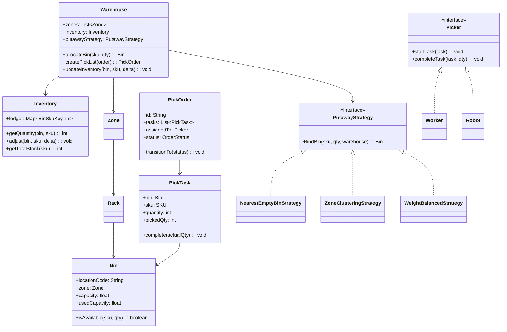
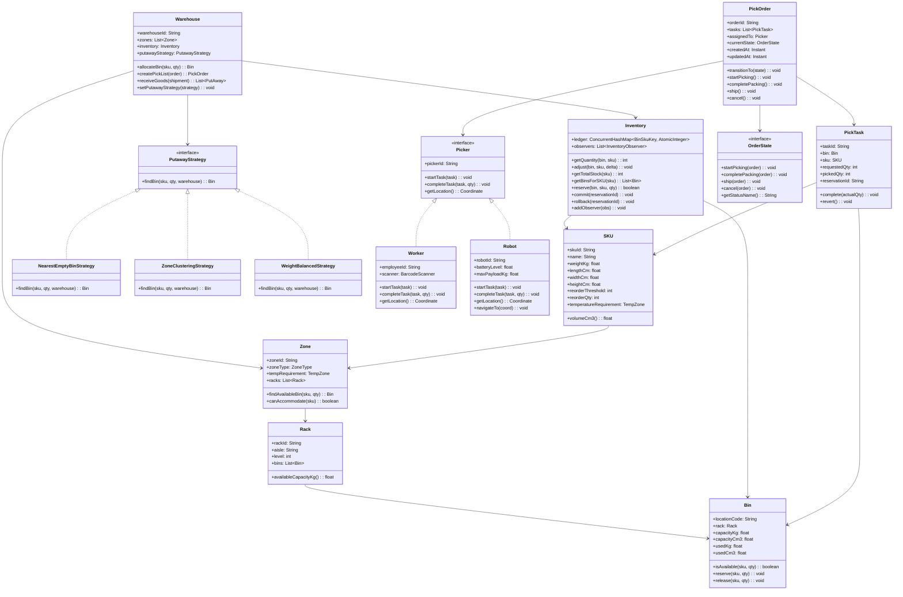
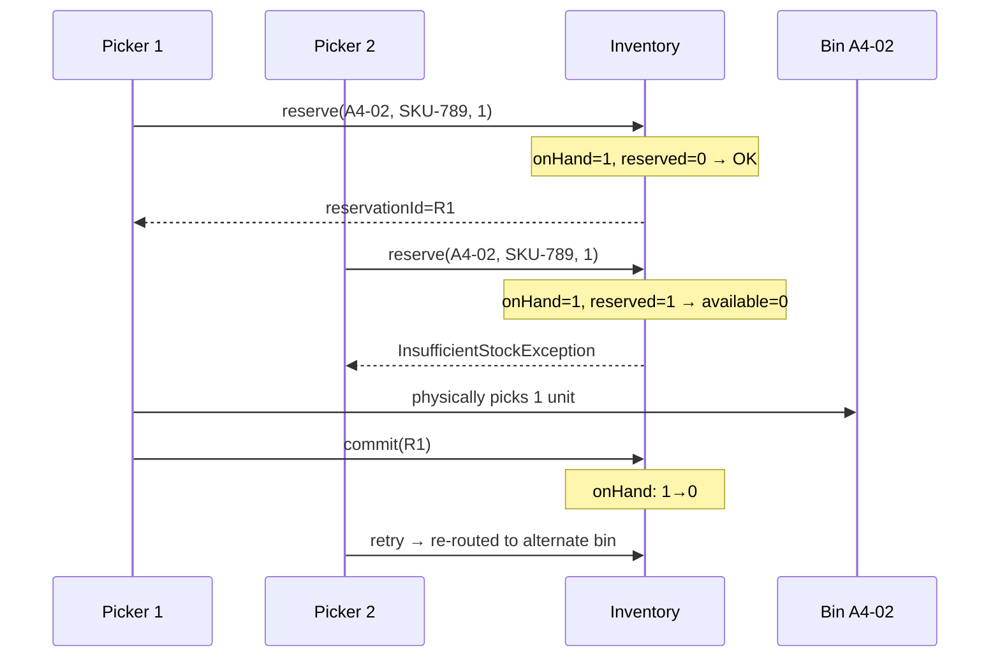
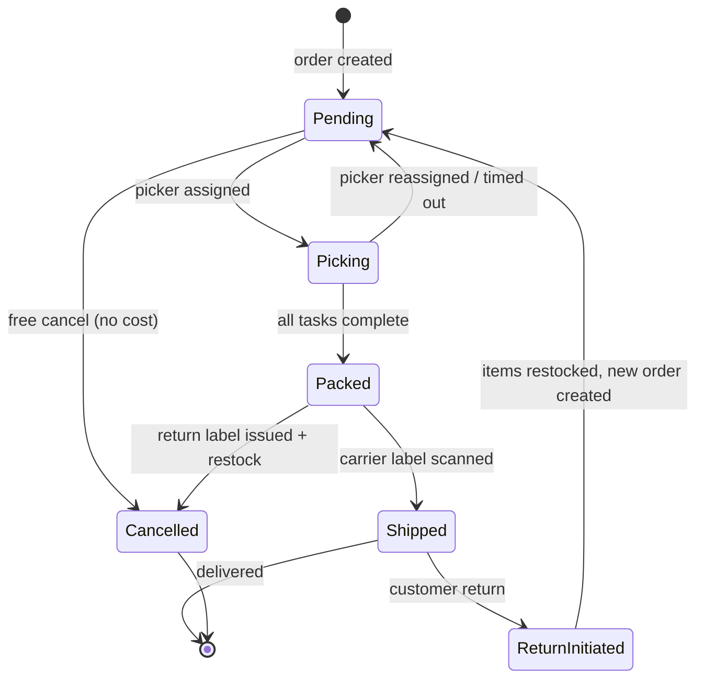

# Design a Warehouse Management System (OOD)

**Difficulty**: 🟡 Intermediate
**Codemania**: #121
**Interview Frequency**: Medium

---

## Problem Statement

Model a warehouse management system that handles product storage, putaway (assigning incoming goods to bins), pick order generation for outbound shipments, and real-time inventory tracking. The OOD challenge: putaway strategies vary (nearest empty bin vs zone-clustering by product type vs weight-balanced), and orders pass through a state machine. Strategy keeps putaway algorithms swappable; Command encapsulates pick operations.

---

## Functional Requirements

- Receive incoming goods: assign each SKU quantity to a bin location
- Pick orders: generate a pick list (bin location + quantity) for outbound orders
- Inventory: real-time stock count per bin and per SKU
- Low-stock alert when a SKU falls below reorder threshold
- Support both human workers and robot pickers
- Order state lifecycle: pending → picking → packed → shipped

---

## Core Entities

| Class | Responsibility |
|-------|---------------|
| `Warehouse` | Root: zones, racks, inventory ledger |
| `Zone` | Area of warehouse: temp zone (cold storage), zone type |
| `Rack` | Physical rack within a zone; contains bins |
| `Bin` | Smallest storage unit: physical location code, capacity |
| `SKU` | Stock-keeping unit: product ID, dimensions, weight, reorder threshold |
| `Inventory` | Ledger: (bin, SKU) → quantity; thread-safe |
| `PutAway` | Incoming goods task: assign SKU+qty to a bin |
| `PickOrder` | Outbound order: list of pick tasks (bin + SKU + qty) |
| `Worker` | Human picker: assigned pick tasks, scans bins |
| `Robot` | Automated picker: same interface as Worker via common interface |

---

## Class Diagram



---

## Design Patterns Used

### 1. Strategy — Putaway Algorithm

**Why it fits**: A general merchandise warehouse uses nearest-empty-bin (minimize travel time); a grocery warehouse uses zone clustering (keep same products together for faster replenishment); a tiered warehouse uses weight balancing (heavy items on lower racks). Each is a different algorithm with the same input/output.

```
interface PutawayStrategy:
  findBin(sku: SKU, qty: int, warehouse: Warehouse): Bin

NearestEmptyBinStrategy:
  findBin(sku, qty, warehouse):
    currentLocation = warehouse.receivingDock
    return warehouse.allBins()
      .filter(b -> b.isAvailable(sku, qty))
      .sortedBy(b -> distanceTo(currentLocation, b))
      .first()

ZoneClusteringStrategy:
  findBin(sku, qty, warehouse):
    // Check if same SKU already stored — place nearby
    existingBins = warehouse.inventory.getBinsForSKU(sku)
    if not existingBins.isEmpty():
      zone = existingBins.first().zone
      return zone.findAvailableBin(sku, qty) ?? anyBin()
    return NearestEmptyBinStrategy().findBin(sku, qty, warehouse)

WeightBalancedStrategy:
  findBin(sku, qty, warehouse):
    if sku.weightKg > HEAVY_THRESHOLD:
      return warehouse.getGroundLevelBins()
               .filter(b -> b.isAvailable(sku, qty))
               .first()
    return NearestEmptyBinStrategy().findBin(sku, qty, warehouse)
```

### 2. Command — Pick Task

**Why it fits**: A pick task (go to bin X, take N units of SKU Y) is an executable, undoable operation. Wrapping each task as a `PickCommand` enables batch execution, partial failure rollback, and audit trail — the command knows both how to execute and how to undo (put goods back).

```
class PickCommand:
  task: PickTask
  warehouse: Warehouse
  executed: boolean

  execute():
    available = warehouse.inventory.getQuantity(task.bin, task.sku)
    if available < task.quantity:
      throw InsufficientStockException(task.bin, task.sku)
    warehouse.inventory.adjust(task.bin, task.sku, -task.quantity)
    task.complete(task.quantity)
    executed = true

  undo():
    if executed:
      warehouse.inventory.adjust(task.bin, task.sku, +task.quantity)
      task.reverse()
      executed = false
```

### 3. Observer — Low Stock Alert

**Why it fits**: When inventory for a SKU drops below its reorder threshold, the purchasing team, the warehouse manager, and the supplier portal all need to know. Observer decouples the inventory ledger from notification systems.

```
class Inventory:
  observers: List<InventoryObserver>

  adjust(bin: Bin, sku: SKU, delta: int): void
    ledger[key(bin, sku)] += delta
    total = getTotalStock(sku)
    if total <= sku.reorderThreshold:
      publish(LowStockEvent(sku, total))

  publish(event): void
    for obs in observers: obs.onEvent(event)

class PurchasingAlertObserver implements InventoryObserver:
  onEvent(LowStockEvent e):
    purchasingTeam.createReplenishmentRequest(e.sku, e.sku.reorderQty)

class WarehouseDisplayObserver implements InventoryObserver:
  onEvent(LowStockEvent e):
    dashboard.flagLowStock(e.sku, e.currentQty)
```

### 4. State — Order Lifecycle

**Why it fits**: A pending order can be cancelled for free; a packed order needs a return label to cancel; a shipped order cannot be cancelled at all. State pattern makes each phase's allowed transitions explicit.

```
interface OrderState:
  startPicking(order): void
  completePacking(order): void
  ship(order): void
  cancel(order): void

class PendingState implements OrderState:
  startPicking(order):
    assignPicker(order)
    order.transitionTo(new PickingState())

  cancel(order):
    order.transitionTo(new CancelledState())  // free cancel

class PackedState implements OrderState:
  ship(order):
    order.transitionTo(new ShippedState())

  cancel(order):
    // Generate return label, restock items
    restock(order)
    order.transitionTo(new CancelledState())

class ShippedState implements OrderState:
  cancel(order):
    throw CannotCancelShippedOrderException()
```

---

## Key Method: `createPickList(order)`

```
WarehouseService:
  createPickList(order: OutboundOrder): PickOrder
    tasks = []

    for lineItem in order.items:
      remaining = lineItem.quantity

      // 1. Find bins containing this SKU (sorted by distance from packing station)
      bins = inventory.getBinsForSKU(lineItem.sku)
               .sortedBy(b -> distanceToPacking(b))

      // 2. Allocate from bins, splitting across multiple if needed
      for bin in bins:
        if remaining <= 0: break
        available = inventory.getQuantity(bin, lineItem.sku)
        toTake = min(available, remaining)
        if toTake > 0:
          tasks.add(new PickTask(bin, lineItem.sku, toTake))
          remaining -= toTake

      if remaining > 0:
        throw InsufficientStockException(lineItem.sku, lineItem.quantity)

    // 3. Sort tasks by bin location for efficient travel path
    tasks = optimizeTravelPath(tasks)

    pickOrder = new PickOrder(order.id, tasks)
    pickOrder.transitionTo(PENDING)
    return pickOrder
```

---

## Design Decisions & Trade-offs

| Decision | Option A | Option B | Choice |
|----------|----------|----------|--------|
| Putaway algorithm | Random bin (simple) | Zone-clustered (efficient picks) | Zone-clustered — reduces pick travel distance by ~30% |
| Pick batching | One order per picker | Batch multiple orders per trip | Batch picking — cuts travel time; harder to implement |
| Robot vs human | Separate class hierarchies | Common `Picker` interface | Common interface — robot and human can receive same task objects |
| Inventory update | Sync on pick | Deferred batch | Sync on pick — real-time accuracy; deferred causes ghost stock |

---

## Top Interview Questions

| Question | What It Tests |
|----------|--------------|
| Two pickers race to the same bin for the last unit — how do you handle it? | Inventory reservation, optimistic vs pessimistic locking |
| How would you add a cold-storage zone with different temperature constraints? | Zone specialization, putaway strategy considers temperature |
| How do you generate a travel-optimized pick path for a human picker? | Traveling salesman heuristic (nearest-next), path ordering |

---

## Related Concepts

- [Online Shopping OOD for the order placement and inventory reservation side](./online-shopping)
- [Library Management OOD for similar physical item state tracking](./library-management)

---

## Class Design

The class diagram below extends the high-level view above to show concrete method signatures, field types, and relationships. Pay special attention to the bidirectional dependency between `Inventory` and the observer list, and how `PickOrder` delegates state transitions to the current `OrderState` object rather than managing them inline.



---

## Component Deep Dive 1: Inventory Ledger (Thread-Safe Reservation)

The `Inventory` class is the most critical component in a warehouse management system. At first glance it looks like a simple map from `(Bin, SKU)` to a count, but the naive approach — a plain `HashMap` with a synchronized method — breaks under real warehouse conditions in two specific ways.

**Why naive approaches fail at scale**

First, the TOCTOU (Time-Of-Check-Time-Of-Use) problem: a picker checks that bin A4-02 has 5 units of SKU-789, then a second picker checks the same bin before the first picker updates the ledger — both "see" 5 available, both are dispatched, and one arrives at an empty bin. At Amazon's Robbinsville fulfillment center this would mean a miss rate above 0.1% at peak (Prime Day), which translates to tens of thousands of failed picks per day.

Second, coarse-grained locking: if you lock the entire inventory map for every read/write, a warehouse processing 2,000 concurrent picks (realistic at a mid-sized facility) serializes every operation, reducing throughput to roughly 500 ops/sec even on fast hardware.

**The correct approach: two-phase reserve-commit**

Use `ConcurrentHashMap<BinSkuKey, AtomicInteger>` for the physical on-hand count, plus a separate reservation table (also concurrent) for in-flight picks. A pick task does not immediately decrement the physical count — instead it creates a reservation that subtracts from the available count (on-hand minus reserved) without touching the physical count until the picker confirms actual removal.

```
class Inventory:
  onHand: ConcurrentHashMap<BinSkuKey, AtomicInteger>
  reserved: ConcurrentHashMap<String, Reservation>  // reservationId → Reservation

  reserve(bin, sku, qty): String
    key = BinSkuKey(bin, sku)
    available = onHand.getOrDefault(key, 0) - sumReserved(key)
    if available < qty:
      throw InsufficientStockException(bin, sku, qty, available)
    reservationId = UUID.randomUUID()
    reserved.put(reservationId, Reservation(key, qty, Instant.now()))
    return reservationId

  commit(reservationId):
    r = reserved.remove(reservationId)
    onHand.get(r.key).addAndGet(-r.qty)
    notifyObserversIfLow(r.key)

  rollback(reservationId):
    reserved.remove(reservationId)  // no physical change needed
```

The key insight: `available = onHand - sumReserved` is computed without a lock because both maps use atomic operations and the reservation table is the source of truth for in-flight work.

**Sequence: two pickers racing on the last unit**



**Trade-off table: inventory locking strategies**

| Approach | Latency (p99) | Throughput | Trade-off |
|----------|--------------|------------|-----------|
| Synchronized HashMap (global lock) | 120ms | ~500 ops/sec | Simple but serializes all picks; single-threaded bottleneck |
| ConcurrentHashMap + AtomicInteger | 8ms | ~15,000 ops/sec | Lock-free reads; compare-and-swap writes; reservation table adds memory overhead (~200 bytes/reservation) |
| Database row-level locking (SELECT FOR UPDATE) | 35ms | ~3,000 ops/sec | Durable across restarts; network round-trip cost; suitable when inventory must survive process crash |

For an in-process OOD implementation the concurrent in-memory approach is correct. For a distributed warehouse system spanning multiple processes, the database approach becomes necessary.

---

## Component Deep Dive 2: Putaway Strategy Selection

The `PutawayStrategy` interface is the single most impactful performance lever in a warehouse. The choice of algorithm directly determines average picker travel distance, which is the dominant cost in warehouse operations: at Ocado's Hatfield Customer Fulfilment Centre, travel time accounts for roughly 60% of all picker-hours.

**Internal mechanics of ZoneClusteringStrategy**

Zone clustering works in three decision steps: first check if the incoming SKU already has stock in a zone — place new stock in the same zone to co-locate replenishment. Second check if the SKU has a temperature requirement — it must go into the matching temperature zone. Third fall back to nearest-empty-bin for truly new SKUs with no zone affinity.

```
ZoneClusteringStrategy.findBin(sku, qty, warehouse):
  // Step 1: co-locate with existing stock of same SKU
  existingBins = warehouse.inventory.getBinsForSKU(sku)
  if existingBins.nonEmpty():
    targetZone = existingBins
                   .groupBy(b -> b.rack.zone)
                   .maxByValue(zone -> totalStockInZone(zone, sku))
    candidate = targetZone.findAvailableBin(sku, qty)
    if candidate != null: return candidate

  // Step 2: respect temperature constraint
  if sku.temperatureRequirement != AMBIENT:
    tempZone = warehouse.zones.find(z -> z.tempRequirement == sku.tempRequirement)
    if tempZone != null:
      candidate = tempZone.findAvailableBin(sku, qty)
      if candidate != null: return candidate

  // Step 3: fall back to nearest empty
  return NearestEmptyBinStrategy().findBin(sku, qty, warehouse)
```

**Scale behavior at 10x load**

A single warehouse receiving dock processing 50 incoming pallets/hour can call `findBin` ~500 times/hour comfortably. At 10x (5,000/hour), the `getBinsForSKU` scan becomes the bottleneck — iterating all inventory entries to find bins for a SKU is O(N) where N is total bin-SKU pairs (could be 100,000+ in a large facility). The fix is a secondary index: maintain a `skuToBins: Map<SkuId, Set<BinId>>` updated on every inventory adjustment. This reduces lookup from O(N) to O(1) at the cost of extra memory (~10MB for a 100,000-SKU facility).

**Putaway strategies compared**

| Strategy | Travel Distance Reduction | Implementation Complexity | Best For |
|----------|--------------------------|--------------------------|---------|
| NearestEmptyBin | Baseline | Low — sort bins by distance | Random goods, small warehouses |
| ZoneClustering | 25-35% vs baseline | Medium — secondary SKU index | E-commerce, grocery, repeat SKUs |
| WeightBalanced | 0% travel, prevents rack damage | Low — filter by weight threshold | Hardware, industrial parts |
| AI/ML (demand-based slotting) | 40-50% vs baseline | High — offline model, daily refresh | High-SKU-count fashion/apparel |

---

## Component Deep Dive 3: Order State Machine

The `OrderState` pattern governs what operations are legal at each phase of an order's lifecycle. This is not just an academic pattern — incorrect state management causes real financial damage: processing a cancellation on a shipped order that already has a carrier tracking number triggers a full return workflow costing $8-15 in reverse logistics per parcel (industry average for US domestic).

**Why an if-else chain fails**

The naive approach uses a status enum and a `switch` statement in `PickOrder.cancel()`. As the number of states grows (pending, picking, packed, labeled, manifested, shipped, in-transit, delivered, return-initiated), every method that checks state grows proportionally. A single missed `case` in `cancel()` allows illegal transitions silently. The State pattern enforces completeness: each `OrderState` subclass must implement every method; attempts to call an illegal transition throw `IllegalStateTransitionException` at compile time (in statically typed languages) or at instantiation.

**State transition diagram**



**Extension for partial picks**: if a picker can only find 8 of 10 requested units, the order transitions to `PartiallyPicked` state. The `PartiallyPickedState` can either wait for replenishment (and auto-resume when stock arrives via the Observer pattern) or ship the partial order with a back-order note. This extension requires adding one state class with no changes to existing states — a direct demonstration of the Open/Closed Principle.

---

## Design Patterns Applied

### 1. Strategy — Putaway Algorithm

The `PutawayStrategy` interface allows runtime substitution of the bin-assignment algorithm. The warehouse's strategy can be changed for different seasons (holiday peak uses aggressive zone clustering), different product categories (hazardous materials use a dedicated zone-only strategy), or different times of day (overnight restocking uses a load-balancing strategy). No conditional logic inside `Warehouse.allocateBin()` — it delegates entirely to the injected strategy.

### 2. Command — Pick Task

`PickCommand` wraps a `PickTask` with `execute()` and `undo()` methods. This enables: batch execution (a robot executes a list of commands in order), partial rollback (if task 3 of 5 fails due to a bin discrepancy, undo tasks 1 and 2 atomically), and an audit log (every executed and undone command is persisted for inventory reconciliation). The Command pattern also enables asynchronous dispatch: a `CommandQueue` can hold commands for robots that are currently navigating and execute them when the robot arrives at the bin.

### 3. Observer — Low Stock Alert

`Inventory.adjust()` publishes `LowStockEvent` when the total for any SKU drops at or below `sku.reorderThreshold`. Observers are registered at startup: a `PurchasingAlertObserver` raises a replenishment purchase order, a `WarehouseDisplayObserver` flags the SKU on the operations dashboard, and a `SupplierPortalObserver` optionally calls the supplier's EDI endpoint. Each observer is independently deployable and testable; adding a new notification channel (SMS, Slack, ERP) requires implementing one interface method, not modifying `Inventory`.

### 4. State — Order Lifecycle

Each state class (`PendingState`, `PickingState`, `PackedState`, `ShippedState`, `CancelledState`) implements all transition methods. Illegal transitions throw `IllegalStateTransitionException` with a descriptive message. The `PickOrder` delegates every method call (`cancel()`, `ship()`, etc.) to its current state object, which changes `order.currentState` as needed. This eliminates a 50-line `switch` statement that would otherwise grow with every new state.

---

## SOLID Principles

**Single Responsibility Principle**: `Inventory` manages stock counts and fires events — it does not know about picking routes or order states. `PickOrder` manages order lifecycle — it does not know about bin locations or SKU weights. Each class has exactly one reason to change.

**Open/Closed Principle**: Adding a new putaway strategy (e.g., `DemandForecastStrategy` that slots SKUs by predicted velocity) requires implementing `PutawayStrategy` and injecting it — `Warehouse` does not change. Adding a new order state (`PartiallyPickedState`) requires one new class — existing states do not change.

**Liskov Substitution Principle**: `Worker` and `Robot` are substitutable for `Picker` everywhere. A method that accepts `Picker` works identically whether dispatching a human or a robot. Both implement `getLocation()` so path-optimization code works without type checking.

**Interface Segregation Principle**: `Picker` exposes only `startTask()`, `completeTask()`, and `getLocation()`. It does not include robot-specific methods (`navigateTo()`, `batteryLevel`) that human workers cannot satisfy. Robot-specific methods are on the `Robot` class directly, accessed only by the robot fleet manager.

**Dependency Inversion Principle**: `Warehouse` depends on the `PutawayStrategy` interface, not on `NearestEmptyBinStrategy` or `ZoneClusteringStrategy` concretely. `Inventory` depends on the `InventoryObserver` interface, not on `PurchasingAlertObserver`. High-level modules (Warehouse, Inventory) do not depend on low-level modules (specific algorithms, specific notification channels).

---

## Concurrency and Thread Safety

**Concurrent operations that can occur simultaneously:**
- Two pickers attempting to reserve the last unit of a SKU in the same bin
- A putaway task writing new stock to a bin while a pick reservation reads available quantity from that bin
- An inventory adjustment firing an Observer notification while a new observer is being registered
- Multiple robots updating their location while the path optimizer reads locations

**How each is made safe:**

```
// Inventory: ConcurrentHashMap prevents map-level races
// AtomicInteger.compareAndSet prevents count races
onHand.computeIfAbsent(key, k -> new AtomicInteger(0)).addAndGet(delta)

// Reservation: conditional put guarantees atomicity
reserved.putIfAbsent(reservationId, new Reservation(key, qty))

// Observer list: CopyOnWriteArrayList allows concurrent iteration
// while addObserver() creates a new backing array
observers: CopyOnWriteArrayList<InventoryObserver>

// Robot locations: read-heavy, concurrent reads fast
locations: ConcurrentHashMap<RobotId, Coordinate>
```

**Reservation expiry**: a reservation that is never committed (picker dropped device, network failure) must be cleaned up. A background `ReservationExpiryTask` runs every 60 seconds and rolls back reservations older than 10 minutes. This prevents permanent phantom-reservation of stock.

---

## Extension Points

**Adding autonomous mobile robots (AMRs) with battery management**: The `Robot` class already implements `Picker`. Adding battery-aware dispatch means extending `Warehouse.assignPicker()` to prefer robots with battery above 30%, and adding a `ChargingState` to the robot's own state machine. The `PickOrder` state machine does not change.

**Adding multi-warehouse routing**: When an order cannot be fulfilled from a single warehouse, introduce a `WarehouseCluster` class that iterates `List<Warehouse>` and creates partial pick orders from each. The `PickOrder` and `PickTask` classes are reused unchanged; only the routing logic is new.

**Adding real-time slotting optimization**: Replace `ZoneClusteringStrategy` with `MLSlottingStrategy` that calls an external model endpoint. The `PutawayStrategy` interface requires only `findBin()` — the implementation detail (local algorithm vs. remote model) is invisible to `Warehouse`.

**Adding audit logging for every inventory adjustment**: Add an `AuditLogObserver` to `Inventory.observers`. Every `adjust()` call logs to a write-ahead log. No changes to existing code paths.

---

## Data Model

The in-memory data model uses these concrete types. In a persistent implementation (e.g., PostgreSQL backing store), each class maps to a table.

```sql
-- Warehouse physical structure
CREATE TABLE zones (
    zone_id       VARCHAR(20) PRIMARY KEY,
    warehouse_id  VARCHAR(20) NOT NULL,
    zone_type     VARCHAR(30) NOT NULL,  -- GENERAL, COLD, HAZMAT, BULK
    temp_min_c    FLOAT,
    temp_max_c    FLOAT
);

CREATE TABLE racks (
    rack_id       VARCHAR(20) PRIMARY KEY,
    zone_id       VARCHAR(20) REFERENCES zones(zone_id),
    aisle         VARCHAR(5) NOT NULL,
    rack_level    INT NOT NULL,          -- 1=ground, 2=mid, 3=top
    max_weight_kg FLOAT NOT NULL
);

CREATE TABLE bins (
    location_code VARCHAR(20) PRIMARY KEY,  -- e.g. "A4-02-03" (aisle-rack-bin)
    rack_id       VARCHAR(20) REFERENCES racks(rack_id),
    capacity_kg   FLOAT NOT NULL,
    capacity_cm3  FLOAT NOT NULL,
    is_active     BOOLEAN DEFAULT TRUE
);

-- Product catalog
CREATE TABLE skus (
    sku_id              VARCHAR(30) PRIMARY KEY,
    name                VARCHAR(200) NOT NULL,
    weight_kg           FLOAT NOT NULL,
    length_cm           FLOAT NOT NULL,
    width_cm            FLOAT NOT NULL,
    height_cm           FLOAT NOT NULL,
    temp_requirement    VARCHAR(20) DEFAULT 'AMBIENT',
    reorder_threshold   INT NOT NULL,
    reorder_qty         INT NOT NULL
);

-- Inventory ledger (source of truth for stock counts)
CREATE TABLE inventory_ledger (
    location_code  VARCHAR(20) REFERENCES bins(location_code),
    sku_id         VARCHAR(30) REFERENCES skus(sku_id),
    quantity       INT NOT NULL DEFAULT 0 CHECK (quantity >= 0),
    last_updated   TIMESTAMP NOT NULL DEFAULT NOW(),
    PRIMARY KEY (location_code, sku_id)
);

-- Index for getBinsForSKU() — O(1) lookup by SKU
CREATE INDEX idx_inventory_sku ON inventory_ledger(sku_id) WHERE quantity > 0;

-- In-flight reservations (cleared on commit or expiry)
CREATE TABLE inventory_reservations (
    reservation_id  UUID PRIMARY KEY,
    location_code   VARCHAR(20) NOT NULL,
    sku_id          VARCHAR(30) NOT NULL,
    reserved_qty    INT NOT NULL,
    reserved_at     TIMESTAMP NOT NULL DEFAULT NOW(),
    expires_at      TIMESTAMP NOT NULL,
    pick_task_id    UUID
);

CREATE INDEX idx_reservations_expiry ON inventory_reservations(expires_at);

-- Orders and pick tasks
CREATE TABLE pick_orders (
    order_id        UUID PRIMARY KEY,
    status          VARCHAR(20) NOT NULL,  -- PENDING, PICKING, PACKED, SHIPPED, CANCELLED
    picker_id       VARCHAR(30),
    created_at      TIMESTAMP NOT NULL DEFAULT NOW(),
    updated_at      TIMESTAMP NOT NULL DEFAULT NOW()
);

CREATE TABLE pick_tasks (
    task_id         UUID PRIMARY KEY,
    order_id        UUID REFERENCES pick_orders(order_id),
    location_code   VARCHAR(20) NOT NULL,
    sku_id          VARCHAR(30) NOT NULL,
    requested_qty   INT NOT NULL,
    picked_qty      INT DEFAULT 0,
    reservation_id  UUID,
    seq_in_order    INT NOT NULL  -- travel-path sort order
);
```

---

## Scale Bottlenecks

| Traffic Level | Component That Breaks | Symptoms | Mitigation |
|---------------|----------------------|----------|------------|
| 10x baseline (500 concurrent picks) | `sumReserved()` scan per reservation check | Reservation lookup degrades from O(1) to O(N active reservations); p99 > 200ms | Maintain per-`BinSkuKey` reservation sum in a separate `ConcurrentHashMap`; O(1) lookup |
| 100x baseline (5,000 concurrent picks) | Observer notification on every `adjust()` call | Synchronous observers (PurchasingAlert, Dashboard) add 50ms+ to every pick commit; pickers block | Make observer dispatch async: post events to an internal `BlockingQueue`, a dedicated notification thread drains it |
| 100x baseline | `getBinsForSKU()` full ledger scan during putaway | Putaway latency > 500ms; receiving dock backs up | Secondary index `skuToBins: ConcurrentHashMap<SkuId, CopyOnWriteArraySet<Bin>>` maintained on every `adjust()` |
| 1000x baseline (50,000 concurrent picks) | Single JVM cannot hold full inventory in memory | GC pressure, heap exhaustion (100k SKUs × 50 bins avg = 5M entries × ~200 bytes = 1GB+) | Partition inventory by zone: each zone runs in an independent process; `Warehouse` becomes a router; zone-crossing orders require distributed reservation protocol |
| 1000x baseline | CAS (compare-and-swap) contention on hot bins | High-velocity SKUs (top 0.1%) have dozens of concurrent reservations; CAS retry loops spike CPU | Hot-bin sharding: replicate top-100 SKU counts across N virtual shards; reads pick any shard, writes use consistent hashing |

---

## How Amazon Built This

Amazon's fulfillment center software (Amazon Warehouse Management System, internal name "AWMS") has been described in several re:Invent talks and patent filings. Their Robbinsville, NJ FC processes roughly 1.5 million items per day at peak (Prime Day 2023), with around 3,000 human pickers and 1,000+ Proteus and Kiva/Sequoia robots operating concurrently.

**Specific technology choices:**

Amazon uses a **reactive reservation system** similar to the two-phase approach described above, but at distributed scale. Each physical zone in the warehouse runs as an independent microservice with its own inventory partition. Cross-zone picks (when a single order spans multiple zones) use a saga pattern: each zone's reservation is independent, and a coordinator commits or rolls back all reservations atomically. This avoids a global distributed transaction while still preventing over-commitment.

**Putaway via ML slotting (SLAM — Sort, Label, and Manifest):** Amazon does not use static zone clustering. They run an offline ML model nightly that scores each SKU by expected pick velocity over the next 24 hours (using order history and trending data). High-velocity SKUs are slotted to bins nearest to packing stations; slow-movers go to distant storage. This reduces average picker travel distance by approximately 40% versus naive nearest-empty-bin, which at 1.5M picks/day corresponds to saving roughly 25,000 picker-hours per day per FC.

**Robot dispatch as a Command queue:** each Kiva/Sequoia robot maintains a local command queue. The central orchestrator enqueues `DriveToShelf`, `LiftShelf`, `DriveToStation` commands. If the robot loses connectivity mid-task, it finishes the current command from its local queue and re-syncs on reconnect. This mirrors the Command pattern's undo/redo capability — the orchestrator can re-issue commands that were never acknowledged.

**Specific numbers:** Each FC processes ~300 pick-commit operations per second during peak (roughly 300 `inventory.adjust()` calls/sec per zone), with a reservation table holding ~50,000 active reservations at any given moment. Reservation expiry runs every 30 seconds (not 60) to prevent a checker from waiting more than 30s for a stale reservation to clear.

Source: [Amazon re:Invent 2022 — Inside Amazon Fulfillment](https://www.youtube.com/watch?v=_BpJkAZJiR4), US Patent 9,280,757 (robotic fulfillment), AWS re:Invent ARC307 (2023).

---

## Interview Angle

**What the interviewer is testing:** Whether the candidate can design a concurrent, thread-safe inventory system while keeping the domain model clean — specifically whether they know about TOCTOU races, reservation patterns, and how Strategy/Command patterns solve real operational problems (not just academic ones).

**Common mistakes candidates make:**

1. **Decrementing inventory immediately on pick assignment** — the correct model reserves stock first and decrements only when the picker physically confirms removal. Immediate decrement means a picker who drops a task leaves phantom stock shortages; the system thinks stock is gone but it is still in the bin.

2. **Putting state-transition logic inside `PickOrder` as a giant `switch` statement** — the interviewer will then ask "how do you add a new state?" and the candidate realizes every method needs a new `case`. The State pattern pushes each state's behavior into its own class, making additions additive rather than modifying existing code.

3. **Ignoring the temperature zone constraint in putaway** — placing a refrigerated item (e.g., insulin) into an ambient bin is a safety and compliance failure. A robust `PutawayStrategy` checks `sku.temperatureRequirement` before any other criterion. Candidates who jump straight to nearest-empty-bin without asking "are there zone constraints?" miss this entirely.

**The insight that separates good from great answers:** Recognizing that inventory accuracy requires a **two-phase reserve-commit** protocol, not just atomic operations. An atomic decrement prevents race conditions on the count, but it does not handle the case where a picker is in transit and has not yet physically confirmed removal. The reservation table is the bridge between assignment-time and confirmation-time, and without it, a picker abort (battery dead, mis-scan) silently reduces stock below reality.

---

## Key Numbers to Remember

| Metric | Value | Context |
|--------|-------|---------|
| Amazon Prime Day peak picks | 1.5M items/day per large FC | Robbinsville NJ; ~17 picks/sec sustained |
| Pick-commit ops/sec per zone | ~300/sec | Reservation table ~50k active entries at peak |
| Zone clustering travel savings | 25-35% | vs. nearest-empty-bin; measured at mid-size e-commerce FCs |
| ML slotting travel savings | 40-50% | Amazon SLAM system; measured vs. static zone clustering |
| Reservation expiry interval | 30-60 seconds | Balances stale-reservation cleanup vs. checker wait time |
| Hot-bin CAS contention threshold | Top 0.1% of SKUs | ~100 SKUs in a 100k-SKU facility drive >30% of contention |
| Reverse logistics cost per cancelled shipped order | $8-15 | US domestic average; enforces the ShippedState cancel guard |
| Secondary index memory overhead | ~10MB | 100k-SKU facility, `skuToBins` map with avg 50 bins/SKU |

---

## 📚 Resources & References

| Resource | Type | What You'll Learn |
|----------|------|------------------|
| [NeetCode OOD Playlist](https://www.youtube.com/@NeetCode) | 📺 YouTube | Strategy and Command pattern walkthroughs |
| [ByteByteGo System Design](https://www.youtube.com/@ByteByteGo) | 📺 YouTube | Amazon warehouse and fulfillment design |
| [Head First Design Patterns](https://www.oreilly.com/library/view/head-first-design/0596007124/) | 📖 Blog | Strategy and Observer chapters |
| [Clean Code — Robert Martin](https://www.amazon.com/Clean-Code-Handbook-Software-Craftsmanship/dp/0132350882) | 📚 Book | Clean inventory and pick logic |
| [GoF Design Patterns](https://www.amazon.com/Design-Patterns-Elements-Reusable-Object-Oriented/dp/0201633612) | 📚 Book | Command and State pattern reference |
