# Design a Warehouse Management System (OOD)

**Difficulty**: 🟡 Intermediate
**Codemania**: #121
**Interview Frequency**: Medium

---

## Problem Statement

Model a warehouse management system that handles product storage, putaway (assigning incoming goods to bins), pick order generation for outbound shipments, and real-time inventory tracking. The OOD challenge: putaway strategies vary (nearest empty bin vs zone-clustering by product type vs weight-balanced), and orders pass through a state machine. Strategy keeps putaway algorithms swappable; Command encapsulates pick operations.

---

## Functional Requirements

- Receive incoming goods: assign each SKU quantity to a bin location
- Pick orders: generate a pick list (bin location + quantity) for outbound orders
- Inventory: real-time stock count per bin and per SKU
- Low-stock alert when a SKU falls below reorder threshold
- Support both human workers and robot pickers
- Order state lifecycle: pending → picking → packed → shipped

---

## Core Entities

| Class | Responsibility |
|-------|---------------|
| `Warehouse` | Root: zones, racks, inventory ledger |
| `Zone` | Area of warehouse: temp zone (cold storage), zone type |
| `Rack` | Physical rack within a zone; contains bins |
| `Bin` | Smallest storage unit: physical location code, capacity |
| `SKU` | Stock-keeping unit: product ID, dimensions, weight, reorder threshold |
| `Inventory` | Ledger: (bin, SKU) → quantity; thread-safe |
| `PutAway` | Incoming goods task: assign SKU+qty to a bin |
| `PickOrder` | Outbound order: list of pick tasks (bin + SKU + qty) |
| `Worker` | Human picker: assigned pick tasks, scans bins |
| `Robot` | Automated picker: same interface as Worker via common interface |

---

## Class Diagram

```mermaid
classDiagram
    class Warehouse {
        +zones: List~Zone~
        +inventory: Inventory
        +putawayStrategy: PutawayStrategy
        +allocateBin(sku, qty): Bin
        +createPickList(order): PickOrder
        +updateInventory(bin, sku, delta): void
    }
    class Bin {
        +locationCode: String
        +zone: Zone
        +capacity: float
        +usedCapacity: float
        +isAvailable(sku, qty): boolean
    }
    class Inventory {
        +ledger: Map~BinSkuKey, int~
        +getQuantity(bin, sku): int
        +adjust(bin, sku, delta): void
        +getTotalStock(sku): int
    }
    class PutawayStrategy {
        <<interface>>
        +findBin(sku, qty, warehouse): Bin
    }
    class PickOrder {
        +id: String
        +tasks: List~PickTask~
        +assignedTo: Picker
        +status: OrderStatus
        +transitionTo(status): void
    }
    class PickTask {
        +bin: Bin
        +sku: SKU
        +quantity: int
        +pickedQty: int
        +complete(actualQty): void
    }
    class Picker {
        <<interface>>
        +startTask(task): void
        +completeTask(task, qty): void
    }
    Warehouse --> Zone
    Zone --> Rack
    Rack --> Bin
    Warehouse --> Inventory
    Warehouse --> PutawayStrategy
    PickOrder --> PickTask
    PickTask --> Bin
    PutawayStrategy <|.. NearestEmptyBinStrategy
    PutawayStrategy <|.. ZoneClusteringStrategy
    PutawayStrategy <|.. WeightBalancedStrategy
    Picker <|.. Worker
    Picker <|.. Robot
```



---

## Design Patterns Used

### 1. Strategy — Putaway Algorithm

**Why it fits**: A general merchandise warehouse uses nearest-empty-bin (minimize travel time); a grocery warehouse uses zone clustering (keep same products together for faster replenishment); a tiered warehouse uses weight balancing (heavy items on lower racks). Each is a different algorithm with the same input/output.

```
interface PutawayStrategy:
  findBin(sku: SKU, qty: int, warehouse: Warehouse): Bin

NearestEmptyBinStrategy:
  findBin(sku, qty, warehouse):
    currentLocation = warehouse.receivingDock
    return warehouse.allBins()
      .filter(b -> b.isAvailable(sku, qty))
      .sortedBy(b -> distanceTo(currentLocation, b))
      .first()

ZoneClusteringStrategy:
  findBin(sku, qty, warehouse):
    // Check if same SKU already stored — place nearby
    existingBins = warehouse.inventory.getBinsForSKU(sku)
    if not existingBins.isEmpty():
      zone = existingBins.first().zone
      return zone.findAvailableBin(sku, qty) ?? anyBin()
    return NearestEmptyBinStrategy().findBin(sku, qty, warehouse)

WeightBalancedStrategy:
  findBin(sku, qty, warehouse):
    if sku.weightKg > HEAVY_THRESHOLD:
      return warehouse.getGroundLevelBins()
               .filter(b -> b.isAvailable(sku, qty))
               .first()
    return NearestEmptyBinStrategy().findBin(sku, qty, warehouse)
```

### 2. Command — Pick Task

**Why it fits**: A pick task (go to bin X, take N units of SKU Y) is an executable, undoable operation. Wrapping each task as a `PickCommand` enables batch execution, partial failure rollback, and audit trail — the command knows both how to execute and how to undo (put goods back).

```
class PickCommand:
  task: PickTask
  warehouse: Warehouse
  executed: boolean

  execute():
    available = warehouse.inventory.getQuantity(task.bin, task.sku)
    if available < task.quantity:
      throw InsufficientStockException(task.bin, task.sku)
    warehouse.inventory.adjust(task.bin, task.sku, -task.quantity)
    task.complete(task.quantity)
    executed = true

  undo():
    if executed:
      warehouse.inventory.adjust(task.bin, task.sku, +task.quantity)
      task.reverse()
      executed = false
```

### 3. Observer — Low Stock Alert

**Why it fits**: When inventory for a SKU drops below its reorder threshold, the purchasing team, the warehouse manager, and the supplier portal all need to know. Observer decouples the inventory ledger from notification systems.

```
class Inventory:
  observers: List<InventoryObserver>

  adjust(bin: Bin, sku: SKU, delta: int): void
    ledger[key(bin, sku)] += delta
    total = getTotalStock(sku)
    if total <= sku.reorderThreshold:
      publish(LowStockEvent(sku, total))

  publish(event): void
    for obs in observers: obs.onEvent(event)

class PurchasingAlertObserver implements InventoryObserver:
  onEvent(LowStockEvent e):
    purchasingTeam.createReplenishmentRequest(e.sku, e.sku.reorderQty)

class WarehouseDisplayObserver implements InventoryObserver:
  onEvent(LowStockEvent e):
    dashboard.flagLowStock(e.sku, e.currentQty)
```

### 4. State — Order Lifecycle

**Why it fits**: A pending order can be cancelled for free; a packed order needs a return label to cancel; a shipped order cannot be cancelled at all. State pattern makes each phase's allowed transitions explicit.

```
interface OrderState:
  startPicking(order): void
  completePacking(order): void
  ship(order): void
  cancel(order): void

class PendingState implements OrderState:
  startPicking(order):
    assignPicker(order)
    order.transitionTo(new PickingState())

  cancel(order):
    order.transitionTo(new CancelledState())  // free cancel

class PackedState implements OrderState:
  ship(order):
    order.transitionTo(new ShippedState())

  cancel(order):
    // Generate return label, restock items
    restock(order)
    order.transitionTo(new CancelledState())

class ShippedState implements OrderState:
  cancel(order):
    throw CannotCancelShippedOrderException()
```

---

## Key Method: `createPickList(order)`

```
WarehouseService:
  createPickList(order: OutboundOrder): PickOrder
    tasks = []

    for lineItem in order.items:
      remaining = lineItem.quantity

      // 1. Find bins containing this SKU (sorted by distance from packing station)
      bins = inventory.getBinsForSKU(lineItem.sku)
               .sortedBy(b -> distanceToPacking(b))

      // 2. Allocate from bins, splitting across multiple if needed
      for bin in bins:
        if remaining <= 0: break
        available = inventory.getQuantity(bin, lineItem.sku)
        toTake = min(available, remaining)
        if toTake > 0:
          tasks.add(new PickTask(bin, lineItem.sku, toTake))
          remaining -= toTake

      if remaining > 0:
        throw InsufficientStockException(lineItem.sku, lineItem.quantity)

    // 3. Sort tasks by bin location for efficient travel path
    tasks = optimizeTravelPath(tasks)

    pickOrder = new PickOrder(order.id, tasks)
    pickOrder.transitionTo(PENDING)
    return pickOrder
```

---

## Design Decisions & Trade-offs

| Decision | Option A | Option B | Choice |
|----------|----------|----------|--------|
| Putaway algorithm | Random bin (simple) | Zone-clustered (efficient picks) | Zone-clustered — reduces pick travel distance by ~30% |
| Pick batching | One order per picker | Batch multiple orders per trip | Batch picking — cuts travel time; harder to implement |
| Robot vs human | Separate class hierarchies | Common `Picker` interface | Common interface — robot and human can receive same task objects |
| Inventory update | Sync on pick | Deferred batch | Sync on pick — real-time accuracy; deferred causes ghost stock |

---

## Top Interview Questions

| Question | What It Tests |
|----------|--------------|
| Two pickers race to the same bin for the last unit — how do you handle it? | Inventory reservation, optimistic vs pessimistic locking |
| How would you add a cold-storage zone with different temperature constraints? | Zone specialization, putaway strategy considers temperature |
| How do you generate a travel-optimized pick path for a human picker? | Traveling salesman heuristic (nearest-next), path ordering |

---

## Related Concepts

- [Online Shopping OOD for the order placement and inventory reservation side](./online-shopping)
- [Library Management OOD for similar physical item state tracking](./library-management)

---

## 📚 Resources & References

| Resource | Type | What You'll Learn |
|----------|------|------------------|
| [NeetCode OOD Playlist](https://www.youtube.com/@NeetCode) | 📺 YouTube | Strategy and Command pattern walkthroughs |
| [ByteByteGo System Design](https://www.youtube.com/@ByteByteGo) | 📺 YouTube | Amazon warehouse and fulfillment design |
| [Head First Design Patterns](https://www.oreilly.com/library/view/head-first-design/0596007124/) | 📖 Blog | Strategy and Observer chapters |
| [Clean Code — Robert Martin](https://www.amazon.com/Clean-Code-Handbook-Software-Craftsmanship/dp/0132350882) | 📚 Book | Clean inventory and pick logic |
| [GoF Design Patterns](https://www.amazon.com/Design-Patterns-Elements-Reusable-Object-Oriented/dp/0201633612) | 📚 Book | Command and State pattern reference |
