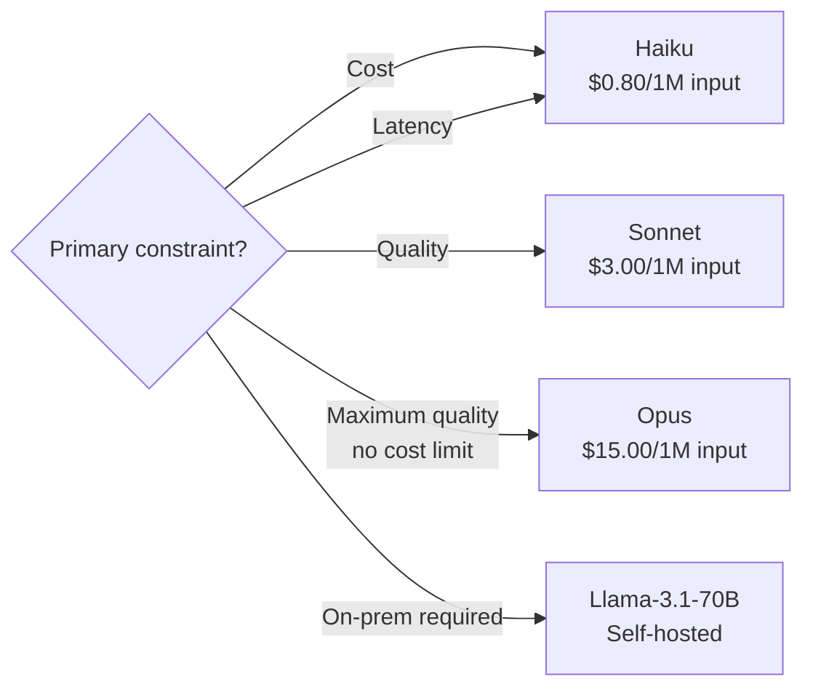

> **📅 Spaced Repetition Schedule**
> - **Day 0** (now): Read through once, note 3 things you didn't know
> - **Day 3**: Redo without looking — what LLM costs and context windows stick out?
> - **Day 10**: Quiz yourself on model selection decisions and token math
> - **Day 30**: Explain RAG architecture, fine-tuning trade-offs, and safety guardrails out loud
>
> *If you can teach it, you've learned it. Each pass takes < 10 minutes.*

# AI Agents & LLMs Cheat Sheet

> Scan time: ~6 min. Every line is interview-relevant. Prices as of mid-2025 — verify before quoting in production estimates.

---

## 1. LLM Model Selection

| Model | Provider | Context | Speed | Quality | Cost (input/output per 1M tokens) | Best For |
|-------|----------|---------|-------|---------|-----------------------------------|---------|
| **claude-haiku-4-5** | Anthropic | 200k | Fast | Good | $0.80 / $4.00 | Classification, routing, simple tasks |
| **claude-sonnet-4-5** | Anthropic | 200k | Medium | Excellent | $3.00 / $15.00 | Production agents, reasoning |
| **claude-opus-4-5** | Anthropic | 200k | Slow | Best | $15.00 / $75.00 | Complex analysis, maximum quality |
| **gpt-4o-mini** | OpenAI | 128k | Fast | Good | $0.15 / $0.60 | Cost-sensitive applications |
| **gpt-4o** | OpenAI | 128k | Medium | Excellent | $2.50 / $10.00 | Fallback when Claude unavailable |
| **gemini-1.5-flash** | Google | 1M | Fast | Good | $0.075 / $0.30 | Long-document processing |
| **Llama-3.1-70B** | Meta/self | 128k | Medium | Good | Free (self-hosted) | Cost-sensitive, on-prem required |
| **Mistral-7B** | Mistral/self | 32k | Fast | Decent | Free (self-hosted) | Edge, low-resource environments |

**Decision rule**: Start with Sonnet. Switch to Haiku if latency or cost is the constraint. Use Opus only when quality clearly justifies 5x cost premium.



---

## 2. API Rate Limits

| Provider | Tier | RPM | TPM (input) | Daily Limit |
|----------|------|-----|-------------|-------------|
| **Anthropic** | Tier 1 (new) | 50 | 50k | 1M tokens |
| **Anthropic** | Tier 2 ($100 spent) | 1,000 | 1M | 10M tokens |
| **Anthropic** | Tier 3 ($500 spent) | 2,000 | 2M | 30M tokens |
| **Anthropic** | Tier 4 ($5k spent) | 4,000 | 4M | No daily limit |
| **OpenAI** | Tier 1 ($5) | 500 (GPT-4o) | 30k | — |
| **OpenAI** | Tier 2 ($50) | 5,000 | 450k | — |
| **Deepgram** | Free | 100 concurrent | — | $200 free credits |
| **ElevenLabs** | Starter ($5/mo) | — | — | 30k chars/mo |

- **Rate limit hit**: implement exponential backoff — `wait = 2^attempt * 0.5s`, cap at 60s
- **Trap**: RPM limits reset per minute, but TPM resets are staggered — a 1M TPM limit can be hit in 10 seconds with large batches

---

## 3. Token Costs (Mid-2025)

| Task | Approximate Tokens | Cost (Sonnet) | Cost (Haiku) |
|------|-------------------|---------------|--------------|
| Customer support reply | 500 in + 200 out | $0.0045 | $0.0012 |
| Document summarization (10 pages) | 3,000 in + 500 out | $0.0165 | $0.0044 |
| RAG query (5 chunks + answer) | 2,000 in + 300 out | $0.0105 | $0.0028 |
| Code generation (medium function) | 1,000 in + 500 out | $0.0105 | $0.0028 |
| Agent step (tool call + result) | 1,500 in + 200 out | $0.0075 | $0.002 |
| 10-step agent run | ~15,000 total | $0.075 | $0.02 |

**Cost formula**: `(input_tokens / 1M) × input_price + (output_tokens / 1M) × output_price`

**Budget rule of thumb**: 1M tokens/day = ~$3/day on Sonnet, ~$0.80/day on Haiku. At 100k users × 10 queries = 1B tokens/day = $3,000/day on Sonnet.

---

## 4. Fine-Tuning Decision

| Approach | When to Use | Cost | Maintenance | Quality |
|----------|-------------|------|-------------|---------|
| **Prompting only** | General tasks, varied queries | API calls only | Zero | Good |
| **RAG** | Domain knowledge, frequent updates | Vector DB + API | Low | Very Good |
| **Fine-tuning** | Consistent format/style, high volume | Training + API | Medium | Excellent |
| **Fine-tuning + RAG** | Custom format + domain knowledge | High | High | Best |

**Fine-tune when ALL of these are true**:
- Volume is >100k calls/month (amortizes training cost)
- Consistent output format required (JSON schema, specific style)
- Quality difference justifies 2-5x training cost
- Dataset: minimum 50-100 examples, ideally 500+

**Never fine-tune when**:
- Domain knowledge needs frequent updates (use RAG)
- You have fewer than 50 high-quality examples
- Task is general reasoning (base model is already good)

---

## 5. LLM Latency (TTFT Benchmarks)

| Model | TTFT (P50) | TTFT (P99) | Tokens/s | Total 500-token response |
|-------|-----------|-----------|---------|--------------------------|
| claude-haiku-4-5 | 300ms | 800ms | 100 tok/s | 5s |
| claude-sonnet-4-5 | 500ms | 1200ms | 70 tok/s | 7s |
| claude-opus-4-5 | 800ms | 2000ms | 40 tok/s | 13s |
| gpt-4o-mini | 250ms | 700ms | 120 tok/s | 4s |
| gpt-4o | 400ms | 1000ms | 80 tok/s | 6s |

**Latency optimization techniques**:
- **Streaming**: Show first token immediately (perceptual improvement even if total time same)
- **Reduce input tokens**: Compress system prompts, truncate conversation history
- **Prompt caching**: Cache system prompt + large context → 90% cache hit = 5x speedup
- **Smaller model for simple steps**: Use Haiku for classification, routing, extraction
- **Async parallelism**: Run independent LLM calls concurrently

---

## 6. Hosting Decision — Cloud API vs Bedrock vs Self-Hosted

| Option | Fixed Cost | Variable Cost | Latency | Maintenance | When to Use |
|--------|-----------|---------------|---------|-------------|-------------|
| **API (direct)** | $0 | Per token | Low | Zero | <$10k/mo, getting started |
| **AWS Bedrock** | $0 | Per token (+10-20%) | Low | Low | AWS shop, compliance needs |
| **Azure OpenAI** | $0 | Per token | Low | Low | Microsoft/Azure shop |
| **Self-hosted (A100)** | $3-10k/mo/GPU | Power + ops | Very Low | High | >$50k/mo API spend, data sovereignty |
| **Self-hosted (spot GPU)** | Variable | $1-3/hr per GPU | Medium | High | Batch workloads, cost optimization |

**Break-even for self-hosting** (70B model on A100):
- 1× A100 80GB: ~$3/hr cloud = ~$2,200/mo
- Handles ~200 req/min at 2000 tokens each
- Equivalent API cost: 200 × 2000 × $3/1M = $0.0012/req × 200 × 60 × 24 × 30 = ~$10,000/mo
- Break-even: ~$2,200/$10,000 = only makes sense at sustained high load

---

## 7. Quantization — VRAM Requirements

| Model Size | FP32 | FP16 (BF16) | INT8 | INT4 (GGUF Q4) | Notes |
|-----------|------|-------------|------|-----------------|-------|
| 7B params | 28 GB | **14 GB** | 7 GB | 4 GB | Fits in single consumer GPU at INT4 |
| 13B params | 52 GB | **26 GB** | 13 GB | 7 GB | A100 at FP16 |
| 34B params | 136 GB | **68 GB** | 34 GB | 17 GB | Multi-GPU or INT4 on single A100 |
| 70B params | 280 GB | **140 GB** | 70 GB | 35 GB | 2× A100 80GB at FP16 |

**Rule**: Model VRAM ≈ `params (billions) × 2 bytes` for FP16. Add 20% for KV cache overhead.

**Quality vs size tradeoff**:
- INT4 quality loss: 2-5% on benchmarks vs FP16
- INT8 quality loss: <1%
- Use INT4 for inference when memory-constrained; INT8 is safer for critical tasks

---

## 8. Safety Checklist — Pre-Launch

```
Input Guardrails:
[ ] Prompt injection filter (keyword patterns)
[ ] Semantic classifier for novel attacks
[ ] PII detection in user input
[ ] Input length limit enforced

Action Guardrails:
[ ] Tool allowlist per user permission level
[ ] SQL: only SELECT queries allowed
[ ] File paths: allowlisted base directories only
[ ] Irreversible actions require human approval

Output Guardrails:
[ ] PII detection and redaction
[ ] Hallucination check for factual claims
[ ] Harm classifier on output
[ ] System prompt content not leaked

Red-Teaming:
[ ] Direct instruction attacks tested (keyword filter)
[ ] Role-play jailbreaks tested (DAN, STAN patterns)
[ ] Indirect injection via tool results tested
[ ] Multi-turn escalation tested
[ ] Bug bounty or red-team exercise completed

Compliance:
[ ] EU AI Act risk classification determined
[ ] Model card written
[ ] Audit logging enabled (user ID, timestamp, inputs/outputs)
[ ] GDPR data flow documented
```

---

## 9. Guardrail Layers — Quick Reference

| Layer | What It Catches | Technology | Latency Overhead |
|-------|----------------|-----------|-----------------|
| **Input: keyword filter** | Direct injection, known patterns | Regex patterns | <1ms |
| **Input: semantic classifier** | Novel attacks, role-play | Small LLM / embedding model | 50-200ms |
| **Input: PII detection** | SSN, CC numbers, email, phone | Regex + NER model | 10-50ms |
| **Action: tool allowlist** | Unauthorized tool calls | Permission map lookup | <1ms |
| **Action: arg validation** | SQL injection, path traversal | Regex + schema validation | <5ms |
| **Action: approval gate** | Irreversible actions | Human-in-the-loop | 30s-5min |
| **Output: PII redaction** | PII in response | Regex + LLM NER | 50-200ms |
| **Output: harm classifier** | Harmful/policy-violating content | Classifier model | 50-200ms |
| **Output: hallucination check** | Unsupported factual claims | LLM judge | 300-800ms |

**Defense-in-depth principle**: Never rely on a single layer. Keyword filters miss semantic attacks; classifiers have false negatives; output filters are the last resort. Run all three.

---

## 10. Context Window Management

| Context Size | Model Support | Use Case | Cost Impact |
|-------------|---------------|----------|-------------|
| 8k tokens | All models | Simple Q&A, single document | Baseline |
| 32k tokens | Most models | Multi-document, code analysis | 4x input cost |
| 128k tokens | GPT-4o, Haiku | Long documents, long conversations | 16x input cost |
| 200k tokens | Claude Sonnet/Haiku | Full codebases, book-length docs | 25x input cost |
| 1M tokens | Gemini 1.5 Pro | Entire repositories | 125x input cost |

**Trap**: Long context ≠ better performance. Models show "lost in the middle" degradation — information at the 50% mark of a large context is retrieved 30-40% less accurately than information at the start/end.

**Context optimization rules**:
1. Conversation history: keep last 10-20 turns, summarize the rest
2. RAG: inject top-3 to top-5 relevant chunks (not top-20)
3. System prompt caching: cache large system prompts — Anthropic prompt caching saves 90% on repeated calls
4. Tool definitions: include only tools relevant to current task

---

## 11. Voice AI Quick Reference

| Component | Best Option | Budget Option | Self-Hosted |
|-----------|------------|---------------|-------------|
| STT streaming | Deepgram Nova-2 ($0.26/hr) | AssemblyAI ($0.37/hr) | Whisper (GPU) |
| STT batch | OpenAI Whisper ($0.36/hr) | Azure STT ($0.30/hr) | Whisper (CPU, slower) |
| TTS quality | ElevenLabs Turbo v2.5 | OpenAI TTS-1 ($15/M chars) | Kokoro-82M (free) |
| TTS cost | Amazon Polly Neural ($4/M chars) | Azure TTS ($4/M chars) | Kokoro-82M (free) |
| Full duplex | OpenAI Realtime API ($0.30/min) | — | — |

**Latency targets**: <800ms for natural voice; <1500ms acceptable; >2000ms = broken UX.
**Pipeline (turn-based)**: STT 150ms + LLM TTFT 400ms + TTS 150ms = 700ms minimum.
**Trap**: Don't wait for full LLM response to start TTS. Stream sentence-by-sentence.

---

## 12. GraphRAG vs Vector RAG

| | Vector RAG | GraphRAG |
|--|-----------|---------|
| **Query type** | "Tell me about X" | "How does X relate to Y?" |
| **Build cost** | $10-100 / 10k docs | $100-1000 / 10k docs |
| **Query latency** | 50-200ms | 200-2000ms |
| **Multi-hop** | Poor | Excellent |
| **Update cost** | Low | High |
| **40% gain** | — | On complex relational queries (Microsoft 2024) |

- **Use vector RAG**: documentation search, semantic similarity, Q&A on single domain
- **Use GraphRAG**: org charts, knowledge bases with entity relationships, investigative queries
- **Use hybrid**: route query type → choose path dynamically

---

## 13. Key Numbers to Memorize

| Metric | Value |
|--------|-------|
| Haiku input price | $0.80 / 1M tokens |
| Sonnet input price | $3.00 / 1M tokens |
| Typical agent step cost (Sonnet) | ~$0.007 |
| 10-step agent run cost (Sonnet) | ~$0.075 |
| Prompt cache savings | 90% on cached tokens |
| Many-shot jailbreak threshold | 128+ examples can override safety training |
| Bias threshold (fairness) | >10% disparity across groups = red flag |
| EU AI Act fine | Up to €35M or 7% of global revenue |
| GraphRAG improvement | +40% on complex multi-hop vs naive RAG |
| Voice latency target | <1500ms end-to-end |
| Voice latency sweet spot | <800ms for natural conversation |
| Semantic cache hit rate (typical) | 15-40% for domain-specific deployments |
| LLM-as-judge alignment threshold | Cohen's kappa >0.7 before trusting scores |
