# AWS Services Cheat Sheet

> Scan this before an interview or SAA exam. Each section = critical facts only. Click the link to go deep.

---

## 1. Networking & VPC

[Deep dive →](../12-interview-prep/quick-reference/aws-cloud/vpc-networking)

| Concept | Key Facts |
|---------|-----------|
| **Public Subnet** | Has route to IGW; resources get public IPs |
| **Private Subnet** | No IGW route; needs NAT for outbound internet |
| **DB Subnet** | Private + no NAT route; isolated tier |
| **Security Groups** | **Stateful** — return traffic auto-allowed; instance-level |
| **NACLs** | **Stateless** — must explicitly allow inbound AND outbound; subnet-level |
| **NAT Gateway** | **$0.045/hr + $0.045/GB**; AZ-scoped; managed |
| **NAT Instance** | Cheaper but self-managed; disable src/dst check |
| **VPC Peering** | 1:1, **non-transitive** — A↔B, B↔C does NOT mean A↔C |
| **Transit Gateway** | Hub-and-spoke; transitive routing; **use when >3 VPCs** |
| **Gateway Endpoint** | S3 + DynamoDB only; free; route table entry |
| **Interface Endpoint** | All other AWS services; ENI + private IP; costs per hour |

**Critical numbers:**
- Max **5 VPCs per region** (soft limit)
- Max **200 subnets per VPC**
- VPC CIDR: **/16** (65k IPs) to **/28** (11 usable IPs)
- AWS reserves **5 IPs per subnet** (first 4 + last 1)

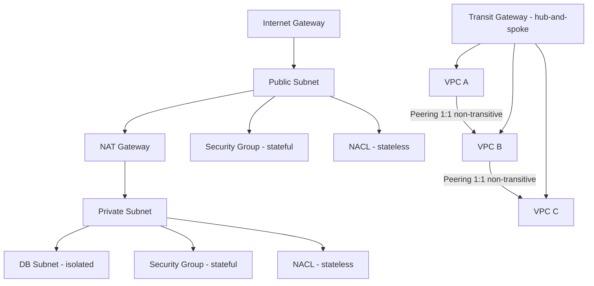

---

## 2. IAM

[Deep dive →](../12-interview-prep/quick-reference/aws-cloud/iam-roles-policies)

| Principal | Use When |
|-----------|----------|
| **User** | Human with long-term credentials (avoid for apps) |
| **Group** | Attach policies to multiple users; groups can't be nested |
| **Role** | EC2/Lambda/cross-account access; temporary credentials via STS |
| **Policy** | JSON document — identity-based or resource-based |

**IAM Evaluation Order (memorize this):**

```
1. Explicit DENY  →  always wins
2. SCP (Org level)
3. Permission Boundary
4. Identity-based Policy
5. Resource-based Policy
6. Session Policy
```

| Policy Type | Attached To | Cross-account? |
|-------------|-------------|----------------|
| **Identity-based** | User/Group/Role | No (need resource-based too) |
| **Resource-based** | S3, SQS, KMS, etc. | Yes (inline in resource) |
| **Trust Policy** | Role — WHO can assume it | Yes |
| **Permission Boundary** | User/Role — max permissions cap | No |
| **SCP** | OU/Account — org-wide guardrails | N/A |

**Key trap:** Principal needs BOTH identity-based AND resource-based policy for **cross-account** access.

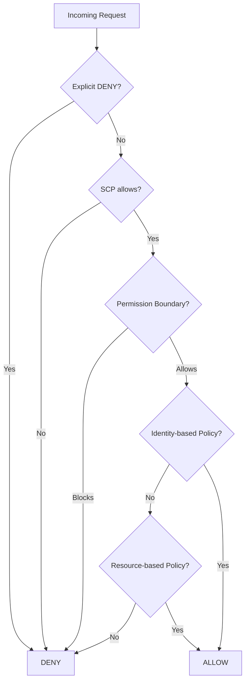

---

## 3. Route 53

[Deep dive →](../12-interview-prep/quick-reference/aws-cloud/route53-dns)

| Routing Policy | Use When |
|----------------|----------|
| **Simple** | Single resource, no health checks |
| **Weighted** | A/B testing, canary deploy — split % |
| **Latency** | Route to lowest-latency region |
| **Failover** | Active/passive HA — primary + standby |
| **Geolocation** | Route by user's country/continent |
| **Geoproximity** | Route by distance + bias (Traffic Flow required) |
| **Multivalue** | Up to 8 healthy records returned (not a load balancer) |
| **IP-based** | Route by CIDR block (newest policy) |

| Record Type | Key Fact |
|-------------|----------|
| **Alias** | AWS-native; points to AWS resources (ELB, CF, S3); **free queries**; works at zone apex |
| **CNAME** | Hostname → hostname; **cannot use at zone apex** (e.g., example.com) |

**Health checks:** HTTP/HTTPS/TCP — trigger failover; can monitor CloudWatch alarms. Route 53 is **global** (not regional).

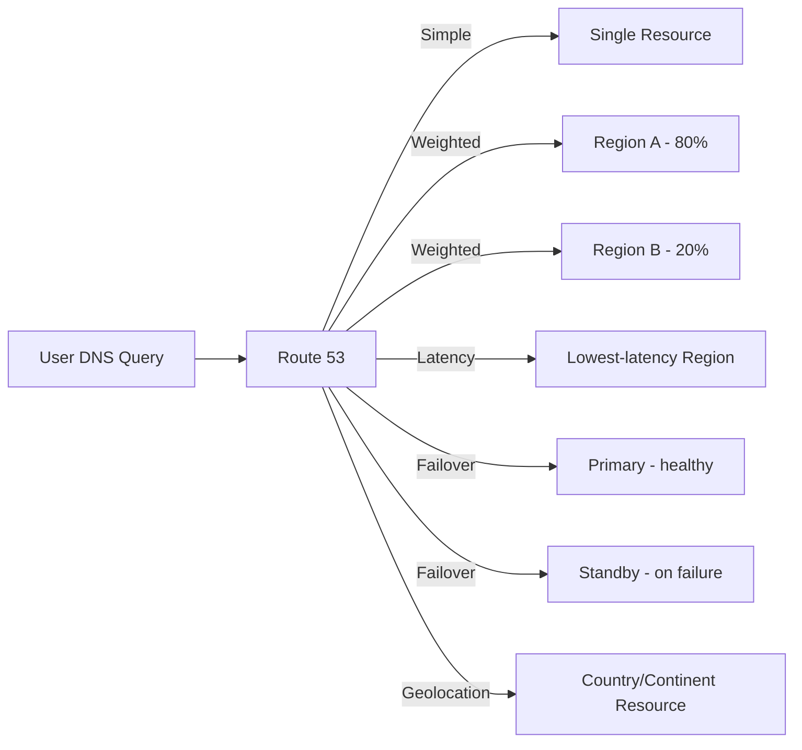

---

## 4. EC2 & Auto Scaling

[EC2 deep dive →](../12-interview-prep/quick-reference/aws-cloud/ec2-instances) | [Auto Scaling deep dive →](../12-interview-prep/quick-reference/aws-cloud/auto-scaling)

**Instance Families (one-liner each):**

| Family | Optimized For | Example Use |
|--------|---------------|-------------|
| **C** (Compute) | vCPU-heavy | Video encoding, HPC, gaming |
| **R** (Memory) | RAM-heavy | In-memory DB, caches, big data |
| **I** (Storage) | NVMe SSD IOPS | OLTP DB, NoSQL, data warehousing |
| **M** (General) | Balanced CPU/RAM | App servers, mid-size DBs |
| **T** (Burstable) | Baseline + burst credits | Dev/test, low-traffic web |
| **P/G** (GPU) | CUDA workloads | ML training, rendering |

**Purchase Options:**

| Option | Discount | Commitment | Best For |
|--------|----------|------------|----------|
| **On-Demand** | 0% | None | Unpredictable, short-term |
| **1yr Reserved** | **~40%** | 1 year | Steady-state baseline |
| **3yr Reserved** | **~60%** | 3 years | Long-running predictable |
| **Savings Plans** | up to 66% | 1-3yr, flexible instance | Flexible RI alternative |
| **Spot** | **up to 90%** | None (interruptible) | Stateless, fault-tolerant workloads |
| **Dedicated Host** | Higher cost | On-demand or 1-3yr | Licensing compliance (BYOL) |

**Spot:** **2-minute termination warning** via instance metadata.

**Placement Groups:**

| Type | Topology | Use Case | Tradeoff |
|------|----------|----------|----------|
| **Cluster** | Same rack, same AZ | Low-latency HPC, ML | Single point of failure |
| **Spread** | Different hardware, multi-AZ | Critical instances | Max **7 instances per AZ** |
| **Partition** | Racks isolated per partition | Kafka, HDFS, Cassandra | Up to 7 partitions/AZ |

**Auto Scaling policies:** Simple (fixed step) → Step (scaled steps) → Target Tracking (maintain metric, e.g., 60% CPU) → Scheduled.

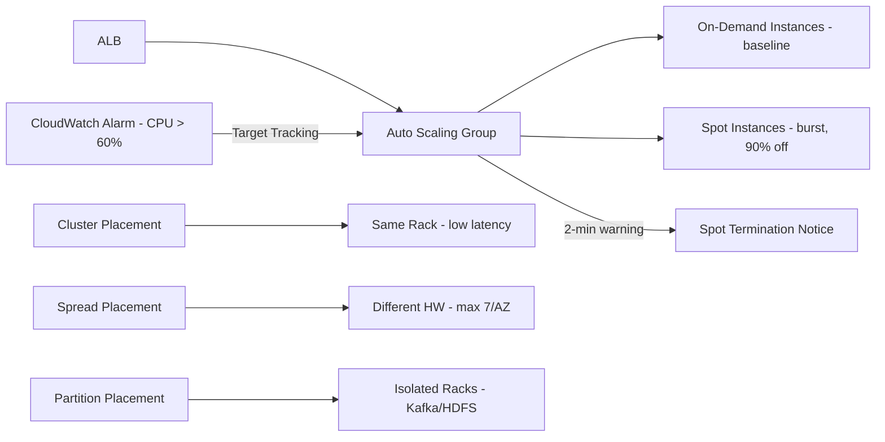

---

## 5. Containers: ECS vs EKS vs Fargate

[Deep dive →](../12-interview-prep/quick-reference/aws-cloud/ecs-eks-fargate)

| | ECS | EKS | Fargate |
|-|-----|-----|---------|
| **Orchestrator** | AWS proprietary | Kubernetes | N/A (launch type) |
| **Control plane** | AWS managed | AWS managed | N/A |
| **Data plane** | EC2 or Fargate | EC2 or Fargate | Serverless containers |
| **Complexity** | Low | High | Very low |
| **Kubernetes API** | No | Yes | No |
| **Cost** | Pay for EC2 | **+$0.10/hr per cluster** | Pay per vCPU/mem/sec |
| **Best for** | Simple containers, AWS-native | Portability, K8s expertise | No cluster mgmt |

**Key IAM roles in ECS:**
- **Task Role** — what the running container can DO (access S3, DynamoDB)
- **Execution Role** — what ECS agent can do (pull image from ECR, write logs)

**Fargate Spot:** ~70% cheaper; can be interrupted — use for batch/background jobs.

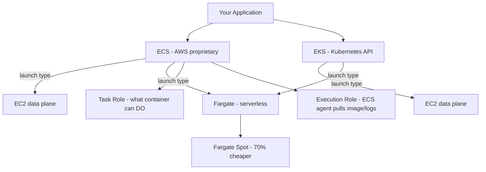

---

## 6. Lambda & API Gateway

[Lambda deep dive →](../12-interview-prep/quick-reference/aws-cloud/lambda-serverless) | [API Gateway deep dive →](../12-interview-prep/quick-reference/aws-cloud/api-gateway)

**Lambda Hard Limits:**

| Limit | Value |
|-------|-------|
| **Max execution time** | **15 minutes** |
| **Default concurrency** | **1,000 per region** (soft, can increase) |
| **Max memory** | **10 GB** |
| **Ephemeral /tmp storage** | **512 MB** (up to 10 GB with config) |
| **Deployment package** | 50 MB zipped, 250 MB unzipped |
| **Max env var size** | 4 KB total |

**Cold start mitigation:**
- Enable **Provisioned Concurrency** (pre-warmed instances, costs money)
- Increase **memory** (more CPU → faster init)
- Minimize **package size** — fewer imports
- Use **Lambda SnapStart** (Java — snapshot + restore)
- Keep functions **warm** via scheduled ping (workaround only)

**API Gateway types:**

| Type | Price | Use When |
|------|-------|----------|
| **REST API** | **$3.50/million** | Full features — caching, request validation, usage plans |
| **HTTP API** | **$1.00/million** | Lower latency, simpler use cases, JWT auth |
| **WebSocket API** | $1.00/million + connection fee | Real-time bidirectional (chat, gaming) |

**Lambda authorizer:** Cached — **stale permissions possible** for up to TTL (default 300s).

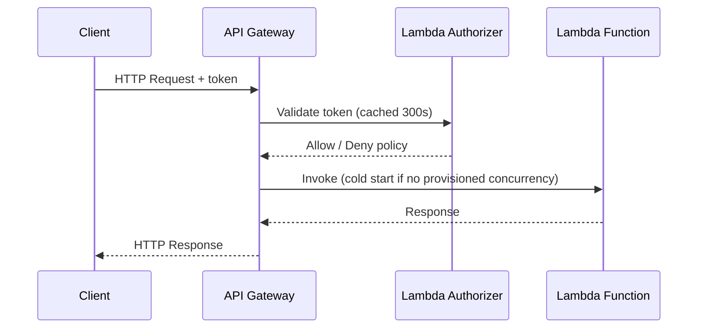

---

## 7. S3

[Deep dive →](../12-interview-prep/quick-reference/aws-cloud/s3-tps-limits)

**TPS Limits — memorize these:**

| Operation | Limit | Fix if exceeded |
|-----------|-------|-----------------|
| **PUT/COPY/DELETE** | **3,500 req/s per prefix** | Add hash prefix to key names |
| **GET/HEAD** | **5,500 req/s per prefix** | Distribute across prefixes |

**Storage Classes:**

| Class | Retrieval | Min Duration | Use When |
|-------|-----------|--------------|----------|
| **Standard** | Instant | None | Frequent access |
| **Standard-IA** | Instant | 30 days | Infrequent, but fast retrieval |
| **One Zone-IA** | Instant | 30 days | Non-critical, infrequent; **one AZ only** |
| **Intelligent-Tiering** | Instant/minutes/hours | None | Unknown or changing access patterns |
| **Glacier Instant** | Milliseconds | 90 days | Archive with instant retrieval |
| **Glacier Flexible** | **Minutes–12 hours** | 90 days | Archiving, flexible retrieval |
| **Glacier Deep Archive** | **12–48 hours** | 180 days | Compliance, long-term retention |

**Key features:**
- **Versioning** — protects against accidental delete; once enabled, can only be suspended
- **MFA Delete** — requires MFA to delete versions or disable versioning
- **CRR (Cross-Region Replication)** — async replication; requires versioning on both buckets
- **SRR (Same-Region Replication)** — aggregate logs, maintain copies
- **Lifecycle rules** — auto transition or expire objects by prefix/tag
- **Object Lock** — WORM (Write Once Read Many); Governance vs Compliance mode

**Presigned URLs:** Temporary access using creator's credentials; max **7 days**.

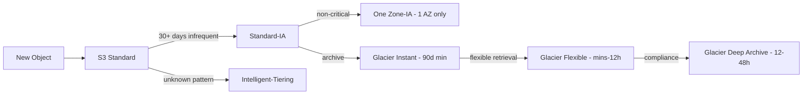

---

## 8. CloudFront

[Deep dive →](../12-interview-prep/quick-reference/aws-cloud/cloudfront-cdn)

**Request path:**
```
User → Edge Location → Regional Edge Cache → Origin (S3 / ALB / Custom)
```

**Key decision points:**

| Scenario | Use |
|----------|-----|
| S3 origin (new) | **OAC** (Origin Access Control) — not OAI |
| S3 origin (legacy) | OAI (Origin Access Identity) — being deprecated |
| Dynamic content | Use **Cache-Control: no-cache** or vary headers |
| HTTPS cert for CloudFront | **Must be in us-east-1** (N. Virginia) |
| Custom headers to origin | Viewer request → origin request function |

**Edge compute comparison:**

| | Lambda@Edge | CloudFront Functions |
|-|-------------|----------------------|
| **Triggers** | 4 (viewer req/res, origin req/res) | 2 (viewer req/res only) |
| **Max exec time** | 5s (viewer) / 30s (origin) | **1ms** |
| **Cost** | Higher | **~10x cheaper** |
| **Node.js** | Yes | Subset only |
| **Use for** | Auth, complex transforms, A/B | URL rewrite, header manipulation |

**Cache invalidation:** `/*` invalidates all — first 1,000 paths/month free, then $0.005/path.

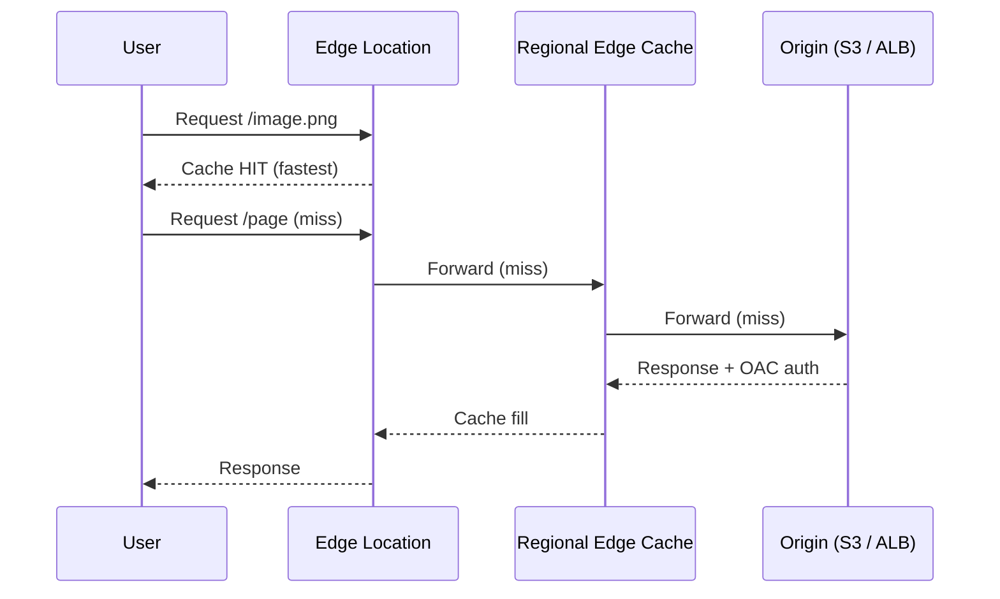

---

## 9. RDS & Aurora

[Deep dive →](../12-interview-prep/quick-reference/aws-cloud/rds-databases)

**Multi-AZ vs Read Replicas — CRITICAL:**

| | **Multi-AZ** | **Read Replicas** |
|-|--------------|-------------------|
| **Purpose** | High availability / failover | Read scaling |
| **Replication** | **Synchronous** | **Asynchronous** |
| **Readable?** | **No** (standby not accessible) | **Yes** |
| **Failover** | **Auto ~1-2 min** | Manual promote |
| **Cross-region?** | No (same region, diff AZ) | Yes |
| **Use for** | HA, maintenance windows | Offload reads, analytics |

**Aurora vs RDS:**

| | RDS | Aurora |
|-|-----|--------|
| **Storage replication** | 1 primary | **6-way across 3 AZs** |
| **Read replicas** | Up to 5 | Up to **15** |
| **Failover** | 60-120s | ~30s |
| **Storage** | Up to 64 TB | Up to **128 TB** (auto-scales) |
| **Cost** | Lower | ~20% higher |

**RDS Proxy:** Connection pooling between Lambda and RDS — **essential for Lambda** to prevent connection storms. Reduces connections by **~87%**.

**Aurora Serverless v2:** Auto-scales in fine-grained increments; **not zero-to-one** (v1 does cold start).

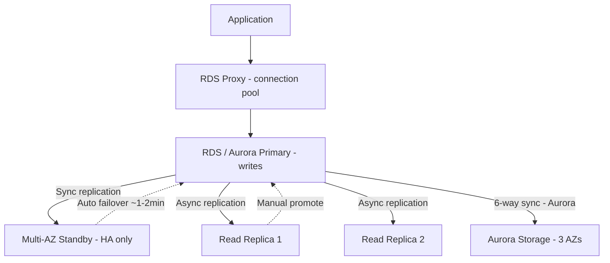

---

## 10. DynamoDB

[Deep dive →](../12-interview-prep/quick-reference/aws-cloud/dynamodb-nosql)

**Partition key rules:**
- **High cardinality** — spread data across partitions
- **Avoid hot partitions** — never use status, boolean, low-cardinality field as PK alone
- **Write sharding** — append random suffix (0-N) to distribute writes

| | **GSI** | **LSI** |
|-|---------|---------|
| **Partition Key** | Different from table PK | Same as table PK |
| **Sort Key** | Optional, different | Different from table SK |
| **Consistency** | Eventually consistent only | Strongly or eventually consistent |
| **Created** | **Any time** | **At table creation only** |
| **Item limit** | Own capacity | Shares table capacity |

**Key numbers:**
- Max item size: **400 KB**
- Transactions: up to **25 items or 4 MB** per transaction
- Max table size: unlimited
- On-demand: scales instantly; **2x previous peak** capacity immediately
- **DynamoDB Streams** → trigger Lambda for change data capture

**Capacity modes:**
- **On-demand** — unpredictable traffic, pay-per-request
- **Provisioned + auto-scaling** — predictable traffic, cheaper at scale

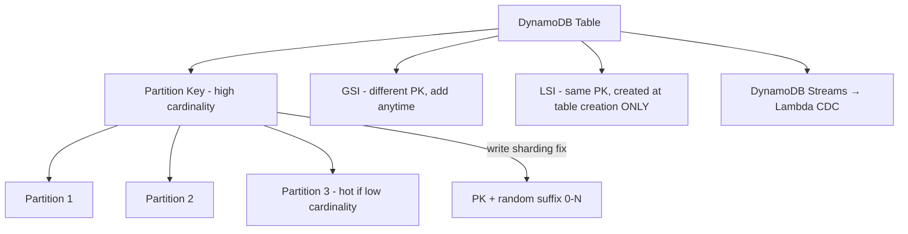

---

## 11. ElastiCache

[Deep dive →](../12-interview-prep/quick-reference/aws-cloud/elasticache-redis)

**Redis vs Memcached:**

| | **Redis** | **Memcached** |
|-|-----------|---------------|
| **Persistence** | Yes (RDB + AOF) | No |
| **Replication** | Yes (primary + replicas) | No |
| **Data structures** | Strings, hashes, lists, sets, sorted sets, streams | Strings/blobs only |
| **Pub/Sub** | Yes | No |
| **Threading** | Single-threaded | Multithreaded |
| **Cluster mode** | Yes (sharding) | Yes |
| **Use when** | Leaderboards, sessions, pub/sub, queues | Simple KV cache, need multi-thread |

**Cache patterns:**

| Pattern | Flow | Consistency | Write perf |
|---------|------|-------------|------------|
| **Cache-aside** | Read: check cache → miss → DB → populate | Eventual | Normal |
| **Write-through** | Write: DB + cache simultaneously | Strong | Slower (2 writes) |
| **Write-behind** | Write: cache → async to DB | Eventual | Fast |
| **Read-through** | Cache handles DB fallback transparently | Eventual | Normal |

**Thundering herd fix:**
1. **Mutex lock** — Redis `SETNX` lock key; only one request rebuilds cache
2. **Probabilistic early expiration** — start refreshing before TTL expires
3. **Cache warming** — pre-populate before traffic hits

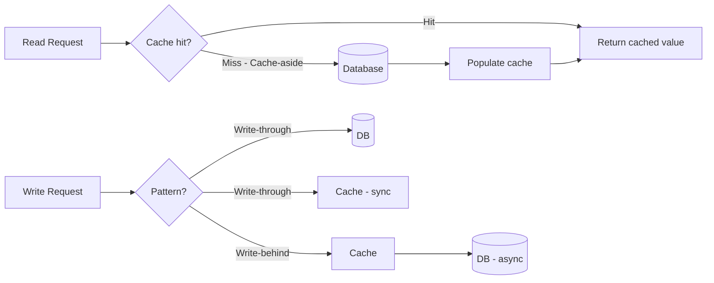

---

## 12. SQS / SNS / EventBridge

[Deep dive →](../12-interview-prep/quick-reference/aws-cloud/sqs-sns-eventbridge)

| | **SQS** | **SNS** | **EventBridge** |
|-|---------|---------|-----------------|
| **Pattern** | Queue / pull | Push / pub-sub | Event bus + routing rules |
| **Consumers** | Single (competing consumers) | Many (fan-out) | Many (with filter rules) |
| **Ordering** | FIFO option | No ordering | No ordering |
| **Replay** | No | No | Archive + replay |
| **Persistence** | Up to **14 days** | No | Archive up to 1 year |
| **Filtering** | No | Subscription filter | Rich content-based rules |
| **3rd party sources** | No | No | Yes (Salesforce, GitHub, etc.) |

**SQS key numbers:**

| Limit | Value |
|-------|-------|
| **Max message size** | **256 KB** |
| **Retention** | 4 days default, **14 days max** |
| **Visibility timeout** | 30s default, **12 hours max** |
| **Long polling** | Up to 20s — reduces empty responses |
| **Standard TPS** | **Unlimited** |
| **FIFO TPS** | **300 msg/s** (3,000 with batching) |

**Dead Letter Queue (DLQ):** Failed messages after maxReceiveCount; separate queue for inspection.

**SQS + Lambda:** Lambda polls SQS; batch size 1-10,000; partial batch failure handling via `reportBatchItemFailures`.

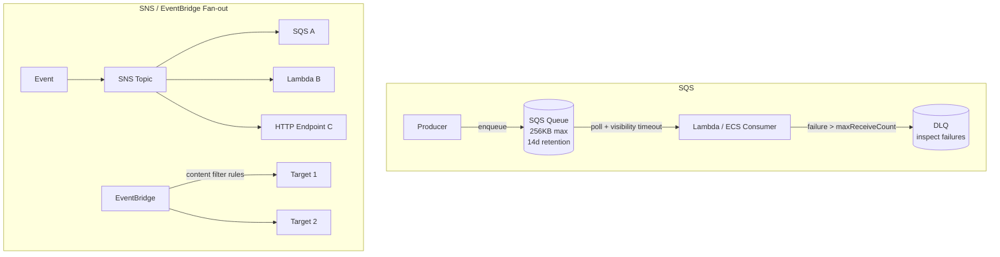

---

## 13. Kinesis

[Deep dive →](../12-interview-prep/quick-reference/aws-cloud/kinesis-streaming)

**Shard math (memorize):**

| Direction | Throughput per Shard |
|-----------|----------------------|
| **Write (ingest)** | **1 MB/s or 1,000 records/s** |
| **Read (consume)** | **2 MB/s** |

Formula: `Shards needed = max(write_MB/1, read_MB/2)`

**Kinesis product comparison:**

| Product | Use When |
|---------|----------|
| **Data Streams** | Custom consumers, replay, real-time processing, ordered data |
| **Firehose** | Managed delivery to S3/Redshift/OpenSearch — no code needed |
| **Data Analytics** | Real-time SQL on streaming data (Flink) |
| **Video Streams** | Ingest + playback video for ML/playback |

**Kinesis vs SQS:**

| | Kinesis | SQS |
|-|---------|-----|
| **Ordering** | Per shard, guaranteed | FIFO queue only |
| **Replay** | Yes (up to 7 days) | No |
| **Consumers** | Multiple (fan-out) | Single consumer group |
| **Throughput** | Shard-based, scalable | Unlimited standard |
| **Use for** | Streaming, analytics, ordered | Decoupling, work queues |

**Enhanced Fan-Out:** Each consumer gets dedicated 2 MB/s per shard (vs shared 2 MB/s normally).

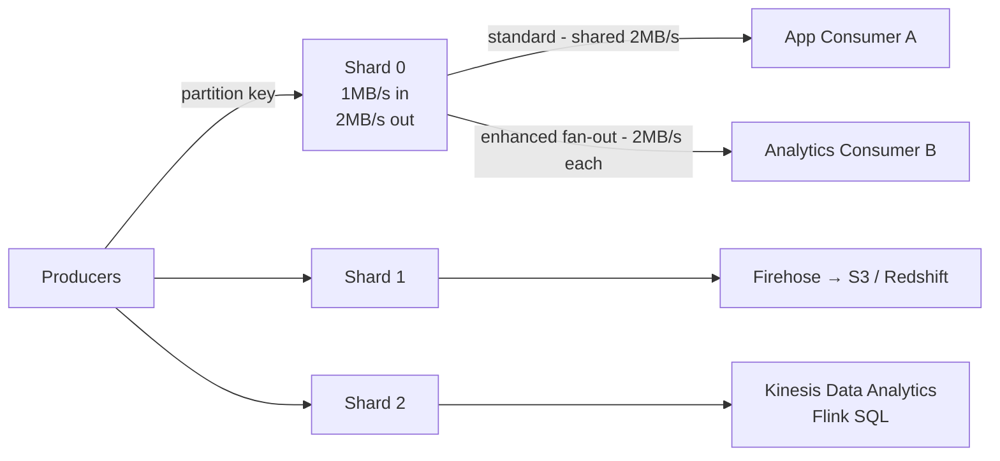

---

## 14. CloudWatch

[Deep dive →](../12-interview-prep/quick-reference/aws-cloud/cloudwatch-monitoring)

| Feature | Key Facts |
|---------|-----------|
| **Standard metrics** | **1-minute** resolution; free for most AWS services |
| **High-resolution metrics** | **1-second** resolution; costs more; custom metrics only |
| **Custom metrics** | PutMetricData API; standard ($0.30/metric/month) or high-res |
| **Logs retention** | Default: never expire — set retention to save cost |
| **Metric Math** | Combine metrics mathematically (e.g., error rate = errors/requests) |

**Alarm states:** `OK` → `ALARM` → `INSUFFICIENT_DATA`

**Alarm actions:** SNS notification, Auto Scaling, EC2 action (reboot/terminate/recover), Systems Manager.

**Composite alarms:** AND/OR logic across multiple alarms — reduces alarm noise.

**Logs Insights query syntax:**
```
fields @timestamp, @message
| filter @message like /ERROR/
| stats count(*) by bin(5m)
| sort @timestamp desc
| limit 20
```

**CloudWatch Agent:** Collect OS-level metrics (memory, disk) + custom app logs — not available by default.

**Container Insights:** ECS/EKS cluster, service, task, pod metrics — enables `ContainerInsights` in cluster settings.

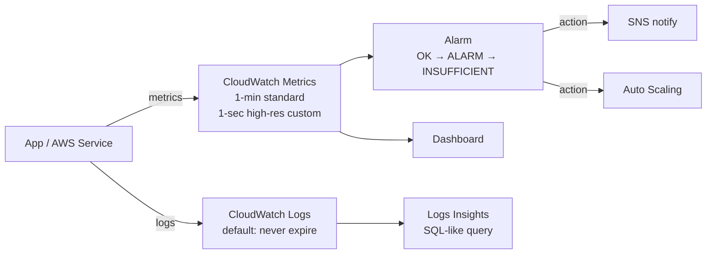

---

## 15. Disaster Recovery

[Deep dive →](../12-interview-prep/quick-reference/aws-cloud/disaster-recovery)

| Strategy | RPO | RTO | Cost | How |
|----------|-----|-----|------|-----|
| **Backup & Restore** | Hours | **~24 hours** | $ | S3 backups; restore from scratch |
| **Pilot Light** | Minutes | **~1 hour** | $$ | Core DB replicating; scale up on failover |
| **Warm Standby** | Seconds | **Minutes** | $$$ | Scaled-down running copy; scale up on failover |
| **Active-Active** | **~0** | **~0** | $$$$ | Full traffic in both regions; Route 53 weighted |

**Key services for DR:**
- **AWS Backup** — centralized backup across services
- **RDS automated backups** — 0-35 day retention, point-in-time restore
- **DynamoDB PITR** — point-in-time recovery up to 35 days
- **Aurora Global Database** — < 1s replication lag, < 1 min failover
- **Route 53 failover** — health check + DNS TTL determines switch speed

**RPO** = how much data you can lose. **RTO** = how long system can be down. Lower = more expensive.

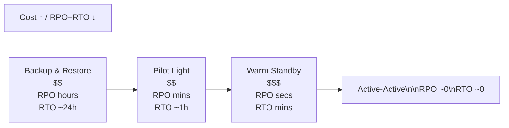

---

## 16. Top 10 Interview Traps

| # | Trap | Remember |
|---|------|---------|
| **1** | Multi-AZ = HA, Read Replicas = performance | They are NOT interchangeable |
| **2** | Security Groups = stateful, NACLs = stateless | NACLs need both inbound AND outbound rules |
| **3** | VPC Peering is non-transitive | 3+ VPCs → use Transit Gateway |
| **4** | ACM cert for CloudFront must be in **us-east-1** | Even if your resources are elsewhere |
| **5** | Lambda authorizer caches responses (default 300s) | Stale permissions window exists |
| **6** | SQS FIFO = **300 TPS** hard limit | Not for high-throughput scenarios |
| **7** | DynamoDB LSI **must be created at table creation** | GSI can be added later |
| **8** | RDS Proxy essential for Lambda | Lambda → RDS without proxy = connection storm |
| **9** | Spot instances get **2-minute termination warning** | Must handle graceful shutdown |
| **10** | Route 53 is **global** (not regional) | Health checks can monitor any endpoint |

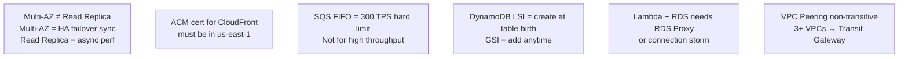

---

---

## 17. Question-Bank: Cloud & DevOps Deep Dives

### Kubernetes Architecture
**Kubernetes** — container orchestration, control plane components, and workload objects

| Control plane component | Role | Scale |
|------------------------|------|-------|
| **kube-apiserver** | Single entry point; validates + persists to etcd | ~10K rps in large clusters |
| **etcd** | Cluster state store; Raft consensus | 3 or 5 nodes for HA; <100MB state |
| **kube-scheduler** | Scores nodes, binds Pods | ~1ms per Pod scheduling |
| **kube-controller-manager** | 30+ reconcile loops (Deployment, ReplicaSet, Node) | One process per cluster |

- **Key number**: Pod → ReplicaSet (N replicas) → Deployment (rolling updates + rollback); Deployment keeps **10 revisions** by default for rollback
- **Decision**: Use Deployment for stateless apps (99% of cases); StatefulSet for DBs/Kafka (stable network identity + ordered rolling updates); DaemonSet for node-level agents
- **Trap**: Deleting a Pod directly — it's recreated immediately by the ReplicaSet; to remove a Pod permanently, scale the Deployment to 0 or delete the Deployment
- → [Full article](../12-interview-prep/question-bank/cloud-devops/kubernetes-architecture)

---

### CI/CD Pipeline Design
**CI/CD pipelines** — automated build, test, and deploy for fast, safe delivery

| Stage | Target time | Gate |
|-------|------------|------|
| Build (compile + Docker) | <2 min | Fails on compile error |
| Unit tests | <2 min | 0 failures |
| Static analysis + secret scan | <1 min | No high CVEs, no secrets |
| Integration tests (Docker Compose) | <5 min | 0 failures |
| Container CVE scan (Trivy) | <1 min | Fail on Critical/High CVEs |
| Publish to registry | <2 min | Immutable tag (`git-sha`) |

- **Key number**: Total pipeline target = **<10 min** feedback loop; Continuous Deployment requires >80% branch coverage and automated canary analysis
- **Decision**: CD (delivery, manual gate) for most teams; CD (deployment, fully automated) only with exceptional test coverage + feature flags + automated rollback
- **Trap**: Mutable Docker tags (`:latest`) in production — if the image is overwritten, rollback redeploys a different image than intended; always use immutable `git-sha` tags
- → [Full article](../12-interview-prep/question-bank/cloud-devops/cicd-pipeline-design)

---

### AWS Core Services
**AWS compute options** — EC2, Lambda, ECS, EKS — when to use each

| Service | Cold start | Best for | Cost model |
|---------|-----------|---------|-----------|
| **EC2** | 30–60s | Full OS control, GPU, long-running | Per hour (RI saves 40–60%) |
| **Lambda** | 100ms–3s | Event-driven, <15 min, webhooks | Per invocation (1M free/mo) |
| **ECS Fargate** | ~30s | Docker without K8s complexity | Per vCPU+memory-second |
| **EKS** | ~30s | Full K8s, custom operators, large teams | Control plane $0.10/hr + nodes |

- **Key number**: Lambda cold start: Node.js/Python = **100–500ms**; Java = **1–3s**; use Provisioned Concurrency to pre-warm for latency-sensitive endpoints
- **Decision**: Lambda for async/event-driven ≤15 min; ECS Fargate for containerized services without K8s complexity; EKS for large teams with existing K8s expertise
- **Trap**: Lambda + RDS without RDS Proxy — each Lambda cold start creates a new DB connection; 100 concurrent Lambdas = 100 new connections; RDS Proxy is mandatory with Lambda + RDS
- → [Full article](../12-interview-prep/question-bank/cloud-devops/aws-core-services)

---

### Infrastructure as Code
**IaC** — managing infrastructure via code in version control (Terraform, CDK, CloudFormation)

| Tool | Language | Cloud | State | Best for |
|------|---------|-------|-------|---------|
| **Terraform** | HCL | Multi-cloud | S3 + DynamoDB lock | **Most widely used** (85% of IaC job postings) |
| **CloudFormation** | YAML/JSON | AWS only | AWS-managed | AWS-native, no state file to manage |
| **CDK** | TypeScript/Python | AWS only | CloudFormation | AWS shops wanting programming language |
| **Pulumi** | TS/Python/Go | Multi-cloud | Pulumi Cloud | Complex logic (loops, conditions) |

- **Key number**: Terraform remote state requires S3 bucket + DynamoDB table for state locking to prevent concurrent apply conflicts; Terraform manages **3,000+** providers
- **Decision**: Terraform for multi-cloud or greenfield; CloudFormation/CDK for AWS-only where deep AWS integration (drift detection, stack events) is valuable
- **Trap**: Storing Terraform state locally — team members overwrite each other's state; always use remote backend (S3 + DynamoDB lock) from day 1
- → [Full article](../12-interview-prep/question-bank/cloud-devops/infrastructure-as-code)

---

### Blue-Green & Canary Deployments
**Deployment strategies** — zero-downtime releases with controlled blast radius

| Strategy | Traffic shift | Rollback speed | Cost | Use when |
|----------|-------------|---------------|------|---------|
| **Blue-Green** | Instant (all-or-nothing) | <1s (LB rule) | 2× capacity | Infrastructure changes, dependency upgrades |
| **Canary** | Gradual (1% → 10% → 100%) | Re-route traffic | Normal | High-risk features, payment flows |
| **Rolling** | Pod-by-pod | Minutes (re-deploy) | Normal | Low-risk updates, stateless services |

- **Key number**: Canary bake period = **10–30 min** before proceeding; Blue-Green rollback = <1s (load balancer listener rule change); DNS rollback = ~60s (TTL-dependent)
- **Decision**: Blue-Green when you need instant atomic switch and have 2× capacity; Canary when limiting blast radius is more important than speed; Rolling for routine updates
- **Trap**: Blue-Green with database schema changes — if new code uses a new schema and old code doesn't, you can't roll back without a DB migration rollback; database changes must be backwards-compatible before any code swap
- → [Full article](../12-interview-prep/question-bank/cloud-devops/blue-green-canary-deployments)

---

### Container Orchestration
**Containers vs VMs** — Docker internals, layer caching, and multi-stage builds

| | VM | Container |
|-|-------|---------|
| **Startup** | 30–60s | **100–500ms** |
| **Overhead** | 256MB–1GB per VM | Few MB |
| **Isolation** | Strong (separate kernel) | Namespace + cgroups |
| **Portability** | OS-dependent | Runs on any Linux host |

- **Key number**: Containers start **60–100× faster** than VMs; multi-stage Docker builds reduce final image from 500MB to **~50MB** (no dev tools in final stage)
- **Decision**: Layer order matters — rarely-changing instructions first (OS deps, npm install), frequently-changing last (COPY . .); any change invalidates all downstream layers
- **Trap**: `COPY . .` at the top of Dockerfile — every code change invalidates all cache layers including `npm install`; reorder: copy `package.json` first, `npm install`, then `COPY . .`
- → [Full article](../12-interview-prep/question-bank/cloud-devops/container-orchestration)

---

### Cloud Cost Optimization
**Cloud cost optimization** — EC2 pricing models and waste elimination

| Pricing model | Discount vs on-demand | Commitment | Use for |
|--------------|----------------------|-----------|--------|
| **On-Demand** | 0% | None | Unpredictable, testing |
| **Reserved (1yr)** | **40%** | 1 year | Stable 24/7 baseline |
| **Reserved (3yr)** | **60%** | 3 years | Long-term stable workloads |
| **Savings Plans (Compute)** | **66%** | 1–3 year | Flexible (any instance family/region) |
| **Spot** | **70–90%** | None | Batch jobs, CI runners, ML training |

- **Key number**: Orphaned Elastic IPs = **$3.65/month each**; idle NAT Gateway = **$33/month** even at 0 traffic; unattached EBS = **$0.10/GB/month**
- **Decision**: Spot for stateless batch (CI, ML training, data processing); Reserved/Savings Plans for predictable 24/7 baseline; On-Demand for everything else
- **Trap**: Spot instances without graceful shutdown handling — 2-minute termination warning must be caught (EC2 metadata endpoint) to drain connections; without it, in-flight requests are dropped
- → [Full article](../12-interview-prep/question-bank/cloud-devops/cloud-cost-optimization)

---

*Last updated: 2026-03-27*
