> **📅 Spaced Repetition Schedule**
> Use this cheat sheet on a 4-interval cycle for maximum retention:
> - **Day 0** — Read it fully (20–30 min)
> - **Day 3** — Skim headers, cover answers, test yourself
> - **Day 10** — Quiz yourself on the "Trap" entries without looking
> - **Day 30** — Quick scan for gaps; revisit any you missed

---

# Caching & Redis Cheat Sheet

> Scan time: ~5 min. Every line is interview-relevant.

---

## 1. Where to Cache (Caching Layers)

| Layer | Tool | What to Cache | TTL | Miss penalty |
|-------|------|---------------|-----|-------------|
| **CDN edge** | CloudFront, Cloudflare | Static assets, public API responses | Hours–days | Origin fetch |
| **API Gateway** | AWS APIGW cache | GET responses (idempotent only) | Minutes | Lambda/backend call |
| **App in-memory** | Node.js Map, LRU-cache | Hot config, feature flags, lookup tables | Process lifetime | Restart/redeploy |
| **Distributed cache** | **Redis**, Memcached | Sessions, computed data, rate limits, leaderboards | Seconds–minutes | DB query |
| **DB query cache** | ~~MySQL query cache~~ (removed in 8.0) | N/A — **avoid** | N/A | — |

**Rule:** Cache as close to the user as possible. Each hop adds latency; each layer reduces load on the next.

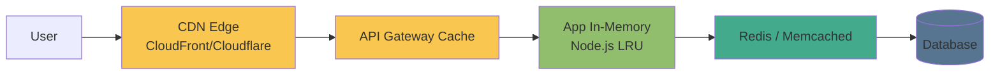

---

## 2. Cache Patterns

| Pattern | Read path | Write path | Consistency | When to use |
|---------|-----------|------------|-------------|-------------|
| **Cache-aside (Lazy)** | Check cache → miss → read DB → populate cache | App writes DB, **invalidates or updates cache manually** | Eventual | Most common general purpose |
| **Read-through** | Cache checks DB on miss automatically | App writes cache only | Consistent reads | When cache library supports it |
| **Write-through** | Read from cache | Write to cache **and** DB together (synchronous) | **Strong** | Write-once, read-many data |
| **Write-behind (Write-back)** | Read from cache | Write to cache, **async flush to DB** | Eventual | **Fast writes**, tolerate data loss risk |

**Cache-aside trap:** Between DB write and cache invalidation → **stale window**. Use short TTL or event-driven invalidation.

**Write-behind trap:** Cache crash before flush → **data loss**. Only use with durable cache (Redis AOF/RDB) or non-critical data.

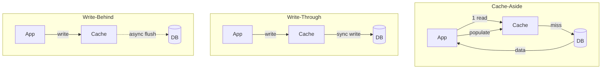

---

## 3. Cache Eviction Policies

| Policy | How | Best for |
|--------|-----|----------|
| **LRU** (Least Recently Used) | Evict item not accessed longest | General purpose — **default choice** |
| **LFU** (Least Frequently Used) | Evict item accessed fewest times | Repeated access patterns, ML feature stores |
| **TTL** (Time-to-live) | Evict after fixed time | News feeds, API responses, sessions |
| **FIFO** | Evict oldest inserted | Simple queues (rarely optimal for caches) |
| **Random** | Evict random key | Rarely optimal |

### Redis `maxmemory-policy` Options

```
allkeys-lru       # LRU across all keys — recommended for cache-only Redis
volatile-lru      # LRU only on keys with TTL set
allkeys-lfu       # LFU across all keys
volatile-ttl      # Evict key with shortest remaining TTL first
noeviction        # Return error when full — for queues/streams, NOT caches
```

**Set `maxmemory` explicitly** — otherwise Redis uses all available RAM until OOM.

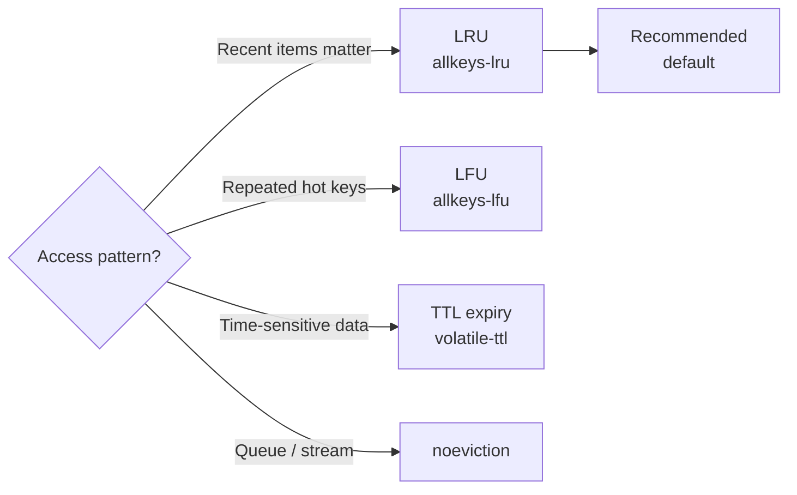

---

## 4. Cache Invalidation Strategies

| Strategy | How | Consistency | Complexity |
|----------|-----|-------------|-----------|
| **TTL expiry** | Key expires after N seconds | Eventual (stale for up to TTL) | Lowest |
| **Explicit delete** | App deletes cache key on write | Strong (with race condition risk) | Low |
| **Event-driven** | Write publishes event → subscriber invalidates cache | Near-strong | Medium |
| **Versioned keys** | `user:123:v5` → old versions auto-expire | Strong (by design) | Medium |
| **Write-through** | Cache always updated with DB write | **Strong** | High |

**Race condition in explicit delete:**
```
Thread A: reads DB (old value)
Thread B: writes DB + deletes cache key
Thread A: writes OLD value back to cache  ← stale data survives
```
Fix: **cache-aside with short TTL** as safety net, or use versioned keys.

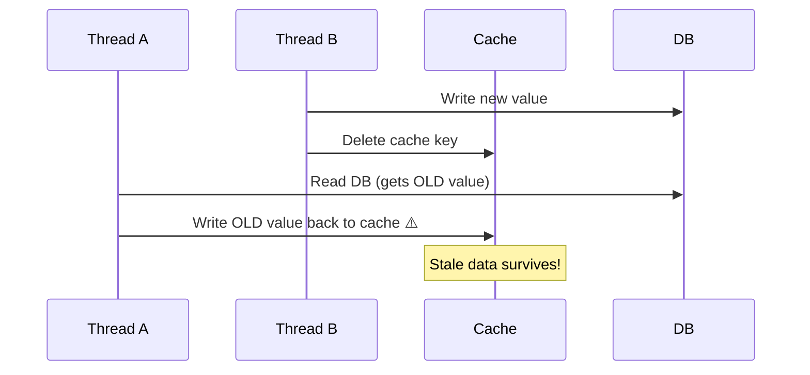

---

## 5. Thundering Herd (Cache Stampede)

**Problem:** Popular cache key expires → **N concurrent requests** all miss → all hammer DB simultaneously.

| Solution | How | Trade-off |
|----------|-----|-----------|
| **Mutex lock** | `SETNX lock:key` — only one request rebuilds, others wait/retry | Lock contention, retry logic needed |
| **Probabilistic early expiration (XFetch)** | Randomly refresh key before TTL expires | Slight over-caching, no lock needed |
| **Background refresh** | Async worker refreshes key before TTL | Serve stale briefly, no blocking |
| **Stale-while-revalidate** | Serve stale immediately, refresh in background | Always fast, brief stale window |

**Redis mutex pattern:**
```javascript
const lock = await redis.set('lock:key', '1', 'NX', 'EX', 10)
if (lock) {
  const data = await fetchFromDB()
  await redis.setex('key', 300, JSON.stringify(data))
  await redis.del('lock:key')
} else {
  // Wait briefly and read (may get stale or empty — handle both)
  await sleep(50)
  return redis.get('key')
}
```

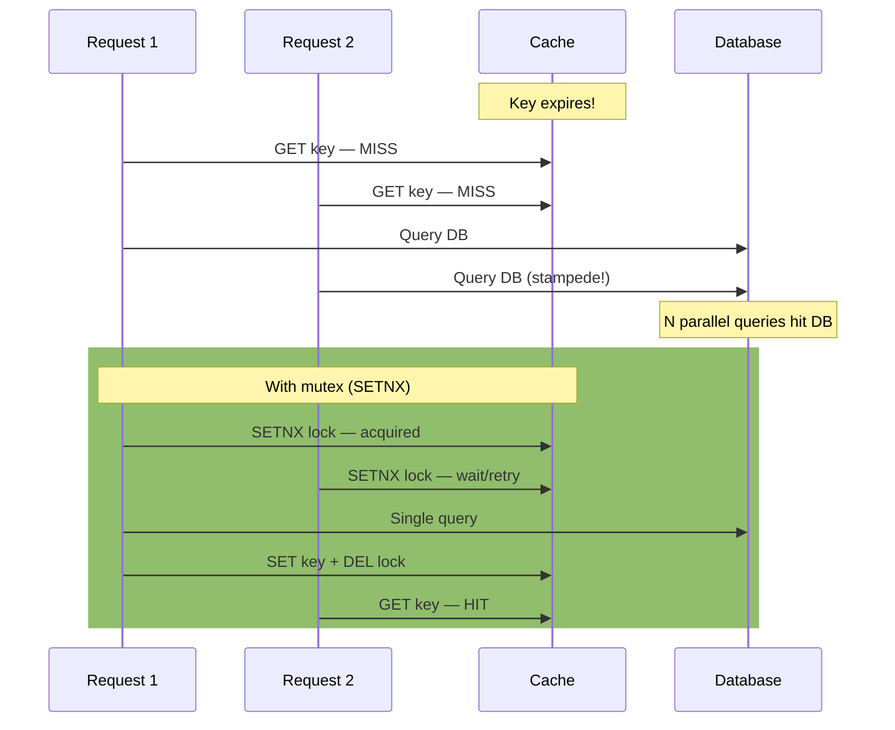

---

## 6. Redis Data Structures & Use Cases

| Structure | Use Case | Key Commands |
|-----------|----------|-------------|
| **String** | Cache value, counter, session token, distributed lock | `GET/SET/INCR/SETNX/SETEX` |
| **Hash** | User object, config map, shopping cart | `HGET/HSET/HMGET/HDEL` |
| **List** | Queue (FIFO/LIFO), activity feed, recent items | `LPUSH/RPUSH/RPOP/LRANGE` |
| **Set** | Unique members, tags, friend lists | `SADD/SMEMBERS/SISMEMBER/SINTERSTORE` |
| **Sorted Set** | **Leaderboard**, rate limiting, delayed jobs, priority queue | `ZADD/ZRANGE/ZRANGEBYSCORE/ZRANK` |
| **HyperLogLog** | Unique visitor count (**~0.81% error**, fixed **12 KB** memory) | `PFADD/PFCOUNT/PFMERGE` |
| **Pub/Sub** | Real-time notifications, chat (not durable — fire and forget) | `PUBLISH/SUBSCRIBE/PSUBSCRIBE` |
| **Stream** | Durable event log, consumer groups, Kafka-lite | `XADD/XREAD/XGROUP/XACK` |
| **Bitmap** | Feature flags, daily active users (1 bit/user) | `SETBIT/GETBIT/BITCOUNT/BITOP` |

**HyperLogLog vs Set for unique counts:** HLL uses **12 KB regardless of cardinality**. Set uses O(n). Use HLL when you don't need exact counts or the actual members.

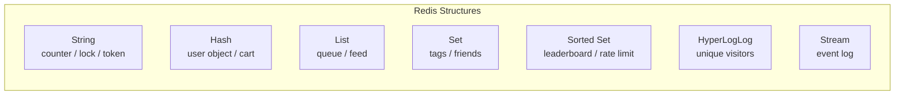

---

## 7. Redis Cluster Mode

| Feature | Standalone | Cluster Mode |
|---------|-----------|--------------|
| Shards | 1 | **1–500** |
| Replicas per shard | Up to 5 | Up to 5 per shard |
| Hash slots | N/A | **16,384** slots distributed across shards |
| Multi-key ops | All work | Must be on **same shard** |
| Max data | RAM of one node | RAM × shards |

**Hash tags for co-location:** `{user123}:session` and `{user123}:cart` → same shard because Redis hashes only `{user123}`.

**ElastiCache specifics:**
- Multi-AZ: auto-failover, replica promoted in **~30 seconds**
- Encryption at rest: **KMS**
- Encryption in transit: **TLS**
- Backup: automated snapshots to S3
- **Global Datastore**: cross-region replication (active-passive)

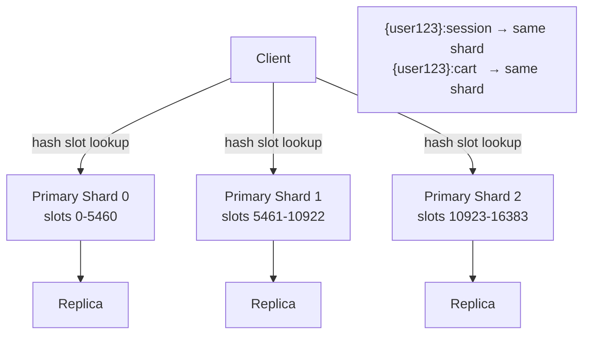

---

## 8. Rate Limiting Patterns

| Algorithm | How | Pros | Cons |
|-----------|-----|------|------|
| **Fixed window** | Count per minute/hour window | Simple | Burst at window boundary (2x rate possible) |
| **Sliding window** | Sorted set of timestamps | Accurate | More memory per user |
| **Token bucket** | Refill tokens at steady rate, consume per request | Allows burst up to bucket size | More complex |
| **Leaky bucket** | Fixed output rate regardless of input | Smooth traffic | Drops burst requests |

**Fixed window (simplest):**
```javascript
const key = `rate:${userId}:${Math.floor(Date.now() / 60000)}`
const count = await redis.incr(key)
if (count === 1) await redis.expire(key, 60)
if (count > 100) throw new RateLimitError()
```

**Sliding window (accurate):**
```javascript
const now = Date.now()
const window = 60 * 1000  // 1 minute
const key = `rate:${userId}`
await redis.zremrangebyscore(key, 0, now - window)  // remove old entries
const count = await redis.zcard(key)
if (count >= 100) throw new RateLimitError()
await redis.zadd(key, now, `${now}-${Math.random()}`)
await redis.expire(key, 60)
```

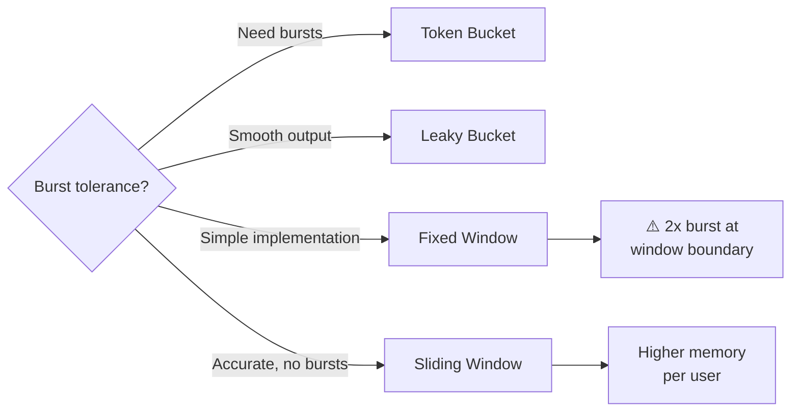

---

## 9. Session Storage Pattern

**Why Redis for sessions:**
- Stateless app servers → can route to any instance
- TTL auto-cleanup → no manual session pruning
- Sub-millisecond reads → no DB round-trip per request
- Scale independently of app tier

**Pattern:**
```
Browser cookie: session_id = "abc-uuid-xyz"
               ↓
Redis HGET session:abc-uuid-xyz
               ↓
Returns: {userId, roles, preferences, lastSeen}
```

**Key rules:**
- Key: `session:{uuid}` — never predictable/sequential
- TTL: **24h** typical, refresh on each request (`EXPIRE` reset)
- On logout: `DEL session:{uuid}` immediately
- Store only what's needed per-request — keep hash small

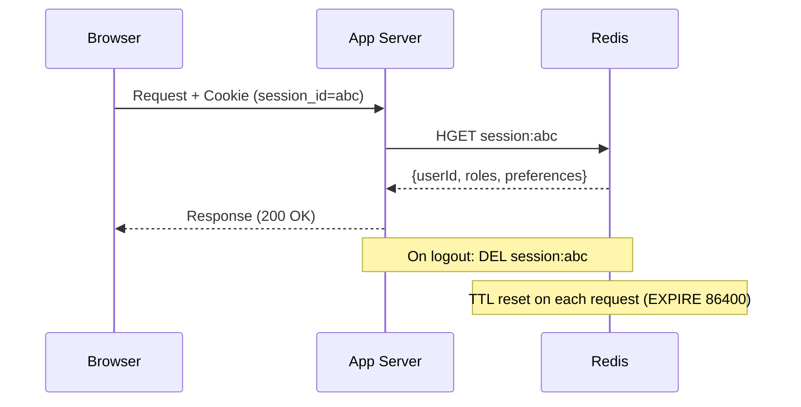

---

## 10. CDN Caching Quick Reference

### Cache-Control Headers

| Directive | Meaning |
|-----------|---------|
| `max-age=3600` | Browser caches for 3600s |
| `s-maxage=86400` | **CDN** caches for 86400s (overrides max-age for shared caches) |
| `no-store` | Never cache anywhere |
| `no-cache` | Cache but revalidate with origin before serving |
| `must-revalidate` | Use cached copy until expired, then must revalidate |
| `private` | Browser only — CDN must not cache (user-specific data) |
| `stale-while-revalidate=60` | Serve stale for 60s while revalidating in background |

### Conditional Requests

- **ETag**: server returns `ETag: "abc123"` → client sends `If-None-Match: "abc123"` → **304 Not Modified** if unchanged
- **Last-Modified**: `Last-Modified: Wed, 01 Jan 2025 00:00:00 GMT` → `If-Modified-Since` header

### Cache Busting

| Method | Example | When to use |
|--------|---------|-------------|
| Filename hash | `main.a1b2c3d4.js` | Static assets — **preferred** |
| Query string | `main.js?v=123` | Some CDNs ignore query strings — less reliable |
| Path versioning | `/v2/api/users` | API versioning |

**CloudFront invalidation:** `/images/*` costs money ($0.005/1000 paths after first 1000). Prefer filename versioning over invalidations.

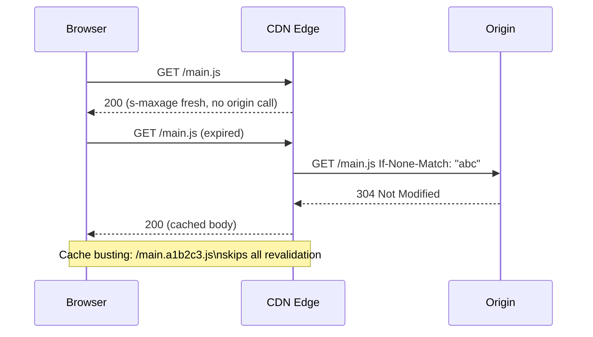

---

## 11. Common Caching Mistakes

| Mistake | Why it hurts | Fix |
|---------|-------------|-----|
| No TTL on cache keys | Memory grows unbounded, stale data forever | **Always set TTL** — even if long |
| Caching user-specific data without key isolation | User A sees User B's data | Include `userId` in cache key |
| Caching in CDN what should be dynamic | Stale personalized content served globally | Set `Cache-Control: private` or `no-store` |
| No fallback when cache is unavailable | Cache outage = full app outage | Circuit breaker: fall through to DB on cache error |
| No cache warming after deploy | Cold start → thundering herd | Pre-warm critical keys on startup |
| Invalidating too broadly (`FLUSHALL`) | Cache becomes useless, DB load spikes | Invalidate specific keys, not entire cache |
| Storing large objects in cache | Evicts many small objects, high memory pressure | Keep cache values small; cache IDs not full objects |
| Single Redis instance for everything | Sessions, rate limits, queues mixed → noisy neighbor | Separate Redis instances by workload |

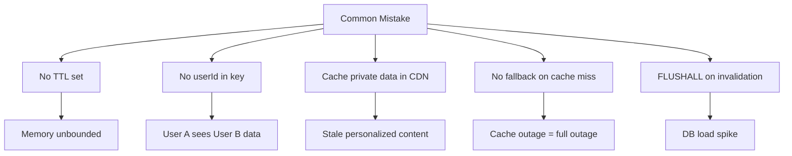

---

## 12. Memcached vs Redis

| Feature | Memcached | Redis |
|---------|-----------|-------|
| Data structures | String only | **10+ types** |
| Persistence | None | RDB snapshots + AOF |
| Replication | None | Primary-replica |
| Clustering | Yes (client-side) | Yes (native) |
| Pub/Sub | No | Yes |
| Lua scripting | No | Yes |
| **When to use** | Pure simple cache, multi-threaded CPU utilization | **Everything else** — sessions, queues, leaderboards |

**Verdict:** Default to Redis. Only pick Memcached if you specifically need multi-threaded cache with no advanced features.

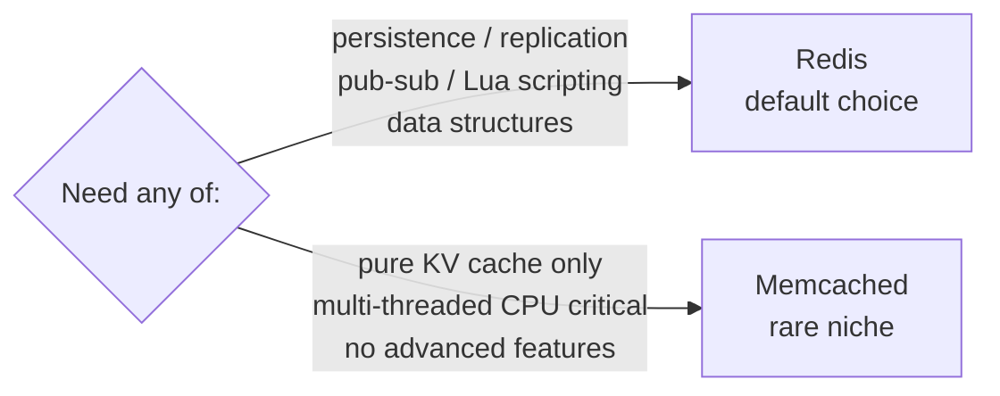

---

## Deep Dives

- [Cache Strategies](../12-interview-prep/quick-reference/caching/cache-strategies)
- [Redis Fundamentals](../12-interview-prep/quick-reference/caching/redis-fundamentals)
- [CDN Usage](../12-interview-prep/quick-reference/caching/cdn-usage)
- [Performance Bottlenecks](../12-interview-prep/quick-reference/caching/performance-bottlenecks)
- [ElastiCache / Redis on AWS](../12-interview-prep/quick-reference/aws-cloud/elasticache-redis)
- [CloudFront CDN](../12-interview-prep/quick-reference/aws-cloud/cloudfront-cdn)

---

## 13. Question-Bank: Caching & Performance Deep Dives

### Cache Invalidation Strategies
**Cache invalidation** — keeping cache consistent with the source of truth

| Strategy | Staleness window | Complexity | Use when |
|----------|-----------------|-----------|---------|
| **TTL expiry** | Up to TTL (e.g., 60s) | Lowest | Staleness is acceptable |
| **Explicit delete on write** | <100ms (race condition risk) | Low | Strong consistency needed |
| **Event-driven (pub/sub)** | <100ms (pub/sub latency) | Medium | High write frequency |
| **Versioned keys** (`user:123:v5`) | 0ms (old version auto-expires) | Medium | Concurrent writes to same key |
| **Write-through** | 0ms | High (slower writes) | Read-heavy, must be fresh |

- **Key number**: TTL=60s → up to 60s stale; event-driven → typically **<100ms** stale
- **Decision**: TTL for most cases; explicit delete for low-write high-read; write-through for real-time accuracy requirements
- **Trap**: Cache-aside write race — Thread A reads DB (old), Thread B writes + deletes cache, Thread A writes OLD value back to cache; fix with versioned keys or short TTL safety net
- → [Full article](../12-interview-prep/question-bank/caching-performance/cache-invalidation-strategies)

---

### Redis Advanced Patterns
**Redis pub/sub vs streams** — choosing the right real-time messaging primitive

| | Redis Pub/Sub | Redis Streams |
|-|--------------|--------------|
| **Persistence** | No (miss on disconnect) | Yes (append-only log) |
| **Replay** | No | Yes (from any offset) |
| **Consumer groups** | No | Yes (distributed consumers) |
| **Throughput** | ~1M msg/sec | ~500K msg/sec |
| **Use when** | Chat presence, cache invalidation fan-out | Task queues, audit logs, event sourcing |

- **Key number**: Pub/Sub ~1M msg/sec; Streams ~500K msg/sec; Redis Cluster: **16,384 hash slots** distributed across shards
- **Decision**: Pub/Sub for fire-and-forget notifications where missed messages are OK; Streams for at-least-once delivery where consumers may disconnect
- **Trap**: Using Pub/Sub for task queues — any worker that's offline misses messages permanently; use Streams with consumer groups for reliable job processing
- → [Full article](../12-interview-prep/question-bank/caching-performance/redis-advanced-patterns)

---

### CDN Caching Strategies
**CDN caching** — headers, invalidation, and cache busting patterns

| Header | Meaning | Use for |
|--------|---------|--------|
| `max-age=N` | Browser + CDN cache N seconds | Static assets |
| `s-maxage=N` | CDN only (overrides max-age for CDNs) | API responses with longer CDN TTL |
| `private` | Browser only, CDN must NOT store | Personalized responses |
| `no-store` | Never cache anywhere | Auth tokens, bank statements |
| `stale-while-revalidate=60` | Serve stale 60s, revalidate in bg | High-traffic pages tolerating brief staleness |

- **Key number**: CloudFront invalidation after free 1K paths = **$0.005/1000 paths**; prefer filename hash (`main.a1b2c3.js`) over invalidation
- **Decision**: Filename-based cache busting for static assets; `s-maxage` to give CDN longer TTL than browser; `private` for any user-personalized content
- **Trap**: Missing `Cache-Control: private` on user-specific API responses — CDN caches user A's data and serves it to user B
- → [Full article](../12-interview-prep/question-bank/caching-performance/cdn-caching-strategies)

---

### Database Query Caching & N+1
**N+1 query problem** — eliminating redundant DB round-trips

| Fix | Approach | Round trips |
|-----|---------|------------|
| **JOIN (eager load)** | Fetch parent + children in 1 query | 1 |
| **Batch (DataLoader)** | Collect IDs, issue `WHERE id IN (...)` | 2 |
| **ORM includes** | `Post.includes(:author)` | 1–2 |
| **Query cache (Redis)** | Cache result of expensive query | 0 (cache hit) |

- **Key number**: N+1 at N=100 posts = 101 DB queries × 1ms = **101ms** extra latency; JOIN reduces to 1 query
- **Decision**: JOIN for simple parent-child; DataLoader for GraphQL resolvers that can't be restructured; Redis query cache for expensive aggregation queries repeated across requests
- **Trap**: PgBouncer transaction mode disables prepared statements — if using statement caching, use session pooling mode or switch to Pgpool-II
- → [Full article](../12-interview-prep/question-bank/caching-performance/database-query-caching)

---

### Cache Stampede / Thundering Herd
**Cache stampede** — preventing DB overload when a popular key expires

| Solution | Latency | Complexity | Guarantee |
|----------|---------|-----------|----------|
| **Redis mutex (SETNX)** | Adds wait for locked requests | Low | One rebuilder, others wait |
| **Probabilistic early expiry (XFetch)** | None | Medium | No locks; spreads recomputation |
| **Stale-while-revalidate** | None (serves stale) | Low | Always fast response |
| **Background refresh** | None | Medium | Serve stale briefly |

- **Key number**: 10K req/sec on one key → cache expiry triggers 10K simultaneous DB queries in **~5ms** before any can repopulate; at 500ms DB query time, exhausts connection pool instantly
- **Decision**: Redis mutex for exact consistency; probabilistic early expiry for zero-lock high-traffic scenarios; stale-while-revalidate for UIs where brief staleness is fine
- **Trap**: Stampede fix with no jitter on TTL — if 100 keys all set TTL=60s at the same time, they all expire simultaneously and cause a coordinated herd; add random jitter: `TTL = 60 + rand(0,10)`
- → [Full article](../12-interview-prep/question-bank/caching-performance/cache-stampede-thundering-herd)

---

### Application-Layer Caching
**Application caching patterns** — cache-aside, read-through, write-through comparison

| Pattern | Cache population | Consistency | Latency | Use for |
|---------|----------------|------------|--------|--------|
| **Cache-aside** | App on miss | Eventual (stale for TTL) | Fast reads | General CRUD |
| **Read-through** | Cache layer on miss | Strong reads | Fast reads | ORM L2 caches |
| **Write-through** | App on every write | Strong | Slower writes | Read-heavy critical data |
| **Write-behind** | Cache (async to DB) | Eventual | Fastest writes | High-throughput metrics |

- **Key number**: Write-behind can sustain **10–100× higher write throughput** vs write-through by removing DB from critical write path
- **Decision**: Cache-aside for most apps; write-through when read consistency is critical; write-behind for high-throughput non-critical writes (counters, analytics)
- **Trap**: Caching auth state with passive TTL — a revoked JWT cached for 15 min still grants access; store session in Redis with explicit `DEL` on logout
- → [Full article](../12-interview-prep/question-bank/caching-performance/application-layer-caching)

---

### Cache Sizing & Eviction
**Cache sizing and eviction** — choosing the right eviction policy and memory allocation

| Policy | Best for | Weakness |
|--------|---------|---------|
| **LRU** | General workloads with temporal locality | Scan pollution — batch reads evict hot items |
| **LFU** | Hot-item workloads, ML feature stores | High-freq cold item may persist after cooling |
| **ARC** | Mixed/unknown access patterns | More complex; used in ZFS |
| **TTL** | Time-sensitive data | Stale data served until TTL |

- **Key number**: ARC (Adaptive Replacement Cache) achieves **10–30% better hit ratio** than pure LRU/LFU on mixed workloads
- **Decision**: LRU (`allkeys-lru`) for most Redis caches; LFU (`allkeys-lfu`) for popularity-heavy workloads (trending content, ML features); always set `maxmemory` explicitly
- **Trap**: Redis `maxmemory-policy: noeviction` for a cache — Redis returns OOM errors when full instead of evicting; only use `noeviction` for queues/streams, NOT caches
- → [Full article](../12-interview-prep/question-bank/caching-performance/cache-sizing-eviction)

---

### Write-Behind vs Write-Through
**Write-behind vs write-through** — durability vs throughput trade-off

| | Write-Through | Write-Behind |
|-|--------------|-------------|
| **Write latency** | DB latency (~5–20ms) | Cache latency (~1ms) |
| **Durability** | Full (every write in DB) | Risk of data loss on crash |
| **Write throughput** | DB-limited | **10–100× higher** |
| **Use when** | Payments, user data, critical writes | Metrics, counters, analytics |

- **Key number**: Write-through latency = ~5–20ms (DB); write-behind latency = ~1ms (cache only) — **10–20× faster writes**
- **Decision**: Write-through for anything where data loss is unacceptable; write-behind for high-throughput where losing seconds of data is tolerable
- **Trap**: Write-behind without Redis AOF persistence — cache crash loses all unwritten data; enable AOF `appendfsync everysec` for near-full durability with write-behind
- → [Full article](../12-interview-prep/question-bank/caching-performance/write-behind-write-through)

---

### Multi-Level Caching
**Multi-level caching** — layered cache hierarchy from CPU to CDN

| Level | Latency | Capacity | Scope |
|-------|--------|---------|-------|
| CPU L1 | 0.5 ns | 32–64 KB | Per core |
| CPU L3 | 10–30 ns | 8–64 MB | Shared |
| In-process (LRU) | <0.1 ms | 100 MB–2 GB | Per server |
| Redis (distributed) | 0.3–2 ms | 100 GB–TB | Cluster-wide |
| CDN edge | <10 ms | TB+ | Global |

- **Key number**: In-process cache serves hottest **0.01% of traffic** with <0.1ms latency; Redis handles cluster-wide shared state
- **Decision**: L1 in-process for top 1K hot keys (feature flags, config, top-N items); Redis for all other shared cached state; CDN for public static + API responses
- **Trap**: In-process cache with no TTL on a multi-instance deployment — each server has a different version of the data; always set short TTL (1–30s) for in-process caches to limit divergence
- → [Full article](../12-interview-prep/question-bank/caching-performance/multi-level-caching)

---

### Cache Warming Strategies
**Cache warming** — preventing cold-start DB overload after deploys or failovers

| Strategy | Best for | Limitation |
|----------|---------|-----------|
| **Preload from DB** | Known hot working set (top products, config) | Need to know what to preload |
| **Traffic replay** | Warm exact access pattern from prod logs | Requires log capture infrastructure |
| **Gradual rollout** | Canary/blue-green — warm new instance before full traffic | Slower deployment |
| **Lazy warm with request coalescing** | Unknown working set | Slow warm-up period with DB load |

- **Key number**: At 10K req/sec and 95% eventual hit ratio — cold cache forces DB to absorb **10K rps** instead of 500 rps (**20× overload**) until warm
- **Decision**: Preload from DB for known hot sets (top-N products, feature flags, user sessions for active users); canary rollout to let new instances warm before receiving full traffic
- **Trap**: `FLUSHALL` in production without a warming plan — same as cold start but mid-traffic at peak; always use key-level invalidation (`DEL key`) instead of full flush
- → [Full article](../12-interview-prep/question-bank/caching-performance/cache-warming-strategies)

---

## 14. Advanced Caching Patterns

### Cache Stampede — Probabilistic Early Expiration Formula

**Cache stampede prevention** — eliminate dog-pile without locks using XFetch algorithm

| Solution | Lock needed | Latency overhead | Complexity |
|-|-------------|-----------------|-----------|
| **Redis mutex (SETNX)** | Yes | Wait time for blocked requests | Low |
| **Probabilistic early expiry (XFetch)** | No | Slight over-refresh before TTL | Medium |
| **Stale-while-revalidate** | No | None (serves stale) | Low |
| **Singleflight** | No (dedup at app layer) | None for concurrent duplicates | Medium |

- **Key number:** XFetch formula — refresh when `current_time - delta × beta × ln(rand()) > expiry_time`; simplified: refresh early at `TTL × (1 - random × 0.1)` to spread recomputation across 10% of TTL window
- **Decision:** Use mutex when you need exactly one rebuild; use XFetch/probabilistic when near-zero extra DB load matters more than occasional over-refresh; use singleflight (Go `golang.org/x/sync/singleflight`) to coalesce identical in-flight requests at app layer
- **Trap:** Adding jitter to TTL alone does NOT prevent stampede for a single ultra-hot key — jitter helps when many keys expire simultaneously, but one hot key still needs mutex or XFetch

---

### CDN Edge Compute

**CDN edge compute** — running logic at edge nodes vs origin Lambda for sub-10ms global response

| | Cloudflare Workers | Lambda@Edge |
|-|-------------------|------------|
| **Cold start** | **0ms** (always warm, V8 isolates) | **~100ms** cold start |
| **Runtime** | V8 JavaScript (no Node.js APIs) | Node.js / Python / full runtime |
| **Max CPU time** | 50ms (free), 30s (paid) | 30s |
| **Memory** | 128 MB | 128–10,240 MB |
| **Location** | 300+ PoPs globally | CloudFront edge (~50 locations) |
| **DB access** | No direct DB (use KV, Durable Objects) | No direct DB (stateless, no VPC) |
| **Pricing** | $0.15/million requests | $0.60/million requests + Lambda duration |
| **Use for** | Auth checks, redirects, A/B testing, response transforms | Heavy compute, large packages, AWS service integration |

- **Key number:** Cloudflare Workers cold start = **0ms** (V8 isolates pre-warmed); Lambda@Edge cold start = **~100ms**; edge latency to user = **<10ms** vs origin ~100–500ms
- **Decision:** Use Workers for stateless transforms (auth header injection, geo-redirects, A/B flags, request coalescing); use Lambda@Edge when you need full Node.js runtime or AWS SDK; use neither for anything requiring a DB connection (stateless only at edge)
- **Trap:** Trying to connect to a database from edge functions — no persistent connections, no VPC access at edge; use Cloudflare KV (eventual) or Durable Objects (strong) for edge-local state

---

### Multi-Layer Cache Coherence (Invalidation Ordering)

**Multi-layer cache coherence** — correct invalidation order across L1 → L2 → L3 to prevent stale reads

| Layer | Tool | Latency (hit) | Miss adds |
|-|------|--------------|----------|
| **L1 — in-process** | Node.js LRU Map | <0.1ms | +0.5ms to L2 |
| **L2 — distributed** | Redis | 0.3–2ms | +5–50ms to origin |
| **L3 — CDN edge** | CloudFront / Cloudflare | <10ms | +100–500ms to origin |

**Correct invalidation order (write propagation):**
```
1. Write to DB (source of truth)
2. Invalidate L3 CDN  (CloudFront CreateInvalidation)
3. Invalidate L2 Redis (DEL key or publish invalidation event)
4. Invalidate L1 in-process (broadcast via Redis pub/sub to all app instances)
```
**Wrong order (stale read window):** Invalidate L1 first → L2 still serves stale → L1 re-populates with stale L2 data before L2 is invalidated.

- **Key number:** L1 miss → L2 lookup adds **0.5ms**; L2 miss → origin adds **5–50ms**; L3 CDN miss → origin adds **100–500ms**; invalidate outermost layer first (CDN → Redis → in-process)
- **Decision:** Use Redis pub/sub to broadcast L1 invalidations to all app instances in real time; set L1 TTL ≤ 30s as safety net even with pub/sub invalidation; set L3 CDN `stale-while-revalidate` only for truly public non-personalized content
- **Trap:** Invalidating L1 in-process on one app instance but forgetting to broadcast to the other 49 instances — each server has a stale in-process copy; pub/sub broadcast is required for fleet-wide consistency

---

### Write-Around Cache Pattern

**Write-around** — writes bypass the cache entirely; cache populated only on read

| Pattern | Write path | Cache populated by | Data loss risk | Best for |
|-|------------|-------------------|---------------|---------|
| **Write-through** | Cache + DB (sync) | Every write | None | Read-heavy, always-fresh data |
| **Write-behind** | Cache (async to DB) | Every write | **Yes** — crash before flush | High-throughput, loss-tolerant writes |
| **Write-around** | DB only (bypass cache) | Read on cache miss | None | Write-heavy data rarely re-read |

**When write-around causes problems:**
- Freshly written data is NOT in cache → next read = cache miss → DB hit → adds latency for the writing user
- High write + high immediate-read patterns → 100% miss on own writes (e.g., feed write then instant feed read)

**When write-around is correct:**
- Log ingestion, audit trails, batch imports — written once, read rarely or in bulk queries
- Large media uploads — written to S3/blob store, cached only when served

- **Key number:** Write-around = 0 cache pollution on write; first read after write = **100% cache miss** (always hits DB); use when write-to-read ratio > 10:1 for that data type
- **Decision:** Write-through when the writing user will immediately read back; write-around when data is write-heavy and rarely accessed again (audit logs, bulk imports, media); write-behind when throughput matters more than durability (counters, metrics)
- **Trap:** Using write-around for user profile updates — user writes profile change, immediately reads it back, gets cache miss, DB hit returns stale (replication lag), or causes N-fold DB load spike; use write-through or explicit cache update for any write the user immediately reads
