> **📅 Spaced Repetition Schedule**
> Use this cheat sheet on a 4-interval cycle for maximum retention:
> - **Day 0** — Read it fully (20–30 min)
> - **Day 3** — Skim headers, cover answers, test yourself
> - **Day 10** — Quiz yourself on the "Trap" entries without looking
> - **Day 30** — Quick scan for gaps; revisit any you missed

---

# Caching & Redis Cheat Sheet

> Scan time: ~5 min. Every line is interview-relevant.

---

## 1. Where to Cache (Caching Layers)

| Layer | Tool | What to Cache | TTL | Miss penalty |
|-------|------|---------------|-----|-------------|
| **CDN edge** | CloudFront, Cloudflare | Static assets, public API responses | Hours–days | Origin fetch |
| **API Gateway** | AWS APIGW cache | GET responses (idempotent only) | Minutes | Lambda/backend call |
| **App in-memory** | Node.js Map, LRU-cache | Hot config, feature flags, lookup tables | Process lifetime | Restart/redeploy |
| **Distributed cache** | **Redis**, Memcached | Sessions, computed data, rate limits, leaderboards | Seconds–minutes | DB query |
| **DB query cache** | ~~MySQL query cache~~ (removed in 8.0) | N/A — **avoid** | N/A | — |

**Rule:** Cache as close to the user as possible. Each hop adds latency; each layer reduces load on the next.

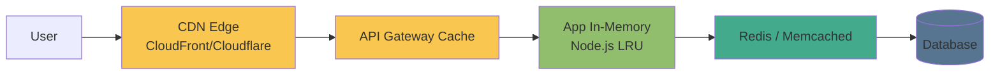

---

## 2. Cache Patterns

| Pattern | Read path | Write path | Consistency | When to use |
|---------|-----------|------------|-------------|-------------|
| **Cache-aside (Lazy)** | Check cache → miss → read DB → populate cache | App writes DB, **invalidates or updates cache manually** | Eventual | Most common general purpose |
| **Read-through** | Cache checks DB on miss automatically | App writes cache only | Consistent reads | When cache library supports it |
| **Write-through** | Read from cache | Write to cache **and** DB together (synchronous) | **Strong** | Write-once, read-many data |
| **Write-behind (Write-back)** | Read from cache | Write to cache, **async flush to DB** | Eventual | **Fast writes**, tolerate data loss risk |

**Cache-aside trap:** Between DB write and cache invalidation → **stale window**. Use short TTL or event-driven invalidation.

**Write-behind trap:** Cache crash before flush → **data loss**. Only use with durable cache (Redis AOF/RDB) or non-critical data.

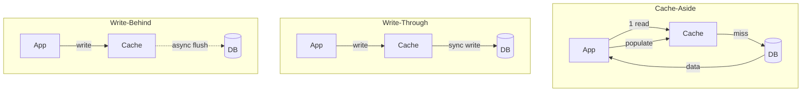

---

## 3. Cache Eviction Policies

| Policy | How | Best for |
|--------|-----|----------|
| **LRU** (Least Recently Used) | Evict item not accessed longest | General purpose — **default choice** |
| **LFU** (Least Frequently Used) | Evict item accessed fewest times | Repeated access patterns, ML feature stores |
| **TTL** (Time-to-live) | Evict after fixed time | News feeds, API responses, sessions |
| **FIFO** | Evict oldest inserted | Simple queues (rarely optimal for caches) |
| **Random** | Evict random key | Rarely optimal |

### Redis `maxmemory-policy` Options

```
allkeys-lru       # LRU across all keys — recommended for cache-only Redis
volatile-lru      # LRU only on keys with TTL set
allkeys-lfu       # LFU across all keys
volatile-ttl      # Evict key with shortest remaining TTL first
noeviction        # Return error when full — for queues/streams, NOT caches
```

**Set `maxmemory` explicitly** — otherwise Redis uses all available RAM until OOM.

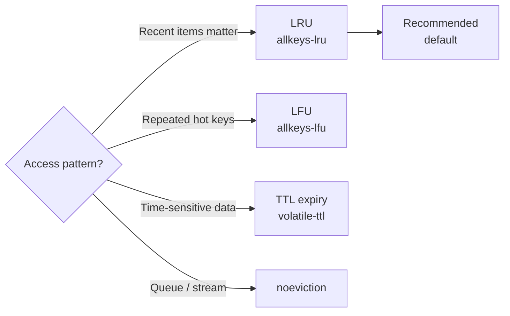

---

## 4. Cache Invalidation Strategies

| Strategy | How | Consistency | Complexity |
|----------|-----|-------------|-----------|
| **TTL expiry** | Key expires after N seconds | Eventual (stale for up to TTL) | Lowest |
| **Explicit delete** | App deletes cache key on write | Strong (with race condition risk) | Low |
| **Event-driven** | Write publishes event → subscriber invalidates cache | Near-strong | Medium |
| **Versioned keys** | `user:123:v5` → old versions auto-expire | Strong (by design) | Medium |
| **Write-through** | Cache always updated with DB write | **Strong** | High |

**Race condition in explicit delete:**
```
Thread A: reads DB (old value)
Thread B: writes DB + deletes cache key
Thread A: writes OLD value back to cache  ← stale data survives
```
Fix: **cache-aside with short TTL** as safety net, or use versioned keys.

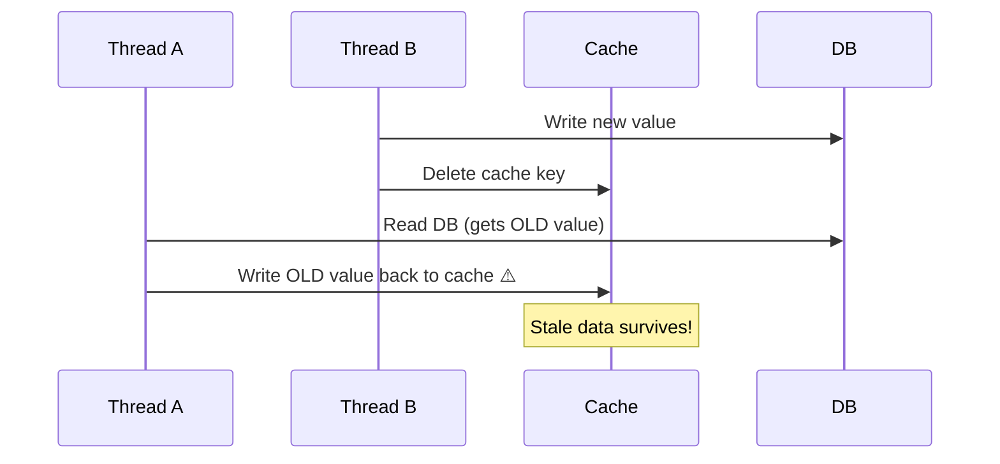

---

## 5. Thundering Herd (Cache Stampede)

**Problem:** Popular cache key expires → **N concurrent requests** all miss → all hammer DB simultaneously.

| Solution | How | Trade-off |
|----------|-----|-----------|
| **Mutex lock** | `SETNX lock:key` — only one request rebuilds, others wait/retry | Lock contention, retry logic needed |
| **Probabilistic early expiration (XFetch)** | Randomly refresh key before TTL expires | Slight over-caching, no lock needed |
| **Background refresh** | Async worker refreshes key before TTL | Serve stale briefly, no blocking |
| **Stale-while-revalidate** | Serve stale immediately, refresh in background | Always fast, brief stale window |

**Redis mutex pattern:**
```javascript
const lock = await redis.set('lock:key', '1', 'NX', 'EX', 10)
if (lock) {
  const data = await fetchFromDB()
  await redis.setex('key', 300, JSON.stringify(data))
  await redis.del('lock:key')
} else {
  // Wait briefly and read (may get stale or empty — handle both)
  await sleep(50)
  return redis.get('key')
}
```

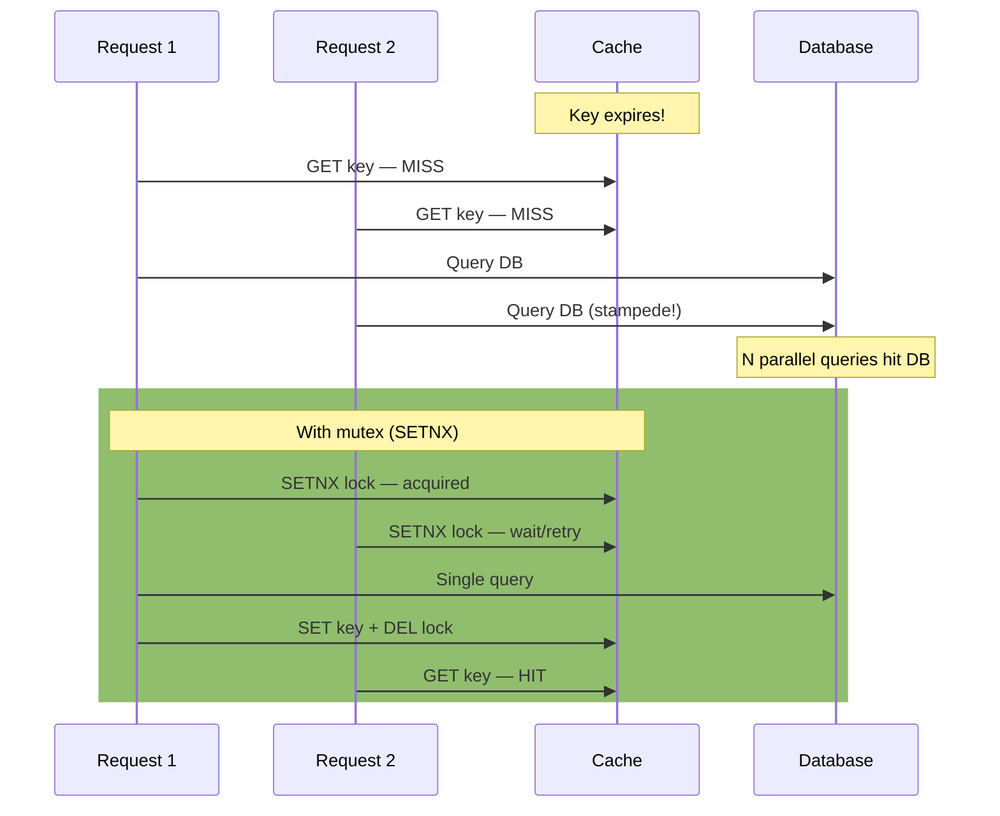

---

## 6. Redis Data Structures & Use Cases

| Structure | Use Case | Key Commands |
|-----------|----------|-------------|
| **String** | Cache value, counter, session token, distributed lock | `GET/SET/INCR/SETNX/SETEX` |
| **Hash** | User object, config map, shopping cart | `HGET/HSET/HMGET/HDEL` |
| **List** | Queue (FIFO/LIFO), activity feed, recent items | `LPUSH/RPUSH/RPOP/LRANGE` |
| **Set** | Unique members, tags, friend lists | `SADD/SMEMBERS/SISMEMBER/SINTERSTORE` |
| **Sorted Set** | **Leaderboard**, rate limiting, delayed jobs, priority queue | `ZADD/ZRANGE/ZRANGEBYSCORE/ZRANK` |
| **HyperLogLog** | Unique visitor count (**~0.81% error**, fixed **12 KB** memory) | `PFADD/PFCOUNT/PFMERGE` |
| **Pub/Sub** | Real-time notifications, chat (not durable — fire and forget) | `PUBLISH/SUBSCRIBE/PSUBSCRIBE` |
| **Stream** | Durable event log, consumer groups, Kafka-lite | `XADD/XREAD/XGROUP/XACK` |
| **Bitmap** | Feature flags, daily active users (1 bit/user) | `SETBIT/GETBIT/BITCOUNT/BITOP` |

**HyperLogLog vs Set for unique counts:** HLL uses **12 KB regardless of cardinality**. Set uses O(n). Use HLL when you don't need exact counts or the actual members.

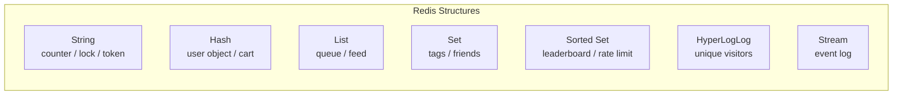

---

## 7. Redis Cluster Mode

| Feature | Standalone | Cluster Mode |
|---------|-----------|--------------|
| Shards | 1 | **1–500** |
| Replicas per shard | Up to 5 | Up to 5 per shard |
| Hash slots | N/A | **16,384** slots distributed across shards |
| Multi-key ops | All work | Must be on **same shard** |
| Max data | RAM of one node | RAM × shards |

**Hash tags for co-location:** `{user123}:session` and `{user123}:cart` → same shard because Redis hashes only `{user123}`.

**ElastiCache specifics:**
- Multi-AZ: auto-failover, replica promoted in **~30 seconds**
- Encryption at rest: **KMS**
- Encryption in transit: **TLS**
- Backup: automated snapshots to S3
- **Global Datastore**: cross-region replication (active-passive)

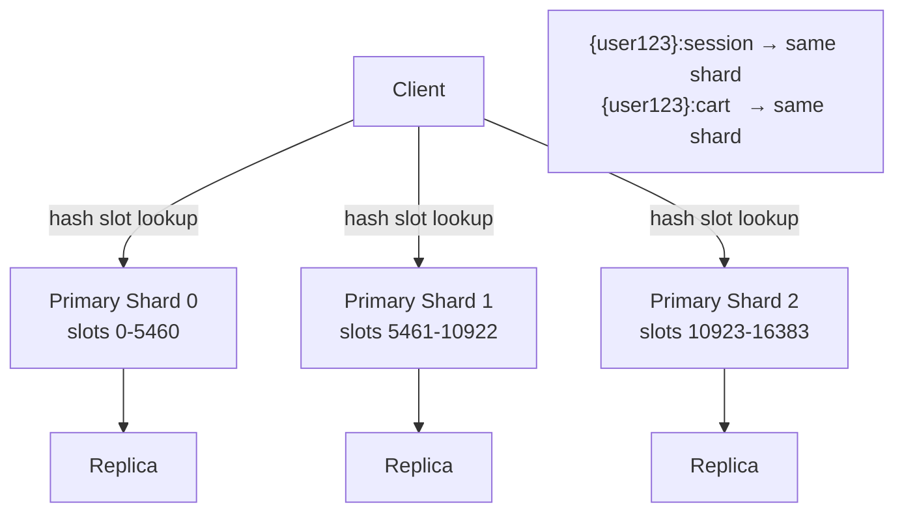

---

## 8. Rate Limiting Patterns

| Algorithm | How | Pros | Cons |
|-----------|-----|------|------|
| **Fixed window** | Count per minute/hour window | Simple | Burst at window boundary (2x rate possible) |
| **Sliding window** | Sorted set of timestamps | Accurate | More memory per user |
| **Token bucket** | Refill tokens at steady rate, consume per request | Allows burst up to bucket size | More complex |
| **Leaky bucket** | Fixed output rate regardless of input | Smooth traffic | Drops burst requests |

**Fixed window (simplest):**
```javascript
const key = `rate:${userId}:${Math.floor(Date.now() / 60000)}`
const count = await redis.incr(key)
if (count === 1) await redis.expire(key, 60)
if (count > 100) throw new RateLimitError()
```

**Sliding window (accurate):**
```javascript
const now = Date.now()
const window = 60 * 1000  // 1 minute
const key = `rate:${userId}`
await redis.zremrangebyscore(key, 0, now - window)  // remove old entries
const count = await redis.zcard(key)
if (count >= 100) throw new RateLimitError()
await redis.zadd(key, now, `${now}-${Math.random()}`)
await redis.expire(key, 60)
```

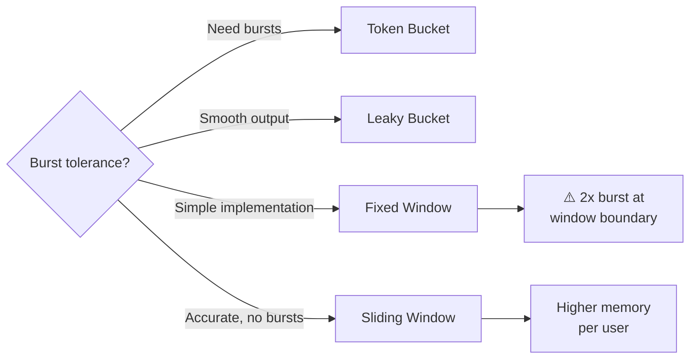

---

## 9. Session Storage Pattern

**Why Redis for sessions:**
- Stateless app servers → can route to any instance
- TTL auto-cleanup → no manual session pruning
- Sub-millisecond reads → no DB round-trip per request
- Scale independently of app tier

**Pattern:**
```
Browser cookie: session_id = "abc-uuid-xyz"
               ↓
Redis HGET session:abc-uuid-xyz
               ↓
Returns: {userId, roles, preferences, lastSeen}
```

**Key rules:**
- Key: `session:{uuid}` — never predictable/sequential
- TTL: **24h** typical, refresh on each request (`EXPIRE` reset)
- On logout: `DEL session:{uuid}` immediately
- Store only what's needed per-request — keep hash small

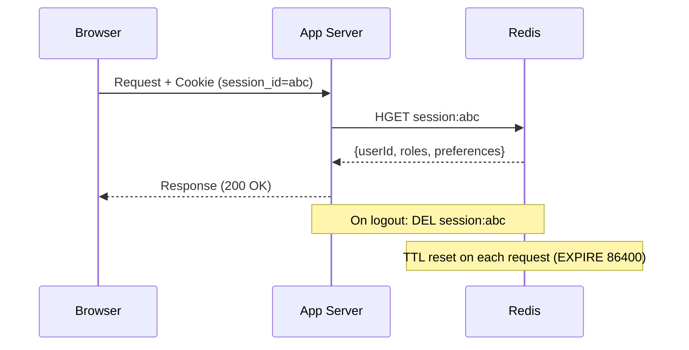

---

## 10. CDN Caching Quick Reference

### Cache-Control Headers

| Directive | Meaning |
|-----------|---------|
| `max-age=3600` | Browser caches for 3600s |
| `s-maxage=86400` | **CDN** caches for 86400s (overrides max-age for shared caches) |
| `no-store` | Never cache anywhere |
| `no-cache` | Cache but revalidate with origin before serving |
| `must-revalidate` | Use cached copy until expired, then must revalidate |
| `private` | Browser only — CDN must not cache (user-specific data) |
| `stale-while-revalidate=60` | Serve stale for 60s while revalidating in background |

### Conditional Requests

- **ETag**: server returns `ETag: "abc123"` → client sends `If-None-Match: "abc123"` → **304 Not Modified** if unchanged
- **Last-Modified**: `Last-Modified: Wed, 01 Jan 2025 00:00:00 GMT` → `If-Modified-Since` header

### Cache Busting

| Method | Example | When to use |
|--------|---------|-------------|
| Filename hash | `main.a1b2c3d4.js` | Static assets — **preferred** |
| Query string | `main.js?v=123` | Some CDNs ignore query strings — less reliable |
| Path versioning | `/v2/api/users` | API versioning |

**CloudFront invalidation:** `/images/*` costs money ($0.005/1000 paths after first 1000). Prefer filename versioning over invalidations.

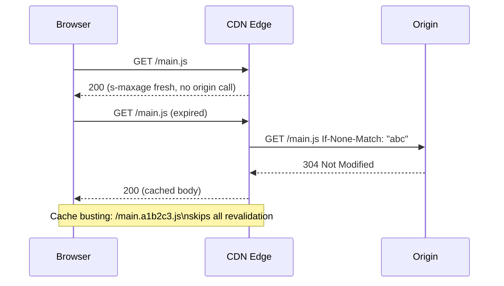

---

## 11. Common Caching Mistakes

| Mistake | Why it hurts | Fix |
|---------|-------------|-----|
| No TTL on cache keys | Memory grows unbounded, stale data forever | **Always set TTL** — even if long |
| Caching user-specific data without key isolation | User A sees User B's data | Include `userId` in cache key |
| Caching in CDN what should be dynamic | Stale personalized content served globally | Set `Cache-Control: private` or `no-store` |
| No fallback when cache is unavailable | Cache outage = full app outage | Circuit breaker: fall through to DB on cache error |
| No cache warming after deploy | Cold start → thundering herd | Pre-warm critical keys on startup |
| Invalidating too broadly (`FLUSHALL`) | Cache becomes useless, DB load spikes | Invalidate specific keys, not entire cache |
| Storing large objects in cache | Evicts many small objects, high memory pressure | Keep cache values small; cache IDs not full objects |
| Single Redis instance for everything | Sessions, rate limits, queues mixed → noisy neighbor | Separate Redis instances by workload |

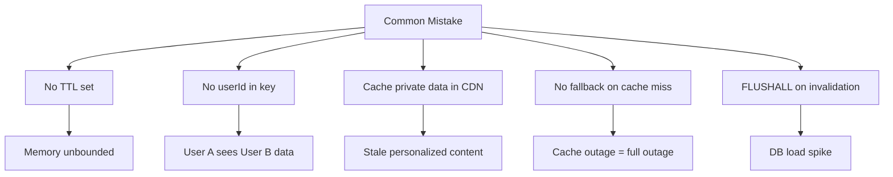

---

## 12. Memcached vs Redis

| Feature | Memcached | Redis |
|---------|-----------|-------|
| Data structures | String only | **10+ types** |
| Persistence | None | RDB snapshots + AOF |
| Replication | None | Primary-replica |
| Clustering | Yes (client-side) | Yes (native) |
| Pub/Sub | No | Yes |
| Lua scripting | No | Yes |
| **When to use** | Pure simple cache, multi-threaded CPU utilization | **Everything else** — sessions, queues, leaderboards |

**Verdict:** Default to Redis. Only pick Memcached if you specifically need multi-threaded cache with no advanced features.

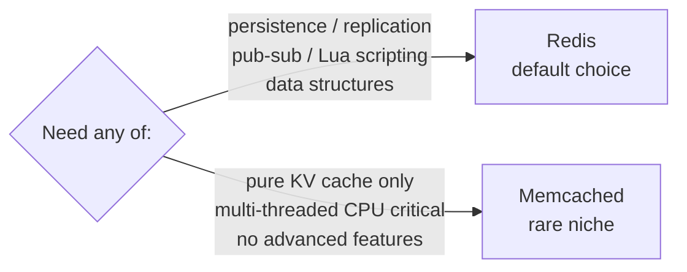

---

## Deep Dives

- [Cache Strategies](../12-interview-prep/quick-reference/caching/cache-strategies)
- [Redis Fundamentals](../12-interview-prep/quick-reference/caching/redis-fundamentals)
- [CDN Usage](../12-interview-prep/quick-reference/caching/cdn-usage)
- [Performance Bottlenecks](../12-interview-prep/quick-reference/caching/performance-bottlenecks)
- [ElastiCache / Redis on AWS](../12-interview-prep/quick-reference/aws-cloud/elasticache-redis)
- [CloudFront CDN](../12-interview-prep/quick-reference/aws-cloud/cloudfront-cdn)
