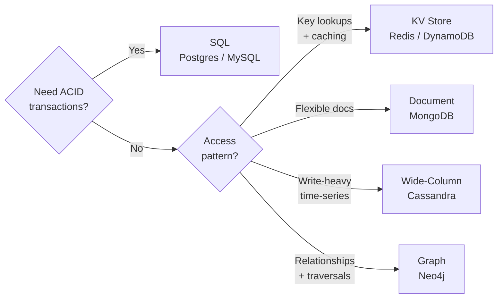
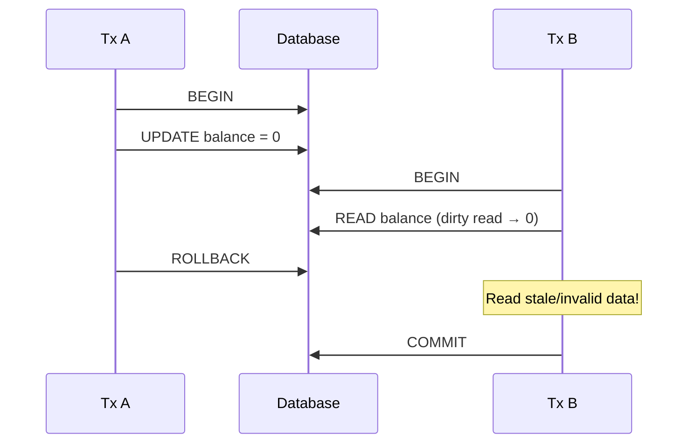
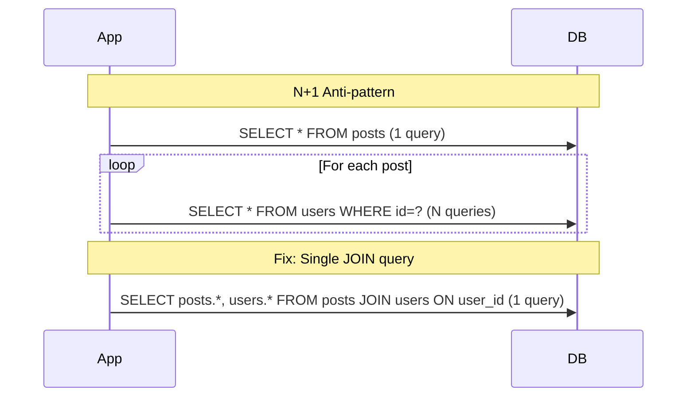
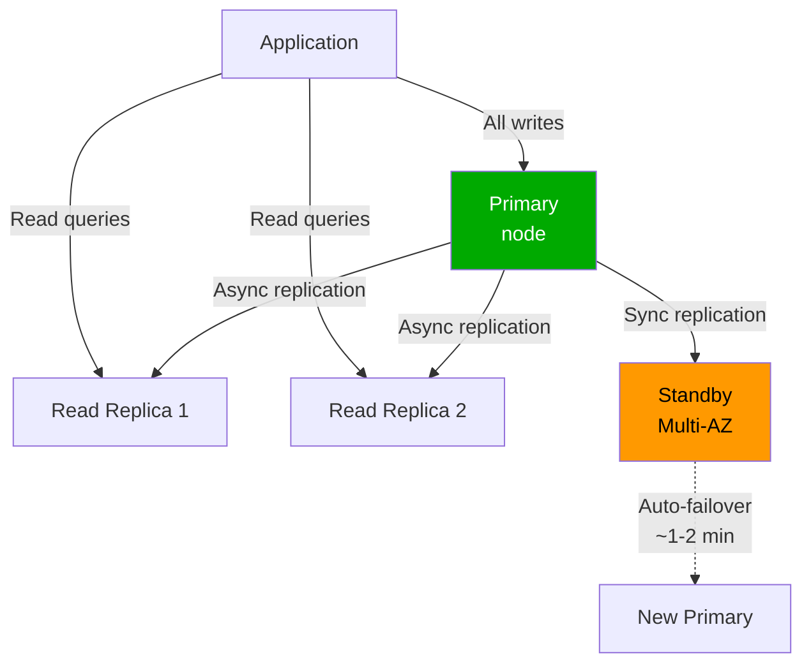
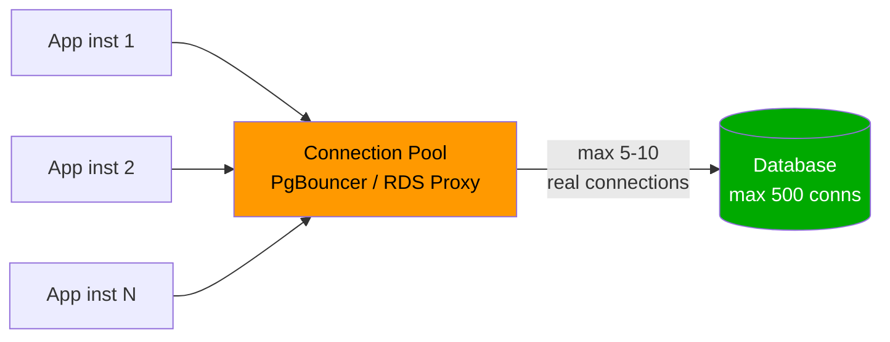
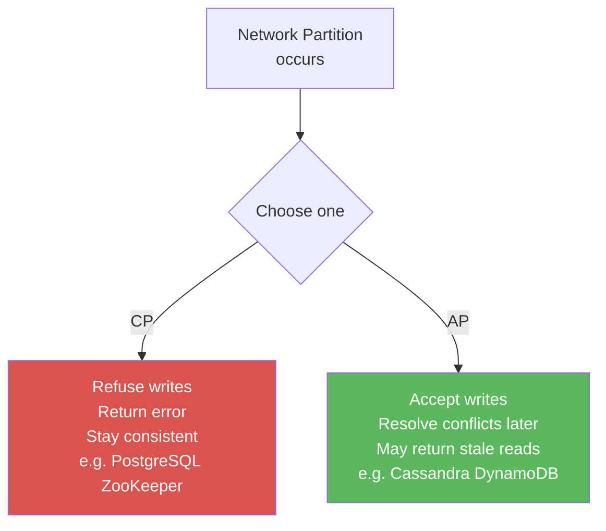
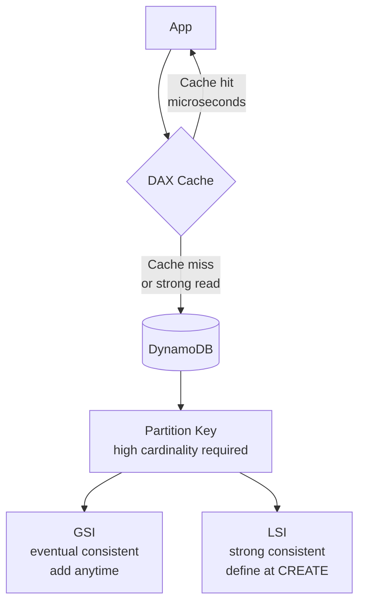
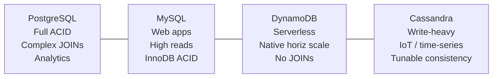
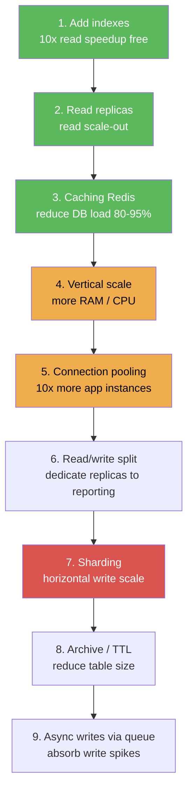

> **📅 Spaced Repetition Schedule**
> Use this cheat sheet on a 4-interval cycle for maximum retention:
> - **Day 0** — Read it fully (20–30 min)
> - **Day 3** — Skim headers, cover answers, test yourself
> - **Day 10** — Quiz yourself on the "Trap" entries without looking
> - **Day 30** — Quick scan for gaps; revisit any you missed

---

# Databases Cheat Sheet

> Scan time: ~5 min. Every line is interview-relevant.

---

## 1. SQL vs NoSQL Decision Matrix

| Factor | SQL (Relational) | Document (MongoDB) | KV (Redis/DynamoDB) | Wide-Column (Cassandra) | Graph (Neo4j) | Time-Series (InfluxDB) |
|--------|------------------|--------------------|---------------------|-------------------------|---------------|------------------------|
| Schema | Fixed, enforced | Flexible, per-doc | None | Column families | Nodes + edges | Tag-based |
| Consistency | **ACID** | Tunable | Eventual / strong | Tunable (quorum) | ACID | Eventual |
| Scale | Vertical (+ read replicas) | Horizontal | **Horizontal** | **Horizontal** | Vertical | Horizontal |
| Query complexity | Complex JOINs, aggregations | Nested doc queries | Key lookups only | CQL (no JOINs) | Graph traversal | Time-range queries |
| Use case | Banking, payments, inventory | Catalogs, CMS, user profiles | Sessions, caches, leaderboards | IoT, logs, messaging | Social graphs, recommendations | Metrics, monitoring, analytics |
| Examples | PostgreSQL, MySQL, Aurora | MongoDB, Firestore | Redis, DynamoDB | Cassandra, HBase | Neo4j, Amazon Neptune | InfluxDB, TimescaleDB, Timestream |

**Use SQL when:** ACID transactions required (payments, inventory), complex JOINs needed, data is relational with foreign keys, strong consistency mandatory.

**Use NoSQL when:** **100M+ records**, horizontal write scale needed, flexible/evolving schema, document/graph/KV access patterns dominate.



---

## 2. ACID Properties

| Property | Meaning | Failure example if absent |
|----------|---------|--------------------------|
| **Atomicity** | All-or-nothing — full commit or full rollback | Transfer deducts $100 but never credits recipient |
| **Consistency** | DB constraints always maintained | Foreign key violation allowed, referential integrity broken |
| **Isolation** | Concurrent transactions don't interfere | Two users book last seat simultaneously |
| **Durability** | Committed data survives crashes | Power loss wipes last 1000 transactions |

### Isolation Levels

| Level | Dirty Reads | Non-Repeatable Reads | Phantom Reads | Performance |
|-------|-------------|----------------------|---------------|-------------|
| READ UNCOMMITTED | Allowed | Allowed | Allowed | Fastest |
| **READ COMMITTED** (default PG) | Prevented | Allowed | Allowed | Fast |
| **REPEATABLE READ** (default MySQL) | Prevented | Prevented | Allowed | Medium |
| SERIALIZABLE | Prevented | Prevented | Prevented | Slowest |

- **Dirty read**: read uncommitted data from another transaction
- **Non-repeatable read**: same row returns different value within one transaction
- **Phantom read**: re-query returns different set of rows (another tx inserted/deleted)



---

## 3. Indexing

| Index Type | Best For | Limitations |
|------------|----------|-------------|
| **B-tree** (default) | Range queries, =, >, <, ORDER BY, LIKE 'prefix%' | Not useful for: full-text, arbitrary LIKE |
| **Hash** | Exact equality only (`=`) | **No range queries, no ORDER BY** |
| **Composite** | Multi-column WHERE clauses | **Leading column rule** — must include leftmost column |
| **Covering / Index-only** | Query fully answered from index — **no table lookup** | Extra storage |
| **Partial** | `WHERE status = 'active'` — index subset of rows | Specific to condition |
| **Full-text** | Text search (`MATCH AGAINST`, `tsvector`) | Not for exact KV lookups |

### Key Rules

- **Composite index `(a, b, c)`**: usable for `WHERE a=`, `WHERE a= AND b=`, **not** `WHERE b=` alone
- **Covering index**: if all columns in SELECT + WHERE are in index → **zero table access**
- **Cardinality matters**: index on `gender` (2 values) → useless. Index on `email` (unique) → perfect
- Indexes slow **INSERT/UPDATE/DELETE** — each write updates all indexes on that table

### Traps

- `WHERE YEAR(created_at) = 2024` → **index not used** (function on column breaks index)
- Use: `WHERE created_at BETWEEN '2024-01-01' AND '2024-12-31'`
- `WHERE email = 123` (int vs varchar mismatch) → implicit cast → **index skipped**

```mermaid
graph TD
    Q[Query with WHERE clause] --> F{Function\non column?}
    F -->|Yes e.g. YEAR()| SKIP[Index SKIPPED\nFull table scan]
    F -->|No| C{Composite\nindex?}
    C -->|Leading col\nmissing| SKIP
    C -->|Leading col\npresent| HIT[Index HIT]
    HIT --> CV{All SELECT cols\nin index?}
    CV -->|Yes| IO[Index-only scan\nZero table access]
    CV -->|No| TP[Index + table\nlookup]
```

---

## 4. Query Optimization

**Always start with:** `EXPLAIN ANALYZE <query>` — look for Seq Scan on large tables.

### N+1 Problem

```
// BAD — 1 query for posts + N queries for each author
posts = db.query("SELECT * FROM posts")
posts.forEach(p => db.query("SELECT * FROM users WHERE id = " + p.user_id))

// GOOD — 1 query with JOIN
db.query("SELECT posts.*, users.* FROM posts JOIN users ON posts.user_id = users.id")
```

### Pagination at Scale

```sql
-- BAD: OFFSET 100000 scans and discards 100k rows
SELECT * FROM posts ORDER BY id LIMIT 20 OFFSET 100000;

-- GOOD: cursor-based (O(log n) with index)
SELECT * FROM posts WHERE id > :last_id ORDER BY id LIMIT 20;
```

### Avoid These Patterns

| Anti-pattern | Fix |
|-------------|-----|
| `SELECT *` | Select only needed columns |
| `WHERE LOWER(email) = ?` | Store email lowercase, index that column |
| `WHERE status != 'deleted'` | Partial index: `WHERE status = 'active'` |
| Implicit type cast in WHERE | Match column type exactly |
| Too many indexes | Benchmark — writes get slower with each index |



---

## 5. Replication

| Mode | Sync | Reads | Writes | Failover | Use case |
|------|------|-------|--------|----------|----------|
| **Primary-Replica (async)** | Async | Scale reads | Primary only | Manual | Read-heavy apps |
| **Multi-AZ (sync)** | Sync | Primary only | Primary only | **Auto ~1-2 min** | HA / DR |
| **Read Replicas** | Async | Up to **5** (MySQL/PG), **15** (Aurora) | Primary only | N/A | Read scale-out |

**Replication lag trap:** Read replica can be 100ms–seconds behind. Critical reads (post-write) → **always route to primary**.

**Aurora advantage:** Up to **15** read replicas, sub-10ms replication lag, storage shared across all nodes.



---

## 6. Sharding

| Strategy | How | Pros | Cons |
|----------|-----|------|------|
| **Range** | `user_id 1–1M → shard1`, `1M–2M → shard2` | Range queries easy | **Hot spots** (new users flood last shard) |
| **Hash** | `hash(user_id) % num_shards` | Even distribution | **Range queries require scatter-gather** |
| **Directory** | Lookup table: key → shard ID | Flexible, relocatable | Lookup table = **single point of failure** |
| **Consistent hashing** | Hash ring, each shard owns an arc | **Minimal rebalancing** on add/remove | More complex |

**Consistent hashing used in:** Cassandra, Redis Cluster, DynamoDB, Memcached.

**Cross-shard operations are painful:** Avoid JOINs across shards. Denormalize data or use scatter-gather + application-level merge.

```mermaid
graph LR
    Client --> Router[Shard Router]
    Router -->|hash(user_id) % 3 = 0| S0[Shard 0\nuser_id 0,3,6...]
    Router -->|hash(user_id) % 3 = 1| S1[Shard 1\nuser_id 1,4,7...]
    Router -->|hash(user_id) % 3 = 2| S2[Shard 2\nuser_id 2,5,8...]
    style S0 fill:#4a90d9,color:#fff
    style S1 fill:#4a90d9,color:#fff
    style S2 fill:#4a90d9,color:#fff
```

---

## 7. Connection Pooling

**Problem:** DB supports **100–500 max connections**. 1000 app instances × 10 connections = 10,000 → DB crashes.

| Pooler | Mode | Notes |
|--------|------|-------|
| **PgBouncer** | Transaction / session | Lightweight, most common for PostgreSQL |
| **RDS Proxy** | Session | AWS managed, IAM auth, SSL, **essential for Lambda** |
| **HikariCP** | App-level | Built into Spring Boot, fastest JVM pool |

**Pooling modes:**
- **Transaction pooling** (most efficient): connection returned to pool after each transaction — stateful features (SET, temp tables, prepared statements) **don't work**
- **Session pooling**: connection held for entire client session — stateful but fewer benefits

**Lambda trap:** Each cold start = new DB connection. **100 concurrent Lambdas = 100 new connections**. Always use RDS Proxy with Lambda.



---

## 8. CAP Theorem Applied

> In a network partition, choose **C** (consistency) or **A** (availability) — not both.

| Type | Databases | Behavior during partition |
|------|-----------|--------------------------|
| **CP** (Consistency + Partition tolerance) | PostgreSQL (single leader), HBase, ZooKeeper, etcd | Refuse writes, remain consistent |
| **AP** (Availability + Partition tolerance) | Cassandra, DynamoDB, CouchDB, Riak | Accept writes, resolve conflicts later |
| CA (no partition) | SQLite, single-node MySQL | Not distributed — partition impossible by design |

**Cassandra tuning:** `QUORUM` reads + `QUORUM` writes → strong consistency at write cost. `ONE` reads → max availability, may read stale.



---

## 9. DynamoDB Quick Reference

### Key Design

| Concept | Rule |
|---------|------|
| **Partition key** | Must be **high cardinality** — avoid `status`, `country`, `boolean` as PK |
| **Sort key** | Enables range queries within a partition: `WHERE pk = X AND sk BETWEEN a AND b` |
| **GSI** | New PK + optional SK, **eventually consistent**, add anytime |
| **LSI** | Same PK + new SK, **strongly consistent**, **must define at CREATE time** |

### Single-Table Design Pattern

```
Entity      PK              SK
User        USER#u123       PROFILE
Post        USER#u123       POST#2024-01-15T10:00
Comment     POST#p456       COMMENT#2024-01-15T11:00
```

Access patterns drive table design — model for queries, not for normalization.

### Key Numbers

| Limit | Value |
|-------|-------|
| Max item size | **400 KB** |
| Transaction limit | **25 items / 4 MB** per transaction |
| GSI count | **20 per table** |
| On-demand throughput | Auto-scales, higher cost |
| Provisioned throughput | Fixed RCU/WCU, cheaper at steady load |

**DAX (DynamoDB Accelerator):** Microsecond reads, write-through cache. **Not for strongly consistent reads** — DAX always returns eventually consistent cached data.

> **Deep Dives** link to full articles covering each topic in depth.



---

## 10. PostgreSQL vs MySQL vs DynamoDB vs Cassandra

| Feature | PostgreSQL | MySQL | DynamoDB | Cassandra |
|---------|------------|-------|----------|-----------|
| ACID | Full | Full (InnoDB) | Per-item / transactions (limited) | Per-row (Lightweight Transactions) |
| Horizontal scale | Read replicas only | Read replicas only | **Native** | **Native** |
| Consistency | Strong | Strong | Tunable (eventual / strong) | Tunable (ONE/QUORUM/ALL) |
| Schema | Strict | Strict | Schemaless | Schemaless (CQL defined) |
| JOINs | Full | Full | **None** | **None** |
| Best for | Analytics, complex queries, PostGIS | Web apps, high-read workloads | Serverless, variable scale | Write-heavy, time-series, IoT |
| AWS managed | **RDS / Aurora PostgreSQL** | **RDS / Aurora MySQL** | **DynamoDB** | **Keyspaces** |



---

## 11. Database Scaling Ladder

Start here — move down only when you've exhausted the current step:

```
1. Add indexes              → 10x read speedup, zero infra cost
2. Add read replicas        → read scale-out, async replication
3. Caching layer (Redis)    → reduce DB load by 80–95%
4. Vertical scaling         → more RAM (buffer pool), faster CPU
5. Connection pooling       → handle 10x more app instances
6. Read/write split         → dedicate replicas to reporting queries
7. Sharding                 → horizontal write scale-out
8. Archive/TTL old data     → reduce table size, faster scans
9. Async writes via queue   → absorb write spikes, decouple producers
```

**Rule of thumb:** Most apps never need sharding. Get to step 4–5 before considering step 7.



---

## Deep Dives

- [SQL vs NoSQL](../12-interview-prep/quick-reference/databases/sql-vs-nosql)
- [Indexing Strategies](../12-interview-prep/quick-reference/databases/indexing-strategies)
- [Query Optimization](../12-interview-prep/quick-reference/databases/query-optimization)
- [Database Replication](../12-interview-prep/quick-reference/databases/database-replication)
- [Connection Pooling](../12-interview-prep/quick-reference/databases/connection-pooling)
- [Scaling Strategies](../12-interview-prep/quick-reference/databases/scaling-strategies)
- [DynamoDB (AWS)](../12-interview-prep/quick-reference/aws-cloud/dynamodb-nosql)
- [RDS on AWS](../12-interview-prep/quick-reference/aws-cloud/rds-databases)

---

## 12. Question-Bank: Database Deep Dives

### SQL vs NoSQL Decisions
**SQL vs NoSQL** — choosing the right database for the job

| Signal | Choose SQL | Choose NoSQL |
|--------|-----------|-------------|
| Joins | >3 tables in hot query | Key-value/document lookups |
| Scale | <5TB, ~10K TPS | >5TB, horizontal write scale |
| Consistency | ACID mandatory | Eventual OK |

- **Key number**: PostgreSQL handles ~10K TPS single node; DynamoDB handles 10M+ RPS at Amazon
- **Decision**: SQL when schema is stable and relationships are complex; NoSQL when schema evolves and scale is horizontal
- **Trap**: Joining >3 tables in every hot query at scale — SQL's relational model works against you; denormalize or switch to document DB
- → [Full article](../12-interview-prep/question-bank/databases/sql-vs-nosql-decisions)

---

### Database Sharding
**Database sharding** — horizontal partitioning when single-node write throughput maxes out

| Strategy | Distribution | Range queries | Hot spots |
|----------|-------------|---------------|-----------|
| **Range** | Uneven (new data floods last shard) | Easy | Yes (time-based) |
| **Hash** | Even | Scatter-gather | No |
| **Consistent hashing** | Even, minimal rebalance | Scatter-gather | No |

- **Key number**: Shard when: single-node writes exceed ~10K TPS, or table exceeds ~1TB (index stops fitting in RAM)
- **Decision**: Hash sharding for even distribution; directory-based for flexibility to relocate hot keys
- **Trap**: Sharding prematurely — exhaust read replicas, connection pooling, and vertical scaling first; cross-shard JOINs and transactions become extremely painful
- → [Full article](../12-interview-prep/question-bank/databases/database-sharding-deep-dive)

---

### Database Replication Patterns
**Replication patterns** — scaling reads and achieving high availability

| Mode | Sync | Read scale | Failover | Lag |
|------|------|-----------|---------|-----|
| **Primary-Replica async** | No | Yes (up to 15 Aurora) | Manual | 100ms–seconds |
| **Multi-AZ sync** | Yes | No | Auto ~1-2 min | 0 (synchronous) |
| **Aurora Global** | Async | Yes (per region) | Manual (<1 min) | ~100ms cross-region |

- **Key number**: MySQL/PostgreSQL: up to 5 read replicas; Aurora: up to **15** read replicas with sub-10ms lag
- **Decision**: Read replicas for read scale; Multi-AZ for HA/DR; Global DB for active-passive multi-region
- **Trap**: Routing post-write reads to read replica — replica may be 100ms+ behind; always route critical read-after-write to primary
- → [Full article](../12-interview-prep/question-bank/databases/database-replication-patterns)

---

### Indexing Strategies
**Indexing** — accelerating reads at the cost of write overhead

| Index type | Best for | Avoid when |
|-----------|---------|-----------|
| **B-tree** | Range, =, ORDER BY | Arbitrary LIKE (not prefix) |
| **Hash** | Exact equality only | Range queries needed |
| **Composite** | Multi-column WHERE | Leading column not in query |
| **Covering** | All columns in SELECT+WHERE | Large payloads (extra storage) |
| **Partial** | Subset of rows (e.g., status='active') | Full table queries |

- **Key number**: Covering index = zero table access; Composite `(a,b,c)` usable for `WHERE a=` but NOT `WHERE b=` alone
- **Decision**: Index high-cardinality columns (email, UUID); skip low-cardinality (gender, boolean)
- **Trap**: `WHERE YEAR(created_at) = 2024` — function on indexed column breaks index; use range query instead: `BETWEEN '2024-01-01' AND '2024-12-31'`
- → [Full article](../12-interview-prep/question-bank/databases/indexing-strategies)

---

### Transactions: ACID & Isolation
**ACID + isolation levels** — preventing data anomalies in concurrent systems

| Level | Dirty reads | Non-repeatable | Phantom | Throughput |
|-------|------------|---------------|---------|-----------|
| READ COMMITTED (PG default) | ❌ | ✅ possible | ✅ possible | Fast |
| REPEATABLE READ (MySQL default) | ❌ | ❌ | ✅ possible | Medium |
| SERIALIZABLE | ❌ | ❌ | ❌ | **50-80% slower** |

- **Key number**: SERIALIZABLE reduces throughput by 50–80%; PostgreSQL WAL fsync ~1ms overhead per commit
- **Decision**: READ COMMITTED for most apps; REPEATABLE READ for inventory/booking; SERIALIZABLE only for financial reconciliation
- **Trap**: Using SERIALIZABLE everywhere — massive throughput penalty; use explicit locking (`SELECT FOR UPDATE`) for specific critical sections instead
- → [Full article](../12-interview-prep/question-bank/databases/transactions-acid-base)

---

### Connection Pooling
**Connection pooling** — preventing DB connection exhaustion at scale

| Pooler | Mode | Best for |
|--------|------|---------|
| **PgBouncer** | Transaction / session | PostgreSQL, high connection count |
| **RDS Proxy** | Session | AWS Lambda → RDS (mandatory) |
| **HikariCP** | App-level | Spring Boot JVM services |

- **Key number**: PostgreSQL supports 100–500 max connections; PgBouncer reduces 10K app connections to 10-50 real DB connections
- **Decision**: PgBouncer transaction mode for stateless services; session mode when using prepared statements or temp tables
- **Trap**: Lambda + RDS without RDS Proxy — each cold start creates a new DB connection; 100 concurrent Lambdas = 100 connections; always use RDS Proxy with serverless
- → [Full article](../12-interview-prep/question-bank/databases/connection-pooling)

---

### Database Migrations at Scale
**Zero-downtime migrations** — schema changes on 100M+ row tables without locking

| Operation | Lock? | Safe approach |
|-----------|-------|-------------|
| ADD COLUMN nullable (PG11+) | No | Instant — stored in catalog |
| ADD COLUMN NOT NULL with default (PG11+) | No | Instant — PG11+ stores default in catalog |
| ADD INDEX | Lock | `CREATE INDEX CONCURRENTLY` |
| ADD UNIQUE CONSTRAINT | Lock | `ADD CONSTRAINT NOT VALID` → `VALIDATE CONSTRAINT` separately |
| RENAME COLUMN | Lock | Expand-contract pattern (add new, dual-write, migrate, drop old) |

- **Key number**: `ALTER TABLE` on 100M rows can lock for minutes; `CREATE INDEX CONCURRENTLY` takes longer but never locks
- **Decision**: gh-ost (binlog-based, pauseable) for large tables >10GB at high write rates; pt-osc for smaller tables with simpler setup
- **Trap**: `ALTER TABLE ... ADD COLUMN ... NOT NULL DEFAULT 'x'` on pre-PG11 — triggers full table rewrite; use expand-contract pattern instead
- → [Full article](../12-interview-prep/question-bank/databases/database-migrations-at-scale)

---

### Time-Series Databases
**Time-series DBs** — append-only, time-indexed, high-compression storage for metrics/IoT

| DB | Ingest rate | Query language | Best for |
|----|------------|---------------|---------|
| **Prometheus** | 1M+ metrics/sec scrape | PromQL | K8s/infra monitoring, alerting |
| **InfluxDB** | 1M+ data points/sec | Flux / InfluxQL | IoT, custom app telemetry |
| **TimescaleDB** | 500K inserts/sec | Full SQL | Mixed TSDB + relational, existing PG |

- **Key number**: TSDB compression 10–100× vs raw; downsampling tiers — raw 7 days → 1-min agg 30 days → 1-hour agg 1 year = 60× storage reduction
- **Decision**: Prometheus for infra metrics; InfluxDB for push-based IoT/app events; TimescaleDB when you need SQL joins or already use PostgreSQL
- **Trap**: High cardinality label in Prometheus (e.g., `user_id` as label) — creates millions of time series, crashes Prometheus; never use unbounded values as labels
- → [Full article](../12-interview-prep/question-bank/databases/time-series-databases)

---

### Graph Databases
**Graph DBs** — relationship traversal orders of magnitude faster than SQL self-joins

| DB | Best for | Scale | Managed? |
|----|---------|-------|---------|
| **Neo4j** | Deep traversal, single-tenant | ~4B nodes on 256GB RAM | Self-hosted / AuraDB |
| **Amazon Neptune** | AWS-native, HA, multi-protocol | Horizontal read replicas | Yes (AWS managed) |
| **DGraph** | Distributed graph, 100B+ edges | Horizontal | Self-hosted |

- **Key number**: SQL self-join 3 hops on 10M users = billions of row comparisons; Neo4j = thousands of edge traversals — **1000× faster** for deep traversal
- **Decision**: Neo4j for social graphs/fraud detection; Neptune for AWS workloads with HA requirements; DGraph for massive distributed graphs
- **Trap**: Unbounded traversal depth in Cypher (`MATCH (a)-[:FOLLOWS*]->(b)`) — can run indefinitely on large graphs; always bound depth: `[:FOLLOWS*1..3]`
- → [Full article](../12-interview-prep/question-bank/databases/graph-databases)

---

### Document Databases
**Document DBs** — flexible schema, hierarchical data, horizontal scale

| Signal | Use MongoDB | Use PostgreSQL |
|--------|-----------|---------------|
| Schema | Varies per record (product catalog, different attrs per SKU) | Fixed, normalized |
| Queries | Mostly by primary key + index | Ad-hoc joins, aggregations |
| Scale | 100K reads/sec sharded | 50K reads/sec with replicas |

- **Key number**: MongoDB handles 100K reads/sec on a sharded cluster; PostgreSQL ~50K reads/sec with read replicas
- **Decision**: Document DB for hierarchical/catalog data (10M SKUs with different attributes); PostgreSQL for orders, payments, anything needing joins
- **Trap**: Embedding unbounded arrays in a document (e.g., `comments: []` in a post document) — document grows without bound, hits MongoDB 16MB document size limit; use reference model for unbounded relationships
- → [Full article](../12-interview-prep/question-bank/databases/document-databases)

---

### Wide-Column Stores (Cassandra)
**Wide-column stores** — write-optimized, horizontally scaled, tunable consistency

| Concept | Detail |
|---------|--------|
| **Writes** | Append to Memtable + Commit Log → O(1); ~100K writes/sec per node |
| **Reads** | Merge SSTables → more expensive than writes |
| **Partition key** | Determines node; rows with same PK on same node |
| **Clustering key** | Sort order within a partition; enables range queries |

- **Key number**: Cassandra handles 1M+ writes/sec on a 10-node cluster; linear scale by adding nodes
- **Decision**: Partition key determines data locality — model around your most frequent query (e.g., `(user_id, month)` for chat messages)
- **Trap**: Tombstone accumulation — every DELETE writes a tombstone; if `tombstone_failure_threshold=100K` is hit, reads fail; set appropriate TTL and compaction strategy (TWCS for time-series)
- → [Full article](../12-interview-prep/question-bank/databases/wide-column-stores)

---

### Query Optimization
**Query optimization** — EXPLAIN ANALYZE, N+1, pagination, index usage

| Anti-pattern | Impact | Fix |
|-------------|--------|-----|
| `SELECT *` | Over-fetches columns | Select only needed columns |
| `WHERE LOWER(email) = ?` | Index skipped | Store lowercase, index directly |
| `OFFSET 100000` | Scans + discards 100K rows | Cursor pagination: `WHERE id > :last_id` |
| N+1 queries | O(N) DB round-trips | JOIN or DataLoader batch |
| Function on indexed col | Full table scan | Rewrite to range/exact match |

- **Key number**: `OFFSET 100000` scans 100K rows; cursor-based pagination is O(log N) with index
- **Decision**: Always use cursor (keyset) pagination for large tables; OFFSET only for small tables or random access UIs
- **Trap**: `WHERE YEAR(created_at) = 2024` disables index — function on column forces full scan; use `BETWEEN '2024-01-01' AND '2024-12-31'` instead
- → [Full article](../12-interview-prep/question-bank/databases/query-optimization)

---

### Database Consistency Models
**Consistency models** — strong vs eventual vs causal consistency trade-offs

| Model | Staleness | Latency | Use when |
|-------|----------|---------|---------|
| **Strong** | Never stale | +50–200ms cross-region RTT | Banking, inventory, seat booking |
| **Eventual** | Up to 500ms stale | <5ms local | Social feeds, likes, analytics |
| **Causal** | Causally ordered | ~20ms (vector clocks) | Comments (reply must appear after parent) |
| **Read-your-writes** | Self-consistent | Low | User profile edits, form submissions |

- **Key number**: Consistent reads in DynamoDB cost **2× RCU** vs eventually consistent; cross-region strong consistency adds **~150ms RTT**
- **Decision**: Eventual consistency where staleness is acceptable; read-your-writes for user-facing writes so users see their own changes immediately
- **Trap**: Applying strong consistency everywhere in a geo-distributed system — adds 150ms+ to every operation; explicitly choose per-operation based on business requirement
- → [Full article](../12-interview-prep/question-bank/databases/database-consistency-models)

---

### Multi-Tenancy Database Patterns
**Multi-tenancy** — shared vs isolated database architecture for SaaS

| Pattern | Tenants per DB | Isolation | Cost/tenant | Used by |
|---------|---------------|---------|------------|--------|
| **Shared tables** (tenant_id col) | 10K+ | Lowest | Lowest | Shopify, Slack |
| **Separate schemas** | 100–1K | Medium | Medium | Heroku add-ons |
| **Isolated DB** | 1 | Highest | High ($50–500/mo) | Enterprise SaaS (SOC2/HIPAA) |

- **Key number**: Isolated DB per enterprise tenant = $50–500/month each RDS instance; shared tables scale to 10K+ tenants cheaply
- **Decision**: Shared tables for SMB SaaS (1K–100K tenants); isolated DB for enterprise with compliance requirements
- **Trap**: App-level `WHERE tenant_id = ?` filter without Row-Level Security — one developer forgets the filter, one bug leaks all tenants' data; use PostgreSQL RLS to enforce isolation at DB level
- → [Full article](../12-interview-prep/question-bank/databases/multi-tenancy-database-patterns)

---

### Database Backup & Recovery
**Backup & recovery** — RPO/RTO-driven strategy selection

| Strategy | RPO | RTO | Storage | Use for |
|----------|-----|-----|---------|---------|
| **Full backup weekly** | 1 week | Hours (full restore) | 1× DB size/week | Low-criticality systems |
| **Full + WAL archiving** | 5 min | 30–60 min (PITR) | Incremental WAL | Production OLTP |
| **Hot standby** | Near-zero | Seconds (failover) | 2× DB cost | Mission-critical |

- **Key number**: E-commerce RPO=1 min / RTO=15 min; internal analytics RPO=24h / RTO=48h — radically different architectures and costs
- **Decision**: WAL-based PITR (PostgreSQL) for RPO <5 min without hot standby cost; hot standby for RTO <30 seconds
- **Trap**: Testing backups only by taking them, never by restoring — restoring from a corrupt backup during an incident is the worst time to discover it fails; run quarterly restore drills
- → [Full article](../12-interview-prep/question-bank/databases/database-backup-recovery)
