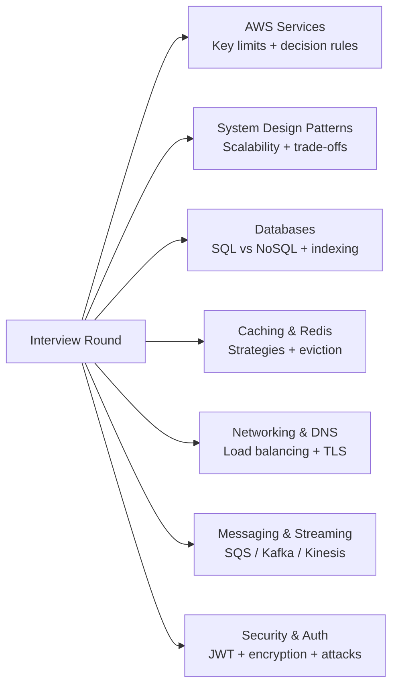

# Cheat Sheets

> **Designed for quick learners.** Scan each cheat sheet to get the critical facts, numbers, and decision rules. Then click through to the full articles for deeper understanding.

---

## How to Use

| Goal | Action |
|------|--------|
| **Before a system design interview** | Scan all 7 cheat sheets — ~20 minutes total |
| **Before AWS SAA-C03 exam** | Focus on AWS + Networking + Databases |
| **When designing a system** | Reference key numbers and trade-off tables |
| **After reading a deep-dive article** | Re-read the cheat sheet as your retention aid |
| **Security round prep** | Security & Auth + AWS security section |

---

## Available Cheat Sheets

| Cheat Sheet | What's Covered | Best For |
|-------------|---------------|----------|
| [☁️ AWS Services](aws) | 20 AWS services, SAA exam tips, key numbers, decision rules | AWS interviews, SAA-C03 cert prep |
| [🏗️ System Design Patterns](system-design) | Scalability patterns, trade-off tables, estimation formulas | System design interviews |
| [🗄️ Databases](databases) | SQL vs NoSQL, indexing, sharding, replication, query patterns | DB-heavy interviews, data-intensive systems |
| [⚡ Caching & Redis](caching) | Cache patterns, Redis data structures, eviction, CDN | Performance optimization Q&A |
| [🌐 Networking & DNS](networking) | Load balancing, DNS, HTTP versions, TLS, WebSockets, CDN | Infrastructure interviews, networking rounds |
| [📬 Messaging & Streaming](messaging) | SQS/SNS/Kafka/Kinesis, async patterns, idempotency | Event-driven architecture Q&A |
| [🔒 Security & Auth](security) | Auth flows, encryption, attack vectors, AWS security | Security rounds, compliance-focused interviews |

---

## Quick Numbers Reference

> The most critical numbers to have memorized. These come up in every estimation and design question.

### Compute & Lambda

| Metric | Value |
|--------|-------|
| Lambda max execution time | **15 minutes** |
| Lambda default concurrency | **1,000** per region (soft limit) |
| Lambda max memory | **10 GB** |
| Lambda cold start (Node/Python) | **~100ms** |
| Lambda cold start (Java) | **~1s+** |
| EC2 Spot instance warning | **2 minutes** before termination |

### Storage & S3

| Metric | Value |
|--------|-------|
| S3 PUT/COPY/POST/DELETE | **3,500 req/s per prefix** |
| S3 GET/HEAD | **5,500 req/s per prefix** |
| S3 max object size | **5 TB** |
| S3 multipart upload threshold | Use for objects **>100 MB** |
| S3 strong consistency | **Immediate** (as of Dec 2020) |
| EBS gp3 max throughput | **1,000 MB/s** |

### Databases

| Metric | Value |
|--------|-------|
| DynamoDB max item size | **400 KB** |
| DynamoDB on-demand max | **~40,000 RCU/WCU** (soft) |
| RDS Multi-AZ failover | **~1–2 minutes** |
| RDS max connections (db.t3.micro) | ~**66** — use RDS Proxy |
| Aurora read replicas | Up to **15** |
| Aurora failover | **~30 seconds** |
| ElastiCache Redis cluster hash slots | **16,384** |

### Messaging & Queues

| Metric | Value |
|--------|-------|
| SQS max message size | **256 KB** |
| SQS Standard throughput | **Unlimited** TPS |
| SQS FIFO throughput | **300 TPS** (3,000 with batching) |
| SQS max retention | **14 days** |
| SQS visibility timeout max | **12 hours** |
| SNS max message size | **256 KB** |
| Kinesis shard write | **1 MB/s** |
| Kinesis shard read (standard) | **2 MB/s shared** |
| Kinesis shard read (enhanced fan-out) | **2 MB/s per consumer** |
| Kinesis max record size | **1 MB** |
| Kinesis default retention | **24 hours** |
| EventBridge default rate | **10,000 events/s** per account |

### Networking & CDN

| Metric | Value |
|--------|-------|
| RTT — same region | **~0.5 ms** |
| RTT — cross-region (US-EU) | **~80–100 ms** |
| RTT — intercontinental | **~150–200 ms** |
| NLB latency | **~100 μs** |
| DNS TTL — standard | **300 s** (5 min) |
| DNS TTL — fast failover | **60 s** |
| TLS 1.2 handshake | **2 RTT** |
| TLS 1.3 handshake | **1 RTT** |
| CloudFront edge locations | **450+** |
| ALB WebSocket idle timeout | Up to **4,000 s** |

### Cost Reference (Know for Trade-off Questions)

| Resource | Cost |
|----------|------|
| NAT Gateway | **$0.045/hr + $0.045/GB** |
| Shield Advanced | **$3,000/month** |
| VPC Peering data transfer | **$0.01/GB** (same region) |
| Data transfer out (S3/EC2) | **$0.09/GB** first 10 TB |
| Lambda invocations | **$0.20 per 1M requests** |
| EventBridge | **$1.00 per 1M events** |
| SNS | **$0.50 per 1M publishes** |

---

## The 5-Minute Interview Prep Checklist

Run through this mentally before your interview and during the design:

- [ ] **Clarify requirements** — functional (what it does) and non-functional (scale, latency, consistency, availability)
- [ ] **Estimate scale** — QPS, DAU, storage/day, bandwidth — back-of-envelope first
- [ ] **Choose SQL vs NoSQL** — SQL for ACID + complex queries, NoSQL for scale + flexible schema
- [ ] **Add caching layer** — Redis/ElastiCache if read-heavy or low-latency required
- [ ] **Add message queue** — SQS/Kafka if decoupling, async processing, or spiky load
- [ ] **Consider multi-region** — active-passive (Route 53 failover) or active-active for global apps
- [ ] **Mention CDN** — CloudFront for static assets, media, or global content delivery
- [ ] **Discuss failure modes** — what happens when each component fails? How does the system recover?
- [ ] **Mention observability** — metrics (CloudWatch), tracing (X-Ray), logs (CloudWatch Logs/OpenSearch)
- [ ] **Security basics** — auth (JWT/session), encryption at rest (KMS) and in transit (TLS), least privilege IAM

---

## Common Interview Trade-off Questions

| Question | Short Answer |
|----------|-------------|
| SQL vs NoSQL? | SQL = ACID + relations. NoSQL = scale + flexibility. Use SQL as default, NoSQL for scale or schema flexibility |
| Cache-aside vs write-through? | Cache-aside = read-heavy. Write-through = write-heavy + consistency needed |
| SQS vs Kafka? | SQS = managed, simple. Kafka = replay + ordering + high throughput |
| JWT vs sessions? | JWT = stateless, microservices. Sessions = instant revocation, traditional apps |
| AP vs CP (CAP)? | AP = availability + partition tolerance (most web apps). CP = consistency (banking, inventory) |
| Sharding vs replication? | Replication = availability + read scale. Sharding = write scale + data volume |
| L4 vs L7 load balancer? | L4 = ultra-low latency, static IP, non-HTTP. L7 = content routing, WAF, gRPC |
| Sync vs async? | Sync = simple, immediate feedback. Async = scale, resilience, decoupling |
| Monolith vs microservices? | Monolith first (simpler). Microservices when teams and scaling demands justify complexity |
| Push vs pull (CDN)? | Pull CDN = simpler, self-managing. Push CDN = large files, predictable traffic |
