> **📅 Spaced Repetition Schedule**
> Use this cheat sheet on a 4-interval cycle for maximum retention:
> - **Day 0** — Read it fully (20–30 min)
> - **Day 3** — Skim headers, cover answers, test yourself
> - **Day 10** — Quiz yourself on the "Trap" entries without looking
> - **Day 30** — Quick scan for gaps; revisit any you missed

---

# Messaging & Streaming Cheat Sheet

> Key facts for event-driven architecture interviews. Patterns, numbers, and decision rules only.

---

## 1. Messaging Patterns — Decision Table

| Pattern | AWS Tool | When to Use |
|---------|----------|-------------|
| **Work Queue** | SQS Standard | One consumer pool, at-least-once, order doesn't matter |
| **FIFO Queue** | SQS FIFO | Order required, exactly-once processing, **300 TPS** |
| **Pub/Sub Push** | SNS | Push to multiple endpoints (Lambda, email, SMS, HTTP) |
| **Fan-out** | SNS → SQS | Multiple consumers, different processing rates, decouple |
| **Event Bus** | EventBridge | Cross-account, complex routing, 90+ AWS service sources |
| **Stream** | Kinesis Data Streams | Ordered, replay, real-time analytics, multiple consumers |
| **High-throughput Topic** | Kafka / MSK | Millions/sec, long retention, replay, consumer groups |
| **Job Scheduling** | EventBridge Scheduler | Cron or one-time future invocations |

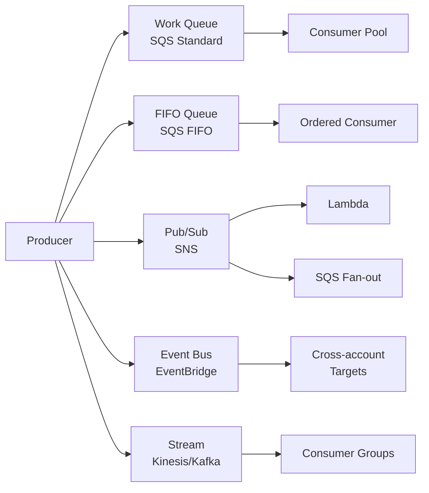

---

## 2. SQS Quick Reference

### Standard vs FIFO

| | SQS Standard | SQS FIFO |
|-|-------------|----------|
| **Throughput** | **Unlimited** TPS | **300 TPS** (3,000 with batching) |
| **Ordering** | Best-effort | **Strict FIFO** within message group |
| **Delivery** | **At-least-once** (duplicates possible) | **Exactly-once** |
| **Deduplication** | Not supported | 5-minute deduplication window |
| **Cost** | Lower | Higher |
| **Use** | Email sends, log processing | Financial transactions, inventory updates |

### Key SQS Concepts

| Concept | Detail |
|---------|--------|
| **Visibility timeout** | Message hidden during processing — default **30s**, max **12 hours**. Set > max processing time |
| **Dead-letter queue (DLQ)** | After `maxReceiveCount` failures → route to DLQ for debugging. **Always configure a DLQ** |
| **Long polling** | `WaitTimeSeconds=20` — waits up to 20s for a message. Reduces empty receives = **cheaper** |
| **Short polling** | Returns immediately even if empty — wasteful, avoid |
| **Delay queue** | `DelaySeconds` (0–900s) — message invisible after send. Use for scheduled retries |
| **Message retention** | 1 min to **14 days** (default **4 days**) |
| **Max message size** | **256 KB** (use S3 + pointer for larger) |
| **Batch** | Up to **10 messages** per receive/delete call |

**Trap:** If visibility timeout expires before processing finishes, message becomes visible again → duplicate processing. Solution: extend timeout during processing or set it generously.

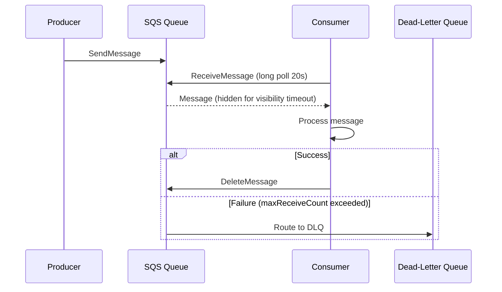

---

## 3. SNS Quick Reference

| Concept | Detail |
|---------|--------|
| **Push model** | SNS pushes to subscribers — no polling needed |
| **Subscribers** | Lambda, SQS, HTTP/S, Email, SMS, mobile push |
| **Message filtering** | Filter policies on attributes → subscribers only get relevant messages |
| **Fan-out pattern** | SNS topic → multiple SQS queues = decoupled parallel processing |
| **FIFO topic** | Ordered, deduplication — **SQS FIFO subscribers only** |
| **Max message size** | **256 KB** |
| **Message delivery retries** | HTTP: 3 attempts with exponential backoff |

**Fan-out use case:** Order placed → SNS → SQS(inventory), SQS(shipping), SQS(email) — each processes independently.

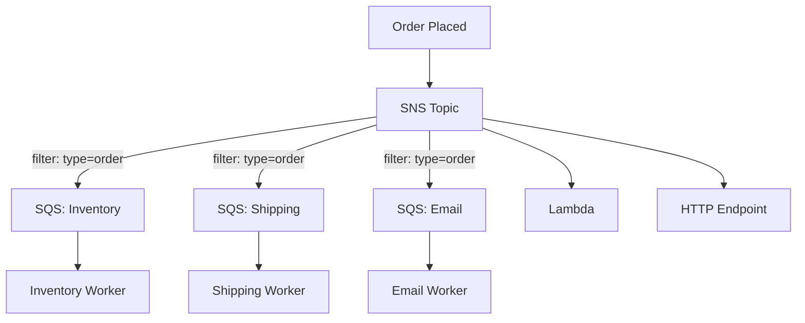

---

## 4. EventBridge vs SNS

| | EventBridge | SNS |
|-|-------------|-----|
| **Routing** | **Content-based rules** (event fields, patterns) | Attribute filter policies |
| **Cross-account** | **Yes** (event bus to bus) | No |
| **AWS sources** | **90+ native** integrations | Custom events only |
| **Schema registry** | **Yes** — auto-infer + validate | No |
| **Archive + replay** | **Yes** — replay past events | No |
| **Cost** | Higher ($1/million events) | Lower ($0.50/million) |
| **Targets** | 20+ AWS services | Fewer targets |
| **Latency** | ~500ms typical | Lower |

**Use EventBridge when:** cross-account routing, complex filtering logic, AWS service events (CodePipeline, GuardDuty, etc.), schema validation, event replay needed.
**Use SNS when:** simple fan-out, cost-sensitive, low latency push required.

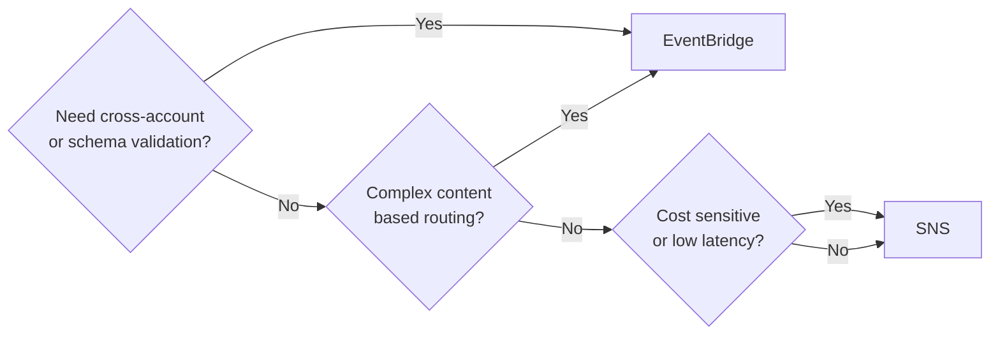

---

## 5. Kafka Quick Reference

### Core Concepts

| Concept | What It Is |
|---------|-----------|
| **Topic** | Named log/channel — like an SNS topic but durable |
| **Partition** | Ordered, append-only log — unit of parallelism. **Partition count = max consumer parallelism** |
| **Offset** | Position within a partition — consumer tracks its own offset |
| **Consumer group** | Group sharing a topic — **each partition assigned to one consumer** in the group |
| **Broker** | Single Kafka server — multiple = cluster |
| **Replication factor** | Copies of each partition across brokers — **3 is standard** |
| **ISR** | In-sync replicas — replicas caught up with leader |

### Partition Key → Ordering

```
ProducerRecord(topic, key="user_123", value="event")
  → hash(key) % numPartitions → same partition
  → same consumer → ordered processing per user
```

**Ordering is only guaranteed within a partition.** No cross-partition ordering.

### Key Numbers

| Metric | Value |
|--------|-------|
| **Retention** | Default **7 days**, configurable up to forever |
| **Throughput per partition** | Limited by disk I/O — typically **~100 MB/s** |
| **Max message size** | Default **1 MB** (configurable) |
| **Replication lag** | Typically **<10ms** in healthy cluster |

### Kafka vs SQS

| | Kafka | SQS |
|-|-------|-----|
| **Ordering** | Per partition | FIFO only with SQS FIFO |
| **Replay** | **Yes** — retain and re-consume | No — once consumed, gone |
| **Consumer model** | Pull (consumer controls pace) | Pull (long polling) |
| **Multiple consumers** | **Yes** — different offsets | No — competing consumers |
| **Operations** | Self-managed or MSK | Fully managed |
| **Throughput** | Millions/sec | SQS Standard: unlimited, FIFO: 3K TPS |
| **Cost** | Higher (infra) | Pay per message |

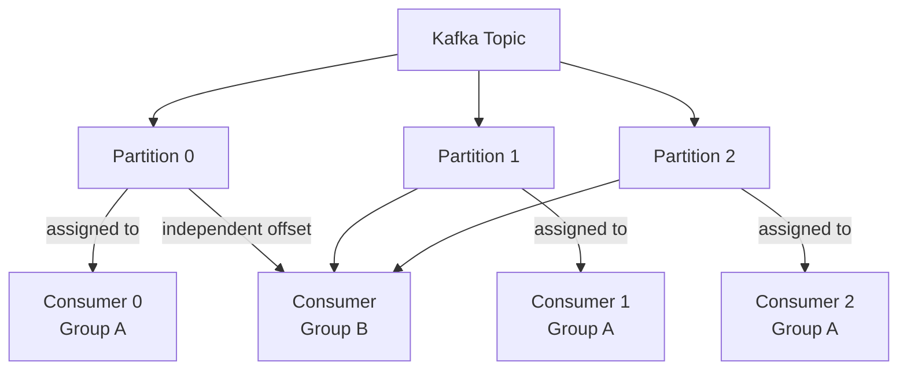

---

## 6. Kinesis Quick Reference

### Kinesis Data Streams

| Concept | Detail |
|---------|--------|
| **Shard** | Unit of capacity — **1 MB/s write, 2 MB/s read** per shard |
| **Enhanced fan-out** | **2 MB/s per consumer** per shard (dedicated throughput, push-based) |
| **Partition key** | Determines shard — use high-cardinality keys to avoid hot shards |
| **Retention** | Default **24h**, up to **365 days** |
| **Max record size** | **1 MB** |
| **Max shards** | **500 per account** (can request increase) |
| **Ordering** | Within shard only |

**Hot shard trap:** If partition key has low cardinality (e.g., country code), all traffic goes to same shard → throttling. Use high-cardinality keys or random suffix.

### Kinesis Services Comparison

| Service | Use Case | Code Required |
|---------|----------|---------------|
| **Data Streams** | Custom processing, multiple consumers, replay | Yes |
| **Firehose** | Delivery to S3/Redshift/OpenSearch/Splunk | **Zero code** |
| **Data Analytics** | Real-time SQL (Apache Flink) on streams | SQL/Flink |

### Kinesis vs Kafka

| | Kinesis | Kafka (MSK) |
|-|---------|-------------|
| **Operations** | Fully managed | Managed but more config |
| **Shard limit** | **500/account** (soft) | No hard partition limit |
| **Retention** | Max **365 days** | Unlimited |
| **Replay** | Yes (within retention) | Yes |
| **Cost** | Per shard-hour | Per broker |

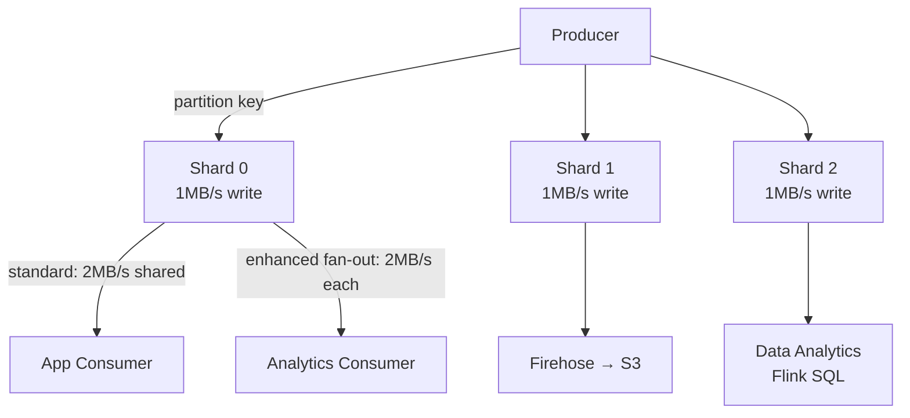

---

## 7. Async Patterns

### Outbox Pattern
```
BEGIN TRANSACTION
  INSERT INTO orders (...)
  INSERT INTO outbox (event_type, payload, status='pending')
COMMIT

-- Background worker:
  SELECT * FROM outbox WHERE status='pending'
  → publish to Kafka/SQS
  → UPDATE outbox SET status='published'
```
**Why:** Guarantees DB write and event publish are atomic — no lost events on crash.

### Saga Pattern

| Type | How | When |
|------|-----|------|
| **Choreography** | Services emit events, react to each other's events | Simple flows, loose coupling |
| **Orchestration** | Central coordinator calls each service | Complex flows, easier to monitor |

Both handle distributed transactions without 2PC. Each step has a compensating transaction for rollback.

### CQRS

```
Write path: Command → Command Handler → Write DB → Event
Read path:  Event → Projection Builder → Read DB (optimized)
Query:      Read DB (no joins needed — denormalized)
```
**Use when:** Read/write patterns differ significantly, need multiple read models, high read load.

### Event Sourcing
- Store **events** (not current state)
- Replay events to rebuild state
- Append-only log — full audit trail
- Tradeoff: complex queries, eventual consistency, large storage over time

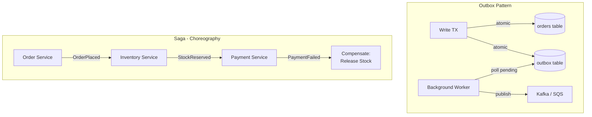

---

## 8. Idempotency

**Why:** At-least-once delivery = duplicates are normal. Your consumer MUST be idempotent.

### Implementation Options

| Approach | How | Where |
|----------|-----|-------|
| **Idempotency key** | UUID per operation in request header | API Gateway, payment processing |
| **Redis SETNX** | `SETNX key 1 EX 86400` — only first request wins | High-throughput dedup |
| **DB unique constraint** | `UNIQUE(idempotency_key)` — duplicate throws error | Transactional systems |
| **Conditional writes** | DynamoDB condition expressions | NoSQL dedup |

```
# Redis idempotency check
result = redis.SET(f"idem:{idempotency_key}", 1, NX=True, EX=86400)
if result is None:
    return cached_response  # duplicate
# process request...
```

**TTL on idempotency keys:** Set based on retry window (e.g., 24h for payments).

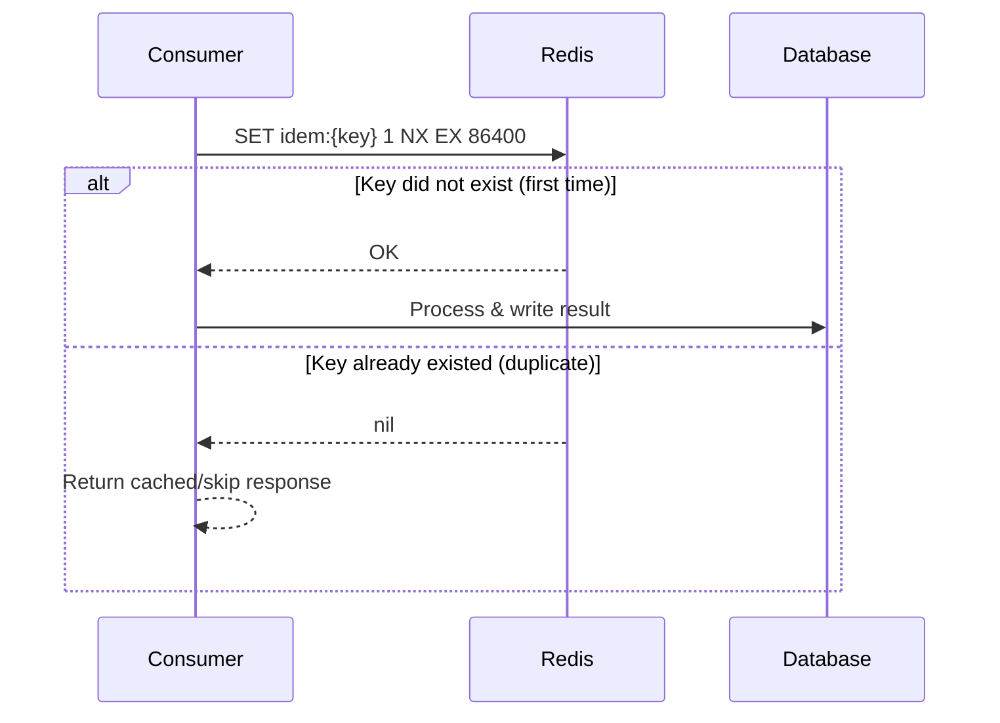

---

## 9. Message Ordering Guarantees Summary

| System | Ordering Guarantee |
|--------|--------------------|
| SQS Standard | Best-effort (no guarantee) |
| SQS FIFO | **Strict order within message group** |
| SNS | No ordering |
| EventBridge | No ordering |
| Kinesis | **Within shard** |
| Kafka | **Within partition** |
| DynamoDB Streams | Per partition key (shard) |

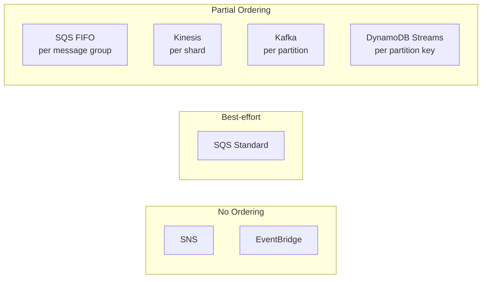

---

## 10. Key Messaging Numbers

| Metric | Value |
|--------|-------|
| **SQS max message size** | **256 KB** |
| **SQS FIFO throughput** | **300 TPS** (3,000 with batching) |
| **SQS Standard throughput** | Unlimited |
| **SQS max retention** | **14 days** |
| **SQS visibility timeout max** | **12 hours** |
| **SQS batch size** | **10 messages** |
| **SNS max message size** | **256 KB** |
| **Kinesis shard write** | **1 MB/s** |
| **Kinesis shard read (standard)** | **2 MB/s shared** across consumers |
| **Kinesis shard read (enhanced)** | **2 MB/s per consumer** |
| **Kinesis max record** | **1 MB** |
| **Kinesis default retention** | **24 hours** |
| **Kafka default retention** | **7 days** |
| **EventBridge default rate** | **10,000 events/s** per account |

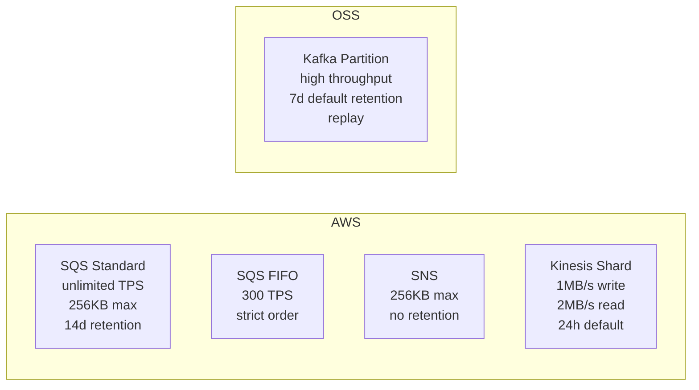

---

[Deep dive: SQS / SNS / EventBridge →](../12-interview-prep/quick-reference/aws-cloud/sqs-sns-eventbridge)
[Deep dive: Kinesis Streaming →](../12-interview-prep/quick-reference/aws-cloud/kinesis-streaming)

---

## 11. Kafka Partition Sizing Formula

**Kafka Partition Sizing** — formula to right-size partitions for throughput and consumer parallelism.

| | Under-partitioned | Over-partitioned |
|-|-------------------|------------------|
| **Symptom** | Consumer lag grows, throughput ceiling hit | Excessive rebalancing, high metadata overhead |
| **Risk** | Producer back-pressure | Zookeeper/controller overload |
| **Fix** | Increase partitions (one-time, no data loss) | Merge topics or reduce retention |

```
partitions = max(
  throughput_MB_s / producer_MB_s_per_partition,
  consumer_count
)
```

- **Key number:** Sweet spot is **100–500 partitions per broker**; beyond 4,000 partitions per cluster degrades controller performance.
- **Decision:** Use partition count = consumer count when consumer throughput is the bottleneck / use throughput formula when producer throughput is the bottleneck.
- **Trap:** Adding partitions is a one-way operation for a topic — you can increase but not decrease without recreating the topic. Over-provisioning is safer than under.

---

## 12. Dead Letter Queue (DLQ) Design

**Dead Letter Queue** — holding queue for messages that failed processing after max retries.

| | Retry in-queue | DLQ | Discard |
|-|----------------|-----|---------|
| **When** | Transient error (network, timeout) | Persistent/logic error after N retries | Stale / irrelevant data |
| **Risk** | Queue head-of-line blocking | Messages pile up unnoticed | Data loss |
| **Monitoring** | Consumer error rate | DLQ depth alarm | Loss metrics |

- **Key number:** Route to DLQ after **3 retries** with exponential backoff — **1s, 2s, 4s**; total wait ≈ 7s before DLQ.
- **Decision:** Retry when failure is transient (DB blip, downstream timeout) / DLQ when failure is deterministic (schema mismatch, business rule violation).
- **Trap:** No alarm on DLQ depth — messages silently accumulate for days. Always set a CloudWatch / Datadog alarm when DLQ depth > 0.

---

## 13. Exactly-Once Semantics

**Exactly-Once Semantics** — guarantee each message is processed exactly once, not zero or more times.

| | At-most-once | At-least-once | Exactly-once |
|-|-------------|---------------|--------------|
| **Delivery** | Drop on failure | Retry until ack | Idempotent + transactional |
| **Duplicates** | None | Possible | None |
| **Throughput** | Highest | High | **~30% lower** |
| **Complexity** | Low | Medium | High |
| **Kafka API** | acks=0 | acks=all, no idempotent | `enable.idempotence=true` + transactions |

```
# Kafka exactly-once producer config
enable.idempotence=true
acks=all
transactional.id=<unique-per-producer>
max.in.flight.requests.per.connection=5
```

- **Key number:** Exactly-once adds **~30% throughput overhead** vs at-least-once due to two-phase commit across producer + broker.
- **Decision:** Use exactly-once for financial ledgers, inventory deductions / use at-least-once + idempotent consumer for most event pipelines (cheaper).
- **Trap:** Enabling `enable.idempotence=true` alone is NOT exactly-once end-to-end — it only covers producer → broker. Consumer must also be idempotent or use Kafka transactions.

---

## 14. Kafka Streams vs Flink vs Spark Streaming

**Stream Processing Frameworks** — comparison of latency, state, and operational complexity.

| | Kafka Streams | Apache Flink | Spark Structured Streaming |
|-|--------------|--------------|---------------------------|
| **Latency** | **~10ms** | **~10ms** | **1–5 seconds** |
| **State management** | RocksDB local state | RocksDB + remote checkpoint | Spark memory / external store |
| **Fault tolerance** | Kafka changelog topic | Distributed snapshots (Chandy-Lamport) | WAL + RDD lineage |
| **Deployment** | Embedded in app, no cluster | Separate Flink cluster | Spark cluster (YARN/K8s) |
| **Exactly-once** | Yes (with Kafka transactions) | Yes (native) | Yes (with idempotent sinks) |
| **Learning curve** | Low (Java lib) | High (custom DSL, cluster ops) | Medium (Spark SQL familiar) |
| **Best for** | Kafka-native microservices | Complex event processing, ML pipelines | Batch + streaming unified, SQL analytics |

- **Key number:** Kafka Streams and Flink both achieve **~10ms** end-to-end latency; Spark Streaming is **1–5s** (micro-batch model).
- **Decision:** Use Kafka Streams when your team already runs Kafka and needs lightweight stateful processing / use Flink for complex CEP or sub-10ms SLA / use Spark when you need unified batch + stream SQL.
- **Trap:** Kafka Streams scales only as far as your partition count — if you need more parallelism than partitions, you must repartition first.

---

## 15. Message Ordering Guarantees

**Message Ordering** — scoped guarantees; global ordering is impossible at production scale.

| | Scope | Max Throughput | Mechanism |
|-|-------|---------------|-----------|
| **Kafka** | Per partition | Partition I/O limit (~100 MB/s) | Producer key → consistent partition |
| **SQS FIFO** | Per message group ID | 300 TPS (3K batched) | Group ID serializes consumers |
| **Kinesis** | Per shard | 1 MB/s write per shard | Partition key → shard |
| **Global ordering** | All messages | **Single partition ceiling** | Not viable at scale |

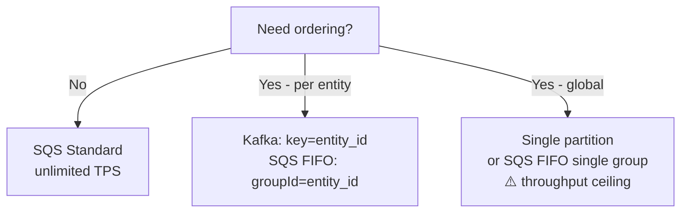

- **Key number:** Global ordering requires a **single partition** (or single FIFO group) — throughput ceiling is one partition's I/O (~100 MB/s Kafka, 300 TPS SQS FIFO).
- **Decision:** Use per-entity ordering (partition key = user_id / order_id) for 99% of cases / accept global ordering only when business truly requires total ordering (rare).
- **Trap:** Developers add ordering requirements "just in case" — this forces single-partition design and kills horizontal scalability. Challenge every global ordering requirement.

---

## 16. Outbox Pattern

**Outbox Pattern** — solves dual-write atomicity between DB state and event publishing.

| | Naive dual-write | Outbox pattern | CDC-based outbox |
|-|-----------------|----------------|-----------------|
| **Atomicity** | ❌ Race condition | ✅ Single DB transaction | ✅ Single DB transaction |
| **Publisher** | App writes to queue directly | Polling worker reads outbox | Debezium / CDC reads WAL |
| **Latency** | Low (direct) | Medium (poll interval) | Low (WAL tail ~ms) |
| **Operational overhead** | Low setup, high failure risk | Medium (worker to maintain) | High (CDC infra) |
| **Missed events on crash** | Yes | No | No |

```
-- Every business write includes:
BEGIN TRANSACTION
  INSERT INTO orders (id, status, ...) VALUES (...)
  INSERT INTO outbox (id, aggregate_type, event_type, payload)
    VALUES (uuid(), 'ORDER', 'OrderPlaced', '{...}')
COMMIT

-- Outbox publisher (polling):
SELECT * FROM outbox WHERE published=false ORDER BY created_at LIMIT 100
→ publish each to Kafka/SQS
→ UPDATE outbox SET published=true WHERE id IN (...)
```

- **Key number:** Outbox adds exactly **1 extra DB write per business event** — negligible overhead vs guaranteed delivery.
- **Decision:** Use polling publisher when CDC infra is unavailable and latency of seconds is acceptable / use CDC (Debezium) when sub-second event latency is required.
- **Trap:** Polling the outbox table without an index on `(published, created_at)` causes full table scans at scale. Always add a partial index on unpublished rows.

---
