# Networking & DNS Cheat Sheet

> Scan this before infrastructure or system design interviews. Key numbers, decisions, and traps only.

---

## 1. OSI Model — Interview-Relevant Layers

| Layer | Name | What Happens | Protocols | AWS Service |
|-------|------|-------------|-----------|-------------|
| **3** | Network | IP routing, packets | IP, ICMP | VPC routing |
| **4** | Transport | Ports, reliability, flow control | TCP, UDP | **NLB** |
| **7** | Application | HTTP, TLS termination, routing rules | HTTP/S, gRPC, WebSocket | **ALB, API Gateway** |

**L4 vs L7 Decision:**
- **L4 (NLB):** ~**100μs** latency, no content inspection, TCP/UDP passthrough, static IPs, PrivateLink — use for ultra-low latency, non-HTTP protocols, static IP requirement
- **L7 (ALB):** content-based routing, host/path rules, SSL termination, WAF integration, gRPC/WebSocket support — use for HTTP/HTTPS workloads

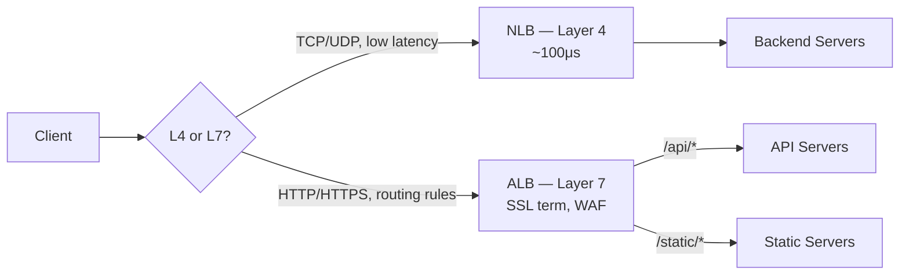

---

## 2. Load Balancing

### Algorithms

| Algorithm | Best For | Trap |
|-----------|----------|------|
| **Round Robin** | Equal-cost requests | Bad for long-running requests |
| **Least Connections** | Unequal request durations | Requires connection tracking overhead |
| **IP Hash** | Sticky sessions without cookies | Unequal distribution if few clients |
| **Weighted Round Robin** | Canary deploys, A/B testing | Must update weights manually |
| **Power of Two Choices** | General purpose, better than RR | Slightly more complex |

### Health Checks
- **TCP:** just checks port is open — passes even if app is broken
- **HTTP:** sends GET, expects `200 OK` — verifies app is responding
- **HTTPS:** cert validity + `200 OK` — full end-to-end check

### Session Affinity
- **Sticky cookies:** ALB sets `AWSALB` cookie — routes same client to same target
- **Stateless (preferred):** store sessions in **Redis/ElastiCache** — any server can handle any request
- Trap: sticky sessions break when instances scale in or restart

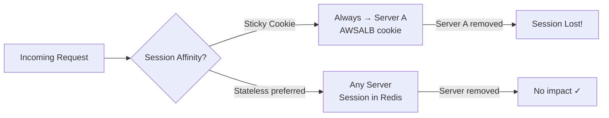

---

## 3. DNS Resolution Flow

```
Browser cache → OS cache → Recursive Resolver → Root NS → TLD NS (.com) → Authoritative NS (Route 53)
```

**TTL trade-offs:**
- **Low TTL (60s):** fast failover, more DNS queries (higher cost)
- **High TTL (86400s):** fewer queries (cheaper), slow failover
- **Standard:** 300s (5 min) for most records

### Record Types

| Type | Purpose | Example | Notes |
|------|---------|---------|-------|
| **A** | IPv4 address | `api.example.com → 1.2.3.4` | |
| **AAAA** | IPv6 address | `api.example.com → ::1` | |
| **CNAME** | Alias to another name | `www → api.example.com` | Cannot use at apex domain |
| **Alias** | AWS alias (Route 53 only) | `example.com → ALB DNS` | **Free, supports apex domain** |
| **MX** | Mail server | priority + mail host | |
| **TXT** | Verification, SPF, DKIM | `v=spf1 include:...` | |
| **NS** | Name server delegation | hosted zone NS records | |

**Alias vs CNAME:** Alias = free, apex domain support (`example.com`), auto-follows ALB/CloudFront/S3 IP changes. CNAME = paid queries, cannot use at root domain. **Always use Alias for ALB/CloudFront/S3 website endpoints.**

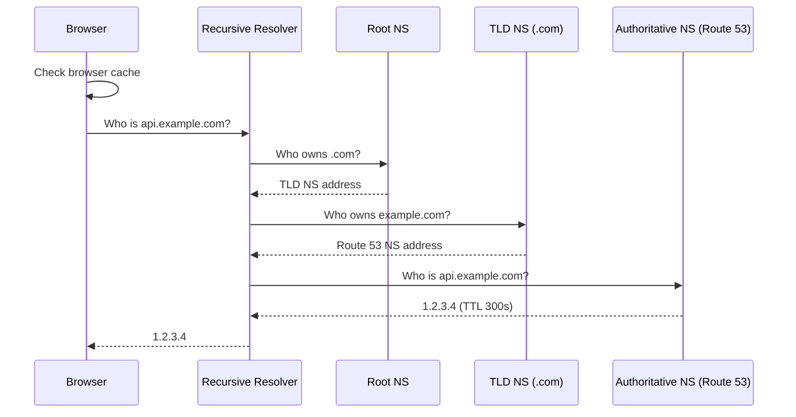

### Route 53 Routing Policies

| Policy | Use Case |
|--------|----------|
| **Simple** | One record, single value |
| **Weighted** | A/B testing, traffic splitting |
| **Latency** | Route to lowest-latency region |
| **Failover** | Primary/secondary with health checks |
| **Geolocation** | Compliance, localized content |
| **Geoproximity** | Shift traffic by geography + bias |
| **Multi-value** | Return multiple IPs (basic LB, not a replacement for ALB) |

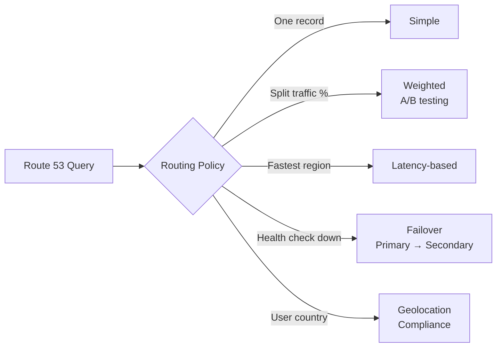

---

## 4. HTTP Protocol Quick Reference

| Version | Key Feature | Limitation |
|---------|-------------|------------|
| **HTTP/1.1** | Persistent connections | **Head-of-line blocking** — 1 request at a time per connection |
| **HTTP/2** | **Multiplexing**, header compression, server push | HOL blocking at TCP level |
| **HTTP/3** | **QUIC (UDP-based)**, 0-RTT, eliminates HOL blocking at all levels | Newer, less firewall support |
| **gRPC** | HTTP/2 + binary protobuf, streaming, strongly typed | Not human-readable, requires proto files |

### Status Codes — Interview Relevant

| Code | Meaning | Notes |
|------|---------|-------|
| **200** | OK | |
| **201** | Created | POST success |
| **204** | No Content | DELETE success (no body) |
| **301** | Moved Permanently | **Browser caches redirect** |
| **302** | Found | Temporary redirect, not cached |
| **304** | Not Modified | ETag/Last-Modified match — serve from browser cache |
| **400** | Bad Request | Client sent invalid data |
| **401** | Unauthorized | **Not authenticated** (no/invalid credentials) |
| **403** | Forbidden | **Authenticated but not authorized** |
| **404** | Not Found | |
| **409** | Conflict | Duplicate resource, concurrency conflict |
| **429** | Too Many Requests | Rate limit hit — include `Retry-After` header |
| **500** | Internal Server Error | Unhandled server error |
| **502** | Bad Gateway | Upstream returned invalid response |
| **503** | Service Unavailable | Overloaded or down — include `Retry-After` |
| **504** | Gateway Timeout | Upstream didn't respond in time |

**401 vs 403:** 401 = "I don't know who you are." 403 = "I know who you are, but no."

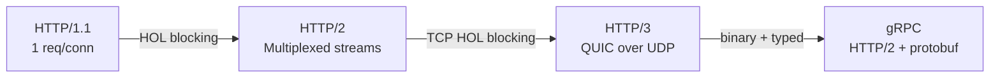

---

## 5. TCP vs UDP

| | TCP | UDP |
|-|-----|-----|
| **Reliability** | Guaranteed delivery, retransmission | Best effort, no retransmission |
| **Ordering** | In-order delivery | No ordering guarantee |
| **Connection** | 3-way handshake required | No handshake |
| **Overhead** | Higher (acks, sequence numbers) | Lower |
| **Use cases** | HTTP, databases, SSH, file transfer | DNS, video streaming, VoIP, gaming |
| **Latency** | Higher | Lower |
| **Flow control** | Yes (prevents overwhelming receiver) | No |

**TCP 3-way handshake:** SYN → SYN-ACK → ACK (~1 RTT before first byte)

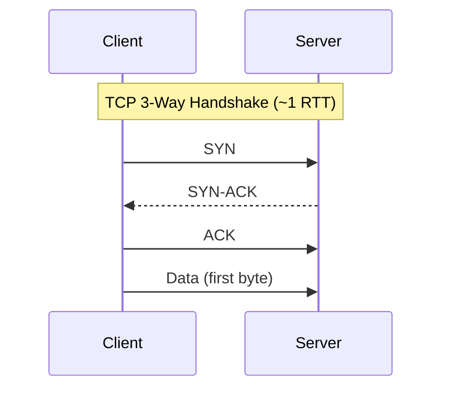

---

## 6. TLS / HTTPS

**TLS handshake cost:**
- TLS 1.2: **2 RTT** before data flows
- TLS 1.3: **1 RTT** (0-RTT for session resumption)

| Concept | Detail |
|---------|--------|
| **TLS 1.3** | Default, ECDHE key exchange, **forward secrecy** — past traffic safe if key compromised later |
| **Certificate types** | DV (domain only), OV (org verified), EV (extended — browser trust indicator) |
| **SSL termination** | Terminate at ALB → backend gets plain HTTP. Faster, but no end-to-end encryption |
| **SSL passthrough** | NLB passes encrypted traffic to backend — end-to-end encryption, but no LB-level inspection |
| **mTLS** | Both client AND server present certs — **microservices auth**, zero-trust networks |
| **HSTS** | `Strict-Transport-Security` header — browser enforces HTTPS, prevents downgrade attacks |

**Forward secrecy:** Use ephemeral keys (ECDHE). Even if private key is stolen later, past sessions cannot be decrypted.

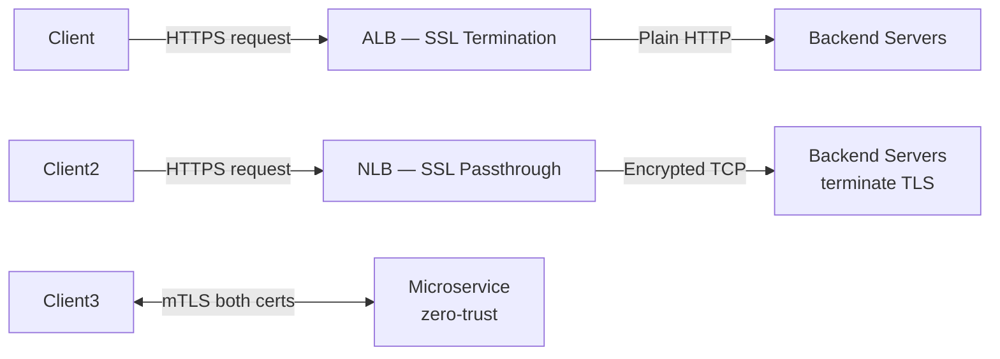

---

## 7. WebSockets & Real-Time

| Concept | Detail |
|---------|--------|
| **WebSocket** | Full-duplex, persistent TCP connection, HTTP Upgrade handshake |
| **When to use** | Chat, live updates, collaborative editing, gaming, real-time dashboards |
| **When NOT to use** | Simple request/response (use HTTP), server push only (use SSE) |
| **ALB support** | Yes — idle timeout up to **4000s**, must enable sticky sessions for WS |
| **NLB support** | Better for very long-lived connections — TCP passthrough, no timeout issues |
| **Scaling** | Sticky sessions OR centralize state in **Redis Pub/Sub** — any server handles disconnect/reconnect |

**SSE vs WebSocket:** SSE = server-push only (simpler), WebSocket = bidirectional (heavier).

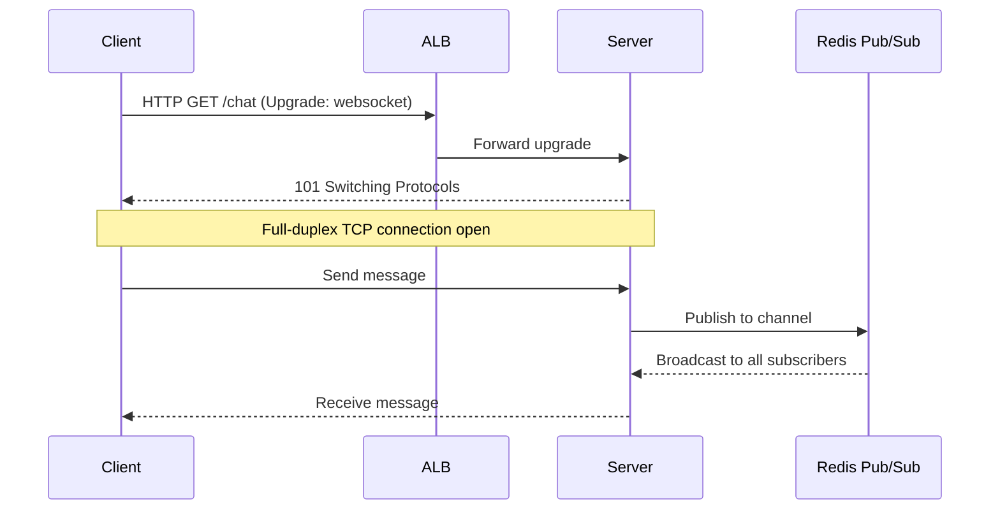

---

## 8. CDN & Edge Caching

| Service | Edge Locations | Notes |
|---------|---------------|-------|
| **CloudFront** | **450+** | AWS-native, integrates with S3/ALB/API GW |
| **Cloudflare** | 200+ | Independent CDN, DDoS protection, Workers |

**Cache hit ratio: target 85%+.** Low ratio = origin overwhelmed — check TTL and cache keys.

### Cache-Control Headers

| Header | Scope | Meaning |
|--------|-------|---------|
| `max-age=3600` | Browser + CDN | Cache for 3600s |
| `s-maxage=3600` | CDN only | Override max-age for CDN |
| `no-cache` | Both | Must revalidate with origin before using cached |
| `no-store` | Both | Never cache — private/sensitive data |
| `private` | Browser only | CDN must not cache (user-specific content) |

**Cache busting:** content hash in filename (`bundle.a1b2c3.js`) > query string (`?v=123`) > neither

### CloudFront Behaviors
- **Cache key:** URL + query strings + headers + cookies you configure
- **Lambda@Edge:** A/B testing, auth at edge, request/response transformation, redirects
- **Origin Shield:** extra caching layer between CloudFront and origin — reduces origin load

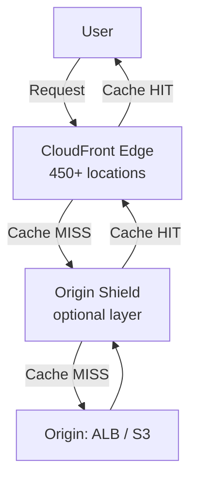

---

## 9. Rate Limiting — Where to Place It

| Layer | Tool | Purpose |
|-------|------|---------|
| **Edge / WAF** | CloudFront + WAF, Cloudflare | DDoS protection, geographic blocks, bot mitigation |
| **API Gateway** | AWS API GW throttling, usage plans | Per-route, per-API-key quotas |
| **Application** | Redis INCR + EXPIRE, token bucket | Business logic — user tiers, per-resource limits |
| **Database** | `max_connections`, connection pools | Protect DB from connection exhaustion |

**Algorithms:**
- **Token bucket:** allows bursts up to bucket size — most common
- **Leaky bucket:** smooths traffic, no bursts — use for strict rate enforcement
- **Fixed window:** simple but edge-of-window burst problem
- **Sliding window:** accurate, more memory — use Redis sorted sets

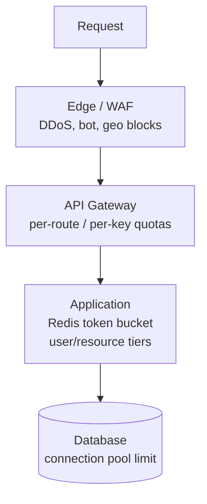

---

## 10. Key Networking Numbers

| Metric | Value | Notes |
|--------|-------|-------|
| **RTT — same region** | **~0.5ms** | Same AZ even lower |
| **RTT — cross-region (US-EU)** | **~80-100ms** | |
| **RTT — intercontinental** | **~150-200ms** | US-Asia |
| **DNS TTL — fast failover** | **60s** | More DNS queries, higher cost |
| **DNS TTL — standard** | **300s** | 5 minutes |
| **DNS TTL — static content** | **86400s** | 24 hours |
| **DNS propagation** | Up to TTL seconds | Not instant after change |
| **HTTP connection timeout** | 3–10s | |
| **HTTP read timeout** | 30s | |
| **HTTP total timeout** | 60s | |
| **ALB WebSocket idle timeout** | Up to **4000s** | |
| **NLB latency** | **~100μs** | |
| **TLS 1.2 handshake** | **2 RTT** | Before first byte |
| **TLS 1.3 handshake** | **1 RTT** | 0-RTT for resumption |
| **CloudFront edge locations** | **450+** | |

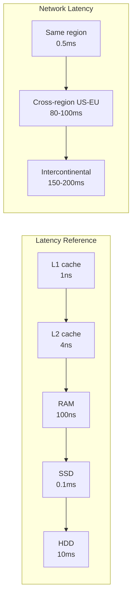

---

[Deep dive: Load Balancers →](../12-interview-prep/quick-reference/aws-cloud/load-balancer)
[Deep dive: Route 53 & DNS →](../12-interview-prep/quick-reference/aws-cloud/route53-dns)
[Deep dive: CloudFront CDN →](../12-interview-prep/quick-reference/aws-cloud/cloudfront-cdn)
