> **📅 Spaced Repetition Schedule**
> Use this cheat sheet on a 4-interval cycle for maximum retention:
> - **Day 0** — Read it fully (20–30 min)
> - **Day 3** — Skim headers, cover answers, test yourself
> - **Day 10** — Quiz yourself on the "Trap" entries without looking
> - **Day 30** — Quick scan for gaps; revisit any you missed

---

# Networking & DNS Cheat Sheet

> Scan this before infrastructure or system design interviews. Key numbers, decisions, and traps only.

---

## 1. OSI Model — Interview-Relevant Layers

| Layer | Name | What Happens | Protocols | AWS Service |
|-------|------|-------------|-----------|-------------|
| **3** | Network | IP routing, packets | IP, ICMP | VPC routing |
| **4** | Transport | Ports, reliability, flow control | TCP, UDP | **NLB** |
| **7** | Application | HTTP, TLS termination, routing rules | HTTP/S, gRPC, WebSocket | **ALB, API Gateway** |

**L4 vs L7 Decision:**
- **L4 (NLB):** ~**100μs** latency, no content inspection, TCP/UDP passthrough, static IPs, PrivateLink — use for ultra-low latency, non-HTTP protocols, static IP requirement
- **L7 (ALB):** content-based routing, host/path rules, SSL termination, WAF integration, gRPC/WebSocket support — use for HTTP/HTTPS workloads

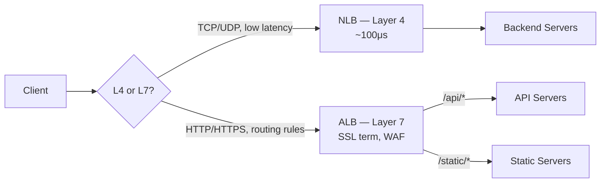

---

## 2. Load Balancing

### Algorithms

| Algorithm | Best For | Trap |
|-----------|----------|------|
| **Round Robin** | Equal-cost requests | Bad for long-running requests |
| **Least Connections** | Unequal request durations | Requires connection tracking overhead |
| **IP Hash** | Sticky sessions without cookies | Unequal distribution if few clients |
| **Weighted Round Robin** | Canary deploys, A/B testing | Must update weights manually |
| **Power of Two Choices** | General purpose, better than RR | Slightly more complex |

### Health Checks
- **TCP:** just checks port is open — passes even if app is broken
- **HTTP:** sends GET, expects `200 OK` — verifies app is responding
- **HTTPS:** cert validity + `200 OK` — full end-to-end check

### Session Affinity
- **Sticky cookies:** ALB sets `AWSALB` cookie — routes same client to same target
- **Stateless (preferred):** store sessions in **Redis/ElastiCache** — any server can handle any request
- Trap: sticky sessions break when instances scale in or restart

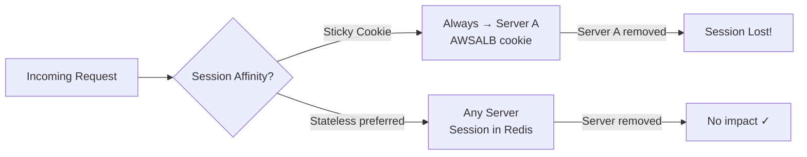

---

## 3. DNS Resolution Flow

```
Browser cache → OS cache → Recursive Resolver → Root NS → TLD NS (.com) → Authoritative NS (Route 53)
```

**TTL trade-offs:**
- **Low TTL (60s):** fast failover, more DNS queries (higher cost)
- **High TTL (86400s):** fewer queries (cheaper), slow failover
- **Standard:** 300s (5 min) for most records

### Record Types

| Type | Purpose | Example | Notes |
|------|---------|---------|-------|
| **A** | IPv4 address | `api.example.com → 1.2.3.4` | |
| **AAAA** | IPv6 address | `api.example.com → ::1` | |
| **CNAME** | Alias to another name | `www → api.example.com` | Cannot use at apex domain |
| **Alias** | AWS alias (Route 53 only) | `example.com → ALB DNS` | **Free, supports apex domain** |
| **MX** | Mail server | priority + mail host | |
| **TXT** | Verification, SPF, DKIM | `v=spf1 include:...` | |
| **NS** | Name server delegation | hosted zone NS records | |

**Alias vs CNAME:** Alias = free, apex domain support (`example.com`), auto-follows ALB/CloudFront/S3 IP changes. CNAME = paid queries, cannot use at root domain. **Always use Alias for ALB/CloudFront/S3 website endpoints.**

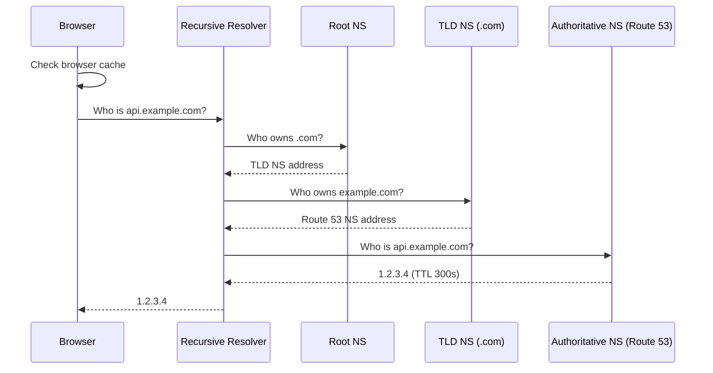

### Route 53 Routing Policies

| Policy | Use Case |
|--------|----------|
| **Simple** | One record, single value |
| **Weighted** | A/B testing, traffic splitting |
| **Latency** | Route to lowest-latency region |
| **Failover** | Primary/secondary with health checks |
| **Geolocation** | Compliance, localized content |
| **Geoproximity** | Shift traffic by geography + bias |
| **Multi-value** | Return multiple IPs (basic LB, not a replacement for ALB) |

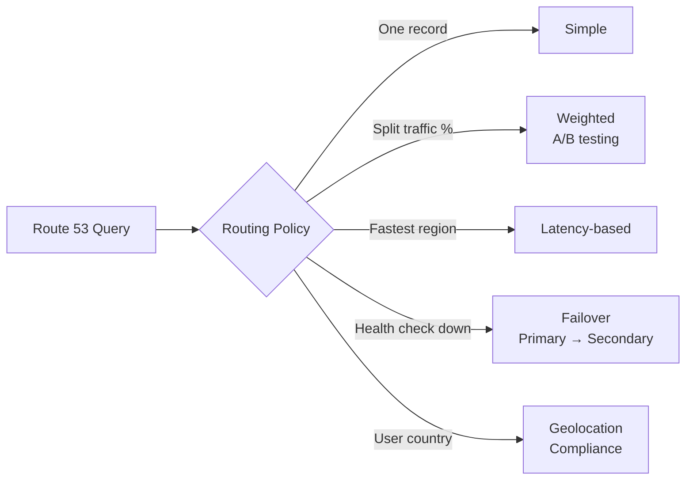

---

## 4. HTTP Protocol Quick Reference

| Version | Key Feature | Limitation |
|---------|-------------|------------|
| **HTTP/1.1** | Persistent connections | **Head-of-line blocking** — 1 request at a time per connection |
| **HTTP/2** | **Multiplexing**, header compression, server push | HOL blocking at TCP level |
| **HTTP/3** | **QUIC (UDP-based)**, 0-RTT, eliminates HOL blocking at all levels | Newer, less firewall support |
| **gRPC** | HTTP/2 + binary protobuf, streaming, strongly typed | Not human-readable, requires proto files |

### Status Codes — Interview Relevant

| Code | Meaning | Notes |
|------|---------|-------|
| **200** | OK | |
| **201** | Created | POST success |
| **204** | No Content | DELETE success (no body) |
| **301** | Moved Permanently | **Browser caches redirect** |
| **302** | Found | Temporary redirect, not cached |
| **304** | Not Modified | ETag/Last-Modified match — serve from browser cache |
| **400** | Bad Request | Client sent invalid data |
| **401** | Unauthorized | **Not authenticated** (no/invalid credentials) |
| **403** | Forbidden | **Authenticated but not authorized** |
| **404** | Not Found | |
| **409** | Conflict | Duplicate resource, concurrency conflict |
| **429** | Too Many Requests | Rate limit hit — include `Retry-After` header |
| **500** | Internal Server Error | Unhandled server error |
| **502** | Bad Gateway | Upstream returned invalid response |
| **503** | Service Unavailable | Overloaded or down — include `Retry-After` |
| **504** | Gateway Timeout | Upstream didn't respond in time |

**401 vs 403:** 401 = "I don't know who you are." 403 = "I know who you are, but no."

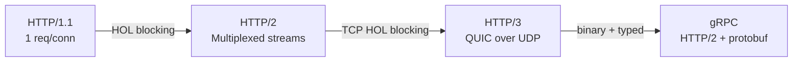

---

## 5. TCP vs UDP

| | TCP | UDP |
|-|-----|-----|
| **Reliability** | Guaranteed delivery, retransmission | Best effort, no retransmission |
| **Ordering** | In-order delivery | No ordering guarantee |
| **Connection** | 3-way handshake required | No handshake |
| **Overhead** | Higher (acks, sequence numbers) | Lower |
| **Use cases** | HTTP, databases, SSH, file transfer | DNS, video streaming, VoIP, gaming |
| **Latency** | Higher | Lower |
| **Flow control** | Yes (prevents overwhelming receiver) | No |

**TCP 3-way handshake:** SYN → SYN-ACK → ACK (~1 RTT before first byte)

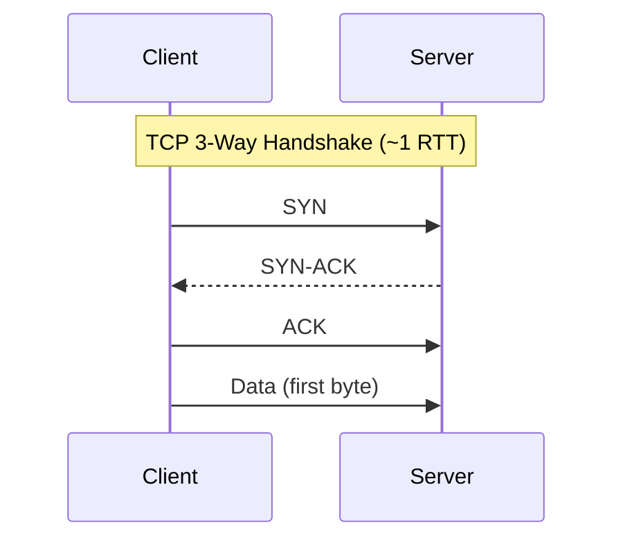

---

## 6. TLS / HTTPS

**TLS handshake cost:**
- TLS 1.2: **2 RTT** before data flows
- TLS 1.3: **1 RTT** (0-RTT for session resumption)

| Concept | Detail |
|---------|--------|
| **TLS 1.3** | Default, ECDHE key exchange, **forward secrecy** — past traffic safe if key compromised later |
| **Certificate types** | DV (domain only), OV (org verified), EV (extended — browser trust indicator) |
| **SSL termination** | Terminate at ALB → backend gets plain HTTP. Faster, but no end-to-end encryption |
| **SSL passthrough** | NLB passes encrypted traffic to backend — end-to-end encryption, but no LB-level inspection |
| **mTLS** | Both client AND server present certs — **microservices auth**, zero-trust networks |
| **HSTS** | `Strict-Transport-Security` header — browser enforces HTTPS, prevents downgrade attacks |

**Forward secrecy:** Use ephemeral keys (ECDHE). Even if private key is stolen later, past sessions cannot be decrypted.

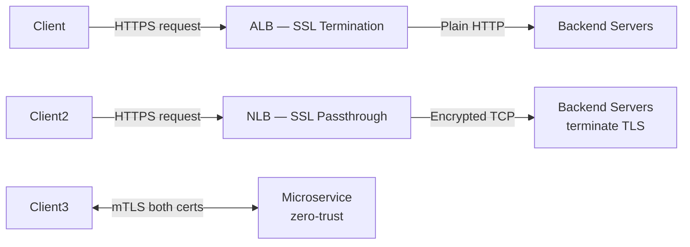

---

## 7. WebSockets & Real-Time

| Concept | Detail |
|---------|--------|
| **WebSocket** | Full-duplex, persistent TCP connection, HTTP Upgrade handshake |
| **When to use** | Chat, live updates, collaborative editing, gaming, real-time dashboards |
| **When NOT to use** | Simple request/response (use HTTP), server push only (use SSE) |
| **ALB support** | Yes — idle timeout up to **4000s**, must enable sticky sessions for WS |
| **NLB support** | Better for very long-lived connections — TCP passthrough, no timeout issues |
| **Scaling** | Sticky sessions OR centralize state in **Redis Pub/Sub** — any server handles disconnect/reconnect |

**SSE vs WebSocket:** SSE = server-push only (simpler), WebSocket = bidirectional (heavier).

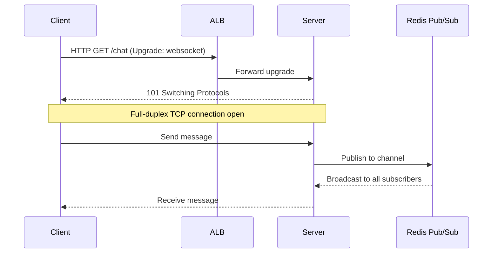

---

## 8. CDN & Edge Caching

| Service | Edge Locations | Notes |
|---------|---------------|-------|
| **CloudFront** | **450+** | AWS-native, integrates with S3/ALB/API GW |
| **Cloudflare** | 200+ | Independent CDN, DDoS protection, Workers |

**Cache hit ratio: target 85%+.** Low ratio = origin overwhelmed — check TTL and cache keys.

### Cache-Control Headers

| Header | Scope | Meaning |
|--------|-------|---------|
| `max-age=3600` | Browser + CDN | Cache for 3600s |
| `s-maxage=3600` | CDN only | Override max-age for CDN |
| `no-cache` | Both | Must revalidate with origin before using cached |
| `no-store` | Both | Never cache — private/sensitive data |
| `private` | Browser only | CDN must not cache (user-specific content) |

**Cache busting:** content hash in filename (`bundle.a1b2c3.js`) > query string (`?v=123`) > neither

### CloudFront Behaviors
- **Cache key:** URL + query strings + headers + cookies you configure
- **Lambda@Edge:** A/B testing, auth at edge, request/response transformation, redirects
- **Origin Shield:** extra caching layer between CloudFront and origin — reduces origin load

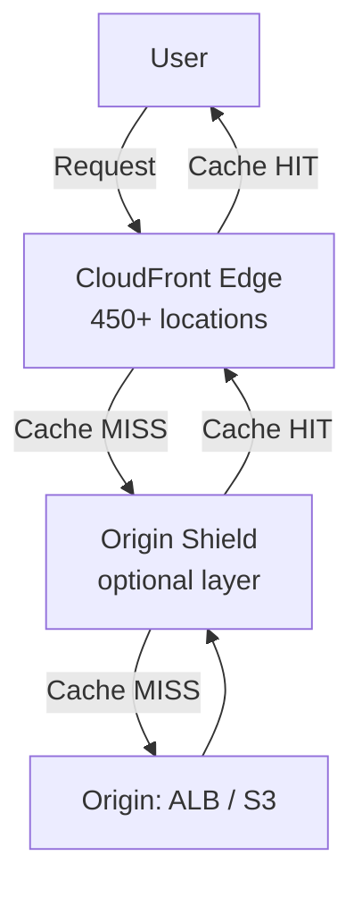

---

## 9. Rate Limiting — Where to Place It

| Layer | Tool | Purpose |
|-------|------|---------|
| **Edge / WAF** | CloudFront + WAF, Cloudflare | DDoS protection, geographic blocks, bot mitigation |
| **API Gateway** | AWS API GW throttling, usage plans | Per-route, per-API-key quotas |
| **Application** | Redis INCR + EXPIRE, token bucket | Business logic — user tiers, per-resource limits |
| **Database** | `max_connections`, connection pools | Protect DB from connection exhaustion |

**Algorithms:**
- **Token bucket:** allows bursts up to bucket size — most common
- **Leaky bucket:** smooths traffic, no bursts — use for strict rate enforcement
- **Fixed window:** simple but edge-of-window burst problem
- **Sliding window:** accurate, more memory — use Redis sorted sets

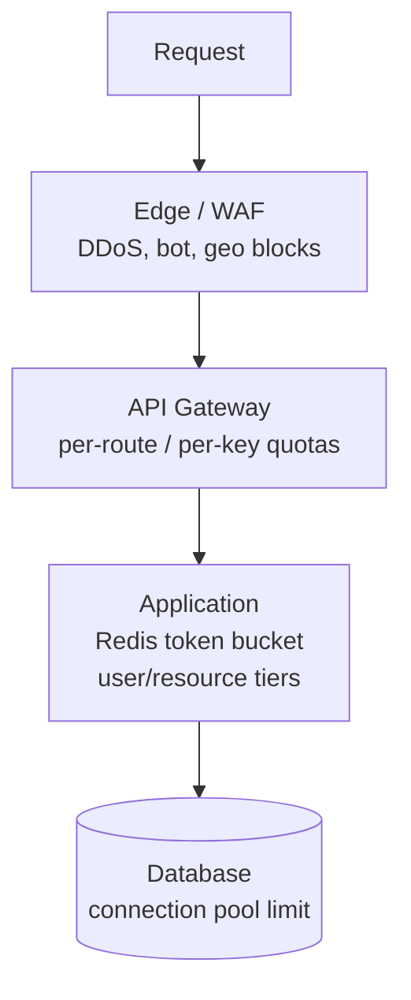

---

## 10. Key Networking Numbers

| Metric | Value | Notes |
|--------|-------|-------|
| **RTT — same region** | **~0.5ms** | Same AZ even lower |
| **RTT — cross-region (US-EU)** | **~80-100ms** | |
| **RTT — intercontinental** | **~150-200ms** | US-Asia |
| **DNS TTL — fast failover** | **60s** | More DNS queries, higher cost |
| **DNS TTL — standard** | **300s** | 5 minutes |
| **DNS TTL — static content** | **86400s** | 24 hours |
| **DNS propagation** | Up to TTL seconds | Not instant after change |
| **HTTP connection timeout** | 3–10s | |
| **HTTP read timeout** | 30s | |
| **HTTP total timeout** | 60s | |
| **ALB WebSocket idle timeout** | Up to **4000s** | |
| **NLB latency** | **~100μs** | |
| **TLS 1.2 handshake** | **2 RTT** | Before first byte |
| **TLS 1.3 handshake** | **1 RTT** | 0-RTT for resumption |
| **CloudFront edge locations** | **450+** | |

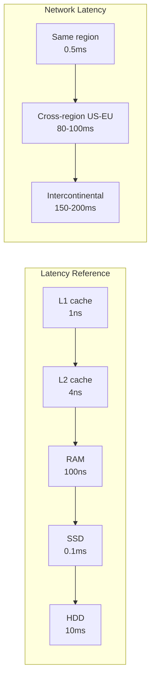

---

[Deep dive: Load Balancers →](../12-interview-prep/quick-reference/aws-cloud/load-balancer)
[Deep dive: Route 53 & DNS →](../12-interview-prep/quick-reference/aws-cloud/route53-dns)
[Deep dive: CloudFront CDN →](../12-interview-prep/quick-reference/aws-cloud/cloudfront-cdn)

---

## 11. Question-Bank: APIs & Networking Deep Dives

### REST API Design Principles
**REST API design** — resource-oriented, stateless, HTTP-semantic APIs

| Anti-pattern | Fix |
|-------------|-----|
| Verbs in URL: `POST /createUser` | Nouns + HTTP verbs: `POST /users` |
| `200 OK` with error in body | Use correct HTTP status codes (400/404/500) |
| No idempotency on POST | Add idempotency key header; make PUT idempotent |
| Inconsistent naming: `userId`, `user_id`, `uid` | Pick one convention (camelCase or snake_case), enforce it |

- **Key number**: REST constraint — stateless means each request carries ALL info; server holds NO session state between requests
- **Decision**: GET for reads (cacheable); POST for creates; PUT/PATCH for updates (PUT = full replace, PATCH = partial); DELETE for deletes
- **Trap**: Returning HTTP 200 with `{ "success": false }` in body — breaks monitoring, retry logic, and every HTTP client library; use proper 4xx/5xx status codes
- → [Full article](../12-interview-prep/question-bank/apis-networking/rest-api-design-principles)

---

### GraphQL Design Patterns
**GraphQL** — flexible query language for complex client data needs

| | REST | GraphQL |
|-|------|---------|
| **Fetching** | Fixed endpoints, fixed response shape | Client specifies exactly what fields it needs |
| **Over-fetching** | Yes (returns all fields) | No (client-driven selection) |
| **Under-fetching** | Multiple requests for related data | Single query with nested resolvers |
| **Caching** | HTTP cache per URL | No built-in HTTP caching (query-based) |
| **Use when** | Simple CRUD, caching important | Complex queries, mobile (bandwidth), many clients |

- **Key number**: N+1 problem — 100 posts × 1 author query each = **101 DB queries**; DataLoader batches into 2 queries
- **Decision**: REST for simple CRUD with caching; GraphQL when clients have very different data shape requirements or bandwidth is a concern (mobile)
- **Trap**: Not implementing DataLoader for nested resolvers — every nested field becomes a separate DB query (N+1); DataLoader is mandatory in production GraphQL
- → [Full article](../12-interview-prep/question-bank/apis-networking/graphql-design-patterns)

---

### gRPC & Protobuf
**gRPC + Protocol Buffers** — typed, binary, high-performance service-to-service communication

| | REST/JSON | gRPC/Protobuf |
|-|----------|--------------|
| **Payload size** | Verbose (text JSON) | **5–10× smaller** (binary) |
| **Serialization** | Slow (parse text) | **3–5× faster** |
| **Typing** | Runtime (weak) | Compile-time (strong, from .proto) |
| **Streaming** | No | Bidirectional |
| **Browser support** | Full | Limited (needs gRPC-Web proxy) |

- **Key number**: Protobuf is **5–10× smaller** than JSON and **3–5× faster** to serialize — critical for high-throughput microservices
- **Decision**: gRPC for internal microservice-to-microservice; REST/JSON for public APIs or browser-facing endpoints
- **Trap**: Using gRPC for browser clients without gRPC-Web — browsers cannot send HTTP/2 trailers required by gRPC; add Envoy proxy or use gRPC-Web client
- → [Full article](../12-interview-prep/question-bank/apis-networking/grpc-and-protobuf)

---

### WebSockets & Long Polling
**Real-time communication** — choosing between long polling, SSE, and WebSocket

| | Long Polling | SSE | WebSocket |
|-|-------------|-----|-----------|
| **Direction** | Server→Client (simulated) | Server→Client | **Bidirectional** |
| **Protocol** | HTTP/1.1 | HTTP/1.1 or HTTP/2 | WS upgrade |
| **Proxy/firewall** | ✅ Safe | ✅ Safe | ⚠️ May be blocked |
| **Use when** | Legacy environments | Notifications, feed updates | Chat, collaboration, gaming |

- **Key number**: WebSocket server tuned for 1M concurrent connections — requires `ulimit -n 1048576` (1M file descriptors); default OS limit = **1,024/process**
- **Decision**: WebSocket for bidirectional real-time (chat, gaming); SSE for server-only push (notifications, live feeds); long polling for legacy browsers or strict firewall environments
- **Trap**: Stateful WebSocket without centralized pub/sub — user A connects to Server 1, user B connects to Server 2; messages don't cross servers; use Redis Pub/Sub to broadcast across servers
- → [Full article](../12-interview-prep/question-bank/apis-networking/websockets-long-polling)

---

### API Versioning Strategies
**API versioning** — managing breaking changes without breaking clients

| Strategy | Example | CDN-friendly | Visibility | Used by |
|----------|---------|-------------|-----------|--------|
| **URL path** | `/v1/users`, `/v2/users` | ✅ | High | Most APIs |
| **Header** | `API-Version: 2024-01-01` | ❌ (needs `Vary`) | Low | Stripe |
| **Query param** | `?version=2` | ✅ | Medium | Some legacy APIs |
| **Content negotiation** | `Accept: application/vnd.api.v2+json` | ❌ | Low | REST purists |

- **Key number**: Stripe uses date-based versioning — each API key pins to a specific version date; provides ~**2 years** of backwards compatibility guarantees
- **Decision**: URL path versioning for simplicity and CDN cacheability; header versioning for clean URLs and Stripe-style date pinning
- **Trap**: Trying to make every API change backwards compatible — not all changes are; define "breaking change" explicitly (removing fields, changing types, renaming endpoints) and version on breaking changes only
- → [Full article](../12-interview-prep/question-bank/apis-networking/api-versioning-strategies)

---

### API Gateway Patterns
**API gateway patterns** — BFF, aggregation, Lambda cold start mitigation

| Pattern | Problem solved | Trade-off |
|---------|---------------|-----------|
| **BFF (Backend for Frontend)** | Each client type (mobile/web/TV) needs different data shape | More backends to maintain |
| **Request aggregation** | Client needs data from 3 services in 1 call | Gateway becomes coupling point |
| **Auth offloading** | JWT verify in every service | Gateway = single point for auth failures |
| **Circuit breaker** | Upstream service slowness cascades | Gateway adds latency on healthy paths |

- **Key number**: Lambda cold start: Java = **2–5s**; Node.js/Python = **100–500ms**; use Provisioned Concurrency to eliminate cold start for latency-sensitive API Gateway endpoints
- **Decision**: BFF when different client types have significantly different data needs (mobile vs web vs third-party); avoid BFF if all clients share the same data model
- **Trap**: API gateway becomes a distributed monolith — aggregating too much business logic in the gateway makes it a bottleneck and single point of failure; keep gateway as thin pass-through
- → [Full article](../12-interview-prep/question-bank/apis-networking/api-gateway-patterns)

---

### HTTP Internals
**HTTP versions** — understanding multiplexing, HOL blocking, and header compression

| Version | Transport | Multiplexing | HOL Blocking | Header compression |
|---------|---------|-------------|-------------|------------------|
| **HTTP/1.1** | TCP | ❌ (1 req/connection) | At HTTP layer | ❌ (repeated text) |
| **HTTP/2** | TCP | ✅ (streams) | Fixed at HTTP, still at TCP | ✅ HPACK |
| **HTTP/3** | QUIC (UDP) | ✅ (streams) | ✅ Eliminated | ✅ QPACK |
| **gRPC** | HTTP/2 | ✅ | Fixed at HTTP | ✅ HPACK |

- **Key number**: HTTP/2 HPACK compression — `Cookie: session=abc` at 500 bytes, sent 1K times/sec = **500KB/s wasted** in HTTP/1.1; HPACK compresses repeat headers to ~0 bytes after first request
- **Decision**: HTTP/2 for all modern web traffic (supported by all modern browsers and CDNs); HTTP/3 for mobile/high-latency connections where packet loss is common
- **Trap**: Enabling HTTP/2 server push aggressively — push is often counterproductive as browsers already have the resources cached; use `<link rel="preload">` instead
- → [Full article](../12-interview-prep/question-bank/apis-networking/http-internals)

---

### DNS & Load Balancing
**DNS internals** — resolution hierarchy, TTL, and load balancing strategies

| Record type | Purpose | CDN/LB use |
|------------|---------|-----------|
| **A** | IPv4 address | Direct IP routing |
| **CNAME** | Alias (cannot use at apex) | Services with dynamic IPs |
| **Alias (Route 53)** | AWS alias — free, supports apex | ALB, CloudFront, S3 endpoints |
| **MX** | Mail server | Email routing |

- **Key number**: DNS "48 hour propagation" is a myth — modern resolvers respect TTL; with TTL=60s, propagation = **60–120 seconds** globally; use low TTL (60s) before planned changes
- **Decision**: Alias record (not CNAME) for all Route 53 → ALB/CloudFront/S3 mappings — free query pricing and supports apex domain; CNAME cannot be used at root domain
- **Trap**: High TTL before a planned IP change — if TTL=86400s and you need to failover, clients keep hitting old IP for up to 24 hours; lower TTL to 60s at least 48h before any planned change
- → [Full article](../12-interview-prep/question-bank/apis-networking/dns-load-balancing)

---

## 12. Question-Bank: Observability & SRE Deep Dives

### Distributed Tracing
**Distributed tracing** — following a request across all microservices to find latency bottlenecks

| Signal | Shows | Cannot show |
|--------|-------|------------|
| **Logs** | What happened in one service | Which service caused end-to-end slowness |
| **Metrics** | Aggregated rates and latency | Which specific request was slow |
| **Traces** | Full request journey, per-hop latency | Aggregate trends across requests |

- **Key number**: A trace = one globally unique `trace_id` (128-bit UUID) propagated across all services via HTTP headers (`traceparent` W3C standard or `X-B3-TraceId` Zipkin)
- **Decision**: Logs for debugging single-service errors; traces for diagnosing latency in multi-service call chains; metrics for alerting on aggregate trends (4 Golden Signals)
- **Trap**: 100% trace sampling in production — tracing overhead is ~1ms per span + network/storage cost; use head-based sampling at 1–10% or tail-based sampling (keep traces for slow/error requests)
- → [Full article](../12-interview-prep/question-bank/observability-sre/distributed-tracing)

---

### Metrics & Alerting Design
**4 Golden Signals** — Google SRE's complete health model for any service

| Signal | SLI example | Alert threshold |
|--------|------------|----------------|
| **Latency** | p99 response time | >500ms p99 for 5 min |
| **Traffic** | HTTP requests/sec | >2× baseline for 10 min |
| **Errors** | HTTP 5xx / total requests | >0.1% error rate |
| **Saturation** | CPU%, connection pool usage | >80% CPU for 5 min |

- **Key number**: Prometheus Gorilla compression — 1.2 GB/day raw → **~120 MB/day** after compression; scrape interval default = **15 seconds**
- **Decision**: Counter (monotonically increasing) for events — use `rate()` for per-second rate; Gauge for current state (CPU%, queue depth); Histogram for latency percentiles (p50/p99)
- **Trap**: Alerting on CPU > 80% with no duration window — single spikes are normal; alert on `avg_over_time(cpu[5m]) > 0.80` to require sustained saturation before paging
- → [Full article](../12-interview-prep/question-bank/observability-sre/metrics-alerting-design)

---

### Log Aggregation Systems
**Log aggregation** — ELK/EFK stack, structured logging, and log pipeline design

| Component | Role | Resource |
|-----------|------|---------|
| **Filebeat** | Lightweight log shipper (agent) | ~10 MB RAM |
| **Logstash** | Parse + transform pipeline | ~500 MB RAM; can be bottleneck |
| **Elasticsearch** | Index + search logs (inverted index) | Cluster; 50 GB per shard recommended |
| **Kibana** | Query UI + dashboards | Query layer only |

- **Key number**: Filebeat footprint = **~10 MB RAM** vs Logstash **~500 MB RAM** — use Filebeat on every host; Logstash only for complex parsing needs
- **Decision**: Structured JSON logs (not free-form strings) from the start — enables `log.level=ERROR` filtering vs regex-parsing free text which breaks on format changes
- **Trap**: Storing all logs in Elasticsearch at full resolution forever — Elasticsearch costs ~$0.25/GB/month; implement tiered storage: hot (7 days ES), warm (30 days compressed), cold (S3 Glacier for compliance)
- → [Full article](../12-interview-prep/question-bank/observability-sre/log-aggregation-systems)

---

### SLO, SLA & Error Budgets
**SLIs, SLOs, SLAs, and error budgets** — defining and managing reliability targets

| Concept | Owner | Purpose |
|---------|-------|---------|
| **SLI** (Service Level Indicator) | Engineering | Measured metric (99.2% success rate) |
| **SLO** (Service Level Objective) | Engineering | Internal target (≥99.9% over 30 days) |
| **SLA** (Service Level Agreement) | Product/Legal | External contract with financial consequence |
| **Error budget** | Engineering | Budget = 1 - SLO; governs deploy risk |

- **Key number**: 99.9% SLO = **43.8 min/month** downtime budget; 99.99% = **4.38 min/month**; 99.999% = **26.3 sec/month**; SLA always looser than SLO (buffer for contract breach protection)
- **Decision**: Freeze non-critical deploys when error budget is exhausted; resume when budget refreshes at next window — error budget is the policy tool that aligns engineering incentives with reliability
- **Trap**: Setting SLO = SLA — no buffer between internal target and customer contract; breach the SLO once and you automatically breach the SLA; always set SLO at least 0.1–0.5% stricter than SLA
- → [Full article](../12-interview-prep/question-bank/observability-sre/slo-sla-error-budgets)

---

### Incident Response Systems
**Incident response** — severity classification, roles, and postmortem process

| Severity | Impact | Response time | On-call action |
|----------|--------|--------------|---------------|
| **P0** | Full outage, revenue loss | ACK <5 min, mitigate <15 min | Page immediately |
| **P1** | Major degradation, majority affected | ACK <15 min, mitigate <30 min | Page on-call |
| **P2** | Partial feature, subset affected | Next business hours | Slack notification |
| **P3** | Cosmetic/minor | Backlog | Ticket |

- **Key number**: P0 status page update within **10 min**; stakeholder notification within **15 min**; postmortem published within **48–72 hours** of resolution
- **Decision**: Incident Commander (IC) = coordinator, not the technical debugger — most senior engineer should be debugging, not coordinating; IC time-boxes decisions ("10 min to diagnose, then rollback")
- **Trap**: IC is also the person debugging — no one is coordinating communication, status page, and role assignments; the technical lead becomes the IC and the incident sprawls; designate IC separately from technical lead at declaration
- → [Full article](../12-interview-prep/question-bank/observability-sre/incident-response-systems)
