# Security & Auth Cheat Sheet

> Key concepts for security rounds and general system design interviews. Facts and decision rules only.

---

## 1. Authentication vs Authorization

| | Authentication (AuthN) | Authorization (AuthZ) |
|-|----------------------|----------------------|
| **Question** | **WHO are you?** | **WHAT can you do?** |
| **Verifies** | Identity | Permissions |
| **Tools** | JWT, session cookies, OAuth, SAML | RBAC, ABAC, IAM policies, ACLs |
| **Error code** | **401** Unauthorized | **403** Forbidden |
| **When it happens** | First (must authn before authz) | Second |

**Trap:** 401 is named "Unauthorized" but means "unauthenticated." 403 means truly unauthorized.

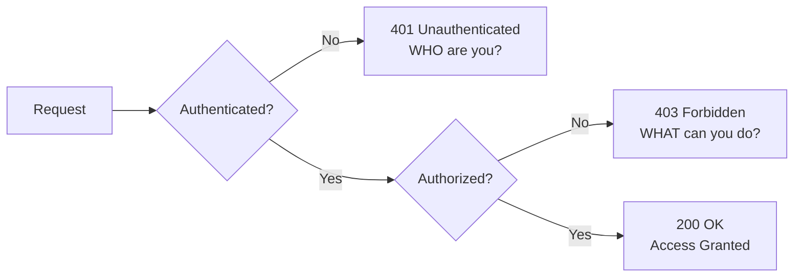

---

## 2. Session vs JWT

| | Session | JWT |
|-|---------|-----|
| **State** | **Stateful** — server stores session | **Stateless** — client stores token |
| **Storage** | Server-side (Redis, DB) | Client-side (cookie, localStorage) |
| **Revocation** | **Instant** — delete session from store | **Hard** — must wait for expiry or maintain blocklist |
| **Scaling** | Requires shared store (Redis) or sticky sessions | Any server can verify — no shared store needed |
| **Size** | Small cookie (session ID only) | **Larger** — base64 encoded header+payload+sig |
| **Use** | Traditional web apps, when instant revocation needed | APIs, mobile apps, microservices |

### JWT Structure
```
header.payload.signature
eyJhbGciOiJIUzI1NiJ9.eyJzdWIiOiJ1c2VyXzEyMyIsImV4cCI6MTcwMH0.SIG
```
- **Header:** algorithm + token type
- **Payload:** claims (sub, exp, iat, roles) — **NOT encrypted, only signed**
- **Signature:** HMAC-SHA256 or RSA signature

### JWT Refresh Token Pattern
```
Access token:  short-lived (15 min)  — sent with every request
Refresh token: long-lived (7–30 days) — stored securely, used only to get new access token
```

### JWT Pitfalls
- `alg: none` attack — always validate algorithm, never accept `none`
- Storing **secrets** in payload — payload is base64 decoded, not encrypted
- **No revocation** without a blocklist — compromised token valid until expiry
- `localStorage` is XSS-vulnerable — prefer `HttpOnly` cookies for web

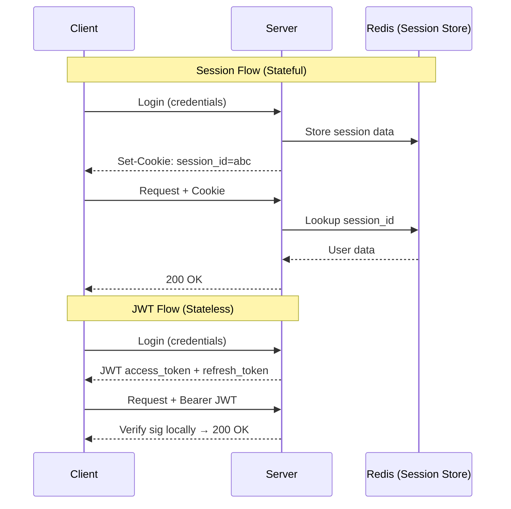

---

## 3. OAuth 2.0 Flows

| Flow | Client Type | Use Case |
|------|-------------|----------|
| **Authorization Code + PKCE** | Public (SPA, mobile) | **Best practice for user-facing apps** |
| **Authorization Code** | Confidential (server-side) | Traditional web apps with server |
| **Client Credentials** | Server (no user) | **Machine-to-machine / service accounts** |
| **Device Code** | Limited input devices | CLI tools, Smart TVs, IoT |
| **Implicit** (deprecated) | SPA (legacy) | **Do not use** — replaced by Auth Code + PKCE |

### OAuth vs OIDC
- **OAuth 2.0:** Authorization framework — grants access to resources (scope-based)
- **OpenID Connect (OIDC):** Authentication layer **on top of OAuth** — adds `id_token` with user identity
- OAuth = "Can this app read my Google Drive?" OIDC = "Who is this user?"

### Key OAuth Terms
| Term | Meaning |
|------|---------|
| **Client** | App requesting access |
| **Resource Owner** | End user |
| **Authorization Server** | Issues tokens (Auth0, Cognito, Google) |
| **Resource Server** | API that accepts access tokens |
| **Scope** | Permissions requested (`read:profile`, `write:posts`) |
| **PKCE** | Proof Key for Code Exchange — prevents auth code interception |

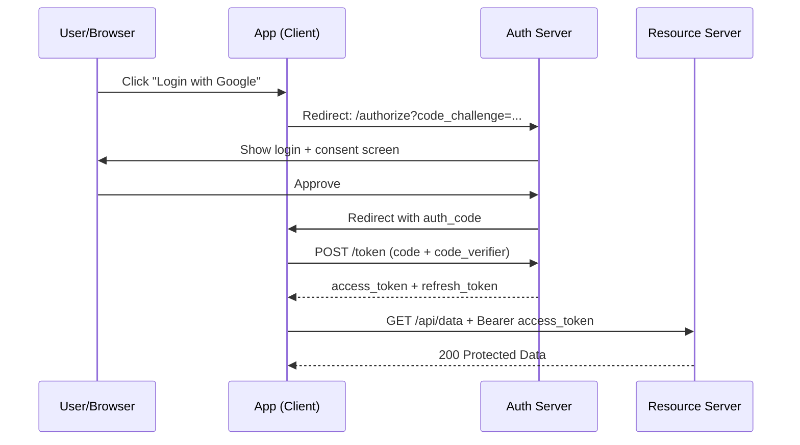

---

## 4. Encryption Quick Reference

### Algorithm Choices

| Type | Algorithm | Use Case | Speed |
|------|-----------|----------|-------|
| **Symmetric** | AES-256-GCM | Data at rest, bulk encryption | Fast |
| **Asymmetric** | RSA-2048, ECDSA P-256 | Key exchange, digital signatures | Slow |
| **Password hashing** | **bcrypt, Argon2** | Storing passwords — slow by design | Very slow |
| **General hashing** | SHA-256 | Data integrity, content addressing | Fast |
| **HMAC** | HMAC-SHA256 | Message authentication (JWT sig, webhooks) | Fast |

### Never Use
- **MD5** — broken (collision attacks, rainbow tables)
- **SHA-1** — deprecated, collision attacks demonstrated
- **AES-ECB mode** — identical plaintext blocks → identical ciphertext (no semantic security)
- **DES / 3DES** — too short key length
- **Plaintext passwords** — always hash with bcrypt/Argon2

### TLS in Practice
```
1. Asymmetric (RSA/ECDHE) → exchange symmetric session key
2. Symmetric (AES-256-GCM) → encrypt actual data transfer
```
**Why both:** Asymmetric is too slow for bulk data. Symmetric is fast but needs secure key exchange.

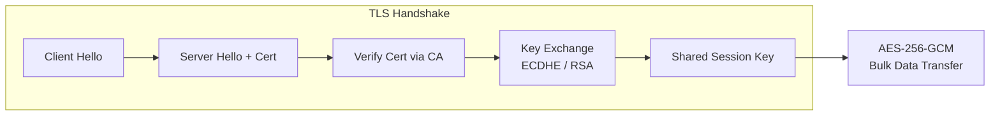

### Encryption at Rest vs In Transit

| | In Transit | At Rest |
|-|-----------|---------|
| **What** | Network traffic | Stored data (S3, EBS, RDS) |
| **How** | TLS/HTTPS | AES-256, KMS-managed keys |
| **AWS** | ACM certs, forced HTTPS | Server-side encryption (SSE) |

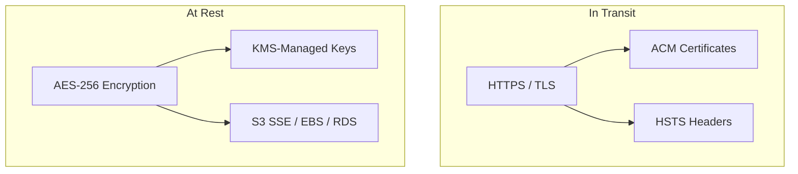

---

## 5. Common Attack Vectors + Mitigations

| Attack | What It Does | Mitigation |
|--------|-------------|------------|
| **SQL Injection** | Malicious SQL via user input | **Parameterized queries**, ORM, input validation |
| **XSS (Stored/Reflected)** | Inject scripts executed in victim's browser | Escape output, **CSP headers**, `HttpOnly` cookies |
| **CSRF** | Forged requests using victim's session | **CSRF tokens**, `SameSite=Strict` cookies |
| **MITM** | Intercept/modify traffic in transit | **TLS/HTTPS**, HSTS, cert pinning |
| **DDoS** | Overwhelm with traffic volume | Rate limiting, WAF, **Shield Advanced**, Anycast |
| **SSRF** | Server fetches attacker-controlled URL | Validate/allowlist URLs, **block AWS metadata** (169.254.169.254) |
| **Path Traversal** | `../../../etc/passwd` in file paths | Canonicalize paths, reject `..`, serve from chroot |
| **Broken Auth** | Weak sessions, credential stuffing | MFA, account lockout, **HaveIBeenPwned** check |
| **Insecure Deserialization** | Malicious payload in serialized objects | Validate before deserializing, use JSON not Java serialization |
| **XXE** | XML parser processes external entities | Disable external entities in XML parser config |

**SSRF AWS risk:** Attacker uses SSRF to hit `http://169.254.169.254/latest/meta-data/` and steal IAM credentials. Mitigation: IMDSv2 (require PUT token), block metadata IP at WAF.

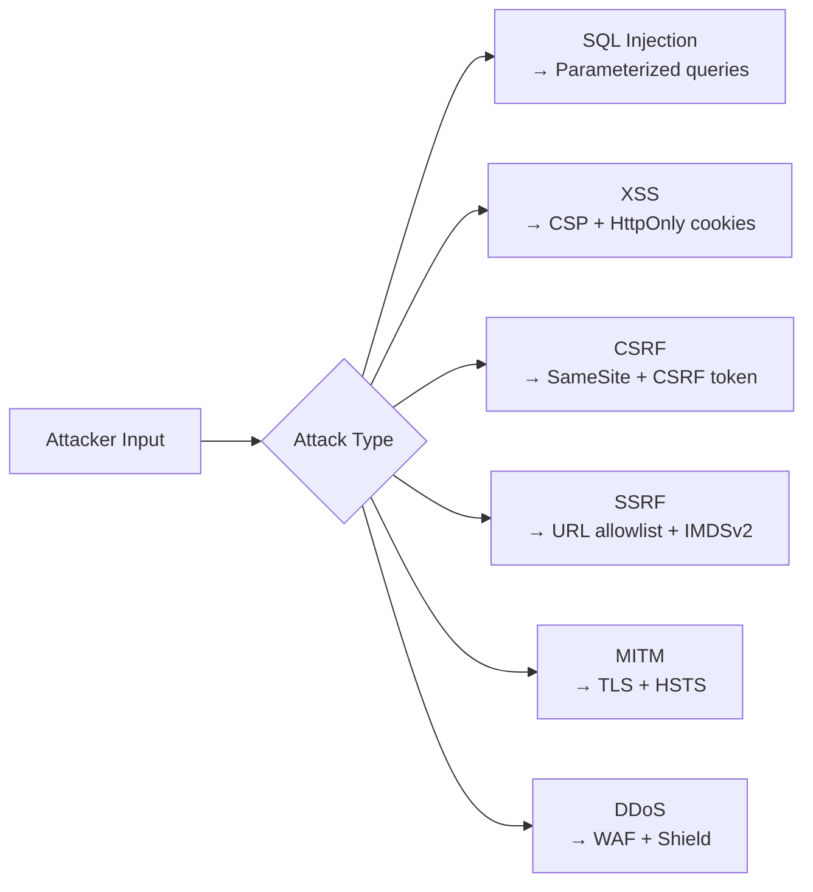

---

## 6. AWS Security Quick Reference

| Service | Purpose | Key Rule |
|---------|---------|----------|
| **IAM** | Identity & access management | **Least privilege**, roles over users, no root access keys |
| **IAM Roles** | Temporary credentials for services | EC2, Lambda, ECS → assume roles, no long-term keys |
| **KMS** | Managed encryption keys | Automatic rotation, CloudTrail audit of every key use |
| **Secrets Manager** | Store + rotate secrets | Auto-rotate DB passwords, API keys — **never hardcode** |
| **Parameter Store** | Config + secrets | Free tier for standard params, cheaper than Secrets Manager |
| **WAF** | Web application firewall | OWASP top 10 rules, rate limiting, geo blocking, IP lists |
| **Shield Standard** | Basic DDoS protection | **Free** — automatic on all AWS resources |
| **Shield Advanced** | Advanced DDoS protection | **$3,000/month** — 24/7 DRT, cost protection, detailed metrics |
| **GuardDuty** | ML threat detection | Analyzes VPC flow logs, CloudTrail, DNS — **enable everywhere** |
| **Security Hub** | Centralized security findings | Aggregates GuardDuty, Inspector, Macie, Config |
| **Inspector** | Vulnerability scanning | EC2, Lambda, container image CVE scanning |
| **Macie** | PII/sensitive data discovery | Scans S3 for SSNs, credit cards, PII |
| **CloudTrail** | API audit log | Who called what API, when, from where — **enable in all regions** |

### VPC Security Layers
```
Internet → WAF → CloudFront → ALB (public subnet)
                                  ↓
                            App servers (private subnet)
                                  ↓
                            RDS/ElastiCache (DB subnet, no internet)
```

**Security Groups vs NACLs:**
- Security Groups: **stateful**, return traffic auto-allowed, instance-level
- NACLs: **stateless**, must allow both inbound AND outbound, subnet-level

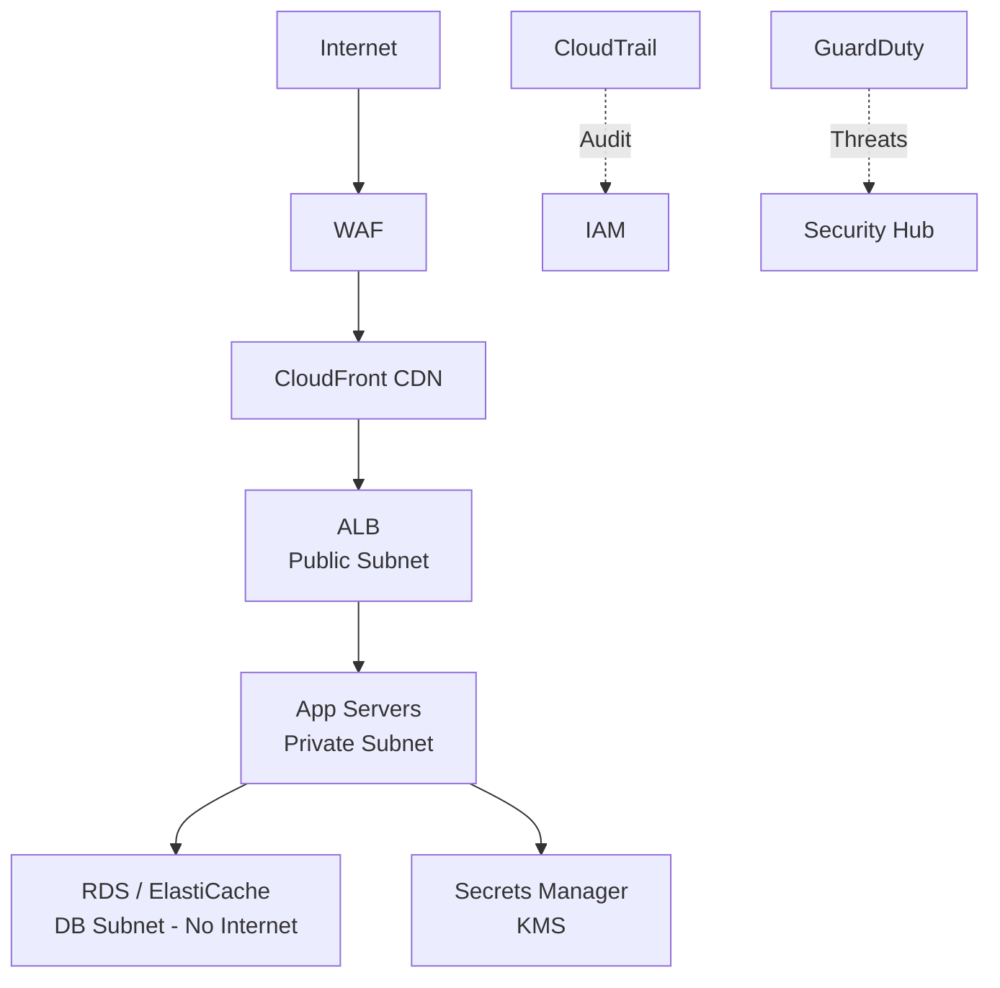

---

## 7. HTTPS & Certificates

| Concept | Detail |
|---------|--------|
| **DV cert** | Domain validation — checks domain ownership only |
| **OV cert** | Organization validation — verifies org identity |
| **EV cert** | Extended validation — highest trust, browser indicators |
| **Let's Encrypt** | Free DV certs, **90-day TTL**, auto-renewal via ACME |
| **AWS ACM** | Free, **auto-renews**, integrates with ALB/CloudFront/API GW |
| **HSTS** | `Strict-Transport-Security: max-age=31536000; includeSubDomains` |
| **HSTS Preload** | Submit to browser preload list — HTTPS enforced before first visit |
| **Certificate Pinning** | Hard-code expected cert/key in client — prevents MITM but hard to rotate |

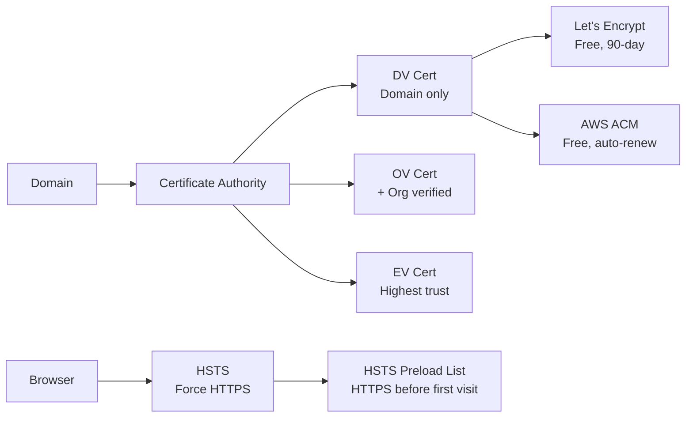

---

## 8. Rate Limiting & Brute Force Protection

| Technique | How | Trade-off |
|-----------|-----|-----------|
| **Account lockout** | Lock after N failures | Too aggressive → self-DoS your users |
| **Progressive delays** | Exponential backoff between retries | User-friendly, attacker still eventually gets through |
| **CAPTCHA** | After N failures, require human proof | Friction for users, can be bypassed with AI |
| **IP rate limiting** | Redis `INCR` + `EXPIRE` per IP | VPNs and shared IPs cause false positives |
| **Device fingerprinting** | Track device attributes across sessions | Privacy concerns |
| **MFA** | Second factor required | Highest protection — should be default for sensitive actions |

```
# Redis rate limit (sliding window approximation)
key = f"login_attempts:{ip}:{user_id}"
count = redis.INCR(key)
if count == 1:
    redis.EXPIRE(key, 900)  # 15-minute window
if count > 5:
    raise TooManyRequests()
```

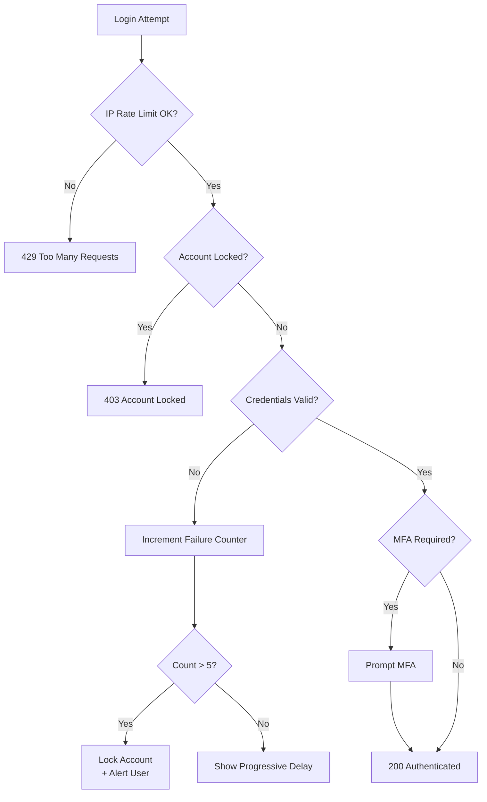

---

## 9. OWASP Top 10 (2021)

| # | Vulnerability | Quick Test |
|---|--------------|-----------|
| 1 | **Broken Access Control** | Can user A access user B's data? |
| 2 | **Cryptographic Failures** | Sensitive data in plain text? Weak algo? |
| 3 | **Injection** (SQL, LDAP, OS, SSTI) | Unvalidated input → interpreter |
| 4 | **Insecure Design** | Threat modeling done? Security requirements? |
| 5 | **Security Misconfiguration** | Default creds? S3 public? Debug mode on? |
| 6 | **Vulnerable/Outdated Components** | Unpatched libs? Known CVEs? |
| 7 | **Identification/Authentication Failures** | Weak passwords? No MFA? Session fixation? |
| 8 | **Software/Data Integrity Failures** | Unverified CI/CD? Insecure deserialization? |
| 9 | **Security Logging/Monitoring Failures** | No audit logs? No alerting? |
| 10 | **SSRF** | Server fetches user-supplied URLs? |

**Most common in interviews:** Broken Access Control (#1), SQL Injection (#3), SSRF (#10)

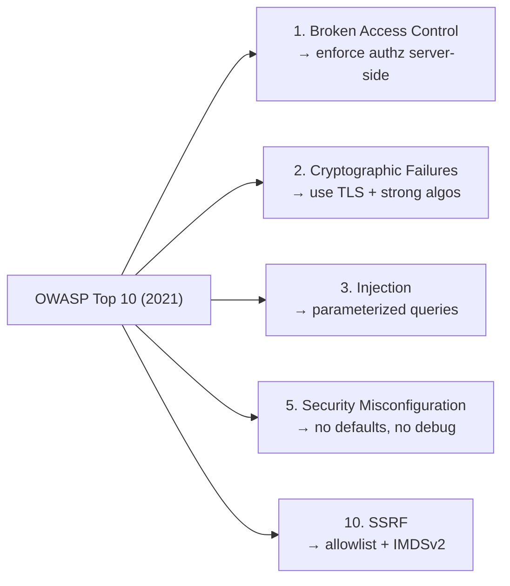

---

## 10. Security HTTP Headers

| Header | Value | Prevents |
|--------|-------|---------|
| `Content-Security-Policy` | `default-src 'self'` | **XSS** — restricts script/resource sources |
| `X-Frame-Options` | `DENY` | **Clickjacking** — prevents iframe embedding |
| `X-Content-Type-Options` | `nosniff` | **MIME sniffing** — browsers respect declared content-type |
| `Strict-Transport-Security` | `max-age=31536000; includeSubDomains` | **Protocol downgrade, MITM** — forces HTTPS |
| `Referrer-Policy` | `no-referrer` or `same-origin` | Leaking URL info to third parties |
| `Permissions-Policy` | `camera=(), microphone=()` | Restricts browser feature access |

**Check at:** [securityheaders.com](https://securityheaders.com) — grades your headers instantly.

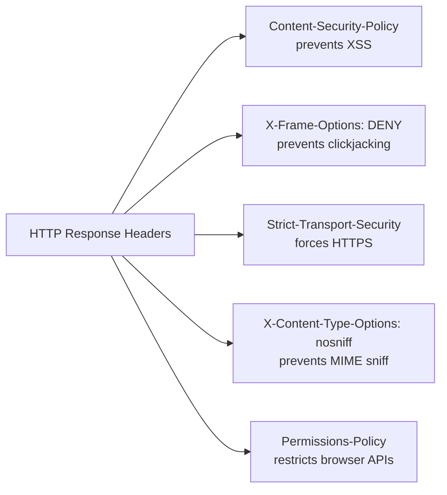

---

## 11. Zero Trust Architecture

**Core principle:** Never trust, always verify — even inside the VPN.

| Old Model | Zero Trust |
|-----------|-----------|
| Trust inside network perimeter | **Verify every request** regardless of source |
| VPN = trusted | No implicit trust from location |
| Flat internal network | **Micro-segmentation** — least privilege per service |
| Long-lived credentials | Short-lived tokens, mTLS between services |

**Implementation:** mTLS (mutual TLS) between services, service mesh (Istio, App Mesh), per-request JWT validation, network policies.

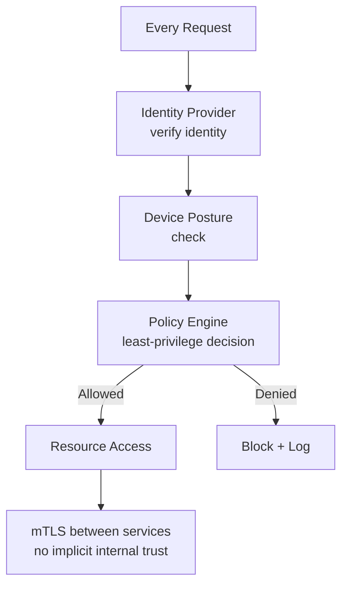

---

[Deep dive: Security Interview Prep →](../12-interview-prep/quick-reference/security)
[Deep dive: Encryption & KMS →](../08-security/)

---

## 12. Question-Bank: Security & Auth Deep Dives

### Authentication Patterns
**Authentication patterns** — verifying identity across sessions, tokens, and multi-factor

| Pattern | State | Revocation | Scale |
|---------|-------|-----------|-------|
| **Session (Redis-backed)** | Server-side | Instant (delete from Redis) | Requires shared store |
| **JWT (stateless)** | Client-side | Hard (wait for expiry or denylist) | Any server verifies locally |
| **mTLS** | Certificate-based | Revoke cert (CRL/OCSP) | PKI infrastructure needed |
| **API Key** | Server-side lookup | Instant (delete key) | DB lookup per request |

- **Key number**: JWT revocation gap — stolen JWT valid until expiry; with 24h TTL = 24h attacker window; fix: TTL=**15 min** + refresh token
- **Decision**: JWT for stateless APIs and microservices; server sessions for banking/medical where instant revocation is mandatory
- **Trap**: Returning 404 instead of 403 for unauthorized resources — leaks resource existence; return 403 for authenticated users; 404 only when the resource truly doesn't exist
- → [Full article](../12-interview-prep/question-bank/security-auth/authentication-patterns)

---

### Authorization: RBAC vs ABAC
**RBAC vs ABAC** — choosing between role-based and attribute-based access control

| | RBAC | ABAC |
|-|------|------|
| **Decision basis** | Static roles assigned to users | Dynamic attributes (user + resource + context) |
| **Complexity** | O(R) roles — typically 10–100 | O(P) policies — more expressive |
| **Performance** | Fast (role lookup) | Slower (attribute resolution at runtime) |
| **Use when** | Clear org hierarchy (admin/editor/viewer) | Fine-grained conditions (patient data by assignment) |

- **Key number**: RBAC ceiling — if you need **1,000 different permission combinations** driven by data values, RBAC requires 1,000 roles; ABAC handles it with 1 policy and 4 attribute conditions
- **Decision**: RBAC for most SaaS applications; ABAC for healthcare, legal, finance where access depends on dynamic data relationships (e.g., doctor only sees their assigned patients)
- **Trap**: Creating roles for every permission combination (role explosion) — `admin-region-east`, `admin-region-west`; use ABAC attributes instead when roles multiply beyond ~100
- → [Full article](../12-interview-prep/question-bank/security-auth/authorization-rbac-abac)

---

### OAuth2 & OIDC
**OAuth2 + OIDC** — authorization delegation and authentication on top of OAuth2

| Flow | Client type | Use for |
|------|------------|--------|
| **Auth Code + PKCE** | Public (SPA, mobile) | User-facing apps — best practice |
| **Auth Code** | Confidential (server-side) | Traditional web apps with backend |
| **Client Credentials** | Server (no user) | M2M / service accounts |
| **Device Code** | Limited input (TV, CLI) | GitHub CLI, Roku, IoT |
| **Implicit** | Legacy SPA | **Deprecated — do not use** |

- **Key number**: OAuth2 alone is NOT authentication — access token proves authorization, not identity; OIDC adds `id_token` (signed JWT) that proves who the user is
- **Decision**: Auth Code + PKCE for all public clients; Client Credentials for microservice-to-microservice; OIDC (not raw OAuth2) when you need user identity
- **Trap**: Using OAuth2 access token as proof of login identity — attacker replays their own token to your app claiming to be "logged in"; always use OIDC `id_token` for authentication
- → [Full article](../12-interview-prep/question-bank/security-auth/oauth2-oidc)

---

### JWT, Sessions & Cookies
**JWT vs sessions + cookie security flags** — secure client state management

| Cookie flag | Prevents | Required? |
|------------|---------|----------|
| `HttpOnly` | XSS token theft (JS cannot read cookie) | Always |
| `Secure` | MITM interception on HTTP | Always in production |
| `SameSite=Strict` | CSRF attacks | Recommended |
| `__Host-` prefix | Subdomain cookie injection | Highest security |

- **Key number**: `SameSite=Strict` cookie not sent on cross-site requests — prevents CSRF with zero token overhead; `SameSite=None` requires `Secure` flag
- **Decision**: HttpOnly + Secure + SameSite=Strict for all session/auth cookies; JWT in Authorization header (not localStorage) for API clients
- **Trap**: Storing JWT in `localStorage` — XSS attack reads `localStorage` and exfiltrates token; use `HttpOnly` cookie for browser storage; `localStorage` is only safe for non-sensitive data
- → [Full article](../12-interview-prep/question-bank/security-auth/jwt-sessions-cookies)

---

### Encryption at Rest & In Transit
**Encryption** — algorithm selection, TLS internals, hybrid encryption pattern

| Algorithm | Type | Speed | Use for |
|-----------|------|-------|--------|
| **AES-256-GCM** | Symmetric | ~10 GB/s | Bulk data encryption (at rest, TLS bulk) |
| **RSA-2048** | Asymmetric | ~1ms/op | Key exchange, signatures |
| **ECDHE** | Asymmetric | Faster than RSA | TLS key exchange (forward secrecy) |
| **bcrypt/Argon2** | Password hash | Slow by design | Password storage only |
| **SHA-256** | Hash | Fast | Content addressing, HMAC |

- **Key number**: AES-256 ~**0.001ms** per block; RSA-2048 ~**1ms** per op — **1000× slower**; TLS uses hybrid: ECDHE for key exchange, AES-256-GCM for bulk data
- **Decision**: AES-GCM (not CBC) for new systems — GCM provides authenticated encryption (detects tampering); CBC requires separate HMAC
- **Trap**: Using MD5 or SHA-1 for password hashing — these are fast hashes (meant for data integrity, not passwords); always use bcrypt or Argon2 which are intentionally slow (cost factor prevents brute force)
- → [Full article](../12-interview-prep/question-bank/security-auth/encryption-at-rest-transit)

---

### API Security Patterns
**API security** — SQL injection, XSS, SSRF, and defense-in-depth patterns

| Attack | Root cause | Prevention |
|--------|-----------|-----------|
| **SQL Injection** | User input concatenated into SQL | Parameterized queries / ORM (never `.raw()`) |
| **Stored XSS** | User content stored + rendered unescaped | Output encode on render; CSP header |
| **Reflected XSS** | URL param reflected in HTML response | Output encode all user-controlled data |
| **SSRF** | Server fetches user-supplied URL | URL allowlist; block `169.254.169.254` |
| **CSRF** | Forged cross-site request with session cookie | `SameSite=Strict` + CSRF token |

- **Key number**: SSRF AWS risk — attacker uses SSRF to hit `169.254.169.254` (metadata endpoint) and steal IAM credentials; require IMDSv2 (token-protected) and block metadata IP at WAF
- **Decision**: Output encode (not just sanitize) for XSS — sanitization can be bypassed; encoding converts `<` to `&lt;` making injection harmless in HTML context
- **Trap**: ORM raw query escape hatches (`queryRaw`, `.raw()`, `$executeRawUnsafe`) bypass parameterization — all raw SQL must be manually reviewed and audited in every PR
- → [Full article](../12-interview-prep/question-bank/security-auth/api-security-patterns)

---

### Zero Trust Architecture
**Zero trust** — identity-first security that eliminates implicit network trust

| Old perimeter model | Zero Trust |
|--------------------|-----------|
| VPN = trusted | Network location = no trust |
| Inside network = safe | Verify every request regardless of source |
| Flat internal network | Micro-segmented; least privilege per service |
| Long-lived credentials | Short-lived tokens; mTLS between services |

- **Key number**: **80% of breaches** involve lateral movement after initial perimeter breach (Verizon DBIR) — perimeter model fails once attacker is inside
- **Decision**: mTLS for service-to-service auth (mutual certificate verification); service mesh (Istio/Linkerd) for enforcing zero trust in Kubernetes at scale
- **Trap**: Treating zero trust as a product to buy, not a principle to implement — zero trust is achieved incrementally by enforcing authentication + authorization on every service call, not by installing a single tool
- → [Full article](../12-interview-prep/question-bank/security-auth/zero-trust-architecture)
