> **📅 Spaced Repetition Schedule**
> Use this cheat sheet on a 4-interval cycle for maximum retention:
> - **Day 0** — Read it fully (20–30 min)
> - **Day 3** — Skim headers, cover answers, test yourself
> - **Day 10** — Quiz yourself on the "Trap" entries without looking
> - **Day 30** — Quick scan for gaps; revisit any you missed

---

# System Design Patterns Cheat Sheet

> The mental framework for any system design question. Scan the patterns, use the decision tables.

---

## 1. The SA Framework (use for every interview question)

Run this checklist for every question — interviewers want to see structure first:

```
1. CLARIFY    → Who uses it? What scale? Read-heavy or write-heavy?
               Consistency vs availability? Latency SLA?

2. ESTIMATE   → DAU, QPS, storage, bandwidth (back-of-envelope)

3. DATA MODEL → What entities? Relationships? SQL or NoSQL?

4. API DESIGN → REST endpoints or events — inputs/outputs only

5. ARCHITECTURE → Draw the boxes: client → LB → app → cache → DB
                  Add CDN, queue, worker as needed

6. DEEP DIVE  → Pick 1-2 bottlenecks and solve them in detail
```

**Estimation formulas:**
- `QPS = DAU × actions_per_day / 86,400`
- `Storage = records × avg_record_size × retention_days`
- `Bandwidth = QPS × avg_payload_size`
- Rule of thumb: **1M DAU → ~12 QPS average** (1M / 86,400)

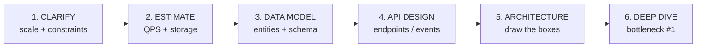

---

## 2. Scalability Patterns

| Pattern | When to Use | Key Tradeoff |
|---------|-------------|--------------|
| **Horizontal scaling** | Stateless services; commodity hardware | Need load balancer; data sync complexity |
| **Vertical scaling** | Stateful, hard to shard; quick win | Single point of failure; hardware ceiling |
| **Stateless design** | Always for app servers | Sessions in Redis/DB, not local memory |
| **Read replicas** | Read:write ratio > 5:1 | Replication lag → stale reads |
| **Caching layer** | Repeated reads, expensive computation | Cache invalidation is hard |
| **CDN** | Static assets, global users | Origin must handle cache miss spike |
| **Sharding** | Single DB can't handle write load | Cross-shard queries are hard; resharding pain |
| **CQRS** | Read model ≠ write model; analytics on write path | Eventual consistency between models |
| **Async processing** | Non-blocking background work | Eventual completion; harder error handling |

**Scale thresholds (rough rules):**

| Load | Pattern |
|------|---------|
| < 1K QPS | Single DB + app server is fine |
| 1K–10K QPS | Add read replicas + Redis cache |
| 10K–100K QPS | Sharding or switch to NoSQL; CDN for static |
| 100K+ QPS | Full distributed system; event-driven; Kafka |

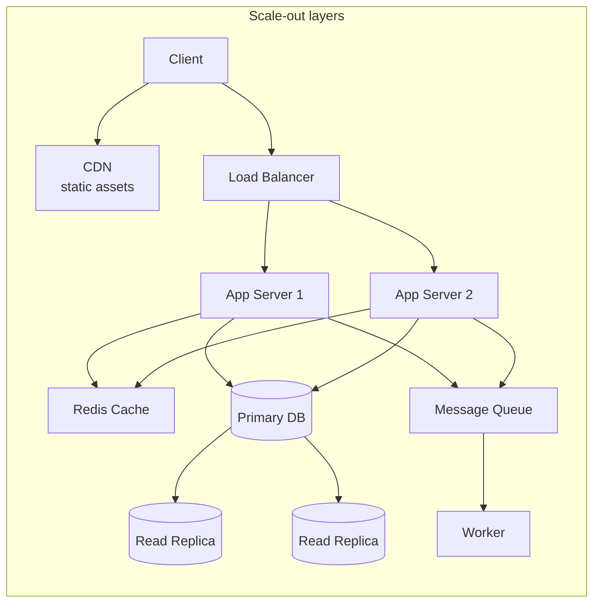

---

## 3. Load Balancing

[Deep dive →](../12-interview-prep/system-design/fundamentals/load-balancing-strategies)

| | **L4 (Transport)** | **L7 (Application)** |
|-|-------------------|----------------------|
| **Operates at** | TCP/UDP | HTTP/HTTPS |
| **Routing based on** | IP + port | URL, headers, cookies, body |
| **AWS equivalent** | NLB | ALB |
| **TLS termination** | No | Yes |
| **Performance** | Faster (no packet inspection) | Slower (full parse) |
| **Use when** | Non-HTTP, ultra-low latency, IoT | Web apps, microservices, path routing |

**Algorithms:**

| Algorithm | When | Sticky? |
|-----------|------|---------|
| **Round Robin** | Equal-capacity servers, stateless | No |
| **Weighted Round Robin** | Different server capacities | No |
| **Least Connections** | Variable request duration | No |
| **IP Hash** | Need sticky sessions (no external state) | Yes |
| **Least Response Time** | Latency-sensitive | No |
| **Random** | Simple, stateless, large cluster | No |

**Health checks:** TCP (port open) < HTTP (200 OK) < HTTPS (with cert check). Always use HTTP/HTTPS for web apps.

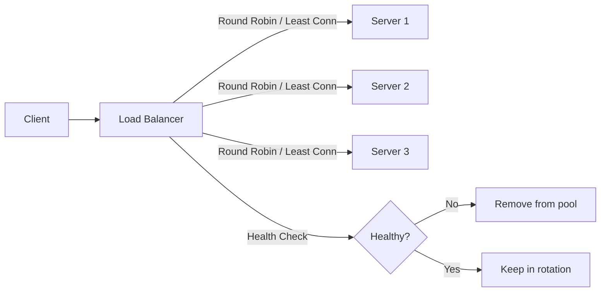

---

## 4. Caching Strategy

[Deep dive →](../12-interview-prep/system-design/fundamentals/caching-strategies)

**When to cache:**
- Read-heavy workload (>80% reads)
- Data changes infrequently or staleness is acceptable
- Origin has high latency or compute cost
- Same data requested repeatedly (hot keys)

**Where to cache:**

```
User → [Browser/CDN] → [API Gateway response cache] → [App in-memory (LRU)]
     → [Distributed cache (Redis)] → [DB query result] → Database
```

**Cache patterns:**

| Pattern | Write Flow | Read Flow | Best For |
|---------|------------|-----------|----------|
| **Cache-aside** (most common) | Write to DB only | Check cache → miss → DB → populate cache | General use; fine control |
| **Write-through** | Write to cache + DB simultaneously | Always read from cache | Strong consistency needed |
| **Write-behind** | Write to cache → async DB write | Read from cache | High write throughput |
| **Read-through** | Write to DB | Cache fetches from DB on miss | Less app code |

**Eviction policies:**

| Policy | Logic | Use When |
|--------|-------|----------|
| **LRU** (Least Recently Used) | Evict oldest accessed | General workloads |
| **LFU** (Least Frequently Used) | Evict least accessed by count | Popularity-based (trending) |
| **TTL** | Expire after fixed time | Time-sensitive data |
| **FIFO** | Evict oldest inserted | Simple; not common |

**Cache invalidation strategies:**
- **TTL** — simple; staleness window = TTL duration
- **Explicit delete** — app deletes cache key on write; harder to maintain
- **Event-driven** — CDC (Debezium) or DB triggers invalidate cache; most consistent
- **Write-through** — always fresh; slower writes

**Key trap:** Thundering herd — many requests hit empty cache simultaneously → DB overwhelmed. Fix: Redis mutex (`SETNX`), jitter on TTL, cache warming.

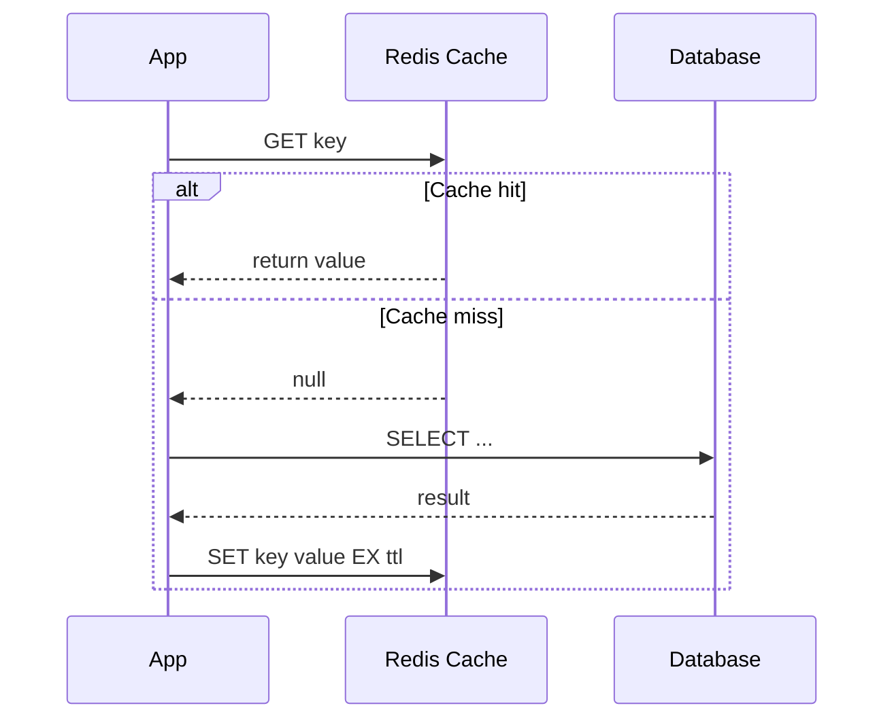

---

## 5. Database Selection

[SQL deep dive →](../12-interview-prep/system-design/storage-and-databases/database-replication) | [NoSQL deep dive →](../12-interview-prep/system-design/storage-and-databases/database-sharding)

| Dimension | **SQL (Relational)** | **NoSQL** |
|-----------|---------------------|-----------|
| **Schema** | Fixed; migrations required | Flexible; schema-on-read |
| **Consistency** | ACID transactions | BASE (eventual or tunable) |
| **Joins** | Native, efficient | Manual application-side |
| **Scaling** | Vertical + read replicas | Horizontal (native sharding) |
| **Query flexibility** | Rich (joins, aggregations) | Limited (by PK/index) |

**Choose SQL when:**
- Financial transactions, inventory counts (ACID critical)
- Complex relationships with many joins
- Reporting / analytics queries (aggregations, GROUP BY)
- Data model is well-known and stable

**Choose NoSQL when:**
- 10M+ records with high write throughput
- Flexible or evolving schema (user profiles, product catalog)
- Simple KV/document lookups by known key
- Global distribution needed (DynamoDB Global Tables, Cosmos DB)
- Graph relationships (Neo4j) or time-series (InfluxDB)

**NoSQL sub-types:**

| Type | Examples | Use Case |
|------|---------|----------|
| **Key-Value** | Redis, DynamoDB | Sessions, caches, user prefs |
| **Document** | MongoDB, Firestore | Catalogs, content, user profiles |
| **Wide-column** | Cassandra, HBase | Time-series, activity feeds, IoT |
| **Graph** | Neo4j, Neptune | Social networks, recommendations, fraud |

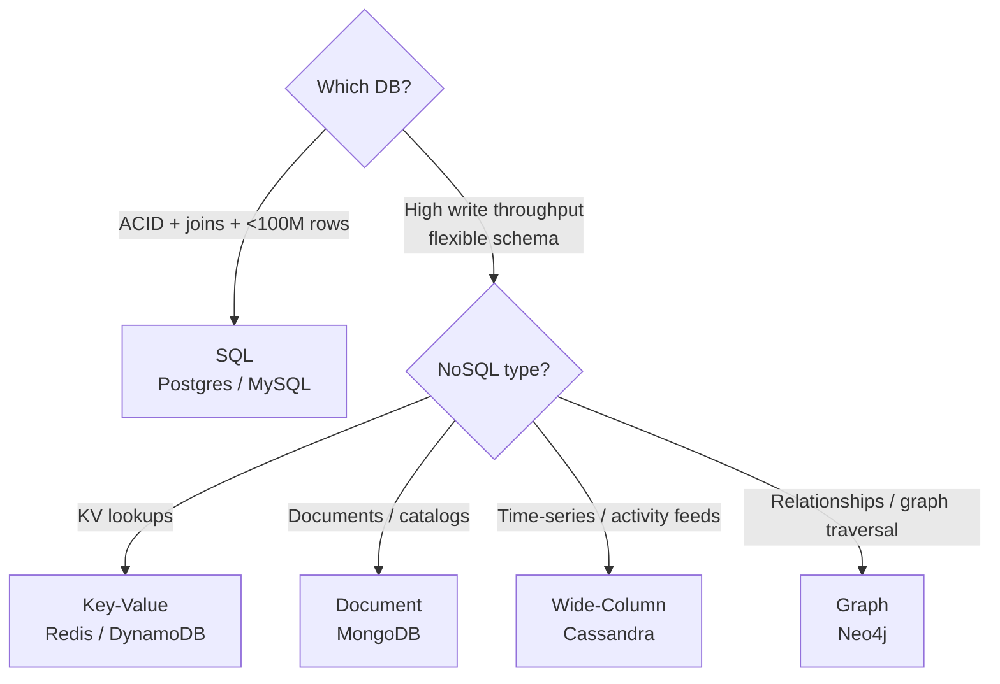

---

## 6. Message Queue Patterns

[Deep dive →](../12-interview-prep/system-design/messaging-and-streaming/message-queues-kafka-rabbitmq) | [Event-driven →](../12-interview-prep/system-design/messaging-and-streaming/event-driven-architecture)

**When to use async (queue/event):**
- Decouple producer from consumer
- Handle traffic spikes (buffer writes)
- Fan-out to multiple consumers
- Long-running background jobs
- Retry on failure without blocking user

**Common patterns:**

| Pattern | Shape | Use Case |
|---------|-------|----------|
| **Work queue** | 1 producer → N competing consumers | Job processing, email sending |
| **Fan-out** | 1 message → N consumers each get copy | Notifications, cache invalidation |
| **Pub/Sub** | Publishers → topics → subscribers | Event bus, microservice communication |
| **Event sourcing** | All state as ordered event log | Audit trail, CQRS read models |
| **Saga** | Sequence of events across services | Distributed transactions |
| **Outbox pattern** | DB write + event in same transaction | Guaranteed event publishing |

**Sync vs Async:**

| | Sync | Async |
|-|------|-------|
| **User feedback** | Immediate | Delayed |
| **Coupling** | Tight | Loose |
| **Failure handling** | Cascades upstream | Isolated, retryable |
| **Use for** | Auth, payment confirm, critical reads | Email, notifications, analytics, heavy processing |

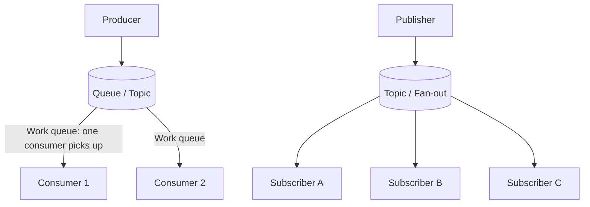

---

## 7. Common Bottlenecks + Solutions

| Bottleneck | Symptoms | Solutions |
|------------|----------|-----------|
| **DB read overload** | High DB CPU, slow SELECT queries | Add read replicas + Redis cache layer |
| **DB write overload** | Write queue growth, lock contention | DB sharding, async writes via queue, CQRS |
| **Hot partitions** | One server overwhelmed, others idle | Consistent hashing, write sharding, random suffix |
| **N+1 queries** | DB connection spikes, O(N) queries in loop | Eager loading (JOIN), DataLoader (batching), GraphQL |
| **Cold start** | Slow first load after deploy | Cache warming, CDN, Lambda Provisioned Concurrency |
| **Large blob storage** | DB bloat, slow backups | Offload to S3/object store; store URL in DB |
| **Long tail latency** | p99 >> p50 | Hedged requests, timeout + retry, circuit breaker |
| **Connection exhaustion** | DB `too many connections` error | Connection pool (RDS Proxy), reduce Lambda concurrency |
| **Thundering herd** | DB spike after cache expiry | Mutex lock, jitter on TTL, probabilistic early refresh |
| **Distributed transaction** | Inconsistent state across services | Saga pattern, 2PC, outbox pattern |

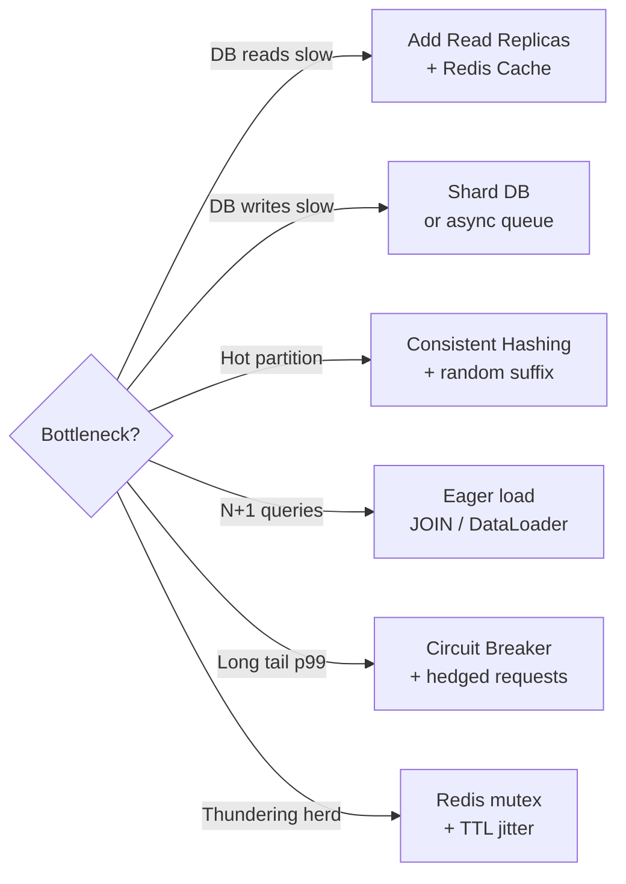

---

## 8. CAP Theorem Quick Reference

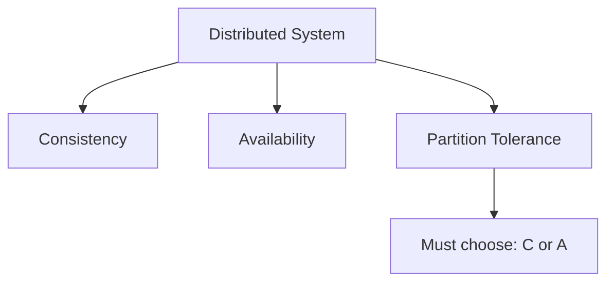

| Pick | Systems | Use When |
|------|---------|----------|
| **CP** (Consistency + Partition) | HBase, Zookeeper, etcd, Redis Cluster | Banking, inventory counts, distributed locks |
| **AP** (Availability + Partition) | Cassandra, DynamoDB, CouchDB, DNS | Social feeds, metrics, shopping carts |
| **CA** (not truly distributed) | PostgreSQL (single node), MySQL | Local deployments, small scale |

**PACELC extension:** In absence of partition (normal operation): trade Latency vs Consistency.
- Cassandra = PA/EL (available during partition, low latency normally)
- HBase = PC/EC (consistent during partition, consistent normally)

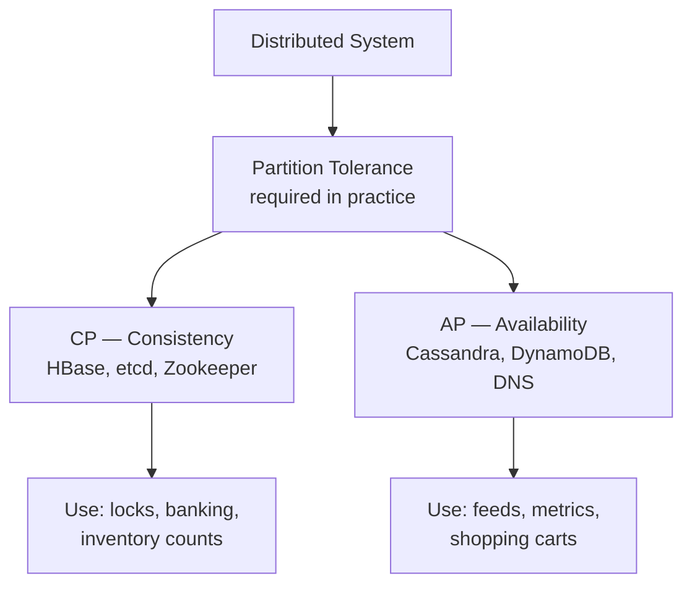

---

## 9. Common System Design Questions + 1-Line Architecture

| Question | Key Architectural Decision | Key Service/Pattern |
|----------|---------------------------|---------------------|
| **URL shortener** | Base62 encode(counter or hash); check collision | Redis (cache) + NoSQL (store) |
| **Rate limiter** | Token bucket or sliding window counter | Redis `INCR` + `EXPIRE` per key |
| **News feed** | Fan-out on write (push) vs fan-out on read (pull); celebrities = pull | Redis sorted sets + Kafka |
| **Video streaming** | CDN for delivery; adaptive bitrate (HLS/DASH); chunked upload | S3 + CloudFront + FFmpeg |
| **Typeahead / autocomplete** | Trie + top-K prefix cache; Redis sorted sets for top suggestions | Redis sorted sets + Elasticsearch |
| **Chat app** | WebSocket for real-time; message store for history; presence service | Redis pub/sub + Cassandra (history) |
| **Payment system** | Idempotency key; saga for distributed txn; double-entry ledger | ACID DB + outbox pattern + SQS |
| **Distributed lock** | SETNX + TTL; Redlock for multi-instance; fencing token | Redis / Zookeeper |
| **Search engine** | Inverted index; TF-IDF or BM25 ranking; sharded index | Elasticsearch / OpenSearch |
| **Push notifications** | Fan-out queue; device token registry; delivery guarantee | Kafka + APNs/FCM |
| **Ride sharing** | Geospatial index (QuadTree/S2); matching service; trip state machine | PostGIS / DynamoDB Geo + Redis |
| **Ticket booking** | Optimistic locking or distributed lock for seat hold; TTL on reservation | Redis lock + ACID DB |
| **Photo/Instagram** | Object storage for images; CDN; denormalized feed table | S3 + CloudFront + Cassandra |
| **Web crawler** | BFS queue; politeness (rate limit per domain); URL dedup | SQS + DynamoDB (visited set) |
| **Metrics / analytics** | Time-series DB; pre-aggregation; write-heavy append-only | Kafka → ClickHouse / TimescaleDB |
| **API gateway** | Auth (JWT/OAuth); rate limiting; request routing; circuit breaker | Kong / AWS API Gateway |
| **Leaderboard** | Sorted set with score; partition by time window (daily/weekly/all-time) | Redis `ZADD` / `ZRANK` |
| **File storage (Dropbox)** | Chunking + dedup + delta sync; metadata separate from chunks | S3 (chunks) + PostgreSQL (metadata) |
| **Live streaming** | Ingest RTMP → transcode → HLS segments → CDN; low-latency = WebRTC | Kinesis Video + CloudFront |
| **Ad auction** | Sub-10ms bidding; targeting index; budget pacing | Redis + Aerospike + Kafka |

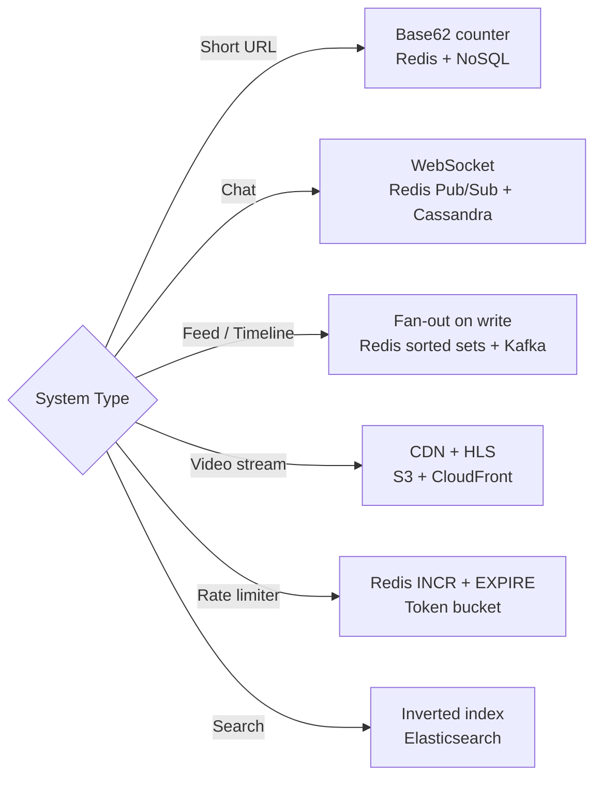

---

## 10. Estimations Reference

**Latency numbers (memorize order of magnitude):**

| Operation | Latency |
|-----------|---------|
| L1 cache reference | **1 ns** |
| L2 cache reference | **4 ns** |
| RAM access | **100 ns** |
| SSD random read | **~0.1 ms** (100 µs) |
| HDD seek | **~10 ms** |
| Same-region network | **~0.5 ms** |
| Cross-region network | **~150 ms** |
| Send 1 MB over 1 Gbps | **~10 ms** |

**Data sizes:**

| Type | Size |
|------|------|
| char / byte | 1 B |
| int | 4 B |
| long / timestamp | 8 B |
| UUID | 16 B |
| short URL | ~7 B |
| typical tweet | ~280 B |
| typical DB row | 1–2 KB |
| typical web page | ~1 MB |
| 1 MP image (compressed) | ~300 KB |
| 1 minute 720p video | ~50 MB |

**Scale conversions:**

| Users | Avg QPS | Peak QPS (10x) |
|-------|---------|----------------|
| 100K DAU | 1.2 QPS | 12 QPS |
| 1M DAU | 12 QPS | 120 QPS |
| 10M DAU | 120 QPS | 1,200 QPS |
| 100M DAU | 1,200 QPS | 12,000 QPS |
| 1B DAU | 12,000 QPS | 120,000 QPS |

**Storage math:**
- 1 million rows × 1 KB = **1 GB**
- 1 billion rows × 1 KB = **1 TB**
- 1 billion rows × 100 B = **100 GB**
- 10M users × 500 B profile = **5 GB** (fits in one DB)

**Bandwidth:**
- 1 Gbps = **125 MB/s**
- 1 Gbps = ~**100 million 10-byte messages/s**

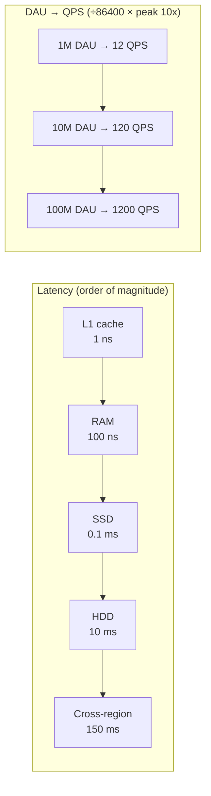

---

## 11. Trade-off Cheat Sheet

| Decision | Choose A When | Choose B When |
|----------|---------------|---------------|
| **Consistency vs Availability** | Banking, payments, inventory | Social feeds, metrics, likes |
| **SQL vs NoSQL** | Complex queries, ACID, <100M rows | Scale, flexible schema, simple lookups |
| **Read replicas vs Sharding** | Read-heavy; writes manageable | Write-heavy; single node can't keep up |
| **Sync vs Async** | Immediate user feedback needed | Decoupling, resilience, scale |
| **Cache-aside vs Write-through** | Mostly reads; some write miss OK | Read-heavy; cannot tolerate stale data |
| **Monolith vs Microservices** | Early stage; small team (<20 devs) | Scale teams independently; different scaling needs |
| **REST vs GraphQL** | Simple CRUD; caching important | Complex queries; mobile (bandwidth); many clients |
| **Push vs Pull (feed)** | Most users have small follower count | Celebrity/large follower accounts (pull for them) |
| **Horizontal vs Vertical** | Stateless; need resilience | Stateful; quick fix; simpler ops |
| **Eager vs Lazy loading** | Access pattern predictable; N+1 problem | Large objects; access optional; save bandwidth |

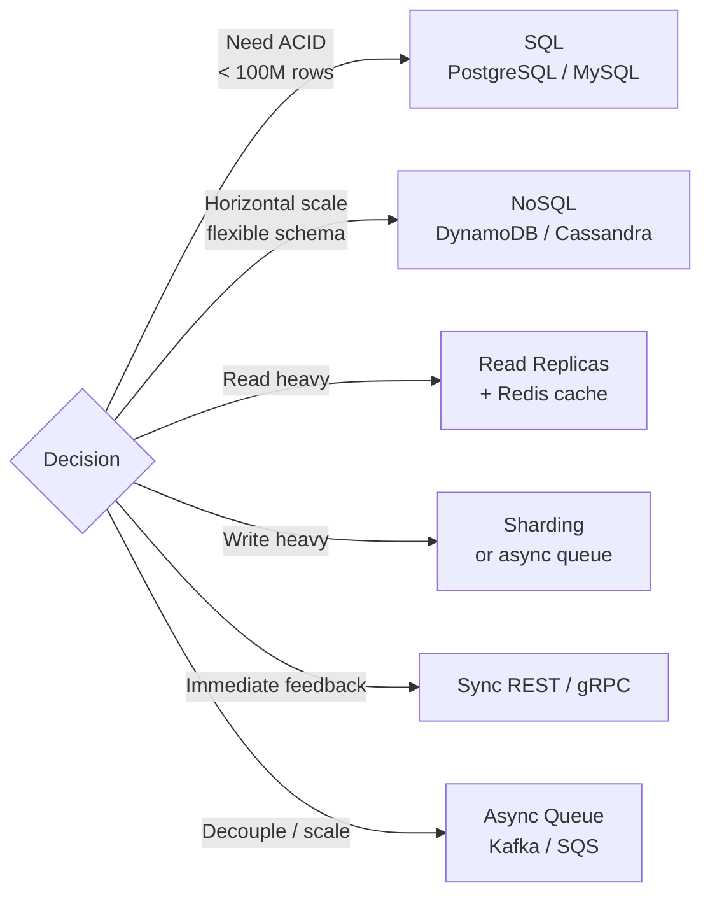

---

## 12. Interview Anti-Patterns (What Not to Do)

| Anti-pattern | What interviewers think | Fix |
|--------------|------------------------|-----|
| Jump to solution without clarifying | Can't gather requirements in real job | Always start with 3-5 clarifying questions |
| Over-engineer for Day 1 | No judgment on trade-offs | "Start simple, scale as needed" — show you know when |
| Propose microservices for small system | Resume-driven development | Monolith first, extract when pain point appears |
| Ignore failure cases | Doesn't think about production | Ask: "What happens if X fails?" for every component |
| Forget data model | No practical experience | Always draw entities + key fields + relationships |
| No numbers | Vague design, can't validate | Always estimate QPS and storage, even roughly |
| Design without bottleneck analysis | Can't identify real problems | After architecture: "The bottleneck is X because Y" |
| Strong consistency everywhere | Doesn't understand trade-offs | Explicitly call out where eventual consistency is OK |

```mermaid
flowchart TD
    Start[Interview starts] --> Clarify{Clarify requirements\n3-5 questions first}
    Clarify -->|Skip this| Fail1[❌ Can't gather requirements]
    Clarify --> Estimate[Rough estimation\nQPS + storage]
    Estimate -->|Skip numbers| Fail2[❌ Vague, unvalidated design]
    Estimate --> Arch[Simple architecture first\nmonolith → extract if needed]
    Arch -->|Jump to microservices| Fail3[❌ Resume-driven development]
    Arch --> Bottleneck[Identify bottleneck\n"The bottleneck is X because Y"]
    Bottleneck -->|No analysis| Fail4[❌ Can't identify real problems]
    Bottleneck --> Tradeoff[Name trade-offs explicitly\nwhere eventual consistency OK]
```

---

---

## 13. Question-Bank: System Design Deep Dives

### URL Shortener
**Design a URL shortener** — 100M URLs, 10K redirects/sec, <50ms p99

| | Write (shorten) | Read (redirect) |
|-|-----------------|-----------------|
| **Rate** | ~1,160 rps | ~116K rps (100:1 ratio) |
| **Storage** | PostgreSQL (mappings) | Redis cache (80% hit rate) |
| **Key component** | Base62(Snowflake ID) → 7-char code | 301 permanent / 302 temporary redirect |

- **Key number**: 18 TB/year at 500B avg per URL × 100M/day × 365
- **Decision**: Base62(counter) for sequential short codes vs MD5(URL)[0:7] for hash — use counter; avoids collision check overhead
- **Trap**: Using MD5 hash directly — collisions at scale; must add collision check loop
- → [Full article](../12-interview-prep/question-bank/system-design/design-url-shortener)

---

### Rate Limiter
**Design a rate limiter** — 100K rps, <1ms overhead, distributed enforcement

| Algorithm | Accuracy | Burst | Memory |
|-----------|----------|-------|--------|
| **Fixed window** | Low (boundary spike) | Allows 2× burst | O(1) |
| **Sliding window log** | High | No burst | O(requests) |
| **Token bucket** | High | Controlled burst | O(1) |
| **Sliding window counter** | Medium-high | Limited burst | O(1) |

- **Key number**: Redis `INCR` + `EXPIRE` handles ~100K ops/sec per node
- **Decision**: Use token bucket for APIs with burst tolerance; sliding window counter for strict per-second limits
- **Trap**: Fixed window counter allows 2× the limit at window boundary (burst attack vector)
- → [Full article](../12-interview-prep/question-bank/system-design/design-rate-limiter)

---

### Notification System
**Design a notification system** — multi-channel (push/SMS/email), 10M/day, guaranteed delivery

| Channel | Latency | Cost | Delivery guarantee |
|---------|---------|------|-------------------|
| Push (APNs/FCM) | <1s | Low | At-most-once |
| SMS (Twilio) | 1-5s | High | At-least-once |
| Email (SES) | 1-60s | Very low | At-least-once |

- **Key number**: Fan-out to 10M users — use Kafka partitioned by user_id; workers consume in parallel
- **Decision**: In-app notification = WebSocket push; background = async worker queue per channel
- **Trap**: Calling APNs/FCM synchronously in request path — use outbox + async worker to avoid timeout cascade
- → [Full article](../12-interview-prep/question-bank/system-design/design-notification-system)

---

### Chat System
**Design a chat system** — 1B messages/day, real-time delivery, message history

| | 1-to-1 Chat | Group Chat (< 500 members) | Group Chat (> 500 members) |
|-|-------------|--------------------------|--------------------------|
| **Delivery** | WebSocket direct | Fan-out to all members | Pull model on open |
| **Storage** | Cassandra (message_id, conversation_id) | Same | Same + offset tracking |

- **Key number**: WebSocket server handles ~10K concurrent connections per node; at 1B DAU need 100K nodes (use connection partitioning)
- **Decision**: Use Cassandra for message history (partition by conversation_id, order by message_id DESC)
- **Trap**: Fan-out on write to large groups (>500 members) creates write amplification — switch to fan-out on read
- → [Full article](../12-interview-prep/question-bank/system-design/design-chat-system)

---

### News Feed
**Design a news feed** — 500M users, <200ms feed load, celebrity problem

| Strategy | Write cost | Read cost | Celebrity handling |
|----------|-----------|-----------|-------------------|
| **Fan-out on write (push)** | High (write to all followers) | Low (precomputed) | ❌ 100M writes per celebrity post |
| **Fan-out on read (pull)** | Low | High (merge N feeds on read) | ✅ Pull per celebrity on read |
| **Hybrid** | Medium | Medium | ✅ Push for normal users, pull for celebrities |

- **Key number**: Twitter uses hybrid — users with >10K followers use pull model; everyone else uses push
- **Decision**: Hybrid approach — threshold typically 1K-10K followers for switching to pull
- **Trap**: Pure fan-out on write for celebrity accounts — a single post to 50M followers creates 50M write ops
- → [Full article](../12-interview-prep/question-bank/system-design/design-news-feed)

---

### Video Streaming
**Design video streaming** — YouTube/Netflix scale, adaptive bitrate, global CDN

| Component | Technology | Key metric |
|-----------|-----------|------------|
| Upload pipeline | S3 → FFmpeg transcoder → HLS segments | Transcode 1 min video in <2 min |
| CDN delivery | CloudFront / Akamai edge nodes | <50ms TTFB at edge |
| Adaptive bitrate | HLS (Apple) / DASH (open standard) | Segment size: 2-10s chunks |

- **Key number**: 1 min of 720p video = ~50 MB; transcode to 5 quality levels = ~200 MB total per minute
- **Decision**: HLS for Apple ecosystem / DASH for cross-platform; segment duration 4-6s balances seek latency vs overhead
- **Trap**: Not pre-warming CDN before video goes viral — use CDN push (pre-populate) for known popular content
- → [Full article](../12-interview-prep/question-bank/system-design/design-video-streaming)

---

### Search Autocomplete
**Design search autocomplete** — <100ms p99, top-K results, 10K qps

| Approach | Latency | Memory | Update speed |
|----------|---------|--------|-------------|
| **Trie in-memory** | <1ms | High (full trie) | Slow (rebuild) |
| **Redis Sorted Sets** | 1-5ms | Medium | Fast (ZADD) |
| **Elasticsearch prefix** | 5-20ms | Low (indexed) | Real-time |

- **Key number**: Top 10 prefixes cover 80% of queries — cache aggressively at CDN/edge
- **Decision**: Redis ZRANGEBYLEX for prefix matching; build offline trie for top-K, serve from cache
- **Trap**: Rebuilding trie in real-time on every search — use batch update every 10-60 min; serve stale trie from cache
- → [Full article](../12-interview-prep/question-bank/system-design/design-search-autocomplete)

---

### Ride Sharing
**Design a ride-sharing system** — Uber/Lyft scale, real-time matching, geospatial

| Component | Tech | Key detail |
|-----------|------|-----------|
| Geospatial index | Redis GEOADD / GEORADIUS or S2 cells | Query nearby drivers in <100ms |
| Driver location updates | WebSocket → Kafka → Redis Geo | 4s update interval per driver |
| Matching service | Score = proximity + rating + ETA | Sub-second matching decision |

- **Key number**: 5M active drivers × 4s update = 1.25M location updates/sec globally
- **Decision**: Geohash (simple, rectangular cells) vs S2 (Google, spherical, better for poles) — use S2 for global accuracy
- **Trap**: Storing all driver locations in a single Redis key — shard by geohash prefix for horizontal scale
- → [Full article](../12-interview-prep/question-bank/system-design/design-ride-sharing)

---

### Payment System
**Design a payment system** — exactly-once processing, idempotency, distributed transactions

| Pattern | Guarantee | Latency | Complexity |
|---------|-----------|---------|-----------|
| **Saga (choreography)** | Eventually consistent | Low | High (event tracking) |
| **Saga (orchestration)** | Eventually consistent | Medium | Medium (central coordinator) |
| **2PC** | Strong consistency | High (blocking) | Medium |
| **Outbox + idempotency** | At-least-once + dedup | Low | Low-medium |

- **Key number**: Idempotency key must be stored for at least 24h (retry window); use UUID v4 per payment attempt
- **Decision**: ACID DB (PostgreSQL) for ledger writes; Kafka outbox for downstream events; saga for cross-service rollback
- **Trap**: Not implementing idempotency — network retries cause double charges; every payment endpoint must be idempotent
- → [Full article](../12-interview-prep/question-bank/system-design/design-payment-system)

---

### Distributed Cache
**Design a distributed cache** — Redis cluster, consistent hashing, 100K ops/sec

| | Redis Cluster | Memcached |
|-|---------------|-----------|
| **Data structures** | Rich (sorted sets, streams, geo) | Simple KV only |
| **Persistence** | RDB + AOF | None |
| **Clustering** | Built-in (16384 hash slots) | Client-side sharding |
| **Use when** | Complex data, persistence needed | Pure cache, multi-threaded |

- **Key number**: Redis single node: ~100K ops/sec; Redis Cluster: scales linearly to millions ops/sec
- **Decision**: Consistent hashing for client-side sharding; Redis Cluster for server-side with automatic failover
- **Trap**: Hot key problem — single key getting millions of reads/writes; use local in-process cache + Redis read replicas
- → [Full article](../12-interview-prep/question-bank/system-design/design-distributed-cache)

---

### CDN
**Design a CDN** — 1B users, <50ms globally, 10M rps peak

| Tier | Role | Cache hit rate |
|------|------|---------------|
| Edge PoP (200+ cities) | Serve users | ~85-90% |
| Regional parent PoP | Backstop for edge miss | ~95% |
| Origin shield | Protect origin from thundering herd | ~99% |

- **Key number**: Cloudflare — 200+ PoPs; Akamai — 350K+ servers; target <50ms = PoP must be within ~2500km of user
- **Decision**: Pull CDN (on-demand caching) for dynamic content with varied TTLs; Push CDN for known static assets (pre-warm)
- **Trap**: Not setting correct Cache-Control headers at origin — CDN caches 404s or private data; always set `Cache-Control: public, max-age=N`
- → [Full article](../12-interview-prep/question-bank/system-design/design-cdn)

---

### API Gateway
**Design an API gateway** — 100K rps, <5ms overhead, 50+ microservices

| Plugin | Latency budget | Implementation |
|--------|---------------|----------------|
| TLS termination | ~0.5ms | Nginx/Envoy |
| JWT auth | ~0.5ms | Local verify (no DB call) |
| Rate limiting | ~1ms | Redis EVALSHA |
| Request routing | ~1ms | Service registry lookup |

- **Key number**: Target <5ms total gateway overhead; each plugin must stay under 1-2ms
- **Decision**: Static config file routing for stable services; dynamic service discovery (Consul/etcd) for microservices that scale frequently
- **Trap**: Doing DB lookup for every auth request — cache JWT public keys locally; validate tokens in-process, not via auth service call
- → [Full article](../12-interview-prep/question-bank/system-design/design-api-gateway)

---

### Job Scheduler
**Design a distributed job scheduler** — 10M jobs/day, sub-second precision, exactly-once

| Component | Tech | Key detail |
|-----------|------|-----------|
| Job store | PostgreSQL | Source of truth; next_run_at indexed |
| Due-job trigger | Polling every 100ms | SELECT FOR UPDATE SKIP LOCKED |
| Work queue | Redis Sorted Set | score = epoch_ms of next run |
| Worker heartbeat | Every 5s | Detect stale workers → requeue |

- **Key number**: 10M jobs/day = ~116 jobs/sec avg; `SELECT FOR UPDATE SKIP LOCKED` prevents duplicate dispatch
- **Decision**: Use Redis Sorted Set (score=run_time) as priority queue; PostgreSQL as durable job store with status tracking
- **Trap**: Not using `SKIP LOCKED` — multiple scheduler nodes pick up same job; use advisory lock or `SELECT FOR UPDATE SKIP LOCKED`
- → [Full article](../12-interview-prep/question-bank/system-design/design-job-scheduler)

---

### File Storage
**Design a file storage system** — Dropbox/Google Drive, 500M users, 10PB

| Component | Tech | Key detail |
|-----------|------|-----------|
| Chunk storage | S3 (content-addressed) | SHA-256 hash = storage key; dedup = 30% savings |
| Metadata DB | PostgreSQL | file_tree, chunk_refs, version history |
| Sync protocol | Delta sync via WebSocket | Send only changed chunks, not full file |
| Download | CDN (CloudFront) | Popular files served from edge |

- **Key number**: 10PB ÷ 1B files = 10MB avg; 1M uploads/day × 10MB = 10TB/day ingestion
- **Decision**: Content-addressed storage (hash → S3 key) enables deduplication; identical files stored once regardless of owner
- **Trap**: Uploading full file on every save — chunk files (4MB chunks), track which chunks changed, upload only delta
- → [Full article](../12-interview-prep/question-bank/system-design/design-file-storage)

---

### Location Service
**Design a real-time location service** — 100M drivers, 50K updates/sec, <100ms nearby query

| Index | Query type | Update cost | Precision |
|-------|-----------|------------|----------|
| **Redis GEOADD** | GEORADIUS in O(N+log M) | O(log N) | ~0.6m at precision 9 |
| **Geohash string** | Prefix match in range | O(log N) | Configurable by prefix length |
| **S2 cells** | Cell ID range query | O(log N) | Finest grain, spherical |
| **QuadTree** | Range query with tree traversal | O(log N) | Rectangular |

- **Key number**: 100M drivers × 50B per location = 5GB in Redis — fits in memory
- **Decision**: Redis Geo for simple nearby queries; S2 for precision global geo at Uber/Google scale
- **Trap**: Storing all drivers in one Redis geo key — can't shard easily; partition by geohash region prefix
- → [Full article](../12-interview-prep/question-bank/system-design/design-location-service)

---

### Recommendation Engine
**Design a recommendation engine** — Netflix/Spotify, 200M users, 100K items, <100ms

| Stage | Approach | Output size |
|-------|---------|------------|
| **Retrieval** | ANN (FAISS/ScaNN) on 128-dim embeddings | Top 500 candidates |
| **Ranking** | LightGBM / DNN with 100+ features | Top 20 ranked |
| **Post-filter** | Business rules (remove watched, promote new) | Final 10-20 results |

- **Key number**: User embeddings: 200M × 128 dims × 4B = 100GB; item embeddings: 100K × 128 × 4B = 50MB (tiny — cache in-process)
- **Decision**: Two-tower model (user tower + item tower) enables ANN retrieval; precompute user embeddings nightly, update on significant actions
- **Trap**: Re-running full model for every request — precompute candidate set nightly; only ranking is real-time
- → [Full article](../12-interview-prep/question-bank/system-design/design-recommendation-engine)

---

### Ad Click Aggregator
**Design an ad click aggregator** — 10B clicks/day, <5min latency, deduplication

| Component | Tech | Key detail |
|-----------|------|-----------|
| Ingest | Kafka (100 partitions, keyed by ad_id) | 116K clicks/sec avg; 350K peak |
| Dedup | Flink + Bloom filter per 10-min window | ~70M events in dedup window |
| Aggregation | Flink tumbling window (1 min) | Group by ad_id, country, device |
| Query layer | ClickHouse / Druid (columnar OLAP) | Sub-second dashboard queries |

- **Key number**: 30 TB/month raw storage; 10-minute dedup window covers 99% of duplicate clicks
- **Decision**: Flink tumbling windows for exact counts; approximate with HyperLogLog for unique users per ad
- **Trap**: Counting clicks in-process without Kafka — lose data on crash; always use durable queue as ingest buffer
- → [Full article](../12-interview-prep/question-bank/system-design/design-ad-click-aggregator)

---

### Web Crawler
**Design a web crawler** — 1B pages in 30 days, politeness, deduplication

| Component | Tech | Key detail |
|-----------|------|-----------|
| URL frontier | Redis Sorted Set (priority by PageRank) | 10B URLs × 100B = 1TB frontier |
| Politeness | 1 req/domain/10s rate limit | Need 4,000 domains in parallel |
| Content dedup | SHA-256 of stripped HTML | Bloom filter for fast URL seen check |
| Worker pods | 80 pods × 5 pages/sec | = 400 pages/sec = 1B in 30 days |

- **Key number**: 400 pages/sec target; 50KB avg page size = 50TB total storage; DNS cache critical (40 lookups/sec)
- **Decision**: BFS queue with priority (PageRank score as Redis sorted set score); re-crawl frequency based on page change rate
- **Trap**: Ignoring robots.txt or crawl-delay — domain bans your crawler IP; always fetch and respect robots.txt before crawling any domain
- → [Full article](../12-interview-prep/question-bank/system-design/design-web-crawler)

---

### Metrics & Monitoring
**Design a metrics monitoring system** — 1M time series, 100M data points/day, 30s alert latency

| Component | Tech | Key detail |
|-----------|------|-----------|
| Collection | Prometheus pull (15s scrape) | Or push via Pushgateway for batch jobs |
| Local storage | Prometheus TSDB (2 weeks) | Gorilla encoding: 10× compression |
| Long-term | Thanos / Cortex / VictoriaMetrics | 90-day retention across regions |
| Alerting | AlertManager (PromQL rules every 30s) | PagerDuty / Slack routing |

- **Key number**: 100M data points × 12B = 1.2GB/day raw; after Gorilla compression = ~120MB/day
- **Decision**: Pull model (Prometheus) for scrape-able services; push model (StatsD/OTel) for short-lived jobs and edge devices
- **Trap**: High cardinality labels (e.g., user_id as label) — creates millions of time series, crashes Prometheus; never use unbounded values as labels
- → [Full article](../12-interview-prep/question-bank/system-design/design-metrics-monitoring)

---

### Distributed Locking
**Design a distributed locking service** — 10K ops/sec, <1ms p99, 99.99% availability

| Backend | Latency | Consistency | Availability |
|---------|---------|------------|-------------|
| **Redis SETNX** | ~0.1ms | Weak (single node SPOF) | Depends on HA setup |
| **Redlock (5 nodes)** | ~1-5ms | Stronger (quorum) | 99.9%+ |
| **ZooKeeper ephemeral** | ~2-5ms | Strong (ZAB consensus) | 99.99% |
| **etcd (Raft)** | ~1-3ms | Strong (Raft consensus) | 99.99% |

- **Key number**: Fencing token (monotonically increasing integer) is mandatory for correctness — lock expiry ≠ safe release
- **Decision**: Redis SETNX for low-stakes locks (cache coordination); ZooKeeper/etcd for critical distributed consensus
- **Trap**: Trusting lock expiry without fencing tokens — a slow GC pause can cause a client to hold a "released" lock; always use fencing tokens at the resource
- → [Full article](../12-interview-prep/question-bank/system-design/design-distributed-locking)

---

---

## 14. Question-Bank: Distributed Systems Deep Dives

### CAP Theorem (Real World)
**CAP theorem** — CP vs AP trade-off during network partitions

| | CP Systems | AP Systems |
|-|-----------|-----------|
| **Examples** | HBase, ZooKeeper, etcd, PostgreSQL | Cassandra, DynamoDB, CouchDB |
| **During partition** | Return errors / block writes | Serve stale/inconsistent data |
| **Availability** | Drops during partition | Stays 99.9%+ |
| **Use when** | Locks, banking, inventory counts | Social feeds, metrics, carts |

- **Key number**: CAP trade-off only activates during partition; during normal operation you get all three
- **Decision**: CP when incorrect data is worse than downtime (financial); AP when downtime is worse than staleness (social, analytics)
- **Trap**: Choosing strong consistency everywhere in geo-distributed systems — adds 150ms+ cross-region RTT to every write; explicitly choose per data type
- → [Full article](../12-interview-prep/question-bank/distributed-systems/cap-theorem-real-world)

---

### Consensus Algorithms
**Consensus algorithms** — getting N nodes to agree even when some fail (Raft, Paxos)

| Algorithm | Simplicity | Leader | Used by |
|-----------|-----------|--------|--------|
| **Paxos** | Complex | Elected proposer | Google Chubby, original ZooKeeper |
| **Raft** | Simpler | Strong single leader | etcd, CockroachDB, TiKV, Consul |
| **ZAB** | Medium | Primary-backup | Apache ZooKeeper |

- **Key number**: To tolerate F failures → need **2F+1** nodes; tolerate 1 failure = 3 nodes; tolerate 2 = 5 nodes
- **Decision**: Use Raft for new systems (simpler, better understood); Paxos for academic/deep customization needs
- **Trap**: FLP impossibility — no deterministic algorithm achieves consensus in fully async system with even 1 crash; real systems work around with timeouts (partial synchrony assumption)
- → [Full article](../12-interview-prep/question-bank/distributed-systems/consensus-algorithms)

---

### Distributed Transactions
**Distributed transactions** — atomicity across multiple services/databases

| Approach | Isolation | Latency | Complexity | Use when |
|----------|----------|---------|-----------|---------|
| **2PC** | Strong | High (+2 RTT min) | Medium | Same DC, DB-native support |
| **Saga** | None (intermediate visible) | Low | High | Microservices, long workflows |
| **Outbox pattern** | Per-service ACID | Low | Low | Guaranteed event publishing |

- **Key number**: 2PC adds minimum **2 RTTs** coordination overhead; at 5ms inter-service RTT = 10ms pure overhead before business logic
- **Decision**: 2PC for same-DB-cluster operations; Saga + compensating transactions for cross-service microservice flows
- **Trap**: Distributed transactions hold locks across services — a slow participant blocks all other transactions on those resources; prefer Saga with idempotent compensating transactions
- → [Full article](../12-interview-prep/question-bank/distributed-systems/distributed-transactions)

---

### Event Sourcing & CQRS
**Event sourcing + CQRS** — immutable event log as source of truth, separate read/write models

| | CRUD | Event Sourcing |
|-|------|---------------|
| **State storage** | Current state only | All events (append-only) |
| **History** | Lost (need audit log) | Built-in |
| **Reads** | O(1) | O(N) without snapshots |
| **Write** | O(1) | O(1) (append) |

- **Key number**: Event replay without snapshots — 100K events × 1ms = **100 seconds** to reconstruct state; take snapshots every 1K events
- **Decision**: Event sourcing for audit-heavy domains (finance, healthcare); CRUD for simple CRUD apps where history doesn't matter
- **Trap**: Querying the event store directly for reporting — event stores are not query-optimized; build read-model projections (CQRS) and query those instead
- → [Full article](../12-interview-prep/question-bank/distributed-systems/event-sourcing-cqrs)

---

### Saga Pattern
**Saga pattern** — eventual atomicity across microservices via compensating transactions

| | Choreography | Orchestration |
|-|-------------|--------------|
| **Coordination** | Event-driven, decentralized | Central coordinator (saga orchestrator) |
| **Coupling** | Loose (services emit events) | Tighter (orchestrator knows all steps) |
| **Observability** | Hard (trace across events) | Easy (orchestrator tracks state) |
| **Use when** | Simple linear flows | Complex flows with branching/retries |

- **Key number**: Sagas have **no isolation** — other transactions see intermediate state; design compensating transactions for every step
- **Decision**: Choreography for simple 3-4 step flows; orchestration for complex multi-branch business processes where visibility is important
- **Trap**: No compensation for a failed step — if step 3 fails and step 2 has no compensating transaction, you're left in a permanently inconsistent state
- → [Full article](../12-interview-prep/question-bank/distributed-systems/saga-pattern)

---

### Leader Election
**Leader election** — ensuring exactly one node coordinates without split-brain

| Algorithm | Convergence | Used by | Failure cost |
|-----------|------------|--------|-------------|
| **Bully** | O(N²) messages | Simple systems | High (many elections) |
| **Raft** | O(log N) | etcd, Consul | ~150-600ms election |
| **ZAB** | Fast | ZooKeeper | ~100-300ms |
| **etcd lease** | Instant (leased) | Kubernetes controller | TTL-based auto-release |

- **Key number**: Election typically causes **100–600ms downtime** per event; minimize by tuning heartbeat/timeout ratios (heartbeat = 1/10 of election timeout)
- **Decision**: Use etcd/ZooKeeper lease-based election for any production system; never implement custom leader election
- **Trap**: Split-brain — two nodes both believe they're the leader (network partition heals too slowly); use fencing tokens on the protected resource to reject stale leader writes
- → [Full article](../12-interview-prep/question-bank/distributed-systems/leader-election)

---

### Clock Synchronization
**Clock synchronization** — handling clock drift and skew in distributed systems

| Issue | Magnitude | Impact |
|-------|----------|--------|
| **Clock drift** | 10–200 ppm (up to 17s/day) | Ordering errors accumulate |
| **NTP accuracy** | ±1–10ms LAN, ±50ms WAN | Last-write-wins conflicts |
| **Cross-DC skew** | Up to ±100ms | Wrong snapshot reads |

- **Key number**: Assume ±**100ms** clock skew between hosts in different DCs; design systems that tolerate this
- **Decision**: Use logical clocks (Lamport/vector clocks) for causal ordering; use TrueTime (Spanner) or HLC for bounded physical clock ordering
- **Trap**: Using wall-clock timestamps for event ordering across services — two events 50ms apart cannot be reliably ordered with NTP; use vector clocks or a single sequence generator
- → [Full article](../12-interview-prep/question-bank/distributed-systems/clock-synchronization)

---

### Gossip Protocol
**Gossip protocol** — decentralized state propagation without single coordinator

| Property | Value |
|----------|-------|
| **Propagation time** | O(log N) rounds; 1K nodes ≈ 10s; 10K nodes ≈ 14s |
| **Bandwidth** | 1K nodes × 3 peers × 200B = **600KB/sec** (negligible) |
| **Fault tolerance** | Continues with 30%+ node failures |
| **Used by** | Cassandra (membership), Redis Cluster, Consul, Bitcoin |

- **Key number**: Full cluster propagation in **O(log N) rounds**; 1,000 nodes with 1s gossip interval = ~10 seconds
- **Decision**: Gossip for membership/health state in large clusters (100+ nodes); direct broadcast (pub/sub) for small clusters where immediacy matters
- **Trap**: Gossip is eventually consistent — critical coordination (leader election, distributed locks) must NOT use gossip alone; combine with consensus (Raft/Paxos)
- → [Full article](../12-interview-prep/question-bank/distributed-systems/gossip-protocol)

---

### Vector Clocks
**Vector clocks** — tracking causal ordering and detecting concurrent writes

| | Wall-clock | Lamport clock | Vector clock |
|-|-----------|--------------|-------------|
| **Ordering** | Physical time | Partial (happens-before) | Full causal ordering |
| **Concurrent detection** | No | No | **Yes** |
| **Size** | 8 bytes | 8 bytes | N × 4 bytes (N = nodes) |
| **Used by** | — | Kafka offsets | DynamoDB, Riak, Amazon S3 |

- **Key number**: Vector clock size = N nodes × 4 bytes; at 10 nodes = **40 bytes** per event — small overhead
- **Decision**: Use vector clocks when concurrent write detection is required (shopping cart, collaborative editing); Lamport clocks when only happened-before ordering is needed
- **Trap**: Confusing "concurrent" with "conflicting" — two concurrent writes may be perfectly compatible (different fields); business logic decides which concurrent events actually conflict
- → [Full article](../12-interview-prep/question-bank/distributed-systems/vector-clocks)

---

### Two-Phase Commit (2PC)
**Two-phase commit** — atomic writes across multiple databases

| Phase | Action | Failure impact |
|-------|--------|---------------|
| **Phase 1 — Prepare** | All participants lock + log intent, reply YES/NO | Any NO → abort all |
| **Phase 2 — Commit** | Coordinator sends COMMIT/ABORT | Coordinator crash = participants **blocked** |

- **Key number**: 2PC minimum **2 network RTTs**; if coordinator crashes after Phase 1 — participants hold locks indefinitely (blocking protocol)
- **Decision**: 2PC for same-datacenter operations where coordinator HA is guaranteed; Saga for cross-service/cross-DC where blocking is unacceptable
- **Trap**: Coordinator single point of failure in Phase 2 — if coordinator crashes after all participants vote YES but before sending COMMIT, all participants are stuck holding locks with no way to proceed
- → [Full article](../12-interview-prep/question-bank/distributed-systems/two-phase-commit)

---

### Idempotency at Scale
**Idempotency** — making operations safe to retry without duplicates

| Method | Scope | Storage | Works for |
|--------|-------|---------|----------|
| **Idempotency key (DB)** | Per-operation UUID | DB unique constraint | Payment APIs, REST POST |
| **Deduplication window** | Time-bounded | Redis SET with TTL | Webhook consumers, SQS |
| **Conditional writes** | Version check | DB `WHERE version=N` | Optimistic locking |
| **Outbox pattern** | At-least-once | DB outbox table | Event publishing |

- **Key number**: Amazon — 0.1% duplicate rate without idempotency = **400K duplicate charges/year** at 400M orders
- **Decision**: Idempotency key stored in DB (unique constraint) for payments and critical writes; Redis dedup window for high-throughput event consumers
- **Trap**: At-least-once delivery (Kafka, SQS, webhooks) guaranteed ≥1 delivery — consumer MUST be idempotent; exactly-once is only achievable within a single system boundary
- → [Full article](../12-interview-prep/question-bank/distributed-systems/idempotency-at-scale)

---

### Partition Tolerance
**Partition tolerance** — detecting and handling network splits in production

| Detection method | Default timeout | Recommended |
|-----------------|----------------|-------------|
| TCP keepalive | 7200s (OS default) | Too slow — use app heartbeats |
| App heartbeat | Custom | 1-5s with 3× miss threshold |
| Health check (LB) | 30s | 10s for fast failover |

- **Key number**: TCP keepalive default = **7200s** — 2 hours before partition detected without app-level heartbeats
- **Decision**: Always implement application-level heartbeats (1-5s); treat any unresponsive node as partitioned after 3 missed heartbeats (3-15s)
- **Trap**: Designing for "the network never fails" — in production, AWS VPCs experience partitions due to misconfigured security groups, fiber cuts, and BGP errors; build for partition tolerance from day 1
- → [Full article](../12-interview-prep/question-bank/distributed-systems/partition-tolerance)

---

---

## 15. Question-Bank: AI/ML Systems Deep Dives

### ML Pipeline Design
**ML pipeline** — end-to-end data-to-prediction system architecture

| Stage | Effort % | Key tool |
|-------|---------|---------|
| Data ingestion | 10% | S3, Kafka, Airflow |
| Feature engineering | **60–80%** | Spark, dbt, feature store |
| Training | 10% | SageMaker, Vertex AI |
| Evaluation | 5% | Shadow scoring vs live traffic |
| Serving + monitoring | 5% | FastAPI, Prometheus, data drift alerts |

- **Key number**: Feature engineering = **60–80% of total ML effort**; offline–online metric gap >5% triggers alert
- **Decision**: Batch pipeline (Airflow DAGs) for large-scale training; streaming pipeline (Kafka + Flink) for real-time feature computation
- **Trap**: Training on historical data but serving on real-time data without validating the distribution match — training-serving skew is the #1 cause of silent model degradation in production
- → [Full article](../12-interview-prep/question-bank/ai-ml-systems/ml-pipeline-design)

---

### LLM System Design
**LLM serving** — TTFT, TPOT, KV cache, and throughput optimization

| Metric | Target | Bottleneck |
|--------|--------|-----------|
| **TTFT** (time to first token) | <200ms | Prefill: compute-bound |
| **TPOT** (time per output token) | <30ms/token (>33 tok/s) | Decode: memory-bandwidth-bound |

- **Key number**: KV cache for Llama-3 70B at 4K context, batch=32 = **~48 GB** GPU memory; PagedAttention (vLLM) gives **2–4× throughput** by eliminating fragmentation
- **Decision**: Use KV cache (always); PagedAttention/vLLM for high-throughput serving; speculative decoding for latency-critical interactive chat
- **Trap**: Serving LLMs without KV cache — decode step recomputes attention over full sequence for every token (O(n²)); with KV cache it's O(1) per token regardless of sequence length
- → [Full article](../12-interview-prep/question-bank/ai-ml-systems/llm-system-design)

---

### RAG Architecture
**RAG (Retrieval-Augmented Generation)** — grounding LLM answers in up-to-date facts

| | RAG | Fine-tuning |
|-|-----|------------|
| **Data freshness** | Real-time (update vector store) | Stale until next fine-tune |
| **Cost** | Low (index update ~$0.01/MB) | High ($5K–$50K per training run) |
| **Factual accuracy** | High (cites sources) | May hallucinate out-of-date facts |
| **Use when** | Domain docs change frequently | Behavior/style/reasoning adaptation |

- **Key number**: Chunk size matters — 512-token chunks for dense text; overlap of 20% (102 tokens) between chunks prevents answer at boundary being missed
- **Decision**: RAG when knowledge changes frequently or needs citations; fine-tuning when you need to change model behavior, tone, or reasoning style
- **Trap**: Retrieving semantically similar chunks that don't contain the answer — top-K retrieval by similarity ≠ top-K by answer relevance; add reranking (cross-encoder) to improve answer accuracy
- → [Full article](../12-interview-prep/question-bank/ai-ml-systems/rag-architecture)

---

### Vector Database Design
**Vector databases** — ANN search for embeddings at scale

| Index | Search speed | Recall | Memory overhead |
|-------|-------------|--------|----------------|
| **Exhaustive KNN** | O(N) — 500ms+ at 1M vecs | 100% | None |
| **HNSW** | O(log N) — **<10ms at 1M** | ~95% @10 | ~100B/vec for graph edges |
| **IVF-Flat** | O(√N) — fast build | ~90% @10 | Centroids only |
| **Product Quantization** | Fast, compressed | ~85% | 4–16× compression |

- **Key number**: HNSW on 1M × 1536-dim vectors: **<10ms** ANN search with **~95% recall@10** — **50–100× faster** than exhaustive KNN
- **Decision**: HNSW for latency-sensitive applications (real-time recommendation); IVF-PQ for billion-scale where memory is the bottleneck; Pinecone/Weaviate for managed service
- **Trap**: Ignoring metadata filtering — vector similarity alone is insufficient; "find similar products that are in stock and under $50" requires hybrid filtering (metadata WHERE clause + ANN); not all vector DBs support this efficiently
- → [Full article](../12-interview-prep/question-bank/ai-ml-systems/vector-database-design)

---

### Model Serving Infrastructure
**Model serving** — online vs batch vs hybrid inference patterns

| Pattern | Latency SLA | Cost | Use when |
|---------|------------|------|---------|
| **Online** | p99 <100ms | High (GPU reserved) | Input unknown ahead of time (fraud, search) |
| **Batch** | N/A (job run) | **100× cheaper/prediction** | Large user set with predictable inputs (daily recs) |
| **Hybrid** | Batch for most, online for new | Medium | YouTube-style: pre-compute 95%, real-time 5% |

- **Key number**: Minimum **10K–100K samples per variant** before declaring A/B winner (p < 0.05, MDE >1% relative lift); auto-rollback if p99 latency exceeds SLA by **20%** or error rate exceeds **0.1%**
- **Decision**: Shadow mode first (zero user impact, validates latency + errors) → 1% canary → 5% → 20% → 100%; never skip shadow mode
- **Trap**: Launching new model without shadow mode — first signal of latency regression is user complaints, not metrics; shadow mode catches it with zero user impact
- → [Full article](../12-interview-prep/question-bank/ai-ml-systems/model-serving-infrastructure)

---

### Feature Store Design
**Feature store** — centralized feature management eliminating training-serving skew

| Store type | Latency | Data | Storage |
|-----------|--------|------|--------|
| **Online store** | 2–10ms | Latest value only | Redis, DynamoDB, Cassandra |
| **Offline store** | Minutes (batch) | Full history with timestamps | Parquet on S3, BigQuery, Delta Lake |

- **Key number**: Training-serving skew causes **10–30% accuracy loss** in production; feature store eliminates it by using the same feature definition for training and serving
- **Decision**: Online store for real-time inference features; offline store for training data generation; always use point-in-time correct joins to prevent data leakage
- **Trap**: Recomputing features at serving time with different code than training time — even a timezone difference or rounding difference creates skew; feature store enforces single definition
- → [Full article](../12-interview-prep/question-bank/ai-ml-systems/feature-store-design)

---

### A/B Testing ML Models
**ML model A/B testing** — statistical significance, shadow mode, and safe rollout

| Phase | Traffic % | Goal |
|-------|----------|------|
| Shadow mode | 0% (copies) | Validate latency + errors, zero user impact |
| Canary | 1–5% | Detect regressions with minimal blast radius |
| Ramp | 20% → 50% | Confirm statistical significance |
| Full rollout | 100% | Production model |

- **Key number**: Sample size formula — N ≈ 2 × (z_α/2 + z_β)² × p(1-p) / Δ²; at 5% baseline CTR and 0.5% MDE → need **~30K users per variant**
- **Decision**: A/B test (random split) for overall model lift; multi-armed bandit for continuous optimization where exploration/exploitation trade-off matters
- **Trap**: Declaring victory too early (peeking problem) — checking significance daily and stopping when p<0.05 inflates false positive rate to ~26%; run for pre-determined sample size, then check once
- → [Full article](../12-interview-prep/question-bank/ai-ml-systems/ab-testing-ml-models)

---

### AI Agent Architecture
**AI agents** — LLM + tools + memory in an autonomous action loop

| Component | Role | Examples |
|-----------|------|---------|
| **LLM** | Plan and reason | GPT-4, Claude, Gemini |
| **Tools** | Take actions | Web search, code execution, DB query, API call |
| **Short-term memory** | Conversation context | In-context window (8K–200K tokens) |
| **Long-term memory** | Persistent knowledge | Vector store retrieval |
| **Orchestrator** | Run the loop | LangChain, LlamaIndex, custom |

- **Key number**: Context window fills fast — each tool call adds result to context; at 128K token limit, complex tasks may fail mid-way; implement context summarization after every N steps
- **Decision**: ReAct pattern (Reason + Act interleaved) for multi-step tool use — outperforms pure chain-of-thought by **10–20%** on QA benchmarks; use structured output (JSON) for reliable tool call parsing
- **Trap**: No iteration limit — an agent that loops indefinitely burns tokens and incurs unbounded cost; always set `max_iterations=20` and a token budget; handle graceful termination when limit is reached
- → [Full article](../12-interview-prep/question-bank/ai-ml-systems/ai-agent-architecture)

---

---

## 16. Question-Bank: Algorithms & Patterns Deep Dives

### Consistent Hashing
**Consistent hashing** — minimizing key remapping when nodes are added/removed

| | Modulo hashing (`key % N`) | Consistent hashing |
|-|--------------------------|-------------------|
| **Keys moved on node change** | ~(N-1)/N ≈ 90% | ~**1/N** ≈ 10% |
| **Complexity** | O(1) | O(log N) with virtual nodes |
| **Hot spots** | Uneven on hash collisions | Virtual nodes fix skew |
| **Used by** | Simple caches | Cassandra, DynamoDB, Redis Cluster, Akamai |

- **Key number**: Removing 1 of 10 nodes with modulo hashing moves **~90% of keys**; consistent hashing moves **~10%** — 9× less disruption
- **Decision**: Always use consistent hashing (or virtual nodes variant) for distributed caches and data stores; modulo hashing only for toy projects
- **Trap**: Consistent hashing without virtual nodes — non-uniform distribution causes hot spots; use 100–200 virtual nodes per physical node to even out the ring
- → [Full article](../12-interview-prep/question-bank/algorithms-patterns/consistent-hashing)

---

### Bloom Filters & HyperLogLog
**Probabilistic data structures** — set membership and cardinality estimation with tiny memory

| Structure | Use case | Error type | Memory (1B elements) |
|-----------|---------|-----------|---------------------|
| **Bloom filter** | "Is X in the set?" | False positives only (no false negatives) | ~1.2 GB at 1% FPR |
| **HyperLogLog** | "How many distinct X?" | ~0.81% estimation error | **<1.5 KB** |
| **Count-Min Sketch** | "How often does X appear?" | Overcount only (bounded) | ~40 KB |

- **Key number**: HyperLogLog estimates cardinality of **1 billion unique IPs** using **<1.5 KB** vs 4 GB for a HashSet — **1 million× smaller**
- **Decision**: Bloom filter for "definitely not in DB" guard (skip expensive lookup); HyperLogLog for unique visitor count; Count-Min Sketch for top-N frequency estimation
- **Trap**: Bloom filter false negatives are impossible, but false positives are tunable — a 1% FPR bloom filter at 1B elements still gives **10M false positives**; size the filter for your acceptable FPR
- → [Full article](../12-interview-prep/question-bank/algorithms-patterns/bloom-filters-hyperloglog)

---

### Rate Limiting Algorithms
**Rate limiting algorithms** — preventing API abuse with correct boundary handling

| Algorithm | Memory | Boundary burst | Smoothness | Use when |
|-----------|--------|---------------|-----------|---------|
| **Fixed window** | O(1) | Yes (2× rate at boundary) | No | Simple, low-stakes rate limits |
| **Sliding window log** | O(N requests) | No | Yes | Accurate per-user limits |
| **Sliding window counter** | O(1) approx | Minimal | Yes | High-throughput approximation |
| **Token bucket** | O(1) | Allows burst up to bucket | Bursty | APIs with burst tolerance |
| **Leaky bucket** | O(queue) | No (fixed output) | Smooth | Strict rate enforcement |

- **Key number**: Fixed window boundary attack — 100 req/min limit → 100 at 11:59:59 + 100 at 12:00:01 = **200 requests in 2 seconds** without triggering the limit
- **Decision**: Token bucket for user-facing APIs where burst is acceptable; sliding window log for strict per-second enforcement; leaky bucket for upstream rate smoothing
- **Trap**: Fixed window at scale — attackers exploit the window boundary to double their rate; use sliding window counter (Redis ZADD + ZREMRANGEBYSCORE) for accurate enforcement
- → [Full article](../12-interview-prep/question-bank/algorithms-patterns/rate-limiting-algorithms)

---

### Data Structures at Scale
**Data structures for system design** — choosing the right structure for in-memory sorted sets and top-K

| Structure | Search | Insert | Range query | Best for |
|-----------|--------|--------|------------|---------|
| **Skip list** | O(log N) | O(log N) | O(log N + K) | In-memory sorted sets (Redis ZADD) |
| **B-tree** | O(log N) | O(log N) | O(log N + K) | Disk-based sorted indexes (InnoDB) |
| **Min-heap (top-K)** | O(1) min | O(log K) | N/A | Top-K from N elements: O(N log K) |
| **Trie** | O(L) | O(L) | O(prefix) | Autocomplete, IP routing |

- **Key number**: Top-K with heap — O(N log K) vs O(N log N) sort; at N=1M, K=100: **3× faster** than sort; Redis uses skip list for sorted sets
- **Decision**: Skip list for in-memory sorted sets (simpler concurrent modification vs B-tree); min-heap for streaming top-K; B-tree for disk-based indexes
- **Trap**: Using a max-heap for top-K smallest elements — use a min-heap of size K; evict the min when a new element exceeds it; max-heap requires sorting the entire dataset first
- → [Full article](../12-interview-prep/question-bank/algorithms-patterns/data-structures-at-scale)

---

### Search Algorithms & Systems
**Search systems** — inverted index, TF-IDF, BM25, and Elasticsearch internals

| Concept | Detail |
|---------|--------|
| **Inverted index** | term → [(doc_id, tf, positions)] posting list; stored sorted by doc_id for efficient merge |
| **TF-IDF** | TF(term in doc) × IDF(log(N/docs_with_term)); rewards rare terms in specific docs |
| **BM25** | Industry standard (Elasticsearch default); adds document length normalization over TF-IDF |
| **Delta encoding** | Store differences between consecutive doc_ids (not absolute) — 10× compression |

- **Key number**: Elasticsearch shard = one Lucene index; max **2.1B documents per shard** (~50GB per shard recommended); too-large shards → slow GC, slow recovery
- **Decision**: TF-IDF for simple implementations; BM25 for production (outperforms TF-IDF on all standard benchmarks); semantic search (vector ANN) for meaning-based retrieval
- **Trap**: Not applying stopword removal and stemming before indexing — "the", "and", "is" appear in every document, creating massive posting lists with IDF ≈ 0 (useless for ranking); always filter stopwords
- → [Full article](../12-interview-prep/question-bank/algorithms-patterns/search-algorithms-systems)

---

### Approximation Algorithms
**Approximation algorithms** — trading exact answers for massive memory savings in distributed systems

| Algorithm | Problem | Error bound | Memory |
|-----------|---------|------------|--------|
| **Count-Min Sketch** | Frequency estimation | Overcount ≤ ε × total_events | ~40 KB (W=1K, D=7) |
| **HyperLogLog** | Cardinality estimation | ~0.81% std error | <1.5 KB |
| **Reservoir sampling** | Stream sampling | Exact uniform (probabilistic) | O(K) for K samples |
| **Bloom filter** | Set membership | FPR tunable (typically 1%) | ~1.2 GB at 1B, 1% FPR |

- **Key number**: Count-Min Sketch at W=1000, D=7 — at 1M total events, overcount ≤ **1,000** with 99.9% probability; memory = **40KB** vs 8MB for exact HashMap
- **Decision**: Count-Min Sketch for top-N frequency in high-cardinality streams (ad clicks, trending topics); reservoir sampling for uniform sampling when stream size is unknown; Bloom filter for "not in set" guards
- **Trap**: Count-Min Sketch only overcounts (never undercounts) — set W large enough so the overcount bound is acceptable; for ad billing use exact counters; for rate limiting use Count-Min Sketch
- → [Full article](../12-interview-prep/question-bank/algorithms-patterns/approximation-algorithms)

---

*Last updated: 2026-03-27*
