# System Design Patterns Cheat Sheet

> The mental framework for any system design question. Scan the patterns, use the decision tables.

---

## 1. The SA Framework (use for every interview question)

Run this checklist for every question — interviewers want to see structure first:

```
1. CLARIFY    → Who uses it? What scale? Read-heavy or write-heavy?
               Consistency vs availability? Latency SLA?

2. ESTIMATE   → DAU, QPS, storage, bandwidth (back-of-envelope)

3. DATA MODEL → What entities? Relationships? SQL or NoSQL?

4. API DESIGN → REST endpoints or events — inputs/outputs only

5. ARCHITECTURE → Draw the boxes: client → LB → app → cache → DB
                  Add CDN, queue, worker as needed

6. DEEP DIVE  → Pick 1-2 bottlenecks and solve them in detail
```

**Estimation formulas:**
- `QPS = DAU × actions_per_day / 86,400`
- `Storage = records × avg_record_size × retention_days`
- `Bandwidth = QPS × avg_payload_size`
- Rule of thumb: **1M DAU → ~12 QPS average** (1M / 86,400)

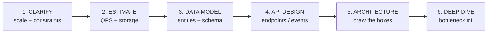

---

## 2. Scalability Patterns

| Pattern | When to Use | Key Tradeoff |
|---------|-------------|--------------|
| **Horizontal scaling** | Stateless services; commodity hardware | Need load balancer; data sync complexity |
| **Vertical scaling** | Stateful, hard to shard; quick win | Single point of failure; hardware ceiling |
| **Stateless design** | Always for app servers | Sessions in Redis/DB, not local memory |
| **Read replicas** | Read:write ratio > 5:1 | Replication lag → stale reads |
| **Caching layer** | Repeated reads, expensive computation | Cache invalidation is hard |
| **CDN** | Static assets, global users | Origin must handle cache miss spike |
| **Sharding** | Single DB can't handle write load | Cross-shard queries are hard; resharding pain |
| **CQRS** | Read model ≠ write model; analytics on write path | Eventual consistency between models |
| **Async processing** | Non-blocking background work | Eventual completion; harder error handling |

**Scale thresholds (rough rules):**

| Load | Pattern |
|------|---------|
| < 1K QPS | Single DB + app server is fine |
| 1K–10K QPS | Add read replicas + Redis cache |
| 10K–100K QPS | Sharding or switch to NoSQL; CDN for static |
| 100K+ QPS | Full distributed system; event-driven; Kafka |

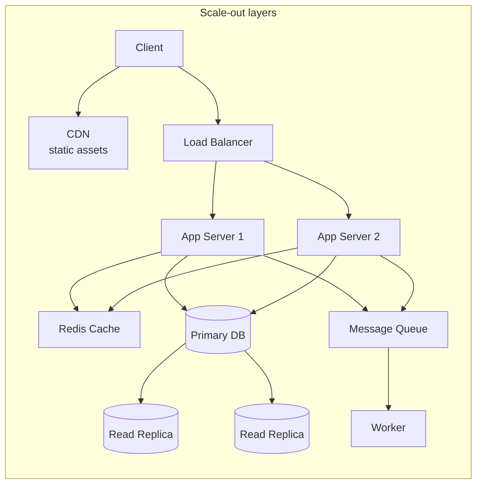

---

## 3. Load Balancing

[Deep dive →](../12-interview-prep/system-design/load-balancing-strategies)

| | **L4 (Transport)** | **L7 (Application)** |
|-|-------------------|----------------------|
| **Operates at** | TCP/UDP | HTTP/HTTPS |
| **Routing based on** | IP + port | URL, headers, cookies, body |
| **AWS equivalent** | NLB | ALB |
| **TLS termination** | No | Yes |
| **Performance** | Faster (no packet inspection) | Slower (full parse) |
| **Use when** | Non-HTTP, ultra-low latency, IoT | Web apps, microservices, path routing |

**Algorithms:**

| Algorithm | When | Sticky? |
|-----------|------|---------|
| **Round Robin** | Equal-capacity servers, stateless | No |
| **Weighted Round Robin** | Different server capacities | No |
| **Least Connections** | Variable request duration | No |
| **IP Hash** | Need sticky sessions (no external state) | Yes |
| **Least Response Time** | Latency-sensitive | No |
| **Random** | Simple, stateless, large cluster | No |

**Health checks:** TCP (port open) < HTTP (200 OK) < HTTPS (with cert check). Always use HTTP/HTTPS for web apps.

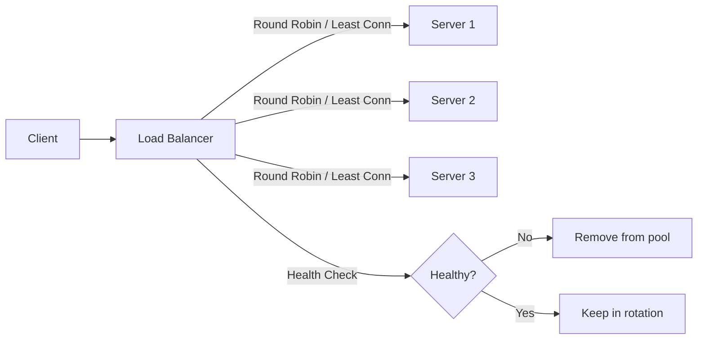

---

## 4. Caching Strategy

[Deep dive →](../12-interview-prep/system-design/caching-strategies)

**When to cache:**
- Read-heavy workload (>80% reads)
- Data changes infrequently or staleness is acceptable
- Origin has high latency or compute cost
- Same data requested repeatedly (hot keys)

**Where to cache:**

```
User → [Browser/CDN] → [API Gateway response cache] → [App in-memory (LRU)]
     → [Distributed cache (Redis)] → [DB query result] → Database
```

**Cache patterns:**

| Pattern | Write Flow | Read Flow | Best For |
|---------|------------|-----------|----------|
| **Cache-aside** (most common) | Write to DB only | Check cache → miss → DB → populate cache | General use; fine control |
| **Write-through** | Write to cache + DB simultaneously | Always read from cache | Strong consistency needed |
| **Write-behind** | Write to cache → async DB write | Read from cache | High write throughput |
| **Read-through** | Write to DB | Cache fetches from DB on miss | Less app code |

**Eviction policies:**

| Policy | Logic | Use When |
|--------|-------|----------|
| **LRU** (Least Recently Used) | Evict oldest accessed | General workloads |
| **LFU** (Least Frequently Used) | Evict least accessed by count | Popularity-based (trending) |
| **TTL** | Expire after fixed time | Time-sensitive data |
| **FIFO** | Evict oldest inserted | Simple; not common |

**Cache invalidation strategies:**
- **TTL** — simple; staleness window = TTL duration
- **Explicit delete** — app deletes cache key on write; harder to maintain
- **Event-driven** — CDC (Debezium) or DB triggers invalidate cache; most consistent
- **Write-through** — always fresh; slower writes

**Key trap:** Thundering herd — many requests hit empty cache simultaneously → DB overwhelmed. Fix: Redis mutex (`SETNX`), jitter on TTL, cache warming.

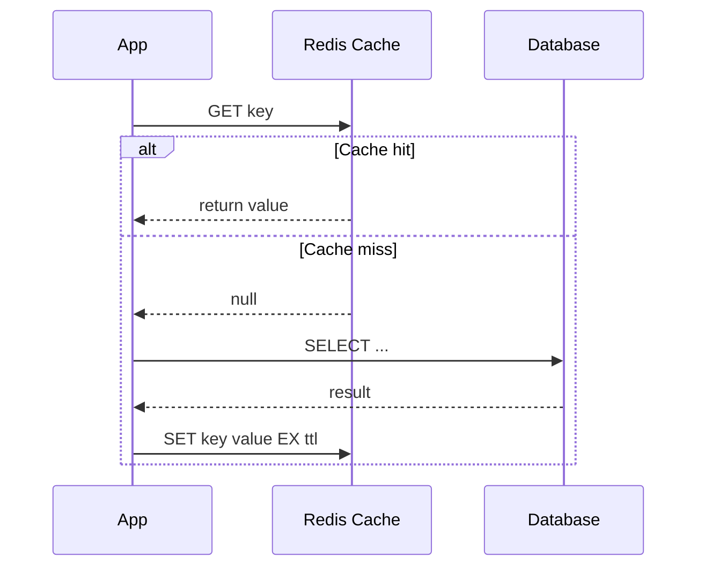

---

## 5. Database Selection

[SQL deep dive →](../12-interview-prep/system-design/database-replication) | [NoSQL deep dive →](../12-interview-prep/system-design/database-sharding)

| Dimension | **SQL (Relational)** | **NoSQL** |
|-----------|---------------------|-----------|
| **Schema** | Fixed; migrations required | Flexible; schema-on-read |
| **Consistency** | ACID transactions | BASE (eventual or tunable) |
| **Joins** | Native, efficient | Manual application-side |
| **Scaling** | Vertical + read replicas | Horizontal (native sharding) |
| **Query flexibility** | Rich (joins, aggregations) | Limited (by PK/index) |

**Choose SQL when:**
- Financial transactions, inventory counts (ACID critical)
- Complex relationships with many joins
- Reporting / analytics queries (aggregations, GROUP BY)
- Data model is well-known and stable

**Choose NoSQL when:**
- 10M+ records with high write throughput
- Flexible or evolving schema (user profiles, product catalog)
- Simple KV/document lookups by known key
- Global distribution needed (DynamoDB Global Tables, Cosmos DB)
- Graph relationships (Neo4j) or time-series (InfluxDB)

**NoSQL sub-types:**

| Type | Examples | Use Case |
|------|---------|----------|
| **Key-Value** | Redis, DynamoDB | Sessions, caches, user prefs |
| **Document** | MongoDB, Firestore | Catalogs, content, user profiles |
| **Wide-column** | Cassandra, HBase | Time-series, activity feeds, IoT |
| **Graph** | Neo4j, Neptune | Social networks, recommendations, fraud |

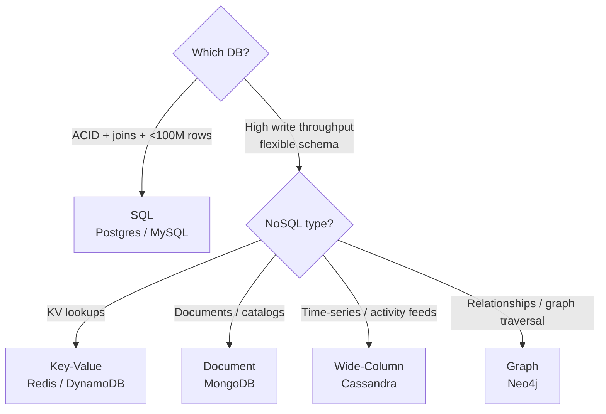

---

## 6. Message Queue Patterns

[Deep dive →](../12-interview-prep/system-design/message-queues-kafka-rabbitmq) | [Event-driven →](../12-interview-prep/system-design/event-driven-architecture)

**When to use async (queue/event):**
- Decouple producer from consumer
- Handle traffic spikes (buffer writes)
- Fan-out to multiple consumers
- Long-running background jobs
- Retry on failure without blocking user

**Common patterns:**

| Pattern | Shape | Use Case |
|---------|-------|----------|
| **Work queue** | 1 producer → N competing consumers | Job processing, email sending |
| **Fan-out** | 1 message → N consumers each get copy | Notifications, cache invalidation |
| **Pub/Sub** | Publishers → topics → subscribers | Event bus, microservice communication |
| **Event sourcing** | All state as ordered event log | Audit trail, CQRS read models |
| **Saga** | Sequence of events across services | Distributed transactions |
| **Outbox pattern** | DB write + event in same transaction | Guaranteed event publishing |

**Sync vs Async:**

| | Sync | Async |
|-|------|-------|
| **User feedback** | Immediate | Delayed |
| **Coupling** | Tight | Loose |
| **Failure handling** | Cascades upstream | Isolated, retryable |
| **Use for** | Auth, payment confirm, critical reads | Email, notifications, analytics, heavy processing |

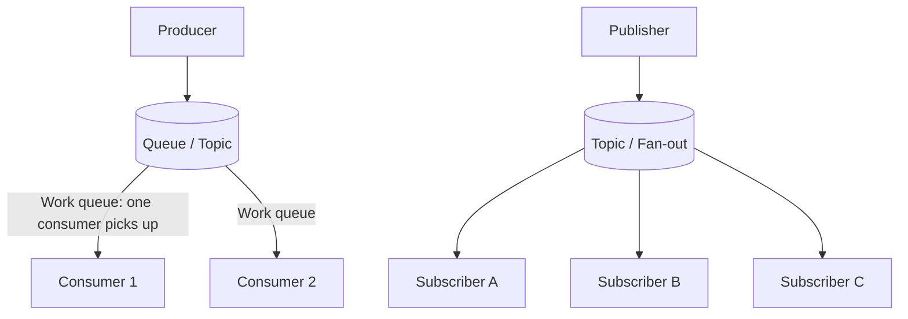

---

## 7. Common Bottlenecks + Solutions

| Bottleneck | Symptoms | Solutions |
|------------|----------|-----------|
| **DB read overload** | High DB CPU, slow SELECT queries | Add read replicas + Redis cache layer |
| **DB write overload** | Write queue growth, lock contention | DB sharding, async writes via queue, CQRS |
| **Hot partitions** | One server overwhelmed, others idle | Consistent hashing, write sharding, random suffix |
| **N+1 queries** | DB connection spikes, O(N) queries in loop | Eager loading (JOIN), DataLoader (batching), GraphQL |
| **Cold start** | Slow first load after deploy | Cache warming, CDN, Lambda Provisioned Concurrency |
| **Large blob storage** | DB bloat, slow backups | Offload to S3/object store; store URL in DB |
| **Long tail latency** | p99 >> p50 | Hedged requests, timeout + retry, circuit breaker |
| **Connection exhaustion** | DB `too many connections` error | Connection pool (RDS Proxy), reduce Lambda concurrency |
| **Thundering herd** | DB spike after cache expiry | Mutex lock, jitter on TTL, probabilistic early refresh |
| **Distributed transaction** | Inconsistent state across services | Saga pattern, 2PC, outbox pattern |

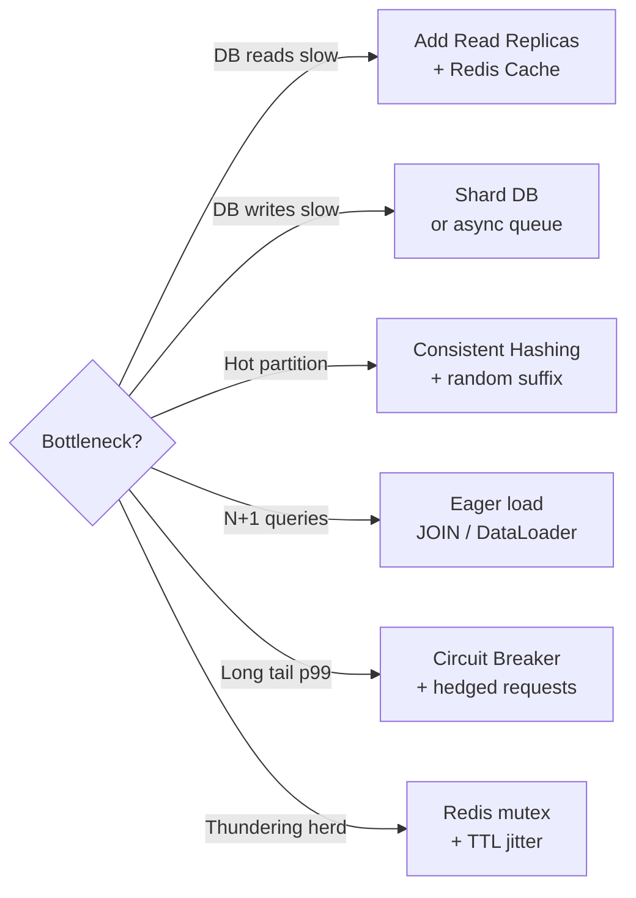

---

## 8. CAP Theorem Quick Reference

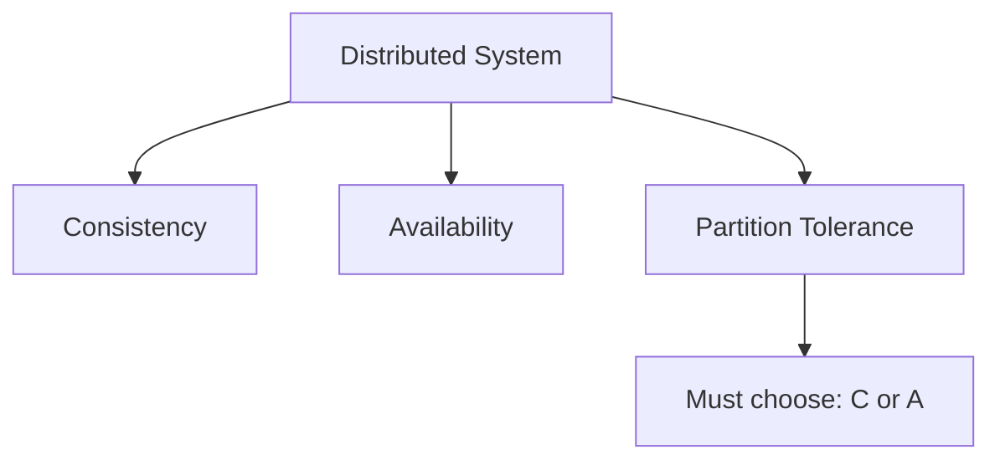

| Pick | Systems | Use When |
|------|---------|----------|
| **CP** (Consistency + Partition) | HBase, Zookeeper, etcd, Redis Cluster | Banking, inventory counts, distributed locks |
| **AP** (Availability + Partition) | Cassandra, DynamoDB, CouchDB, DNS | Social feeds, metrics, shopping carts |
| **CA** (not truly distributed) | PostgreSQL (single node), MySQL | Local deployments, small scale |

**PACELC extension:** In absence of partition (normal operation): trade Latency vs Consistency.
- Cassandra = PA/EL (available during partition, low latency normally)
- HBase = PC/EC (consistent during partition, consistent normally)

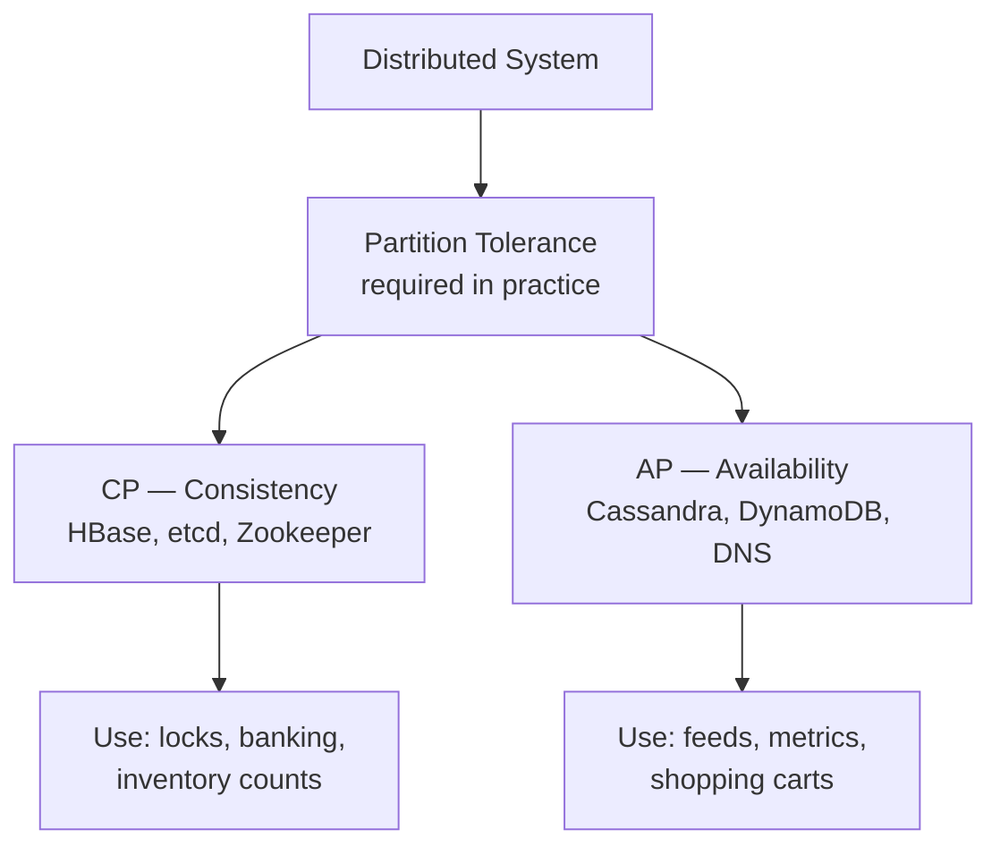

---

## 9. Common System Design Questions + 1-Line Architecture

| Question | Key Architectural Decision | Key Service/Pattern |
|----------|---------------------------|---------------------|
| **URL shortener** | Base62 encode(counter or hash); check collision | Redis (cache) + NoSQL (store) |
| **Rate limiter** | Token bucket or sliding window counter | Redis `INCR` + `EXPIRE` per key |
| **News feed** | Fan-out on write (push) vs fan-out on read (pull); celebrities = pull | Redis sorted sets + Kafka |
| **Video streaming** | CDN for delivery; adaptive bitrate (HLS/DASH); chunked upload | S3 + CloudFront + FFmpeg |
| **Typeahead / autocomplete** | Trie + top-K prefix cache; Redis sorted sets for top suggestions | Redis sorted sets + Elasticsearch |
| **Chat app** | WebSocket for real-time; message store for history; presence service | Redis pub/sub + Cassandra (history) |
| **Payment system** | Idempotency key; saga for distributed txn; double-entry ledger | ACID DB + outbox pattern + SQS |
| **Distributed lock** | SETNX + TTL; Redlock for multi-instance; fencing token | Redis / Zookeeper |
| **Search engine** | Inverted index; TF-IDF or BM25 ranking; sharded index | Elasticsearch / OpenSearch |
| **Push notifications** | Fan-out queue; device token registry; delivery guarantee | Kafka + APNs/FCM |
| **Ride sharing** | Geospatial index (QuadTree/S2); matching service; trip state machine | PostGIS / DynamoDB Geo + Redis |
| **Ticket booking** | Optimistic locking or distributed lock for seat hold; TTL on reservation | Redis lock + ACID DB |
| **Photo/Instagram** | Object storage for images; CDN; denormalized feed table | S3 + CloudFront + Cassandra |
| **Web crawler** | BFS queue; politeness (rate limit per domain); URL dedup | SQS + DynamoDB (visited set) |
| **Metrics / analytics** | Time-series DB; pre-aggregation; write-heavy append-only | Kafka → ClickHouse / TimescaleDB |
| **API gateway** | Auth (JWT/OAuth); rate limiting; request routing; circuit breaker | Kong / AWS API Gateway |
| **Leaderboard** | Sorted set with score; partition by time window (daily/weekly/all-time) | Redis `ZADD` / `ZRANK` |
| **File storage (Dropbox)** | Chunking + dedup + delta sync; metadata separate from chunks | S3 (chunks) + PostgreSQL (metadata) |
| **Live streaming** | Ingest RTMP → transcode → HLS segments → CDN; low-latency = WebRTC | Kinesis Video + CloudFront |
| **Ad auction** | Sub-10ms bidding; targeting index; budget pacing | Redis + Aerospike + Kafka |

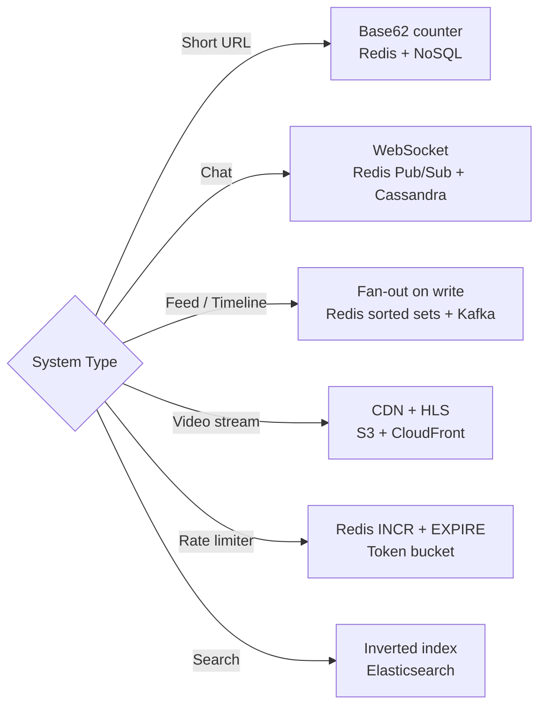

---

## 10. Estimations Reference

**Latency numbers (memorize order of magnitude):**

| Operation | Latency |
|-----------|---------|
| L1 cache reference | **1 ns** |
| L2 cache reference | **4 ns** |
| RAM access | **100 ns** |
| SSD random read | **~0.1 ms** (100 µs) |
| HDD seek | **~10 ms** |
| Same-region network | **~0.5 ms** |
| Cross-region network | **~150 ms** |
| Send 1 MB over 1 Gbps | **~10 ms** |

**Data sizes:**

| Type | Size |
|------|------|
| char / byte | 1 B |
| int | 4 B |
| long / timestamp | 8 B |
| UUID | 16 B |
| short URL | ~7 B |
| typical tweet | ~280 B |
| typical DB row | 1–2 KB |
| typical web page | ~1 MB |
| 1 MP image (compressed) | ~300 KB |
| 1 minute 720p video | ~50 MB |

**Scale conversions:**

| Users | Avg QPS | Peak QPS (10x) |
|-------|---------|----------------|
| 100K DAU | 1.2 QPS | 12 QPS |
| 1M DAU | 12 QPS | 120 QPS |
| 10M DAU | 120 QPS | 1,200 QPS |
| 100M DAU | 1,200 QPS | 12,000 QPS |
| 1B DAU | 12,000 QPS | 120,000 QPS |

**Storage math:**
- 1 million rows × 1 KB = **1 GB**
- 1 billion rows × 1 KB = **1 TB**
- 1 billion rows × 100 B = **100 GB**
- 10M users × 500 B profile = **5 GB** (fits in one DB)

**Bandwidth:**
- 1 Gbps = **125 MB/s**
- 1 Gbps = ~**100 million 10-byte messages/s**

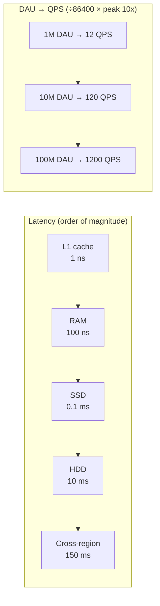

---

## 11. Trade-off Cheat Sheet

| Decision | Choose A When | Choose B When |
|----------|---------------|---------------|
| **Consistency vs Availability** | Banking, payments, inventory | Social feeds, metrics, likes |
| **SQL vs NoSQL** | Complex queries, ACID, <100M rows | Scale, flexible schema, simple lookups |
| **Read replicas vs Sharding** | Read-heavy; writes manageable | Write-heavy; single node can't keep up |
| **Sync vs Async** | Immediate user feedback needed | Decoupling, resilience, scale |
| **Cache-aside vs Write-through** | Mostly reads; some write miss OK | Read-heavy; cannot tolerate stale data |
| **Monolith vs Microservices** | Early stage; small team (<20 devs) | Scale teams independently; different scaling needs |
| **REST vs GraphQL** | Simple CRUD; caching important | Complex queries; mobile (bandwidth); many clients |
| **Push vs Pull (feed)** | Most users have small follower count | Celebrity/large follower accounts (pull for them) |
| **Horizontal vs Vertical** | Stateless; need resilience | Stateful; quick fix; simpler ops |
| **Eager vs Lazy loading** | Access pattern predictable; N+1 problem | Large objects; access optional; save bandwidth |

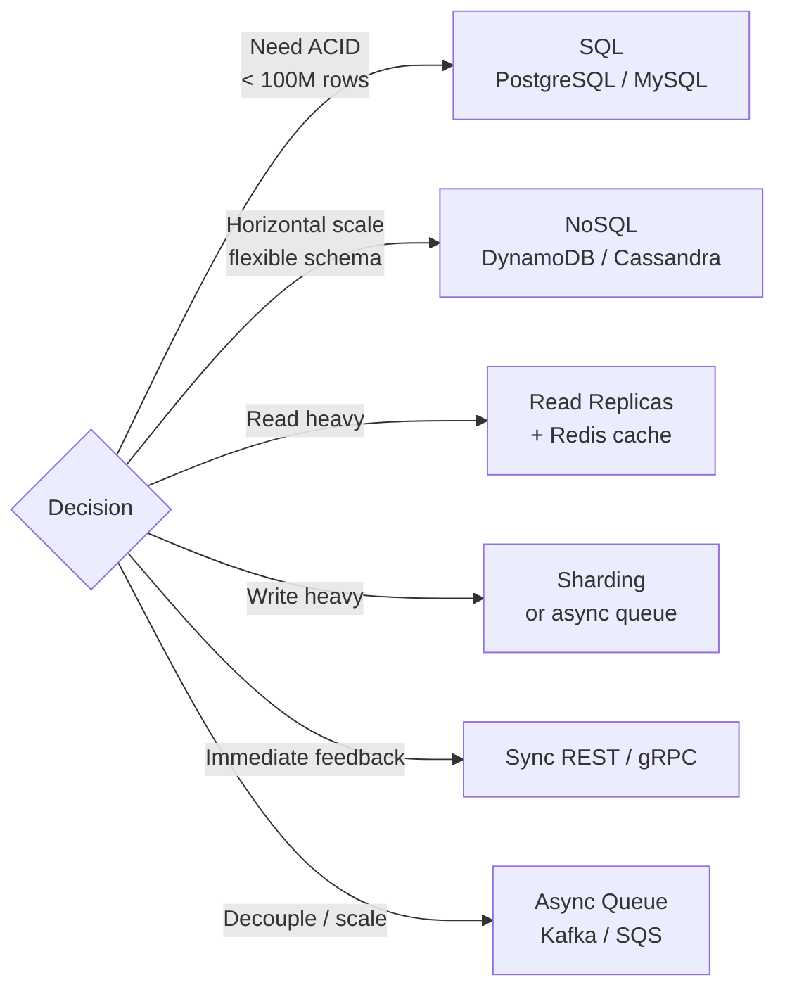

---

## 12. Interview Anti-Patterns (What Not to Do)

| Anti-pattern | What interviewers think | Fix |
|--------------|------------------------|-----|
| Jump to solution without clarifying | Can't gather requirements in real job | Always start with 3-5 clarifying questions |
| Over-engineer for Day 1 | No judgment on trade-offs | "Start simple, scale as needed" — show you know when |
| Propose microservices for small system | Resume-driven development | Monolith first, extract when pain point appears |
| Ignore failure cases | Doesn't think about production | Ask: "What happens if X fails?" for every component |
| Forget data model | No practical experience | Always draw entities + key fields + relationships |
| No numbers | Vague design, can't validate | Always estimate QPS and storage, even roughly |
| Design without bottleneck analysis | Can't identify real problems | After architecture: "The bottleneck is X because Y" |
| Strong consistency everywhere | Doesn't understand trade-offs | Explicitly call out where eventual consistency is OK |

```mermaid
flowchart TD
    Start[Interview starts] --> Clarify{Clarify requirements\n3-5 questions first}
    Clarify -->|Skip this| Fail1[❌ Can't gather requirements]
    Clarify --> Estimate[Rough estimation\nQPS + storage]
    Estimate -->|Skip numbers| Fail2[❌ Vague, unvalidated design]
    Estimate --> Arch[Simple architecture first\nmonolith → extract if needed]
    Arch -->|Jump to microservices| Fail3[❌ Resume-driven development]
    Arch --> Bottleneck[Identify bottleneck\n"The bottleneck is X because Y"]
    Bottleneck -->|No analysis| Fail4[❌ Can't identify real problems]
    Bottleneck --> Tradeoff[Name trade-offs explicitly\nwhere eventual consistency OK]
```

---

*Last updated: 2026-03-20*
