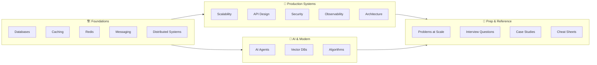

# System Design Knowledge Base

A production-grade learning resource for engineers — from first principles to staff-level system design. ~700 articles, 450+ hands-on POCs, 43 interview question sets.

## Who Are You?

| I am... | My goal | Start here |
|---------|---------|-----------|
| 🟢 Junior engineer | Learn system design from scratch | [Learning Paths →](/00-start-here/learning-paths) |
| 🟡 Mid-level engineer | Fill knowledge gaps, go deeper | [Pick a topic →](/01-databases) |
| 🔴 Senior / Tech Lead | Master distributed systems | [Foundations →](/01-databases) |
| 🎯 Interview in < 2 weeks | Fast-track FAANG prep | [Interview Questions →](/12-interview-prep) |
| 🤖 Building AI systems | Agents, RAG, LLM architecture | [AI Agents — Start here →](/13-agent-workflows) |

---

## 🔥 Start with AI Agents

The most in-demand skill in system design right now. 70 articles covering the full stack — from building your first agent to production multi-agent systems.

| | | |
|---|---|---|
| [→ Build your first agent](/13-agent-workflows/concepts/from-zero-to-production-agent) | [→ Design multi-agent systems](/13-agent-workflows/concepts/multi-agent-systems) | [→ AI interview questions](/13-agent-workflows/interview) |

---

## Knowledge Map

---

## What's Inside

| Pillar | Topics | Articles | POCs |
|--------|--------|----------|------|
| 🏗️ Foundations | Databases, Caching, Redis, Messaging, Distributed Systems | ~170 | ~90 |
| 🚀 Production Systems | Scalability, API Design, Security, Observability, Architecture | ~150 | ~45 |
| 🤖 AI & Modern | AI Agents, Vector Databases, Algorithms | ~160 | ~25 |
| 🎯 Prep & Reference | Problems at Scale, Interview Qs, Case Studies, Cheat Sheets | ~220 | — |

## Difficulty Levels

- 🟢 **Beginner** — No assumed knowledge
- 🟡 **Intermediate** — 2–5 years experience
- 🔴 **Advanced** — 5–8 years experience
- ⚫ **Senior/Architect** — Staff-level, 8+ years
