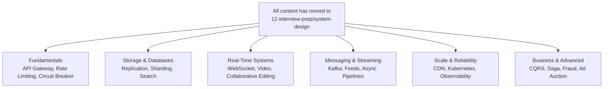

# System Design Interview Questions

Detailed walkthroughs of common system design interview questions, covering architecture, trade-offs, and real-world patterns.

> **Note**: All interview questions are now in [12-interview-prep/system-design](/12-interview-prep/system-design). The questions below link directly to the active content.

## Questions by Category

### Fundamentals
- [API Design: REST, GraphQL, gRPC](/12-interview-prep/system-design/fundamentals/api-design-rest-graphql-grpc)
- [API Gateway Pattern](/12-interview-prep/system-design/fundamentals/api-gateway-pattern)
- [Caching Strategies](/12-interview-prep/system-design/fundamentals/caching-strategies)
- [Circuit Breaker Pattern](/12-interview-prep/system-design/fundamentals/circuit-breaker-pattern)
- [High Concurrency API](/12-interview-prep/system-design/fundamentals/high-concurrency-api)
- [Load Balancing Strategies](/12-interview-prep/system-design/fundamentals/load-balancing-strategies)
- [Rate Limiting](/12-interview-prep/system-design/fundamentals/rate-limiting)

### Storage & Databases
- [Database Indexing Deep Dive](/12-interview-prep/system-design/storage-and-databases/database-indexing-deep-dive)
- [Database Replication](/12-interview-prep/system-design/storage-and-databases/database-replication)
- [Database Sharding](/12-interview-prep/system-design/storage-and-databases/database-sharding)
- [Search Engine Architecture](/12-interview-prep/system-design/storage-and-databases/search-engine-architecture)

### Real-Time Systems
- [Collaborative Editing (Google Docs)](/12-interview-prep/system-design/real-time-systems/collaborative-editing-google-docs)
- [Live Streaming (Twitch)](/12-interview-prep/system-design/real-time-systems/live-streaming-twitch)
- [Online Gaming Backend](/12-interview-prep/system-design/real-time-systems/online-gaming-backend)
- [Video Conferencing](/12-interview-prep/system-design/real-time-systems/video-conferencing)
- [Video Streaming Platform](/12-interview-prep/system-design/real-time-systems/video-streaming-platform)
- [WebSocket Architecture](/12-interview-prep/system-design/real-time-systems/websocket-architecture)

### Messaging & Streaming
- [Audio Streaming (Spotify)](/12-interview-prep/system-design/messaging-and-streaming/audio-streaming-spotify)
- [Event-Driven Architecture](/12-interview-prep/system-design/messaging-and-streaming/event-driven-architecture)
- [Message Queues: Kafka vs RabbitMQ](/12-interview-prep/system-design/messaging-and-streaming/message-queues-kafka-rabbitmq)
- [Social Media Feed](/12-interview-prep/system-design/messaging-and-streaming/social-media-feed)

### Scale & Reliability
- [CDN & Edge Computing](/12-interview-prep/system-design/scale-and-reliability/cdn-edge-computing-media)
- [Distributed Tracing](/12-interview-prep/system-design/scale-and-reliability/distributed-tracing)
- [Kubernetes Basics](/12-interview-prep/system-design/scale-and-reliability/kubernetes-basics)
- [Monolith to Microservices](/12-interview-prep/system-design/scale-and-reliability/monolith-to-microservices)
- [Observability & Monitoring](/12-interview-prep/system-design/scale-and-reliability/observability-monitoring)
- [Service Discovery](/12-interview-prep/system-design/scale-and-reliability/service-discovery)

### Business & Advanced
- [CQRS Pattern](/12-interview-prep/system-design/business-and-advanced/cqrs-pattern)
- [Flash Sales](/12-interview-prep/system-design/business-and-advanced/flash-sales)
- [Fraud Detection System](/12-interview-prep/system-design/business-and-advanced/fraud-detection-system)
- [Saga Pattern](/12-interview-prep/system-design/business-and-advanced/saga-pattern)
- [Ticket Booking System](/12-interview-prep/system-design/business-and-advanced/ticket-booking-system)
