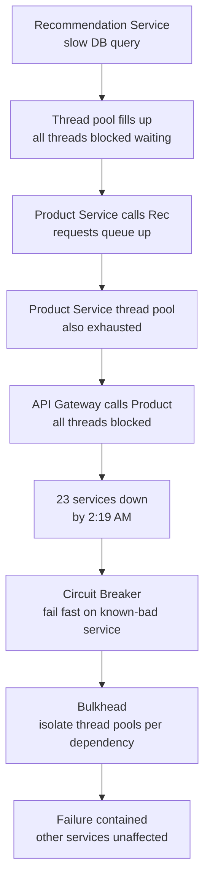
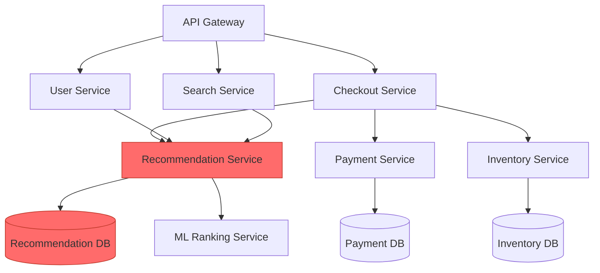
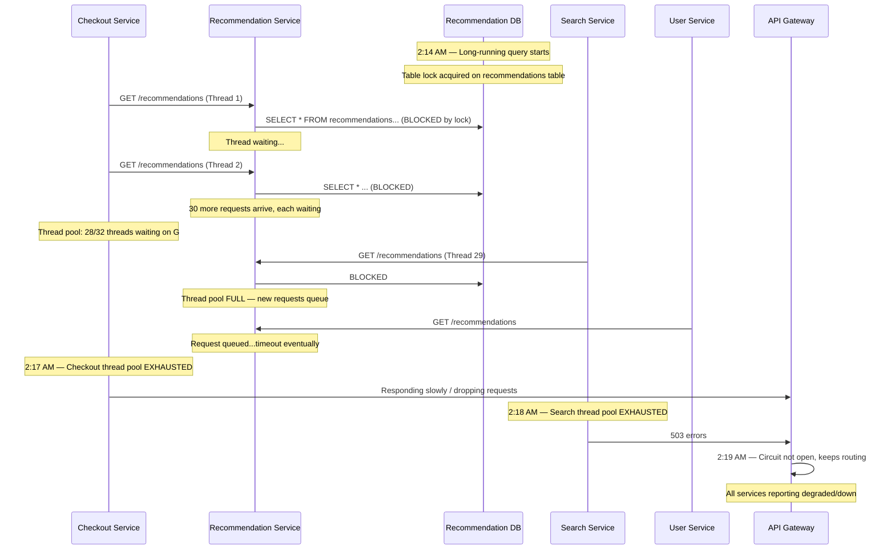
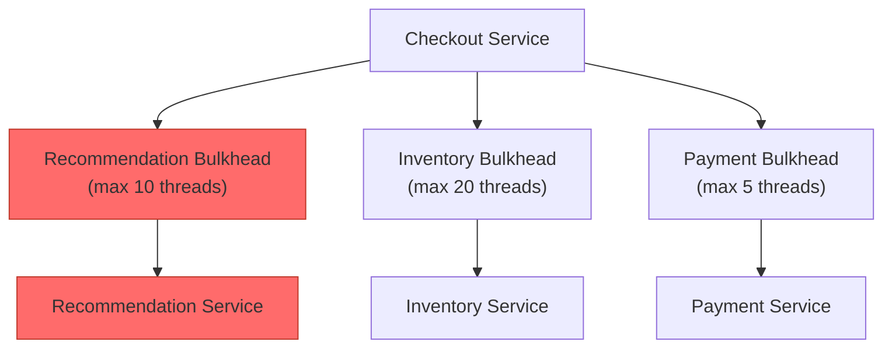
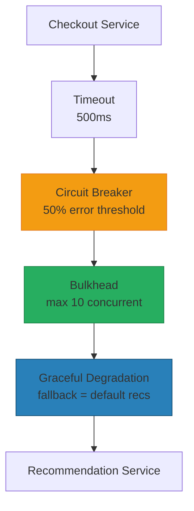

# Cascading Failures: When One Slow Service Takes Down 23

## 🗺️ Quick Overview



*One slow dependency without a timeout fills thread pools upstream until the entire call graph collapses — circuit breakers and bulkheads stop the propagation.*

**At 2:14 AM, a single slow database query in Recommendation Service started a chain reaction. By 2:19 AM, 23 microservices were down. By 2:31 AM, the entire platform was unavailable for 2.3 million users. The root cause? One service failed to set a timeout. The mechanism? Thread pools.**

---

## The Problem Class `[Availability — Severity: Critical]`

Cascading failures are the most dangerous failure mode in distributed systems. They're not a single point of failure — they're a *propagation mechanism* that turns a small, isolated problem into a total platform collapse. The cruel irony is that the architecture designed to prevent single points of failure (microservices) is also what enables the cascade to spread.

---

## Why This Happens

### The Dependency Graph Problem

Most microservice architectures look clean in design documents. In production, they look like this:



Notice that Recommendation Service (`G`) is called by three different upstream services: Checkout, User, and Search. When Recommendation Service slows down, it doesn't just affect one service — it affects every service in its upstream fan-in.

### The Cascade Sequence

Here is exactly how 23 services died from one slow database query:



### Why Thread Pools Are the Transmission Mechanism

A thread pool is a fixed-size resource. When Service A makes a synchronous HTTP call to Service B with no timeout, each waiting request consumes one thread. If Service B slows down for 30 seconds, and Service A receives 32 requests/second, then after just 1 second, all 32 threads in A's pool are occupied — waiting for B.

Now Service A cannot accept *any* new connections. It's not that A is overloaded with work; it's that A's threads are all *waiting*, doing nothing. Every new incoming request either queues (consuming memory) or gets rejected.

This is not a cascade yet. It becomes a cascade when:
1. Service C calls Service A
2. Service C's threads now wait for Service A
3. Service C's pool exhausts
4. Service D calls Service C
5. ...

The failure propagates *upstream* through the dependency graph, in the opposite direction of data flow.

---

## Real-World Impact

**AWS us-east-1, September 2017**: A network connectivity issue caused elevated latencies between services. Services that had no explicit timeouts on downstream calls began accumulating waiting threads. The increased wait caused thread pools to fill, causing those services to slow down, causing *their* callers to fill thread pools. The incident post-mortem specifically cited "lack of timeout configuration" as a primary contributing factor.

**GitHub, October 2018**: A database failover caused elevated query latencies. Application servers that connected to the database without aggressive timeouts began holding connections open, exhausting connection pools. This caused upstream services to queue requests waiting for database connections, which propagated latency up to the edge.

**Netflix (internal)**: Before Hystrix (now Resilience4j), Netflix engineers documented repeated incidents where a single slow microservice would cause the entire platform to become unresponsive. The Hystrix library was written specifically because cascading failures were the primary availability threat after adopting microservices.

---

## The Wrong Fix

### "Increase the Thread Pool Size"

When thread pool exhaustion causes a cascade, the instinctive response is to increase the thread pool. This is exactly wrong.

A larger thread pool *delays* the cascade — you now need 256 requests to fill the pool instead of 32. But those 256 threads each consume memory (typically 256KB-1MB of stack), and you've made the eventual crash *bigger*. Worse, a larger pool means more threads all hammering a downstream service simultaneously, which may overwhelm that service and prevent it from recovering.

Thread pool size is not the problem. Waiting indefinitely is.

### "Add Retries"

Adding retries to recover from downstream failures — without circuit breakers — amplifies the problem. When Service B is slow, Service A retries, doubling its traffic to B. Now B is even slower. See: [Retry Storm](./retry-storm).

---

## The Right Solution

You need multiple overlapping defenses. No single pattern is sufficient.

### Solution 1: Timeouts on Every Outbound Call

Every call to a downstream service must have an explicit timeout. Not a high timeout "just in case" — a timeout that reflects the actual SLA you need.

```javascript
// Bad — no timeout (default is infinite)
const response = await axios.get('http://recommendation-service/recommendations');

// Bad — timeout too high (still allows cascade)
const response = await axios.get('http://recommendation-service/recommendations', {
  timeout: 30000 // 30 seconds allows pool exhaustion
});

// Good — timeout reflects your actual SLA
const response = await axios.get('http://recommendation-service/recommendations', {
  timeout: 500 // Recommendations must respond in 500ms or we skip them
});
```

**Timeout Budget Rule**: Your upstream timeout must be *less than* your upstream caller's timeout. If Checkout must respond to the API Gateway in 3 seconds, then Checkout's calls to Recommendation must timeout in under 3 seconds (leaving buffer for Checkout's own processing).

This is the foundation. But timeouts alone aren't enough — every timeout is a failed request, and if the downstream is consistently slow, you're still generating a flood of 500ms-wait threads.

### Solution 2: Circuit Breaker — Stop Calling a Failing Service

A circuit breaker wraps downstream calls and tracks their success/failure rate. When failures exceed a threshold, it "opens" the circuit — future calls fail immediately without touching the downstream service at all. After a recovery period, it "half-opens" to probe if the downstream has recovered.

```javascript
const CircuitBreaker = require('opossum');

// Define the function to protect
async function callRecommendationService(userId) {
  const response = await axios.get(
    `http://recommendation-service/recommendations/${userId}`,
    { timeout: 500 }
  );
  return response.data;
}

// Wrap with circuit breaker
const recommendationBreaker = new CircuitBreaker(callRecommendationService, {
  timeout: 500,           // Fail the call if it takes longer than 500ms
  errorThresholdPercentage: 50,  // Open circuit when 50% of calls fail
  resetTimeout: 10000,    // Try half-open after 10 seconds
  volumeThreshold: 10,    // Need at least 10 calls before tracking error rate
});

// Fallback: serve cached or default recommendations
recommendationBreaker.fallback((userId) => {
  return getCachedRecommendations(userId) || getDefaultRecommendations();
});

// Metrics
recommendationBreaker.on('open', () => {
  console.error('Recommendation circuit OPEN — serving fallbacks');
  metrics.increment('circuit_breaker.open', { service: 'recommendation' });
});

recommendationBreaker.on('halfOpen', () => {
  console.log('Recommendation circuit HALF-OPEN — probing recovery');
});

recommendationBreaker.on('close', () => {
  console.log('Recommendation circuit CLOSED — service recovered');
  metrics.increment('circuit_breaker.closed', { service: 'recommendation' });
});

// Usage
async function getRecommendations(userId) {
  return recommendationBreaker.fire(userId);
}
```

With circuit breakers: when Recommendation Service slows down, the circuit opens after the first 10 calls with >50% failures. All subsequent calls return immediately with fallback data. Thread pools never fill. The cascade never starts.

### Solution 3: Bulkhead Pattern — Isolate Failure Domains

Even with timeouts and circuit breakers, if all outbound calls share the same thread pool, a burst of slow responses can still exhaust the shared pool. The bulkhead pattern assigns separate resource pools to each downstream dependency.

Named after ship bulkheads — if one compartment floods, the others stay dry.

```javascript
const pLimit = require('p-limit');

// Separate concurrency limits per downstream service
// These act as bulkheads — Recommendation's slowness can't consume
// the concurrency budget allocated to Inventory
const recommendationBulkhead = pLimit(10); // Max 10 concurrent calls to Recommendation
const inventoryBulkhead = pLimit(20);      // Max 20 concurrent calls to Inventory
const paymentBulkhead = pLimit(5);         // Max 5 concurrent calls to Payment

async function processCheckout(userId, cartId) {
  // These run concurrently but in isolated bulkheads
  const [recommendations, inventory] = await Promise.allSettled([
    recommendationBulkhead(() =>
      recommendationBreaker.fire(userId)  // Also wrapped in circuit breaker
    ),
    inventoryBulkhead(() =>
      checkInventory(cartId)
    )
  ]);

  // Checkout can still proceed even if recommendations fail
  const recs = recommendations.status === 'fulfilled'
    ? recommendations.value
    : getDefaultRecommendations();

  const inv = inventory.status === 'fulfilled'
    ? inventory.value
    : null;

  if (!inv) {
    throw new Error('Inventory check required — cannot proceed without it');
  }

  return {
    recommendations: recs,
    inventory: inv
  };
}
```

With bulkheads:



Even if Recommendation slows and fills its 10-thread bulkhead, Inventory and Payment remain fully operational. Checkout can still process payments — just without recommendations.

### Solution 4: Graceful Degradation

Design every service integration to handle the case where a downstream is unavailable. Recommendations are not critical — you can still show a page without them. Profile picture load failure should not break authentication.

```javascript
async function buildCheckoutPage(userId, cartId) {
  // Critical path — must succeed
  const [cart, userProfile, paymentMethods] = await Promise.all([
    getCart(cartId),         // Required
    getUserProfile(userId),   // Required
    getPaymentMethods(userId) // Required
  ]);

  // Non-critical path — degraded experience is acceptable
  const enrichments = await Promise.allSettled([
    recommendationBreaker.fire(userId),     // Nice-to-have
    getRecentlyViewed(userId),              // Nice-to-have
    getPersonalizedDiscounts(userId),       // Nice-to-have
  ]);

  return {
    cart,
    userProfile,
    paymentMethods,
    // Graceful degradation: use result if available, default otherwise
    recommendations: enrichments[0].status === 'fulfilled'
      ? enrichments[0].value
      : [],
    recentlyViewed: enrichments[1].status === 'fulfilled'
      ? enrichments[1].value
      : [],
    discounts: enrichments[2].status === 'fulfilled'
      ? enrichments[2].value
      : null,
  };
}
```

---

## The Architecture With All Four Patterns



Each layer catches what the previous one misses:
- Timeout: prevents infinite waits
- Circuit breaker: stops calling a known-failing service
- Bulkhead: limits blast radius to one dependency
- Graceful degradation: keeps the system functional even when dependencies fail

---

## Detection: How to Know You're Heading Here

**Thread pool saturation**: `thread_pool.active_threads / thread_pool.max_threads > 0.8` for more than 30 seconds. This is the early warning signal.

**Connection pool exhaustion**: Database or HTTP client connection pool utilization approaching 100%.

**Latency percentile explosion**: P99 latency spiking while P50 is normal. This means a fraction of requests are getting very slow — often the ones stuck waiting on a slow downstream.

**Correlated latency across services**: If multiple unrelated services all start showing elevated P99 latency at the same time, there's likely a shared dependency that's slow.

**Error rate below latency spike**: Errors often lag behind latency degradation by minutes. By the time error rate climbs, thread pools are already filling.

**Alerts to set up**:

```javascript
// Alert: Thread pool saturation
if (activeThreads / maxThreads > 0.8) {
  alert('WARN: Thread pool at 80% — potential cascade starting');
}

// Alert: Circuit breaker opened
circuitBreaker.on('open', () => {
  alert('CRITICAL: Circuit breaker opened for service X');
});

// Alert: Timeout rate
if (timeoutRate > 0.05) { // More than 5% of calls timing out
  alert('WARN: High timeout rate — check downstream service health');
}
```

---

## Prevention Patterns Checklist

- [ ] Every outbound HTTP/gRPC call has an explicit timeout set (not default/infinite)
- [ ] Timeouts are shorter than the upstream caller's SLA
- [ ] Every downstream dependency has a circuit breaker with configured fallback
- [ ] Non-critical dependencies (recommendations, enrichment) are isolated in bulkheads
- [ ] Non-critical features have graceful degradation paths
- [ ] Dependency graph is documented and reviewed for single points of failure
- [ ] Load testing includes downstream degradation scenarios (chaos engineering)
- [ ] Thread pool saturation alerts are configured at 70% and 90% thresholds
- [ ] Circuit breaker state is exposed in health check endpoints
- [ ] On-call runbook includes "which services can I disable to stop the cascade"

---

## Related Problems

- [Retry Storm](./retry-storm) — Retries amplify the load on a recovering service, extending the outage
- [Timeout Domino Effect](./timeout-domino-effect) — Poorly configured timeouts propagate latency upstream
- [Thundering Herd](./thundering-herd) — Cache expiry causes simultaneous load spike that triggers cascades
