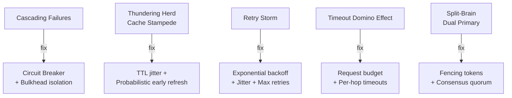

# Availability & Cascading Failures

A single slow service can take down your entire system if there are no circuit breakers, bulkheads, or graceful degradation patterns in place.

## Problems in This Section

| Problem | The Pain |
|---------|----------|
| [Cascading Failures](cascading-failures) | One slow DB query takes down 23 services |
| [Thundering Herd / Cache Stampede](thundering-herd) | Cache expiry DDoSes your own database |
| [Retry Storm](retry-storm) | Retries amplify a 30s hiccup into a 45min outage |
| [Timeout Domino Effect](timeout-domino-effect) | Nested timeouts that multiply latency |
| [Split-Brain / Dual Primary](split-brain) | Two primaries, 8 minutes of conflicting writes |
