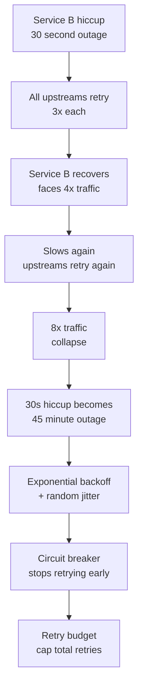
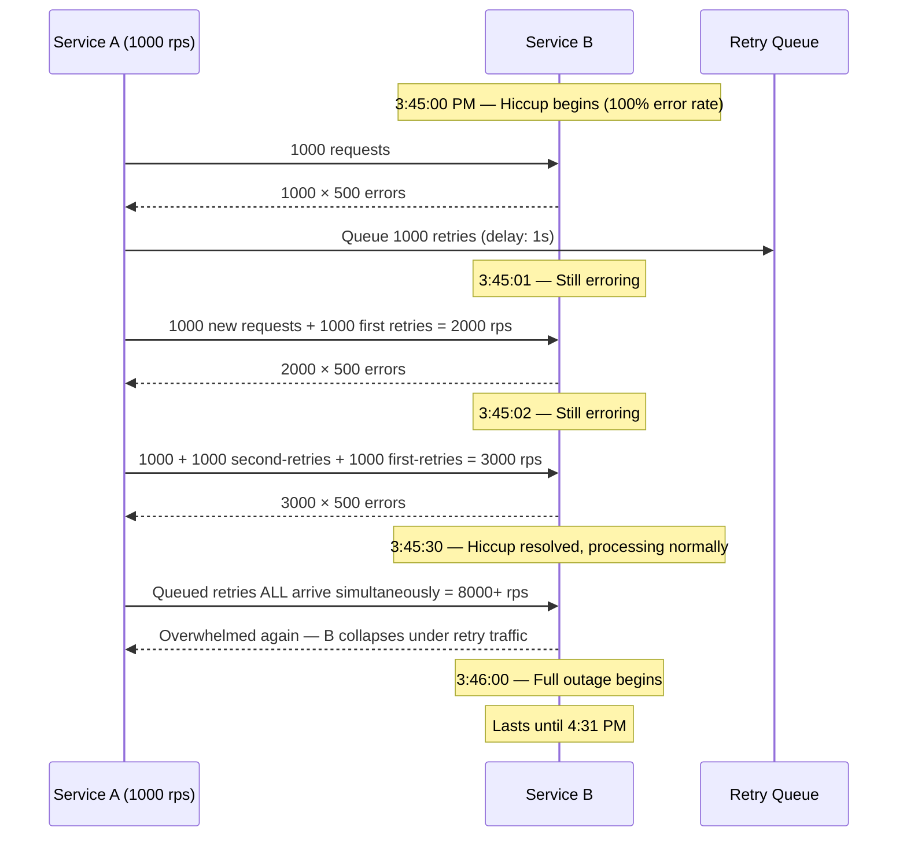

# Retry Storm: How Retries Turned a 30-Second Hiccup into a 45-Minute Outage

## 🗺️ Quick Overview


*Normal path: transient error → retry once → success. Trigger: synchronized retries with no jitter or backoff. Failure cascade: traffic multiplies with each retry wave, making recovery impossible.*

**Service B had a 500ms hiccup at 3:45 PM. It recovered in 30 seconds. But by then, every upstream service had retried its requests 3 times. Service B was now handling 4x its normal traffic — from the retries. It slowed down again. All services retried again. 8x traffic. It collapsed. The 30-second hiccup became a 45-minute outage.**

---

## The Problem Class `[Availability — Severity: Critical]`

Retry logic is taught as a reliability best practice. "Retry on failure" is the first thing engineers add when making network calls. It's correct — in isolation. The problem is that retries create *amplified traffic* on recovering services, and amplified traffic can prevent recovery entirely. At distributed systems scale, "everyone retries at the same time" is as dangerous as "everyone stops retrying at the same time."

---

## Why This Happens

### The Traffic Multiplication Math

Suppose:
- 1,000 requests/second hit Service A
- Service A fans out to Service B (1:1 ratio)
- Service A is configured to retry 3 times on failure
- Service B experiences 100% error rate for 30 seconds

During those 30 seconds, Service A sends:
- 1,000 initial requests/s
- 1,000 first retries/s (after 1s delay)
- 1,000 second retries/s (after 2s delay)
- 1,000 third retries/s (after 4s delay)

**= 4,000 requests/second arriving at Service B when it's already struggling.**

Now add that Service A is one of 10 upstream services, all doing the same:

**= 40,000 requests/second instead of 10,000/second.**

When Service B recovers enough to process some requests and signals recovery, all 10 upstream services simultaneously send their queued retries. The "recovery" instantly becomes another overload event.



### Why Fixed-Delay Retries Make It Catastrophically Worse

With a fixed 1-second retry delay, 10,000 clients all retry at T+1s, then all retry at T+2s, then T+3s. This creates synchronized traffic bursts — effectively a self-inflicted DDoS at perfectly regular intervals.

```
T+0s:  10,000 requests hit B (fails)
T+1s:  10,000 retries hit B simultaneously (burst) — fails
T+2s:  10,000 retries hit B simultaneously (burst) — fails
T+3s:  10,000 retries hit B simultaneously (burst) — fails
T+30s: B recovers
T+31s: 30,000 queued retries all arrive at once — B collapses again
```

---

## Real-World Impact

**Amazon, 2004**: Amazon's early SOA (before AWS) experienced retry storms that were severe enough to be cited in internal architecture reviews. The resulting work on retry discipline and backoff strategies influenced the eventual design of AWS SDK retry logic. The "Exponential Backoff and Jitter" blog post (2015) was written by AWS engineers who had observed this pattern in production for over a decade.

**Google SRE**: Google's "Site Reliability Engineering" book dedicates sections to retry amplification. Their recommendation: retry budgets at the system level, not just per-client configuration. Without budget coordination, local "reasonable" retry logic creates system-level amplification.

**Stripe's payment infrastructure**: Payment systems are particularly vulnerable because retries on payment operations must be idempotent. Stripe's engineering blog documents their work on idempotency keys precisely because naive retries on payment calls without idempotency checking cause duplicate charges.

---

## The Wrong Fix

### "Retry with Fixed Delay"

```javascript
// WRONG — creates synchronized retry bursts
async function callServiceWithRetry(request) {
  for (let attempt = 0; attempt < 3; attempt++) {
    try {
      return await callService(request);
    } catch (err) {
      if (attempt < 2) {
        await sleep(1000); // Fixed 1s delay — all 10,000 clients sleep the same 1s
      }
    }
  }
  throw new Error('All retries failed');
}
```

10,000 clients hitting this code sleep for exactly 1 second, then all wake up simultaneously. Fixed delay doesn't solve the synchronization problem — it just shifts it in time.

---

## The Right Solutions

### Solution 1: Exponential Backoff

After each failure, double the wait time. This spreads retries across a growing time window, reducing simultaneous retry bursts.

```javascript
function exponentialBackoff(attempt, baseMs = 100, maxMs = 30000) {
  const delay = Math.min(baseMs * Math.pow(2, attempt), maxMs);
  return delay;
}

// attempt 0: 100ms
// attempt 1: 200ms
// attempt 2: 400ms
// attempt 3: 800ms
// attempt 4: 1600ms
// attempt 5: 3200ms (capped at maxMs)
```

**Problem with pure exponential backoff**: If 10,000 clients all start at the same time, they all backoff by the same exponential sequence. They're still synchronized.

### Solution 2: Jitter — Desynchronize Retries

The AWS "Exponential Backoff and Jitter" paper compared three strategies:

**Full Jitter** (AWS recommended for most cases):
```javascript
function fullJitter(attempt, baseMs = 100, maxMs = 30000) {
  const cap = Math.min(baseMs * Math.pow(2, attempt), maxMs);
  return Math.random() * cap; // Random between 0 and cap
}
// Results in smooth traffic distribution across [0, cap]
```

**Equal Jitter** (moderate spreading):
```javascript
function equalJitter(attempt, baseMs = 100, maxMs = 30000) {
  const cap = Math.min(baseMs * Math.pow(2, attempt), maxMs);
  const half = cap / 2;
  return half + Math.random() * half; // Random between cap/2 and cap
}
// Ensures minimum wait, adds some jitter
```

**Decorrelated Jitter** (AWS recommended for highest throughput during recovery):
```javascript
let lastSleep = baseMs;

function decorrelatedJitter(baseMs = 100, maxMs = 30000) {
  lastSleep = Math.min(maxMs, Math.random() * (lastSleep * 3 - baseMs) + baseMs);
  return lastSleep;
}
// Each sleep is random between base and 3× last sleep
// Produces higher variance, better for high-concurrency scenarios
```

**Complete implementation with full jitter**:

```javascript
async function callWithExponentialBackoffJitter(
  fn,
  {
    maxAttempts = 4,
    baseMs = 100,
    maxMs = 30000,
    retryableErrors = [500, 502, 503, 504],
  } = {}
) {
  let lastError;

  for (let attempt = 0; attempt < maxAttempts; attempt++) {
    try {
      return await fn();
    } catch (err) {
      lastError = err;

      const isRetryable = retryableErrors.includes(err.status) ||
        err.code === 'ECONNRESET' ||
        err.code === 'ETIMEDOUT';

      if (!isRetryable) {
        throw err; // Non-retryable: don't retry at all
      }

      if (attempt < maxAttempts - 1) {
        const cap = Math.min(baseMs * Math.pow(2, attempt), maxMs);
        const delay = Math.random() * cap; // Full jitter
        console.log(`Attempt ${attempt + 1} failed, retrying in ${Math.round(delay)}ms`);
        await sleep(delay);
      }
    }
  }

  throw lastError;
}
```

### Solution 3: Circuit Breaker + Retry Integration

Without circuit breakers, retries are fired at a failing service indefinitely. The circuit breaker stops retries entirely when the downstream is known to be failing.

```javascript
const CircuitBreaker = require('opossum');

const serviceBreaker = new CircuitBreaker(callService, {
  timeout: 2000,
  errorThresholdPercentage: 50,
  resetTimeout: 15000,
  volumeThreshold: 10,
});

async function callWithCircuitBreakerAndRetry(request) {
  // Circuit breaker wraps the retry logic
  // If circuit is open: fails immediately, no retry attempted
  // If circuit is closed: retry with backoff
  return serviceBreaker.fire(async () => {
    return callWithExponentialBackoffJitter(
      () => callDownstream(request),
      { maxAttempts: 3, baseMs: 200 }
    );
  });
}
```

When the circuit opens, all retry attempts are stopped immediately. This prevents the "queued retries all arrive at once" scenario.

### Solution 4: Retry Budget — System-Wide Retry Throttle

Per-client retry limits don't prevent system-level amplification. A retry budget is a shared counter that limits the *total* retry rate across all clients.

```javascript
// retry-budget.js — uses Redis to maintain system-wide retry budget
const redis = require('ioredis');
const client = new redis();

const BUDGET_KEY = 'retry_budget:service_b';
const BUDGET_WINDOW_MS = 1000; // 1 second window
const MAX_RETRIES_PER_SECOND = 100; // System-wide max: 100 retries/second to Service B
// (If normal RPS is 1000, this caps retry overhead at 10%)

async function consumeRetryBudget(serviceId) {
  const key = `retry_budget:${serviceId}:${Math.floor(Date.now() / BUDGET_WINDOW_MS)}`;
  const current = await client.incr(key);

  if (current === 1) {
    // First use of this window — set expiry
    await client.expire(key, 2); // Expire after 2 seconds
  }

  return current <= MAX_RETRIES_PER_SECOND;
}

async function callWithBudgetedRetry(serviceId, fn) {
  try {
    return await fn();
  } catch (err) {
    const hasRetryBudget = await consumeRetryBudget(serviceId);

    if (!hasRetryBudget) {
      // Budget exhausted — fail fast, don't retry
      err.message = `Retry budget exhausted for ${serviceId}: ${err.message}`;
      throw err;
    }

    // Budget available — retry with backoff
    const delay = Math.random() * 500; // Simple jitter for illustration
    await sleep(delay);
    return fn(); // One retry attempt
  }
}
```

Google's internal infrastructure uses this pattern. If retry budget is exhausted, requests fail fast rather than amplifying load on a recovering service.

### Solution 5: Idempotency — Only Retry Safe Operations

Never retry non-idempotent operations (e.g., POST /payments) without an idempotency key. Without it, retries cause duplicate charges, double-posted messages, or duplicate records.

```javascript
const { v4: uuidv4 } = require('uuid');

// BAD — retrying this can create duplicate charges
async function chargeCustomer(customerId, amount) {
  return axios.post('/payments/charge', { customerId, amount });
}

// GOOD — idempotency key makes retry safe
async function chargeCustomerIdempotent(customerId, amount, idempotencyKey) {
  return axios.post('/payments/charge',
    { customerId, amount },
    {
      headers: {
        'Idempotency-Key': idempotencyKey,
        // Server stores this key; duplicate requests with same key return
        // the original response without re-processing
      }
    }
  );
}

// Caller generates key once and reuses it for retries
async function processPayment(customerId, amount) {
  const idempotencyKey = uuidv4(); // Generate once

  return callWithExponentialBackoffJitter(
    () => chargeCustomerIdempotent(customerId, amount, idempotencyKey),
    { maxAttempts: 3, retryableErrors: [500, 502, 503] }
    // Note: 4xx errors generally should NOT be retried
  );
}
```

**Which operations are safe to retry?**

| Method | Retryable by default? | Notes |
|--------|----------------------|-------|
| GET | Yes | Read-only, always idempotent |
| DELETE | Usually | Idempotent by HTTP semantics |
| PUT | Usually | Idempotent if full replacement |
| POST | No | Requires idempotency key |
| PATCH | No | Partial update — semantics vary |

---

## Detection: How to Know You're in a Retry Storm

**RPS spike on recovering service**: When a service recovers from an error state, its incoming RPS should drop (pent-up retries drain). Instead, you see RPS *spike*. This is the retry queue arriving simultaneously.

**Retry rate metric**: Track retries as a first-class metric. `retry_rate = retries / total_requests`. Alert if this exceeds 10-15%.

```javascript
// Add to your retry wrapper
metrics.increment('http.requests.total', { service: 'service_b' });
// In retry path:
metrics.increment('http.requests.retried', { service: 'service_b', attempt: attempt });

// Dashboard: retry_rate = http.requests.retried / http.requests.total
// Alert: retry_rate > 0.1 for 60 seconds
```

**Error rate recovers then spikes again**: The "sawtooth" pattern — errors drop (service recovering), then spike again (retry storm hits), then drop (service overwhelmed again), then spike again. This oscillation is a retry storm signature.

**Correlated outage timing**: If Service B's outage starts 30 seconds after a hiccup in Service C (which Service B calls), the retry storm from B's clients hitting C is now hitting B.

---

## Prevention Patterns Checklist

- [ ] All retry logic uses exponential backoff (never fixed delay)
- [ ] Exponential backoff includes jitter (full jitter or decorrelated jitter)
- [ ] Circuit breakers are configured for all downstream dependencies
- [ ] Retry logic is integrated with circuit breakers (no retries when circuit is open)
- [ ] System-wide retry budget is implemented for critical shared services
- [ ] Non-idempotent operations (POST, PATCH) require idempotency keys before retries are enabled
- [ ] Maximum retry attempts are capped (3-5 retries maximum; more than this amplifies too much)
- [ ] Retry rate is monitored as a first-class metric with alerting
- [ ] Error taxonomy distinguishes retryable (500, 503, network timeouts) from non-retryable (400, 401, 403, 404)
- [ ] Load testing includes "service recovery under retry load" scenario

---

## Related Problems

- [Cascading Failures](./cascading-failures) — Retry storms often trigger or extend cascading failures
- [Thundering Herd](./thundering-herd) — Similar traffic amplification pattern from cache expiry instead of retries
- [Timeout Domino Effect](./timeout-domino-effect) — Poorly configured timeouts interact with retries to amplify traffic
