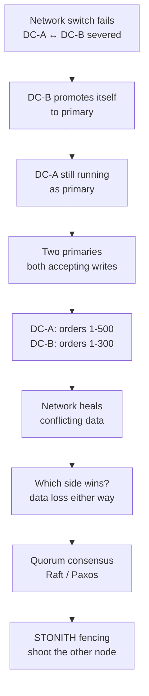
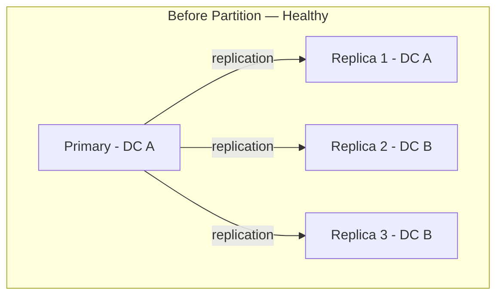
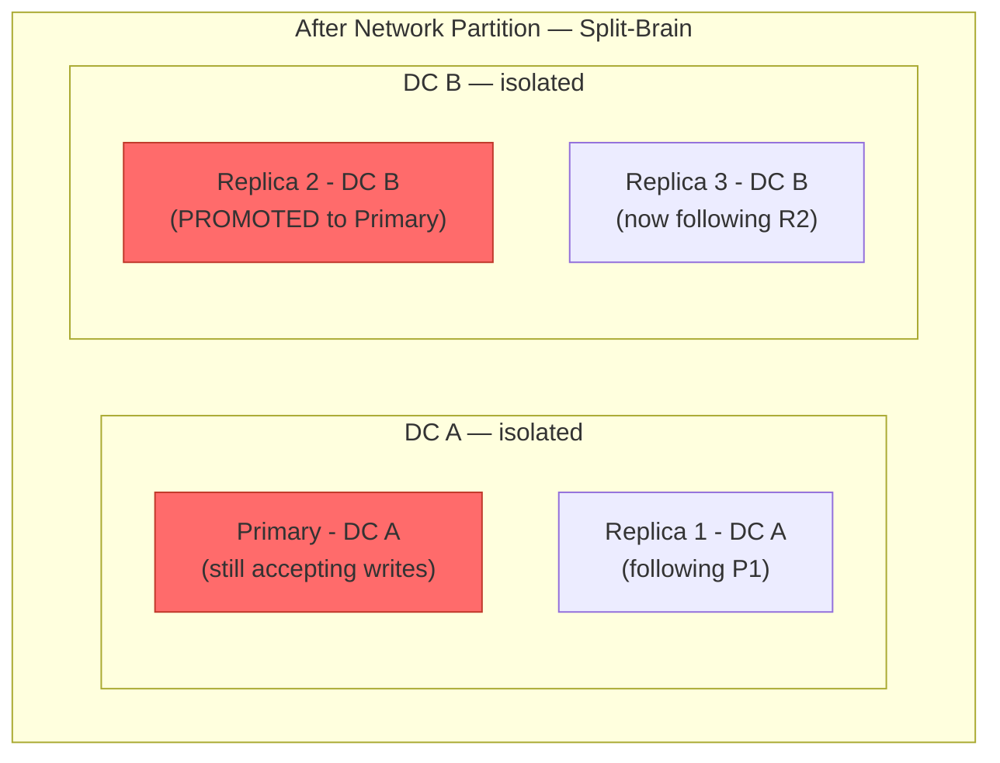
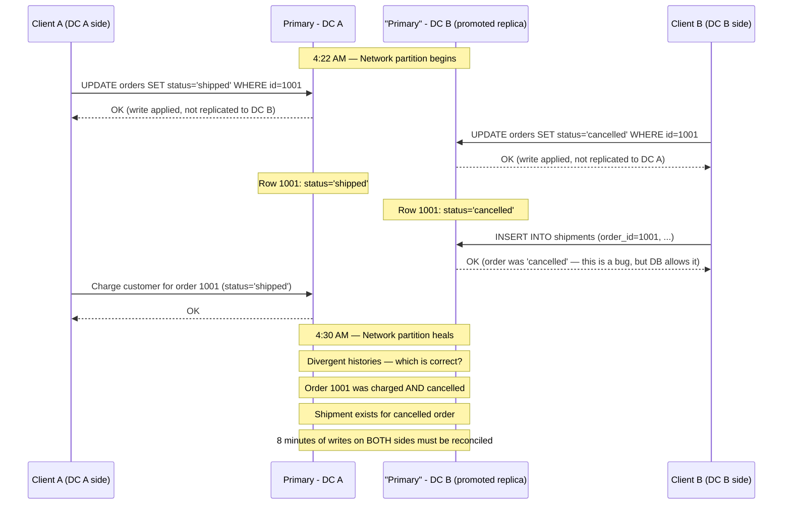
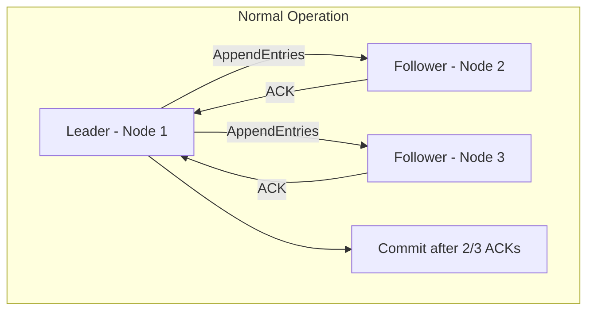
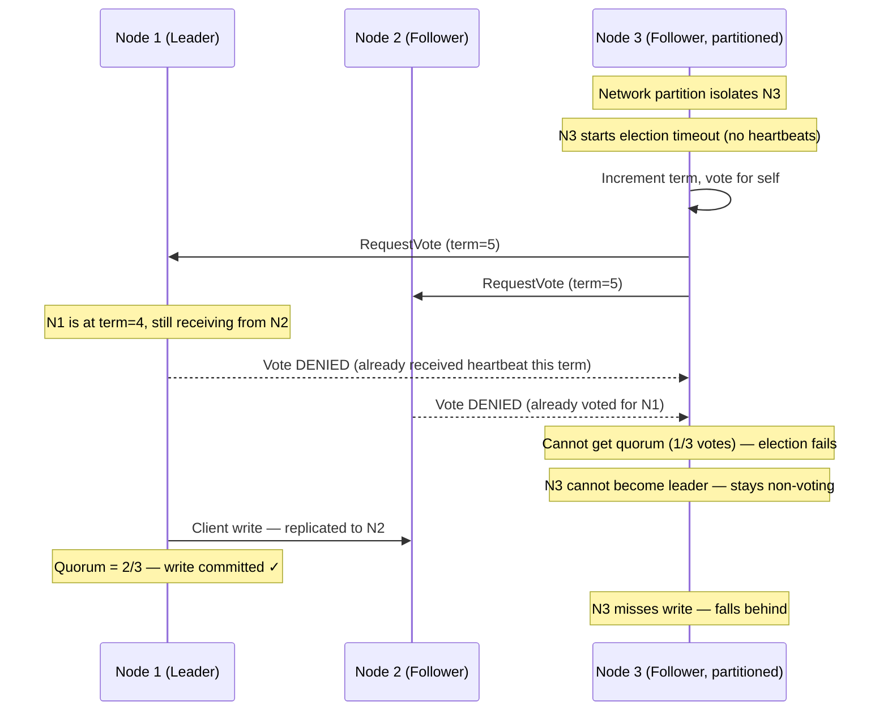

# Split-Brain: 8 Minutes of Two Databases Both Thinking They're Primary

## 🗺️ Quick Overview


*Normal path: one primary accepts all writes. Trigger: network partition severs datacenter communication. Failure cascade: both sides accept writes independently, creating unresolvable data conflicts.*

**At 4:22 AM, a network switch fails in data center B. The cluster can't reach data center B anymore. But the nodes in B can still reach each other — and they can still accept writes. For 8 minutes, your 'single' database is actually two separate databases, both accepting writes, both thinking they're the primary. When connectivity is restored, you have 8 minutes of conflicting writes. Which do you keep?**

---

## The Problem Class `[Availability — Severity: Data-Loss-Critical]`

Split-brain is qualitatively different from other distributed system failures. Most failures cause unavailability — requests fail, systems stop responding. Split-brain causes *silent data corruption*. Both sides believe they are correct. Both continue serving traffic. Both accept writes. When the partition heals, you discover you have two divergent histories that cannot be automatically merged.

This is the failure mode that CAP theorem is actually describing. During a network partition, you must choose: sacrifice consistency (allow both sides to write, accept potential conflicts) or sacrifice availability (refuse writes until quorum is confirmed). There is no option that preserves both.

---

## Why This Happens

### Normal Failover vs. Split-Brain

Understanding the difference is critical:

**Normal failover** (acceptable):
1. Primary node dies (hardware failure, OOM, kernel panic)
2. Replica detects no heartbeat from primary
3. Replica elects itself as new primary
4. Old primary is dead — only one primary exists

**Split-brain** (data loss):
1. Network between data centers fails
2. Primary (DC-A side) loses visibility to replicas in DC-B
3. Primary continues accepting writes — it's still running, just partitioned
4. Replica (DC-B side) detects no heartbeat — it looks like primary is dead
5. Replica promotes itself to primary — now TWO primaries exist
6. Both accept writes for 8 minutes
7. Network restores — two divergent write histories, no automatic resolution





### The Divergent Write Sequence



---

## Real-World Impact

**MongoDB, 2012**: A production incident at a MongoDB user (not MongoDB itself) involved async replication with a two-node replica set (no arbiter). During a network partition, the secondary promoted itself. When the partition healed, the primary had writes the secondary didn't have, and the secondary had writes the primary didn't have. MongoDB rolled back the secondary's divergent writes — causing data loss for those 8 minutes of writes. This incident became a case study in why async replication + automatic failover without quorum guarantees is dangerous.

**MySQL async replication (common incident type)**: MySQL's traditional async replication (not semi-sync or Group Replication) is the most common source of split-brain in production databases. Because replication is async, the replica may not have all primary writes when it's promoted. Engineers who disable `sync_binlog` and `innodb_flush_log_at_trx_commit` for performance make this worse — writes are acknowledged before they're durably committed.

**Redis Sentinel limitations**: Redis Sentinel can promote a replica to primary during a partition. If the original primary was partitioned but not down, you have two Redis primaries briefly. Redis's response: the old primary eventually reconnects, detects it's no longer primary, and drops its writes since the partition. This is by design — Redis prioritizes consistency over durability of the partitioned primary's writes.

**Cassandra (by design — multi-primary)**: Cassandra intentionally allows all nodes to accept writes. Split-brain is handled by last-write-wins (LWW) semantics during read repair. This is the "accept the split-brain, resolve it later" approach — valid for some use cases, dangerous for others (financial data).

---

## The Wrong Fix

### "Just Accept One Side's Data"

When the partition heals, picking a winner arbitrarily discards valid writes from the losing side. Users who wrote to the losing primary see their data silently disappear. For financial systems, inventory systems, or any system where writes represent real-world actions, this is data loss — not just an inconvenience.

### "Just Use Replication"

Standard async replication makes split-brain *more* dangerous, not less. Async replication means the promoted replica may be behind the original primary by seconds or minutes of writes. When you pick a winner, you lose all unapplied replication events. Synchronous replication reduces the window but doesn't eliminate split-brain — it prevents promotion until at least one replica is up to date, but doesn't prevent two primaries.

---

## The Right Solutions

### Solution 1: Quorum Writes — Majority Confirmation Required

A write is only acknowledged after a majority of nodes have confirmed it. A partition that doesn't contain a majority cannot accept writes — it lacks quorum.

**Key insight**: A cluster of N nodes can only form one majority (⌊N/2⌋ + 1 nodes). Therefore, only one partition side can have quorum, and only that side can accept writes. Split-brain becomes impossible.

```
3 nodes — quorum = 2
  Partition: [Node A] | [Node B, Node C]
  DC A side (1 node): cannot form quorum — WRITE REFUSED
  DC B side (2 nodes): has quorum — writes accepted
  Result: one primary, no split-brain ✓

5 nodes across 2 DCs (3 in DC A, 2 in DC B):
  Partition: [Node A, B, C] | [Node D, E]
  DC A side (3 nodes): quorum = 3 — WRITES ACCEPTED
  DC B side (2 nodes): cannot form quorum — WRITE REFUSED
  Result: DC A continues, DC B goes read-only ✓
```

This is the core insight of Raft and Paxos consensus algorithms.

**Raft consensus in a 3-node cluster**:





N3 cannot become leader because it cannot get majority votes. There is only one leader — on the partition side that has quorum. This prevents split-brain.

### Solution 2: Fencing Tokens — Prevent Stale Primary Writes

Even with quorum-based leader election, there's a race condition: the old leader may not immediately know it's been deposed. Fencing tokens solve this.

Each time a leader is elected, it receives a monotonically increasing *epoch number* (fencing token). All writes must include the current epoch. The storage layer rejects writes from any epoch lower than the current maximum seen.

```javascript
// fencing-token-example.js
// Simulates how storage layer validates fencing tokens

class FencedStorage {
  constructor() {
    this.data = new Map();
    this.currentEpoch = 0;
  }

  // Called when a new leader is elected
  newLeaderElected() {
    this.currentEpoch++;
    console.log(`New epoch: ${this.currentEpoch}`);
    return this.currentEpoch;
  }

  write(key, value, epoch) {
    if (epoch < this.currentEpoch) {
      throw new Error(
        `Stale write rejected: epoch ${epoch} < current epoch ${this.currentEpoch}. ` +
        `This node is no longer the leader.`
      );
    }
    this.data.set(key, { value, epoch });
    return true;
  }

  read(key) {
    return this.data.get(key);
  }
}

// Example: Old primary tries to write after being fenced
const storage = new FencedStorage();

// Old primary was epoch 3
const oldPrimaryEpoch = 3;

// New primary elected (epoch 4)
const newEpoch = storage.newLeaderElected(); // epoch = 4

// Old primary (still running, just partitioned) tries to write
try {
  storage.write('order:1001', 'shipped', oldPrimaryEpoch); // epoch=3 < 4
} catch (err) {
  console.error(err.message);
  // "Stale write rejected: epoch 3 < current epoch 4."
  // Old primary's write is rejected by the storage layer
}

// New primary's writes are accepted
storage.write('order:1001', 'cancelled', newEpoch); // epoch=4 = 4 — accepted
```

This is how etcd and ZooKeeper implement leader safety — the storage layer itself enforces that only the current epoch's leader can write.

### Solution 3: STONITH — Shoot The Other Node In The Head

STONITH (Shoot The Other Node In The Head) is a fencing mechanism used in Linux HA clustering. When a partition is detected, the surviving side forces the other side to terminate — by powering off the machine, rebooting it, or disconnecting its storage. Once the loser is confirmed dead, there can only be one primary.

STONITH is implemented via:
- **IPMI/iDRAC**: Remote power control on physical servers
- **Cloud provider APIs**: Terminate the EC2 instance, delete the GCE VM
- **Storage-level fencing**: SAN/NAS that only permits I/O from the active side

```javascript
// Conceptual STONITH implementation using cloud APIs
const AWS = require('aws-sdk');
const ec2 = new AWS.EC2();

async function fencePartitionedNode(instanceId) {
  console.log(`STONITH: Terminating partitioned node ${instanceId}`);

  // Option 1: Hard terminate (immediate, no graceful shutdown)
  await ec2.terminateInstances({
    InstanceIds: [instanceId]
  }).promise();

  // Wait for confirmed termination before allowing writes
  await waitForTermination(instanceId);
  console.log(`STONITH: ${instanceId} confirmed terminated — single primary guaranteed`);
}

async function waitForTermination(instanceId, maxWaitMs = 60000) {
  const start = Date.now();
  while (Date.now() - start < maxWaitMs) {
    const status = await ec2.describeInstances({
      InstanceIds: [instanceId]
    }).promise();

    const state = status.Reservations[0]?.Instances[0]?.State?.Name;
    if (state === 'terminated') return;

    await new Promise(r => setTimeout(r, 2000));
  }
  throw new Error(`STONITH timeout: ${instanceId} did not terminate`);
}
```

**Trade-off**: STONITH requires out-of-band management plane access (IPMI, cloud API). If the management plane itself is partitioned, STONITH may not be reachable. Always test that STONITH is functional — a STONITH that can't fence is worse than no STONITH (you believe you're protected but you're not).

### Solution 4: Leader Leases — Self-Expiring Authority

A leader lease is a time-bounded lease that expires if the leader cannot contact a quorum within a timeout. Instead of waiting to be explicitly deposed, the leader *voluntarily* stops accepting writes when its lease expires.

```javascript
// leader-lease.js
class LeaderWithLease {
  constructor(clusterNodes, leaseMs = 10000, renewIntervalMs = 3000) {
    this.leaseMs = leaseMs;
    this.renewIntervalMs = renewIntervalMs;
    this.leaseExpiry = 0;
    this.isLeader = false;
    this.clusterNodes = clusterNodes;
  }

  async startLeadership() {
    this.isLeader = true;
    this.leaseExpiry = Date.now() + this.leaseMs;
    console.log('Became leader, lease expires at', new Date(this.leaseExpiry));

    // Continuously renew lease by confirming quorum
    this.renewalInterval = setInterval(async () => {
      await this.renewLease();
    }, this.renewIntervalMs);
  }

  async renewLease() {
    if (!this.isLeader) return;

    const quorumRequired = Math.floor(this.clusterNodes.length / 2) + 1;

    // Send heartbeat to all nodes, count responses
    const responses = await Promise.allSettled(
      this.clusterNodes.map(node => this.heartbeat(node))
    );

    const successes = responses.filter(r => r.status === 'fulfilled').length + 1; // +1 for self

    if (successes >= quorumRequired) {
      // Quorum confirmed — extend lease
      this.leaseExpiry = Date.now() + this.leaseMs;
      console.log('Lease renewed, quorum:', successes, '/', this.clusterNodes.length + 1);
    } else {
      // Cannot confirm quorum — lease will expire, stop accepting writes
      console.error(`Cannot confirm quorum (${successes}/${quorumRequired}) — lease will expire`);
      // Don't renew — lease will expire in leaseMs
    }
  }

  canAcceptWrite() {
    if (!this.isLeader) return false;
    if (Date.now() > this.leaseExpiry) {
      // Lease expired — step down
      console.error('Lease expired — stepping down, refusing writes');
      this.isLeader = false;
      clearInterval(this.renewalInterval);
      return false;
    }
    return true;
  }

  async write(key, value) {
    if (!this.canAcceptWrite()) {
      throw new Error('Not the leader or lease expired — write refused');
    }
    // ... apply write
  }

  async heartbeat(node) {
    return fetch(`http://${node}/heartbeat`, { timeout: 1000 });
  }
}
```

With leases: when the network partition occurs, the partitioned node's lease expires within `leaseMs` milliseconds. After expiry, it refuses all writes. The other side elects a new leader. There's a brief window of `leaseMs` where the old leader may still accept writes — this is the availability/consistency trade-off. Etcd uses 500ms lease periods in production. This limits data divergence to at most 500ms of writes on the old leader.

---

## Detection: How to Know Split-Brain Is Happening

**Two nodes reporting primary status**: The clearest signal. Monitor every node's self-reported role.

```javascript
// health-monitor.js — poll all nodes for their reported role
async function checkForSplitBrain(clusterNodes) {
  const roles = await Promise.allSettled(
    clusterNodes.map(async node => {
      const response = await fetch(`http://${node}/health`);
      const data = await response.json();
      return { node, role: data.role, epoch: data.epoch };
    })
  );

  const primaries = roles
    .filter(r => r.status === 'fulfilled' && r.value.role === 'primary')
    .map(r => r.value);

  if (primaries.length > 1) {
    alert('CRITICAL: SPLIT-BRAIN DETECTED — multiple primaries', primaries);
    // Immediate action required — do not wait for on-call response
  }

  // Also check epochs — different epochs with same role indicates partition heal
  const epochs = new Set(primaries.map(p => p.epoch));
  if (primaries.length === 1 && epochs.size > 1) {
    alert('WARN: Epoch mismatch — recent partition or failover detected');
  }
}

// Run every 10 seconds
setInterval(checkForSplitBrain, 10000);
```

**Replication lag spike then sudden drop**: During a partition, replication lag grows on the partitioned replica. When the partition heals, lag drops suddenly. This pattern in your replication lag metrics indicates a partition occurred.

**Divergent write counters**: If you track `writes_applied` per node, two nodes showing different counts while both claiming to be primary is definitive split-brain evidence.

**Application-level anomalies**: Duplicate orders, negative inventory counts, conflicting status transitions (shipped AND cancelled). These are symptoms of data written to both sides of a split.

---

## Prevention Patterns Checklist

- [ ] Cluster uses quorum-based consensus (Raft, Paxos, or Galera) for leader election
- [ ] Cluster has an *odd* number of nodes (to always form a clear majority)
- [ ] Fencing tokens / epoch numbers are tracked and storage layer rejects stale-epoch writes
- [ ] STONITH or equivalent fencing mechanism is configured AND tested
- [ ] Leader leases are configured with an acceptably short expiry (etcd: 500ms-2000ms)
- [ ] All nodes expose `/health` endpoint with current role and epoch
- [ ] Monitoring polls all nodes for split-brain (multiple primaries) every 10 seconds
- [ ] Replication lag is monitored and alerted (alert at > 30 seconds lag)
- [ ] Partition healing runbook exists: who declares the winner, how conflicts are resolved
- [ ] Application handles stale reads: serve last-known-good data with a "may be stale" flag rather than erroring
- [ ] Async replication is NOT used for any data where data loss is unacceptable (use synchronous or semi-synchronous)

---

## Related Problems

- [Cascading Failures](./cascading-failures) — Network partition that causes split-brain also causes cascading failures in services awaiting DB responses
- [Timeout Domino Effect](./timeout-domino-effect) — Waiting for consensus during partition causes timeout cascades upstream
- [Thundering Herd](./thundering-herd) — After split-brain resolution and failover, cold cache causes thundering herd on recovered DB
