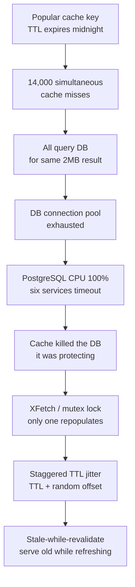
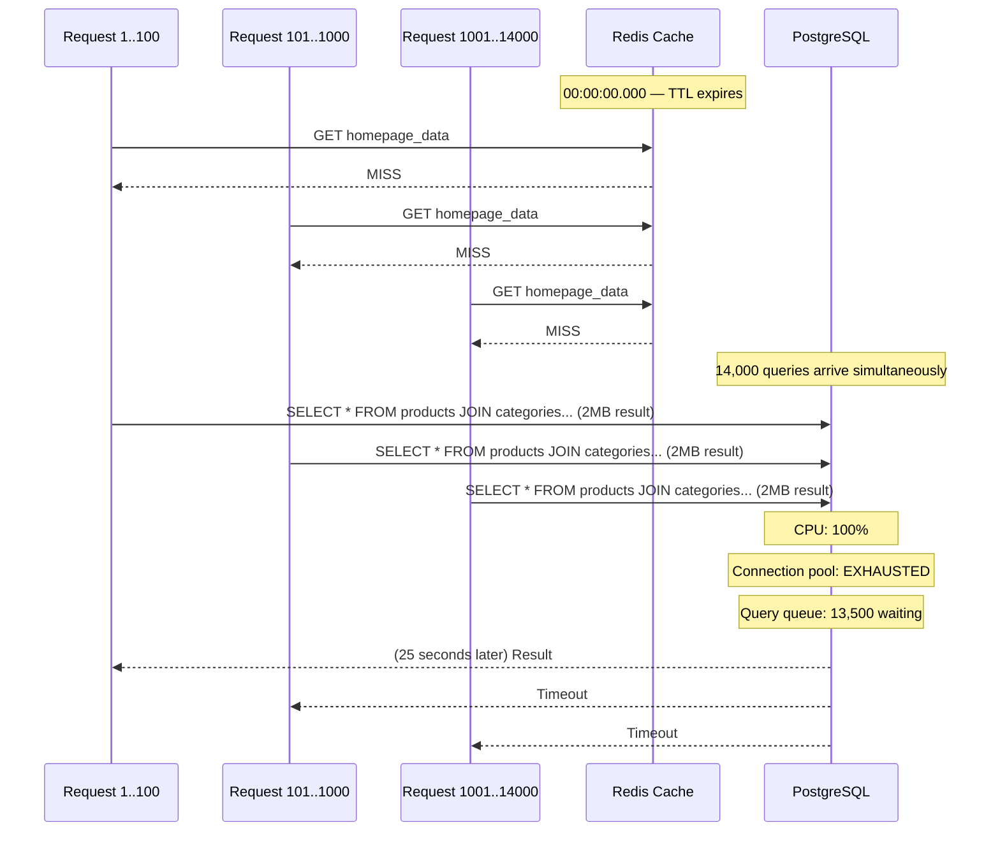

# Thundering Herd: How Your Cache Expiry Killed Your Database

## 🗺️ Quick Overview


*Normal path: cache hit → instant response. Trigger: synchronized TTL expiry at peak traffic. Failure cascade: the protection mechanism (cache) becomes the single point of failure when it expires.*

**Your Redis cache expires at 00:00:00 after a scheduled TTL. In the next 847 milliseconds, 14,000 concurrent requests all miss the cache, all query the database simultaneously, all load the same 2MB result set, all try to write it back to Redis. Your PostgreSQL CPU hits 100%. Six services time out waiting for DB connections. Your cache just killed your database.**

---

## The Problem Class `[Availability — Severity: High]`

The thundering herd (also called cache stampede) is a deceptive failure mode. You added caching to *protect* the database. The cache worked — until it didn't. The moment it failed (expired, restarted, or cold after a deploy), your entire traffic volume hit the database simultaneously. The protection became the single point of failure.

---

## Why This Happens

### Cause 1: Synchronized TTL Expiry

When you set a fixed TTL on a popular cache key, every server in your fleet that cached it will expire it at exactly the same time. At traffic scale, "exactly the same time" means thousands of cache misses in milliseconds.



### Cause 2: Cold Cache After Deploy

Every deployment starts with an empty cache. If your application receives traffic before the cache warms up, every request is a cache miss — simultaneously. With 100 application servers, you have 100× the normal database load on startup.

### Cause 3: Cache Restart

Redis restart, Redis failover, Redis cluster rebalancing — any event that clears cached data creates a cold-cache state across your entire fleet simultaneously.

### Why It Gets Worse: The Retry Loop

When the database times out under the load, clients retry. Now you have 14,000 × 3 retries = 42,000 queries in flight. See [Retry Storm](./retry-storm) for why this compounds the problem.

---

## Real-World Impact

**Facebook / Memcached (2013)**: Facebook's engineering team published a paper describing this exact problem with their Memcache infrastructure. At Facebook's scale, a single key could be requested by millions of clients simultaneously. Their solution (leases / mcrouter) became an industry reference for solving thundering herd in distributed caches.

**Reddit (multiple incidents)**: Reddit's engineering blog documents cache stampede incidents where popular post listings would expire simultaneously for all logged-out users (who share cache keys), causing database spikes that cascaded to full outages.

**E-commerce flash sales**: At 12:00:00 PM when a sale starts, all "sale items" cache entries that were pre-populated with TTL expire at the same second the traffic spike begins. Both thundering herd causes hit simultaneously.

---

## The Wrong Fix

### "Just Extend the TTL"

Increasing TTL from 5 minutes to 30 minutes means the stampede happens less *frequently* — but when it does happen, it's equally severe. You've changed the frequency, not the mechanism.

Worse, longer TTL means more stale data served to users.

### "Just Use a Longer Cache Warm-Up Period"

Cache warm-up helps with deploys but does nothing for scheduled TTL expiry or cache restarts.

---

## The Right Solutions

Multiple strategies work together. Use at least two of them.

### Solution 1: Cache Stampede Lock (Mutex / SETNX)

Only one request rebuilds the cache value. All other requests wait (or serve stale). Uses Redis's `SET NX EX` (set if not exists, with expiry) as a distributed mutex.

```javascript
const redis = require('ioredis');
const client = new redis();

async function getWithStampedeLock(key, fetchFn, ttl = 300) {
  // Try to get from cache first
  const cached = await client.get(key);
  if (cached !== null) {
    return JSON.parse(cached);
  }

  const lockKey = `lock:${key}`;
  const lockTtl = 10; // Lock expires in 10s (prevents deadlock if process crashes)

  // Try to acquire the rebuild lock
  // SET lock:key 1 NX EX 10 — atomic: only succeeds if key doesn't exist
  const acquired = await client.set(lockKey, '1', 'NX', 'EX', lockTtl);

  if (acquired === 'OK') {
    // We got the lock — we are responsible for rebuilding
    try {
      const freshData = await fetchFn();
      await client.setex(key, ttl, JSON.stringify(freshData));
      return freshData;
    } finally {
      // Always release the lock
      await client.del(lockKey);
    }
  } else {
    // Another process is rebuilding — wait briefly and retry from cache
    await sleep(100);
    const retried = await client.get(key);
    if (retried !== null) {
      return JSON.parse(retried);
    }
    // If still not available, fall through to fetchFn directly
    // (lock holder may have crashed; better to serve than timeout)
    return fetchFn();
  }
}

function sleep(ms) {
  return new Promise(resolve => setTimeout(resolve, ms));
}

// Usage
const homepageData = await getWithStampedeLock(
  'homepage:featured_products',
  () => db.query('SELECT * FROM products WHERE featured = true'),
  300 // 5 minute TTL
);
```

**Trade-off**: Under stampede, non-lock-holding requests wait 100ms and retry. If the rebuild is slow (2+ seconds), you may need multiple retries. This is a "serialize the rebuilders" approach — works well but adds latency during the miss period.

### Solution 2: Probabilistic Early Expiration (XFetch Algorithm)

Randomly start refreshing a cache entry *before* it expires. The probability of refreshing increases as the TTL gets closer to zero. This distributes the "when should I refresh?" decision across requests so no synchronized stampede forms.

Invented by researchers and popularized by Vattani, Chierichetti, and Lowenstein (2015).

```javascript
async function getWithXFetch(key, fetchFn, ttl = 300, beta = 1.0) {
  // Get value AND its remaining TTL in one round trip
  const [cached, remainingTtl] = await Promise.all([
    client.get(key),
    client.ttl(key)
  ]);

  if (cached !== null) {
    // XFetch: decide probabilistically whether to refresh early
    // Higher beta = more aggressive early refresh
    // -beta * delta * Math.log(Math.random()) is the XFetch formula
    const fetchDuration = 0.1; // Estimated time to rebuild cache (seconds)
    const shouldRefreshEarly = remainingTtl - (-beta * fetchDuration * Math.log(Math.random())) <= 0;

    if (!shouldRefreshEarly) {
      return JSON.parse(cached); // Serve from cache (usual path)
    }
    // Fall through to refresh — but we'll still serve cached data to this request
    // while refreshing in the background
  }

  // Refresh (either cache miss or probabilistic early refresh)
  const freshData = await fetchFn();
  await client.setex(key, ttl, JSON.stringify(freshData));
  return freshData;
}
```

**Trade-off**: No explicit locking, no waiting. Slightly higher database load in the minutes before TTL expiry as multiple requests probabilistically refresh. But this load is *distributed* across time — not a spike.

### Solution 3: Stale-While-Revalidate

Serve stale data *immediately* to the request, and trigger a background refresh. The requesting client never waits for a fresh value.

```javascript
async function getWithStaleWhileRevalidate(key, fetchFn, {
  freshTtl = 60,    // Serve from cache, no background refresh
  staleTtl = 300,   // Serve stale, trigger background refresh
  rebuilding = new Set() // Track keys currently being refreshed
} = {}) {
  const cached = await client.get(key);

  if (cached !== null) {
    const entry = JSON.parse(cached);
    const age = Date.now() - entry.cachedAt;
    const freshMs = freshTtl * 1000;
    const staleMs = staleTtl * 1000;

    if (age < freshMs) {
      // Fresh: serve directly
      return entry.data;
    }

    if (age < staleMs) {
      // Stale but acceptable: serve immediately AND refresh in background
      if (!rebuilding.has(key)) {
        rebuilding.add(key);
        // Background refresh — don't await
        fetchFn()
          .then(freshData => {
            const newEntry = { data: freshData, cachedAt: Date.now() };
            return client.setex(key, staleTtl, JSON.stringify(newEntry));
          })
          .catch(err => console.error(`Background refresh failed for ${key}:`, err))
          .finally(() => rebuilding.delete(key));
      }
      return entry.data; // Return stale data immediately
    }
  }

  // Cache miss or expired beyond stale window — must fetch synchronously
  const freshData = await fetchFn();
  const entry = { data: freshData, cachedAt: Date.now() };
  await client.setex(key, staleTtl, JSON.stringify(entry));
  return freshData;
}
```

This pattern is also natively supported in HTTP via the `Cache-Control: stale-while-revalidate=60` header.

### Solution 4: TTL Jitter — Desynchronize Expiry

Add random variance to every TTL so keys don't expire simultaneously. The simplest thundering herd mitigation for bulk-cached data.

```javascript
function jitteredTtl(baseTtl, jitterRange = 0.2) {
  // Add ±20% random variance to base TTL
  const jitter = baseTtl * jitterRange;
  return Math.floor(baseTtl + (Math.random() * 2 - 1) * jitter);
}

// Instead of:
await client.setex('product:123', 300, data);  // Expires in exactly 5 minutes

// Use:
await client.setex('product:123', jitteredTtl(300), data);  // Expires in 4-6 minutes

// For high-concurrency scenarios, use larger jitter
function jitteredTtlRange(minTtl, maxTtl) {
  return Math.floor(minTtl + Math.random() * (maxTtl - minTtl));
}

await client.setex('homepage:featured', jitteredTtlRange(240, 360), data); // 4-6 min range
```

**When to use**: Bulk cache population (caching 10,000 product records). If you cache them all with TTL=300, they all expire at 300s. With jitter, they expire across a 5-minute window.

**When jitter isn't enough**: For a single high-traffic key (homepage, trending feed), even jitter won't help — there's one key, one expiry, one stampede. Use mutex lock or XFetch for hot keys.

### Solution 5: Cache Warming

Pre-populate the cache before traffic arrives. Used for deploys and cache restarts.

```javascript
// cache-warmer.js — run before each deploy or cache restart
async function warmCache() {
  console.log('Starting cache warm-up...');

  // Identify top-N hot keys from production analytics
  const hotKeys = await analytics.getTopAccessedKeys({ limit: 1000 });

  // Populate with concurrency limit to avoid overwhelming DB
  const limit = pLimit(20); // 20 concurrent DB queries max

  await Promise.all(
    hotKeys.map(({ key, params }) =>
      limit(async () => {
        const data = await fetchFromDatabase(params);
        const ttl = jitteredTtl(300);
        await client.setex(key, ttl, JSON.stringify(data));
      })
    )
  );

  console.log(`Cache warm-up complete: ${hotKeys.length} keys populated`);
}

// In your deployment pipeline:
// 1. Deploy new application version
// 2. Run cache warmer against new Redis instance
// 3. Switch traffic to new instances
// (Cache is already warm when traffic arrives)
```

**Facebook's approach (mcrouter leases)**: When a key is missing, the cache server issues a "lease" to the first requesting client. Other clients for the same key receive a "wait" response and retry after a short interval. The lease holder is the only one that may write the value. This is the distributed version of the mutex lock above.

---

## Detection: How to Know You're Heading Here

**Cache hit ratio drop**: If your normal hit rate is 95% and it drops to 20% over 30 seconds, you have a stampede.

```javascript
// Metric to track
const cacheHitRatio = cacheHits / (cacheHits + cacheMisses);
// Alert if: cacheHitRatio < 0.7 (sustained for 30s)
```

**DB connection spike correlated with TTL boundary**: Correlate DB connection count with your most popular cache key TTL times. If you set TTL=300 at cache population time and DB spikes happen every 5 minutes, that's your thundering herd.

**Latency P99 spike at regular intervals**: If P99 spikes every N minutes (where N matches your TTL), you're seeing periodic stampedes.

**Cache miss latency distribution**: Normal cache miss = 50-200ms (one DB query). Stampede miss = 5-30 seconds (DB queue backup). Bimodal latency distribution indicates stampede.

---

## Prevention Patterns Checklist

- [ ] Hot keys (homepage, trending, shared resources) use mutex lock or XFetch instead of raw TTL
- [ ] Bulk-cached data uses jittered TTL to desynchronize expiry
- [ ] Non-critical data uses stale-while-revalidate to avoid synchronous rebuilds
- [ ] Cache warm-up script runs before each deploy and after cache restarts
- [ ] Cache hit ratio is monitored and alerted (alert at < 80% of baseline)
- [ ] DB connection pool utilization is monitored and alerted (alert at > 80%)
- [ ] Stampede locks have a maximum wait time — fall back to DB if lock wait exceeds threshold
- [ ] Thundering herd tested in staging: deploy to cold cache, verify DB connection count
- [ ] Cache TTLs are documented per key type with justification

---

## Related Problems

- [Cascading Failures](./cascading-failures) — Thundering herd can trigger a cascade if DB becomes the slow downstream
- [Retry Storm](./retry-storm) — Retrying on cache miss under stampede amplifies DB load further
- [Timeout Domino Effect](./timeout-domino-effect) — DB timeout under stampede load propagates up the call chain
