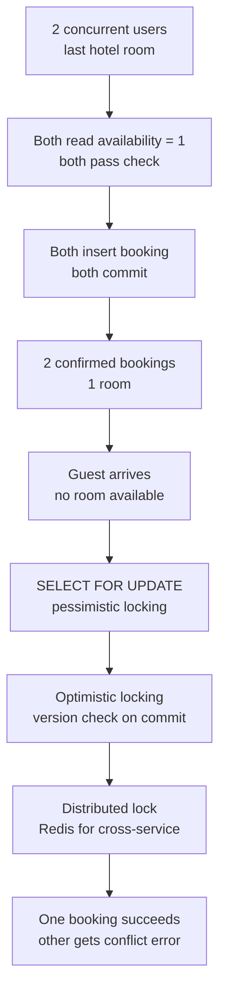
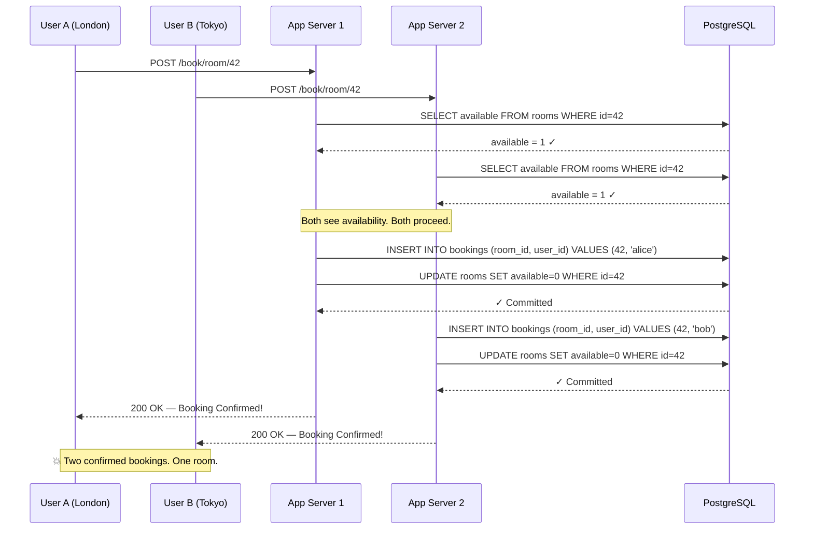
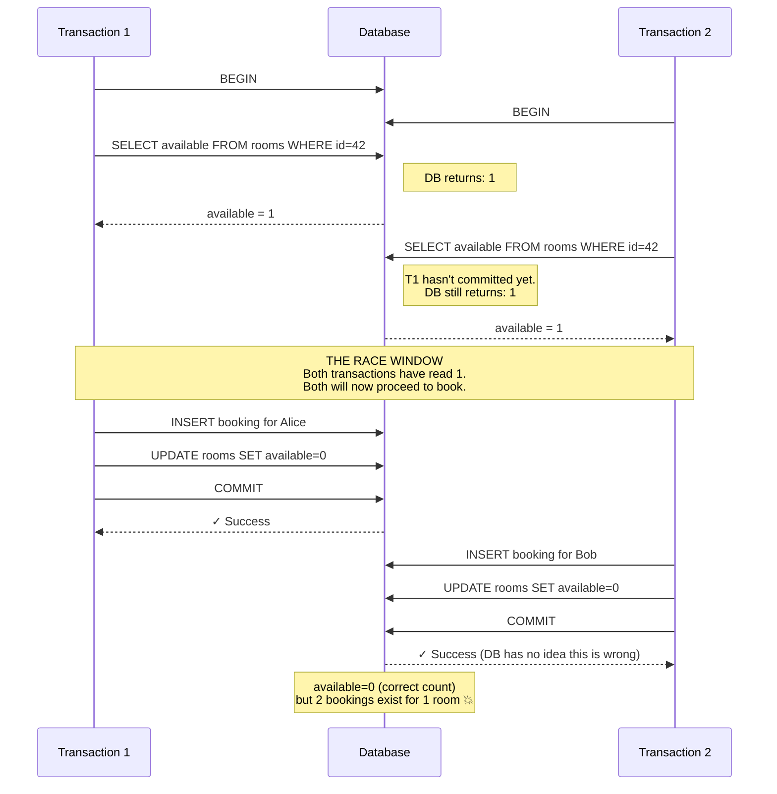

# Double Booking: When Two Users Win the Last Seat

## 🗺️ Quick Overview


*Normal path: read availability → confirm booking → decrement. Trigger: two requests read the same availability before either commits. Failure: gap between read and write allows both to proceed.*

**Black Friday, 11:59 PM. Two users click "Book" on the last hotel room simultaneously. Both see "Booking Confirmed." The guest arriving tomorrow will find there's no room for them — and your support team will spend the next 48 hours handling the fallout.** The hotel will comp the room, eat the cost, and you'll wake up to a Slack message reading: "we need to talk about the booking system."

This is the double booking problem. It's deceptively simple to create and surprisingly tricky to fix correctly at scale.

---

## The Problem Class `[Senior]`

You have a resource with limited availability — a hotel room, a concert seat, a rental car, a doctor's appointment slot. Users request this resource concurrently. Your application reads availability, confirms it's > 0, creates the booking, and decrements the counter. This logic is correct in a single-threaded world. It is catastrophically wrong under concurrency.

The failure happens in the gap between the read and the write. Both requests read `available = 1`. Both pass the availability check. Both insert a booking record. Both commit. Now you have 2 bookings for 1 room.



---

## Why This Happens

The root cause is that **SELECT followed by UPDATE is not atomic**. Even inside a transaction, the gap between the read and the write is a window where concurrent requests can interleave.

At the `READ COMMITTED` isolation level (the PostgreSQL default), each statement sees the committed state at the time that statement executes — not the state at the transaction's start. So when App Server 2 reads `available = 1`, it sees the committed state *before* App Server 1's transaction commits. Both proceed.

Even at `REPEATABLE READ`, this doesn't save you. Repeatable read prevents the data you *read* from changing under you, but it doesn't prevent *another transaction* from also reading the same row and making its own booking. Two transactions can both see `available = 1` and both commit their bookings successfully — PostgreSQL will not detect the conflict because neither transaction modifies a row the other has read (the bookings table has separate rows for each user).

The real problem:



The database did exactly what you told it to. Nothing failed. No constraint was violated. This is the insidious part: **the bug is in your logic, not your infrastructure**.

---

## Real-World Impact

**Booking.com** publicly described dealing with this problem at scale. With millions of properties and users in hundreds of time zones, the window for concurrent bookings on the same room is not theoretical — it happens thousands of times a day for popular properties during peak periods. A naive implementation would routinely oversell rooms.

**Ticketmaster** has faced this problem with concert tickets. When Taylor Swift or Beyoncé announces a tour, the system handles millions of concurrent requests for a finite number of seats. Their systems implement aggressive locking and reservation systems specifically to prevent double allocation — and even then, edge cases have caused fan outrage when "confirmed" seats are later invalidated.

**Airbnb** estimates that without proper concurrency controls, their booking confirmation rate for popular listings during holiday periods would generate significant overbooking rates. Their solution involves a combination of optimistic locking and distributed reservation holds.

The cost is not just technical. A double-booked hotel room means:
- One guest stranded at check-in
- Hotel comping an alternative room (often at higher cost to them)
- Customer support escalation
- Potential chargeback disputes
- Reputational damage and reviews

---

## The Wrong Fix (and Why It Fails)

The first instinct is to add an application-level check or lock.

```javascript
// DON'T DO THIS — application-level "lock" using a shared variable
const bookingInProgress = new Set();

async function bookRoom(roomId, userId) {
  if (bookingInProgress.has(roomId)) {
    throw new Error('Booking in progress, try again');
  }
  bookingInProgress.add(roomId);

  try {
    const room = await db.query('SELECT available FROM rooms WHERE id=$1', [roomId]);
    if (room.rows[0].available < 1) throw new Error('No availability');

    await db.query('INSERT INTO bookings (room_id, user_id) VALUES ($1, $2)', [roomId, userId]);
    await db.query('UPDATE rooms SET available=available-1 WHERE id=$1', [roomId]);
  } finally {
    bookingInProgress.delete(roomId);
  }
}
```

This fails for two reasons:

1. **It's process-local.** The `bookingInProgress` Set lives in one Node.js process's memory. You have 10 app servers. Each has its own Set. Two requests hitting different servers have no shared state.

2. **Even on one server, Node.js is single-threaded but async.** The `await` calls yield control. Another request can enter `bookRoom` between your check and your DB write.

This is the "check-then-act" anti-pattern. The window is smaller, but it still exists.

---

## The Right Solutions

### Solution 1: SELECT FOR UPDATE (Pessimistic Locking)

The database itself acquires an exclusive row lock when you `SELECT FOR UPDATE`. Any other transaction trying to read or lock the same row blocks until the first transaction commits or rolls back.

```javascript
const { Pool } = require('pg');
const pool = new Pool({ connectionString: process.env.DATABASE_URL });

async function bookRoomPessimistic(roomId, userId) {
  const client = await pool.connect();

  try {
    await client.query('BEGIN');

    // Lock the room row exclusively. Concurrent requests BLOCK here until we commit.
    const result = await client.query(
      'SELECT id, available FROM rooms WHERE id = $1 FOR UPDATE',
      [roomId]
    );

    if (result.rows.length === 0) {
      throw new Error('Room not found');
    }

    const room = result.rows[0];

    if (room.available < 1) {
      await client.query('ROLLBACK');
      throw new Error('No availability — room is fully booked');
    }

    // Safe to insert — we hold the exclusive lock on this room row.
    await client.query(
      'INSERT INTO bookings (room_id, user_id, created_at) VALUES ($1, $2, NOW())',
      [roomId, userId]
    );

    await client.query(
      'UPDATE rooms SET available = available - 1 WHERE id = $1',
      [roomId]
    );

    await client.query('COMMIT');

    return { success: true, message: 'Booking confirmed' };

  } catch (err) {
    await client.query('ROLLBACK');
    throw err;
  } finally {
    client.release();
  }
}
```

**How the lock works**: When Transaction 1 executes `SELECT ... FOR UPDATE`, PostgreSQL puts an exclusive lock on that row. Transaction 2's `SELECT ... FOR UPDATE` on the same row blocks — it waits. When T1 commits, T2 unblocks, reads `available = 0`, and correctly throws "No availability."

**Tradeoff**: Under high concurrency, requests queue up at the lock. For a single popular room during a flash sale, this serializes all booking attempts. Throughput is limited by your DB's transaction commit rate per row. For most booking scenarios (hotels, flights), this is acceptable. For high-throughput flash sales, look at Solutions 3 or 4.

**SKIP LOCKED for queue-like workloads**: If you have multiple identical resources (e.g., any seat in section A), use `SKIP LOCKED` to grab any available room without contention:

```javascript
const result = await client.query(`
  SELECT id FROM rooms
  WHERE event_id = $1 AND available > 0
  LIMIT 1
  FOR UPDATE SKIP LOCKED
`, [eventId]);
```

---

### Solution 2: Optimistic Locking with Version Column

Instead of blocking other transactions, detect conflicts at commit time using a version counter.

```javascript
async function bookRoomOptimistic(roomId, userId, maxRetries = 3) {
  for (let attempt = 0; attempt < maxRetries; attempt++) {
    const client = await pool.connect();

    try {
      await client.query('BEGIN');

      // Read the current state including version
      const result = await client.query(
        'SELECT id, available, version FROM rooms WHERE id = $1',
        [roomId]
      );

      const room = result.rows[0];

      if (room.available < 1) {
        await client.query('ROLLBACK');
        throw new Error('No availability');
      }

      // Update ONLY if version hasn't changed since we read it.
      // If another transaction committed between our read and this write,
      // version will have incremented and rows_affected will be 0.
      const updateResult = await client.query(
        `UPDATE rooms
         SET available = available - 1, version = version + 1
         WHERE id = $1 AND version = $2 AND available > 0`,
        [roomId, room.version]
      );

      if (updateResult.rowCount === 0) {
        // Conflict detected — someone else committed first. Retry.
        await client.query('ROLLBACK');
        console.log(`Optimistic lock conflict on attempt ${attempt + 1}, retrying...`);
        continue;
      }

      await client.query(
        'INSERT INTO bookings (room_id, user_id, created_at) VALUES ($1, $2, NOW())',
        [roomId, userId]
      );

      await client.query('COMMIT');
      return { success: true, message: 'Booking confirmed' };

    } catch (err) {
      await client.query('ROLLBACK');
      if (err.message === 'No availability') throw err;
      throw err;
    } finally {
      client.release();
    }
  }

  throw new Error('Booking failed after max retries — high contention');
}
```

**Schema requirement**:
```sql
ALTER TABLE rooms ADD COLUMN version INTEGER NOT NULL DEFAULT 0;
```

**Tradeoff**: No blocking — all transactions proceed in parallel. Conflicts cause retries. Works well when conflicts are rare (most rooms have > 1 available slot). Degrades under high contention on the same row (many retries, many failures).

---

### Solution 3: Atomic Decrement with CHECK Constraint

The most elegant SQL-only solution. Use a single atomic `UPDATE` with a conditional `WHERE` clause. If no row is updated, availability was 0.

```javascript
async function bookRoomAtomic(roomId, userId) {
  const client = await pool.connect();

  try {
    await client.query('BEGIN');

    // Single atomic operation: decrement only if available > 0.
    // The WHERE clause and UPDATE are evaluated atomically by the DB engine.
    const updateResult = await client.query(
      `UPDATE rooms
       SET available = available - 1
       WHERE id = $1 AND available > 0`,
      [roomId]
    );

    if (updateResult.rowCount === 0) {
      await client.query('ROLLBACK');
      throw new Error('No availability — room is fully booked');
    }

    // The decrement succeeded — safe to create the booking record.
    const booking = await client.query(
      `INSERT INTO bookings (room_id, user_id, created_at)
       VALUES ($1, $2, NOW())
       RETURNING id`,
      [roomId, userId]
    );

    await client.query('COMMIT');

    return {
      success: true,
      bookingId: booking.rows[0].id,
      message: 'Booking confirmed'
    };

  } catch (err) {
    await client.query('ROLLBACK');
    throw err;
  } finally {
    client.release();
  }
}
```

Add a CHECK constraint as a safety net:
```sql
ALTER TABLE rooms ADD CONSTRAINT available_non_negative CHECK (available >= 0);
```

This is belt-and-suspenders. The atomic WHERE clause prevents going negative. The CHECK constraint makes the DB reject it even if someone writes a bad query later.

**Why this works**: The `UPDATE ... WHERE available > 0` is a single SQL statement. Within a single statement, PostgreSQL acquires row locks, evaluates the WHERE clause, and applies the update atomically. Two concurrent transactions cannot both satisfy `available > 0` and both commit — one will see `rowCount = 0`.

---

### Solution 4: Redis Distributed Lock for High-Throughput Systems

For flash sales or event ticketing where thousands of requests hit the same resource per second, database row locking creates a bottleneck. A Redis-based distributed lock keeps the DB work outside the hot path.

```javascript
const Redis = require('ioredis');
const redis = new Redis(process.env.REDIS_URL);

async function acquireDistributedLock(lockKey, ttlMs = 5000) {
  const lockValue = `${process.env.SERVER_ID}:${Date.now()}:${Math.random()}`;

  // SET NX EX is atomic — only one caller wins
  const result = await redis.set(
    lockKey,
    lockValue,
    'PX', ttlMs,  // Expire after 5s to prevent deadlock if server crashes
    'NX'          // Only set if key does Not eXist
  );

  if (result !== 'OK') {
    return null; // Lock not acquired — another process holds it
  }

  return lockValue;
}

async function releaseDistributedLock(lockKey, lockValue) {
  // Use Lua script for atomic check-and-delete
  // Never delete a lock you don't own (race between TTL expiry and delete)
  const luaScript = `
    if redis.call("GET", KEYS[1]) == ARGV[1] then
      return redis.call("DEL", KEYS[1])
    else
      return 0
    end
  `;

  await redis.eval(luaScript, 1, lockKey, lockValue);
}

async function bookRoomWithDistributedLock(roomId, userId) {
  const lockKey = `booking:lock:room:${roomId}`;
  const lockValue = await acquireDistributedLock(lockKey, 5000);

  if (!lockValue) {
    // Could retry with backoff, or queue the request
    throw new Error('Room temporarily unavailable — please try again');
  }

  try {
    // Only one process reaches here for a given roomId at a time
    const room = await pool.query(
      'SELECT available FROM rooms WHERE id = $1',
      [roomId]
    );

    if (room.rows[0].available < 1) {
      throw new Error('No availability');
    }

    // Perform booking without needing SELECT FOR UPDATE
    const client = await pool.connect();
    try {
      await client.query('BEGIN');
      await client.query(
        'UPDATE rooms SET available = available - 1 WHERE id = $1',
        [roomId]
      );
      const booking = await client.query(
        'INSERT INTO bookings (room_id, user_id, created_at) VALUES ($1, $2, NOW()) RETURNING id',
        [roomId, userId]
      );
      await client.query('COMMIT');
      return { success: true, bookingId: booking.rows[0].id };
    } finally {
      client.release();
    }

  } finally {
    // Always release the lock
    await releaseDistributedLock(lockKey, lockValue);
  }
}
```

**For extremely high throughput** (Ticketmaster-scale), pre-allocate seat tokens into a Redis list and use `LPOP`:

```javascript
// Pre-load available seats into Redis (run at event creation time)
async function preloadSeats(eventId, seatIds) {
  const key = `available:seats:${eventId}`;
  await redis.rpush(key, ...seatIds.map(String));
  await redis.expire(key, 86400 * 7); // 7 days
}

// Claim a seat atomically — LPOP is O(1) and atomic
async function claimSeat(eventId, userId) {
  const key = `available:seats:${eventId}`;
  const seatId = await redis.lpop(key);

  if (!seatId) {
    throw new Error('Sold out');
  }

  // Persist to DB asynchronously — the Redis pop is the authoritative claim
  await persistBookingAsync(eventId, seatId, userId);

  return { seatId, message: 'Seat reserved' };
}
```

This approach handles millions of requests per second. The LPOP is atomic — only one caller gets each seat token.

---

## Correct Flow: SELECT FOR UPDATE

Here's what the correct pessimistic locking flow looks like:

```mermaid
sequenceDiagram
    participant UserA as User A
    participant UserB as User B
    participant App1 as App Server 1
    participant App2 as App Server 2
    participant DB as PostgreSQL

    UserA->>App1: POST /book/room/42
    UserB->>App2: POST /book/room/42

    App1->>DB: BEGIN; SELECT * FROM rooms WHERE id=42 FOR UPDATE
    Note right of DB: Row lock acquired by T1

    App2->>DB: BEGIN; SELECT * FROM rooms WHERE id=42 FOR UPDATE
    Note right of DB: T2 BLOCKS — row is locked by T1

    DB-->>App1: available=1 ✓ (lock held)
    App1->>DB: INSERT booking for Alice
    App1->>DB: UPDATE rooms SET available=0
    App1->>DB: COMMIT
    DB-->>App1: ✓ Committed. Lock released.

    Note right of DB: T2 unblocks now that T1 committed

    DB-->>App2: available=0 (reads post-commit state)
    App2->>DB: ROLLBACK (no availability)
    DB-->>App2: ✓ Rolled back

    App1-->>UserA: 200 OK — Booking Confirmed!
    App2-->>UserB: 409 — Sorry, no availability
```

One winner. Zero overbooking.

---

## Prevention Patterns

**Design the schema defensively**:
```sql
-- Prevent negative availability at the database level
ALTER TABLE rooms ADD CONSTRAINT available_non_negative CHECK (available >= 0);

-- Unique constraint prevents truly duplicate bookings
ALTER TABLE bookings ADD CONSTRAINT unique_active_booking
  UNIQUE (room_id, checkin_date, checkout_date)
  WHERE status = 'confirmed';
```

**Use idempotency keys on the booking endpoint** to prevent duplicate submissions from double-clicks:
```javascript
app.post('/book', idempotencyMiddleware, bookRoomHandler);
```

**Monitor for anomalies**:
```javascript
// Alert if available ever goes below 0 (should never happen with constraints)
setInterval(async () => {
  const result = await pool.query('SELECT COUNT(*) FROM rooms WHERE available < 0');
  if (result.rows[0].count > 0) {
    alerting.fire('CRITICAL: negative room availability detected');
  }
}, 60000);
```

**Choose the right strategy by scale**:

| Scenario | Recommended Solution |
|----------|---------------------|
| Standard hotel booking site | SELECT FOR UPDATE |
| High-traffic event (< 10K rps) | Atomic UPDATE with WHERE |
| Flash sale / concert tickets | Redis LPOP pre-allocation |
| Complex multi-resource booking (flight + hotel) | Distributed saga + compensating transactions |

---

## Checklist: Am I Safe?

- [ ] Is my availability check and booking creation in a single transaction?
- [ ] Am I using `SELECT FOR UPDATE` or an equivalent atomic operation?
- [ ] Does my schema have a `CHECK (available >= 0)` constraint as a safety net?
- [ ] Do I verify `rowCount > 0` after conditional updates?
- [ ] Is my distributed lock releasing on exception (try/finally)?
- [ ] Does my distributed lock have a TTL to prevent deadlock on server crash?
- [ ] Am I monitoring for negative inventory values?
- [ ] Do I handle the "no lock acquired" case gracefully (retry or queue)?
- [ ] Is my booking endpoint idempotent (safe to retry on network failure)?

---

## Related Problems

- **Inventory Overselling** (`race-condition-inventory.md`) — the same race condition applied to e-commerce stock
- **Double Charge** (`double-charge-payment.md`) — payment idempotency when retries cause duplicate charges
- **Duplicate Orders** (`duplicate-orders.md`) — network retries creating multiple identical orders
- **Counter Race** (`counter-race.md`) — lost updates on shared counters (view counts, likes)
