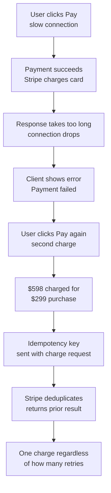
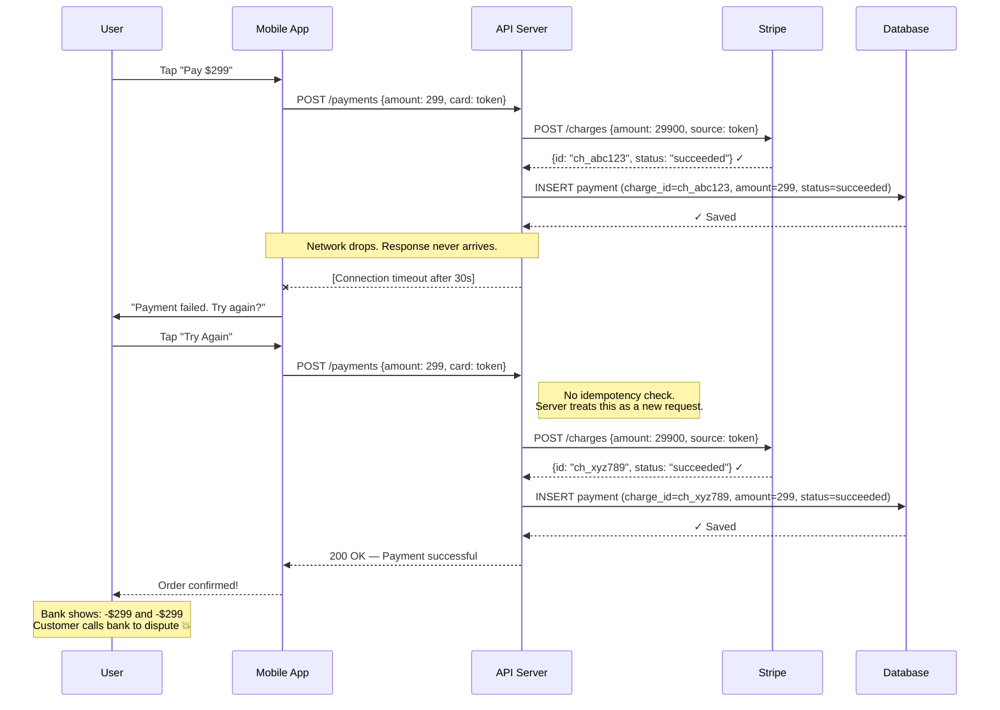
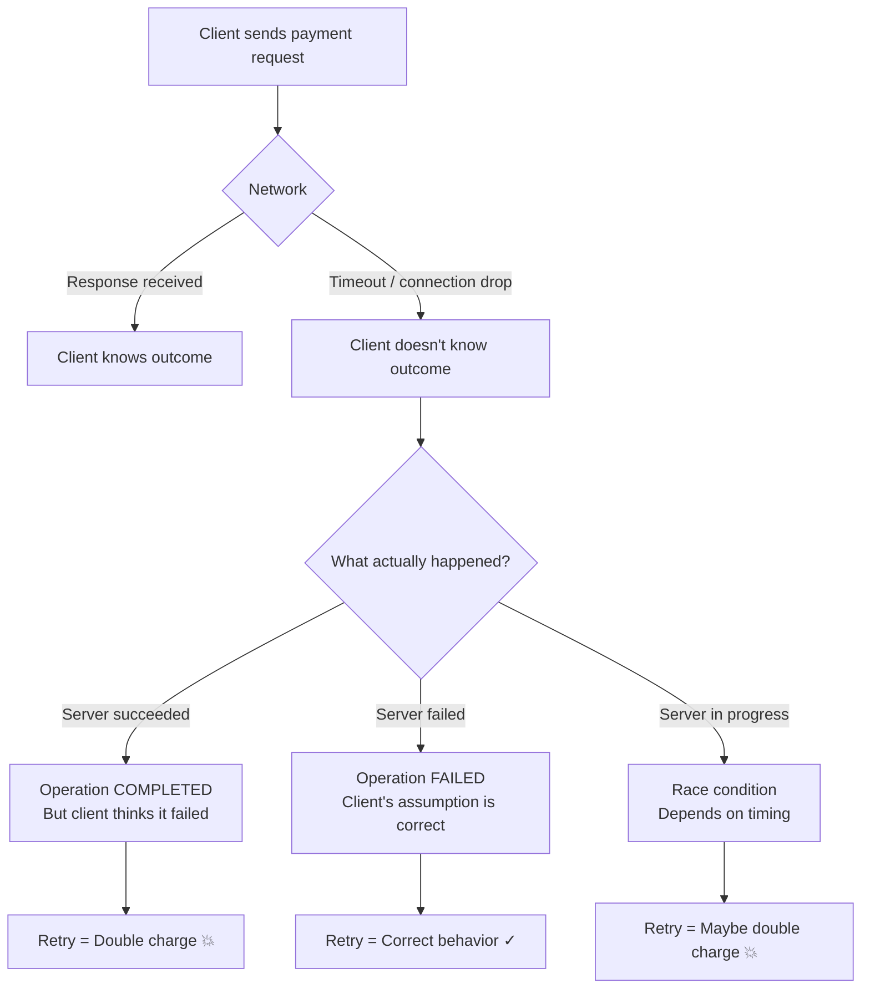
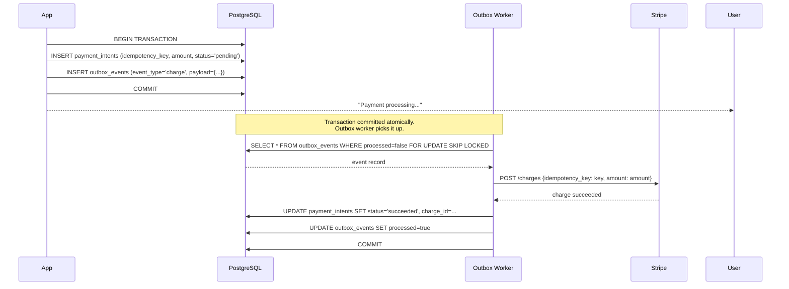

# Double Charge: When a Timeout Costs Your Customer Money

## 🗺️ Quick Overview


*Normal path: pay → confirm → one charge. Trigger: response lost after server-side success. Failure: client retries without idempotency key results in duplicate charges and chargebacks.*

**A user clicks "Pay" on a slow connection. The payment succeeds on the server — Stripe charges the card, the database records the transaction. Then the response takes too long, the connection drops, and the client receives an error. The app shows "Payment failed. Please try again." The user clicks pay again. Stripe charges the card again. Your dashboard shows 2 successful charges for $299 each. The customer gets charged $598 for a $299 purchase.** They notice at 2 AM when they check their bank app. They dispute the charge. You've lost the customer and you're paying chargeback fees.

This is payment idempotency failure — the most expensive type of race condition in production systems.

---

## The Problem Class `[Senior]`

The double charge problem is a specific instance of a broader failure mode: **network timeouts do not mean the operation failed**. The operation may have succeeded, succeeded partially, or truly failed. You cannot tell from the client's perspective. But the user expects you to tell them, and they expect exactly-once semantics — pay once, get charged once.



---

## Why Timeouts Don't Mean Failure

This is the most important concept to internalize. In distributed systems, there are three possible outcomes for any network request:

1. **Success** — the server processed the request and you received the response
2. **Definite failure** — the server rejected the request (4xx, 5xx with a clear error body)
3. **Ambiguous** — the connection dropped before the response arrived

Case 3 is the dangerous one. From the client's perspective, a timeout and a failure look identical. But from the server's perspective, the operation may be:
- Already completed successfully
- Currently in flight
- Never started
- Partially completed



**The core tension**: If you don't retry on timeout, you have lost payments — customers charged but no order created. If you retry without idempotency, you have double charges. You need retries *with* idempotency.

---

## Real-World Impact

**Stripe's documentation** leads with idempotency keys precisely because Stripe built their API after learning that double charges are one of the top causes of customer escalations and chargebacks. Every POST endpoint in Stripe's API supports idempotency keys.

**PayPal** processes ~40 million transactions per day. Their engineering team estimates that without idempotency controls, network-level retry behavior (automatic retries by load balancers, CDNs, mobile OS networking stacks) would cause thousands of double charges daily.

**Adyen** (payments infrastructure for eBay, Uber, Netflix) built their entire API around idempotency from day one. Their documentation states: "Every payment request must include a unique idempotency key. Submitting the same request twice with the same key returns the same response without triggering a new payment."

The real-world cost breakdown for a double charge:
- **Chargeback fee**: $15–$100 per incident (charged by the card network)
- **Customer support cost**: ~$25 per escalation
- **Customer loss rate**: ~40% of customers who experience a double charge don't return
- **LTV impact**: If average customer LTV is $500, one double charge costs ~$200 in expected future revenue

At scale: 0.1% double charge rate on 10,000 daily transactions = 10 double charges/day = $200K+ in annual hidden costs.

---

## The Wrong Fix (and Why It Fails)

**Wrong Fix 1: "Just don't retry"**

```javascript
// WRONG — no retry means lost payments
async function charge(userId, amount, token) {
  try {
    const charge = await stripe.charges.create({ amount, source: token });
    await db.query('INSERT INTO payments ...', [charge.id, amount]);
    return charge;
  } catch (err) {
    // If this throws on timeout, we just... give up?
    throw err;
  }
}
```

If Stripe processed the payment but the response was lost, the customer is charged but has no order. They'll contact support. You'll manually reconcile. Or worse: you'll refund them assuming failure, and now you've eaten the cost.

**Wrong Fix 2: Server-side "check if charged recently"**

```javascript
// WRONG — not unique enough, race condition in the check itself
async function chargeWithCheck(userId, amount) {
  const recent = await db.query(
    `SELECT id FROM payments
     WHERE user_id = $1 AND amount = $2
     AND created_at > NOW() - INTERVAL '5 minutes'`,
    [userId, amount]
  );

  if (recent.rows.length > 0) {
    return recent.rows[0]; // "Probably the same payment"
  }

  return charge(userId, amount);
}
```

This is wrong because:
1. A user legitimately buying the same item twice in 5 minutes will be blocked
2. Two concurrent retries can both run the check, both find nothing, and both proceed to charge
3. The check and the charge are not atomic — race condition between them

---

## The Right Solutions

### Solution 1: Client-Generated Idempotency Key

The client generates a UUID when the user initiates the payment. This UUID travels with every retry of the same request. The server uses it to deduplicate.

```javascript
// CLIENT SIDE (mobile app / frontend)
class PaymentClient {
  async initiatePayment(amount, cardToken) {
    // Generate once per payment attempt — persist this key
    // If the user taps "pay" again (new intent), generate a new key
    const idempotencyKey = this.generateOrRetrieveKey();

    const response = await this.makeRequestWithRetry({
      method: 'POST',
      url: '/payments',
      headers: {
        'Idempotency-Key': idempotencyKey,
        'Content-Type': 'application/json'
      },
      body: { amount, cardToken },
      retries: 3,
      retryDelay: 1000
    });

    // Only generate a new key if the user explicitly starts over
    if (response.success) {
      this.clearStoredKey();
    }

    return response;
  }

  generateOrRetrieveKey() {
    // Persist in localStorage / AsyncStorage so it survives app restart
    let key = localStorage.getItem('pending_payment_key');
    if (!key) {
      key = crypto.randomUUID();
      localStorage.setItem('pending_payment_key', key);
    }
    return key;
  }

  clearStoredKey() {
    localStorage.removeItem('pending_payment_key');
  }
}
```

```javascript
// SERVER SIDE — idempotency middleware using Redis
const Redis = require('ioredis');
const redis = new Redis(process.env.REDIS_URL);

const idempotencyMiddleware = async (req, res, next) => {
  const idempotencyKey = req.headers['idempotency-key'];

  if (!idempotencyKey) {
    return res.status(400).json({ error: 'Idempotency-Key header required' });
  }

  const cacheKey = `idempotency:${idempotencyKey}`;

  // Check if we've seen this key before
  const cached = await redis.get(cacheKey);

  if (cached) {
    const storedResponse = JSON.parse(cached);

    if (storedResponse.status === 'processing') {
      // Request is currently in flight — return 409 to prevent concurrent duplicates
      return res.status(409).json({
        error: 'Request is being processed. Please wait and retry.'
      });
    }

    // Already completed — return the original response
    console.log(`Idempotent replay for key: ${idempotencyKey}`);
    return res.status(storedResponse.httpStatus).json(storedResponse.body);
  }

  // Mark as in-progress before proceeding (with short TTL in case of crash)
  await redis.setex(cacheKey, 30, JSON.stringify({ status: 'processing' }));

  // Intercept the response to store it
  const originalJson = res.json.bind(res);
  res.json = async (body) => {
    // Store the result with a 24-hour TTL (Stripe's idempotency window)
    await redis.setex(
      cacheKey,
      86400,
      JSON.stringify({ status: 'completed', httpStatus: res.statusCode, body })
    );
    return originalJson(body);
  };

  next();
};

// Payment handler — runs only once per unique idempotency key
app.post('/payments', idempotencyMiddleware, async (req, res) => {
  const { amount, cardToken } = req.body;
  const userId = req.user.id;

  try {
    const charge = await stripe.charges.create({
      amount: amount * 100,
      currency: 'usd',
      source: cardToken,
      metadata: { user_id: userId }
    });

    await pool.query(
      'INSERT INTO payments (user_id, stripe_charge_id, amount, status) VALUES ($1, $2, $3, $4)',
      [userId, charge.id, amount, 'succeeded']
    );

    res.status(200).json({ success: true, chargeId: charge.id });

  } catch (err) {
    res.status(500).json({ error: err.message });
  }
});
```

---

### Solution 2: How Stripe's Idempotency Works

Stripe implements idempotency at the API level. When you send a `POST /charges` with an `Idempotency-Key` header, Stripe:

1. Looks up the key in their idempotency store
2. If found and the request is identical: returns the original response
3. If found and the request differs: returns 422 (mismatched request)
4. If not found: processes the charge and stores the result under the key

```javascript
// Using Stripe SDK with idempotency key
async function chargeWithIdempotency(userId, amount, token, paymentAttemptId) {
  try {
    const charge = await stripe.charges.create(
      {
        amount: amount * 100,  // Stripe uses cents
        currency: 'usd',
        source: token,
        description: `Order payment for user ${userId}`,
        metadata: { user_id: userId, attempt_id: paymentAttemptId }
      },
      {
        idempotencyKey: `charge-${userId}-${paymentAttemptId}`
        // Stripe stores this key for 24 hours.
        // Retrying with the same key returns the same charge object
        // without creating a new charge.
      }
    );

    return { success: true, chargeId: charge.id };

  } catch (err) {
    if (err.type === 'StripeCardError') {
      // Card declined — don't retry with same key (it will get the same decline)
      // Generate a new idempotency key if the user updates their payment method
      throw new Error(`Card declined: ${err.message}`);
    }

    if (err.type === 'StripeConnectionError' || err.code === 'ECONNRESET') {
      // Network error — safe to retry with the SAME idempotency key
      // Stripe will deduplicate if the original charge succeeded
      throw new RetryableError('Network error — retry with same idempotency key');
    }

    throw err;
  }
}

// Retry logic that preserves the idempotency key
async function chargeWithRetry(userId, amount, token) {
  const paymentAttemptId = generateUUID(); // One UUID per user payment intent

  for (let attempt = 1; attempt <= 3; attempt++) {
    try {
      return await chargeWithIdempotency(userId, amount, token, paymentAttemptId);
    } catch (err) {
      if (err instanceof RetryableError && attempt < 3) {
        await sleep(attempt * 1000); // Exponential backoff
        continue;
      }
      throw err;
    }
  }
}
```

**Key rule**: The idempotency key must be the same across retries of the *same* payment attempt. If the user changes their card or payment method, generate a *new* key.

---

### Solution 3: Outbox Pattern — Atomic Payment Creation

The outbox pattern solves a deeper problem: writing the payment intent to your database and triggering the Stripe charge must be atomic. Either both happen or neither does.



```javascript
// Step 1: Write payment intent + outbox event atomically
async function initiatePayment(userId, amount, token) {
  const idempotencyKey = generateUUID();
  const client = await pool.connect();

  try {
    await client.query('BEGIN');

    // Create the payment intent record
    const intent = await client.query(
      `INSERT INTO payment_intents
         (id, user_id, amount, token, idempotency_key, status)
       VALUES (gen_random_uuid(), $1, $2, $3, $4, 'pending')
       ON CONFLICT (idempotency_key) DO NOTHING
       RETURNING id`,
      [userId, amount, token, idempotencyKey]
    );

    if (intent.rows.length === 0) {
      // Already exists — idempotent
      const existing = await client.query(
        'SELECT id, status FROM payment_intents WHERE idempotency_key = $1',
        [idempotencyKey]
      );
      await client.query('ROLLBACK');
      return existing.rows[0];
    }

    // Write to outbox atomically with the payment intent
    await client.query(
      `INSERT INTO outbox_events
         (event_type, payload, created_at, processed)
       VALUES ('process_payment', $1, NOW(), false)`,
      [JSON.stringify({
        paymentIntentId: intent.rows[0].id,
        idempotencyKey,
        amount,
        token,
        userId
      })]
    );

    await client.query('COMMIT');

    return { paymentIntentId: intent.rows[0].id, status: 'pending' };

  } catch (err) {
    await client.query('ROLLBACK');
    throw err;
  } finally {
    client.release();
  }
}

// Step 2: Outbox worker — processes pending events with exactly-once semantics
async function processOutboxEvents() {
  const client = await pool.connect();

  try {
    await client.query('BEGIN');

    // SKIP LOCKED prevents multiple workers from double-processing
    const events = await client.query(
      `SELECT * FROM outbox_events
       WHERE processed = false
         AND (next_retry_at IS NULL OR next_retry_at < NOW())
       LIMIT 10
       FOR UPDATE SKIP LOCKED`
    );

    for (const event of events.rows) {
      const payload = event.payload;

      try {
        // Stripe idempotency key ensures this is safe to retry
        const charge = await stripe.charges.create(
          {
            amount: payload.amount * 100,
            currency: 'usd',
            source: payload.token
          },
          { idempotencyKey: payload.idempotencyKey }
        );

        // Update payment intent
        await client.query(
          `UPDATE payment_intents
           SET status = 'succeeded', stripe_charge_id = $1
           WHERE id = $2`,
          [charge.id, payload.paymentIntentId]
        );

        // Mark outbox event as processed
        await client.query(
          'UPDATE outbox_events SET processed = true WHERE id = $1',
          [event.id]
        );

      } catch (stripeErr) {
        // Exponential backoff for retries
        const nextRetry = new Date(Date.now() + Math.pow(2, event.retry_count) * 1000);
        await client.query(
          `UPDATE outbox_events
           SET retry_count = retry_count + 1,
               last_error = $1,
               next_retry_at = $2
           WHERE id = $3`,
          [stripeErr.message, nextRetry, event.id]
        );
      }
    }

    await client.query('COMMIT');

  } catch (err) {
    await client.query('ROLLBACK');
    throw err;
  } finally {
    client.release();
  }
}

// Run outbox processor every 5 seconds
setInterval(processOutboxEvents, 5000);
```

**Schema for outbox pattern**:
```sql
CREATE TABLE outbox_events (
  id            UUID PRIMARY KEY DEFAULT gen_random_uuid(),
  event_type    VARCHAR(100) NOT NULL,
  payload       JSONB NOT NULL,
  processed     BOOLEAN NOT NULL DEFAULT false,
  retry_count   INT NOT NULL DEFAULT 0,
  last_error    TEXT,
  next_retry_at TIMESTAMPTZ,
  created_at    TIMESTAMPTZ NOT NULL DEFAULT NOW()
);

CREATE TABLE payment_intents (
  id                UUID PRIMARY KEY,
  user_id           UUID NOT NULL,
  amount            DECIMAL(10,2) NOT NULL,
  token             TEXT NOT NULL,
  idempotency_key   UUID NOT NULL UNIQUE,
  status            VARCHAR(20) NOT NULL DEFAULT 'pending',
  stripe_charge_id  VARCHAR(100),
  created_at        TIMESTAMPTZ NOT NULL DEFAULT NOW()
);

CREATE UNIQUE INDEX idx_payment_intents_idempotency
  ON payment_intents(idempotency_key);
```

---

### Solution 4: Two-Phase Payment (Reserve → Capture)

For high-value transactions, use Stripe's authorize-and-capture flow. Authorization reserves funds without charging them. Capture charges the reserved funds. If anything goes wrong between auth and capture, you release the auth instead of issuing a refund.

```javascript
async function authorizePayment(userId, amount, token) {
  // auth_only=true reserves funds but does NOT charge the card
  const authorization = await stripe.charges.create(
    {
      amount: amount * 100,
      currency: 'usd',
      source: token,
      capture: false,  // Authorize only
    },
    { idempotencyKey: `auth-${userId}-${generateUUID()}` }
  );

  await pool.query(
    `INSERT INTO payment_authorizations
       (user_id, stripe_auth_id, amount, status, expires_at)
     VALUES ($1, $2, $3, 'authorized', NOW() + INTERVAL '7 days')`,
    [userId, authorization.id, amount]
  );

  return { authorizationId: authorization.id };
}

async function capturePayment(authorizationId, finalAmount) {
  // Capture = charge the authorized funds
  // Safe to retry with same idempotency key — Stripe deduplicates captures
  const auth = await pool.query(
    'SELECT stripe_auth_id FROM payment_authorizations WHERE id = $1 AND status = $2',
    [authorizationId, 'authorized']
  );

  if (auth.rows.length === 0) {
    throw new Error('Authorization not found or already captured');
  }

  const capture = await stripe.charges.capture(
    auth.rows[0].stripe_auth_id,
    { amount: finalAmount * 100 },
    { idempotencyKey: `capture-${authorizationId}` }
  );

  await pool.query(
    `UPDATE payment_authorizations
     SET status = 'captured', captured_amount = $1
     WHERE id = $2`,
    [finalAmount, authorizationId]
  );

  return { success: true, chargeId: capture.id };
}
```

---

## Prevention Patterns

**Every payment endpoint must require an idempotency key**:
```javascript
const requireIdempotencyKey = (req, res, next) => {
  if (!req.headers['idempotency-key']) {
    return res.status(400).json({
      error: 'Missing Idempotency-Key header',
      docs: 'https://your-docs.com/idempotency'
    });
  }
  next();
};

app.post('/payments', requireIdempotencyKey, idempotencyMiddleware, paymentHandler);
app.post('/subscriptions', requireIdempotencyKey, idempotencyMiddleware, subscriptionHandler);
app.post('/refunds', requireIdempotencyKey, idempotencyMiddleware, refundHandler);
```

**Mobile apps must persist idempotency keys across crashes**. If the app crashes during payment:
- On restart, the app retrieves the stored key
- Retries with the same key
- Gets the original outcome without re-charging

**Set webhook idempotency as well**. Stripe webhooks are delivered at-least-once. Your webhook handler must be idempotent:
```javascript
app.post('/webhooks/stripe', async (req, res) => {
  const event = stripe.webhooks.constructEvent(
    req.body,
    req.headers['stripe-signature'],
    process.env.STRIPE_WEBHOOK_SECRET
  );

  // Use event.id as the idempotency key for webhook processing
  const alreadyProcessed = await redis.get(`webhook:${event.id}`);
  if (alreadyProcessed) {
    return res.json({ received: true }); // Acknowledge without reprocessing
  }

  await processWebhookEvent(event);
  await redis.setex(`webhook:${event.id}`, 86400, '1');

  res.json({ received: true });
});
```

---

## Checklist: Am I Safe?

- [ ] Every payment endpoint requires an `Idempotency-Key` header
- [ ] Idempotency keys are validated for format (UUID recommended)
- [ ] Server stores the complete response (status code + body) for each key
- [ ] Stored responses have an appropriate TTL (24h minimum for payments)
- [ ] Client generates one UUID per payment *intent*, not per HTTP request
- [ ] Client persists the idempotency key in durable storage (localStorage, AsyncStorage)
- [ ] Retries use the *same* idempotency key as the original request
- [ ] New payment intent = new idempotency key
- [ ] Stripe (or your payment processor) API calls include idempotency keys
- [ ] Webhook handlers check for duplicate event IDs before processing
- [ ] Outbox pattern used for multi-step payment workflows
- [ ] Alert fires if payment reconciliation detects duplicate charges

---

## Related Problems

- **Double Booking** (`double-booking.md`) — concurrent requests both confirming the same resource
- **Duplicate Orders** (`duplicate-orders.md`) — retries creating multiple order records
- **Inventory Overselling** (`race-condition-inventory.md`) — concurrent requests depleting stock below zero
- **Counter Race** (`counter-race.md`) — lost updates on shared counters
