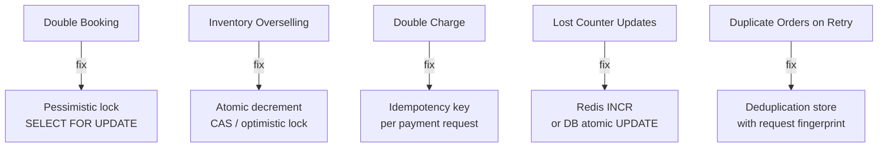

# Concurrency & Race Conditions

When multiple processes read and write the same data at the same time, the last writer wins — and often that's the wrong result.

## Problems in This Section

| Problem | The Pain |
|---------|----------|
| [Double Booking](double-booking) | Two users confirm the same hotel room |
| [Inventory Overselling](race-condition-inventory) | 47 orders for 1 iPhone |
| [Double Charge / Payment Idempotency](double-charge-payment) | Retry causes duplicate payment |
| [Lost Counter Updates](counter-race) | 37,153 views silently lost |
| [Duplicate Orders on Retry](duplicate-orders) | Flaky network creates 2 shipments |
