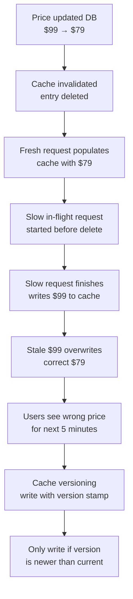
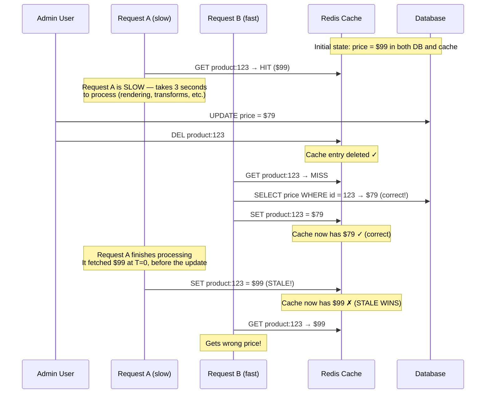

# Cache Invalidation Race: When Stale Beats Fresh

## 🗺️ Quick Overview


*Normal path: update DB → invalidate cache → fresh reads populate correct value. Trigger: slow in-flight request completes after invalidation and writes stale value back. Failure: correct value evicted by a request that started before the update.*

**A product price changes from $99 to $79. Your system updates the database. Your cache invalidation logic fires immediately and deletes the cached entry. A cache miss triggers a fresh DB read — the new price, $79, gets cached. Everything looks correct. But 45 seconds later, a user sees $99. Then another. For the next 5 minutes, half your users see the wrong price. You check the cache. It says $99. The database says $79. A stale value that should have been evicted is sitting confidently in your cache, overwriting the correct value every few minutes. Your cache invalidation didn't just fail — it created the conditions for a stale value to win a race against a fresh one.**

---

## The Problem Class `[Senior]`

Cache invalidation is Phil Karlton's famous "two hard things" in computer science. But the specific failure mode here isn't about knowing *when* to invalidate — you know exactly when: when the data changes. The failure is that your invalidation creates a race condition where a stale value can overwrite a fresh one.

This race is subtle and easy to miss. You delete the cache entry on write. A fresh request populates the cache with the new value. Everything looks correct. Then a *slow request* that started before your delete finishes executing — it computed its result from the old data, and now it writes that stale result back to the cache. The correct value is evicted. The wrong value wins. And it will stay wrong until the next cache miss or TTL expiry.

---

## Why This Happens

### The Race, Step by Step

The classic cache-aside pattern:

```
Read:  Check cache → if miss: read DB → write to cache → return value
Write: Update DB → delete cache entry
```

The race:



### Why This Is Hard to Catch

- Request A's cache write at the end looks completely normal. No error. No conflict. It's a valid SET operation.
- Request B's data is correct and was written to cache first. It gets silently overwritten.
- The problem only occurs when Request A is slow enough to span a cache delete. Under low load, requests are fast and this race window is tiny. Under high load, requests slow down and the window grows.
- Production load tests rarely model slow requests with write contention.

### Cache-Aside vs Write-Through

The cache-aside pattern (application manages cache reads and writes separately) is the most common caching pattern. It's also the one most susceptible to this race because there's no atomic relationship between the DB write and the cache write.

```javascript
// Cache-aside: two separate operations, not atomic
async function getProduct(id) {
  const cached = await redis.get(`product:${id}`);
  if (cached) return JSON.parse(cached);

  const product = await db.query('SELECT * FROM products WHERE id = $1', [id]);
  await redis.setex(`product:${id}`, 300, JSON.stringify(product.rows[0]));
  return product.rows[0];
}

async function updateProductPrice(id, newPrice) {
  await db.query('UPDATE products SET price = $1 WHERE id = $2', [newPrice, id]);
  await redis.del(`product:${id}`); // Delete cache — but race window still exists
}
```

---

## Real-World Impact

- **E-commerce pricing**: Stale prices displayed after price changes. Users add items to cart at the wrong price. Checkout conflict requires support intervention.
- **Inventory display**: Stale "in stock" flag shown after item sells out. Users complete checkout for unavailable items.
- **Permission/access control caches**: Stale permission cache continues granting access after revocation.
- **User session data**: Stale plan/subscription data shown after upgrade or downgrade.
- **Configuration caches**: Stale feature flag or config value used after a change. New deployment partially rolls back a feature.

---

## The Wrong Fix

### Shortening TTL

```javascript
// Before: 5 minute TTL
await redis.setex(`product:${id}`, 300, JSON.stringify(product));

// After: 10 second TTL
await redis.setex(`product:${id}`, 10, JSON.stringify(product));
```

Shorter TTL reduces the window for stale data, but:
1. The race condition still exists — it's just less likely to manifest
2. Short TTLs dramatically increase DB load (cache hit rate drops, more misses, more DB reads)
3. Under high traffic, even a 1-second TTL can have the race condition (request takes > 1 second)

TTL alone is not a solution to the stale-write race.

---

## The Right Solutions

### Solution 1: Cache Versioning — Version Keys Instead of Deleting

Instead of deleting the cache key, encode a version number into the key. When the data changes, increment the version. The old key becomes unreachable. No stale write can target the new version because it doesn't know the new version number.

```javascript
// Versioned cache key: product:123:v5 instead of product:123
async function getProductVersionKey(id) {
  // The "current version" is stored separately and changes on every write
  const version = await redis.get(`product:${id}:version`) || '1';
  return `product:${id}:v${version}`;
}

async function getProduct(id) {
  const key = await getProductVersionKey(id);
  const cached = await redis.get(key);
  if (cached) return JSON.parse(cached);

  const product = await db.query('SELECT * FROM products WHERE id = $1', [id]);

  // Write to the versioned key
  await redis.setex(key, 300, JSON.stringify(product.rows[0]));
  return product.rows[0];
}

async function updateProductPrice(id, newPrice) {
  await db.query('UPDATE products SET price = $1 WHERE id = $2', [newPrice, id]);

  // Increment version — old key becomes orphaned (will TTL out)
  await redis.incr(`product:${id}:version`);
  // No need to delete old key — it's now unreachable via getProductVersionKey
}
```

The stale request (Request A) writes to `product:123:v4`. After the price update, the current version is `v5`. All subsequent reads look for `product:123:v5` — they miss the cache and fetch from DB. The stale `product:123:v4` entry just sits there until its TTL expires, harmlessly.

**Trade-off**: Version pointer itself can be stale or lost (Redis eviction). Mitigate by setting the version key's TTL to longer than the data key's TTL.

### Solution 2: Write-Through Caching — Atomic Update

In write-through, the application updates the cache at write time (not at read time). The cache always has the latest value because you wrote it there explicitly alongside the DB write.

```javascript
async function updateProductPrice(id, newPrice) {
  // Update DB
  const result = await db.query(
    'UPDATE products SET price = $1, updated_at = NOW() WHERE id = $2 RETURNING *',
    [newPrice, id]
  );
  const updatedProduct = result.rows[0];

  // Immediately write new value to cache — no delete-then-repopulate gap
  await redis.setex(
    `product:${id}`,
    300,
    JSON.stringify(updatedProduct)
  );

  return updatedProduct;
}

async function getProduct(id) {
  const cached = await redis.get(`product:${id}`);
  if (cached) return JSON.parse(cached);

  // Cold path: populate from DB
  const product = await db.query('SELECT * FROM products WHERE id = $1', [id]);
  await redis.setex(`product:${id}`, 300, JSON.stringify(product.rows[0]));
  return product.rows[0];
}
```

Write-through eliminates the "delete then re-populate" gap entirely. There's no miss window. The stale-beats-fresh race disappears because the fresh value is in cache before any reads can cause a repopulation.

**Trade-off**: If the cache SET fails after the DB write succeeds, the cache is now stale. Mitigate with retry logic or by treating cache failures as acceptable eventual consistency (the TTL will eventually expire and force a fresh read).

### Solution 3: Conditional Cache Write (Optimistic Locking)

Before writing to cache, check if the value we're about to write is actually newer than what's there. Use Redis `WATCH` + `MULTI` for compare-and-set semantics.

```javascript
async function conditionalCacheSet(key, value, timestamp, ttl) {
  const maxRetries = 3;

  for (let attempt = 0; attempt < maxRetries; attempt++) {
    await redis.watch(key);

    const existing = await redis.get(key);
    let shouldWrite = true;

    if (existing) {
      const existingData = JSON.parse(existing);
      // Only write if our data is newer
      if (existingData.updatedAt >= timestamp) {
        await redis.unwatch();
        shouldWrite = false;
      }
    }

    if (!shouldWrite) return false;

    const multi = redis.multi();
    multi.setex(key, ttl, JSON.stringify({ ...value, updatedAt: timestamp }));

    const results = await multi.exec();
    if (results !== null) return true; // Transaction succeeded
    // results === null means WATCH detected a concurrent modification — retry
  }

  return false; // All retries failed (high contention — acceptable, TTL will correct it)
}

// Use in cache-aside read path
async function getProduct(id) {
  const cached = await redis.get(`product:${id}`);
  if (cached) return JSON.parse(cached);

  const product = await db.query(
    'SELECT *, EXTRACT(EPOCH FROM updated_at) AS updated_ts FROM products WHERE id = $1',
    [id]
  );
  const row = product.rows[0];

  // Only write to cache if no concurrent write has happened
  await conditionalCacheSet(`product:${id}`, row, row.updated_ts, 300);
  return row;
}
```

### Solution 4: TTL-Only (Eventual Consistency, Zero Race Complexity)

Sometimes the right answer is to not actively invalidate at all. Set a TTL that represents an acceptable staleness window, and let the cache naturally expire.

```javascript
async function updateProductPrice(id, newPrice) {
  await db.query('UPDATE products SET price = $1 WHERE id = $2', [newPrice, id]);
  // Don't touch the cache at all. It will expire in TTL seconds.
  // During that window, some users see the old price. Acceptable for many use cases.
}

// TTL choice guide:
// User profile display: 60s is fine
// Product price: 5-30s (balance between freshness and DB load)
// Inventory count: 10s max (overselling is worse than cache staleness)
// Permissions/access control: 0s (never cache, or 1-5s with explicit invalidation)
// Payment status: Never cache
```

This eliminates all race conditions because you never invalidate — you just let things age out. The trade-off is predictable staleness: users might see data that's up to TTL seconds old. For many cases, this is entirely acceptable.

### Solution 5: Event-Versioned Invalidation

Use an event stream (Kafka, Redis Streams) to broadcast invalidation events with the new data version. Cache invalidations only execute if the cache version is older than the event version.

```javascript
// Publisher (on write)
async function updateProductPrice(id, newPrice) {
  const result = await db.query(
    'UPDATE products SET price = $1, version = version + 1 WHERE id = $2 RETURNING version',
    [newPrice, id]
  );
  const newVersion = result.rows[0].version;

  await producer.send({
    topic: 'product-updates',
    messages: [{
      key: `product:${id}`,
      value: JSON.stringify({ id, newVersion, price: newPrice }),
    }],
  });
}

// Subscriber (cache invalidation consumer)
consumer.run({
  eachMessage: async ({ message }) => {
    const { id, newVersion } = JSON.parse(message.value.toString());
    const key = `product:${id}`;

    const cached = await redis.get(key);
    if (cached) {
      const cachedData = JSON.parse(cached);
      if (cachedData.version < newVersion) {
        await redis.del(key);
        // Next read will repopulate with fresh data — stale request
        // that writes back will use the conditionalCacheSet pattern
      }
    }
  },
});
```

---

## Detection

The stale-beats-fresh race is nearly impossible to detect after the fact. By the time a user reports stale data, the cache has usually been refreshed by a newer read. Build proactive detection:

```javascript
// Consistency check: periodically verify cache matches DB
async function cacheConsistencyCheck(productId) {
  const cached = await redis.get(`product:${productId}`);
  if (!cached) return; // No cache entry to check

  const cachedProduct = JSON.parse(cached);
  const dbProduct = await db.query(
    'SELECT id, price, updated_at FROM products WHERE id = $1',
    [productId]
  ).then(r => r.rows[0]);

  if (cachedProduct.price !== dbProduct.price) {
    metrics.increment('cache.stale_detected', { product_id: productId });
    logger.error('Cache inconsistency detected', {
      productId,
      cachedPrice: cachedProduct.price,
      dbPrice: dbProduct.price,
    });

    // Auto-heal: delete stale cache entry
    await redis.del(`product:${productId}`);
  }
}

// Run spot checks every 30 seconds on recently-updated products
setInterval(async () => {
  const recentlyUpdated = await db.query(
    'SELECT id FROM products WHERE updated_at > NOW() - INTERVAL \'5 minutes\''
  );
  await Promise.all(recentlyUpdated.rows.map(r => cacheConsistencyCheck(r.id)));
}, 30000);
```

---

## Prevention Patterns

1. **Default to write-through for data where correctness matters** (prices, inventory, permissions). Reserve cache-aside for read-heavy, write-rarely data (product descriptions, static content).
2. **Include version/timestamp in every cached object**. If you can't check staleness on write, you can at least detect it on read.
3. **Treat the cache as expendable**. Any data in cache should be reconstructible from the DB. Cache inconsistency should be auto-healing (delete entry, force re-population).
4. **Set meaningful TTLs even with active invalidation**. If your invalidation logic fails (network blip, cache write failure), TTL is your safety net.
5. **Load test with slow requests** to find race windows. A request that spans 2+ seconds will trigger races that 100ms requests miss.

---

## Checklist

- [ ] Versioned cache keys or write-through used for all mutable data (prices, inventory, permissions)
- [ ] Cached objects include `updatedAt` or `version` field for staleness detection
- [ ] Cache-aside writes use conditional SET (don't overwrite newer data with older data)
- [ ] TTL set on all cache entries as safety net (even with active invalidation)
- [ ] Consistency spot-checks run periodically for recently-written records
- [ ] Load tests include slow request simulations (3–5 second request duration) to expose race windows
- [ ] Cache failures are logged and monitored — silent cache failures are dangerous

---

## Key Takeaways

The cache invalidation race is a class of bug where your invalidation logic is correct but your cache architecture allows a stale write to race with and overwrite a fresh one. You deleted the cache entry. You re-populated it with fresh data. Then a slow request from before the delete finished executing and silently overwrote your fresh value with the old one.

The fix requires breaking the symmetry between stale and fresh writes. Version your cache keys so stale writes target an old key that nobody will look up. Or use write-through so there's never a miss window for stale requests to fill. Or use conditional writes that reject stale values. Any of these prevents the stale-wins race.

Phil Karlton was right: cache invalidation is hard. Not because knowing when to invalidate is hard — that part is usually clear. It's hard because the interaction between slow requests, concurrent readers, and your invalidation event creates race conditions that only manifest under production load.
