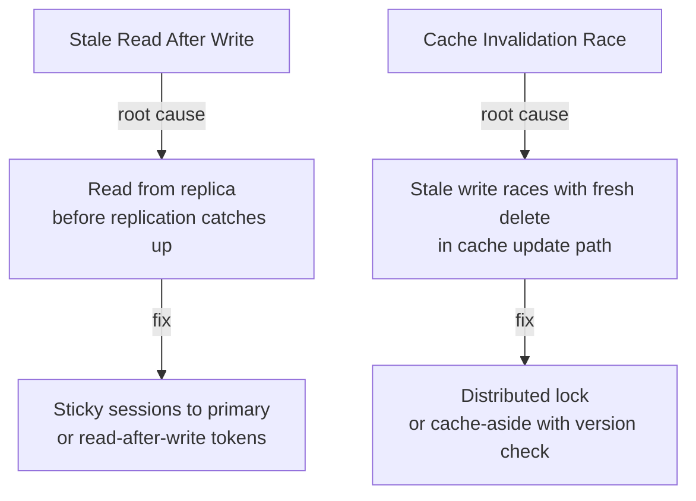

# Consistency & Stale Data

Distributed systems trade consistency for availability and partition tolerance. These are the failure modes that result when that trade-off is not handled carefully.

## Problems in This Section

| Problem | The Pain |
|---------|----------|
| [Stale Read After Write](stale-read-after-write) | User updates profile, still sees old data |
| [Cache Invalidation Race](cache-invalidation-race) | Stale value overwrites fresh value |
