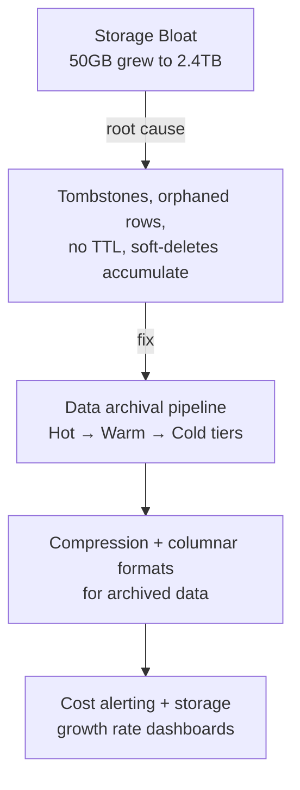

# Cost & Storage Optimization

Storage and compute costs that grow faster than traffic are often a symptom of accumulated technical debt — tombstones, orphaned data, over-provisioned resources.

## Problems in This Section

| Problem | The Pain |
|---------|----------|
| [Storage Bloat](storage-bloat) | 50GB grew to 2.4TB — 70% is garbage |
