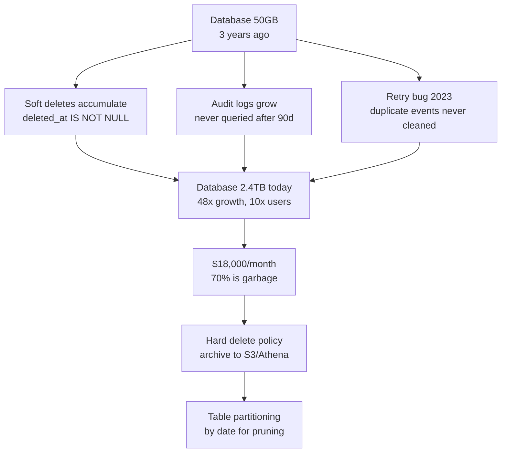
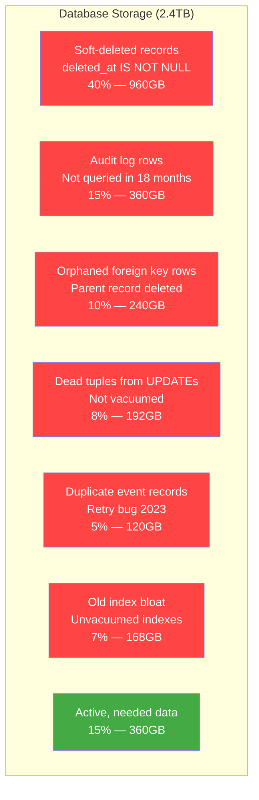

# Storage Bloat: Your Database Is a Landfill

## 🗺️ Quick Overview


*Normal path: data grows with users. Trigger: no cleanup policy for soft deletes, logs, or orphaned records. Failure cascade: storage costs compound while query performance degrades from bloated indexes.*

**Your database was 50GB three years ago. It's 2.4TB today. Your user count grew 10×. Your storage grew 48×. You're paying $18,000/month for database storage on AWS RDS. A junior engineer runs a few queries to understand what's in there: 40% is soft-deleted records with `deleted_at IS NOT NULL` that have been accumulating since 2021. 15% is audit log rows that your compliance team hasn't accessed in 18 months. 10% is orphaned rows pointing to users who no longer exist. 5% is duplicate event records from a retry bug in 2023 that was fixed but never cleaned up. You're paying $18,000/month for a storage layer that's 70% garbage. Your database is a landfill, and nobody wrote the cleanup job.**

---

## The Problem Class `[Senior]`

Storage bloat is the accumulation of dead, stale, or unneeded data in your primary database over time. Unlike most engineering problems, it doesn't have a dramatic failure mode — it just costs more money every month and slowly degrades database performance through bloated indexes and table scans.

The bloat compounds in multiple ways:
1. Data grows faster than your user base (event logs, audit trails, versioning)
2. Data that should be deleted isn't (soft deletes with no hard archival)
3. Data in the wrong storage tier (analytics-only data in your OLTP database)
4. Data structure inefficiencies (wide JSON columns, uncompressed binary, redundant denormalization)

The killer fact: **storage bloat almost always accelerates over time**. The people who decided to use soft deletes in 2021 didn't plan for 2026. The audit log was "temporary" while debugging a production issue. The event stream was added "just in case" someone wanted to query it later. Nobody wrote a cleanup policy. Nobody owns it.

---

## The Anatomy of Storage Bloat



---

## Sources of Bloat

### 1. Soft Deletes Without Hard Archival

The most common source of unchecked growth. Soft deletes (`deleted_at = NOW()` instead of `DELETE`) are legitimate — they preserve data for audit trails, they allow "undo" functionality, they keep foreign key references intact. But they only work if you have a second step: periodically hard-deleting or archiving rows whose `deleted_at` is old enough.

Nobody writes that second step. Or they write it, it runs once, and then it's disabled because it caused a slow query during a deployment and someone set `ENABLED = false` in the cron config.

```sql
-- How much of your table is soft-deleted?
SELECT
  COUNT(*) FILTER (WHERE deleted_at IS NULL) AS active_rows,
  COUNT(*) FILTER (WHERE deleted_at IS NOT NULL) AS deleted_rows,
  COUNT(*) FILTER (WHERE deleted_at IS NOT NULL) * 100.0 / COUNT(*) AS deleted_pct,
  pg_size_pretty(pg_total_relation_size('users')) AS total_size
FROM users;
```

A table with 2M active rows and 18M soft-deleted rows is paying 10× the storage cost for the active data — and all those deleted rows are maintained in every index on the table.

### 2. Dead Tuples from PostgreSQL MVCC

PostgreSQL's MVCC (Multi-Version Concurrency Control) keeps old row versions for transaction isolation. When you UPDATE or DELETE a row, the old version isn't immediately removed — it's marked dead and reclaimed by VACUUM. If VACUUM isn't running frequently enough, dead tuples accumulate.

```sql
-- How many dead tuples exist per table?
SELECT
  relname AS table_name,
  n_live_tup AS live_rows,
  n_dead_tup AS dead_rows,
  ROUND(n_dead_tup * 100.0 / NULLIF(n_live_tup + n_dead_tup, 0), 1) AS dead_pct,
  last_vacuum,
  last_autovacuum,
  pg_size_pretty(pg_total_relation_size(oid)) AS table_size
FROM pg_stat_user_tables
WHERE n_dead_tup > 10000
ORDER BY n_dead_tup DESC;
```

A table with 30% dead tuples is 43% larger than it needs to be. Every sequential scan reads through dead tuples. Every index scan has to skip over them. The table and its indexes are bloated proportionally.

### 3. Audit Logs and Event Streams in Your OLTP Database

Audit logs have different access patterns than your primary data: they're written constantly, queried rarely, never updated, and have a natural time-based retention policy. Despite this, they almost always end up in the same PostgreSQL database as your user records — because it was easy at the time.

The problem: audit log tables grow forever. A high-traffic system generating 10,000 events/minute produces 14.4M rows/day. A year of audit logs = 5.25 billion rows. Your primary database was not designed for this. Your indexes on the audit table are enormous. Every write to the audit table competes with writes to your core tables for I/O, connections, and cache.

### 4. Wide JSONB Columns With Redundant Data

JSONB columns are convenient but wasteful when they store redundant data. Storing the entire user object (name, email, address, preferences) in an `event_metadata` column means that column stores the same user name thousands of times — once per event.

```sql
-- Find tables with large average row sizes (suspect wide JSON columns)
SELECT
  relname,
  pg_size_pretty(pg_total_relation_size(oid)) AS total_size,
  n_live_tup,
  pg_size_pretty(pg_total_relation_size(oid) / NULLIF(n_live_tup, 0)) AS avg_row_size
FROM pg_stat_user_tables
WHERE n_live_tup > 0
ORDER BY pg_total_relation_size(oid) / NULLIF(n_live_tup, 0) DESC;
-- Rows > 1KB average size are candidates for JSONB bloat investigation
```

---

## Real-World Impact

- **Shopify**: Moved audit logs out of the primary database into event streams (Kafka + S3). Reduced primary DB storage by ~40% and improved write latency for core tables.
- **GitHub**: Implemented database archival for old activity data (notifications, events) — moved to archived storage, keeping only last 90 days in primary DB.
- **Airbnb**: Discovered that soft-deleted records from 2015 were taking up 30% of their primary database. Implemented a quarterly archival job that moved records to cold storage.
- **A mid-size SaaS company** (common pattern): Was paying $22,000/month for RDS storage. Implemented partition pruning for audit logs + hard archival for soft deletes. Reduced storage to 420GB in 3 months. Monthly cost dropped to $4,800.

---

## The Wrong Fix

### Just Buy More Storage

RDS storage is cheap relative to compute — but it's not free. More importantly, storage bloat is not just a cost problem. A 2.4TB table with 70% bloat means:
- Sequential scans read 6.6× more data than necessary
- Index maintenance cost is 6.6× higher than it needs to be
- Autovacuum runs longer and more frequently
- Backups take longer and cost more
- Recovery time after a failure is proportional to data size

You're not just overpaying for storage — you're degrading your database performance and resilience. Buying more storage makes the billing problem worse and doesn't fix any of the performance issues.

---

## The Right Solutions

### Solution 1: Hard Archival for Soft-Deleted Records

Build an archival job that runs regularly. Move old soft-deleted rows to an archive table or S3, then hard-delete them from the primary table.

```javascript
const { S3 } = require('@aws-sdk/client-s3');
const { Pool } = require('pg');

const db = new Pool(/* config */);
const s3 = new S3({ region: 'us-east-1' });

async function archiveOldSoftDeletes({
  tableName,
  archiveBucket = 'my-app-archive',
  olderThanDays = 90,
  batchSize = 1000,
}) {
  const cutoffDate = new Date();
  cutoffDate.setDate(cutoffDate.getDate() - olderThanDays);

  let totalArchived = 0;
  let hasMore = true;

  while (hasMore) {
    const client = await db.connect();
    try {
      await client.query('BEGIN');

      // Fetch a batch of rows to archive
      const { rows } = await client.query(
        `SELECT * FROM ${tableName}
         WHERE deleted_at < $1
         LIMIT $2
         FOR UPDATE SKIP LOCKED`,
        [cutoffDate, batchSize]
      );

      if (rows.length === 0) {
        await client.query('ROLLBACK');
        hasMore = false;
        break;
      }

      // Write to S3 as NDJSON (newline-delimited JSON — queryable with Athena)
      const archiveKey = `archives/${tableName}/${new Date().toISOString().slice(0, 10)}/batch-${Date.now()}.ndjson`;
      await s3.putObject({
        Bucket: archiveBucket,
        Key: archiveKey,
        Body: rows.map(r => JSON.stringify(r)).join('\n'),
        ContentType: 'application/x-ndjson',
      });

      // Hard delete the archived rows
      const ids = rows.map(r => r.id);
      await client.query(
        `DELETE FROM ${tableName} WHERE id = ANY($1::int[])`,
        [ids]
      );

      await client.query('COMMIT');
      totalArchived += rows.length;
      console.log(`Archived ${rows.length} rows from ${tableName} → s3://${archiveBucket}/${archiveKey}`);
    } catch (err) {
      await client.query('ROLLBACK');
      throw err;
    } finally {
      client.release();
    }

    // Small delay between batches to avoid overwhelming DB
    await new Promise(resolve => setTimeout(resolve, 100));
  }

  console.log(`Total archived: ${totalArchived} rows from ${tableName}`);
  return totalArchived;
}

// Run via cron job or scheduled Lambda
// archiveOldSoftDeletes({ tableName: 'users', olderThanDays: 90 });
// archiveOldSoftDeletes({ tableName: 'orders', olderThanDays: 180 });
```

### Solution 2: Table Partitioning for Time-Series Data

For append-only tables with time-based access patterns (audit logs, events, analytics), use PostgreSQL declarative partitioning. Old partitions can be detached and dropped in milliseconds instead of running millions of DELETE operations.

```sql
-- Create partitioned audit log table
CREATE TABLE audit_events (
  id BIGSERIAL,
  user_id INT,
  action TEXT,
  resource_type TEXT,
  resource_id INT,
  metadata JSONB,
  created_at TIMESTAMPTZ NOT NULL DEFAULT NOW()
) PARTITION BY RANGE (created_at);

-- Create monthly partitions
CREATE TABLE audit_events_2026_01 PARTITION OF audit_events
  FOR VALUES FROM ('2026-01-01') TO ('2026-02-01');

CREATE TABLE audit_events_2026_02 PARTITION OF audit_events
  FOR VALUES FROM ('2026-02-01') TO ('2026-03-01');

-- etc.

-- Automate partition creation (run monthly)
-- See: pg_partman extension for automated partition management
```

```javascript
// Partition rotation job: drop partitions older than retention window
async function rotatePastPartitions(tableName, retentionMonths = 3) {
  const cutoff = new Date();
  cutoff.setMonth(cutoff.getMonth() - retentionMonths);

  const partitionSuffix = `${cutoff.getFullYear()}_${String(cutoff.getMonth() + 1).padStart(2, '0')}`;
  const partitionName = `${tableName}_${partitionSuffix}`;

  // Detach first (instant) — partition is no longer queryable but data still exists
  await db.query(`ALTER TABLE ${tableName} DETACH PARTITION ${partitionName}`);

  // Option 1: Drop immediately (data gone)
  await db.query(`DROP TABLE ${partitionName}`);

  // Option 2: Archive to S3, then drop
  // await archivePartitionToS3(partitionName, archiveBucket);
  // await db.query(`DROP TABLE ${partitionName}`);

  console.log(`Dropped partition ${partitionName} from ${tableName}`);
}
```

**Why this is far better than DELETE**: Dropping a partition removes the entire file. It takes milliseconds regardless of how many rows are in the partition. Running `DELETE FROM audit_events WHERE created_at < '2025-01-01'` on 500M rows takes hours and generates massive WAL traffic.

### Solution 3: Move Audit Logs to S3 + Athena

Audit logs belong in cold storage — queried rarely, retained for compliance, never updated. Keep only the last 30–90 days in your primary database. Move everything older to S3, queryable via Athena.

```javascript
// Write new audit events to both DB (recent) and S3 (permanent archive)
async function writeAuditEvent(event) {
  // Write to primary DB (for last 30 days of fast querying)
  await db.query(
    'INSERT INTO audit_events (user_id, action, resource_type, resource_id, metadata, created_at) VALUES ($1,$2,$3,$4,$5,$6)',
    [event.userId, event.action, event.resourceType, event.resourceId, event.metadata, new Date()]
  );

  // Also write to S3 (permanent archive, queryable via Athena)
  await kinesisFirehose.putRecord({
    DeliveryStreamName: 'audit-events-firehose',
    Record: {
      Data: Buffer.from(JSON.stringify(event) + '\n'),
    },
  });
  // Kinesis Firehose batches and writes to S3 with partitioning: s3://bucket/year=2026/month=03/day=20/...
}

// For compliance queries on old data: use Athena
// CREATE EXTERNAL TABLE audit_events_archive (
//   user_id INT, action STRING, resource_type STRING, ...
// )
// PARTITIONED BY (year STRING, month STRING, day STRING)
// STORED AS JSON
// LOCATION 's3://my-app-archive/audit-events/';
```

### Solution 4: Find and Fix Orphaned Records

Orphaned records are rows that reference a parent that no longer exists. They're invisible — nobody queries for them — but they take up space and degrade index performance.

```sql
-- Find orphaned rows (orders whose users no longer exist)
SELECT COUNT(*) AS orphaned_orders
FROM orders o
LEFT JOIN users u ON o.user_id = u.id
WHERE u.id IS NULL;

-- Find all tables with orphaned foreign key references
-- (Run this on any table with a user_id column)
SELECT 'orders' AS table_name, COUNT(*) AS orphans
FROM orders WHERE user_id NOT IN (SELECT id FROM users)
UNION ALL
SELECT 'subscriptions', COUNT(*)
FROM subscriptions WHERE user_id NOT IN (SELECT id FROM users)
UNION ALL
SELECT 'payments', COUNT(*)
FROM payments WHERE user_id NOT IN (SELECT id FROM users);

-- Prevent future orphans with proper foreign keys + CASCADE
ALTER TABLE orders
  ADD CONSTRAINT fk_orders_user
  FOREIGN KEY (user_id)
  REFERENCES users(id)
  ON DELETE CASCADE;  -- or ON DELETE SET NULL depending on business logic
```

### Solution 5: Run VACUUM Aggressively on High-Update Tables

PostgreSQL's autovacuum may not keep up with high-UPDATE workloads. Tune it or run manual VACUUM on tables with high dead tuple counts.

```sql
-- Check vacuum health
SELECT
  relname,
  n_dead_tup,
  n_live_tup,
  ROUND(n_dead_tup * 100.0 / NULLIF(n_live_tup + n_dead_tup, 0), 1) AS dead_pct,
  last_autovacuum,
  autovacuum_count
FROM pg_stat_user_tables
WHERE n_dead_tup > 0
ORDER BY n_dead_tup DESC;

-- Manual VACUUM ANALYZE (doesn't lock table, can run in production)
VACUUM ANALYZE orders;

-- For severe bloat: VACUUM FULL (locks table, reclaims space fully)
-- Run during maintenance window
VACUUM FULL orders;  -- WARNING: full table lock for duration

-- Tune autovacuum for high-churn tables
ALTER TABLE orders SET (
  autovacuum_vacuum_scale_factor = 0.01,  -- vacuum when 1% of rows are dead (vs 20% default)
  autovacuum_analyze_scale_factor = 0.005,
  autovacuum_vacuum_cost_delay = 2        -- ms between cost limit resets (lower = more aggressive)
);
```

### Solution 6: Compress JSONB Columns

If you must store JSON in the database, avoid storing redundant data. Store only IDs and derive full objects at read time.

```sql
-- Before: 2KB per row because we store the entire user object
-- event_metadata: {"user": {"id": 123, "name": "Alice", "email": "alice@example.com", "plan": "pro", ...}}

-- After: 50 bytes per row — store only what changes
-- event_metadata: {"plan_before": "free", "plan_after": "pro"}
-- Join to users table at query time if full user object needed

-- Check TOAST compression on a column
SELECT
  attname,
  attstorage  -- 'x' = external, 'e' = extended (compressed), 'm' = main, 'p' = plain
FROM pg_attribute
WHERE attrelid = 'audit_events'::regclass
  AND attname = 'metadata';

-- Enable compression on a JSONB column
ALTER TABLE audit_events ALTER COLUMN metadata SET STORAGE extended;
```

---

## Full Storage Audit Queries

Run these to understand your storage breakdown:

```sql
-- Top 20 tables by size
SELECT
  relname AS table_name,
  pg_size_pretty(pg_total_relation_size(oid)) AS total_size,
  pg_size_pretty(pg_relation_size(oid)) AS data_size,
  pg_size_pretty(pg_indexes_size(oid)) AS indexes_size,
  n_live_tup AS live_rows,
  n_dead_tup AS dead_rows
FROM pg_stat_user_tables
ORDER BY pg_total_relation_size(oid) DESC
LIMIT 20;

-- Soft-delete bloat per table (assumes deleted_at column)
-- Replace with actual soft-delete column names
DO $$
DECLARE
  tbl text;
  result record;
BEGIN
  FOR tbl IN
    SELECT table_name FROM information_schema.columns
    WHERE column_name = 'deleted_at' AND table_schema = 'public'
  LOOP
    EXECUTE format(
      'SELECT %L AS table_name,
              COUNT(*) FILTER (WHERE deleted_at IS NULL) AS active,
              COUNT(*) FILTER (WHERE deleted_at IS NOT NULL) AS deleted
       FROM %I',
      tbl, tbl
    ) INTO result;
    RAISE NOTICE 'Table %: % active, % deleted', result.table_name, result.active, result.deleted;
  END LOOP;
END $$;

-- Index bloat
SELECT
  indexname,
  pg_size_pretty(pg_relation_size(indexrelid)) AS index_size,
  idx_scan AS times_used
FROM pg_stat_user_indexes
ORDER BY pg_relation_size(indexrelid) DESC;
```

---

## Prevention Patterns

1. **Define a data retention policy for every table at creation time.** "This audit log table retains 90 days in primary DB, forever in S3." Write it in the migration comment.
2. **Every soft-delete must have a corresponding hard-archive job.** If you add `deleted_at`, you must also add a scheduled job that archives rows where `deleted_at < NOW() - INTERVAL '90 days'`.
3. **Separate append-only tables from mutable tables.** Event logs, audit trails, analytics events — these should be partitioned from day one and often shouldn't be in your OLTP database at all.
4. **Monitor storage growth rate per table**, not just total storage. A table doubling every 6 months is a bloat problem in progress.
5. **Run quarterly "storage archaeology" exercises.** Query your largest tables, understand what's in them, identify what's actively needed vs what's accumulating.

---

## Checklist

- [ ] Top 20 largest tables identified and storage breakdown understood
- [ ] Soft-deleted records audited — percentage of deleted_at IS NOT NULL measured per table
- [ ] Archival job exists and runs for every table with soft deletes
- [ ] Audit log and event tables use time-based partitioning
- [ ] Partitions older than retention window are regularly dropped
- [ ] Dead tuple percentage monitored per table; autovacuum tuned for high-churn tables
- [ ] Orphaned foreign key records identified and cleaned up
- [ ] Storage growth rate monitored per table (not just total)
- [ ] Data retention policy documented for every significant table

---

## Key Takeaways

Storage bloat is an entropy problem. Left unmanaged, every database accumulates garbage: deleted records that were never deleted, logs that outlived their usefulness, orphaned references, dead tuples that PostgreSQL hasn't cleaned up. The accumulation is gradual and invisible until your storage bill arrives.

The fix requires treating data lifecycle as a first-class engineering concern — not an afterthought. Every table that grows indefinitely needs either a retention policy (delete/archive after N days) or a deliberate decision that it should grow indefinitely (and infrastructure provisioned accordingly).

The expensive part isn't the storage itself. It's the compounding performance degradation: bloated tables have bloated indexes, bloated indexes slow down every write, and every sequential scan now reads 48× more data than it needs to. Your $18,000/month storage bill is the visible symptom. The invisible cost is the performance degradation hitting every user, every request, every day.
