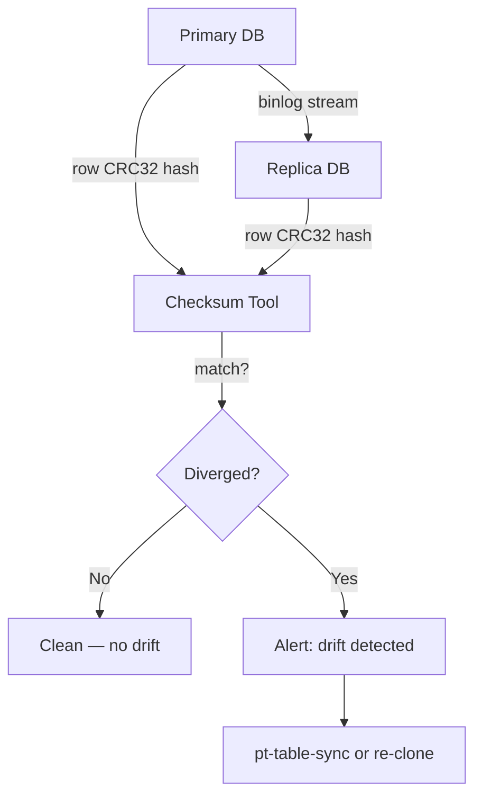
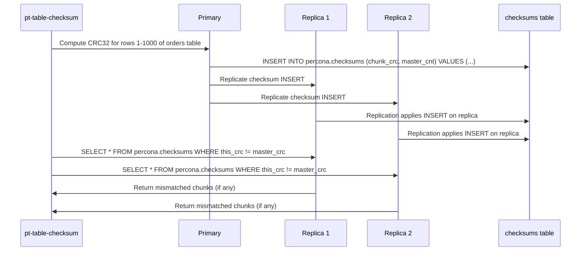

# Data Drift — When Your Replica Silently Diverges from Primary

## Level 1 — Surface (2-minute read)

**One-line definition**: Data drift occurs when a read replica contains different values for the same rows than the primary database, with no error thrown and no alarm raised — the system appears healthy while serving wrong data.

**When you need to worry about this**: You're running read replicas for analytics or read scaling and have had a replica running for more than 30 days, experienced any crashes, or applied schema changes without careful coordination. At 10M+ rows, even 0.001% drift means 100 wrong rows returned to users.

**Core concepts**:
- Replication is asynchronous by default — the replica applies changes *after* they commit on primary
- A crash, skipped event, or DDL timing issue leaves the replica in a state that diverges permanently
- MySQL and PostgreSQL have no built-in continuous drift detection — you must add it yourself
- Drift is cumulative: a missed DELETE compounds over time as subsequent UPDATEs fail to match the target row
- Detection requires computing a deterministic hash (CRC32, SHA-256) over the same row set on both sides

**Quick reference diagram**:



**Use this when / don't use this when**:

| Scenario | Recommendation |
|----------|---------------|
| Analytics reads from replica | Run daily checksums, alert on any mismatch |
| Replica used for DR failover | Run checksums every 4 hours; drift means failover serves wrong data |
| Single primary, no replicas | Not applicable — no drift possible |
| Multi-master setup (Galera, CockroachDB) | Built-in quorum prevents most drift; still run periodic checks |
| Postgres physical streaming replication | Low drift risk; logical replication has higher risk |

---

## Level 2 — Deep Dive

### Problem Statement

You have a MySQL primary with 50 read replicas serving 200,000 reads/second. The replicas are used for analytics dashboards and user-facing reads where slight staleness is acceptable. Your revenue reporting team queries a replica for daily totals.

One morning, the revenue dashboard shows $2.3M for yesterday. The primary shows $2.7M. The replica is returning stale, diverged data from a replication event that was silently skipped 11 days ago during a replica restart. No error was ever logged. The replica's `Seconds_Behind_Master` shows 0 — it believes it is fully caught up.

This is data drift: the replica's row values differ from the primary's, the replica does not know it, and your monitoring did not catch it.

**Scale at which this matters**:
- Under 1M rows: manual spot-checks are viable
- 1M–100M rows: you need automated tooling; manual checks take too long
- 100M+ rows: checksums take hours; you need chunked, rate-limited comparison that runs continuously

---

### What Data Drift Is

Data drift (also called replica divergence) is the condition where the replica's stored data does not match the primary's data for the same logical rows, even though the replica appears to be in sync based on replication lag metrics.

The key characteristic is **silence**: no error is raised, no flag is set, `SHOW SLAVE STATUS` reports `Seconds_Behind_Master: 0`, and application queries return results — just wrong results.

This differs from **replication lag**, which is a timing issue where the replica is temporarily behind but will catch up. Drift is a permanent state: the replica will never self-correct without intervention because it does not know it is wrong.

---

### Trigger Conditions

#### 1. Crash During Log Apply

The most common cause. MySQL's replication uses a relay log: the replica's SQL thread reads events from the relay log and applies them to its storage engine. If the replica crashes (OOM kill, kernel panic, power loss) between the moment an event is marked as read from the relay log and the moment it is committed to InnoDB, that event is skipped on replay.

MySQL 5.6 introduced crash-safe replication with `relay_log_recovery=ON` and `relay_log_info_repository=TABLE`, which stores relay log position in an InnoDB table that survives crashes. Without these settings enabled, every replica crash carries a risk of skipped events.

```sql
-- Check if crash-safe replication is enabled
SHOW VARIABLES LIKE 'relay_log_recovery';
SHOW VARIABLES LIKE 'relay_log_info_repository';

-- Should both return:
-- relay_log_recovery: ON
-- relay_log_info_repository: TABLE
```

Even with crash-safe replication enabled, bugs in the storage engine or relay log recovery path can cause misapplication. This has occurred in multiple MySQL minor versions.

#### 2. Skipped Replication Events

MySQL's `slave_skip_errors` configuration or manual `SET GLOBAL SQL_SLAVE_SKIP_COUNTER` is used to skip over a replication error. This is a common "quick fix" when a constraint violation or duplicate key error stops replication. The correct fix is to resolve the underlying data inconsistency, but under operational pressure, engineers often skip the event.

One skipped event means one row that was never inserted, updated, or deleted on the replica. Every subsequent operation on that row will either silently operate on wrong data (if the row still exists but has the wrong values) or fail (if the row was supposed to be deleted and a later INSERT violates a unique constraint — though this would surface as an error).

```sql
-- Never do this without understanding what you are skipping
SET GLOBAL SQL_SLAVE_SKIP_COUNTER = 1;
START SLAVE;
```

This command skips the next replication event. If that event is a DELETE that removes a row before a re-INSERT with the same primary key, the subsequent INSERT will fail with a duplicate key error, stopping replication again. The "fix" creates a cascade.

#### 3. Clock Skew and Out-of-Order Event Apply

MySQL row-based replication (RBR) is deterministic — it does not rely on timestamps. Statement-based replication (SBR) can produce drift when statements use `NOW()`, `RAND()`, `UUID()`, or other non-deterministic functions. The primary evaluates these at execution time; the replica evaluates them at its own execution time, potentially with a different clock or different random seed.

This is why RBR is recommended for production systems. However, SBR is still default in some older MySQL configurations.

```sql
-- Check replication format
SHOW VARIABLES LIKE 'binlog_format';

-- For new deployments, use ROW
SET GLOBAL binlog_format = 'ROW';
```

PostgreSQL logical replication also has clock-dependent issues when using `CURRENT_TIMESTAMP` in triggers or default values that fire differently on publisher vs subscriber.

#### 4. DDL Statements Applied at Wrong Time

Schema changes are the most dangerous source of drift. In MySQL, DDL statements (ALTER TABLE, DROP TABLE, TRUNCATE) are not transactional in the traditional sense. When you run `ALTER TABLE orders ADD COLUMN discount DECIMAL(10,2) DEFAULT 0`, the binlog records:
1. The moment the DDL started on primary
2. The moment it completed on primary

On the replica, the DDL is applied when the replica's SQL thread reaches that position in the binlog. If the DDL involves a table rebuild (which MySQL historically required for most ALTERs), the replica blocks all reads to that table until the rebuild completes. If the replica's disk is slower than the primary's, the replica may appear to lag, but the real risk is DDL applied at a different schema version than expected.

Percona's pt-online-schema-change and MySQL 8.0's instant ADD COLUMN reduce this risk but do not eliminate it entirely. When the schema and data diverge (e.g., a column added on primary but not yet on replica while writes are happening), the row format in the binlog can be misapplied.

#### 5. GTID Gaps

MySQL 5.6+ supports Global Transaction Identifiers (GTIDs), which assign a unique ID to every committed transaction. GTID replication allows the replica to detect gaps in the transaction sequence.

However, errant transactions — transactions that were committed on the replica directly (e.g., a developer ran an ad-hoc UPDATE on a replica for debugging) — create GTIDs that exist on the replica but not on the primary. These errant transactions can permanently diverge the replica and are invisible to GTID consistency checks unless you specifically check for them.

```sql
-- Check for errant transactions
-- On the replica:
SHOW SLAVE STATUS\G
-- Look at: Executed_Gtid_Set vs Retrieved_Gtid_Set

-- Compare with primary:
-- On primary:
SHOW MASTER STATUS\G
-- Look at: Executed_Gtid_Set

-- Any GTID in replica's Executed_Gtid_Set but NOT in primary's is an errant transaction
```

---

### Detection: How to Find Drift

#### Percona pt-table-checksum

The industry-standard tool for MySQL replica drift detection. It connects to the primary and computes a CRC32 checksum over each chunk of rows (default: 1000 rows per chunk), then replicates a specially crafted query to each replica that computes the same checksum on the same rows, and stores the comparison results in a `percona.checksums` table.

**How it works**:



The clever design: the checksums table is replicated. So the `master_crc` column on the replica contains exactly what the primary computed, while the `this_crc` column is filled in by a trigger or follow-up query on the replica. Any mismatch means drift.

**Basic usage**:

```bash
# Run checksum on all databases, all tables
pt-table-checksum \
  --user=dba_user \
  --password=secret \
  --host=primary-db.internal \
  --replicate=percona.checksums \
  --chunk-size=1000 \
  --max-lag=0.5 \
  --max-load="Threads_running:50" \
  h=primary-db.internal

# View results — show only tables with drift
pt-table-checksum \
  --user=dba_user \
  --password=secret \
  --host=primary-db.internal \
  --replicate-check-only \
  h=primary-db.internal
```

**Rate limiting is critical**: On a 1TB database, an unconstrained checksum run can consume 80% of your IOPS budget. Always set `--max-lag` (pause if replica lag exceeds N seconds) and `--max-load` (pause if server load exceeds threshold).

**Performance characteristics**:
- 1TB database at 50MB/s I/O: 2–4 hours for a full checksum run
- CPU overhead on primary: 5–15% (CRC32 computation is CPU-bound)
- Replication overhead: minimal — the checksum rows are small
- Recommended chunk size: 1,000–5,000 rows depending on row width

#### Dual-Read Verification

An application-level technique: for critical operations, read the same data from both the primary and a replica immediately after a write, and compare. If they differ, the replica is lagged or drifted.

```python
def verify_critical_write(user_id: int, expected_balance: Decimal):
    """
    After writing to primary, verify replica has consistent data.
    Used for financial transactions where drift is unacceptable.
    """
    # Write to primary
    primary_conn.execute(
        "UPDATE accounts SET balance = %s WHERE user_id = %s",
        (expected_balance, user_id)
    )
    primary_conn.commit()

    # Read back from primary (source of truth)
    primary_balance = primary_conn.execute(
        "SELECT balance FROM accounts WHERE user_id = %s",
        (user_id,)
    ).fetchone()[0]

    # Read from replica (may be behind)
    replica_balance = replica_conn.execute(
        "SELECT balance FROM accounts WHERE user_id = %s",
        (user_id,)
    ).fetchone()[0]

    if primary_balance != replica_balance:
        # This could be lag (transient) or drift (permanent)
        # Log with context for investigation
        logger.warning(
            "replica_divergence_detected",
            user_id=user_id,
            primary_balance=str(primary_balance),
            replica_balance=str(replica_balance),
            replica_host=replica_conn.host,
        )
        # Route this user's reads to primary until replica catches up
        return "PRIMARY_ONLY"

    return "REPLICA_OK"
```

This technique is expensive (doubles reads) but catches drift immediately. Use it for critical paths (payment confirmation, account balance display) rather than all reads.

#### Hash-Based Row Comparison

For PostgreSQL or any database where pt-table-checksum is not available, a custom hash comparison job can be built:

```sql
-- PostgreSQL: compute MD5 hash of all rows in a table (chunked)
-- Run this on both primary and replica and compare outputs

SELECT
    floor(id / 1000) AS chunk_id,
    count(*) AS row_count,
    md5(string_agg(
        concat_ws('|', id::text, user_id::text, amount::text, status, created_at::text)
        ORDER BY id
    )) AS chunk_hash
FROM orders
WHERE id BETWEEN :start_id AND :end_id
GROUP BY chunk_id
ORDER BY chunk_id;
```

Run this query on both primary and replica for the same `start_id`/`end_id` range, then compare the `chunk_hash` column. Any chunk where the hash differs contains drifted rows.

For PostgreSQL physical streaming replication, this level of check is rarely needed — the WAL-based streaming replication is byte-for-byte identical to the primary. Drift in PostgreSQL is primarily a concern with logical replication.

---

### Impact of Undetected Drift

#### Analytics Show Wrong Numbers

The most common discovery path: a data analyst notices that a metric from the reporting database (replica) does not match the number from the application database (primary). Revenue, user counts, order totals — all can be wrong.

Because replicas are often used for reporting to avoid load on the primary, and because reporting queries are complex and slow, the analyst may believe their query is wrong rather than the data.

**Quantified impact**: At 0.01% drift on a 100M row orders table, 10,000 orders have wrong values. If average order value is $50, total drift in revenue reporting could be ±$500,000 — enough to cause earnings restatements for public companies.

#### User-Facing Reads Return Wrong Data

If read replicas serve user-facing API requests (a common pattern for read scaling), drifted replicas serve wrong data directly to users. A user who just updated their profile sees stale data. A user who just made a payment sees the wrong balance.

The "read-your-writes" consistency guarantee is broken. Users will refresh, see different data, and file support tickets.

#### Audit Trail Breaks

For compliance use cases (SOX, HIPAA, PCI-DSS), the replica may serve as the audit data source. If the replica has drifted from the primary, the audit trail is incorrect. Financial audits, access logs, and change history are all suspect.

#### DR Failover Serves Wrong Data

If the replica is intended as a disaster recovery standby, and a failover occurs when the replica has drifted, the system that becomes the new primary contains incorrect data. All subsequent writes are based on a wrong starting state. Recovery requires a full re-clone from backup — typically hours of downtime.

---

### Mitigation Strategy

#### 1. Automated Daily Checksums with Alerting

```bash
#!/bin/bash
# /etc/cron.d/replica-checksum — runs at 2 AM daily
# Run pt-table-checksum and alert on drift

DRIFT_COUNT=$(pt-table-checksum \
  --user="${DB_USER}" \
  --password="${DB_PASS}" \
  --host="${PRIMARY_HOST}" \
  --replicate=percona.checksums \
  --chunk-size=2000 \
  --max-lag=1.0 \
  --max-load="Threads_running:30" \
  --quiet \
  h="${PRIMARY_HOST}" 2>&1 | grep "Differences" | awk '{print $2}')

if [ "${DRIFT_COUNT}" -gt "0" ]; then
  # Send PagerDuty alert
  curl -X POST https://events.pagerduty.com/v2/enqueue \
    -H 'Content-Type: application/json' \
    -d "{
      \"routing_key\": \"${PAGERDUTY_KEY}\",
      \"event_action\": \"trigger\",
      \"payload\": {
        \"summary\": \"Replica drift detected: ${DRIFT_COUNT} chunks differ\",
        \"severity\": \"critical\",
        \"source\": \"$(hostname)\"
      }
    }"
fi
```

**Key thresholds**:
- 0 drifted chunks: healthy, no action
- 1–10 drifted chunks: investigate, schedule repair within 24 hours
- 10+ drifted chunks: immediate repair, route reads to primary
- Entire tables diverged: re-clone the replica

#### 2. Repair with pt-table-sync

After drift is detected, `pt-table-sync` can repair the replica by replaying the correct row values from the primary:

```bash
# Repair specific table on a specific replica
pt-table-sync \
  --user="${DB_USER}" \
  --password="${DB_PASS}" \
  --replicate=percona.checksums \
  --sync-to-master \
  h=replica1.internal

# Dry run first — always verify what will change
pt-table-sync \
  --user="${DB_USER}" \
  --password="${DB_PASS}" \
  --replicate=percona.checksums \
  --sync-to-master \
  --print \
  h=replica1.internal
```

pt-table-sync does not stop replication; it applies correction statements that flow through the binlog to fix the replica. For large-scale drift (millions of rows), a full re-clone is faster.

#### 3. Re-Clone for Severe Drift

When drift is widespread, the safest option is a fresh clone:

```bash
# MySQL: clone using xtrabackup (hot backup, no downtime on primary)
xtrabackup --backup --target-dir=/tmp/backup \
  --user="${DB_USER}" --password="${DB_PASS}" \
  --host="${PRIMARY_HOST}"

# Prepare the backup
xtrabackup --prepare --target-dir=/tmp/backup

# Restore to replica (replica must be stopped)
systemctl stop mysql
rsync -av /tmp/backup/ /var/lib/mysql/
chown -R mysql:mysql /var/lib/mysql/
systemctl start mysql

# Re-establish replication from the GTID position recorded in backup
mysql -e "CHANGE MASTER TO MASTER_HOST='${PRIMARY_HOST}', \
  MASTER_AUTO_POSITION=1; START SLAVE;"
```

A fresh clone guarantees zero drift from the moment of clone. The clone records the primary's GTID position, and the replica resumes replication from exactly that point.

#### 4. Enable Crash-Safe Replication (Preventive)

```sql
-- MySQL configuration (my.cnf)
-- These settings prevent most crash-induced drift

relay_log_recovery = ON
relay_log_info_repository = TABLE
master_info_repository = TABLE
sync_relay_log = 1
sync_relay_log_info = 1

-- Also enable GTID for errant transaction detection
gtid_mode = ON
enforce_gtid_consistency = ON
```

These settings ensure that after any crash, the replica recovers to the last committed event rather than to an ambiguous position in the relay log.

#### 5. Route Reads to Primary for Critical Paths

For user-facing features where consistency is non-negotiable, always read from the primary:

```python
class DatabaseRouter:
    ALWAYS_PRIMARY = {
        'accounts.balance',
        'payments.status',
        'orders.payment_status',
        'users.subscription_tier',
    }

    def get_connection(self, table: str, operation: str) -> Connection:
        if operation == 'write':
            return self.primary_conn
        if table in self.ALWAYS_PRIMARY:
            return self.primary_conn
        # Non-critical reads can use replica
        return self.replica_conn
```

This conservative routing ensures that financial and subscription data always comes from the source of truth, even if drift is present.

---

### Real-World Case: GitHub MySQL Replication Drift (2018)

GitHub operates MySQL clusters at massive scale — hundreds of servers, trillions of rows. In their 2018 high-availability post-mortem, the engineering team described discovering that several replicas had drifted from their primaries over the course of weeks.

The drift was discovered not through automated checksums (which they did not have running at the time) but through an anomaly in a business metric: a product usage dashboard showed a count that the analytics team knew was implausible based on other signals.

**Root cause**: A series of DDL statements applied to a heavily loaded replica had caused the replica's SQL thread to fall behind and skip events during a restart cycle. The replica reported `Seconds_Behind_Master: 0` because it believed it had consumed all relay log events — it did not know events had been skipped.

**Response**:
1. Identified the affected replicas through manual row-count comparisons
2. Took the drifted replicas out of the read pool
3. Re-cloned all drifted replicas from a known-good snapshot
4. Deployed pt-table-checksum with daily automated runs across all replica clusters
5. Added alerting that fires if checksum runs do not complete successfully (monitoring the monitor)

**Lesson**: The absence of a checksum failure is not proof of consistency — it means the checksum ran and found no differences, or the checksum did not run at all. You must verify that the tool executed.

**Key numbers from GitHub's scale**:
- Checksum run duration: 6–8 hours for their largest tables (hundreds of billions of rows)
- Drift discovered: < 0.005% of rows, but affecting 2 business-critical tables
- Time to detect: 11 days (time between DDL event and anomaly discovery)
- Re-clone time: 45 minutes per replica using xtrabackup from a streaming source

---

### Common Mistakes

#### Mistake 1: Trusting `Seconds_Behind_Master: 0`

**Root cause**: Engineers assume that a replica showing zero lag is in sync with the primary. This metric measures how far behind the replica is in *applying* the relay log. If events were skipped, the relay log is "caught up" but the data is wrong.

**Fix**: Zero lag means the replica is current with what it knows about. It says nothing about events it has lost. Only a checksum comparison tells you if the data matches.

#### Mistake 2: Skipping Replication Errors Under Pressure

**Root cause**: Replication stops on a constraint violation during an incident. The fastest fix is `SET GLOBAL SQL_SLAVE_SKIP_COUNTER = 1`. Engineers do this to restore service.

**Fix**: Never skip events without understanding what the skipped event was. Investigate why the constraint violation occurred — often it is caused by a previous drift event. Skipping compounds the problem. If you must skip to restore service, immediately schedule a full checksum run and flag the replica as potentially drifted.

#### Mistake 3: Not Running Checksums After Schema Changes

**Root cause**: Schema migrations are viewed as operational events, not data integrity risks. Engineers run the DDL, verify the schema is correct, and move on.

**Fix**: Every DDL migration should be followed by a targeted checksum of the affected table across all replicas within 24 hours. DDL misapplication is the second most common source of drift after crashes.

#### Mistake 4: Not Monitoring the Monitoring

**Root cause**: The checksum job is set up and assumed to run. Cron jobs fail silently. The DBA team sees "no alerts" and assumes "no drift."

**Fix**: Emit a metric (`replica_checksum_last_success_timestamp`) that is updated every time a checksum run completes successfully. Alert if this timestamp is older than 36 hours. The absence of a drift alert only means something if you know the checksum actually ran.

#### Mistake 5: Re-cloning with a Drifted Source

**Root cause**: When a replica is drifted, engineers sometimes clone a new replica from the drifted replica (to avoid load on primary). This creates a replica tree where all children are drifted.

**Fix**: Always clone from the primary or from a replica that has passed a checksum verification within the last 24 hours. Never clone from a replica that has been flagged as potentially drifted.

---

### Production Checklist

```
Pre-production:
[ ] relay_log_recovery=ON configured on all replicas
[ ] relay_log_info_repository=TABLE configured
[ ] GTID mode enabled and enforced
[ ] Binlog format set to ROW (not STATEMENT or MIXED)

Operational:
[ ] pt-table-checksum scheduled daily on all production replica sets
[ ] Alert configured for checksum failure AND checksum job failure
[ ] Runbook exists for: detecting drift, repairing with pt-table-sync, re-cloning
[ ] Read routing rules identify which paths must use primary (financial, auth)
[ ] Post-migration checksum procedure documented and followed

Monitoring:
[ ] replica_checksum_last_success metric emitted
[ ] Alert fires if checksum not run in 36+ hours
[ ] Drifted replica count metric tracked over time
[ ] Replica removed from read pool automatically on drift detection
```

---

### Key Numbers

| Metric | Value |
|--------|-------|
| Typical drift rate (well-configured cluster) | < 0.01% of rows |
| Typical drift rate (after crash without crash-safe replication) | 0.01–1% of rows |
| pt-table-checksum throughput | ~500 MB/min on SSD, ~200 MB/min on spinning disk |
| Time to checksum 1 TB database | 2–4 hours (SSD), 5–8 hours (spinning disk) |
| Time to re-clone 1 TB replica (xtrabackup) | 30–90 minutes depending on network |
| Lag before drift typically discovered without checksums | 7–30 days |
| pt-table-sync repair rate (small drift) | ~10k rows/minute |
| GTID-based errant transaction detection | Immediate (visible in SHOW SLAVE STATUS) |

---

### Key Takeaways

- Data drift is silent by design — the replica does not know it is wrong, and `Seconds_Behind_Master: 0` provides false confidence
- The three primary causes are: crash during log apply (most common), manually skipped replication errors (most dangerous), and DDL applied at wrong time
- pt-table-checksum is the industry-standard detection tool; run it daily on all replica clusters, and alert on both drift detection AND checksum job failure
- A 1 TB database takes 2–4 hours to checksum — schedule accordingly and rate-limit to avoid IOPS contention
- For financial, subscription, and authentication reads, route to primary regardless of read scaling strategy; the cost of serving wrong data exceeds the infrastructure cost of primary reads
- After any crash, DDL migration, or replication error skip, run a targeted checksum on affected tables within 24 hours

---

## References

- 📖 [GitHub Engineering Blog: MySQL High Availability at GitHub](https://github.blog/2018-06-20-mysql-high-availability-at-github/) — describes the discovery of replica drift at scale
- 📚 [Percona pt-table-checksum Documentation](https://docs.percona.com/percona-toolkit/pt-table-checksum.html) — official tool documentation with all flags explained
- 📖 [Shopify Engineering: MySQL at Scale](https://shopify.engineering/mysql-at-shopify) — how Shopify handles replication integrity across hundreds of replicas
- 📚 [MySQL Replication: GTID-Based Replication](https://dev.mysql.com/doc/refman/8.0/en/replication-gtids.html) — official MySQL documentation on GTID configuration
- 📚 [PostgreSQL Logical Replication](https://www.postgresql.org/docs/current/logical-replication.html) — PostgreSQL's replication model and its consistency guarantees
