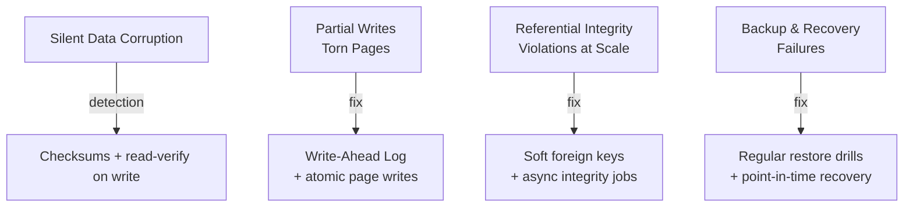

# Data Integrity

Data integrity failures are often the most damaging — they may go unnoticed for days or weeks while corrupted data propagates through your system.

Articles coming soon. This section covers:
- Silent data corruption
- Partial writes and torn pages
- Referential integrity violations at scale
- Backup and recovery failures
