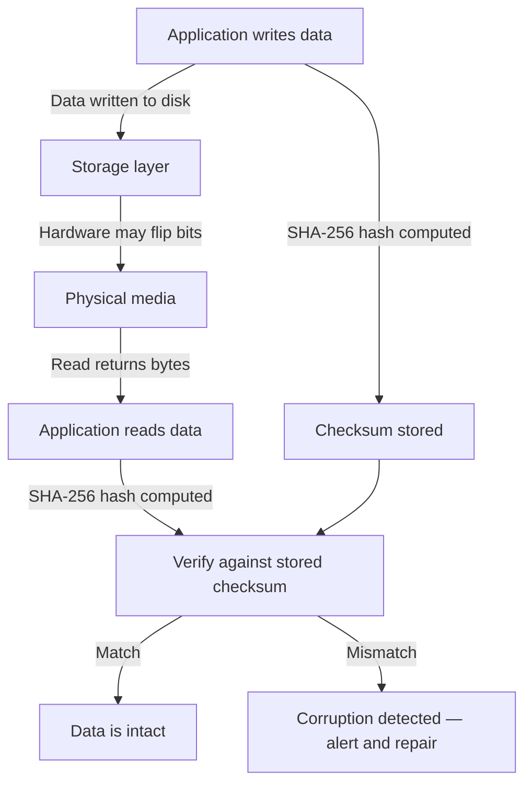
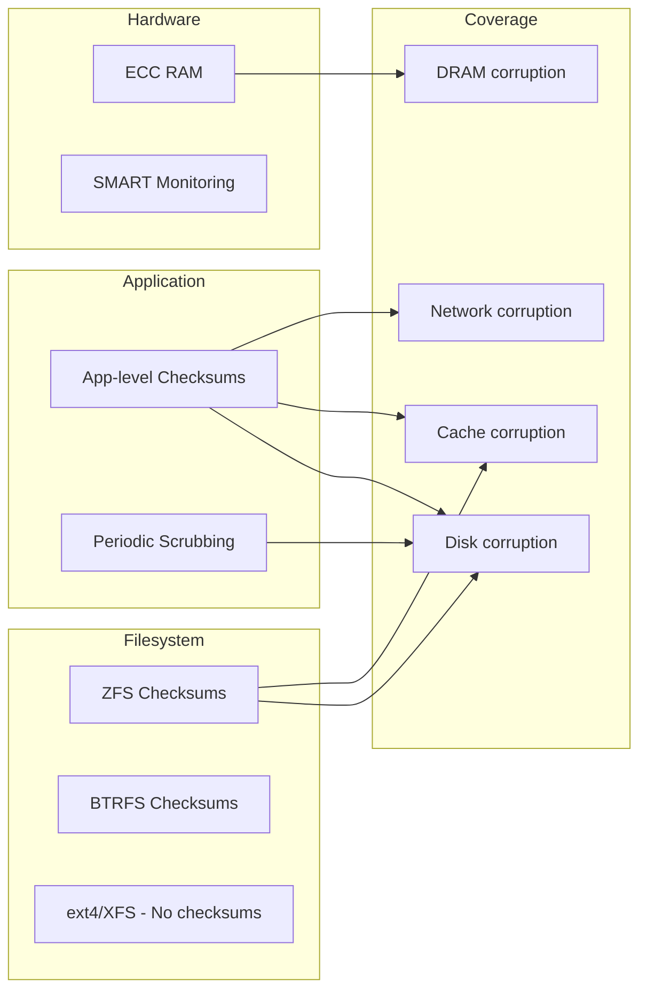

# Silent Data Corruption — Bit Rot, Bit Flips, and Undetected Storage Errors

## Level 1 — Surface (2-minute read)

**One-line definition**: Silent data corruption occurs when data reads back differently from what was written, with no error thrown by the storage stack — the system believes the operation succeeded, but the bytes are wrong.

**When you need to worry about this**: You are storing data for more than 1 year, running more than 1,000 hard drives, or operating a system where data integrity is a regulatory or safety requirement (financial records, medical data, genomic databases). At Facebook's scale (billions of photos), 1 in 1,000 drives/year exhibiting detectable corruption means thousands of corrupted drives per year.

**Core concepts**:
- Hardware is unreliable at scale: DRAM flips bits spontaneously, disks silently return wrong data, RAID controllers have firmware bugs
- The OS and filesystem do not verify data integrity by default — they trust hardware to return what was written
- End-to-end checksums are the only reliable detection mechanism: hash the data on write, verify on read
- ECC RAM corrects single-bit flips but cannot handle multi-bit errors; non-ECC RAM has no correction at all
- ZFS is the only mainstream filesystem with end-to-end checksums built in; ext4, XFS, and NTFS do not have this

**Quick reference diagram**:



**Use this when / don't use this when**:

| Scenario | Recommendation |
|----------|---------------|
| Long-term archive storage (photos, backups, logs) | End-to-end checksums + periodic scrubbing are mandatory |
| Database storing financial records | Use ECC RAM, ZFS or application-level checksums, scheduled scrubs |
| Short-lived cache data (TTL < 1 hour) | Corruption risk is low enough that checksums add unnecessary overhead |
| High-throughput streaming pipeline (Kafka) | Use CRC32 on message payload; Kafka does this natively |
| ML training data stored for years | Corruption invalidates model training; checksums required |

---

## Level 2 — Deep Dive

### Problem Statement

You operate a photo storage service with 50 billion photos, totaling 5 petabytes, stored on 5,000 hard drives. You store each photo in triplicate across 3 drives for redundancy.

After 18 months of operation, a user files a complaint: their vacation photos look corrupted — mosaic artifacts, random color blocks. You retrieve the photo and serve it — it looks fine in your monitoring UI. You check the 3 replicas. Two of them return the corrupted bytes. One returns the correct bytes. RAID did not flag an error. The filesystem reported no error. The application served the corrupted file 847 times before the user complained.

This is silent data corruption: the hardware returned wrong bytes, the OS did not notice, and your application served garbage data for weeks.

**Scale at which this matters**:
- Under 100 drives: statistical probability of corruption is low; impact per event is low; manual detection is feasible
- 1,000+ drives: statistical certainty that multiple drives are silently returning wrong data at any time
- 10,000+ drives: without automated detection and repair, corruption is continuous and undetected

---

### What Silent Data Corruption Is

Silent data corruption (also called **bit rot** when referring to long-term degradation) is any condition where the data returned by a read operation differs from the data written in a previous write operation, without the storage system reporting an error.

The adjective "silent" is the critical characteristic. A loud error — a disk SMART failure, a read timeout, a kernel I/O error — triggers alerting and recovery. A silent error goes undetected until the wrong data causes an observable symptom at the application layer, if it ever does.

Silent corruption exists in multiple layers of the storage stack:

```
Application
    ↕ (application may or may not checksum)
Filesystem (ext4, XFS, ZFS)
    ↕ (ZFS checksums here; others do not)
Block device driver
    ↕
RAID controller
    ↕ (firmware bugs here; may silently return wrong data)
Physical disk
    ↕ (sector errors, head degradation)
Physical media (magnetic domains, SSD flash cells)
```

Any layer can introduce corruption silently. The further down the stack the corruption originates, the more layers it can pass through undetected.

---

### Causes of Silent Data Corruption

#### 1. DRAM Bit Flips (Cosmic Rays, Voltage Fluctuation)

The most counterintuitive cause: the computer's own memory can corrupt data that was never on disk.

DRAM stores bits as electrical charges in capacitors. High-energy particles (cosmic rays, alpha particles from chip packaging impurities) can strike a capacitor and flip its charge, changing a 0 to a 1 or vice versa. This is called a **soft error** or **SEU (Single Event Upset)**.

**Statistics from published research**:
- Google's 2009 study of 10 billion device-hours of DRAM found that 8% of DIMMs experienced at least one correctable error per year
- A 2009 SIGMETRICS paper studying 250,000 servers found error rates of 25,000–70,000 FIT (failures per billion hours) per megabit — meaning a 16 GB DIMM has a meaningful error probability per year
- Non-ECC servers (common in consumer and budget cloud configurations) have no protection against these errors

**How this causes storage corruption**: When the OS reads data from disk into the page cache (DRAM), a bit flip in DRAM changes the buffered data. If that page is then written back to disk (dirty page flush), the corrupted data is persisted. The disk now contains data that was never written by the application.

**Mitigation**: ECC (Error-Correcting Code) RAM detects and corrects all single-bit errors and detects (but cannot correct) most double-bit errors. ECC RAM is standard in server-class hardware. Consumer and "edge" hardware typically does not have ECC.

```
ECC DRAM error correction matrix:
- 1-bit flip: detected and corrected automatically (SECDED code)
- 2-bit flip: detected but NOT corrected — system may crash or silently return wrong data
- 3+ bit flip: may be undetected (extremely rare under normal conditions)
```

#### 2. Disk Sector Errors (URE)

Hard disk drives return sector-level read errors when the magnetic surface is damaged. The disk's onboard ECC can correct small errors; beyond a threshold, it reports an **Unrecoverable Read Error (URE)** or silently returns zeros (the default behavior for most consumer drives, which does not trigger a SMART error immediately).

**URE rates by drive type**:
- Consumer SATA HDD: 1 URE per 10^14 bits read (MTBF spec)
- Enterprise SATA HDD: 1 URE per 10^15 bits read
- Enterprise SAS HDD: 1 URE per 10^16 bits read
- At 10^14 bits = 12.5 TB read, a consumer drive is statistically expected to have 1 silent read error

**The "silent zero" behavior**: Many consumer-grade drives, when encountering a marginal sector that their onboard ECC cannot fully correct, return the data with the corrected bits zeroed out rather than reporting an error. This is compliant with the ATA standard but catastrophic for data integrity — the application receives data with some bytes replaced by zeros, with no indication that anything went wrong.

#### 3. SSD Write Amplification and Cell Wear

NAND flash cells degrade with write cycles. Each write-erase cycle wears out the cell slightly. As cells wear, their ability to hold charge decreases, and the threshold between a "0" and "1" becomes ambiguous. Modern SSDs use multi-level cell (MLC) and triple-level cell (TLC) NAND, which pack more bits per cell at the cost of reduced durability.

**How SSD corruption manifests**:
- **Read disturb**: Reading a cell can slightly deplete the charge of adjacent cells. Over thousands of reads of the same cell, neighboring cells can flip. SSDs mitigate this with periodic "read scrubbing" — re-reading and rewriting data that has been read many times — but this feature is often disabled under heavy write pressure.
- **Program disturb**: Writing to one cell slightly affects adjacent cells. With TLC NAND (3 bits per cell), the precision required means a charge error of a few hundred millivolts can flip a bit.
- **Bit rot at rest**: Unpowered SSDs lose data faster than powered ones. At 86°F (30°C), a typical TLC SSD stores data reliably for 1 year unpowered; at 104°F (40°C), this drops to weeks. Data centers are cooled, but this matters for cold storage archives.

#### 4. RAID Controller Firmware Bugs

RAID controllers maintain parity or mirrored data across multiple disks. A firmware bug in the controller can:
- Write parity data that does not correspond to the actual stripe data
- Return data from the wrong disk during a read
- Silently drop a write (acknowledge the write to the OS but not persist it)
- Apply XOR parity incorrectly, so that a single disk rebuild reconstructs wrong data

This category of corruption is particularly dangerous because it can affect all disks in an array simultaneously. RAID provides no protection against controller corruption.

**Real incident**: In 2012, several Adaptec RAID controllers with specific firmware versions had a bug where write-back cache could silently drop writes under specific I/O patterns. Storage-intensive databases were the primary victims. Detection required external checksums.

#### 5. Network Packet Corruption

For networked storage protocols:
- **NFS**: Uses TCP, which provides error detection via checksum but the checksum is 16-bit — covers the IP pseudo-header and UDP/TCP header. TCP checksum does not cover the payload independently in all configurations.
- **iSCSI**: Provides optional end-to-end CRC32c checksumming of the payload; not always enabled by default
- **Ceph**: Computes checksums on all object data; corruption detected on read
- **HDFS**: Computes CRC32 checksums per 512-byte block; verified on read

For most networked storage protocols, TCP's built-in checksum is sufficient for detecting corruption in transit (the probability of a TCP checksum collision for corrupt data is 1/65536). However, corruption that occurs in storage hardware after network delivery is not detected by network-layer checksums.

---

### Detection Mechanisms

#### End-to-End Application-Level Checksums

The gold standard: compute a cryptographic hash of the data before storing it, store the hash separately from the data, and verify the hash every time the data is read.

```python
import hashlib
import json
from typing import Optional

class ChecksummedObjectStore:
    """
    Object storage with end-to-end SHA-256 checksums.
    Detects silent corruption on every read.
    """

    def __init__(self, storage_backend, metadata_store):
        self.storage = storage_backend
        self.metadata = metadata_store

    def write(self, key: str, data: bytes) -> str:
        """Write data and store its checksum. Returns checksum for verification."""
        checksum = hashlib.sha256(data).hexdigest()
        size = len(data)

        # Store data and metadata atomically (or as close as possible)
        self.storage.put(key, data)
        self.metadata.put(key, json.dumps({
            'checksum': checksum,
            'size': size,
            'algorithm': 'sha256',
            'written_at': time.time(),
        }))

        return checksum

    def read(self, key: str) -> bytes:
        """Read data and verify checksum. Raises CorruptionError on mismatch."""
        data = self.storage.get(key)
        meta = json.loads(self.metadata.get(key))

        actual_checksum = hashlib.sha256(data).hexdigest()
        expected_checksum = meta['checksum']

        if actual_checksum != expected_checksum:
            raise CorruptionError(
                key=key,
                expected=expected_checksum,
                actual=actual_checksum,
                size_matches=(len(data) == meta['size']),
            )

        return data

    def verify(self, key: str) -> bool:
        """Verify a stored object without returning it. Used for background scrubbing."""
        try:
            self.read(key)
            return True
        except CorruptionError:
            return False


class CorruptionError(Exception):
    def __init__(self, key: str, expected: str, actual: str, size_matches: bool):
        self.key = key
        self.expected = expected
        self.actual = actual
        self.size_matches = size_matches
        super().__init__(
            f"Corruption detected for key={key}: "
            f"expected={expected[:8]}..., actual={actual[:8]}..., "
            f"size_match={size_matches}"
        )
```

**Checksum algorithm choice**:

| Algorithm | Speed | Collision resistance | Use case |
|-----------|-------|---------------------|----------|
| CRC32 | Fastest (~10 GB/s) | Weak (not cryptographic) | Detect accidental corruption (hardware errors) |
| CRC32c | Fastest + hardware support | Weak | iSCSI, Ceph, HDFS — hardware-accelerated on modern CPUs |
| SHA-256 | ~3 GB/s (software), ~8 GB/s (AES-NI) | Strong (cryptographic) | Long-term integrity, tamper detection |
| BLAKE3 | ~10 GB/s | Strong | Modern applications where speed matters |
| MD5 | ~5 GB/s | Broken (collisions known) | Legacy only — do not use for new systems |

For hardware corruption detection (not tamper detection), CRC32c is sufficient and fast. For long-term archives where tamper detection is also needed, SHA-256 or BLAKE3.

#### ZFS Filesystems: Built-In End-to-End Checksums

ZFS computes a checksum (SHA-256 by default; configurable to SHA-512, Skein, Edon-R) of every data block and stores the checksum in the block's parent pointer in the tree structure. Because the checksum is stored separately from the data it protects (in the block pointer, not adjacent to the block), a single block corruption does not corrupt its own checksum.

```
ZFS block tree (simplified):
Pool label (checksum of root block)
└── Root block (checksum of uberblock)
    └── uberblock (checksum of object set)
        └── Object set
            ├── Object 1 (checksum: abc123)
            │   └── Block 1.1 — actual data [SHA-256 = abc123] ✓
            └── Object 2 (checksum: def456)
                └── Block 2.1 — actual data [SHA-256 = def456] ✓
```

When ZFS reads a block, it recomputes the checksum and compares it to the stored value. If they differ, ZFS detects corruption and can:
1. Return an error to the application (if no redundancy is available)
2. Automatically repair from a mirror or RAID-Z parity (if redundancy is available) — transparent to the application

**ZFS scrubbing**: A scrub is an explicit read of every block in the pool, verifying its checksum. Unlike a read triggered by an application access, a scrub covers cold data that has not been accessed recently (where bit rot is most likely).

```bash
# Start a scrub on pool 'tank'
zpool scrub tank

# Check scrub status
zpool status tank

# Example output during scrub:
#   scan: scrub in progress since Mon Jun  1 02:00:01 2026
#         1.23T scanned at 1.05G/s, 456G issued at 389M/s, 5.00T total
#         0 repaired, 24.67% done, 00:06:45 to go

# Schedule monthly scrub via cron
# 0 2 1 * * root /sbin/zpool scrub tank
```

**ZFS overhead**:
- Write overhead: 5–10% for SHA-256 checksumming (most of this is the checksum tree update, not the hash computation itself)
- Read overhead: ~0% for clean data (the checksum verification is done inline and is CPU-bound at ~3 GB/s, which rarely bottlenecks disk I/O)
- Scrub overhead: Full IOPS consumption during scrub; schedule during off-peak hours

**ZFS vs ext4/XFS**: Neither ext4 nor XFS provides per-block data checksums. They have journal checksums (protecting the journal from corruption) but not data checksums. A corrupted block in ext4 or XFS is silently returned to the application as if it were valid.

#### ECC RAM

ECC RAM uses additional bits (typically 8 extra bits per 64-bit word) to store a Hamming code that allows detection of 2-bit errors and correction of all 1-bit errors.

```
ECC detection/correction capability (SECDED — Single Error Correct, Double Error Detect):
- 1 bit flipped: automatically corrected, event logged to EDAC kernel module
- 2 bits flipped: detected but NOT corrected — kernel typically continues
- 3+ bits flipped: may be silent (probability drops dramatically)

Cost: ~10% more DRAM bandwidth used, ~2% higher latency, ~15% cost premium
```

ECC is the baseline for any production database server. Operators can monitor ECC correction events:

```bash
# Linux: check ECC error counters
sudo edac-util -s 4

# Output format:
# mc0: 47 Corrected Errors in last 24h, 0 Uncorrected Errors
# mc1: 12 Corrected Errors in last 24h, 0 Uncorrected Errors

# High corrected error rate (> 100/day on a DIMM) indicates a DIMM approaching failure
# Uncorrected errors require immediate DIMM replacement
```

A DIMM showing high corrected error rates should be replaced proactively; a DIMM accumulating corrected errors is close to producing uncorrectable errors.

#### Periodic Scrubbing Pipelines

Beyond filesystem-level scrubbing (ZFS) or hardware-level checking (ECC), applications can implement their own background scrubbing processes:

```python
import asyncio
import logging
from datetime import datetime, timedelta
from typing import Iterator

logger = logging.getLogger(__name__)

class ObjectStoreScrubber:
    """
    Background scrubber that verifies all stored objects periodically.
    Designed for warm storage (Facebook f4-style) where 65%+ of data is rarely accessed.
    """

    def __init__(self, store: ChecksummedObjectStore, scrub_interval_days: int = 14):
        self.store = store
        self.scrub_interval = timedelta(days=scrub_interval_days)

    async def scrub_continuously(self):
        """
        Main scrub loop. Runs forever, cycling through all objects.
        At 1 GB/s read throughput, 1 PB of data takes ~12 days to scrub fully.
        With 14-day cycle, this requires ~83 MB/s sustained read throughput.
        """
        while True:
            start_time = datetime.utcnow()
            corrupted_keys = []
            verified_count = 0
            error_count = 0

            async for key in self.store.list_all_keys():
                try:
                    is_valid = await asyncio.get_event_loop().run_in_executor(
                        None, self.store.verify, key
                    )
                    if is_valid:
                        verified_count += 1
                    else:
                        corrupted_keys.append(key)
                        error_count += 1

                except Exception as e:
                    logger.error("scrub_read_error", key=key, error=str(e))
                    error_count += 1

            duration = datetime.utcnow() - start_time

            logger.info(
                "scrub_cycle_complete",
                verified=verified_count,
                corrupted=len(corrupted_keys),
                errors=error_count,
                duration_hours=duration.total_seconds() / 3600,
            )

            if corrupted_keys:
                await self.repair_corrupted(corrupted_keys)

            # Sleep until next scrub cycle
            elapsed = datetime.utcnow() - start_time
            sleep_time = max(0, (self.scrub_interval - elapsed).total_seconds())
            await asyncio.sleep(sleep_time)

    async def repair_corrupted(self, keys: list[str]):
        """
        Attempt repair of corrupted objects from replicas.
        """
        for key in keys:
            repaired = False
            for replica_store in self.store.replicas:
                try:
                    data = replica_store.read(key)  # This also verifies checksum
                    self.store.write(key, data)  # Re-write to the corrupted store
                    logger.info("corruption_repaired", key=key, from_replica=replica_store.name)
                    repaired = True
                    break
                except Exception:
                    continue

            if not repaired:
                logger.critical(
                    "corruption_unrecoverable",
                    key=key,
                    message="All replicas corrupt or unavailable",
                )
                # Alert operations team — data loss has occurred
```

---

### Real-World Case: Facebook f4 (OSDI 2014)

Facebook's f4 system, described in their 2014 OSDI paper "f4: Facebook's Warm BLOB Storage System," stores 65% of Facebook's photos (at time of publication, approximately 1.5 billion photos per day added). f4 is optimized for warm storage: data accessed infrequently but that must remain durable and intact.

**The scale**:
- 65 exabytes of data at time of paper publication
- Stored on thousands of commodity hard drives
- BLOB (Binary Large Object) objects: photos, videos, documents

**Their corruption detection approach**:

1. **Block-level checksums on every read**: Every BLOB block is accompanied by a CRC32 checksum stored in a separate index. When f4 reads a block for any purpose (user request or scrub), it verifies the CRC32. A mismatch triggers automatic repair.

2. **14-day scrub cycle**: f4 scrubs all data every 14 days. At their scale, this requires a constant background read rate of many gigabytes per second just for scrubbing. They designed the system's I/O budget to accommodate this.

3. **Erasure coding, not replication**: f4 uses Reed-Solomon erasure coding rather than 3x replication. This provides 2.8x storage efficiency vs 3x replication while maintaining the same durability level. Erasure coding also provides a natural repair path: a corrupted block can be reconstructed from the erasure-coded parity blocks.

4. **Corruption metrics**: The f4 paper reports that approximately 1 in 1,000 drives per year experiences detectable block-level corruption. At their scale (thousands of drives), this means multiple drives are silently corrupting data at any time.

**Key architectural decision**: f4 treats corruption as an expected, steady-state condition to be detected and repaired, not an exceptional event. Their system is designed assuming that corruption is happening continuously at a low rate. This is the correct mental model for any system operating at scale.

---

### Real-World Case: Google Colossus

Google's Colossus file system (successor to GFS, described partially in public talks and papers) uses block-level checksums throughout its chunk management layer.

**How Colossus handles corruption**:
1. Each chunk (64 MB blocks) has a checksum computed and stored when the chunk is written
2. On every read, the checksum is verified before returning data to the client
3. On checksum failure, Colossus marks the chunk as corrupt and automatically re-replicates it from a healthy replica
4. The corrupt chunk is invalidated and its space is reclaimed

**The "automatic repair" behavior** is the critical design point: when Colossus detects corruption, it does not wait for an operator to intervene. It immediately reads the data from another replica (Google stores 3 replicas by default), verifies it, writes a new replacement chunk, and updates the chunk metadata — all within milliseconds of detecting the corruption.

This automatic, transparent repair is why Google Cloud Storage's durability guarantee is 11 nines (99.999999999%) — not because hardware is that reliable, but because the system detects and repairs failures faster than they accumulate.

---

### Statistical Reality: Corruption Is a Certainty at Scale

The most important mental model shift: corruption is not a rare edge case. It is a statistical certainty at scale.

**Published statistics**:
- **Facebook disk study**: 1 in 1,000 drives/year shows detectable bit-level corruption (from data shared in f4 paper)
- **Google DRAM study (2009)**: 8% of all DIMMs exhibit at least 1 correctable ECC error per year; some DIMMs show thousands of errors per day
- **Carnegie Mellon disk study (2007)**: Among 100,000+ disk drives studied, 3–9% had bad sectors detected per year — sector errors that do not produce I/O errors but return wrong data

**Calculation for a 1,000-drive cluster**:
```
Assumption: 1 drive per 1,000 experiences corruption per year
1,000 drives × 1/1,000 = 1 drive with corruption per year
At 4 TB per drive = 4 TB on a corrupted drive
At typical 0.001% corruption rate within a drive = ~4 GB corrupted
Typical block size = 4 KB → ~1 million corrupted blocks per year in a 1,000-drive cluster
```

This is not theoretical. Systems operating at this scale are repairing thousands of corrupted blocks per day as a routine operation. The question is not "if" corruption happens — it is "whether your system detects it."

---

### Comparison: Detection Mechanism Trade-offs



| Mechanism | Detects DRAM flip | Detects disk corruption | Detects network corruption | Overhead |
|-----------|------------------|------------------------|---------------------------|----------|
| ECC RAM | Yes (1-bit) | No | No | ~2% latency |
| ZFS checksums | Partial (after page cache) | Yes | No | 5–10% write IOPS |
| App-level SHA-256 | Yes (on re-hash) | Yes | Yes (if hashed after network) | ~5% CPU |
| Periodic scrub | Only if data written back | Yes | No | I/O bandwidth |
| RAID parity | No | Partial (detects but returns wrong data on 2+ drive failure) | No | Varies |

The safest architecture combines all layers:
1. ECC RAM (catches DRAM errors before they reach disk)
2. ZFS or application-level checksums (catches disk errors on every read)
3. Periodic scrubbing (catches errors in cold data not recently read)
4. Network checksums (CRC32c on iSCSI/NVMe-oF if using networked storage)

---

### Common Mistakes

#### Mistake 1: Assuming RAID Prevents Corruption

**Root cause**: RAID is designed to protect against disk failure (a disk stops responding). It is not designed to protect against disk corruption (a disk returns wrong data).

In a RAID-1 mirror with 2 drives, if one drive silently returns wrong data for a block, RAID has no way to know which drive is correct. In RAID-5/6, the parity strip is computed from the data strips; if one data strip is corrupted, the parity is inconsistent, but RAID controllers typically do not verify parity on every read — only during a RAID scrub (which many operators never schedule).

**Fix**: RAID provides availability (protection against drive failure). For integrity, you need checksums. These are orthogonal concerns. Use both.

#### Mistake 2: Not Scheduling ZFS Scrubs

**Root cause**: ZFS scrub is not automatic by default. Many operators set up ZFS, enjoy its features, and never configure a scrub schedule.

Without scrubs, corruption in cold data (data not recently read by applications) can accumulate for months or years. When the corrupted data is finally read (for backup, migration, or user request), all replicas may have independently corrupted the same blocks through their own independent hardware failures, and repair is impossible.

**Fix**:
```bash
# Add to crontab:
# Monthly scrub for SSD-based pools (SSDs age faster)
0 2 1 * * root zpool scrub tank

# Quarterly for spinning disk pools
0 2 1 1,4,7,10 * root zpool scrub data-pool
```

ZFS will auto-repair blocks that it finds corrupted during a scrub, as long as a healthy copy is available from a mirror or RAID-Z parity.

#### Mistake 3: Using Non-ECC RAM in Database Servers

**Root cause**: ECC RAM is slightly more expensive and requires a compatible CPU and motherboard. Budget infrastructure decisions or cloud provider defaults may use non-ECC RAM.

A bit flip in DRAM holding a database page cache entry can cause a corrupted page to be written back to disk without detection. The database will read back the corrupted page and serve it to queries, or — worse — if the page contains an index node, it can corrupt the B-tree structure and cause query failures or wrong query results.

**Fix**: Require ECC RAM for all database servers. Verify ECC status at server provisioning time:
```bash
# Verify ECC is active
sudo dmidecode -t memory | grep "Error Correction Type"
# Should show: Error Correction Type: Multi-bit ECC
# NOT: Error Correction Type: None
```

#### Mistake 4: Treating Checksums as Optional Performance Feature

**Root cause**: Application architects view checksums as a performance overhead that can be disabled to reduce latency. They treat data integrity as a non-functional requirement with lower priority than throughput.

**Fix**: Checksums are not optional. The correct framing is: without checksums, you do not know if your data is correct. You are serving potentially corrupted data to users and you have no detection mechanism. The performance overhead of CRC32c (0.5–2% of throughput) is never worth the risk of undetected corruption.

#### Mistake 5: Computing Checksums Before Network Transmission

**Root cause**: When building client-server storage, developers compute the checksum on the client side, transmit the checksum along with the data, and store both. On read, they re-read the checksum from storage and verify it matches the re-read data.

The bug: if the corruption happens in the storage layer (disk, controller), this scheme detects it. But if the corruption happens during transmission from client to server (before storage), the checksum was computed over the corrupt data and is stored as "the expected value." Reading back will show a match — the corrupt data matches its own checksum.

**Fix**: Compute the checksum from the known-good source, not after network delivery. For client-originating data, compute the checksum on the client, transmit it separately, and have the server re-compute from its received bytes and compare before acknowledging the write. If they match, the data arrived intact. If they do not match, the write failed and should be retried.

---

### Production Implementation Checklist

```
Hardware layer:
[ ] ECC RAM enabled on all database and storage servers
[ ] Verified via dmidecode or EDAC counters
[ ] EDAC error monitoring alerting configured (alert on any Uncorrected Error)
[ ] SMART monitoring on all drives (smartd configured)

Filesystem layer:
[ ] ZFS used for storage pools requiring integrity guarantees
[ ] ZFS scrub scheduled (monthly for SSD, quarterly for HDD)
[ ] ZFS scrub completion monitoring (alert if scrub not completed in 45 days)
[ ] ZFS email reporting configured for scrub results

Application layer:
[ ] SHA-256 or CRC32c checksums computed on write for all critical data
[ ] Checksums stored separately from data (not in same file/block)
[ ] Checksums verified on every read for critical data
[ ] Background scrubbing job running continuously for cold storage

Operations:
[ ] Corruption detection metrics emitted to monitoring
[ ] Alert on any corruption event (even repaired ones — they indicate hardware degradation)
[ ] Runbook for corruption response (which replica to repair from, escalation path)
[ ] Drive replacement policy based on corruption event count (not just SMART status)
[ ] Post-mortem template for corruption incidents
```

---

### Key Numbers

| Metric | Value | Source |
|--------|-------|--------|
| DRAM DIMMs with at least 1 correctable error per year | 8% | Google study, 2009 |
| Drives per year with detectable corruption | 1 in 1,000 | Facebook f4 paper, 2014 |
| Consumer HDD URE rate | 1 error per 10^14 bits | ATA specification |
| ZFS write overhead (SHA-256) | 5–10% | OpenZFS benchmarks |
| ZFS read overhead (checksum verify) | ~0% (CPU-bound at ~3 GB/s) | OpenZFS benchmarks |
| f4 scrub cycle | 14 days | Facebook OSDI 2014 |
| Google Cloud Storage durability | 11 nines (99.999999999%) | Google Cloud SLA |
| SHA-256 throughput (AES-NI, modern CPU) | 4–8 GB/s | OpenSSL benchmarks |
| CRC32c throughput (hardware, SSE4.2) | 10–20 GB/s | Intel documentation |
| Time to scrub 1 PB at 1 GB/s | ~12 days | Calculation |

---

### Key Takeaways

- At 1,000+ drives, corruption is a steady-state condition: statistically 1 drive per year silently returns wrong data, and ECC catches ~99% of DRAM errors but cannot prevent disk-level corruption
- RAID protects against drive failure, not drive corruption — a RAID-1 mirror with one silently corrupting drive serves the corrupt data without any error
- ZFS is the only mainstream filesystem with end-to-end per-block checksums; ext4 and XFS silently return corrupted blocks to applications
- Facebook's f4 system validates every block on read and scrubs all 65% of Facebook's photos on a 14-day cycle as a routine operation — not an exceptional one
- The overhead of CRC32c checksumming is 0.5–2% of throughput; the cost of undetected corruption to data durability, user trust, and regulatory compliance is unbounded
- Always combine layers: ECC RAM (DRAM protection) + ZFS or application checksums (disk protection) + periodic scrubbing (cold data protection) + monitoring of ECC correctable error rates (early warning of failing DIMMs)

---

## References

- 📺 [Facebook f4: Facebook's Warm BLOB Storage System — OSDI 2014](https://www.usenix.org/conference/osdi14/technical-sessions/presentation/muralidhar) — describes block-level checksumming and 14-day scrubbing at exabyte scale
- 📖 [Google: Disk Failures in the Real World — FAST 2007](https://research.google/pubs/disk-failures-in-the-real-world-what-does-an-mttf-of-1000000-hours-mean-to-you/) — empirical study of disk failure modes across 100,000+ drives
- 📚 [OpenZFS: zpool-scrub — Official Documentation](https://openzfs.github.io/openzfs-docs/man/8/zpool-scrub.8.html) — ZFS scrub configuration and scheduling
- 📖 [DRAM Error Rates: Mythologies and Realities — SIGMETRICS 2009](https://www.cs.toronto.edu/~bianca/papers/sigmetrics09.pdf) — 10 billion device-hour study of DRAM ECC error rates
- 📖 [Google Cloud Storage: Durability and Availability](https://cloud.google.com/storage/docs/availability-durability) — describes how Google achieves 11-nine durability via checksum-based repair
