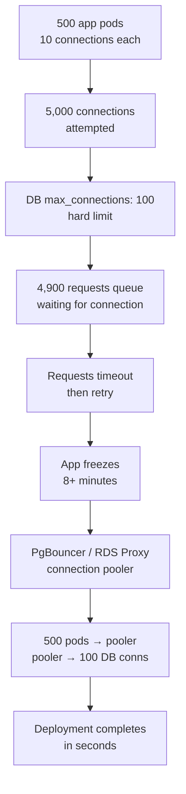
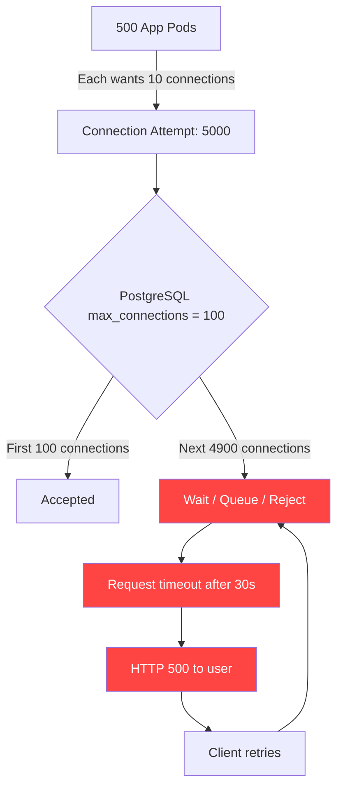

# Connection Pool Starvation: When Your App Freezes at Deploy Time

## 🗺️ Quick Overview


*Normal path: pool has free connections, requests proceed. Trigger: pods × pool_size exceeds DB max_connections. Failure cascade: self-inflicted DoS on your own database at every deploy.*

**Deployments at your company take 10 minutes. Not because of build time. Not because of tests. Because every time you deploy, the app freezes for 8 minutes while every request times out waiting for a database connection that never comes. Your database has 100 max connections. You have 500 app instances. Each instance is trying to maintain a pool of 10 connections. Do the math: you need 5,000 connections, you have 100. The other 4,900 requests queue. Then they time out. Then they retry. Then they make it worse. Your "scalable" Kubernetes deployment has been quietly DoS-ing your own database since the day you hit 50 pods.**

---

## The Problem Class `[Senior]`

Every database connection is expensive. In PostgreSQL, each connection is a separate OS process consuming approximately 5–10MB of RAM plus CPU scheduling overhead. A PostgreSQL instance on a small cloud database (db.t3.micro on AWS RDS) supports 30 max connections. A large one (db.r5.4xlarge) supports around 5,000. The number is bounded by hardware, not by your application's ambition.

Application connection pools work by maintaining a set of ready connections to avoid the overhead of establishing a new connection per request (TCP handshake + TLS + authentication = 20–100ms). This is smart and correct. The problem emerges when you have more application instances than your database supports connections.

The math is brutal and fixed:

```
Application connections attempted = pods × connections_per_pool
                                  = 500 × 10
                                  = 5,000

Database max_connections = 100

Connections that will be refused or queue = 4,900
```

When a request arrives and no connection is available from the pool, it waits. The pool's `acquireTimeout` is typically 30–60 seconds. Under load, every request is waiting 30–60 seconds to get a connection it will never receive, then failing with `Error: timeout acquiring connection from pool`. Your response time graph looks like a step function: instant results, then a cliff at 100% pool utilization, then everything times out.

---

## Why This Happens

### PostgreSQL Connections Are OS Processes

Unlike MySQL (threads) or most other databases, PostgreSQL spawns a full OS process per connection via `postmaster`. Each process needs:
- A private memory buffer (~5MB base)
- Stack space
- CPU scheduling overhead
- File descriptors

This is why PostgreSQL's connection limit scales with instance size. It's not a software configuration choice — it's a hardware reality.



### The Deploy-Time Spike

Deployments make this dramatically worse. When Kubernetes rolls out a new version, it:
1. Starts N new pods (each trying to establish their full connection pool immediately on startup)
2. Terminates N old pods (releasing connections, but not before new connections try to fill their slot)

The new pods all try to establish connections simultaneously. Even if steady-state would be fine, the startup burst hits `max_connections` simultaneously. Old pods haven't released their connections yet (graceful shutdown takes time). Result: 2× your normal connection count attempting to connect at the exact same moment. Everything queues. Everything times out. Deploy appears to "freeze" the application for the duration of the rolling restart.

### RDS max_connections by Instance Size

AWS RDS PostgreSQL's `max_connections` is computed from instance RAM:

| Instance | RAM | max_connections (approx.) |
|----------|-----|--------------------------|
| db.t3.micro | 1 GB | 30 |
| db.t3.medium | 4 GB | 120 |
| db.r5.large | 16 GB | 500 |
| db.r5.4xlarge | 128 GB | 5,000 |
| db.r5.24xlarge | 768 GB | 10,000 |

Formula: `max_connections ≈ (DBInstanceClassMemory / 9531392)` (roughly 9MB per connection).

If you're on `db.t3.medium` with 120 max connections and 50 pods each wanting 5 connections, you're at exactly your limit before any human queries run. Add metrics scrapers, admin connections, migration tools, and you're consistently over.

---

## Real-World Impact

- **Every k8s deployment that scales past ~20 pods** without a connection pooler hits this wall eventually.
- **Startup freezes**: Apps that initialize their pool fully on boot (not lazily) are especially vulnerable — they all race to claim connections at startup.
- **Traffic spikes**: A sudden burst of traffic causes a burst of new connection requests (if pool is exhausted and new connections are attempted), exceeding `max_connections` and causing cascading failures.
- **Long-running transactions**: Queries that hold connections open for seconds (or minutes in bad cases) reduce the effective pool size, causing starvation even with fewer total instances.

---

## The Wrong Fix

### Just Reduce Pool Size

```javascript
// Before: pool size 10 per instance, 500 instances = 5000 attempted
const pool = new Pool({ max: 10 });

// After: pool size 2 per instance, 500 instances = 1000 attempted
const pool = new Pool({ max: 2 });
```

Still doesn't work if you have 500 instances and 100 max connections. With `max: 2` you're at 1000 attempted vs 100 available. You've made it slightly less bad. You haven't fixed it.

Also: reducing pool size means more connection wait time per request. You've traded one failure mode (pool exhaustion from too many connections) for a different one (pool exhaustion from too few connections per instance). The real fix is to stop having application instances own database connections at all.

---

## The Right Solutions

### Solution 1: PgBouncer — Connection Pooler

PgBouncer sits between your application and PostgreSQL. Applications think they're connecting to PostgreSQL. They're actually connecting to PgBouncer, which maintains a much smaller pool of real connections to the database.

```
500 app pods × 10 connections = 5,000 to PgBouncer
PgBouncer: 5,000 client connections → 50 server connections to PostgreSQL
PostgreSQL: sees only 50 connections (well within max_connections)
```

PgBouncer operates in three modes:
- **Session mode**: A real DB connection is assigned to a client for the entire client session. Safest, least efficient.
- **Transaction mode**: A real DB connection is assigned only for the duration of a transaction. Released after `COMMIT/ROLLBACK`. Best efficiency for most workloads.
- **Statement mode**: A real DB connection is assigned per-statement. Fastest but incompatible with multi-statement transactions.

```ini
# pgbouncer.ini
[databases]
mydb = host=db.internal port=5432 dbname=mydb

[pgbouncer]
listen_port = 5432
listen_addr = 0.0.0.0
auth_type = md5
auth_file = /etc/pgbouncer/userlist.txt

# Transaction mode — real connections released after each transaction
pool_mode = transaction

# Real connections to PostgreSQL
max_client_conn = 10000     # How many app connections PgBouncer accepts
default_pool_size = 50      # How many real DB connections PgBouncer maintains
reserve_pool_size = 10      # Extra connections for bursts
```

```javascript
// Application connects to PgBouncer, not directly to PostgreSQL
const pool = new Pool({
  host: 'pgbouncer.internal', // Not db.internal!
  port: 5432,
  database: 'mydb',
  max: 20, // PgBouncer handles multiplexing — this can be generous
});
```

**PgBouncer on Kubernetes:**

```yaml
# Deploy PgBouncer as a sidecar or dedicated service
apiVersion: apps/v1
kind: Deployment
metadata:
  name: pgbouncer
spec:
  replicas: 2  # HA setup
  template:
    spec:
      containers:
      - name: pgbouncer
        image: pgbouncer/pgbouncer:1.21.0
        env:
        - name: POSTGRESQL_HOST
          value: "your-rds-endpoint.us-east-1.rds.amazonaws.com"
        - name: POSTGRESQL_DATABASE
          value: "mydb"
        - name: POOL_MODE
          value: "transaction"
        - name: MAX_CLIENT_CONN
          value: "10000"
        - name: DEFAULT_POOL_SIZE
          value: "50"
        ports:
        - containerPort: 5432
```

### Solution 2: RDS Proxy — AWS Managed Connection Pooling

If you're on AWS, RDS Proxy is the zero-ops version of PgBouncer. It's managed, integrated with IAM auth, failover-aware (redirects to new primary during failover in seconds instead of minutes), and scales automatically.

```javascript
// Application connects to RDS Proxy endpoint (not the DB directly)
const pool = new Pool({
  host: 'my-proxy.proxy-abc123.us-east-1.rds.amazonaws.com',
  port: 5432,
  database: 'mydb',
  user: 'myuser',
  // RDS Proxy supports IAM authentication
  password: await getRdsIamToken('my-proxy.proxy-abc123.us-east-1.rds.amazonaws.com'),
  ssl: { rejectUnauthorized: true, ca: rdsCaCert },
});
```

RDS Proxy limitations: costs ~$0.015/connection-hour, adds ~1–2ms latency, has some protocol-level limitations (no `LISTEN/NOTIFY`, no `pg_cancel_backend`).

### Solution 3: The Hikari Formula — Right-Sizing Your Pool

If you can't use a pooler (some environments don't support it), size your pool using the formula from HikariCP (Java's gold-standard connection pool):

```
pool_size = (core_count × 2) + effective_spindle_count
```

For a typical web service on a 2-core machine with SSD storage (spindle count ≈ 1):
```
pool_size = (2 × 2) + 1 = 5
```

This sounds small. It's correct. More connections than `core_count × 2` means you're context-switching more than you're doing work. The database performs better with fewer, longer-running connections than many short ones competing for CPU.

```javascript
const pool = new Pool({
  host: process.env.DB_HOST,
  max: Math.max(2, os.cpus().length * 2 + 1), // Hikari formula
  idleTimeoutMillis: 10000,    // Release idle connections after 10s
  connectionTimeoutMillis: 2000, // Fail fast — don't queue for 30s
});
```

### Solution 4: Monitor and Alert on Pool Exhaustion

```javascript
const { Pool } = require('pg');

class InstrumentedPool {
  constructor(config) {
    this.pool = new Pool(config);
    this.setupMonitoring();
  }

  setupMonitoring() {
    // Alert when pool is getting full
    setInterval(() => {
      const total = this.pool.totalCount;
      const idle = this.pool.idleCount;
      const waiting = this.pool.waitingCount;

      // Emit to your metrics system
      metrics.gauge('db.pool.total', total);
      metrics.gauge('db.pool.idle', idle);
      metrics.gauge('db.pool.waiting', waiting);
      metrics.gauge('db.pool.active', total - idle);

      // Alert if requests are waiting for connections
      if (waiting > 0) {
        logger.warn('Connection pool exhaustion', {
          total,
          idle,
          waiting,
          utilization: ((total - idle) / total * 100).toFixed(1) + '%',
        });
      }
    }, 5000);

    this.pool.on('error', (err) => {
      logger.error('Unexpected pool error', err);
      metrics.increment('db.pool.errors');
    });
  }

  async query(...args) {
    const start = Date.now();
    try {
      const result = await this.pool.query(...args);
      metrics.timing('db.query.duration', Date.now() - start);
      return result;
    } catch (err) {
      if (err.message.includes('timeout') || err.message.includes('pool')) {
        metrics.increment('db.pool.timeout');
      }
      throw err;
    }
  }
}
```

### Solution 5: Detect Starvation in PostgreSQL

```sql
-- How many connections are currently active, idle, waiting?
SELECT
  state,
  wait_event_type,
  wait_event,
  COUNT(*) AS connection_count
FROM pg_stat_activity
WHERE datname = 'mydb'
GROUP BY state, wait_event_type, wait_event
ORDER BY connection_count DESC;

-- Connections waiting for a client (idle in transaction for > 30s = problem)
SELECT
  pid,
  state,
  wait_event,
  now() - query_start AS query_duration,
  LEFT(query, 100) AS query_preview
FROM pg_stat_activity
WHERE datname = 'mydb'
  AND state = 'idle in transaction'
  AND query_start < now() - interval '30 seconds'
ORDER BY query_start;

-- How close are you to max_connections?
SELECT
  current_setting('max_connections')::int AS max_connections,
  COUNT(*) AS current_connections,
  COUNT(*) * 100.0 / current_setting('max_connections')::int AS utilization_pct
FROM pg_stat_activity;
```

---

## Detection

**At deploy time**: If response time spikes exactly when a new version rolls out, and the spike lasts for the duration of the rolling restart, it's almost certainly connection pool starvation.

**In steady state**: Look for `waitingCount > 0` in your pool metrics for more than a few seconds. A pool with waiting requests means you've exhausted capacity.

**In PostgreSQL**: `pg_stat_activity` showing many connections in `idle` state with a high `wait_event = Client` means PgBouncer-style connections are backed up. Connections in `idle in transaction` mean long-running transactions are holding connections open.

**Alert thresholds**:
- Pool waiting count > 0 for > 5 seconds → warning
- Pool utilization > 80% → warning
- `max_connections` utilization > 85% → critical

---

## Prevention Patterns

1. **Never run more pods than `max_connections / pool_size`** without a connection pooler.
2. **Always deploy PgBouncer or RDS Proxy before scaling past 20 pods** on a managed database.
3. **Use `connectionTimeoutMillis: 2000`** (not the default 0 or 30000). Fail fast. Don't let requests queue for 30 seconds — they'll just pile up and make the problem worse.
4. **Set `idleTimeoutMillis: 10000`** to release connections that aren't being used, freeing capacity during traffic lulls.
5. **Use lazy connection initialization** — don't establish all connections at startup, let them fill on demand.
6. **Load test with `max_connections` as a constraint** — your load test must respect the real database connection limit.

---

## Checklist

- [ ] Know your database's `max_connections` value
- [ ] Calculate: `pods × pool_size` — if this exceeds `max_connections × 0.85`, you need a pooler
- [ ] PgBouncer or RDS Proxy deployed in front of all production databases with > 20 app instances
- [ ] `connectionTimeoutMillis` set to 2000ms (fail fast, don't queue)
- [ ] Pool metrics (`waitingCount`, `totalCount`, `idleCount`) emitted to monitoring
- [ ] Alert configured for pool waiting count > 0 sustained > 5 seconds
- [ ] PostgreSQL `max_connections` utilization monitored and alerted at 80%
- [ ] Deploy tested to confirm no connection spike during rolling restart

---

## Key Takeaways

Connection pool starvation is a math problem. The number of connections your application wants is `pods × pool_size`. The number your database supports is a hard limit based on hardware. When the first number exceeds the second, requests queue. When requests queue long enough, they time out. When they time out, they retry. When they retry, they make it worse.

The fix is a connection multiplexer — PgBouncer or RDS Proxy. This lets thousands of application connections share a small set of real database connections. Applications see normal connection behavior. The database sees only the connections it can handle. The math works out.

If you're running Kubernetes with more than 20 pods hitting a managed PostgreSQL database, you almost certainly need a connection pooler. Not eventually. Now.
