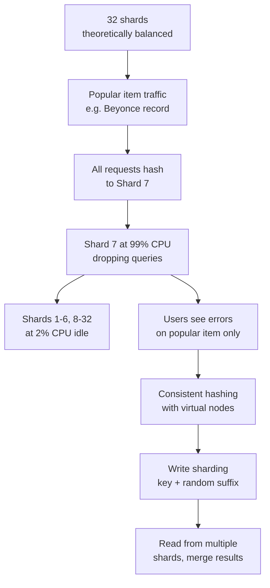
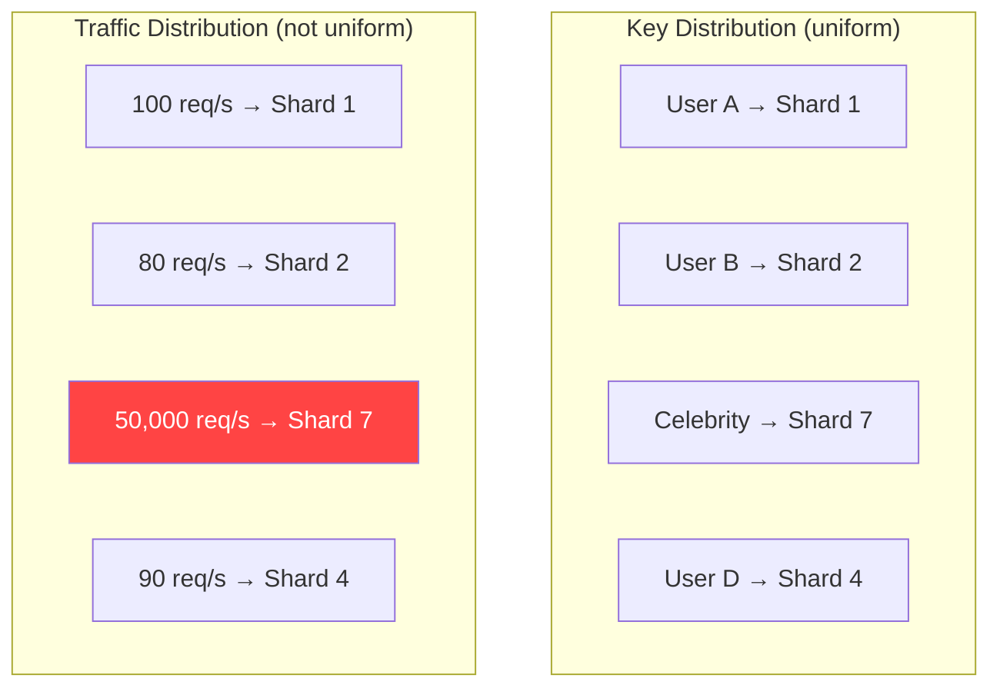
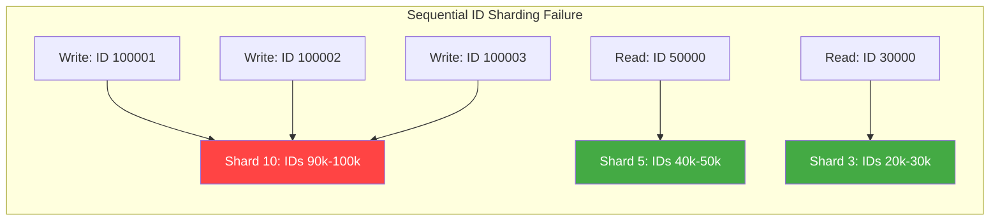

# Database Hotspots: When Your Sharding Makes Things Worse

## 🗺️ Quick Overview


*Normal path: hash(key) distributes evenly across shards. Trigger: traffic concentration on a small set of hot keys. Failure: horizontal scaling provides zero relief for hot items.*

**You have 32 database shards. Your dashboard shows 31 are at 2% CPU. One is at 99% CPU and dropping queries. Thousands of users can't load their data. Your on-call engineer is staring at the load distribution chart, which looks like a ski jump: a flat line punctuated by a single vertical spike. You sharded your database to distribute load. Instead, you concentrated it. Your shard key was chosen by someone who didn't understand that distributing keys is not the same as distributing traffic.**

---

## The Problem Class `[Senior]`

Sharding distributes rows across multiple database nodes. The assumption is that distributing rows distributes load. This assumption breaks the moment your traffic isn't uniformly distributed across your data.

Most traffic patterns are deeply non-uniform. A small percentage of users generate the majority of reads and writes. The most popular product gets 10,000× more views than the average. Today's data gets queried 100× more than data from three years ago. If your shard key maps these hot items to the same shard, all that disproportionate traffic lands on one node.

The database doesn't care that there are 31 other shards available. Every request for Beyoncé's user record goes to shard 7. Every request for the iPhone 15 product listing goes to shard 7. Shard 7 melts. The other 31 sit idle. Your horizontal scaling is, for these hot items, exactly as scalable as a single server.

---

## Why This Happens

### Hash-Based Sharding Distributes Keys, Not Traffic

Consistent hashing distributes your key space uniformly across shards. Each shard gets roughly 1/N of the keys. But "uniform key distribution" is not "uniform traffic distribution."



Consistent hashing does exactly what it's supposed to: Celebrity's user_id hashes to shard 7. Every request for Celebrity's profile, every read from Celebrity's followers, every write to Celebrity's event stream — all hash to shard 7. Correct and catastrophic.

### Types of Hot Spots

**Hot user (celebrity problem)**: A user with millions of followers. Every follower checking their feed reads data associated with that user. Instagram, Twitter, TikTok all hit this.

**Hot product (viral product)**: A product that goes viral. All requests for that product page, inventory check, pricing — same shard.

**Hot time range (recency bias)**: Shard key includes or is derived from a timestamp. Most queries ask for recent data. All recent data is on the newest shard. Classic in time-series databases.

**Hot status value (low-cardinality shard key)**: Shard key is `status`. 90% of records are `status = 'active'`. All active records hash to the same handful of values. Effective cardinality is 4 (active, pending, completed, deleted) instead of millions.

**Hot sequential ID**: Using auto-incrementing IDs as shard keys. All new writes go to the same (highest-ID) shard. Old shards are mostly read-only. New shard is write-saturated.



---

## Real-World Impact

**Instagram**: Early user sharding by user_id worked until celebrity accounts emerged. A user with 100M followers causes massive read amplification on their shard. Instagram moved to a follower-graph-based fan-out model where celebrity posts are pushed to all followers' shards at write time.

**Twitter**: The "Bieber problem" — Justin Bieber's tweets in 2012 would take down parts of Twitter's timeline infrastructure. Hot tweets caused hotspots in their MySQL shards. Led to the Fanout service redesign where posts from high-follower accounts are pre-distributed.

**DynamoDB**: AWS's documentation explicitly warns about hot partitions. DynamoDB partitions split when they exceed throughput or storage limits, but a new partition can become immediately hot if all traffic targets the same key.

**Time-series databases**: Prometheus, InfluxDB, and TimescaleDB all have hotspot mechanisms when recent data is over-queried on a single partition.

---

## The Wrong Fix

### Add More Shards

If your hot shard is maxed out, adding more shards doesn't help. Your data redistribution logic will still hash the celebrity user_id to one specific shard — just a different one now. You've moved the hotspot but not solved it.

### Rebalance the Shard

Rebalancing moves data so each shard has an equal row count. But traffic still follows the hot key. After rebalancing, shard 14 (which now has the celebrity's data) immediately becomes the new shard 7.

---

## The Right Solutions

### Solution 1: Write Sharding with Random Suffix

For ultra-hot write keys, shard the key itself by adding a random suffix. Instead of one shard receiving all writes for `product:iphone15`, distribute writes across 100 logical shards: `product:iphone15_0` through `product:iphone15_99`.

```javascript
const WRITE_SHARDS = 100;

// Write: scatter writes across N shards
async function writeHotKey(key, value) {
  const shardSuffix = Math.floor(Math.random() * WRITE_SHARDS);
  const shardedKey = `${key}_${shardSuffix}`;
  await redis.incr(shardedKey, value); // or set, or zadd, etc.
}

// Read: gather from all shards and aggregate
async function readHotKey(key) {
  const shardKeys = Array.from(
    { length: WRITE_SHARDS },
    (_, i) => `${key}_${i}`
  );

  const values = await Promise.all(
    shardKeys.map(k => redis.get(k))
  );

  // Aggregate — sum for counters, merge for sets, etc.
  return values
    .filter(v => v !== null)
    .reduce((sum, v) => sum + parseInt(v, 10), 0);
}

// Usage: product view counter
await writeHotKey('product:iphone15:views', 1);
const totalViews = await readHotKey('product:iphone15:views');
```

This approach writes become 100× cheaper per shard. The trade-off: reads are now 100× more expensive (scatter-gather from 100 shards). Best for write-heavy hot keys where you can aggregate on read.

### Solution 2: Consistent Hashing with Better Shard Keys

Don't shard on user_id for celebrity users. Shard on a composite key that includes a dimension that's uniformly distributed.

```javascript
// Bad: shard by user_id (celebrities get all traffic on one shard)
function getShardBad(userId) {
  return hash(userId) % NUM_SHARDS;
}

// Better: shard by (region, user_id) — geographic distribution
function getShardByRegion(userId, region) {
  return hash(`${region}:${userId}`) % NUM_SHARDS;
}

// Better for fan-out: shard by follower_id, not followed_id
// Celebrity's DATA is replicated to all follower shards at write time
// Reads go to follower's own shard, not celebrity's shard
function getTimelineShard(followerId) {
  return hash(followerId) % NUM_SHARDS;
}
```

### Solution 3: Detect and Cache Hot Keys Dynamically

Build a hot key detector that identifies which keys are getting disproportionate traffic and automatically routes them through a cache layer.

```javascript
class HotKeyDetector {
  constructor(threshold = 1000, windowMs = 60000) {
    this.threshold = threshold; // requests per window to be considered "hot"
    this.windowMs = windowMs;
    this.counts = new Map();
    this.hotKeys = new Set();

    // Clean up old counts every minute
    setInterval(() => this.resetCounts(), windowMs);
  }

  track(key) {
    const count = (this.counts.get(key) || 0) + 1;
    this.counts.set(key, count);

    if (count >= this.threshold && !this.hotKeys.has(key)) {
      this.hotKeys.add(key);
      this.onHotKeyDetected(key, count);
    }

    return this.hotKeys.has(key);
  }

  onHotKeyDetected(key, count) {
    console.warn(`Hot key detected: ${key} (${count} requests/min)`);
    metrics.increment('hot_key_detected', { key });
    // Trigger cache warm-up or alerting
  }

  resetCounts() {
    this.counts.clear();
    this.hotKeys.clear();
  }
}

const hotKeyDetector = new HotKeyDetector(1000, 60000);

async function getRecord(key) {
  const isHot = hotKeyDetector.track(key);

  if (isHot) {
    // Route through Redis cache instead of hitting the DB shard
    const cached = await redis.get(`hot:${key}`);
    if (cached) return JSON.parse(cached);

    const record = await db.get(key);
    await redis.setex(`hot:${key}`, 60, JSON.stringify(record)); // 60s TTL
    return record;
  }

  return db.get(key);
}
```

### Solution 4: Read Replicas for Hot Shards

When a shard becomes hot due to read traffic, add read replicas to that specific shard. This is simpler than redesigning your sharding scheme and works well when the hotspot is read-dominated.

```javascript
class ShardedDB {
  constructor(shards) {
    // shards: Map of shard_id -> { primary, replicas }
    this.shards = shards;
    this.readWeights = new Map(); // Track replica weights per shard
  }

  getShardId(key) {
    return consistentHash(key) % this.shards.size;
  }

  async read(key) {
    const shardId = this.getShardId(key);
    const shard = this.shards.get(shardId);

    // If shard has replicas, distribute reads
    if (shard.replicas && shard.replicas.length > 0) {
      const allReadTargets = [shard.primary, ...shard.replicas];
      const target = allReadTargets[Math.floor(Math.random() * allReadTargets.length)];
      return target.query('SELECT * FROM records WHERE key = $1', [key]);
    }

    return shard.primary.query('SELECT * FROM records WHERE key = $1', [key]);
  }

  async write(key, value) {
    const shardId = this.getShardId(key);
    const shard = this.shards.get(shardId);
    return shard.primary.query(
      'INSERT INTO records (key, value) VALUES ($1, $2) ON CONFLICT (key) DO UPDATE SET value = $2',
      [key, value]
    );
  }
}
```

### Solution 5: Materialized Fan-Out (Pre-Compute at Write Time)

Instead of computing aggregates at read time (which concentrates reads on hot keys), pre-compute and distribute data at write time. When a celebrity publishes a post, immediately write that post to each follower's timeline partition.

```javascript
async function publishPost(authorId, post) {
  // Write to author's own feed
  await db.insertPost(authorId, post);

  // Get author's follower count to decide strategy
  const followerCount = await getFollowerCount(authorId);

  if (followerCount > HOT_USER_THRESHOLD) {
    // Hot user: fan-out to all follower shards asynchronously
    // Each follower reads from their own shard, not the author's
    const followers = await getAllFollowers(authorId);
    await Promise.all(
      followers.map(followerId =>
        timelineShards.write(followerId, post) // Writes to follower's shard
      )
    );
  }
  // Non-celebrity: followers fetch-on-read from author's shard (pull model)
  // This is fine for low-traffic users
}

async function getTimeline(userId) {
  // Always reads from USER'S OWN SHARD, not from the author's shard
  // Celebrity's posts were pre-written here at post time
  return timelineShards.read(userId);
}
```

---

## Detection

### Find Hot Shards in PostgreSQL

```sql
-- pg_stat_user_tables: find which tables have the most sequential scans
-- (sequential scans on large tables = hotspot indicator)
SELECT
  schemaname,
  relname AS table_name,
  seq_scan,
  seq_tup_read,
  idx_scan,
  n_tup_ins + n_tup_upd + n_tup_del AS write_ops
FROM pg_stat_user_tables
ORDER BY seq_tup_read DESC
LIMIT 20;

-- pg_stat_activity: see which queries are running most
SELECT
  query,
  COUNT(*) AS concurrent_executions,
  AVG(now() - query_start) AS avg_duration
FROM pg_stat_activity
WHERE state = 'active'
  AND query_start < now() - interval '1 second'
GROUP BY query
ORDER BY concurrent_executions DESC;
```

### Redis Hot Key Detection

```bash
# Redis 4.0+ built-in hot key detection
redis-cli --hotkeys

# Or use redis-cli monitor for real-time observation (use briefly — high overhead)
redis-cli monitor | head -n 1000 | awk '{print $4}' | sort | uniq -c | sort -rn | head -20
```

### Infrastructure Signals

```javascript
// Instrument your shard router to track per-shard request counts
class InstrumentedShardRouter {
  route(key) {
    const shardId = this.getShardId(key);
    metrics.increment('db.shard.requests', { shard_id: shardId });
    return shardId;
  }
}

// Alert: if any single shard is handling > 20% of total traffic
// (expected: ~1/N per shard, alarm at 5x average)
```

---

## Prevention Patterns

1. **Choose high-cardinality shard keys**: UUIDs > auto-increment IDs > timestamps > status values.
2. **Model your traffic distribution before choosing a shard key**: Is traffic correlated with your key? Who are the top 0.1% of records by traffic?
3. **Analyze before sharding**: Run `SELECT key, COUNT(*) FROM events GROUP BY key ORDER BY COUNT(*) DESC LIMIT 100` to find your hottest keys before you decide how to shard.
4. **Design for fan-out at write time** for systems with celebrity/viral patterns — don't pull from author's shard at read time.
5. **Monitor shard utilization individually**: Don't just monitor "DB load" — monitor per-shard load. An average of 10% CPU hides one shard at 100%.

---

## Checklist

- [ ] Shard key has high cardinality (millions of distinct values, not dozens)
- [ ] Traffic distribution analyzed before shard key chosen — hot items don't map to one shard
- [ ] Per-shard CPU/throughput monitored and alerted independently
- [ ] Hot key detection in place — dynamically routes hottest keys through cache
- [ ] Fan-out strategy defined for celebrity/viral content use cases
- [ ] Write sharding with scatter-gather implemented for ultra-hot counter/aggregation keys
- [ ] Read replicas available to add to hot shards without full re-sharding

---

## Key Takeaways

Sharding distributes your data across nodes. It does not distribute your traffic unless your traffic is uniformly distributed across your keys. It almost never is.

The antidote is to design your sharding strategy around your traffic patterns, not your data size. Find your hot keys before you shard. Design your data model so that hot items don't concentrate on one shard — either through composite shard keys, fan-out at write time, or explicit cache layers for identified hotspots.

And monitor per-shard utilization. A shard average doesn't tell you anything useful. One shard at 100% and 31 at 2% averages to 5% — which looks healthy in a blended dashboard while your users are experiencing failures.
