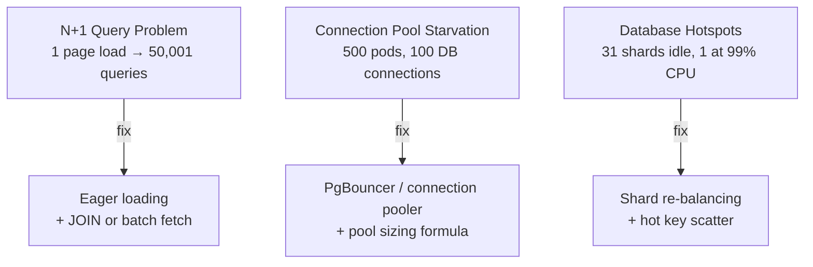

# Performance Bottlenecks

Performance problems at scale are usually not about raw speed — they're about resource starvation, inefficient access patterns, and hot spots that weren't visible at low traffic.

## Problems in This Section

| Problem | The Pain |
|---------|----------|
| [N+1 Query Problem](n-plus-one-query) | 1 page load → 50,001 database queries |
| [Connection Pool Starvation](connection-pool-starvation) | 500 pods, 100 DB connections, infinite wait |
| [Database Hotspots](database-hotspots) | 31 shards idle, 1 at 99% CPU |
