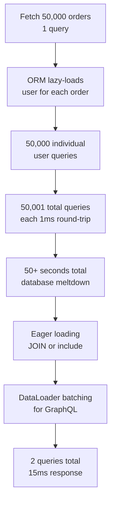
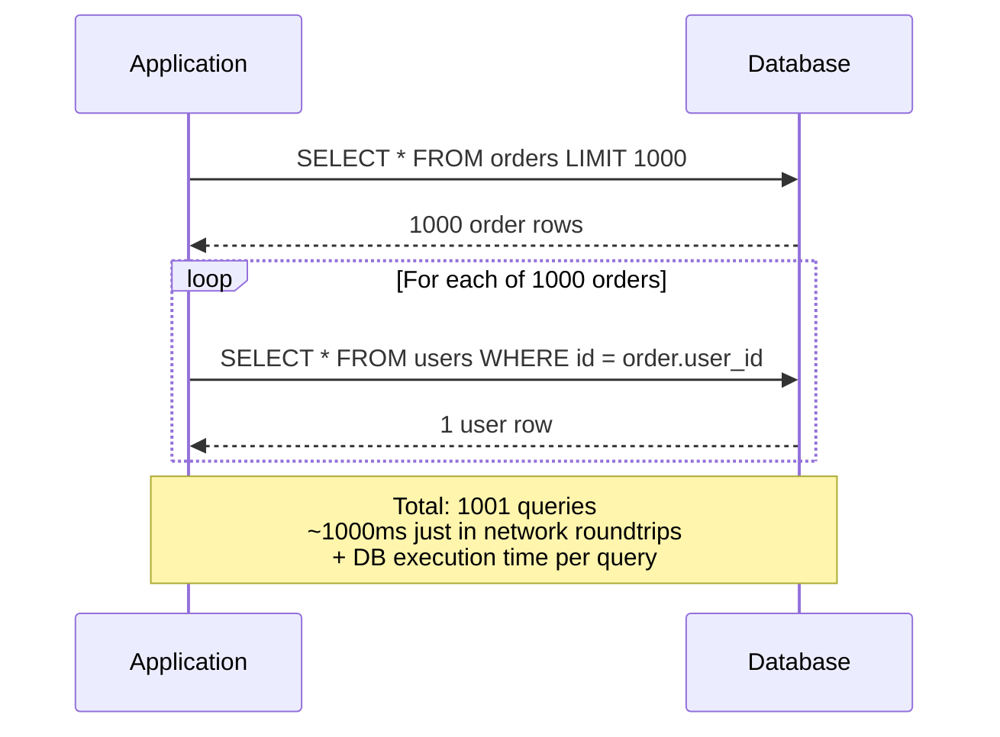
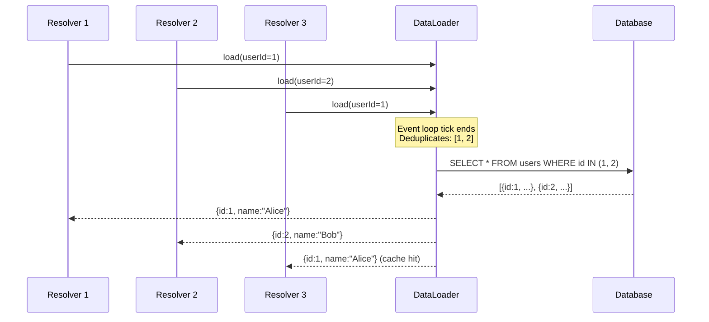

# N+1 Query Problem: 50,001 Queries Where You Expected 1

## 🗺️ Quick Overview


*Normal path: 1 query returns all data. Trigger: ORM lazy-loads related entities per row. Failure cascade: query count scales linearly with result set size, invisible in dev with small datasets.*

**A product listing page loads in 85ms on your laptop. In production with 50,000 products and 200 concurrent users, it takes 47 seconds and melts your database. You have 50,001 queries happening where you expected 1. The query plan looks fine. Indexes exist. The database itself isn't slow. The problem is that you're calling it 50,001 times. Welcome to the N+1 problem — the most common performance bug that ships to production and the one your ORM is most aggressively hiding from you.**

---

## The Problem Class `[Senior]`

The N+1 query problem is simple to describe and surprisingly hard to catch before it bites you in production. You fetch a list of N items with a single query. Then, for each item in the list, you execute an additional query to fetch some related data. That's 1 query for the list, plus N queries for the relations. 1 + N = N+1.

At scale, this is catastrophic. Fetching 1,000 orders with their associated user data takes 1,001 database round trips instead of 1. Each round trip has network latency — even in the same data center, that's typically 0.5–2ms. 1,001 round trips × 1ms = 1 full second of query time, serialized. Add connection acquisition overhead and you're looking at 3–5 seconds for what should be a 15ms query.

The insidious part: **your ORM is designed to make this invisible**. Lazy loading is a convenience feature that becomes a performance trap at scale. Every line of code that accesses a relation without explicit eager loading is a latent N+1 bug waiting for your dataset to grow.

---

## Why This Happens

### The Lazy Loading Trap

ORMs like Sequelize, TypeORM, and Rails ActiveRecord default to lazy loading relations. When you access `order.user`, the ORM executes a fresh `SELECT` against the database. This feels ergonomic. It's also a grenade.

```javascript
// This looks innocent
const orders = await Order.findAll(); // Query 1: SELECT * FROM orders
for (const order of orders) {
  console.log(order.user.name); // Query 2...N+1: SELECT * FROM users WHERE id = ?
}
```

In development with 20 orders, this runs 21 queries in ~50ms. You ship it. In production with 10,000 orders, it runs 10,001 queries in ~25 seconds. Your monitoring alerts on "slow API endpoint." You look at the query itself — it's fast. You never look at the query *count*.

### The Full Failure Sequence



### Why Monitoring Misses It

Most APM tools show you slow queries — queries that individually take a long time. N+1 queries are fast individually (they hit indexes). What you need is **query count per request**, not query duration. A request making 1001 queries at 1ms each looks like 1 second of "slow response." The individual queries don't appear in your slow query log.

---

## Real-World Impact

- **E-commerce product listing**: 1 query for products, 1 per product for category, 1 per product for seller, 1 per product for review count = 4N+1. With 500 products, that's 2001 queries.
- **Admin dashboards**: Listing users with subscription status, team membership, last login — each fetched separately.
- **GraphQL APIs without DataLoader**: Every field resolver executes independently. A `users { posts { comments { author } } }` query with 10 users, 5 posts each, 3 comments each = 10 + 50 + 150 + 150 = 361 queries.
- **Rails ActiveRecord** at Twitter circa 2009: Documented N+1 issues forced major architectural changes.
- **Django ORM**: `select_related` and `prefetch_related` exist precisely because lazy loading caused production fires.

---

## The Wrong Fix

### Caching User Objects In-Memory

```javascript
// Tempting. Wrong.
const userCache = {};
const orders = await Order.findAll();

for (const order of orders) {
  if (!userCache[order.userId]) {
    userCache[order.userId] = await User.findById(order.userId);
  }
  order.user = userCache[order.userId];
}
```

This deduplicates queries for the same user — if user 42 appears in 50 orders, you only fetch them once. It looks like an improvement. The problems:

1. **Memory blowup**: Cache all users referenced in a large dataset = unbounded memory growth.
2. **Stale data**: If a user updates their name mid-request (unlikely but possible under load), you serve stale data.
3. **Still N+1 for unique users**: If all 1000 orders are from different users, you still have 1000 queries.
4. **Doesn't compose**: You've now baked caching logic into your business logic. Every similar pattern needs the same treatment.

The real fix is to eliminate the loop entirely — fetch all related data in one shot.

---

## The Right Solutions

### Solution 1: SQL JOIN (Eager Loading)

The nuclear option. Fetch everything you need in a single query.

```sql
-- Fetch orders with their users in one query
SELECT
  orders.id,
  orders.total,
  orders.created_at,
  users.id AS user_id,
  users.name AS user_name,
  users.email AS user_email
FROM orders
JOIN users ON orders.user_id = users.id
WHERE orders.status = 'pending'
ORDER BY orders.created_at DESC
LIMIT 1000;
```

One query. One round trip. The database optimizes the join far better than your application can optimize 1001 separate queries.

**When to use**: When you always need the related data alongside the parent. When the join doesn't fan out (one-to-many can multiply rows — use LEFT JOIN carefully).

### Solution 2: Eager Loading at the ORM Level

Don't write raw SQL. Tell your ORM what to load upfront.

```javascript
// Sequelize — wrong way (lazy loading, N+1)
const orders = await Order.findAll({ where: { status: 'pending' } });
// Accessing order.User triggers N queries

// Sequelize — right way (eager loading, 1 query with JOIN or 2 queries with separate IN)
const orders = await Order.findAll({
  where: { status: 'pending' },
  include: [
    {
      model: User,
      attributes: ['id', 'name', 'email'],
    },
    {
      model: Product,
      attributes: ['id', 'name', 'price'],
      include: [{ model: Category, attributes: ['name'] }],
    },
  ],
});
// Sequelize executes 1-3 queries (JOIN or batched IN queries), not 1+N+N
```

```javascript
// Prisma — wrong way
const orders = await prisma.order.findMany();
for (const order of orders) {
  const user = await prisma.user.findUnique({ where: { id: order.userId } }); // N queries
}

// Prisma — right way
const orders = await prisma.order.findMany({
  include: {
    user: {
      select: { id: true, name: true, email: true },
    },
    items: {
      include: {
        product: {
          select: { id: true, name: true, price: true },
        },
      },
    },
  },
});
// Prisma executes batched queries, not per-row queries
```

### Solution 3: The DataLoader Pattern (Batch + Deduplicate)

DataLoader was built by Facebook/Meta to solve N+1 in GraphQL resolvers. The concept is universal: collect all the IDs you need across a batch window, then fetch them all at once with a single `WHERE id IN (...)` query.

```javascript
const DataLoader = require('dataloader');

// Define a batch function — receives an array of keys, returns array of values in same order
const userLoader = new DataLoader(async (userIds) => {
  console.log(`Batch loading ${userIds.length} users`); // This runs once per tick

  const users = await db.query(
    'SELECT * FROM users WHERE id = ANY($1)',
    [userIds]
  );

  // DataLoader requires results in the same order as keys
  const userMap = new Map(users.rows.map(u => [u.id, u]));
  return userIds.map(id => userMap.get(id) || null);
});

// Now use it in resolvers or loops — it batches automatically
async function getOrdersWithUsers(orderIds) {
  const orders = await Order.findAll({ where: { id: orderIds } });

  // All these calls happen in the same event loop tick
  // DataLoader collects all user IDs and makes ONE query
  const ordersWithUsers = await Promise.all(
    orders.map(async (order) => ({
      ...order.toJSON(),
      user: await userLoader.load(order.userId), // Batched! Not N+1
    }))
  );

  return ordersWithUsers;
}
```

**How DataLoader works:**



### Solution 4: GraphQL DataLoader Integration

```javascript
const { ApolloServer, gql } = require('apollo-server');
const DataLoader = require('dataloader');

const typeDefs = gql`
  type Order {
    id: ID!
    total: Float!
    user: User!
    items: [OrderItem!]!
  }
  type User {
    id: ID!
    name: String!
  }
  type Query {
    orders(status: String): [Order!]!
  }
`;

// Create loaders per request (never share loaders across requests — cache would serve stale data)
function createLoaders() {
  return {
    userLoader: new DataLoader(async (userIds) => {
      const users = await db.query(
        'SELECT * FROM users WHERE id = ANY($1::int[])',
        [userIds]
      );
      const map = new Map(users.rows.map(u => [u.id, u]));
      return userIds.map(id => map.get(id));
    }),

    orderItemsLoader: new DataLoader(async (orderIds) => {
      const items = await db.query(
        `SELECT oi.*, p.name as product_name, p.price
         FROM order_items oi
         JOIN products p ON oi.product_id = p.id
         WHERE oi.order_id = ANY($1::int[])`,
        [orderIds]
      );
      // Group by order_id
      const grouped = new Map();
      for (const item of items.rows) {
        if (!grouped.has(item.order_id)) grouped.set(item.order_id, []);
        grouped.get(item.order_id).push(item);
      }
      return orderIds.map(id => grouped.get(id) || []);
    }),
  };
}

const resolvers = {
  Query: {
    orders: (_, { status }, { db }) =>
      db.query('SELECT * FROM orders WHERE status = $1', [status]).then(r => r.rows),
  },
  Order: {
    // Without DataLoader: each order triggers a separate user query
    // With DataLoader: all user IDs batched into one query
    user: (order, _, { loaders }) => loaders.userLoader.load(order.user_id),
    items: (order, _, { loaders }) => loaders.orderItemsLoader.load(order.id),
  },
};

const server = new ApolloServer({
  typeDefs,
  resolvers,
  context: ({ req }) => ({
    db,
    loaders: createLoaders(), // Fresh loaders per request
  }),
});
```

### Solution 5: Raw SQL When ORMs Get in the Way

Sometimes the right answer is just writing the query yourself:

```javascript
// For complex multi-table fetches, raw SQL is often cleaner and faster
async function getOrderReport(dateFrom, dateTo) {
  const result = await db.query(`
    SELECT
      o.id AS order_id,
      o.total,
      o.status,
      o.created_at,
      u.id AS user_id,
      u.name AS user_name,
      u.email,
      COUNT(oi.id) AS item_count,
      STRING_AGG(p.name, ', ') AS product_names
    FROM orders o
    JOIN users u ON o.user_id = u.id
    LEFT JOIN order_items oi ON oi.order_id = o.id
    LEFT JOIN products p ON oi.product_id = p.id
    WHERE o.created_at BETWEEN $1 AND $2
    GROUP BY o.id, u.id
    ORDER BY o.created_at DESC
  `, [dateFrom, dateTo]);

  return result.rows;
}
// 1 query. Done.
```

---

## Detection

### 1. Log Query Count Per Request (Node.js + Sequelize)

```javascript
// Middleware to count queries per request
function queryCountMiddleware(sequelize) {
  return (req, res, next) => {
    let queryCount = 0;

    const listener = () => queryCount++;
    sequelize.addHook('beforeQuery', listener);

    const originalEnd = res.end;
    res.end = function (...args) {
      sequelize.removeHook('beforeQuery', listener);

      if (queryCount > 10) {
        console.warn(`HIGH QUERY COUNT: ${req.method} ${req.path} = ${queryCount} queries`);
        // Emit to metrics: statsd.gauge('queries_per_request', queryCount, { path: req.path })
      }

      res.setHeader('X-Query-Count', queryCount);
      return originalEnd.apply(this, args);
    };

    next();
  };
}
```

### 2. PostgreSQL: Find Repeated Similar Queries

```sql
-- pg_stat_statements — find queries executed hundreds of times per minute
SELECT
  query,
  calls,
  mean_exec_time,
  calls * mean_exec_time AS total_time_ms
FROM pg_stat_statements
WHERE query LIKE '%WHERE id =%'  -- Spot single-ID lookups
ORDER BY calls DESC
LIMIT 20;

-- If you see "SELECT * FROM users WHERE id = $1" with 50,000 calls/minute,
-- that's an N+1 somewhere.
```

### 3. EXPLAIN ANALYZE on Suspicious Queries

```sql
-- Find if a query is doing sequential scans instead of index scans
EXPLAIN (ANALYZE, BUFFERS, FORMAT JSON)
SELECT * FROM orders
JOIN users ON orders.user_id = users.id
WHERE orders.status = 'pending';

-- Look for: Seq Scan on large tables, high "Rows Removed by Filter",
-- nested loop joins on large tables
```

### 4. Datadog / New Relic APM

In Datadog APM, filter traces by `db.statement` and look for:
- Many spans with identical query shapes but different bind parameters
- A single trace containing hundreds of DB spans
- DB time >> application processing time on a single endpoint

---

## Prevention Patterns

### Write Query Count Assertions in Tests

```javascript
// Jest test — reject PRs that add N+1 queries
describe('OrderService.getOrdersWithUsers', () => {
  it('fetches orders without N+1 queries', async () => {
    // Seed 100 orders with 50 different users
    await seedOrders(100, { uniqueUsers: 50 });

    let queryCount = 0;
    const listener = () => queryCount++;
    sequelize.addHook('beforeQuery', listener);

    await orderService.getOrdersWithUsers({ status: 'pending' });

    sequelize.removeHook('beforeQuery', listener);

    // Should be 1-3 queries maximum (orders + users + maybe items)
    // NOT 101 queries
    expect(queryCount).toBeLessThan(5);
  });
});
```

### Lint Rules for ORM Patterns

```javascript
// ESLint custom rule: warn when .findAll() is not followed by include
// Or use existing rules from eslint-plugin-sequelize
// Alternatively: TypeScript strict mode can force you to declare which relations to load

// Prisma enforces this at the type level — accessing a relation
// that wasn't included is a TypeScript error
```

### Architecture Guardrails

- **GraphQL**: Always require DataLoader for any field that resolves from a parent ID. Code review checklist item.
- **REST**: Require `include` or `with` parameters to be explicit in service layer. Never access `.relation` on a model without knowing it was eagerly loaded.
- **Repository pattern**: Repositories accept an explicit list of relations to load. No surprise lazy loading.

---

## Checklist

- [ ] All ORM queries that loop over results and access relations use `include`/`with`/`select_related`
- [ ] GraphQL resolvers use DataLoader for any field that requires a DB lookup per parent
- [ ] Query count per request is logged and alerted above a threshold (e.g., > 20 queries/request)
- [ ] `pg_stat_statements` monitored for queries with high `calls` count and low `mean_exec_time` (N+1 signature)
- [ ] Test suite includes query count assertions for critical list-fetching paths
- [ ] Code review checklist includes "does this add N+1 queries?"
- [ ] Performance testing runs at production-scale row counts, not dev-scale

---

## Key Takeaways

The N+1 problem is not a database performance problem. It is an application architecture problem. Your database is executing every query you ask it to execute — correctly, efficiently, with indexes. The problem is you're asking it to execute 50,000 queries instead of 1.

The fix is always the same: **batch your reads**. Whether you use SQL JOINs, ORM eager loading, or the DataLoader pattern, the goal is to collect all the IDs you need before hitting the database, then retrieve everything in one shot.

The challenge is visibility. Your ORM hides the query count from you. Your monitoring shows slow queries, not high query counts. Your tests run against small datasets where 21 queries is fine. Build the tooling to see query count per request. Write tests that assert on query count. And treat any loop that accesses a relation without explicit eager loading as a bug.
