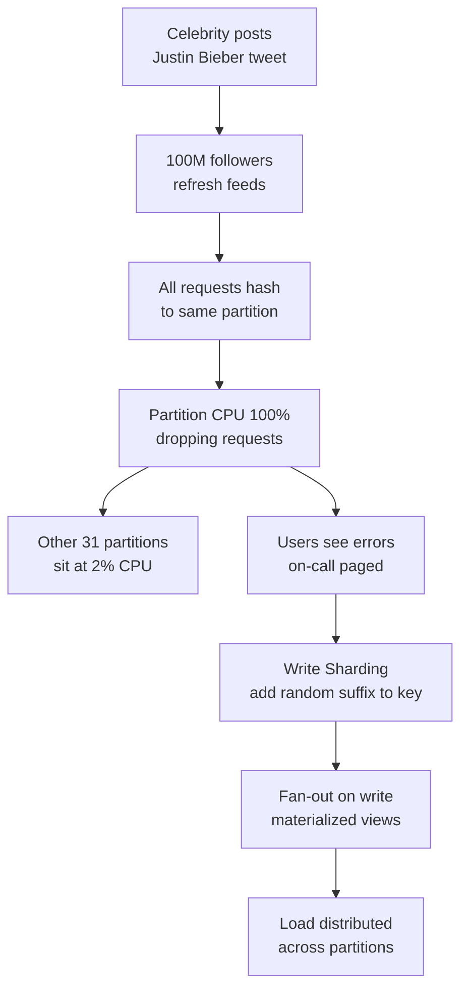
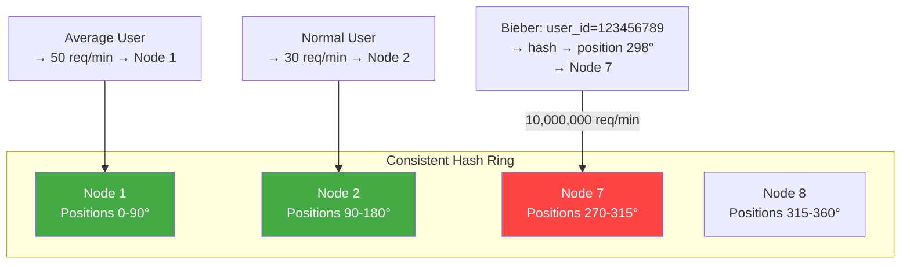

# Hot Partition / Celebrity Problem: When One User Breaks Your Database

## 🗺️ Quick Overview


*Normal path: hash(user_id) → balanced partition. Trigger: celebrity account generates 1000x average traffic. Failure cascade: horizontal scaling helpless — all hot-item traffic still maps to one node.*

**Justin Bieber posts a new photo. 100 million followers refresh their feeds in the next 60 seconds. All 100 million read requests hash to the same Cassandra partition — the one storing Bieber's user record and recent posts. That partition's CPU hits 100%. Cassandra starts dropping requests. Bieber's fans see errors. Your on-call engineer's phone starts ringing. Your "horizontally scalable" database has a single point of failure hiding in plain sight: popular people. This is the celebrity problem, and it has taken down more production systems than any database bug.**

---

## The Problem Class `[Senior]`

Horizontal scaling assumes traffic is uniformly distributed across your data. In social systems, media platforms, and e-commerce, it almost never is. A tiny fraction of users — celebrities, influencers, viral products — generate orders of magnitude more traffic than the average user.

When your partition key doesn't account for this skew, all traffic for a hot entity concentrates on a single partition node. The other nodes sit idle while the hot node burns. Adding more nodes doesn't help: your partition key maps the celebrity's data to one specific node, not to all nodes.

This is fundamentally different from general scalability. You can scale to handle 100M requests/minute across your entire system. But if 10M of those requests go to one partition, that partition needs to handle 10M requests/minute alone — and it can't.

---

## Why This Happens

### Hash-Based Partitioning Maps Keys, Not Load

Consistent hashing distributes your key space uniformly across nodes. Each node "owns" a range of the hash ring. Bieber's user_id (say, 123456789) hashes to position X on the ring, which maps to Node 7. All data for user 123456789 lives on Node 7. All reads for user 123456789 go to Node 7.



Adding Node 9, 10, 11 doesn't help. Bieber's data doesn't move to new nodes unless you rebalance — and even after rebalancing, all of Bieber's traffic still goes to whichever one node now owns that hash range.

### The Fanout Problem

In a social feed, when a user with 100M followers posts something, how do followers see it? Two approaches:

**Pull model (fan-in-on-read)**: When User B opens their feed, the system reads all the people User B follows, fetches their recent posts, merges them into a feed, and returns it. The problem: this runs a massive join/scatter-gather on every feed load. And for a follower of a celebrity, one of those scatter-gather nodes is the celebrity's hot partition.

**Push model (fan-out-on-write)**: When Bieber posts, immediately write his post to the timeline of all 100M followers. Each follower's feed is pre-computed. The problem: writing to 100M user timelines takes time, memory, and capacity.

Both models have a celebrity problem — just at different points in the stack.

---

## Real-World Impact

**Twitter (2012)**: The "Bieber problem" — Justin Bieber's tweets caused timeline infrastructure failures. Initially used a pull model where timeline reads aggregated from the user being followed. Bieber's partition was hit by 100M read requests on each tweet. Led to the Fanout service, which pre-distributes posts to follower timelines at write time — but skips this for accounts with > ~1M followers (they remain on the pull model with heavy caching).

**Instagram**: Used user_id sharding. Celebrity accounts with 100M+ followers caused hotspots on their shards. Moved to a more sophisticated graph-based approach where celebrity data is replicated differently than regular user data.

**DynamoDB**: AWS explicitly documents the hot partition problem. If a partition key has very high request rates, DynamoDB will eventually split the partition — but the split may not happen fast enough to prevent throttling. Hot key throttling is the #1 DynamoDB support issue.

**TikTok**: Viral video hot partitions — a video that gets 50M views in an hour concentrates reads on one storage partition. Solved with aggressive CDN layering and multi-region replication of hot content.

---

## The Wrong Fix

### Add More Partitions

```javascript
// Before: 100 partitions
const partitionId = hash(userId) % 100;

// After: 1000 partitions
const partitionId = hash(userId) % 1000;
```

More partitions distribute keys more granularly, but Bieber's user_id still hashes to one specific partition (now out of 1000 instead of 100). The partition might be smaller, but it still receives all of Bieber's traffic. The hot partition problem is unchanged.

### Limit Request Rate Per User

Rate limiting Bieber's followers is not a viable product solution. You can't tell users "you can't refresh your feed because you follow a celebrity."

---

## The Right Solutions

### Solution 1: Write Sharding — Scatter Writes, Gather Reads

For hot write keys (counters, event streams, popularity scores), shard the key by adding a random suffix. Writes scatter across N virtual partitions. Reads aggregate across all N partitions.

```javascript
const WRITE_SHARDS = 50; // Number of virtual shards per hot key

class WriteShardedCounter {
  constructor(redisClient) {
    this.redis = redisClient;
  }

  // Write: pick random shard — spreads write load 50x
  async increment(baseKey, amount = 1) {
    const shardIndex = Math.floor(Math.random() * WRITE_SHARDS);
    const shardedKey = `${baseKey}:shard:${shardIndex}`;
    return this.redis.incrby(shardedKey, amount);
  }

  // Read: gather from all shards and sum
  async getTotal(baseKey) {
    const shardKeys = Array.from(
      { length: WRITE_SHARDS },
      (_, i) => `${baseKey}:shard:${i}`
    );

    const values = await this.redis.mget(...shardKeys);
    return values.reduce((sum, v) => sum + (parseInt(v, 10) || 0), 0);
  }
}

// Usage: post like counter
const counter = new WriteShardedCounter(redis);
await counter.increment('post:bieber:789:likes', 1);
const totalLikes = await counter.getTotal('post:bieber:789:likes');
```

**Best for**: Write-heavy hot keys (counters, event streams). The scatter-gather read is more expensive than a single key read — only use when write rate justifies it.

### Solution 2: Hot Key Detection and Dynamic Caching

Detect which keys are receiving disproportionate traffic and automatically route them through a cache layer. Normal keys hit the database. Hot keys hit Redis.

```javascript
const HOT_KEY_THRESHOLD = 1000; // req/min to be "hot"
const HOT_KEY_WINDOW_MS = 60 * 1000;
const HOT_KEY_CACHE_TTL = 10; // 10 seconds — short enough to stay reasonably fresh

class AdaptiveHotKeyRouter {
  constructor(db, redis) {
    this.db = db;
    this.redis = redis;
    this.requestCounts = new Map();
    this.hotKeys = new Set();

    setInterval(() => {
      this.requestCounts.clear();
      // Hot keys decay — don't keep them hot forever
      for (const key of this.hotKeys) {
        const count = this.requestCounts.get(key) || 0;
        if (count < HOT_KEY_THRESHOLD / 2) {
          this.hotKeys.delete(key);
        }
      }
    }, HOT_KEY_WINDOW_MS);
  }

  track(key) {
    const count = (this.requestCounts.get(key) || 0) + 1;
    this.requestCounts.set(key, count);

    if (count >= HOT_KEY_THRESHOLD) {
      if (!this.hotKeys.has(key)) {
        console.log(`Hot key detected: ${key} (${count} req/min) — routing to cache`);
        this.hotKeys.add(key);
      }
    }

    return this.hotKeys.has(key);
  }

  async get(key, fetchFn) {
    const isHot = this.track(key);

    if (isHot) {
      const cacheKey = `hot:${key}`;
      const cached = await this.redis.get(cacheKey);
      if (cached) return JSON.parse(cached);

      const data = await fetchFn();
      await this.redis.setex(cacheKey, HOT_KEY_CACHE_TTL, JSON.stringify(data));
      return data;
    }

    return fetchFn();
  }
}

// Usage
const router = new AdaptiveHotKeyRouter(db, redis);

app.get('/user/:userId', async (req, res) => {
  const user = await router.get(
    `user:${req.params.userId}`,
    () => db.query('SELECT * FROM users WHERE id = $1', [req.params.userId]).then(r => r.rows[0])
  );
  res.json(user);
});
```

### Solution 3: Materialized Fan-Out at Write Time

When a celebrity posts, pre-write their content to each follower's personal partition. Reads always come from the follower's own shard — never from the celebrity's shard.

```javascript
const CELEBRITY_THRESHOLD = 1_000_000; // 1M followers = celebrity

async function publishPost(authorId, post) {
  // Step 1: Always write to author's own partition
  await db.insertPost(authorId, post);

  const followerCount = await getFollowerCount(authorId);

  if (followerCount <= CELEBRITY_THRESHOLD) {
    // Normal user: followers use pull model (read from author's shard on feed load)
    // This is fine — non-celebrities don't cause hot partitions
    return;
  }

  // Celebrity: push post to all followers' partitions immediately
  // This is expensive at write time but distributes the read load
  await fanOutToFollowers(authorId, post);
}

async function fanOutToFollowers(authorId, post) {
  const BATCH_SIZE = 1000;
  let cursor = null;

  do {
    const { followers, nextCursor } = await getFollowersBatch(authorId, cursor, BATCH_SIZE);

    // Write post to each follower's timeline shard
    await Promise.all(
      followers.map(followerId =>
        timelineStore.writeToTimeline(followerId, {
          postId: post.id,
          authorId,
          content: post.content,
          createdAt: post.createdAt,
        })
      )
    );

    cursor = nextCursor;
  } while (cursor);
}

async function getTimeline(userId) {
  // Always reads from THIS USER'S shard — never from anyone else's
  // Celebrity posts were written here at post time
  return timelineStore.readTimeline(userId, { limit: 20 });
}
```

**Trade-offs**: Fan-out to 100M followers takes time (minutes for very large accounts). Use async workers/queues for the fan-out. New followers won't see very recent posts until fan-out completes. Some systems skip fan-out for accounts with > 10M followers and fall back to a hybrid pull+cache model for those.

### Solution 4: Tiered Caching for Celebrity Content

Put celebrity content in multiple cache tiers — CDN edge nodes, regional Redis clusters, local in-process caches. The database only serves cache misses, and cache misses are extremely rare for actively viewed celebrity content.

```javascript
class TieredCelebCache {
  constructor({ localTTL = 5, redisTTL = 30, cdnTTL = 60 } = {}) {
    this.localCache = new Map(); // In-process, expires every `localTTL` seconds
    this.redis = redisClient;
    this.localTTL = localTTL;
    this.redisTTL = redisTTL;
    this.cdnTTL = cdnTTL;

    // Clean local cache every localTTL seconds
    setInterval(() => this.localCache.clear(), localTTL * 1000);
  }

  async get(userId, fetchFn) {
    const key = `user:${userId}:profile`;

    // Tier 1: local in-process cache (nanoseconds)
    const local = this.localCache.get(key);
    if (local) return local;

    // Tier 2: Redis (microseconds)
    const cached = await this.redis.get(key);
    if (cached) {
      const data = JSON.parse(cached);
      this.localCache.set(key, data); // Warm local cache
      return data;
    }

    // Tier 3: Database (milliseconds)
    const data = await fetchFn();
    await this.redis.setex(key, this.redisTTL, JSON.stringify(data));
    this.localCache.set(key, data);

    // Tier 4: Instruct CDN to cache this response
    // (Done via Cache-Control headers in the HTTP response)
    return data;
  }
}
```

### Solution 5: Partition Splitting and Adaptive Scaling

Modern databases like DynamoDB and Google Spanner can automatically split hot partitions. Enable this where available and configure it with appropriate thresholds.

```javascript
// DynamoDB: Use high-cardinality partition keys + sort keys
// Bad: { pk: "BIEBER", ... }  → all Bieber data on one partition
// Good: { pk: "USER#123456789", sk: "POST#2026-03-20T12:00:00Z" }
//        Different sort keys distribute across time-based partitions

// For read replicas of hot Cassandra partitions:
const cassandraConfig = {
  contactPoints: ['cassandra-1', 'cassandra-2', 'cassandra-3'],
  localDataCenter: 'us-east-1',
  pooling: {
    local: {
      coreConnectionsPerHost: 4,
      maxConnectionsPerHost: 8,
    },
  },
  // Route reads to nearest replica — don't force coordinator reads
  readConsistency: 'LOCAL_ONE',
};
```

---

## Detection

### Find Hot Partitions in Cassandra

```bash
# nodetool tpstats — see if one node has dramatically more requests
nodetool tpstats

# nodetool cfstats — per-table read/write counts per node
nodetool cfstats keyspace.table

# On each node, check for hot partition keys:
# (Cassandra 4.0+)
nodetool toppartitions keyspace tablename 10 10000
# Shows top N most-accessed partition keys in last N milliseconds
```

### DynamoDB Hot Partition Detection

```bash
# CloudWatch metrics: look for ConsumedReadCapacityUnits or ConsumedWriteCapacityUnits
# spiking on specific partitions. Enable DynamoDB Contributor Insights:
aws dynamodb update-contributor-insights \
  --table-name YourTable \
  --contributor-insights-action ENABLE

# Then query CloudWatch for top N partition keys by access count
```

### Application-Level Detection

```javascript
// Log all partition accesses and aggregate
function trackPartitionAccess(partitionKey) {
  metrics.increment('partition.access', { partition: partitionKey });
  // In Datadog: alert when any single partition_key tag exceeds 10x average
}
```

---

## Prevention Patterns

1. **Analyze access patterns before choosing partition keys**: Run `SELECT partition_key, COUNT(*) FROM access_logs GROUP BY partition_key ORDER BY COUNT(*) DESC LIMIT 100` to find your celebrities before they become production incidents.
2. **Use compound partition keys** that include a high-cardinality component: `(tenant_id, user_id)` distributes better than just `user_id`.
3. **Design fan-out strategy during data modeling**, not during the incident. The celebrity problem is predictable — model for it.
4. **Monitor per-partition metrics individually**, not just aggregate DB load. A 10% average CPU hides one partition at 100%.
5. **Load test with a simulated celebrity**: Flood one specific partition key during load testing to see what happens.

---

## Checklist

- [ ] Partition keys have high cardinality and uniform traffic distribution (not just uniform key distribution)
- [ ] Fan-out strategy designed before launch for any system with follower/subscriber semantics
- [ ] Hot key detection and adaptive caching in place
- [ ] Per-partition metrics monitored independently (not just averages)
- [ ] Load tests simulate hot partition scenarios (concentrate traffic on one key)
- [ ] Cassandra/DynamoDB contributor insights or equivalent enabled
- [ ] Tiered caching in front of partitions that could receive celebrity-level traffic

---

## Key Takeaways

The celebrity problem is a specific instance of the hot partition problem: traffic distribution is not uniform, and your partition strategy doesn't account for the outliers. Adding nodes doesn't help because the hot entity maps to one node regardless of how many nodes you have.

The solutions are architectural: detect hot keys and route them through caches before they hit the database, pre-distribute celebrity content to follower partitions at write time, or shard the hot key itself across multiple virtual partitions.

The time to solve this is before your first celebrity joins your platform. Twitter solved it reactively — in production, under load, with the "Bieber problem" actively causing outages. Design for non-uniform traffic from day one.
