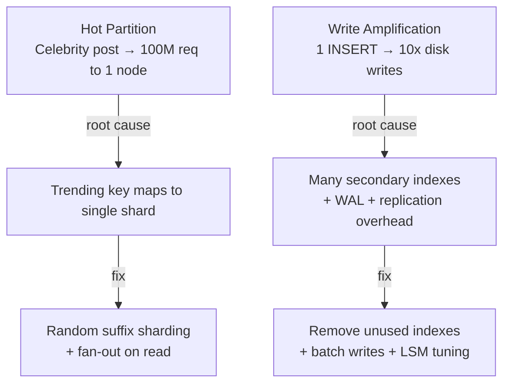

# Scalability & Hot Spots

Adding more nodes doesn't always help when your data or traffic is unevenly distributed. These problems describe what happens when scaling creates new bottlenecks.

## Problems in This Section

| Problem | The Pain |
|---------|----------|
| [Hot Partition](hot-partition) | Celebrity post routes 100M requests to 1 node |
| [Write Amplification](write-amplification) | One INSERT triggers 10x physical disk writes |
