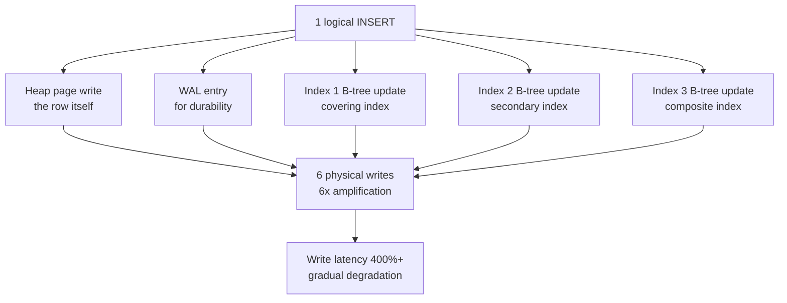
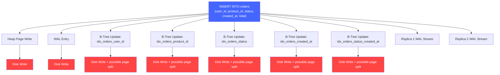

# Write Amplification: When Optimization Makes Things 10x Slower

## 🗺️ Quick Overview


*Normal path: 1 INSERT = 1 physical write. Trigger: each additional index multiplies disk I/O. Failure cascade: gradual write latency increase goes unnoticed until system is 10x slower.*

**You add an index to speed up reads. Your read latency drops 80%. Everyone is happy. Two months later, your write latency has increased 400% and you can't figure out why. A teammate adds two more indexes for their query patterns. Now writes are taking 8 seconds. You have a new hire who adds a covering index for a report query. Writes hit 15 seconds. One INSERT is now updating 6 B-trees, writing to the WAL 6 times, syncing to disk 6 times. Your "optimization" made your system 10× slower for writes, and nobody noticed because the degradation was gradual and the people who added indexes never looked at write performance. This is write amplification — and it quietly kills write-heavy systems.**

---

## The Problem Class `[Senior]`

Write amplification is the ratio of physical I/O operations to logical write operations. Ideally, writing one row triggers one physical write. In practice, every secondary index, write-ahead log entry, and replica sync multiplies that.

The math is unforgiving:

```
Logical write:  1 row INSERT

Physical writes:
  - 1 heap page write (the row itself)
  - 1 WAL entry (durability guarantee)
  - N index updates (one per index, each a B-tree node split/update)
  - M replica sync messages (one per synchronous replica)
  - 1 autovacuum table bloat (dead row tracking)

Total physical writes = 1 + 1 + N + M + 1 = 3 + N + M
```

With 5 indexes and 2 synchronous replicas: `3 + 5 + 2 = 10` physical writes per logical write. Your I/O subsystem is doing 10× more work than you'd expect. This compounds with update operations, which must write the new value AND maintain consistency in every index.

---

## Why This Happens

### Every Index Is a Write Tax

A database index is a separate data structure (typically a B-tree) maintained in parallel with the heap. Every time you write a row, the database must update every index that covers any of the modified columns.



One logical write, seven physical disk operations. Each disk operation has latency (even SSDs: ~100 microseconds per random write). Each B-tree node update may trigger a page split, which cascades into more writes.

### WAL: The Price of Durability

The Write-Ahead Log is PostgreSQL's durability mechanism. Before any data page is modified, the change is written to the WAL. On crash, the WAL is replayed to restore the DB to a consistent state. You cannot turn this off — it's what makes PostgreSQL ACID-compliant.

Every write generates a WAL entry. Every WAL entry is synced to disk before the transaction commits (if `synchronous_commit = on`). WAL entries are also streamed to replicas.

For a transaction that updates 1 row across 5 indexes:
- 1 WAL entry for heap change
- Up to 5 WAL entries for index changes
- = 6 WAL records flushed to disk per transaction

### B-Trees: Sequential vs Random I/O

B-tree indexes are balanced trees. Inserting a value may require splitting a node and updating parent pointers. This is not sequential I/O — it's random I/O that jumps around the index file. Random I/O is significantly slower than sequential I/O, even on SSDs.

As a table grows, B-tree nodes become more spread across disk. Index maintenance becomes increasingly expensive because node pages are no longer hot in the buffer pool.

### LSM-Trees: Write Amplification at Compaction Time

LSM (Log-Structured Merge-tree) databases like Cassandra, RocksDB, and LevelDB take a different approach: batch writes into memory (memtable), flush sequentially to disk (SSTable), and periodically compact SSTables. This makes writes fast (sequential) but causes write amplification during compaction:

```
Compaction: Read L1 SSTable (1GB) + Read L2 SSTable (5GB)
            → Merge and sort → Write new L2 SSTable (6GB)
Write amplification: wrote 6GB to compact 1GB of new data
```

RocksDB's write amplification factor (WAF) during steady-state compaction is typically 10–30× — every logical byte written results in 10–30 bytes of physical I/O due to compaction.

---

## Real-World Impact

- **Event log tables**: High-velocity INSERT workloads. Every secondary index doubles or triples write time. A system inserting 10,000 events/second with 4 indexes effectively does 40,000 B-tree operations/second.
- **E-commerce order tables**: Indexes on `user_id`, `status`, `created_at`, `product_id`, `merchant_id` — all perfectly reasonable for read queries. On high-write days (Black Friday), every order INSERT updates 5 B-trees. Write latency spikes.
- **Cassandra time-series writes**: Compaction write amplification causes periodic write latency spikes as the compaction process consumes I/O bandwidth.
- **PostgreSQL WAL archiving + streaming replication**: For each write, data must be written locally (WAL) and streamed to all replicas. A cluster with 3 synchronous replicas multiplies write I/O by 4×.

---

## The Wrong Fix

### Just Add More Database Storage

Bigger disks or faster SSDs improve I/O throughput. They don't reduce write amplification — you're still doing N writes per logical write. You've just made each write faster. You haven't fixed the root cause.

### Move to Async Replication

Switching synchronous replicas to async reduces latency (the primary doesn't wait for replica confirmation) but doesn't reduce index maintenance overhead. You've addressed one component of write amplification at the cost of consistency.

---

## The Right Solutions

### Solution 1: Audit and Remove Unused Indexes

Every index is a tax on writes. An unused index is a write tax that buys you nothing.

```sql
-- Find indexes that haven't been used since last stats reset
SELECT
  schemaname,
  tablename,
  indexname,
  idx_scan AS scans,
  idx_tup_read AS tuples_read,
  pg_size_pretty(pg_relation_size(indexrelid)) AS index_size
FROM pg_stat_user_indexes
WHERE idx_scan = 0
  AND NOT indisprimary  -- Don't drop primary keys
ORDER BY pg_relation_size(indexrelid) DESC;

-- Reset stats to get a fresh reading
SELECT pg_stat_reset();
-- Wait 1-2 weeks, then run the query above
-- Zero-scan indexes are likely safe to drop

-- Before dropping: verify the index isn't used by a specific query plan
EXPLAIN SELECT * FROM orders WHERE status = 'pending';
-- If you don't see "Index Scan using idx_orders_status" in this EXPLAIN output,
-- the index isn't being used for this query
```

```sql
-- Drop a suspected unused index (use CONCURRENTLY to avoid table lock)
DROP INDEX CONCURRENTLY idx_orders_status;
```

### Solution 2: Partial Indexes — Index Only Rows That Matter

If your queries only ever filter on a subset of rows, create a partial index covering only those rows. Fewer rows in the index = smaller index = faster maintenance.

```sql
-- Full index: ALL rows must be indexed (even completed/cancelled orders)
CREATE INDEX idx_orders_status ON orders(status);  -- Indexes 10M rows

-- Partial index: only active orders (the ones queries actually filter on)
CREATE INDEX idx_orders_pending ON orders(status, created_at)
WHERE status IN ('pending', 'processing');  -- Indexes only 50k rows

-- Every INSERT of a completed order no longer updates this index
-- Every INSERT of a pending order still updates it
-- Maintenance cost is proportional to the WHERE clause hit rate
```

```javascript
// In your application code, make sure queries can use the partial index
// The query predicate must match the index predicate
const pendingOrders = await db.query(`
  SELECT * FROM orders
  WHERE status = 'pending'  -- matches partial index WHERE clause
    AND created_at > NOW() - INTERVAL '7 days'
`);
```

### Solution 3: Delayed Index Builds for Bulk Loads

When inserting large volumes of data (migrations, backups, bulk imports), maintain indexes is extremely expensive during the insert. Drop indexes before the bulk load, re-create them after.

```javascript
async function bulkLoadOrders(orders) {
  // Step 1: Drop secondary indexes (keep primary key)
  await db.query('DROP INDEX CONCURRENTLY IF EXISTS idx_orders_user_id');
  await db.query('DROP INDEX CONCURRENTLY IF EXISTS idx_orders_status');
  await db.query('DROP INDEX CONCURRENTLY IF EXISTS idx_orders_created_at');

  // Step 2: Bulk insert without index overhead
  const start = Date.now();
  await db.query('COPY orders FROM STDIN WITH CSV');  // Or use pg-copy-streams
  // Or INSERT with batch size of 1000 per transaction
  for (let i = 0; i < orders.length; i += 1000) {
    const batch = orders.slice(i, i + 1000);
    const values = batch.map((o, j) => `($${j*5+1}, $${j*5+2}, $${j*5+3}, $${j*5+4}, $${j*5+5})`).join(',');
    await db.query(`INSERT INTO orders (user_id, product_id, status, total, created_at) VALUES ${values}`,
      batch.flatMap(o => [o.userId, o.productId, o.status, o.total, o.createdAt])
    );
  }
  console.log(`Bulk insert: ${Date.now() - start}ms`);

  // Step 3: Rebuild indexes after insert (CREATE INDEX CONCURRENTLY = no table lock)
  await db.query('CREATE INDEX CONCURRENTLY idx_orders_user_id ON orders(user_id)');
  await db.query('CREATE INDEX CONCURRENTLY idx_orders_status ON orders(status, created_at)');
  await db.query('CREATE INDEX CONCURRENTLY idx_orders_created_at ON orders(created_at)');
}
```

For PostgreSQL, `CREATE INDEX CONCURRENTLY` allows reads and writes to proceed during index build at the cost of taking longer and using more resources.

### Solution 4: Write-Optimized Storage Engines

For write-heavy workloads, use storage engines optimized for sequential writes.

**RocksDB / LevelDB**: LSM-tree based. Writes are sequential (memtable → SSTable). Read amplification is traded for write throughput. Used by: Cassandra, TiKV, Yugabyte.

**PostgreSQL's BRIN indexes**: For naturally ordered data (timestamps, sequential IDs), use BRIN (Block Range Index) instead of B-tree. BRIN stores only min/max per block range — tiny index, trivial write overhead.

```sql
-- BRIN index for time-series data (orders by created_at)
-- Ideal when rows are physically stored in approximately chronological order
CREATE INDEX idx_orders_created_brin ON orders USING BRIN(created_at);
-- Size: ~8KB vs ~500MB for equivalent B-tree on 10M rows
-- Write overhead: near-zero (just updates min/max of current block range)
-- Query performance: good for range scans on sorted data, poor for point lookups
```

### Solution 5: CQRS — Separate Write and Read Models

Command Query Responsibility Segregation: the write model has minimal indexes (just what's needed for constraint checking and writes). The read model is a separately-maintained projection optimized for reads, built asynchronously from the write events.

```javascript
const { Kafka } = require('kafkajs');

// WRITE MODEL: minimal indexes, optimized for writes
// Table: orders_write (user_id, product_id, status, total, created_at)
// Indexes: PRIMARY KEY only — no secondary indexes
async function createOrder(order) {
  // Fast write — only updates primary key index
  const result = await writeDb.query(
    'INSERT INTO orders_write (user_id, product_id, status, total, created_at) VALUES ($1,$2,$3,$4,$5) RETURNING id',
    [order.userId, order.productId, order.status, order.total, new Date()]
  );

  // Publish event for async read model projection
  await producer.send({
    topic: 'order-events',
    messages: [{ value: JSON.stringify({ type: 'ORDER_CREATED', order: { id: result.rows[0].id, ...order } }) }],
  });

  return result.rows[0].id;
}

// READ MODEL PROJECTOR: runs asynchronously, builds heavily-indexed read tables
consumer.run({
  eachMessage: async ({ message }) => {
    const event = JSON.parse(message.value.toString());

    if (event.type === 'ORDER_CREATED') {
      // Write to read model — this DB is optimized for reads, not writes
      // Heavy indexing here is fine — it's separated from the write path
      await readDb.query(
        `INSERT INTO orders_read
         (id, user_id, user_name, product_id, product_name, status, total, created_at)
         VALUES ($1,$2,$3,$4,$5,$6,$7,$8)`,
        [event.order.id, /* ... joined data ... */]
      );
    }
  },
});

// READ QUERIES: from the read model — all indexes available, no write pressure
async function getOrdersByUser(userId) {
  return readDb.query(
    'SELECT * FROM orders_read WHERE user_id = $1 ORDER BY created_at DESC',
    [userId]
  );
}
```

---

## Detection

### Measure Write Amplification in PostgreSQL

```sql
-- pg_stat_user_tables: how many physical I/O operations per logical write?
SELECT
  relname AS table_name,
  n_tup_ins AS inserts,
  n_tup_upd AS updates,
  n_tup_del AS deletes,
  n_tup_ins + n_tup_upd + n_tup_del AS total_writes,
  heap_blks_written AS heap_pages_written,
  ROUND(
    heap_blks_written::numeric / NULLIF(n_tup_ins + n_tup_upd + n_tup_del, 0),
    2
  ) AS write_amplification_ratio
FROM pg_stat_user_tables
WHERE n_tup_ins + n_tup_upd + n_tup_del > 0
ORDER BY heap_blks_written DESC;

-- Monitor WAL generation rate (bytes/second)
SELECT
  pg_current_wal_lsn() - '0/0' AS total_wal_bytes,
  pg_size_pretty(pg_current_wal_lsn() - '0/0') AS wal_generated;
-- Run this twice with a delay and calculate the delta

-- Index bloat check: how much space is wasted in indexes?
SELECT
  indexname,
  pg_size_pretty(pg_relation_size(indexrelid)) AS index_size,
  idx_scan,
  ROUND(100 * idx_scan::numeric / NULLIF(seq_scan + idx_scan, 0), 1) AS index_usage_pct
FROM pg_stat_user_indexes
JOIN pg_indexes USING (indexname)
ORDER BY pg_relation_size(indexrelid) DESC;
```

### Application-Level Write Timing

```javascript
// Instrument every write operation with latency tracking
async function instrumentedWrite(operation, query, params) {
  const start = Date.now();
  try {
    const result = await db.query(query, params);
    const duration = Date.now() - start;

    metrics.timing('db.write.duration', duration, { operation });

    if (duration > 100) { // Alert on writes taking > 100ms
      logger.warn('Slow write operation', { operation, duration, query: query.slice(0, 100) });
    }

    return result;
  } catch (err) {
    metrics.increment('db.write.error', { operation });
    throw err;
  }
}
```

---

## Prevention Patterns

1. **Index review gate in code review**: Every new index must be justified with a query that uses it and a measurement of how often that query runs. No index without a use case.
2. **Index naming convention**: Include the column names in the index name (`idx_orders_user_id_created_at`). Makes it obvious what each index covers and whether it overlaps with another.
3. **Benchmark writes before and after adding an index**: Run your write benchmark, add the index, run it again. The write latency increase is the cost of the index.
4. **Separate OLTP and OLAP workloads**: Heavy analytical queries that need 15 indexes belong in a separate analytics database (Redshift, BigQuery, ClickHouse), not your production OLTP database where every index degrades writes.
5. **Set a maximum index count per table**: Anything over 6–8 indexes on a write-heavy table is a red flag.

---

## Checklist

- [ ] All existing indexes have documented use cases (which query benefits from each index)
- [ ] Unused indexes identified with `pg_stat_user_indexes` and scheduled for removal
- [ ] Partial indexes used wherever possible (not all rows need to be indexed)
- [ ] Write benchmark run before and after each new index addition
- [ ] BRIN indexes used for time-series/sequential data instead of B-tree
- [ ] WAL generation rate monitored as a write amplification proxy metric
- [ ] High-write tables evaluated for CQRS pattern (write model with minimal indexes)
- [ ] Bulk load procedures drop and recreate indexes to avoid per-row index maintenance

---

## Key Takeaways

Write amplification is the hidden cost of every "optimization" you make for read performance. Each index you add is a write tax. Each synchronous replica multiplies your write I/O. The cost is gradual and invisible — no individual write is slow enough to trigger an alert, but the cumulative degradation over months turns a 5ms write into a 500ms write.

The discipline required is to treat index creation as a trade-off decision, not an optimization. You're not speeding up reads for free — you're trading write performance for read performance. Sometimes this trade is excellent. Sometimes it's catastrophic for your write-heavy workload.

Monitor your write latency trends, audit your indexes regularly, and ensure that every index in production is earning its write tax by providing measurable read value. An index that nobody queries is costing you write performance and giving you nothing in return.
